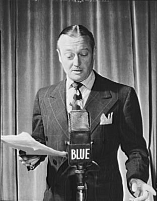

<!--
CO_OP_TRANSLATOR_METADATA:
{
  "original_hash": "6d6aa1be033625d201a190fc9c5cbfb4",
  "translation_date": "2025-08-25T17:51:53+00:00",
  "source_file": "6-consumer/lessons/1-speech-recognition/README.md",
  "language_code": "it"
}
-->
# Riconoscere il parlato con un dispositivo IoT


> Sketchnote di [Nitya Narasimhan](https://github.com/nitya). Clicca sull'immagine per una versione più grande.

Questo video offre una panoramica del servizio di riconoscimento vocale di Azure, un argomento che verrà trattato in questa lezione:

[](https://www.youtube.com/watch?v=iW0Fw0l3mrA)

> 🎥 Clicca sull'immagine sopra per guardare il video

## Quiz preliminare alla lezione

[Quiz preliminare alla lezione](https://black-meadow-040d15503.1.azurestaticapps.net/quiz/41)

## Introduzione

'Alexa, imposta un timer di 12 minuti'

'Alexa, stato del timer'

'Alexa, imposta un timer di 8 minuti chiamato cuoci broccoli a vapore'

I dispositivi intelligenti stanno diventando sempre più diffusi. Non solo come altoparlanti intelligenti come HomePods, Echos e Google Homes, ma anche integrati nei nostri telefoni, orologi, e persino nei lampadari e termostati.

> 💁 Ho almeno 19 dispositivi nella mia casa che hanno assistenti vocali, e questi sono solo quelli di cui sono consapevole!

Il controllo vocale aumenta l'accessibilità permettendo alle persone con mobilità limitata di interagire con i dispositivi. Che si tratti di una disabilità permanente, come essere nati senza braccia, o di disabilità temporanee, come braccia rotte, o avere le mani occupate con la spesa o bambini piccoli, poter controllare la nostra casa con la voce invece che con le mani apre un mondo di possibilità. Gridare 'Ehi Siri, chiudi la porta del garage' mentre si gestisce un cambio di pannolino e un bambino turbolento può essere un piccolo ma efficace miglioramento della vita.

Uno degli usi più popolari degli assistenti vocali è impostare timer, soprattutto timer da cucina. Essere in grado di impostare più timer solo con la voce è un grande aiuto in cucina - non c'è bisogno di interrompere l'impasto, mescolare la zuppa, o pulire le mani sporche di ripieno per usare un timer fisico.

In questa lezione imparerai a integrare il riconoscimento vocale nei dispositivi IoT. Imparerai a conoscere i microfoni come sensori, come catturare audio da un microfono collegato a un dispositivo IoT e come utilizzare l'AI per convertire ciò che viene ascoltato in testo. Durante il resto di questo progetto costruirai un timer da cucina intelligente, in grado di impostare timer usando la tua voce in più lingue.

In questa lezione tratteremo:

* [Microfoni](../../../../../6-consumer/lessons/1-speech-recognition)
* [Catturare audio dal tuo dispositivo IoT](../../../../../6-consumer/lessons/1-speech-recognition)
* [Da parlato a testo](../../../../../6-consumer/lessons/1-speech-recognition)
* [Convertire il parlato in testo](../../../../../6-consumer/lessons/1-speech-recognition)

## Microfoni

I microfoni sono sensori analogici che convertono le onde sonore in segnali elettrici. Le vibrazioni nell'aria causano movimenti minimi nei componenti del microfono, che generano piccole variazioni nei segnali elettrici. Queste variazioni vengono amplificate per generare un output elettrico.

### Tipi di microfoni

I microfoni sono disponibili in una varietà di tipi:

* Dinamico - I microfoni dinamici hanno un magnete attaccato a un diaframma mobile che si muove in una bobina di filo creando una corrente elettrica. Questo è l'opposto della maggior parte degli altoparlanti, che utilizzano una corrente elettrica per muovere un magnete in una bobina di filo, muovendo un diaframma per creare suono. Questo significa che gli altoparlanti possono essere usati come microfoni dinamici, e i microfoni dinamici possono essere usati come altoparlanti. In dispositivi come gli interfono, dove un utente ascolta o parla, ma non entrambi, un dispositivo può fungere sia da altoparlante che da microfono.

    I microfoni dinamici non necessitano di alimentazione per funzionare, il segnale elettrico è generato interamente dal microfono.

    

* A nastro - I microfoni a nastro sono simili ai microfoni dinamici, ma hanno un nastro metallico invece di un diaframma. Questo nastro si muove in un campo magnetico generando una corrente elettrica. Come i microfoni dinamici, i microfoni a nastro non necessitano di alimentazione per funzionare.

    

* Condensatore - I microfoni a condensatore hanno un diaframma metallico sottile e una piastra posteriore metallica fissa. L'elettricità viene applicata a entrambi e, mentre il diaframma vibra, la carica statica tra le piastre cambia generando un segnale. I microfoni a condensatore necessitano di alimentazione per funzionare - chiamata *Phantom power*.

    

* MEMS - I microfoni a sistemi microelettromeccanici, o MEMS, sono microfoni su chip. Hanno un diaframma sensibile alla pressione inciso su un chip di silicio e funzionano in modo simile a un microfono a condensatore. Questi microfoni possono essere minuscoli e integrati nei circuiti.

    

    Nell'immagine sopra, il chip etichettato **LEFT** è un microfono MEMS, con un diaframma minuscolo largo meno di un millimetro.

✅ Fai una ricerca: Quali microfoni hai intorno a te - nel tuo computer, telefono, cuffie o in altri dispositivi? Che tipo di microfoni sono?

### Audio digitale

L'audio è un segnale analogico che trasporta informazioni molto dettagliate. Per convertire questo segnale in digitale, l'audio deve essere campionato migliaia di volte al secondo.

> 🎓 Il campionamento consiste nel convertire il segnale audio in un valore digitale che rappresenta il segnale in quel momento.


L'audio digitale viene campionato utilizzando la modulazione a codice di impulsi, o PCM. PCM consiste nel leggere la tensione del segnale e selezionare il valore discreto più vicino a quella tensione utilizzando una dimensione definita.

> 💁 Puoi pensare al PCM come la versione sensoriale della modulazione a larghezza di impulso, o PWM (PWM è stata trattata nella [lezione 3 del progetto introduttivo](../../../1-getting-started/lessons/3-sensors-and-actuators/README.md#pulse-width-modulation)). PCM consiste nel convertire un segnale analogico in digitale, PWM consiste nel convertire un segnale digitale in analogico.

Ad esempio, la maggior parte dei servizi di streaming musicale offre audio a 16-bit o 24-bit. Questo significa che convertono la tensione in un valore che si adatta a un intero a 16-bit o a 24-bit. L'audio a 16-bit si adatta a un numero che va da -32.768 a 32.767, mentre quello a 24-bit va da −8.388.608 a 8.388.607. Più bit ci sono, più il campione si avvicina a ciò che le nostre orecchie effettivamente sentono.

> 💁 Potresti aver sentito parlare di audio a 8-bit, spesso chiamato LoFi. Questo è audio campionato utilizzando solo 8-bit, quindi da -128 a 127. Il primo audio per computer era limitato a 8-bit a causa delle limitazioni hardware, quindi è spesso visto nei giochi retrò.

Questi campioni vengono presi migliaia di volte al secondo, utilizzando frequenze di campionamento ben definite misurate in KHz (migliaia di letture al secondo). I servizi di streaming musicale utilizzano 48KHz per la maggior parte dell'audio, ma alcuni audio 'lossless' utilizzano fino a 96KHz o persino 192KHz. Più alta è la frequenza di campionamento, più l'audio si avvicina all'originale, fino a un certo punto. C'è dibattito sul fatto che gli esseri umani possano distinguere la differenza sopra i 48KHz.

✅ Fai una ricerca: Se utilizzi un servizio di streaming musicale, quale frequenza di campionamento e dimensione utilizza? Se utilizzi CD, qual è la frequenza di campionamento e la dimensione dell'audio su CD?

Esistono diversi formati per i dati audio. Probabilmente hai sentito parlare di file mp3 - dati audio compressi per renderli più piccoli senza perdere qualità. L'audio non compresso è spesso memorizzato come file WAV - un file con 44 byte di informazioni di intestazione, seguito da dati audio grezzi. L'intestazione contiene informazioni come la frequenza di campionamento (ad esempio 16000 per 16KHz) e la dimensione del campione (16 per 16-bit), e il numero di canali. Dopo l'intestazione, il file WAV contiene i dati audio grezzi.

> 🎓 I canali si riferiscono a quanti flussi audio diversi compongono l'audio. Ad esempio, per l'audio stereo con sinistra e destra, ci sarebbero 2 canali. Per il suono surround 7.1 di un sistema home theater, ci sarebbero 8.

### Dimensione dei dati audio

I dati audio sono relativamente grandi. Ad esempio, catturare audio non compresso a 16-bit e 16KHz (una frequenza sufficiente per l'uso con modelli di riconoscimento vocale) richiede 32KB di dati per ogni secondo di audio:

* 16-bit significa 2 byte per campione (1 byte è 8 bit).
* 16KHz è 16.000 campioni al secondo.
* 16.000 x 2 byte = 32.000 byte al secondo.

Questo può sembrare una quantità di dati piccola, ma se stai utilizzando un microcontrollore con memoria limitata, può essere molto. Ad esempio, il Wio Terminal ha 192KB di memoria, e questa deve memorizzare il codice del programma e le variabili. Anche se il tuo codice fosse minuscolo, non potresti catturare più di 5 secondi di audio.

I microcontrollori possono accedere a memoria aggiuntiva, come schede SD o memoria flash. Quando costruisci un dispositivo IoT che cattura audio, dovrai assicurarti non solo di avere memoria aggiuntiva, ma che il tuo codice scriva l'audio catturato dal microfono direttamente su quella memoria, e quando lo invii al cloud, lo trasmetta dalla memoria alla richiesta web. In questo modo puoi evitare di esaurire la memoria cercando di mantenere l'intero blocco di dati audio in memoria contemporaneamente.

## Catturare audio dal tuo dispositivo IoT

Il tuo dispositivo IoT può essere collegato a un microfono per catturare audio, pronto per la conversione in testo. Può anche essere collegato a altoparlanti per riprodurre audio. Nelle lezioni successive questo sarà utilizzato per fornire feedback audio, ma è utile configurare gli altoparlanti ora per testare il microfono.

### Attività - configura il tuo microfono e altoparlanti

Segui la guida pertinente per configurare il microfono e gli altoparlanti per il tuo dispositivo IoT:

* [Arduino - Wio Terminal](wio-terminal-microphone.md)
* [Computer a scheda singola - Raspberry Pi](pi-microphone.md)
* [Computer a scheda singola - Dispositivo virtuale](virtual-device-microphone.md)

### Attività - cattura audio

Segui la guida pertinente per catturare audio sul tuo dispositivo IoT:

* [Arduino - Wio Terminal](wio-terminal-audio.md)
* [Computer a scheda singola - Raspberry Pi](pi-audio.md)
* [Computer a scheda singola - Dispositivo virtuale](virtual-device-audio.md)

## Da parlato a testo

Da parlato a testo, o riconoscimento vocale, consiste nell'utilizzare l'AI per convertire le parole in un segnale audio in testo.

### Modelli di riconoscimento vocale

Per convertire il parlato in testo, i campioni del segnale audio vengono raggruppati e inseriti in un modello di machine learning basato su una rete neurale ricorrente (RNN). Questo è un tipo di modello di machine learning che può utilizzare dati precedenti per prendere decisioni sui dati in arrivo. Ad esempio, l'RNN potrebbe rilevare un blocco di campioni audio come il suono 'Hel', e quando riceve un altro che pensa sia il suono 'lo', può combinare questo con il suono precedente, trovare che 'Hello' è una parola valida e selezionarla come risultato.

I modelli di ML accettano sempre dati della stessa dimensione ogni volta. Il classificatore di immagini che hai costruito in una lezione precedente ridimensiona le immagini a una dimensione fissa e le elabora. Lo stesso vale per i modelli di parlato, devono elaborare blocchi audio di dimensioni fisse. I modelli di parlato devono essere in grado di combinare gli output di più previsioni per ottenere la risposta, per permettere di distinguere tra 'Hi' e 'Highway', o 'flock' e 'floccinaucinihilipilification'.

I modelli di parlato sono anche abbastanza avanzati da comprendere il contesto e possono correggere le parole che rilevano man mano che vengono elaborati più suoni. Ad esempio, se dici "Sono andato al negozio per comprare due banane e una mela anche", useresti tre parole che suonano uguali ma sono scritte diversamente - to, two e too. I modelli di parlato sono in grado di comprendere il contesto e utilizzare l'ortografia appropriata della parola.
💁 Alcuni servizi di sintesi vocale consentono personalizzazioni per funzionare meglio in ambienti rumorosi come fabbriche, o con termini specifici di settore come nomi chimici. Queste personalizzazioni vengono addestrate fornendo audio di esempio e una trascrizione, e funzionano utilizzando l'apprendimento per trasferimento, proprio come hai addestrato un classificatore di immagini utilizzando solo alcune immagini in una lezione precedente.
### Privacy

Quando si utilizza il riconoscimento vocale in un dispositivo IoT per consumatori, la privacy è estremamente importante. Questi dispositivi ascoltano continuamente l'audio, quindi, come consumatore, non vuoi che tutto ciò che dici venga inviato al cloud e convertito in testo. Non solo questo consumerebbe molta larghezza di banda Internet, ma avrebbe anche enormi implicazioni per la privacy, specialmente quando alcuni produttori di dispositivi smart selezionano casualmente audio per [essere validati da esseri umani rispetto al testo generato per migliorare il loro modello](https://www.theverge.com/2019/4/10/18305378/amazon-alexa-ai-voice-assistant-annotation-listen-private-recordings).

Vuoi che il tuo dispositivo smart invii audio al cloud per l'elaborazione solo quando lo stai utilizzando, non quando rileva audio nella tua casa, audio che potrebbe includere riunioni private o interazioni intime. Il modo in cui la maggior parte dei dispositivi smart funziona è con una *parola di attivazione*, una frase chiave come "Alexa", "Hey Siri" o "OK Google" che fa 'svegliare' il dispositivo e ascoltare ciò che stai dicendo fino a quando rileva una pausa nel tuo discorso, indicando che hai finito di parlare con il dispositivo.

> 🎓 Il rilevamento della parola di attivazione è anche noto come *Keyword spotting* o *Keyword recognition*.

Queste parole di attivazione vengono rilevate sul dispositivo, non nel cloud. Questi dispositivi smart hanno piccoli modelli di intelligenza artificiale che funzionano sul dispositivo e ascoltano la parola di attivazione, e quando viene rilevata, iniziano a trasmettere l'audio al cloud per il riconoscimento. Questi modelli sono molto specializzati e si concentrano solo sull'ascolto della parola di attivazione.

> 💁 Alcune aziende tecnologiche stanno aggiungendo maggiore privacy ai loro dispositivi e stanno eseguendo parte della conversione da voce a testo direttamente sul dispositivo. Apple ha annunciato che, come parte degli aggiornamenti iOS e macOS del 2021, supporterà la conversione da voce a testo sul dispositivo e sarà in grado di gestire molte richieste senza dover utilizzare il cloud. Questo è possibile grazie ai potenti processori nei loro dispositivi che possono eseguire modelli di machine learning.

✅ Quali pensi siano le implicazioni etiche e di privacy della memorizzazione dell'audio inviato al cloud? Questo audio dovrebbe essere memorizzato, e se sì, come? Pensi che l'uso delle registrazioni per le forze dell'ordine sia un buon compromesso rispetto alla perdita di privacy?

Il rilevamento della parola di attivazione di solito utilizza una tecnica nota come TinyML, che consiste nel convertire i modelli di machine learning per poter essere eseguiti su microcontrollori. Questi modelli sono di piccole dimensioni e consumano pochissima energia per funzionare.

Per evitare la complessità di addestrare e utilizzare un modello di parola di attivazione, il timer smart che stai costruendo in questa lezione utilizzerà un pulsante per attivare il riconoscimento vocale.

> 💁 Se vuoi provare a creare un modello di rilevamento della parola di attivazione da eseguire su Wio Terminal o Raspberry Pi, dai un'occhiata a questo [tutorial su come rispondere alla tua voce di Edge Impulse](https://docs.edgeimpulse.com/docs/responding-to-your-voice). Se vuoi utilizzare il tuo computer per farlo, puoi provare il [quickstart per Custom Keyword sui Microsoft Docs](https://docs.microsoft.com/azure/cognitive-services/speech-service/keyword-recognition-overview?WT.mc_id=academic-17441-jabenn).

## Convertire voce in testo


Proprio come per la classificazione delle immagini in un progetto precedente, esistono servizi di intelligenza artificiale predefiniti che possono prendere la voce come file audio e convertirla in testo. Uno di questi servizi è il Servizio Vocale, parte dei Cognitive Services, servizi di intelligenza artificiale predefiniti che puoi utilizzare nelle tue applicazioni.

### Attività - configurare una risorsa AI per il riconoscimento vocale

1. Crea un Gruppo di Risorse per questo progetto chiamato `smart-timer`.

1. Usa il seguente comando per creare una risorsa vocale gratuita:

    ```sh
    az cognitiveservices account create --name smart-timer \
                                        --resource-group smart-timer \
                                        --kind SpeechServices \
                                        --sku F0 \
                                        --yes \
                                        --location <location>
    ```

    Sostituisci `<location>` con la posizione che hai utilizzato quando hai creato il Gruppo di Risorse.

1. Avrai bisogno di una chiave API per accedere alla risorsa vocale dal tuo codice. Esegui il seguente comando per ottenere la chiave:

    ```sh
    az cognitiveservices account keys list --name smart-timer \
                                           --resource-group smart-timer \
                                           --output table
    ```

    Copia una delle chiavi.

### Attività - convertire voce in testo

Segui la guida pertinente per convertire la voce in testo sul tuo dispositivo IoT:

* [Arduino - Wio Terminal](wio-terminal-speech-to-text.md)
* [Computer a scheda singola - Raspberry Pi](pi-speech-to-text.md)
* [Computer a scheda singola - Dispositivo virtuale](virtual-device-speech-to-text.md)

---

## 🚀 Sfida

Il riconoscimento vocale esiste da molto tempo ed è in continuo miglioramento. Fai una ricerca sulle capacità attuali e confronta come si sono evolute nel tempo, inclusa la precisione delle trascrizioni automatiche rispetto a quelle umane.

Cosa pensi riservi il futuro per il riconoscimento vocale?

## Quiz post-lezione

[Quiz post-lezione](https://black-meadow-040d15503.1.azurestaticapps.net/quiz/42)

## Revisione e studio autonomo

* Leggi sui diversi tipi di microfoni e su come funzionano nell'[articolo sulla differenza tra microfoni dinamici e a condensatore su Musician's HQ](https://musicianshq.com/whats-the-difference-between-dynamic-and-condenser-microphones/).
* Approfondisci il Servizio Vocale dei Cognitive Services nella [documentazione sul servizio vocale su Microsoft Docs](https://docs.microsoft.com/azure/cognitive-services/speech-service/?WT.mc_id=academic-17441-jabenn).
* Leggi sul rilevamento delle parole chiave nella [documentazione sul riconoscimento delle parole chiave su Microsoft Docs](https://docs.microsoft.com/azure/cognitive-services/speech-service/keyword-recognition-overview?WT.mc_id=academic-17441-jabenn).

## Compito

[](assignment.md)

**Disclaimer**:  
Questo documento è stato tradotto utilizzando il servizio di traduzione automatica [Co-op Translator](https://github.com/Azure/co-op-translator). Sebbene ci impegniamo per garantire l'accuratezza, si prega di tenere presente che le traduzioni automatiche possono contenere errori o imprecisioni. Il documento originale nella sua lingua nativa dovrebbe essere considerato la fonte autorevole. Per informazioni critiche, si raccomanda una traduzione professionale effettuata da un traduttore umano. Non siamo responsabili per eventuali incomprensioni o interpretazioni errate derivanti dall'uso di questa traduzione.