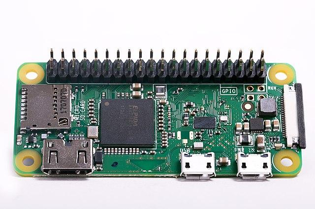

<!--
CO_OP_TRANSLATOR_METADATA:
{
  "original_hash": "9dd7f645ad1c6f20b72fee512987f772",
  "translation_date": "2025-08-24T23:44:24+00:00",
  "source_file": "1-getting-started/lessons/2-deeper-dive/README.md",
  "language_code": "ja"
}
-->
# IoTの深掘り

> スケッチノート作成者: [Nitya Narasimhan](https://github.com/nitya)。画像をクリックすると拡大版が表示されます。

このレッスンは、[Microsoft Reactor](https://developer.microsoft.com/reactor/?WT.mc_id=academic-17441-jabenn)の[Hello IoTシリーズ](https://youtube.com/playlist?list=PLmsFUfdnGr3xRts0TIwyaHyQuHaNQcb6-)の一環として教えられました。このレッスンは2つの動画で構成されており、1時間のレッスンと、レッスンの内容をさらに深掘りし質問に答える1時間のオフィスアワーで構成されています。

> 🎥 上の画像をクリックして動画を視聴してください

## レクチャー前のクイズ

[レクチャー前のクイズ](https://black-meadow-040d15503.1.azurestaticapps.net/quiz/3)

## はじめに

このレッスンでは、前回のレッスンで取り上げた概念のいくつかをさらに深掘りします。

このレッスンで学ぶ内容は以下の通りです：

* [IoTアプリケーションの構成要素](../../../../../1-getting-started/lessons/2-deeper-dive)
* [マイクロコントローラーの深掘り](../../../../../1-getting-started/lessons/2-deeper-dive)
* [シングルボードコンピュータの深掘り](../../../../../1-getting-started/lessons/2-deeper-dive)

## IoTアプリケーションの構成要素

IoTアプリケーションの構成要素は、*インターネット*と*モノ*の2つです。この2つの構成要素について、もう少し詳しく見ていきましょう。

### モノ（Thing）

IoTの**モノ（Thing）**部分は、物理的な世界とやり取りできるデバイスを指します。これらのデバイスは通常、小型で低価格のコンピュータであり、低速で動作し、低電力を使用します。例えば、数キロバイトのRAM（PCのギガバイトとは対照的）を持ち、数百メガヘルツ（PCのギガヘルツとは対照的）で動作するシンプルなマイクロコントローラーが挙げられます。これらは非常に少ない電力で動作するため、バッテリーで数週間、数ヶ月、さらには数年も稼働することが可能です。

これらのデバイスは、センサーを使用して周囲のデータを収集したり、出力やアクチュエータを制御して物理的な変化を引き起こしたりすることで、物理的な世界とやり取りします。典型的な例としては、スマートサーモスタットがあります。このデバイスには温度センサー、ダイヤルやタッチスクリーンなどの希望温度を設定する手段、そして希望温度範囲外の場合に暖房や冷房システムをオンにするための接続が備わっています。温度センサーが部屋が寒すぎることを検知すると、アクチュエータが暖房をオンにします。

IoTデバイスとして機能するものは非常に多岐にわたります。特定の機能に特化したハードウェアから、汎用デバイス、さらにはスマートフォンまで含まれます。スマートフォンは、センサーを使用して周囲の世界を検知し、アクチュエータを使用して世界とやり取りすることができます。例えば、GPSセンサーを使用して位置を検知し、スピーカーを使用して目的地へのナビゲーション指示を提供することができます。

✅ あなたの周りにある、センサーからデータを読み取り、それを基に意思決定を行うシステムを考えてみてください。一例としては、オーブンのサーモスタットが挙げられます。他にも見つけられるでしょうか？

### インターネット

IoTアプリケーションの**インターネット**側は、IoTデバイスがデータを送受信するために接続するアプリケーションや、IoTデバイスからのデータを処理してアクチュエータに送るリクエストを決定するのを助ける他のアプリケーションで構成されます。

典型的なセットアップとしては、IoTデバイスが接続するクラウドサービスがあり、このクラウドサービスがセキュリティの管理や、IoTデバイスからのメッセージの受信、デバイスへのメッセージの送信を行います。このクラウドサービスはさらに、センサーデータを処理または保存する他のアプリケーションや、他のシステムからのデータと組み合わせて意思決定を行うアプリケーションに接続します。

デバイスは必ずしもWiFiや有線接続を介して直接インターネットに接続するわけではありません。一部のデバイスは、Bluetoothなどの技術を使用してメッシュネットワークを介して互いに通信し、インターネット接続を持つハブデバイスを介して接続します。

スマートサーモスタットの例では、サーモスタットは家庭のWiFiを使用してクラウド上のクラウドサービスに接続します。このクラウドサービスに温度データを送信し、そこからデータベースに書き込まれ、スマートフォンアプリを使用して現在および過去の温度を確認できるようになります。クラウド内の別のサービスが、ユーザーが希望する温度を把握し、クラウドサービスを介してIoTデバイスにメッセージを送り、暖房システムをオンまたはオフにするよう指示します。

さらにスマートなバージョンでは、クラウド内のAIが、他のIoTデバイスに接続された占有センサー（どの部屋が使用されているかを検知するセンサー）などの他のセンサーからのデータや、天気、さらにはカレンダーのデータを使用して、スマートに温度を設定する意思決定を行うことができます。例えば、カレンダーから休暇中であることを読み取って暖房をオフにしたり、使用する部屋に応じて部屋ごとに暖房をオフにしたりすることができます。このようなデータから学習し、時間とともにますます正確になることができます。

✅ インターネット接続されたサーモスタットをよりスマートにするために役立つ他のデータは何でしょうか？

### エッジでのIoT

IoTの"I"はインターネットを意味しますが、これらのデバイスが必ずしもインターネットに接続する必要はありません。場合によっては、デバイスがローカルネットワーク上で動作する「エッジ」デバイス（ゲートウェイデバイス）に接続し、インターネットを介さずにデータを処理することができます。これにより、大量のデータがある場合やインターネット接続が遅い場合に高速化が可能になり、船舶上や人道的危機への対応時など、インターネット接続が不可能な場所でオフラインで動作することができます。また、データをプライベートに保つことも可能です。一部のデバイスは、クラウドツールを使用して作成された処理コードを含み、これをローカルで実行してインターネット接続を使用せずにデータを収集し応答します。

一例として、Apple HomePod、Amazon Alexa、Google Homeなどのスマートホームデバイスがあります。これらのデバイスは、クラウドでトレーニングされたAIモデルを使用して音声を認識しますが、ローカルで実行されます。これらのデバイスは特定の単語やフレーズが話されたときに「起動」し、その後に音声をインターネット経由で処理のために送信します。デバイスは、音声の一時停止を検知した時点で音声の送信を停止します。デバイスを起動するウェイクワードが話される前に言ったことや、デバイスがリスニングを停止した後に言ったことは、デバイスプロバイダーに送信されず、したがってプライベートに保たれます。

✅ プライバシーが重要で、データの処理をクラウドではなくエッジで行う方が良いシナリオを考えてみてください。ヒント：カメラやその他のイメージングデバイスを搭載したIoTデバイスを考えてみてください。

### IoTセキュリティ

インターネット接続がある場合、セキュリティは重要な考慮事項です。「IoTの'S'はセキュリティを意味する」という古いジョークがありますが、これはIoTに'S'が含まれていないことを暗示しており、つまりセキュリティが不十分であることを示唆しています。

IoTデバイスはクラウドサービスに接続しますが、そのセキュリティはクラウドサービスのセキュリティに依存します。クラウドサービスが任意のデバイスの接続を許可する場合、悪意のあるデータが送信されたり、ウイルス攻撃が行われたりする可能性があります。IoTデバイスは他のデバイスとやり取りし制御するため、これには非常に現実的な影響があります。例えば、[Stuxnetワーム](https://wikipedia.org/wiki/Stuxnet)は遠心分離機のバルブを操作して損傷を与えました。また、ハッカーが[セキュリティの不備を利用してベビーモニターにアクセスした](https://www.npr.org/sections/thetwo-way/2018/06/05/617196788/s-c-mom-says-baby-monitor-was-hacked-experts-say-many-devices-are-vulnerable)事例もあります。

> 💁 IoTデバイスやエッジデバイスがインターネットから完全に隔離されたネットワークで動作する場合があります。これを[エアギャップ](https://wikipedia.org/wiki/Air_gap_(networking))と呼びます。

## マイクロコントローラーの深掘り

前回のレッスンではマイクロコントローラーを紹介しました。ここでは、それをさらに深掘りしていきます。

### CPU

CPUはマイクロコントローラーの「頭脳」です。これはコードを実行し、接続されたデバイスからデータを送受信するプロセッサです。CPUは1つ以上のコアを含むことができ、これらのコアは協力してコードを実行します。

CPUは、毎秒何百万回または何十億回も刻むクロックに依存しています。このクロックの1回の刻み（サイクル）は、CPUが実行できるアクションを同期させます。各刻みで、CPUはプログラムからの命令を実行できます。例えば、外部デバイスからデータを取得したり、数学的な計算を行ったりします。この規則的なサイクルにより、すべてのアクションが次の命令が処理される前に完了することが保証されます。

クロックサイクルが速いほど、1秒間に処理できる命令が増え、CPUの速度が速くなります。CPUの速度は[ヘルツ（Hz）](https://wikipedia.org/wiki/Hertz)という単位で測定され、1Hzは1秒間に1回のサイクルまたはクロック刻みを意味します。

> 🎓 CPUの速度は通常、MHzまたはGHzで表されます。1MHzは100万Hz、1GHzは10億Hzです。

> 💁 CPUは[フェッチ-デコード-実行サイクル](https://wikipedia.org/wiki/Instruction_cycle)を使用してプログラムを実行します。クロックの各刻みで、CPUはメモリから次の命令をフェッチし、それをデコードして実行します。例えば、算術論理ユニット（ALU）を使用して2つの数値を加算するなどです。一部の実行は複数の刻みを必要とするため、次のサイクルは命令が完了した後の次の刻みで実行されます。

マイクロコントローラーのクロックスピードは、デスクトップやノートパソコン、さらにはほとんどのスマートフォンよりもはるかに低いです。例えば、Wio TerminalのCPUは120MHz、つまり1秒間に120,000,000サイクルで動作します。

✅ 一般的なPCやMacのCPUは、複数のコアを持ち、複数のギガヘルツで動作します。あなたのコンピュータのクロックスピードを調べ、Wio Terminalと比較してどれだけ速いかを確認してください。

各クロックサイクルは電力を消費し、熱を発生させます。刻みが速いほど、消費電力が増え、発生する熱も増えます。PCにはヒートシンクやファンがあり、これらがなければ数秒で過熱してシャットダウンしてしまいます。一方、マイクロコントローラーは通常、これらを持たず、はるかに低速で動作するため、発熱が少なくなります。PCは電源や大容量バッテリーで数時間動作しますが、マイクロコントローラーは小型バッテリーで数日、数ヶ月、さらには数年動作することができます。また、マイクロコントローラーには異なる速度で動作するコアが含まれることがあり、CPUの負荷が低いときに低速の低電力コアに切り替えることで、消費電力を削減します。

> 💁 一部のPCやMacも、同様に高速で高電力のコアと低速で低電力のコアを組み合わせて採用しており、タスクに応じてバッテリー寿命や速度を最適化しています。例えば、最新のAppleラップトップに搭載されているM1チップは、4つのパフォーマンスコアと4つの効率コアを切り替えて使用します。

✅ 少し調べてみましょう：[WikipediaのCPUに関する記事](https://wikipedia.org/wiki/Central_processing_unit)を読んでみてください。

#### タスク

Wio Terminalを調査してみましょう。

これらのレッスンでWio Terminalを使用している場合、CPUを探してみてください。[Wio Terminal製品ページ](https://www.seeedstudio.com/Wio-Terminal-p-4509.html)の*ハードウェア概要*セクションで内部の写真を見つけ、背面の透明なプラスチック窓を通してCPUを探してみてください。

### メモ
🎓 プログラムメモリはコードを保存し、電源が切れても保持されます。
🎓 RAMはプログラムを実行するために使用され、電源が切れるとリセットされます

CPUと同様に、マイクロコントローラーのメモリはPCやMacに比べて桁違いに小さいです。典型的なPCは8ギガバイト（GB）のRAM、つまり8,000,000,000バイトを持ち、各バイトは1文字や0〜255の数字を保存するのに十分なスペースを持っています。一方、マイクロコントローラーはキロバイト（KB）のRAMしか持たず、1キロバイトは1,000バイトです。上記で紹介したWio Terminalは192KBのRAM、つまり192,000バイトを持っています。これは平均的なPCの40,000分の1以下です！

以下の図は192KBと8GBの相対的なサイズの違いを示しています。中央の小さな点が192KBを表しています。

プログラムの保存容量もPCより小さいです。典型的なPCはプログラム保存用に500GBのハードドライブを持っていますが、マイクロコントローラーはキロバイト、または数メガバイト（MB）の保存容量しか持たないことがあります（1MBは1,000KB、つまり1,000,000バイト）。Wio Terminalは4MBのプログラム保存容量を持っています。

✅ 少し調べてみましょう: あなたがこの文章を読んでいるコンピューターのRAMと保存容量はどれくらいですか？それをマイクロコントローラーと比較してみてください。

### 入出力

マイクロコントローラーはセンサーからデータを読み取ったり、アクチュエーターに制御信号を送るために入出力（I/O）接続が必要です。通常、いくつかの汎用入出力（GPIO）ピンを含んでいます。これらのピンはソフトウェアで入力（信号を受け取る）または出力（信号を送る）として設定できます。

🧠⬅️ 入力ピンはセンサーから値を読み取るために使用されます

🧠➡️ 出力ピンはアクチュエーターに指示を送るために使用されます

✅ 次のレッスンでこれについてさらに学びます。

#### 課題

Wio Terminalを調査してみましょう。

これらのレッスンでWio Terminalを使用している場合、GPIOピンを探してみてください。[Wio Terminal製品ページ](https://www.seeedstudio.com/Wio-Terminal-p-4509.html)の*Pinout diagram*セクションを見て、どのピンがどれに対応しているかを学びましょう。Wio Terminalにはピン番号が記載されたステッカーが付属しているので、まだ貼っていない場合は今貼り付けてください。

### 物理的なサイズ

マイクロコントローラーは通常サイズが小さく、最小のものは[Freescale Kinetis KL03 MCU](https://www.edn.com/tiny-arm-cortex-m0-based-mcu-shrinks-package/)で、ゴルフボールのくぼみに収まるほど小さいです。PCのCPUだけでも40mm x 40mmのサイズがあり、これは冷却ファンやヒートシンクを含まない場合のサイズです。これらはCPUが数秒以上過熱せずに動作するために必要であり、完全なマイクロコントローラーよりもはるかに大きいです。Wio Terminal開発キットはマイクロコントローラー、ケース、スクリーン、接続やコンポーネントを含んでいますが、裸のIntel i9 CPUとほぼ同じサイズで、ヒートシンクやファンを含むCPUよりもはるかに小さいです。

| デバイス                          | サイズ                  |
| ------------------------------- | --------------------- |
| Freescale Kinetis KL03          | 1.6mm x 2mm x 1mm     |
| Wio Terminal                    | 72mm x 57mm x 12mm    |
| Intel i9 CPU、ヒートシンクとファン | 136mm x 145mm x 103mm |

### フレームワークとオペレーティングシステム

低速とメモリサイズの制約のため、マイクロコントローラーはデスクトップの意味でのオペレーティングシステム（OS）を実行しません。コンピューターを動作させるオペレーティングシステム（Windows、Linux、macOS）は、マイクロコントローラーには不要なタスクを実行するために大量のメモリと処理能力を必要とします。マイクロコントローラーは通常、非常に特定のタスクを実行するようにプログラムされており、ユーザーインターフェース、音楽や映画の再生、文書やコードの作成、ゲームのプレイ、インターネットの閲覧などをサポートする必要があるPCやMacとは異なります。

OSなしでマイクロコントローラーをプログラムするには、APIを使用して周辺機器と通信できるようにコードを構築するツールが必要です。各マイクロコントローラーは異なるため、メーカーは通常、標準的なフレームワークをサポートしており、これにより標準的な「レシピ」に従ってコードを構築し、フレームワークをサポートする任意のマイクロコントローラーで実行できるようになります。

マイクロコントローラーをOSを使用してプログラムすることも可能です。これらは通常リアルタイムオペレーティングシステム（RTOS）と呼ばれ、周辺機器とのデータ送受信をリアルタイムで処理するように設計されています。これらのオペレーティングシステムは非常に軽量で、以下のような機能を提供します：

* マルチスレッドにより、複数のコードブロックを同時に実行可能（複数のコアで実行するか、1つのコアで交互に実行）
* インターネット通信を安全に行うためのネットワーキング
* スクリーンを持つデバイス向けのグラフィカルユーザーインターフェース（GUI）コンポーネント

✅ いくつかのRTOSについて調べてみましょう: [Azure RTOS](https://azure.microsoft.com/services/rtos/?WT.mc_id=academic-17441-jabenn), [FreeRTOS](https://www.freertos.org), [Zephyr](https://www.zephyrproject.org)

#### Arduino

[Arduino](https://www.arduino.cc)はおそらく最も人気のあるマイクロコントローラーフレームワークであり、特に学生、趣味愛好家、メーカーの間で広く使われています。Arduinoはソフトウェアとハードウェアを組み合わせたオープンソースの電子プラットフォームです。Arduino自身や他のメーカーからArduino互換ボードを購入し、Arduinoフレームワークを使用してコードを書くことができます。

ArduinoボードはCまたはC++でコード化されます。C/C++を使用することで、コードを非常に小さくコンパイルし、高速で実行することが可能です。これはマイクロコントローラーのような制約のあるデバイスに必要なことです。Arduinoアプリケーションのコアはスケッチと呼ばれ、2つの関数`setup`と`loop`を持つC/C++コードです。ボードが起動すると、Arduinoフレームワークコードは`setup`関数を1回実行し、その後`loop`関数を繰り返し実行し続けます。電源が切れるまでこのプロセスは続きます。

`setup`関数にはWiFiやクラウドサービスへの接続、入出力ピンの初期化などのセットアップコードを書きます。`loop`関数にはセンサーから値を読み取り、それをクラウドに送信するなどの処理コードを書きます。通常、各ループの最後に遅延を含めます。例えば、センサーのデータを10秒ごとに送信したい場合、ループの最後に10秒の遅延を追加してマイクロコントローラーをスリープ状態にし、10秒後に再びループを実行します。

✅ このプログラムアーキテクチャは*イベントループ*または*メッセージループ*として知られています。多くのアプリケーションがこれを内部で使用しており、Windows、macOS、LinuxなどのOSで動作するほとんどのデスクトップアプリケーションの標準です。`loop`はボタンなどのユーザーインターフェースコンポーネントやキーボードなどのデバイスからのメッセージを監視し、それに応答します。この[イベントループに関する記事](https://wikipedia.org/wiki/Event_loop)でさらに詳しく読むことができます。

ArduinoはマイクロコントローラーやI/Oピンと対話するための標準ライブラリを提供しており、異なるマイクロコントローラーで動作するための異なる実装を内部で使用しています。例えば、[`delay`関数](https://www.arduino.cc/reference/en/language/functions/time/delay/)は指定された期間プログラムを一時停止し、[`digitalRead`関数](https://www.arduino.cc/reference/en/language/functions/digital-io/digitalread/)は指定されたピンから`HIGH`または`LOW`の値を読み取ります。これらの標準ライブラリにより、あるボード用に書かれたArduinoコードは他のArduinoボード用に再コンパイルしても動作します。ただし、ピンが同じであり、ボードが同じ機能をサポートしている場合に限ります。

Arduinoプロジェクトに追加機能を提供するためのサードパーティ製Arduinoライブラリの大規模なエコシステムが存在します。これにはセンサーやアクチュエーターの使用、クラウドIoTサービスへの接続などが含まれます。

##### 課題

Wio Terminalを調査してみましょう。

これらのレッスンでWio Terminalを使用している場合、前回のレッスンで書いたコードを再読してください。`setup`と`loop`関数を見つけてください。`loop`関数が繰り返し呼び出されていることをシリアル出力で確認してください。`setup`関数にシリアルポートに書き込むコードを追加し、デバイスを再起動するたびにこのコードが1回だけ呼び出されることを確認してください。側面の電源スイッチでデバイスを再起動し、再起動するたびにこのコードが呼び出されることを示してください。

## シングルボードコンピューターの深掘り

前回のレッスンではシングルボードコンピューターを紹介しました。今回はさらに詳しく見ていきましょう。

### Raspberry Pi

[Raspberry Pi Foundation](https://www.raspberrypi.org)は、2009年に英国で設立された慈善団体で、特に学校レベルでのコンピューターサイエンスの学習を促進することを目的としています。この使命の一環として、シングルボードコンピューターであるRaspberry Piを開発しました。現在、Raspberry Piはフルサイズ版、小型のPi Zero、最終的なIoTデバイスに組み込むことができるコンピュートモジュールの3種類が販売されています。

フルサイズの最新バージョンはRaspberry Pi 4Bです。これは1.5GHzで動作するクアッドコア（4コア）CPU、2、4、または8GBのRAM、ギガビットイーサネット、WiFi、4kスクリーンをサポートする2つのHDMIポート、オーディオおよびコンポジットビデオ出力ポート、USBポート（USB 2.0が2つ、USB 3.0が2つ）、40 GPIOピン、Raspberry Piカメラモジュール用のカメラコネクタ、SDカードスロットを備えています。これらすべてが88mm x 58mm x 19.5mmのボードに収まり、3AのUSB-C電源で動作します。価格は35米ドルからで、PCやMacよりもはるかに安価です。

> 💁 Pi4がキーボードに組み込まれたオールインワンコンピューターであるPi400もあります。

Pi Zeroはさらに小型で低消費電力です。1GHzのシングルコアCPU、512MBのRAM、WiFi（Zero Wモデル）、1つのHDMIポート、1つのマイクロUSBポート、40 GPIOピン、Raspberry Piカメラモジュール用のカメラコネクタ、SDカードスロットを備えています。サイズは65mm x 30mm x 5mmで、非常に少ない電力を消費します。Zeroは5米ドル、WiFi付きのWバージョンは10米ドルです。

> 🎓 両方のCPUはARMプロセッサであり、ほとんどのPCやMacに搭載されているIntel/AMD x86またはx64プロセッサとは異なります。これらは一部のマイクロコントローラーやほとんどの携帯電話、Microsoft Surface X、新しいApple SiliconベースのApple Macに搭載されているCPUと似ています。

Raspberry PiのすべてのバリアントはDebian LinuxのバージョンであるRaspberry Pi OSを実行します。これはデスクトップなしのライトバージョンがあり、スクリーンが不要な「ヘッドレス」プロジェクトに最適です。また、フルデスクトップ環境を備えたフルバージョンもあり、ウェブブラウザ、オフィスアプリケーション、コーディングツール、ゲームが含まれています。このOSはDebian Linuxのバージョンであるため、Debian上で動作し、PiのARMプロセッサ用にビルドされた任意のアプリケーションやツールをインストールできます。

#### 課題

Raspberry Piを調査してみましょう。

これらのレッスンでRaspberry Piを使用している場合、ボード上のさまざまなハードウェアコンポーネントについて調べてみてください。

* 使用しているPiのプロセッサについて、[Raspberry Piハードウェアドキュメントページ](https://www.raspberrypi.org/documentation/hardware/raspberrypi/)で詳細を確認してください。
* GPIOピンを見つけてください。[Raspberry Pi GPIOドキュメント](https://www.raspberrypi.org/documentation/hardware/raspberrypi/gpio/README.md)でさらに詳しく読んでください。[GPIOピン使用ガイド](https://www.raspberrypi.org/documentation/usage/gpio/README.md)を使用して、Pi上の異なるピンを特定してください。

### シングルボードコンピューターのプログラミング

シングルボードコンピューターは完全なコンピューターであり、完全なOSを実行します。これにより、マイクロコントローラーがArduinoのようなフレームワークのサポートに依存するのとは異なり、幅広いプログラミング言語、フレームワーク、ツールを使用してコードを書くことができます。ほとんどのプログラミング言語には、センサーやアクチュエーターからデータを送受信するためにGPIOピンにアクセスするライブラリがあります。

✅ あなたが知っているプログラミング言語は何ですか？それらはLinuxでサポートされていますか？

Raspberry PiでIoTアプリケーションを構築するために最も一般的なプログラミング言語はPythonです。Pi向けに設計されたハードウェアの巨大なエコシステムが存在し、ほぼすべてがPythonライブラリとして使用するための関連コードを含んでいます。これらのエコシステムの一部は「ハット」に基づいています。これはPiの上に帽子のように
### プロフェッショナルなIoT展開におけるシングルボードコンピュータの利用

シングルボードコンピュータは、開発者向けキットとしてだけでなく、プロフェッショナルなIoT展開にも使用されています。これらは、ハードウェアを制御したり、機械学習モデルを実行するなどの複雑なタスクを実行する強力な手段を提供します。例えば、[Raspberry Pi 4 compute module](https://www.raspberrypi.org/blog/raspberry-pi-compute-module-4/)は、Raspberry Pi 4のすべての性能をコンパクトで安価な形状で提供し、ほとんどのポートを省いた設計で、カスタムハードウェアに組み込むことを目的としています。

---

## 🚀 チャレンジ

前回のレッスンでの課題は、自宅、学校、職場にあるIoTデバイスをできるだけ多く挙げることでした。このリストにある各デバイスについて、それらがマイクロコントローラ、シングルボードコンピュータ、またはその両方の組み合わせで構築されていると思いますか？

## 講義後のクイズ

[講義後のクイズ](https://black-meadow-040d15503.1.azurestaticapps.net/quiz/4)

## 復習と自己学習

* Arduinoプラットフォームについて理解を深めるために、[Arduino入門ガイド](https://www.arduino.cc/en/Guide/Introduction)を読んでください。
* Raspberry Piについてさらに学ぶために、[Raspberry Pi 4の紹介](https://www.raspberrypi.org/products/raspberry-pi-4-model-b/)を読んでください。
* [Electrical Engineering Journalの記事「What the FAQ are CPUs, MPUs, MCUs, and GPUs」](https://www.eejournal.com/article/what-the-faq-are-cpus-mpus-mcus-and-gpus/)で、いくつかの概念や略語についてさらに学んでください。

✅ これらのガイドを使用し、[ハードウェアガイド](../../../hardware.md)のリンクをたどって表示されるコストを参考にして、使用したいハードウェアプラットフォームを決定するか、仮想デバイスを使用するかを検討してください。

## 課題

[マイクロコントローラとシングルボードコンピュータの比較と対比](assignment.md)

**免責事項**:  
この文書は、AI翻訳サービス [Co-op Translator](https://github.com/Azure/co-op-translator) を使用して翻訳されています。正確性を追求しておりますが、自動翻訳には誤りや不正確な部分が含まれる可能性があることをご承知おきください。元の言語で記載された原文が公式な情報源とみなされるべきです。重要な情報については、専門の人間による翻訳をお勧めします。この翻訳の使用に起因する誤解や誤認について、当方は一切の責任を負いません。