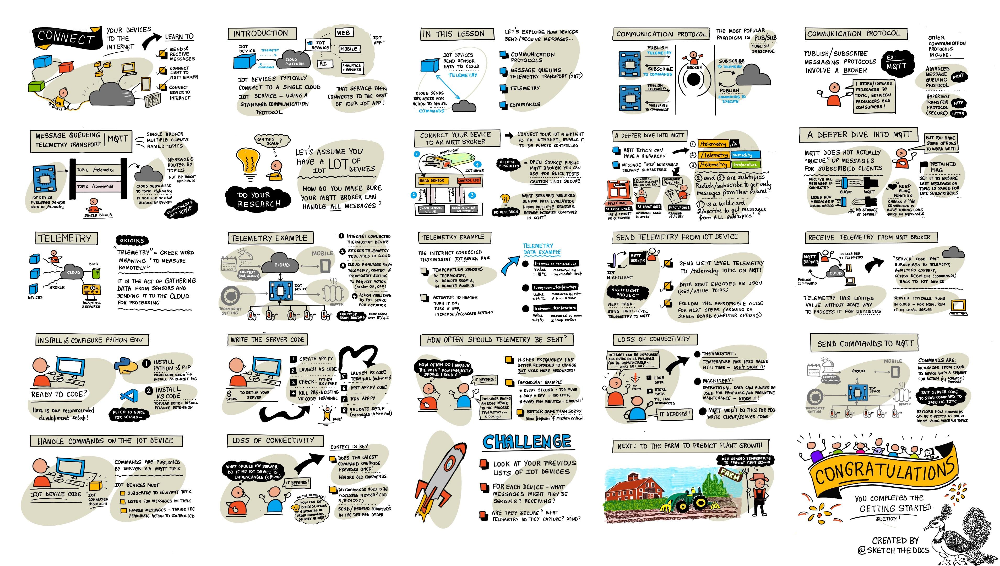

<!--
CO_OP_TRANSLATOR_METADATA:
{
  "original_hash": "71b5040e0b3472f1c0949c9b55f224c0",
  "translation_date": "2025-08-24T23:05:03+00:00",
  "source_file": "1-getting-started/lessons/4-connect-internet/README.md",
  "language_code": "ja"
}
-->
# デバイスをインターネットに接続する



> スケッチノート作成者: [Nitya Narasimhan](https://github.com/nitya)。画像をクリックすると拡大表示されます。

このレッスンは、[Microsoft Reactor](https://developer.microsoft.com/reactor/?WT.mc_id=academic-17441-jabenn)による[Hello IoTシリーズ](https://youtube.com/playlist?list=PLmsFUfdnGr3xRts0TIwyaHyQuHaNQcb6-)の一環として教えられました。このレッスンは2つの動画で構成されており、1時間のレッスンと、レッスンの内容を深掘りし質問に答える1時間のオフィスアワーで構成されています。

[](https://youtu.be/O4dd172mZhs)

[](https://youtu.be/j-cVCzRDE2Q)

> 🎥 上の画像をクリックして動画を視聴してください

## レクチャー前のクイズ

[レクチャー前のクイズ](https://black-meadow-040d15503.1.azurestaticapps.net/quiz/7)

## はじめに

IoTの「I」は**インターネット**を意味します。これは、IoTデバイスの多くの機能を可能にするクラウド接続とサービスを指します。例えば、デバイスに接続されたセンサーからの測定値を収集したり、アクチュエータを制御するためのメッセージを送信したりすることが含まれます。IoTデバイスは通常、標準的な通信プロトコルを使用して単一のクラウドIoTサービスに接続し、そのサービスはAIサービスや制御・報告用のWebアプリなど、IoTアプリケーションの他の部分と接続されています。

> 🎓 センサーから収集されクラウドに送信されるデータは「テレメトリ」と呼ばれます。

IoTデバイスはクラウドからメッセージを受信することもできます。これらのメッセージには、内部的なアクション（例: 再起動やファームウェアの更新）やアクチュエータを使用したアクション（例: ライトを点灯させる）を実行するためのコマンドが含まれることがよくあります。

このレッスンでは、IoTデバイスがクラウドに接続するために使用できる通信プロトコルのいくつかと、それらが送受信する可能性のあるデータの種類を紹介します。また、これらを実際に操作し、ナイトライトにインターネット制御を追加し、LED制御ロジックをローカルで実行される「サーバー」コードに移行します。

このレッスンで学ぶ内容は以下の通りです：

* [通信プロトコル](../../../../../1-getting-started/lessons/4-connect-internet)
* [メッセージキューイングテレメトリトランスポート (MQTT)](../../../../../1-getting-started/lessons/4-connect-internet)
* [テレメトリ](../../../../../1-getting-started/lessons/4-connect-internet)
* [コマンド](../../../../../1-getting-started/lessons/4-connect-internet)

## 通信プロトコル

IoTデバイスがインターネットと通信するために使用する一般的な通信プロトコルはいくつかあります。最も一般的なのは、ブローカーを介したパブリッシュ/サブスクライブ型のメッセージングに基づいています。IoTデバイスはブローカーに接続し、テレメトリを公開（パブリッシュ）し、コマンドを購読（サブスクライブ）します。クラウドサービスもブローカーに接続し、すべてのテレメトリメッセージを購読し、特定のデバイスまたはデバイスグループにコマンドを公開します。


MQTTはIoTデバイスに最も人気のある通信プロトコルであり、このレッスンで取り上げます。他のプロトコルにはAMQPやHTTP/HTTPSがあります。

## メッセージキューイングテレメトリトランスポート (MQTT)

[MQTT](http://mqtt.org)は、デバイス間でメッセージを送信できる軽量でオープンな標準メッセージングプロトコルです。1999年に石油パイプラインを監視するために設計され、15年後にIBMによってオープンスタンダードとして公開されました。

MQTTは単一のブローカーと複数のクライアントを持ちます。すべてのクライアントはブローカーに接続し、ブローカーは関連するクライアントにメッセージをルーティングします。メッセージは個々のクライアントに直接送信されるのではなく、名前付きトピックを使用してルーティングされます。クライアントはトピックに公開（パブリッシュ）し、そのトピックを購読（サブスクライブ）しているクライアントがメッセージを受信します。


✅ 調査してみましょう。多くのIoTデバイスがある場合、MQTTブローカーがすべてのメッセージを処理できるようにするにはどうすればよいでしょうか？

### IoTデバイスをMQTTに接続する

ナイトライトにインターネット制御を追加する最初のステップは、MQTTブローカーに接続することです。

#### タスク

デバイスをMQTTブローカーに接続してください。

このレッスンのこの部分では、IoTナイトライトをインターネットに接続し、リモートで制御できるようにします。このレッスンの後半では、IoTデバイスがMQTTを介して光レベルのテレメトリメッセージを公開し、それがあなたが作成するサーバーコードによって受信されます。このコードは光レベルをチェックし、LEDをオンまたはオフにするようデバイスに指示するコマンドメッセージを送信します。

このようなセットアップの実際の使用例としては、スタジアムのように多くのライトがある場所で、複数の光センサーからデータを収集してライトを点灯させるかどうかを決定することが挙げられます。これにより、1つのセンサーが雲や鳥によって覆われていても、他のセンサーが十分な光を検出している場合にライトが点灯するのを防ぐことができます。

✅ 複数のセンサーからのデータを評価してコマンドを送信する必要がある他の状況は何でしょうか？

この課題の一環としてMQTTブローカーを設定する複雑さに対処する代わりに、[Eclipse Mosquitto](https://www.mosquitto.org)（オープンソースのMQTTブローカー）が実行されている公開テストサーバーを使用できます。このテストブローカーは[公開されています](https://test.mosquitto.org)が、アカウントを設定する必要がないため、MQTTクライアントとサーバーをテストするのに最適なツールです。

> 💁 このテストブローカーは公開されており、安全ではありません。公開する内容を誰でも聞くことができるため、プライベートに保持する必要があるデータには使用しないでください。


以下の手順に従って、デバイスをMQTTブローカーに接続してください：

* [Arduino - Wio Terminal](wio-terminal-mqtt.md)
* [シングルボードコンピュータ - Raspberry Pi/仮想IoTデバイス](single-board-computer-mqtt.md)

### MQTTの詳細

トピックには階層を持たせることができ、クライアントはワイルドカードを使用して階層の異なるレベルを購読できます。例えば、温度テレメトリメッセージを`/telemetry/temperature`トピックに送信し、湿度メッセージを`/telemetry/humidity`トピックに送信することができます。その後、クラウドアプリで`/telemetry/*`トピックを購読して、温度と湿度の両方のテレメトリメッセージを受信できます。

メッセージは、受信の保証を決定する品質保証（QoS）を設定して送信できます。

* 最小1回 - メッセージは1回だけ送信され、クライアントとブローカーは配信を確認するための追加の手順を実行しません（送信して忘れる）。
* 少なくとも1回 - メッセージは確認が受信されるまで送信者によって複数回再試行されます（確認済み配信）。
* 正確に1回 - 送信者と受信者が2段階のハンドシェイクを行い、メッセージが1回だけ受信されることを保証します（保証済み配信）。

✅ 保証済み配信メッセージが必要な状況と、送信して忘れるメッセージで十分な状況は何でしょうか？

MQTTの名前にはMessage Queueing（MQ）が含まれていますが、実際にはメッセージキューをサポートしていません。つまり、クライアントが切断されて再接続した場合、切断中に送信されたメッセージは受信されません。ただし、QoSプロセスを使用して処理を開始したメッセージは例外です。メッセージに「保持」フラグを設定すると、MQTTブローカーはそのトピックで最後に送信されたメッセージを保存し、後でそのトピックを購読するクライアントに送信します。これにより、クライアントは常に最新のメッセージを受信できます。

MQTTはまた、メッセージ間の長い間隔中に接続が生きているかどうかを確認する「キープアライブ」機能をサポートしています。

> 🦟 [Eclipse FoundationのMosquitto](https://mosquitto.org)は、MQTTを実験するために自分で実行できる無料のMQTTブローカーを提供しており、[test.mosquitto.org](https://test.mosquitto.org)でホストされている公開MQTTブローカーを使用してコードをテストすることもできます。

MQTT接続は公開されてオープンなもの、またはユーザー名とパスワード、または証明書を使用して暗号化され安全なものにすることができます。

> 💁 MQTTはHTTPと同じ基盤となるネットワークプロトコルであるTCP/IPを介して通信しますが、異なるポートを使用します。また、Webアプリがブラウザで実行されている場合や、ファイアウォールやその他のネットワーキングルールが標準のMQTT接続をブロックする場合に、WebSocketを介してMQTTを使用することもできます。

## テレメトリ

「テレメトリ」という言葉は、ギリシャ語の語源に由来し、「遠隔で測定する」という意味です。テレメトリとは、センサーからデータを収集し、それをクラウドに送信する行為を指します。

> 💁 最も初期のテレメトリデバイスの1つは1874年にフランスで発明され、モンブランからパリにリアルタイムの天気と積雪深度を送信しました。当時は無線技術が利用できなかったため、物理的なワイヤーを使用していました。

レッスン1で紹介したスマートサーモスタットの例を振り返ってみましょう。


サーモスタットには、テレメトリを収集するための温度センサーがあります。おそらく1つの温度センサーが内蔵されており、[Bluetooth Low Energy](https://wikipedia.org/wiki/Bluetooth_Low_Energy)（BLE）などの無線プロトコルを介して複数の外部温度センサーに接続する可能性があります。

送信されるテレメトリデータの例は以下の通りです：

| 名前 | 値 | 説明 |
| ---- | ----- | ----------- |
| `thermostat_temperature` | 18°C | サーモスタット内蔵の温度センサーによって測定された温度 |
| `livingroom_temperature` | 19°C | リモート温度センサーによって測定された温度。このセンサーは`livingroom`という名前が付けられ、設置されている部屋を識別します |
| `bedroom_temperature` | 21°C | リモート温度センサーによって測定された温度。このセンサーは`bedroom`という名前が付けられ、設置されている部屋を識別します |

クラウドサービスはこのテレメトリデータを使用して、暖房を制御するためのコマンドを送信するかどうかを判断します。

### IoTデバイスからテレメトリを送信する

ナイトライトにインターネット制御を追加する次のステップは、光レベルのテレメトリをMQTTブローカーにテレメトリトピックで送信することです。

#### タスク - IoTデバイスからテレメトリを送信する

光レベルのテレメトリをMQTTブローカーに送信してください。

データはJSON（JavaScript Object Notation）としてエンコードされて送信されます。JSONは、キー/値ペアを使用してテキストでデータをエンコードする標準です。

✅ JSONを初めて扱う場合は、[JSON.orgのドキュメント](https://www.json.org/)で詳細を学ぶことができます。

以下の手順に従って、デバイスからMQTTブローカーにテレメトリを送信してください：

* [Arduino - Wio Terminal](wio-terminal-telemetry.md)
* [シングルボードコンピュータ - Raspberry Pi/仮想IoTデバイス](single-board-computer-telemetry.md)

### MQTTブローカーからテレメトリを受信する

テレメトリを送信しても、それを受信するものがなければ意味がありません。光レベルのテレメトリには、それを処理するためのリスナーが必要です。この「サーバー」コードは、より大規模なIoTアプリケーションの一部としてクラウドサービスにデプロイされるコードの一種ですが、ここではこのコードをローカルコンピュータ（またはRaspberry Pi上で直接コーディングしている場合はその上）で実行します。このサーバーコードは、MQTTを介して光レベルのテレメトリメッセージをリッスンするPythonアプリで構成されています。このレッスンの後半では、LEDをオンまたはオフにする指示を含むコマンドメッセージを返信するようにします。

✅ 調査してみましょう：リスナーがいない場合、MQTTメッセージはどうなりますか？

#### PythonとVS Codeをインストールする

ローカルにPythonとVS Codeがインストールされていない場合、サーバーをコーディングするために両方をインストールする必要があります。仮想IoTデバイスを使用している場合や、Raspberry Piで作業している場合は、このステップをスキップできます。すでにインストールされており、設定されているはずです。

##### タスク - Pythonと
💁 あなたが好みのPython IDEやエディターを使用することは自由ですが、このレッスンではVS Codeを使用した指示が提供されます。
1. VS CodeのPylance拡張機能をインストールします。これは、Pythonの言語サポートを提供するVS Code用の拡張機能です。この拡張機能のインストール方法については、[Pylance拡張機能のドキュメント](https://marketplace.visualstudio.com/items?WT.mc_id=academic-17441-jabenn&itemName=ms-python.vscode-pylance)を参照してください。

#### Python仮想環境の設定

Pythonの強力な機能の1つは、[pipパッケージ](https://pypi.org)をインストールできることです。これらは他の人が作成し、インターネット上で公開しているコードのパッケージです。1つのコマンドでパッケージをコンピュータにインストールし、そのパッケージをコードで使用できます。ここでは、MQTTを介して通信するためのパッケージをインストールするためにpipを使用します。

デフォルトでは、パッケージをインストールするとコンピュータ全体で利用可能になりますが、これによりパッケージのバージョンに関する問題が発生する可能性があります。例えば、あるアプリケーションが特定のバージョンのパッケージに依存している場合、新しいバージョンを別のアプリケーションのためにインストールすると動作しなくなることがあります。この問題を回避するために、[Python仮想環境](https://docs.python.org/3/library/venv.html)を使用できます。これは、専用のフォルダ内にPythonのコピーを作成するもので、pipパッケージをインストールするとそのフォルダ内にのみインストールされます。

##### タスク - Python仮想環境の設定

Python仮想環境を設定し、MQTT用のpipパッケージをインストールします。

1. ターミナルまたはコマンドラインで、以下を実行して新しいディレクトリを作成し、そのディレクトリに移動します。

    ```sh
    mkdir nightlight-server
    cd nightlight-server
    ```

1. 次に、以下を実行して`.venv`フォルダ内に仮想環境を作成します。

    ```sh
    python3 -m venv .venv
    ```

    > 💁 Python 2がインストールされている場合に備えて、仮想環境を作成する際には明示的に`python3`を呼び出す必要があります。Python 2がインストールされている場合、`python`を呼び出すとPython 2が使用されるためです。

1. 仮想環境を有効化します：

    * Windowsの場合：
        * コマンドプロンプトまたはWindows Terminalのコマンドプロンプトを使用している場合、以下を実行します：

            ```cmd
            .venv\Scripts\activate.bat
            ```

        * PowerShellを使用している場合、以下を実行します：

            ```powershell
            .\.venv\Scripts\Activate.ps1
            ```

    * macOSまたはLinuxの場合、以下を実行します：

        ```cmd
        source ./.venv/bin/activate
        ```

    > 💁 これらのコマンドは、仮想環境を作成した場所と同じ場所で実行する必要があります。`.venv`フォルダに移動する必要はなく、仮想環境を有効化するコマンドやパッケージをインストールするコマンドは、仮想環境を作成したフォルダで実行してください。

1. 仮想環境が有効化されると、デフォルトの`python`コマンドは仮想環境を作成した際に使用したPythonのバージョンを実行します。以下を実行してバージョンを確認します：

    ```sh
    python --version
    ```

    出力は以下のようになります：

    ```output
    (.venv) ➜  nightlight-server python --version
    Python 3.9.1
    ```

    > 💁 Pythonのバージョンは異なる場合がありますが、3.6以上であれば問題ありません。それ以下の場合は、このフォルダを削除し、新しいバージョンのPythonをインストールして再試行してください。

1. 以下のコマンドを実行して、人気のあるMQTTライブラリである[Paho-MQTT](https://pypi.org/project/paho-mqtt/)のpipパッケージをインストールします。

    ```sh
    pip install paho-mqtt
    ```

    このpipパッケージは仮想環境内にのみインストールされ、仮想環境外では利用できません。

#### サーバーコードの作成

次に、Pythonでサーバーコードを作成します。

##### タスク - サーバーコードの作成

サーバーコードを作成します。

1. 仮想環境内で、以下を実行して`app.py`というPythonファイルを作成します：

    * Windowsの場合：

        ```cmd
        type nul > app.py
        ```

    * macOSまたはLinuxの場合：

        ```cmd
        touch app.py
        ```

1. 現在のフォルダをVS Codeで開きます：

    ```sh
    code .
    ```

1. VS Codeが起動すると、Python仮想環境が有効化されます。これは、下部のステータスバーに表示されます：

    

1. VS Codeのターミナルがすでに起動している場合、仮想環境が有効化されていないことがあります。この場合、**Kill the active terminal instance**ボタンを使用してターミナルを終了するのが最も簡単です：

    

1. *Terminal -> New Terminal*を選択するか、`` CTRL+` ``を押して新しいVS Codeターミナルを起動します。新しいターミナルでは仮想環境がロードされ、ターミナルに有効化コマンドが表示されます。プロンプトには仮想環境の名前（`.venv`）も表示されます：

    ```output
    ➜  nightlight-server source .venv/bin/activate
    (.venv) ➜  nightlight 
    ```

1. VS Codeエクスプローラーから`app.py`ファイルを開き、以下のコードを追加します：

    ```python
    import json
    import time
    
    import paho.mqtt.client as mqtt
    
    id = '<ID>'
    
    client_telemetry_topic = id + '/telemetry'
    client_name = id + 'nightlight_server'
    
    mqtt_client = mqtt.Client(client_name)
    mqtt_client.connect('test.mosquitto.org')
    
    mqtt_client.loop_start()
    
    def handle_telemetry(client, userdata, message):
        payload = json.loads(message.payload.decode())
        print("Message received:", payload)
    
    mqtt_client.subscribe(client_telemetry_topic)
    mqtt_client.on_message = handle_telemetry
    
    while True:
        time.sleep(2)
    ```

    6行目の`<ID>`を、デバイスコードを作成した際に使用した一意のIDに置き換えてください。

    ⚠️ このIDはデバイスで使用したものと**同じ**でなければなりません。そうでない場合、サーバーコードは正しいトピックにサブスクライブまたはパブリッシュしません。

    このコードは、一意の名前を持つMQTTクライアントを作成し、*test.mosquitto.org*ブローカーに接続します。その後、バックグラウンドスレッドで実行される処理ループを開始し、サブスクライブしたトピックのメッセージをリッスンします。

    クライアントはテレメトリトピックのメッセージをサブスクライブし、メッセージを受信した際に呼び出される関数を定義します。テレメトリメッセージを受信すると、`handle_telemetry`関数が呼び出され、受信したメッセージがコンソールに出力されます。

    最後に、無限ループがアプリケーションを実行し続けます。MQTTクライアントはバックグラウンドスレッドでメッセージをリッスンし、メインアプリケーションが実行されている間は常に動作します。

1. VS Codeターミナルから以下を実行してPythonアプリを実行します：

    ```sh
    python app.py
    ```

    アプリはIoTデバイスからのメッセージをリッスンし始めます。

1. デバイスが動作しており、テレメトリメッセージを送信していることを確認してください。物理デバイスまたは仮想デバイスの光レベルを調整します。受信したメッセージがターミナルに表示されます。

    ```output
    (.venv) ➜  nightlight-server python app.py
    Message received: {'light': 0}
    Message received: {'light': 400}
    ```

    nightlight仮想環境内の`app.py`ファイルが実行されている間、nightlight-server仮想環境内の`app.py`ファイルは送信されたメッセージを受信します。

> 💁 このコードは[code-server/server](../../../../../1-getting-started/lessons/4-connect-internet/code-server/server)フォルダにあります。

### テレメトリの送信頻度はどのくらいが適切か？

テレメトリの重要な考慮事項の1つは、データをどのくらいの頻度で測定し送信するかです。その答えは「状況による」です。頻繁に測定すれば、測定値の変化に迅速に対応できますが、電力や帯域幅を多く消費し、データ量が増え、クラウドリソースの処理負荷が増加します。適切な頻度で測定する必要がありますが、頻繁すぎてもいけません。

例えば、サーモスタットの場合、数分ごとに測定するだけで十分です。温度はそれほど頻繁に変化しないためです。一方、工場の機械のデータを監視する場合、故障が大きな損害を引き起こす可能性がある場合は、1秒間に複数回測定する必要があるかもしれません。

> 💁 このような場合、エッジデバイスを使用してテレメトリを最初に処理し、インターネットへの依存を減らすことを検討するかもしれません。

### 接続の喪失

インターネット接続は信頼性が低く、障害が発生することがあります。このような状況でIoTデバイスはどうすべきでしょうか？データを失うべきか、それとも接続が回復するまで保存すべきか？これも「状況による」と言えます。

例えば、サーモスタットの場合、新しい温度測定値が取得されると古いデータは不要になるため、データを失っても問題ありません。一方、機械のデータを監視する場合、特にトレンドを分析するためにデータを使用する場合は、データを保持する必要があるかもしれません。

MQTTで接続喪失を処理するには、デバイスとサーバーコードがメッセージの確実な配信を保証する責任を負う必要があります。例えば、送信されたすべてのメッセージに対して返信トピックで追加のメッセージを要求し、返信がない場合は手動でキューに入れて後で再送するようにすることが考えられます。

## コマンド

コマンドは、クラウドからデバイスに送信されるメッセージで、何かを実行するよう指示するものです。多くの場合、アクチュエータを介して何らかの出力を行いますが、デバイス自体に対する指示（例：再起動や追加のテレメトリ収集など）である場合もあります。


例えば、サーモスタットはクラウドから暖房をオンにするコマンドを受信することがあります。すべてのセンサーからのテレメトリデータに基づいて、クラウドサービスが暖房をオンにするべきだと判断した場合、関連するコマンドが送信されます。

### MQTTブローカーにコマンドを送信する

次のステップでは、インターネット制御のナイトライトのサーバーコードが、検知した光レベルに基づいてIoTデバイスにライトを制御するコマンドを送信します。

1. VS Codeでサーバーコードを開きます。

1. `client_telemetry_topic`の宣言の後に、コマンドを送信するトピックを定義する以下の行を追加します：

    ```python
    server_command_topic = id + '/commands'
    ```

1. `handle_telemetry`関数の最後に以下のコードを追加します：

    ```python
    command = { 'led_on' : payload['light'] < 300 }
    print("Sending message:", command)
    
    client.publish(server_command_topic, json.dumps(command))
    ```

    これにより、光が300未満かどうかに応じて`led_on`の値をtrueまたはfalseに設定したJSONメッセージがコマンドトピックに送信されます。光が300未満の場合、LEDをオンにするようデバイスに指示するためにtrueが送信されます。

1. 前と同じようにコードを実行します。

1. 物理デバイスまたは仮想デバイスの光レベルを調整します。受信したメッセージと送信されたコマンドがターミナルに表示されます：

    ```output
    (.venv) ➜  nightlight-server python app.py
    Message received: {'light': 0}
    Sending message: {'led_on': True}
    Message received: {'light': 400}
    Sending message: {'led_on': False}
    ```

> 💁 テレメトリとコマンドはそれぞれ単一のトピックで送信されています。このため、複数のデバイスからのテレメトリが同じテレメトリトピックに表示され、複数のデバイスへのコマンドが同じコマンドトピックに表示されます。特定のデバイスにコマンドを送信したい場合は、`/commands/device1`や`/commands/device2`のように一意のデバイスIDを含む複数のトピックを使用することができます。これにより、デバイスはそのデバイス専用のメッセージをリッスンできます。

> 💁 このコードは[code-commands/server](../../../../../1-getting-started/lessons/4-connect-internet/code-commands/server)フォルダにあります。

### IoTデバイスでコマンドを処理する

サーバーからコマンドが送信されるようになったので、次にIoTデバイスでこれを処理し、LEDを制御するコードを追加します。

以下の関連する手順に従って、MQTTブローカーからのコマンドをリッスンしてください：

* [Arduino - Wio Terminal](wio-terminal-commands.md)
* [シングルボードコンピュータ - Raspberry Pi/仮想IoTデバイス](single-board-computer-commands.md)

コードが作成され実行されたら、光レベルを変更して実験してください。サーバーとデバイスの出力を確認し、光レベルを変更した際のLEDの動作を観察してください。

### 接続の喪失

クラウドサービスがオフラインのIoTデバイスにコマンドを送信する必要がある場合、どうすべきでしょうか？これも「状況による」と言えます。

最新のコマンドが以前のコマンドを上書きする場合、以前のコマンドは無視しても問題ないでしょう。例えば、クラウドサービスが暖房をオンにするコマンドを送信し、その後オフにするコマンドを送信した場合、オンのコマンドは無視して再送しなくても構いません。

一方、コマンドが順序通りに処理される必要がある場合（例：ロボットアームを上げる→グラバーを閉じる）、接続が回復した際に順序通りに送信される必要があります。

✅ デバイスまたはサーバーコードが、必要に応じてMQTTを介してコマンドを常に順序通りに送信・処理する方法を考えてみてください。

---

## 🚀 チャレンジ

前回の3つのレッスンでの課題は、自宅、学校、または職場にあるIoTデバイスをできるだけ多くリストアップし、それらがマイクロコントローラー、シングルボードコンピュータ、またはその両方の組み合わせで構成されているかを判断し、それらが使用しているセンサーやアクチュエータについて考えることでした。
これらのデバイスについて、どのようなメッセージを送受信しているか考えてみましょう。どのようなテレメトリを送信していますか？どのようなメッセージやコマンドを受信する可能性がありますか？それらは安全だと思いますか？

## 講義後のクイズ

[講義後のクイズ](https://black-meadow-040d15503.1.azurestaticapps.net/quiz/8)

## 復習と自主学習

[MQTTのWikipediaページ](https://wikipedia.org/wiki/MQTT)で、MQTTについてさらに詳しく学びましょう。

[Mosquitto](https://www.mosquitto.org)を使って自分でMQTTブローカーを実行し、IoTデバイスやサーバーコードから接続してみてください。

> 💁 ヒント - Mosquittoはデフォルトでは匿名接続（ユーザー名とパスワードなしでの接続）を許可しておらず、実行しているコンピュータの外部からの接続も許可していません。
> これを修正するには、以下の内容を含む[`mosquitto.conf`設定ファイル](https://www.mosquitto.org/man/mosquitto-conf-5.html)を使用してください：
>
> ```sh
> listener 1883 0.0.0.0
> allow_anonymous true
> ```

## 課題

[MQTTと他の通信プロトコルの比較と対比](assignment.md)

**免責事項**:  
この文書は、AI翻訳サービス [Co-op Translator](https://github.com/Azure/co-op-translator) を使用して翻訳されています。正確性を期すよう努めておりますが、自動翻訳には誤りや不正確な部分が含まれる可能性があります。元の言語で記載された原文が正式な情報源と見なされるべきです。重要な情報については、専門の人間による翻訳をお勧めします。本翻訳の使用に起因する誤解や誤認について、当方は一切の責任を負いません。