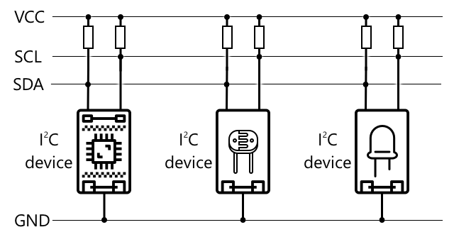

<!--
CO_OP_TRANSLATOR_METADATA:
{
  "original_hash": "4fb20273d299dc8d07a8f06c9cd0cdd9",
  "translation_date": "2025-08-24T22:34:06+00:00",
  "source_file": "2-farm/lessons/2-detect-soil-moisture/README.md",
  "language_code": "ja"
}
-->
C（アイ・スクエアド・シー）は、複数のコントローラーと複数の周辺機器が接続可能なプロトコルで、接続されたデバイスはコントローラーまたは周辺機器として動作し、I²Cバス（データを転送する通信システムの名称）を介して通信します。データはアドレス付きのパケットとして送信され、各パケットには送信先のデバイスのアドレスが含まれています。

> 💁 このモデルは以前「マスター/スレーブ」と呼ばれていましたが、奴隷制度との関連性からこの用語は廃止されつつあります。[Open Source Hardware Association](https://www.oshwa.org/a-resolution-to-redefine-spi-signal-names/)は「コントローラー/周辺機器」という用語を採用していますが、古い用語がまだ使われている場合もあります。

デバイスには接続時に使用されるアドレスがあり、通常はデバイスにハードコードされています。例えば、SeeedのGroveセンサーはすべて同じアドレスを持っています。すべての光センサーは同じアドレスを持ち、ボタンは光センサーとは異なるアドレスを持っています。一部のデバイスでは、ジャンパー設定を変更したりピンをハンダ付けすることでアドレスを変更することが可能です。

I²Cバスは主に2本の通信線と2本の電源線で構成されています：

| 線 | 名称 | 説明 |
| ---- | --------- | ----------- |
| SDA | シリアルデータ | デバイス間でデータを送信するための線です。 |
| SCL | シリアルクロック | コントローラーが設定した速度でクロック信号を送信する線です。 |
| VCC | 電圧コモンコレクター | デバイスに電力を供給する線です。プルアップ抵抗を介してSDAとSCL線に電力を供給し、コントローラーが存在しない場合に信号をオフにします。 |
| GND | グラウンド | 電気回路の共通グラウンドを提供します。 |

データを送信するには、1つのデバイスが開始条件を発行してデータ送信の準備ができたことを示します。このデバイスがコントローラーになります。コントローラーは通信したいデバイスのアドレスと、データを読み取るか書き込むかを指定して送信します。データ送信が完了すると、コントローラーは終了条件を発行して送信が終了したことを示します。その後、別のデバイスがコントローラーとなり、データを送受信することができます。

2Cには速度制限があり、3つの異なるモードで固定速度で動作します。最速はHigh Speedモードで、最大速度は3.4Mbps（メガビット毎秒）ですが、この速度をサポートするデバイスは非常に少ないです。例えば、Raspberry Piは400Kbps（キロビット毎秒）のFastモードに制限されています。Standardモードは100Kbpsで動作します。

> 💁 Raspberry PiをGrove Base hatと一緒にIoTハードウェアとして使用している場合、ボード上にI2Cセンサーと通信するためのI2Cソケットがいくつか見えるはずです。また、アナログGroveセンサーもI2Cを使用してADCを介してアナログ値をデジタルデータとして送信します。そのため、使用した光センサーはアナログピンをシミュレートし、値をI2C経由で送信しました。これは、Raspberry Piがデジタルピンのみをサポートしているためです。

### ユニバーサル非同期受信送信機（UART）

UARTは、2つのデバイス間で通信を可能にする物理的な回路を含みます。各デバイスには送信（Tx）と受信（Rx）の2つの通信ピンがあり、1つ目のデバイスのTxピンが2つ目のデバイスのRxピンに接続され、逆も同様です。これにより、データを双方向に送信できます。

* デバイス1はTxピンからデータを送信し、デバイス2のRxピンで受信します。
* デバイス1はRxピンでデータを受信し、それはデバイス2のTxピンから送信されます。

> 🎓 データは1ビットずつ送信され、これを*シリアル*通信と呼びます。ほとんどのオペレーティングシステムやマイクロコントローラーには*シリアルポート*があり、シリアルデータを送受信する接続がコードで利用可能です。

UARTデバイスには[ボーレート](https://wikipedia.org/wiki/Symbol_rate)（シンボルレートとも呼ばれる）があり、これはデータが1秒間に送受信される速度（ビット毎秒）を示します。一般的なボーレートは9,600で、これは1秒間に9,600ビット（0と1）のデータが送信されることを意味します。

UARTはスタートビットとストップビットを使用します。つまり、データのバイト（8ビット）を送信する前にスタートビットを送信し、8ビットを送信した後にストップビットを送信します。

UARTの速度はハードウェアに依存しますが、最速の実装でも6.5Mbps（メガビット毎秒、つまり1秒間に送信される0または1のビット数）を超えることはありません。

GPIOピンを介してUARTを使用することができます。1つのピンをTx、もう1つをRxとして設定し、これらを別のデバイスに接続します。

> 💁 Raspberry PiをGrove Base hatと一緒にIoTハードウェアとして使用している場合、UARTプロトコルを使用するセンサーと通信するためのUARTソケットがボード上に見えるはずです。

### シリアルペリフェラルインターフェース（SPI）

SPIは、フラッシュメモリのようなストレージデバイスと通信するために、マイクロコントローラー上で短距離通信を行うよう設計されています。これはコントローラー/ペリフェラルモデルに基づいており、単一のコントローラー（通常はIoTデバイスのプロセッサ）が複数のペリフェラルとやり取りします。コントローラーはペリフェラルを選択し、データを送信または要求することで全体を制御します。

> 💁 I2Cと同様に、コントローラーとペリフェラルという用語は最近の変更であり、古い用語がまだ使用されている場合があります。

SPIコントローラーは3本のワイヤと、ペリフェラルごとに1本の追加ワイヤを使用します。ペリフェラルは4本のワイヤを使用します。これらのワイヤは以下の通りです：

| ワイヤ | 名前 | 説明 |
| ---- | --------- | ----------- |
| COPI | コントローラー出力、ペリフェラル入力 | コントローラーからペリフェラルにデータを送信するためのワイヤです。 |
| CIPO | コントローラー入力、ペリフェラル出力 | ペリフェラルからコントローラーにデータを送信するためのワイヤです。 |
| SCLK | シリアルクロック | コントローラーが設定した速度でクロック信号を送信するワイヤです。 |
| CS   | チップセレクト | コントローラーには複数のワイヤがあり、各ワイヤが対応するペリフェラルのCSワイヤに接続されています。 |

CSワイヤは1回に1つのペリフェラルをアクティブにし、COPIとCIPOワイヤを介して通信します。コントローラーがペリフェラルを切り替える必要がある場合、現在アクティブなペリフェラルに接続されたCSワイヤを非アクティブにし、次に通信したいペリフェラルに接続されたワイヤをアクティブにします。

SPIは*全二重通信*であり、コントローラーは同じペリフェラルからCOPIとCIPOワイヤを使用して同時にデータを送受信できます。SPIはSCLKワイヤ上のクロック信号を使用してデバイスを同期させるため、UARTのようにスタートビットやストップビットを必要としません。

SPIには定義された速度制限がなく、多くの実装では1秒間に複数メガバイトのデータを送信できます。

IoT開発キットは、いくつかのGPIOピンを介してSPIをサポートすることがよくあります。例えば、Raspberry PiではGPIOピン19、21、23、24、26をSPIに使用できます。

### ワイヤレス

一部のセンサーは、Bluetooth（主にBluetooth Low Energy、BLE）、LoRaWAN（**Lo**ng **Ra**nge低電力ネットワークプロトコル）、WiFiなどの標準的なワイヤレスプロトコルを介して通信できます。これにより、IoTデバイスに物理的に接続されていないリモートセンサーが可能になります。

商業用土壌水分センサーの例があります。これらは畑の土壌水分を測定し、LoRaWANを介してハブデバイスにデータを送信します。このハブデバイスはデータを処理するか、インターネットに送信します。これにより、センサーがデータを管理するIoTデバイスから離れて配置でき、大規模なWiFiネットワークや長いケーブルの必要性を減らします。

BLEは、フィットネストラッカーのような高度なセンサーに人気があります。これらは複数のセンサーを組み合わせ、センサーデータをBLEを介してスマートフォンのようなIoTデバイスに送信します。

✅ あなたの身の回りや家、学校にBluetoothセンサーがありますか？これには、温度センサー、占有センサー、デバイストラッカー、フィットネスデバイスなどが含まれるかもしれません。

商業用デバイスが接続するための一般的な方法の1つはZigbeeです。ZigbeeはWiFiを使用してデバイス間でメッシュネットワークを形成します。各デバイスは可能な限り多くの近くのデバイスに接続し、クモの巣のように多くの接続を形成します。1つのデバイスがインターネットにメッセージを送信したい場合、最も近いデバイスに送信し、それがさらに近くのデバイスに転送されるという形で進み、最終的にコーディネーターに到達してインターネットに送信されます。

> 🐝 Zigbeeという名前は、ミツバチが巣に戻った後に行うワグルダンスに由来します。

## 土壌の水分レベルを測定する

土壌水分センサー、IoTデバイス、観葉植物または近くの土壌を使用して、土壌の水分レベルを測定できます。

### タスク - 土壌水分を測定する

IoTデバイスを使用して土壌水分を測定するための関連ガイドを進めてください：

* [Arduino - Wio Terminal](wio-terminal-soil-moisture.md)
* [シングルボードコンピュータ - Raspberry Pi](pi-soil-moisture.md)
* [シングルボードコンピュータ - 仮想デバイス](virtual-device-soil-moisture.md)

## センサーのキャリブレーション

センサーは、抵抗や静電容量などの電気的特性を測定することで動作します。

> 🎓 抵抗はオーム（Ω）で測定され、電流が物質を通過する際の抵抗の大きさを示します。電圧が物質に加えられると、通過する電流の量は物質の抵抗に依存します。詳細は[電気抵抗のWikipediaページ](https://wikipedia.org/wiki/Electrical_resistance_and_conductance)をご覧ください。

> 🎓 静電容量はファラド（F）で測定され、コンポーネントや回路が電気エネルギーを収集して蓄える能力を示します。詳細は[静電容量のWikipediaページ](https://wikipedia.org/wiki/Capacitance)をご覧ください。

これらの測定値は必ずしも有用ではありません。例えば、22.5KΩという測定値を返す温度センサーを想像してください。そのため、測定値を有用な単位に変換するためにキャリブレーションが必要です。これは、測定値を測定対象の量に一致させ、新しい測定値を正しい単位に変換できるようにするプロセスです。

一部のセンサーは事前にキャリブレーションされています。例えば、前回のレッスンで使用した温度センサーはすでにキャリブレーションされており、摂氏（°C）で温度測定値を返すことができます。工場では、最初に作成されたセンサーが既知の温度範囲にさらされ、抵抗が測定されます。これを使用して、Ω（抵抗の単位）から°Cに変換する計算式が作成されます。

> 💁 温度から抵抗を計算する公式は[Steinhart–Hart方程式](https://wikipedia.org/wiki/Steinhart–Hart_equation)と呼ばれます。

### 土壌水分センサーのキャリブレーション

土壌水分は、重量含水率または体積含水率を使用して測定されます。

* 重量含水率は、乾燥土壌1キログラムあたりの水の重量をキログラム単位で測定します。
* 体積含水率は、乾燥土壌1立方メートルあたりの水の体積を立方メートル単位で測定します。

> 🇺🇸 アメリカでは、単位の一貫性のため、キログラムの代わりにポンド、立方メートルの代わりに立方フィートで測定することができます。

土壌水分センサーは電気抵抗または静電容量を測定しますが、これは土壌水分だけでなく土壌の種類によっても変化します。土壌中の成分がその電気的特性を変える可能性があるためです。理想的には、センサーはキャリブレーションされるべきです。つまり、センサーの測定値をより科学的な方法で得られた測定値と比較することです。例えば、特定の畑のサンプルを年に数回採取し、実験室で重量含水率を計算し、これらの数値を使用してセンサーをキャリブレーションし、センサーの測定値を重量含水率に一致させます。

上のグラフはセンサーをキャリブレーションする方法を示しています。土壌サンプルの電圧を記録し、その後、実験室で湿った重量と乾燥重量を比較して測定します（湿った状態で重量を測定し、その後オーブンで乾燥させて乾燥重量を測定）。いくつかの測定値を取得したら、それをグラフにプロットし、点にフィットする線を引きます。この線を使用して、IoTデバイスが取得した土壌水分センサーの測定値を実際の土壌水分測定値に変換できます。

💁 抵抗型土壌水分センサーの場合、土壌水分が増加するにつれて電圧が増加します。静電容量型土壌水分センサーの場合、土壌水分が増加するにつれて電圧が減少するため、これらのグラフは上向きではなく下向きに傾きます。

上のグラフは土壌水分センサーからの電圧測定値を示しており、その値をグラフ上の線に従って追跡することで、実際の土壌水分を計算できます。

このアプローチにより、農家は畑のためにいくつかの実験室測定値を取得するだけで済み、その後IoTデバイスを使用して土壌水分を測定できます。これにより、測定にかかる時間が大幅に短縮されます。

---

## 🚀 チャレンジ

抵抗型と静電容量型の土壌水分センサーにはいくつかの違いがあります。これらの違いは何でしょうか？また、農家にとってどちらのタイプ（またはどちらでもない）が最適でしょうか？この答えは、発展途上国と先進国で異なりますか？

## 講義後のクイズ

[講義後のクイズ](https://black-meadow-040d15503.1.azurestaticapps.net/quiz/12)

## 復習と自己学習

センサーやアクチュエータで使用されるハードウェアとプロトコルについて調べてください：

* [GPIO Wikipediaページ](https://wikipedia.org/wiki/General-purpose_input/output)
* [UART Wikipediaページ](https://wikipedia.org/wiki/Universal_asynchronous_receiver-transmitter)
* [SPI Wikipediaページ](https://wikipedia.org/wiki/Serial_Peripheral_Interface)
* [I2C Wikipediaページ](https://wikipedia.org/wiki/I²C)
* [Zigbee Wikipediaページ](https://wikipedia.org/wiki/Zigbee)

## 課題

[センサーをキャリブレーションする](assignment.md)

**免責事項**:  
この文書は、AI翻訳サービス [Co-op Translator](https://github.com/Azure/co-op-translator) を使用して翻訳されています。正確性を期すよう努めておりますが、自動翻訳には誤りや不正確さが含まれる可能性があります。元の言語で記載された原文が公式な情報源と見なされるべきです。重要な情報については、専門の人間による翻訳を推奨します。本翻訳の使用に起因する誤解や誤認について、当方は一切の責任を負いません。