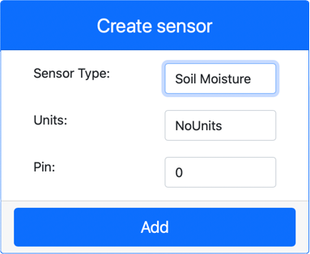

<!--
CO_OP_TRANSLATOR_METADATA:
{
  "original_hash": "2bf65f162bcebd35fbcba5fd245afac4",
  "translation_date": "2025-08-24T22:39:56+00:00",
  "source_file": "2-farm/lessons/2-detect-soil-moisture/virtual-device-soil-moisture.md",
  "language_code": "ja"
}
-->
# 土壌水分を測定する - 仮想IoTハードウェア

このレッスンでは、仮想IoTデバイスに静電容量式土壌水分センサーを追加し、その値を読み取ります。

## 仮想ハードウェア

仮想IoTデバイスでは、シミュレートされたGrove静電容量式土壌水分センサーを使用します。これにより、Raspberry Piと物理的なGrove静電容量式土壌水分センサーを使用する場合と同じ手順で進めることができます。

物理的なIoTデバイスでは、土壌水分センサーは静電容量式センサーで、土壌の静電容量を検出することで土壌水分を測定します。この静電容量は土壌水分の変化に応じて変化します。土壌水分が増加すると、電圧は低下します。

このセンサーはアナログセンサーであり、1～1,023の値を報告するシミュレートされた10ビットADCを使用します。

### CounterFitに土壌水分センサーを追加する

仮想土壌水分センサーを使用するには、CounterFitアプリに追加する必要があります。

#### タスク - CounterFitに土壌水分センサーを追加する

CounterFitアプリに土壌水分センサーを追加します。

1. `soil-moisture-sensor`というフォルダーに`app.py`という単一のファイルを含む新しいPythonアプリを作成し、Python仮想環境を設定して、CounterFitのpipパッケージを追加します。

    > ⚠️ 必要に応じて、[レッスン1でのCounterFit Pythonプロジェクトの作成と設定に関する手順](../../../1-getting-started/lessons/1-introduction-to-iot/virtual-device.md)を参照してください。

1. CounterFitウェブアプリが実行中であることを確認します。

1. 土壌水分センサーを作成します：

    1. *Sensors*ペインの*Create sensor*ボックスで、*Sensor type*ドロップダウンを開き、*Soil Moisture*を選択します。

    1. *Units*は*NoUnits*のままにします。

    1. *Pin*が*0*に設定されていることを確認します。

    1. **Add**ボタンを選択して、Pin 0に*Soil Moisture*センサーを作成します。

    

    土壌水分センサーが作成され、センサーリストに表示されます。

    

## 土壌水分センサーアプリをプログラムする

CounterFitセンサーを使用して土壌水分センサーアプリをプログラムします。

### タスク - 土壌水分センサーアプリをプログラムする

土壌水分センサーアプリをプログラムします。

1. VS Codeで`soil-moisture-sensor`アプリを開いていることを確認します。

1. `app.py`ファイルを開きます。

1. アプリをCounterFitに接続するために、以下のコードを`app.py`の先頭に追加します：

    ```python
    from counterfit_connection import CounterFitConnection
    CounterFitConnection.init('127.0.0.1', 5000)
    ```

1. 必要なライブラリをインポートするために、以下のコードを`app.py`ファイルに追加します：

    ```python
    import time
    from counterfit_shims_grove.adc import ADC
    ```

    `import time`ステートメントは、この課題で後ほど使用する`time`モジュールをインポートします。

    `from counterfit_shims_grove.adc import ADC`ステートメントは、CounterFitセンサーに接続できる仮想アナログ-デジタルコンバータとやり取りするための`ADC`クラスをインポートします。

1. この下に`ADC`クラスのインスタンスを作成するコードを追加します：

    ```python
    adc = ADC()
    ```

1. Pin 0のADCから値を読み取り、その結果をコンソールに出力する無限ループを追加します。このループは、読み取りの間に10秒間スリープします。

    ```python
    while True:
        soil_moisture = adc.read(0)
        print("Soil moisture:", soil_moisture)
    
        time.sleep(10)
    ```

1. CounterFitアプリから、アプリが読み取る土壌水分センサーの値を変更します。以下の2つの方法のいずれかで変更できます：

    * 土壌水分センサーの*Value*ボックスに数値を入力し、**Set**ボタンを選択します。入力した数値がセンサーから返される値になります。

    * *Random*チェックボックスをオンにし、*Min*と*Max*の値を入力してから**Set**ボタンを選択します。センサーが値を読み取るたびに、*Min*と*Max*の間のランダムな数値が返されます。

1. Pythonアプリを実行します。コンソールに土壌水分の測定値が表示されます。*Value*や*Random*の設定を変更して、値が変化する様子を確認してください。

    ```output
    (.venv) ➜ soil-moisture-sensor $ python app.py 
    Soil moisture: 615
    Soil moisture: 612
    Soil moisture: 498
    Soil moisture: 493
    Soil moisture: 490
    Soil Moisture: 388
    ```

> 💁 このコードは[code/virtual-device](../../../../../2-farm/lessons/2-detect-soil-moisture/code/virtual-device)フォルダーにあります。

😀 土壌水分センサーのプログラムが成功しました！

**免責事項**:  
この文書は、AI翻訳サービス [Co-op Translator](https://github.com/Azure/co-op-translator) を使用して翻訳されています。正確性を期すよう努めておりますが、自動翻訳には誤りや不正確な部分が含まれる可能性があります。元の言語で記載された原文が公式な情報源と見なされるべきです。重要な情報については、専門の人間による翻訳を推奨します。本翻訳の使用に起因する誤解や誤認について、当方は一切の責任を負いません。