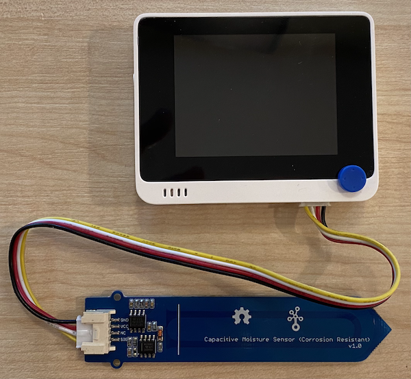

<!--
CO_OP_TRANSLATOR_METADATA:
{
  "original_hash": "0d55caa8c23d73635b7559102cd17b8a",
  "translation_date": "2025-08-24T22:37:33+00:00",
  "source_file": "2-farm/lessons/2-detect-soil-moisture/wio-terminal-soil-moisture.md",
  "language_code": "ja"
}
-->
# 土壌水分を測定する - Wio Terminal

このレッスンでは、Wio Terminalに静電容量式土壌水分センサーを追加し、その値を読み取ります。

## ハードウェア

Wio Terminalには静電容量式土壌水分センサーが必要です。

使用するセンサーは[静電容量式土壌水分センサー](https://www.seeedstudio.com/Grove-Capacitive-Moisture-Sensor-Corrosion-Resistant.html)で、土壌の静電容量を検出することで土壌水分を測定します。この静電容量は土壌の水分量に応じて変化します。土壌水分が増加すると、電圧は低下します。

このセンサーはアナログセンサーであり、Wio Terminalのアナログピンに接続されます。オンボードのADCを使用して、0～1,023の値を生成します。

### 土壌水分センサーを接続する

Grove土壌水分センサーは、Wio Terminalのアナログ/デジタルポートに接続できます。

#### タスク - 土壌水分センサーを接続する

土壌水分センサーを接続します。


1. Groveケーブルの片方の端を土壌水分センサーのソケットに差し込みます。このケーブルは一方向にしか差し込めません。

1. Wio Terminalをコンピュータや他の電源から切り離した状態で、Groveケーブルのもう一方の端をWio Terminalの画面右側のGroveソケットに接続します。このソケットは電源ボタンから最も遠いソケットです。



1. 土壌水分センサーを土に挿します。センサーには「最高挿入ライン」と呼ばれる白い線が引かれています。この線までセンサーを挿し込み、それ以上は挿し込まないでください。


1. これでWio Terminalをコンピュータに接続できます。

## 土壌水分センサーをプログラムする

これでWio Terminalに接続された土壌水分センサーを使用するプログラムを作成できます。

### タスク - 土壌水分センサーをプログラムする

デバイスをプログラムします。

1. PlatformIOを使用して新しいWio Terminalプロジェクトを作成します。このプロジェクトを`soil-moisture-sensor`と名付けます。`setup`関数にシリアルポートを設定するコードを追加します。

    > ⚠️ 必要に応じて、[プロジェクト1、レッスン1でのPlatformIOプロジェクト作成手順](../../../1-getting-started/lessons/1-introduction-to-iot/wio-terminal.md#create-a-platformio-project)を参照してください。

1. このセンサー専用のライブラリはありませんが、組み込みのArduino [`analogRead`](https://www.arduino.cc/reference/en/language/functions/analog-io/analogread/)関数を使用してアナログピンから値を読み取ることができます。まず、`setup`関数に以下のコードを追加してアナログピンを入力用に設定します。

    ```cpp
    pinMode(A0, INPUT);
    ```

    これにより、`A0`ピン（アナログ/デジタル兼用ピン）が入力ピンとして設定され、電圧を読み取れるようになります。

1. 次に、`loop`関数に以下のコードを追加して、このピンから電圧を読み取ります。

    ```cpp
    int soil_moisture = analogRead(A0);
    ```

1. このコードの下に、以下のコードを追加して値をシリアルポートに出力します。

    ```cpp
    Serial.print("Soil Moisture: ");
    Serial.println(soil_moisture);
    ```

1. 最後に、10秒の遅延を追加します。

    ```cpp
    delay(10000);
    ```

1. コードをビルドしてWio Terminalにアップロードします。

    > ⚠️ 必要に応じて、[プロジェクト1、レッスン1でのPlatformIOプロジェクト作成手順](../../../1-getting-started/lessons/1-introduction-to-iot/wio-terminal.md#write-the-hello-world-app)を参照してください。

1. アップロードが完了したら、シリアルモニターを使用して土壌水分を監視できます。土に水を加えたり、センサーを土から取り外したりして、値の変化を確認してください。

    ```output
    > Executing task: platformio device monitor <
    
    --- Available filters and text transformations: colorize, debug, default, direct, hexlify, log2file, nocontrol, printable, send_on_enter, time
    --- More details at http://bit.ly/pio-monitor-filters
    --- Miniterm on /dev/cu.usbmodem1201  9600,8,N,1 ---
    --- Quit: Ctrl+C | Menu: Ctrl+T | Help: Ctrl+T followed by Ctrl+H ---
    Soil Moisture: 526
    Soil Moisture: 529
    Soil Moisture: 521
    Soil Moisture: 494
    Soil Moisture: 454
    Soil Moisture: 456
    Soil Moisture: 395
    Soil Moisture: 388
    Soil Moisture: 394
    Soil Moisture: 391
    ```

    上記の例では、水を加えると電圧が低下する様子が確認できます。

> 💁 このコードは[code/wio-terminal](../../../../../2-farm/lessons/2-detect-soil-moisture/code/wio-terminal)フォルダーにあります。

😀 土壌水分センサーのプログラムが成功しました！

**免責事項**:  
この文書は、AI翻訳サービス [Co-op Translator](https://github.com/Azure/co-op-translator) を使用して翻訳されています。正確性を追求しておりますが、自動翻訳には誤りや不正確な部分が含まれる可能性があることをご承知おきください。元の言語で記載された文書が公式な情報源とみなされるべきです。重要な情報については、専門の人間による翻訳をお勧めします。本翻訳の使用に起因する誤解や誤認について、当方は一切の責任を負いません。