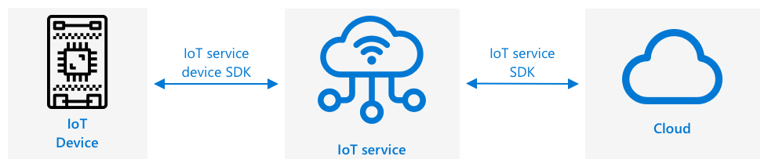
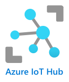

<!--
CO_OP_TRANSLATOR_METADATA:
{
  "original_hash": "4d8e7a066d75b625e7a979c14157041d",
  "translation_date": "2025-08-24T22:45:11+00:00",
  "source_file": "2-farm/lessons/4-migrate-your-plant-to-the-cloud/README.md",
  "language_code": "ja"
}
-->
# 植物をクラウドに移行する


> スケッチノート作成者：[Nitya Narasimhan](https://github.com/nitya)。画像をクリックすると拡大版が表示されます。

このレッスンは、[Microsoft Reactor](https://developer.microsoft.com/reactor/?WT.mc_id=academic-17441-jabenn)による[IoT for Beginners Project 2 - Digital Agricultureシリーズ](https://youtube.com/playlist?list=PLmsFUfdnGr3yCutmcVg6eAUEfsGiFXgcx)の一環として教えられました。

[](https://youtu.be/bNxjopXkhvk)

## レクチャー前のクイズ

[レクチャー前のクイズ](https://black-meadow-040d15503.1.azurestaticapps.net/quiz/15)

## はじめに

前回のレッスンでは、植物をMQTTブローカーに接続し、ローカルで動作するサーバーコードからリレーを制御する方法を学びました。これは、家庭の個々の植物から商業農場に至るまで使用される、インターネット接続された自動灌漑システムの基本を形成します。

IoTデバイスは、原則を示すためにパブリックMQTTブローカーと通信しましたが、これは最も信頼性が高く安全な方法ではありません。このレッスンでは、クラウドとパブリッククラウドサービスが提供するIoT機能について学びます。また、パブリックMQTTブローカーからこれらのクラウドサービスの1つに植物を移行する方法も学びます。

このレッスンでは以下を学びます：

* [クラウドとは何か？](../../../../../2-farm/lessons/4-migrate-your-plant-to-the-cloud)
* [クラウドサブスクリプションを作成する](../../../../../2-farm/lessons/4-migrate-your-plant-to-the-cloud)
* [クラウドIoTサービス](../../../../../2-farm/lessons/4-migrate-your-plant-to-the-cloud)
* [クラウドでIoTサービスを作成する](../../../../../2-farm/lessons/4-migrate-your-plant-to-the-cloud)
* [IoT Hubと通信する](../../../../../2-farm/lessons/4-migrate-your-plant-to-the-cloud)
* [デバイスをIoTサービスに接続する](../../../../../2-farm/lessons/4-migrate-your-plant-to-the-cloud)

## クラウドとは何か？

クラウドが登場する前、企業が従業員向け（データベースやファイルストレージなど）や一般向け（ウェブサイトなど）のサービスを提供したい場合、データセンターを構築して運営していました。これは、小規模なコンピュータルームから、多数のコンピュータを備えた建物までさまざまでした。企業は以下をすべて管理する必要がありました：

* コンピュータの購入
* ハードウェアの保守
* 電力と冷却
* ネットワーキング
* セキュリティ（建物のセキュリティとコンピュータ上のソフトウェアのセキュリティを含む）
* ソフトウェアのインストールと更新

これには非常に高いコストがかかり、幅広いスキルを持つ従業員が必要で、必要に応じて迅速に変更することが難しい場合がありました。例えば、オンラインストアが忙しいホリデーシーズンを計画する場合、数か月前からハードウェアを購入し、設定し、販売プロセスを実行するソフトウェアをインストールする必要がありました。ホリデーシーズンが終わり、売上が減少すると、購入したコンピュータは次の繁忙期までアイドル状態になります。

✅ これでは企業が迅速に動くことができると思いますか？例えば、あるオンライン衣料品小売業者がセレブがその服を着ていることで突然人気が出た場合、急増する注文に対応するためにコンピューティングパワーを迅速に増やすことができるでしょうか？

### 他人のコンピュータ

クラウドはしばしば「他人のコンピュータ」と冗談めかして呼ばれます。最初のアイデアはシンプルでした。コンピュータを購入する代わりに、他人のコンピュータを借りるのです。クラウドコンピューティングプロバイダーが巨大なデータセンターを管理します。彼らはハードウェアの購入とインストール、電力と冷却の管理、ネットワーキング、建物のセキュリティ、ハードウェアとソフトウェアの更新など、すべてを担当します。顧客としては、必要なコンピュータをレンタルし、需要が急増したときにレンタルを増やし、需要が減少したときにレンタルを減らすことができます。これらのクラウドデータセンターは世界中に存在します。


これらのデータセンターは数平方キロメートルの広さになることがあります。上記の画像は数年前にMicrosoftクラウドデータセンターで撮影されたもので、初期の規模と計画中の拡張を示しています。拡張のためにクリアされたエリアは5平方キロメートル以上です。

> 💁 これらのデータセンターは非常に大量の電力を必要とするため、一部は独自の発電所を持っています。その規模とクラウドプロバイダーの投資レベルのため、通常非常に環境に優しいです。小規模なデータセンターの膨大な数よりも効率的で、主に再生可能エネルギーで運営され、クラウドプロバイダーは廃棄物の削減、水使用量の削減、データセンター建設のために伐採された森林の再植林に取り組んでいます。クラウドプロバイダーがどのように持続可能性に取り組んでいるかについては、[Azureの持続可能性サイト](https://azure.microsoft.com/global-infrastructure/sustainability/?WT.mc_id=academic-17441-jabenn)で詳しく読むことができます。

✅ 調査してみましょう：[MicrosoftのAzure](https://azure.microsoft.com/?WT.mc_id=academic-17441-jabenn)や[GoogleのGCP](https://cloud.google.com)などの主要なクラウドについて調べてみてください。彼らはどれくらいのデータセンターを持っていて、それらは世界のどこにあるのでしょうか？

クラウドを使用することで企業のコストを削減し、クラウドコンピューティングの専門知識をプロバイダーに任せることで、企業は自分たちの得意分野に集中することができます。企業はデータセンタースペースを借りたり購入したり、接続性や電力のために異なるプロバイダーに支払ったり、専門家を雇ったりする必要がなくなります。その代わりに、クラウドプロバイダーにすべてを任せるための月額料金を支払うだけで済みます。

クラウドプロバイダーは、規模の経済を活用してコストを削減します。例えば、コンピュータを大量に購入してコストを下げたり、保守作業を減らすためのツールに投資したり、クラウドサービスを改善するために独自のハードウェアを設計・製造したりします。

### Microsoft Azure

AzureはMicrosoftの開発者向けクラウドであり、このレッスンで使用するクラウドです。以下のビデオはAzureの概要を簡単に説明しています：

[](https://www.microsoft.com/videoplayer/embed/RE4Ibng?WT.mc_id=academic-17441-jabenn)

## クラウドサブスクリプションを作成する

クラウドサービスを利用するには、クラウドプロバイダーとのサブスクリプションにサインアップする必要があります。このレッスンでは、Microsoft Azureサブスクリプションにサインアップします。すでにAzureサブスクリプションをお持ちの場合は、このタスクをスキップできます。ここで説明するサブスクリプションの詳細は執筆時点でのものであり、変更される可能性があります。

> 💁 これらのレッスンに学校を通じてアクセスしている場合、すでにAzureサブスクリプションが利用可能な場合があります。教師に確認してください。

無料のAzureサブスクリプションには2種類あります：

* **Azure for Students** - これは18歳以上の学生向けのサブスクリプションです。サインアップにクレジットカードは必要なく、学校のメールアドレスを使用して学生であることを確認します。サインアップすると、クラウドリソースに使用できる100米ドル分のクレジットと、IoTサービスの無料バージョンを含む無料サービスが提供されます。これは12か月間有効で、学生である限り毎年更新できます。

* **Azure無料サブスクリプション** - これは学生でない人向けのサブスクリプションです。サブスクリプションにサインアップするにはクレジットカードが必要ですが、カードは請求されません。これは、ボットではなく実在の人間であることを確認するために使用されます。最初の30日間で200米ドル分のクレジットを任意のサービスで使用でき、Azureサービスの無料ティアも利用できます。クレジットを使い切った後は、従量課金制サブスクリプションに変換しない限り、カードに請求されることはありません。

> 💁 Microsoftは18歳未満の学生向けにAzure for Students Starterサブスクリプションを提供していますが、執筆時点ではこれにIoTサービスは含まれていません。

### タスク - 無料のクラウドサブスクリプションにサインアップする

18歳以上の学生であれば、Azure for Studentsサブスクリプションにサインアップできます。学校のメールアドレスで確認する必要があります。以下の2つの方法のいずれかで行えます：

* [education.github.com/pack](https://education.github.com/pack)でGitHub学生開発者パックにサインアップします。これにより、GitHubやMicrosoft Azureを含むさまざまなツールやオファーにアクセスできます。開発者パックにサインアップした後、Azure for Studentsオファーを有効化できます。

* [azure.microsoft.com/free/students](https://azure.microsoft.com/free/students/?WT.mc_id=academic-17441-jabenn)で直接Azure for Studentsアカウントにサインアップします。

> ⚠️ 学校のメールアドレスが認識されない場合、このリポジトリの[issueを作成](https://github.com/Microsoft/IoT-For-Beginners/issues)して、Azure for Studentsの許可リストに追加できるか確認してください。

学生でない場合、または有効な学校のメールアドレスを持っていない場合は、Azure無料サブスクリプションにサインアップできます。

* [azure.microsoft.com/free](https://azure.microsoft.com/free/?WT.mc_id=academic-17441-jabenn)でAzure無料サブスクリプションにサインアップします。

## クラウドIoTサービス

これまで使用してきたパブリックテストMQTTブローカーは学習には素晴らしいツールですが、商業的な設定で使用するにはいくつかの欠点があります：

* 信頼性 - 無料サービスで保証がなく、いつでも停止される可能性がある
* セキュリティ - 公開されているため、誰でもテレメトリを傍受したり、ハードウェアを制御するコマンドを送信したりできる
* パフォーマンス - 少数のテストメッセージ用に設計されており、大量のメッセージを処理することはできない
* 発見性 - 接続されているデバイスを知る方法がない

クラウドのIoTサービスはこれらの問題を解決します。これらは信頼性に大きく投資している大規模なクラウドプロバイダーによって維持され、問題が発生した場合には迅速に修正されます。また、セキュリティが組み込まれており、ハッカーがデータを読み取ったり、不正なコマンドを送信したりするのを防ぎます。さらに、高性能であり、毎日何百万ものメッセージを処理でき、必要に応じてクラウドを活用してスケールします。

> 💁 これらの利点には月額料金がかかりますが、ほとんどのクラウドプロバイダーは、1日に送信できるメッセージ数や接続できるデバイス数が制限された無料バージョンのIoTサービスを提供しています。この無料バージョンは、開発者がサービスを学ぶには十分な場合がほとんどです。このレッスンでは無料バージョンを使用します。

IoTデバイスは、デバイスSDK（サービスの機能を操作するためのコードを提供するライブラリ）を使用して、またはMQTTやHTTPなどの通信プロトコルを介して直接クラウドサービスに接続します。デバイスSDKは通常、最も簡単なルートであり、公開するトピックや購読するトピック、セキュリティの処理方法などをすべて自動的に処理します。



デバイスはその後、他のアプリケーションコンポーネントとこのサービスを介して通信します。これは、以前にMQTTを介してテレメトリを送信し、コマンドを受信した方法に似ています。通常、サービスSDKや類似のライブラリを使用します。メッセージはデバイスからサービスに送信され、アプリケーションの他のコンポーネントがそれを読み取ることができ、メッセージをデバイスに送り返すこともできます。


これらのサービスは、接続してデータを送信できるすべてのデバイスを知ることでセキュリティを実現します。これは、デバイスを事前にサービスに登録するか、デバイスに秘密鍵や証明書を与えて、初回接続時にサービスに自分自身を登録できるようにすることで行われます。未知のデバイスは接続できず、接続を試みてもサービスは接続を拒否し、送信されたメッセージを無視します。

✅ 調査してみましょう：任意のデバイスやコードが接続できるオープンなIoTサービスを持つことの欠点は何でしょうか？ハッカーがこれを悪用した具体的な例を見つけることができますか？

アプリケーションの他のコンポーネントはIoTサービスに接続し、接続されているすべてのデバイスや登録されているデバイスを把握し、個別または一括で直接通信することができます。
💁 IoTサービスは追加の機能も実装しており、クラウドプロバイダーはサービスに接続可能な追加のサービスやアプリケーションを提供しています。例えば、すべてのデバイスから送信されるテレメトリメッセージをデータベースに保存したい場合、クラウドプロバイダーの設定ツールで数回クリックするだけで、サービスをデータベースに接続し、データをストリームすることができます。
## クラウドでIoTサービスを作成する

Azureサブスクリプションを取得したら、IoTサービスに登録できます。MicrosoftのIoTサービスはAzure IoT Hubと呼ばれています。



以下の動画では、Azure IoT Hubの概要を簡単に説明しています：

[](https://www.youtube.com/watch?v=smuZaZZXKsU)

> 🎥 上の画像をクリックして動画を視聴してください

✅ 少し時間を取って調査し、[Microsoft IoT Hubのドキュメント](https://docs.microsoft.com/azure/iot-hub/about-iot-hub?WT.mc_id=academic-17441-jabenn)でIoT Hubの概要を読んでみてください。

Azureで利用可能なクラウドサービスは、ウェブベースのポータルまたはコマンドラインインターフェイス（CLI）を通じて設定できます。このタスクでは、CLIを使用します。

### タスク - Azure CLIをインストールする

Azure CLIを使用するには、まずPCまたはMacにインストールする必要があります。

1. [Azure CLIのドキュメント](https://docs.microsoft.com/cli/azure/install-azure-cli?WT.mc_id=academic-17441-jabenn)の指示に従ってCLIをインストールしてください。

1. Azure CLIは、さまざまなAzureサービスを管理する機能を追加する拡張機能をサポートしています。以下のコマンドをコマンドラインまたはターミナルで実行してIoT拡張機能をインストールしてください：

    ```sh
    az extension add --name azure-iot
    ```

1. コマンドラインまたはターミナルで以下のコマンドを実行して、Azure CLIからAzureサブスクリプションにログインしてください。

    ```sh
    az login
    ```

    デフォルトのブラウザでウェブページが開きます。Azureサブスクリプションに登録したアカウントでログインしてください。ログインが完了したら、ブラウザタブを閉じても構いません。

1. 学校提供のサブスクリプションや自分のAzure for Studentsサブスクリプションなど、複数のAzureサブスクリプションを持っている場合は、使用するサブスクリプションを選択する必要があります。以下のコマンドを実行して、アクセス可能なすべてのサブスクリプションを一覧表示してください：

    ```sh
    az account list --output table
    ```

    出力には、各サブスクリプションの名前とその`SubscriptionId`が表示されます。

    ```output
    ➜  ~ az account list --output table
    Name                    CloudName    SubscriptionId                        State    IsDefault
    ----------------------  -----------  ------------------------------------  -------  -----------
    School-subscription     AzureCloud   cb30cde9-814a-42f0-a111-754cb788e4e1  Enabled  True
    Azure for Students      AzureCloud   fa51c31b-162c-4599-add6-781def2e1fbf  Enabled  False
    ```

    使用するサブスクリプションを選択するには、以下のコマンドを使用してください：

    ```sh
    az account set --subscription <SubscriptionId>
    ```

    `<SubscriptionId>`を使用したいサブスクリプションのIdに置き換えてください。このコマンドを実行した後、アカウントを一覧表示するコマンドを再実行してください。選択したサブスクリプションの`IsDefault`列が`True`と表示されます。

### タスク - リソースグループを作成する

Azureサービス（IoT Hubインスタンス、仮想マシン、データベース、AIサービスなど）は**リソース**と呼ばれます。すべてのリソースは、1つ以上のリソースを論理的にグループ化した**リソースグループ**内に存在する必要があります。

> 💁 リソースグループを使用すると、複数のサービスを一度に管理できます。例えば、このプロジェクトのすべてのレッスンが終了したら、リソースグループを削除することで、その中のすべてのリソースが自動的に削除されます。

1. 世界中に複数のAzureデータセンターがあり、地域ごとに分かれています。Azureリソースやリソースグループを作成する際には、作成する場所を指定する必要があります。以下のコマンドを実行して、場所の一覧を取得してください：

    ```sh
    az account list-locations --output table
    ```

    場所の一覧が表示されます。この一覧は非常に長いです。

    > 💁 現在のところ、デプロイ可能な場所は65か所あります。

    ```output
        ➜  ~ az account list-locations --output table
    DisplayName               Name                 RegionalDisplayName
    ------------------------  -------------------  -------------------------------------
    East US                   eastus               (US) East US
    East US 2                 eastus2              (US) East US 2
    South Central US          southcentralus       (US) South Central US
    ...
    ```

    最寄りの地域の`Name`列の値をメモしてください。地域は[Azure地理ページ](https://azure.microsoft.com/global-infrastructure/geographies/?WT.mc_id=academic-17441-jabenn)の地図で確認できます。

1. 以下のコマンドを実行して、`soil-moisture-sensor`という名前のリソースグループを作成してください。リソースグループ名はサブスクリプション内で一意である必要があります。

    ```sh
    az group create --name soil-moisture-sensor \
                    --location <location>
    ```

    `<location>`を前のステップで選択した場所に置き換えてください。

### タスク - IoT Hubを作成する

リソースグループ内にIoT Hubリソースを作成できます。

1. 以下のコマンドを使用してIoT Hubリソースを作成してください：

    ```sh
    az iot hub create --resource-group soil-moisture-sensor \
                      --sku F1 \
                      --partition-count 2 \
                      --name <hub_name>
    ```

    `<hub_name>`をハブの名前に置き換えてください。この名前はグローバルで一意である必要があります。他の誰かが作成したIoT Hubと同じ名前を使用することはできません。この名前はハブを指すURLで使用されるため、一意である必要があります。例えば、`soil-moisture-sensor-`の後にランダムな単語や自分の名前を追加してください。

    `--sku F1`オプションは無料のティアを使用することを指定します。無料ティアは1日8,000メッセージと、ほとんどの有料ティアの機能をサポートします。

    > 🎓 Azureサービスの異なる価格レベルはティアと呼ばれます。各ティアは異なるコストで、異なる機能やデータ量を提供します。

    > 💁 価格についてもっと知りたい場合は、[Azure IoT Hubの価格ガイド](https://azure.microsoft.com/pricing/details/iot-hub/?WT.mc_id=academic-17441-jabenn)を確認してください。

    `--partition-count 2`オプションは、IoT Hubがサポートするデータストリームの数を定義します。複数のデバイスがIoT Hubに読み書きする際のデータブロッキングを減らします。パーティションはこれらのレッスンの範囲外ですが、無料ティアのIoT Hubを作成するにはこの値を設定する必要があります。

    > 💁 サブスクリプションごとに無料ティアのIoT Hubは1つしか作成できません。

IoT Hubが作成されます。完了するまで1分ほどかかる場合があります。

## IoT Hubと通信する

前のレッスンでは、MQTTを使用して異なるトピックでメッセージを送受信しました。IoT Hubでは、異なるトピックを使用する代わりに、デバイスがHubと通信する方法やHubがデバイスと通信する方法が定義されています。

> 💁 IoT Hubとデバイス間の通信は、MQTT、HTTPS、またはAMQPを使用して行われます。

* デバイスからクラウドへのメッセージ（D2C） - これはデバイスからIoT Hubに送信されるメッセージで、例えばテレメトリデータです。これらはアプリケーションコードでIoT Hubから読み取ることができます。

    > 🎓 IoT Hubは[Event Hubs](https://docs.microsoft.com/azure/event-hubs/?WT.mc_id=academic-17441-jabenn)というAzureサービスを使用しています。Hubに送信されたメッセージを読み取るコードを書く際、これらはイベントと呼ばれることがよくあります。

* クラウドからデバイスへのメッセージ（C2D） - これはアプリケーションコードからIoT Hubを介してIoTデバイスに送信されるメッセージです。

* ダイレクトメソッドリクエスト - これはアプリケーションコードからIoT Hubを介してIoTデバイスに送信され、デバイスが何かを実行するよう要求するメッセージです。例えばアクチュエータを制御するなど。このメッセージには応答が必要で、アプリケーションコードが正常に処理されたかどうかを確認できます。

* デバイスツイン - これはデバイスとIoT Hub間で同期されるJSONドキュメントで、デバイスによって報告された設定や、IoT Hubによってデバイスに設定されるべきプロパティ（希望値）を保存するために使用されます。

IoT Hubはメッセージやダイレクトメソッドリクエストを設定可能な期間（デフォルトでは1日）保存できます。そのため、デバイスやアプリケーションコードが接続を失った場合でも、再接続後にオフライン中に送信されたメッセージを取得できます。デバイスツインはIoT Hubに永久に保存されるため、デバイスはいつでも再接続して最新のデバイスツインを取得できます。

✅ 調査してみましょう：[デバイスからクラウドへの通信ガイダンス](https://docs.microsoft.com/azure/iot-hub/iot-hub-devguide-d2c-guidance?WT.mc_id=academic-17441-jabenn)と[クラウドからデバイスへの通信ガイダンス](https://docs.microsoft.com/azure/iot-hub/iot-hub-devguide-c2d-guidance?WT.mc_id=academic-17441-jabenn)をIoT Hubのドキュメントで読んでみてください。

## デバイスをIoTサービスに接続する

Hubが作成されたら、IoTデバイスを接続できます。登録されたデバイスのみがサービスに接続できるため、まずデバイスを登録する必要があります。登録すると、デバイスが接続に使用できる接続文字列を取得できます。この接続文字列はデバイス固有で、IoT Hub、デバイス、および接続を許可する秘密鍵に関する情報が含まれています。

> 🎓 接続文字列は、接続の詳細を含むテキストの一般的な用語です。これらはIoT Hub、データベース、その他多くのサービスに接続する際に使用されます。通常、サービスの識別子（例えばURL）と秘密鍵などのセキュリティ情報で構成されます。これらはSDKに渡されてサービスに接続します。

> ⚠️ 接続文字列は安全に保管してください！セキュリティについては今後のレッスンで詳しく説明します。

### タスク - IoTデバイスを登録する

IoTデバイスはAzure CLIを使用してIoT Hubに登録できます。

1. 以下のコマンドを実行してデバイスを登録してください：

    ```sh
    az iot hub device-identity create --device-id soil-moisture-sensor \
                                      --hub-name <hub_name>
    ```

    `<hub_name>`を使用したIoT Hubの名前に置き換えてください。

    これにより、`soil-moisture-sensor`というIDのデバイスが作成されます。

1. IoTデバイスがSDKを使用してIoT Hubに接続する際には、HubのURLと秘密鍵を含む接続文字列を使用する必要があります。以下のコマンドを実行して接続文字列を取得してください：

    ```sh
    az iot hub device-identity connection-string show --device-id soil-moisture-sensor \
                                                      --output table \
                                                      --hub-name <hub_name>
    ```

    `<hub_name>`を使用したIoT Hubの名前に置き換えてください。

1. 出力に表示される接続文字列を保存してください。後で必要になります。

### タスク - IoTデバイスをクラウドに接続する

以下の関連ガイドを参照して、IoTデバイスをクラウドに接続してください：

* [Arduino - Wio Terminal](wio-terminal-connect-hub.md)
* [シングルボードコンピュータ - Raspberry Pi/仮想IoTデバイス](single-board-computer-connect-hub.md)

### タスク - イベントを監視する

現時点ではサーバーコードを更新しません。代わりにAzure CLIを使用してIoTデバイスからのイベントを監視できます。

1. IoTデバイスが稼働しており、土壌湿度のテレメトリ値を送信していることを確認してください。

1. 以下のコマンドをコマンドプロンプトまたはターミナルで実行して、IoT Hubに送信されたメッセージを監視してください：

    ```sh
    az iot hub monitor-events --hub-name <hub_name>
    ```

    `<hub_name>`を使用したIoT Hubの名前に置き換えてください。

    IoTデバイスから送信されたメッセージがコンソール出力に表示されます。

    ```output
    Starting event monitor, use ctrl-c to stop...
    {
        "event": {
            "origin": "soil-moisture-sensor",
            "module": "",
            "interface": "",
            "component": "",
            "payload": "{\"soil_moisture\": 376}"
        }
    },
    {
        "event": {
            "origin": "soil-moisture-sensor",
            "module": "",
            "interface": "",
            "component": "",
            "payload": "{\"soil_moisture\": 381}"
        }
    }
    ```

    `payload`の内容は、IoTデバイスから送信されたメッセージと一致します。

    > 現時点では、Apple Siliconでは`az iot`拡張機能が完全には動作していません。Apple Siliconデバイスを使用している場合は、[Visual Studio Code用Azure IoTツール](https://docs.microsoft.com/en-us/azure/iot-hub/iot-hub-vscode-iot-toolkit-cloud-device-messaging)など、別の方法でメッセージを監視する必要があります。

1. これらのメッセージには、送信されたタイムスタンプなど、自動的に付加されるプロパティがいくつかあります。これらは*注釈*と呼ばれます。すべてのメッセージ注釈を表示するには、以下のコマンドを使用してください：

    ```sh
    az iot hub monitor-events --properties anno --hub-name <hub_name>
    ```

    `<hub_name>`を使用したIoT Hubの名前に置き換えてください。

    IoTデバイスから送信されたメッセージがコンソール出力に表示されます。

    ```output
    Starting event monitor, use ctrl-c to stop...
    {
        "event": {
            "origin": "soil-moisture-sensor",
            "module": "",
            "interface": "",
            "component": "",
            "properties": {},
            "annotations": {
                "iothub-connection-device-id": "soil-moisture-sensor",
                "iothub-connection-auth-method": "{\"scope\":\"device\",\"type\":\"sas\",\"issuer\":\"iothub\",\"acceptingIpFilterRule\":null}",
                "iothub-connection-auth-generation-id": "637553997165220462",
                "iothub-enqueuedtime": 1619976150288,
                "iothub-message-source": "Telemetry",
                "x-opt-sequence-number": 1379,
                "x-opt-offset": "550576",
                "x-opt-enqueued-time": 1619976150277
            },
            "payload": "{\"soil_moisture\": 381}"
        }
    }
    ```

    注釈内の時間値は[UNIX時間](https://wikipedia.org/wiki/Unix_time)で表され、1970年1月1日午前0時からの秒数を示しています。

    イベントモニターを終了する際は、適切に終了してください。

### タスク - IoTデバイスを制御する

Azure CLIを使用してIoTデバイス上のダイレクトメソッドを呼び出すこともできます。

1. 以下のコマンドをコマンドプロンプトまたはターミナルで実行して、IoTデバイス上の`relay_on`メソッドを呼び出してください：

    ```sh
    az iot hub invoke-device-method --device-id soil-moisture-sensor \
                                    --method-name relay_on \
                                    --method-payload '{}' \
                                    --hub-name <hub_name>
    ```

    Replace `
<hub_name>
` with the name you used for your IoT Hub.

    これにより、指定された `method-name` のメソッドに対する直接メソッドリクエストが送信されます。直接メソッドは、メソッド用のデータを含むペイロードを受け取ることができ、これを `method-payload` パラメータでJSON形式で指定することができます。

    リレーがオンになり、IoTデバイスから対応する出力が表示されます:

    ```output
    Direct method received -  relay_on
    ```

1. 上記の手順を繰り返し、`--method-name` を `relay_off` に設定してください。リレーがオフになり、IoTデバイスから対応する出力が表示されます。

---

## 🚀 チャレンジ

IoT Hubの無料プランでは1日に8,000件のメッセージが許可されています。あなたが書いたコードは10秒ごとにテレメトリメッセージを送信します。10秒ごとに1件のメッセージを送信すると、1日に何件のメッセージが送信されるでしょうか？

土壌水分測定値をどのくらいの頻度で送信すべきか考えてみてください。無料プラン内で必要な頻度を維持しつつ、頻度を抑えるにはコードをどのように変更すればよいでしょうか？さらに、2台目のデバイスを追加したい場合はどうすればよいでしょうか？

## 講義後のクイズ

[講義後のクイズ](https://black-meadow-040d15503.1.azurestaticapps.net/quiz/16)

## 復習と自己学習

IoT Hub SDKはArduinoとPythonの両方でオープンソースとして提供されています。GitHubのコードリポジトリには、さまざまなIoT Hub機能を使用する方法を示すサンプルが多数あります。

* Wio Terminalを使用している場合は、[GitHubのArduinoサンプル](https://github.com/Azure/azure-iot-pal-arduino/tree/master/pal/samples)を確認してください。
* Raspberry Piや仮想デバイスを使用している場合は、[GitHubのPythonサンプル](https://github.com/Azure/azure-iot-sdk-python/tree/master/azure-iot-hub/samples)を確認してください。

## 課題

[クラウドサービスについて学ぶ](assignment.md)

**免責事項**:  
この文書は、AI翻訳サービス [Co-op Translator](https://github.com/Azure/co-op-translator) を使用して翻訳されています。正確性を追求しておりますが、自動翻訳には誤りや不正確な部分が含まれる可能性があることをご承知おきください。元の言語で記載された文書が公式な情報源とみなされるべきです。重要な情報については、専門の人間による翻訳を推奨します。この翻訳の使用に起因する誤解や誤認について、当方は一切の責任を負いません。