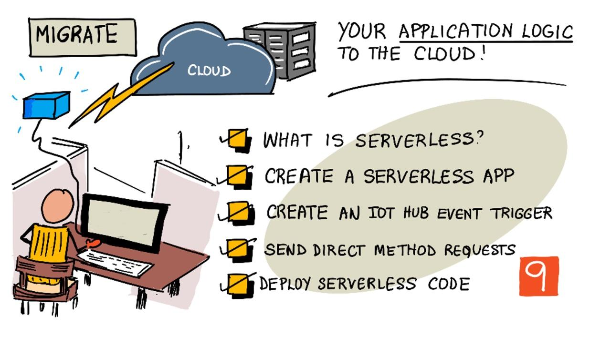

<!--
CO_OP_TRANSLATOR_METADATA:
{
  "original_hash": "5f2d2f4a5a023c93ab34a0cc5b47c0c4",
  "translation_date": "2025-08-24T22:24:16+00:00",
  "source_file": "2-farm/lessons/5-migrate-application-to-the-cloud/README.md",
  "language_code": "ja"
}
-->
# アプリケーションロジックをクラウドに移行する



> スケッチノート作成者：[Nitya Narasimhan](https://github.com/nitya)。画像をクリックすると拡大版が表示されます。

このレッスンは、[Microsoft Reactor](https://developer.microsoft.com/reactor/?WT.mc_id=academic-17441-jabenn) の [IoT for Beginners Project 2 - Digital Agriculture シリーズ](https://youtube.com/playlist?list=PLmsFUfdnGr3yCutmcVg6eAUEfsGiFXgcx) の一環として教えられました。

[](https://youtu.be/VVZDcs5u1_I)

## レクチャー前のクイズ

[レクチャー前のクイズ](https://black-meadow-040d15503.1.azurestaticapps.net/quiz/17)

## はじめに

前回のレッスンでは、植物の土壌水分モニタリングとリレー制御をクラウドベースのIoTサービスに接続する方法を学びました。次のステップは、リレーのタイミングを制御するサーバーコードをクラウドに移行することです。このレッスンでは、サーバーレス関数を使用してこれを行う方法を学びます。

このレッスンでは以下を学びます：

* [サーバーレスとは何か](../../../../../2-farm/lessons/5-migrate-application-to-the-cloud)
* [サーバーレスアプリケーションを作成する](../../../../../2-farm/lessons/5-migrate-application-to-the-cloud)
* [IoT Hub イベントトリガーを作成する](../../../../../2-farm/lessons/5-migrate-application-to-the-cloud)
* [サーバーレスコードから直接メソッドリクエストを送信する](../../../../../2-farm/lessons/5-migrate-application-to-the-cloud)
* [サーバーレスコードをクラウドにデプロイする](../../../../../2-farm/lessons/5-migrate-application-to-the-cloud)

## サーバーレスとは何か

サーバーレス、またはサーバーレスコンピューティングとは、さまざまな種類のイベントに応じてクラウドで実行される小さなコードブロックを作成することを指します。イベントが発生するとコードが実行され、そのイベントに関するデータが渡されます。これらのイベントは、Webリクエスト、キューに置かれたメッセージ、データベース内のデータの変更、またはIoTデバイスからIoTサービスに送信されたメッセージなど、さまざまなものから発生します。


> 💁 以前にデータベーストリガーを使用したことがある場合、これは同じようなものと考えられます。例えば、行を挿入するなどのイベントによってコードがトリガーされます。


コードはイベントが発生したときにのみ実行され、それ以外の時間はコードがアクティブではありません。イベントが発生するとコードがロードされて実行されます。この仕組みにより、サーバーレスは非常にスケーラブルです。同時に多くのイベントが発生した場合、クラウドプロバイダーは必要な数だけ関数を同時に実行し、利用可能なサーバーで処理します。ただし、イベント間で情報を共有する必要がある場合は、メモリではなくデータベースなどに保存する必要があります。

コードは、イベントに関する詳細をパラメータとして受け取る関数として記述されます。これらのサーバーレス関数を記述するために、さまざまなプログラミング言語を使用できます。

> 🎓 サーバーレスは「Functions as a Service (FaaS)」とも呼ばれます。各イベントトリガーがコード内の関数として実装されるためです。

名前に反して、サーバーレスは実際にはサーバーを使用します。この名前は、開発者がコードを実行するために必要なサーバーについて気にする必要がないことを意味しています。開発者が気にするのは、イベントに応じてコードが実行されることだけです。クラウドプロバイダーは、サーバーレスの*ランタイム*を持ち、サーバーの割り当て、ネットワーキング、ストレージ、CPU、メモリなど、コードを実行するために必要なすべてを管理します。このモデルでは、サーバーごとに料金を支払うのではなく、コードが実行されている時間と使用されるメモリ量に基づいて料金を支払います。

> 💰 サーバーレスはクラウドでコードを実行する最も安価な方法の1つです。例えば、執筆時点では、あるクラウドプロバイダーでは、すべてのサーバーレス関数を月に合計1,000,000回実行するまで料金が発生せず、それ以降は1,000,000回の実行ごとに0.20米ドルが課金されます。コードが実行されていないときは料金が発生しません。

IoT開発者にとって、サーバーレスモデルは理想的です。クラウドホストされたIoTサービスに接続された任意のIoTデバイスから送信されたメッセージに応じて呼び出される関数を記述できます。コードは送信されたすべてのメッセージを処理しますが、必要なときにのみ実行されます。

✅ MQTTを介してメッセージをリッスンするサーバーコードとして記述したコードを振り返ってみてください。これがサーバーレスを使用してクラウドでどのように実行されるかを考えてみましょう。サーバーレスコンピューティングをサポートするためにコードがどのように変更されるかを考えてみてください。

> 💁 サーバーレスモデルは、コードの実行以外のクラウドサービスにも広がっています。例えば、サーバーレスデータベースは、クエリや挿入などのリクエストごとに料金を支払うサーバーレス料金モデルを使用してクラウドで利用できます。例えば、主キーに対して1行を選択する単純なクエリは、多くのテーブルを結合し、数千行を返す複雑な操作よりもコストが低くなります。

## サーバーレスアプリケーションを作成する

MicrosoftのサーバーレスコンピューティングサービスはAzure Functionsと呼ばれます。


以下の短いビデオでは、Azure Functionsの概要を説明しています。

[](https://www.youtube.com/watch?v=8-jz5f_JyEQ)

> 🎥 上の画像をクリックしてビデオを視聴してください。

✅ 少し時間を取って、[Microsoft Azure Functions ドキュメント](https://docs.microsoft.com/azure/azure-functions/functions-overview?WT.mc_id=academic-17441-jabenn)でAzure Functionsの概要を読んでみてください。

Azure Functionsを記述するには、選択した言語でAzure Functionsアプリを作成します。Azure Functionsは、Python、JavaScript、TypeScript、C#、F#、Java、Powershellをサポートしています。このレッスンでは、PythonでAzure Functionsアプリを記述する方法を学びます。

> 💁 Azure Functionsはカスタムハンドラーもサポートしており、HTTPリクエストをサポートする任意の言語で関数を記述できます。これには、COBOLのような古い言語も含まれます。

Functionsアプリは1つ以上の*トリガー*で構成されます。トリガーはイベントに応答する関数です。1つのFunctionsアプリ内に複数のトリガーを持つことができ、共通の設定を共有します。例えば、Functionsアプリの設定ファイルにIoT Hubの接続情報を記載し、アプリ内のすべての関数がこれを使用して接続し、イベントをリッスンできます。

### タスク - Azure Functionsツールのインストール

> 執筆時点では、Azure FunctionsのコードツールはApple SiliconでのPythonプロジェクトに完全には対応していません。IntelベースのMac、Windows PC、またはLinux PCを使用する必要があります。

Azure Functionsの大きな特徴の1つは、ローカルで実行できることです。クラウドで使用されるのと同じランタイムをコンピュータ上で実行でき、IoTメッセージに応答するコードを記述してローカルで実行できます。イベントが処理される際にコードをデバッグすることも可能です。コードに満足したら、クラウドにデプロイできます。

Azure FunctionsツールはCLIとして利用可能で、Azure Functions Core Toolsと呼ばれます。

1. [Azure Functions Core Tools ドキュメント](https://docs.microsoft.com/azure/azure-functions/functions-run-local?WT.mc_id=academic-17441-jabenn)の指示に従って、Azure Functions Core Toolsをインストールしてください。

1. VS Code用のAzure Functions拡張機能をインストールします。この拡張機能は、Azure Functionsの作成、デバッグ、デプロイをサポートします。[Azure Functions拡張機能ドキュメント](https://marketplace.visualstudio.com/items?WT.mc_id=academic-17441-jabenn&itemName=ms-azuretools.vscode-azurefunctions)を参照して、VS Codeにこの拡張機能をインストールする方法を確認してください。

Azure Functionsアプリをクラウドにデプロイする際には、アプリケーションファイルやログファイルなどを保存するために少量のクラウドストレージが必要です。Functionsアプリをローカルで実行する場合でも、クラウドストレージに接続する必要がありますが、実際のクラウドストレージの代わりに、[Azurite](https://github.com/Azure/Azurite)と呼ばれるストレージエミュレーターを使用できます。これはローカルで実行されますが、クラウドストレージのように動作します。

> 🎓 Azureでは、Azure Functionsが使用するストレージはAzure Storage Accountと呼ばれます。これらのアカウントは、ファイル、ブロブ、テーブル内のデータ、またはキュー内のデータを保存できます。1つのストレージアカウントを複数のアプリ（例えば、FunctionsアプリとWebアプリ）で共有することができます。

1. AzuriteはNode.jsアプリなので、Node.jsをインストールする必要があります。[Node.jsウェブサイト](https://nodejs.org/)でダウンロードとインストールの手順を確認してください。Macを使用している場合は、[Homebrew](https://formulae.brew.sh/formula/node)からもインストールできます。

1. 次のコマンドを使用してAzuriteをインストールします（`npm`はNode.jsをインストールすると一緒にインストールされます）：

    ```sh
    npm install -g azurite
    ```

1. Azuriteがデータを保存するためのフォルダーを作成します。フォルダー名は`azurite`とします：

    ```sh
    mkdir azurite
    ```

1. Azuriteを実行し、この新しいフォルダーを指定します：

    ```sh
    azurite --location azurite
    ```

    Azuriteストレージエミュレーターが起動し、ローカルFunctionsランタイムが接続できる状態になります。

    ```output
    ➜  ~ azurite --location azurite  
    Azurite Blob service is starting at http://127.0.0.1:10000
    Azurite Blob service is successfully listening at http://127.0.0.1:10000
    Azurite Queue service is starting at http://127.0.0.1:10001
    Azurite Queue service is successfully listening at http://127.0.0.1:10001
    Azurite Table service is starting at http://127.0.0.1:10002
    Azurite Table service is successfully listening at http://127.0.0.1:10002
    ```

### タスク - Azure Functionsプロジェクトを作成する

Azure Functions CLIを使用して、新しいFunctionsアプリを作成できます。

1. Functionsアプリ用のフォルダーを作成し、そのフォルダーに移動します。フォルダー名は`soil-moisture-trigger`とします：

    ```sh
    mkdir soil-moisture-trigger
    cd soil-moisture-trigger
    ```

1. このフォルダー内にPython仮想環境を作成します：

    ```sh
    python3 -m venv .venv
    ```

1. 仮想環境を有効化します：

    * Windowsの場合：
        * コマンドプロンプトまたはWindows Terminalのコマンドプロンプトを使用している場合、次を実行します：

            ```cmd
            .venv\Scripts\activate.bat
            ```

        * PowerShellを使用している場合、次を実行します：

            ```powershell
            .\.venv\Scripts\Activate.ps1
            ```

    * macOSまたはLinuxの場合、次を実行します：

        ```cmd
        source ./.venv/bin/activate
        ```

    > 💁 これらのコマンドは、仮想環境を作成した場所と同じ場所で実行する必要があります。`.venv`フォルダーに移動する必要はなく、仮想環境を有効化するコマンドやパッケージをインストールするコマンドは、仮想環境を作成したフォルダーで実行してください。

1. 次のコマンドを実行して、このフォルダー内にFunctionsアプリを作成します：

    ```sh
    func init --worker-runtime python soil-moisture-trigger
    ```

    これにより、現在のフォルダー内に3つのファイルが作成されます：

    * `host.json` - このJSONドキュメントにはFunctionsアプリの設定が含まれています。この設定を変更する必要はありません。
    * `local.settings.json` - このJSONドキュメントには、IoT Hubの接続文字列など、アプリがローカルで実行される際に使用する設定が含まれています。これらの設定はローカル専用であり、ソースコード管理に追加すべきではありません。アプリをクラウドにデプロイする際には、これらの設定はデプロイされず、代わりにアプリケーション設定から読み込まれます。これについては、このレッスンの後半で説明します。
    * `requirements.txt` - これは[Pipのrequirementsファイル](https://pip.pypa.io/en/stable/user_guide/#requirements-files)で、Functionsアプリを実行するために必要なPipパッケージが含まれています。

1. `local.settings.json`ファイルには、Functionsアプリが使用するストレージアカウントの設定があります。これはデフォルトで空の設定になっているため、設定する必要があります。Azuriteローカルストレージエミュレーターに接続するには、この値を次のように設定します：

    ```json
    "AzureWebJobsStorage": "UseDevelopmentStorage=true",
    ```

1. requirementsファイルを使用して必要なPipパッケージをインストールします：

    ```sh
    pip install -r requirements.txt
    ```

    > 💁 必要なPipパッケージはこのファイルに記載する必要があります。これにより、Functionsアプリがクラウドにデプロイされた際に、ランタイムが正しいパッケージをインストールできるようになります。

1. すべてが正しく動作していることを確認するために、Functionsランタイムを起動できます。次のコマンドを実行して起動します：

    ```sh
    func start
    ```

    ランタイムが起動し、ジョブ関数（トリガー）が見つからなかったことを報告するのが確認できます。

    ```output
    (.venv) ➜  soil-moisture-trigger func start
    Found Python version 3.9.1 (python3).
    
    Azure Functions Core Tools
    Core Tools Version:       3.0.3442 Commit hash: 6bfab24b2743f8421475d996402c398d2fe4a9e0  (64-bit)
    Function Runtime Version: 3.0.15417.0
    
    [2021-05-05T01:24:46.795Z] No job functions found.
    ```
> ⚠️ ファイアウォールの通知が表示された場合は、アクセスを許可してください。`func` アプリケーションがネットワークへの読み書きを行う必要があります。
> ⚠️ macOSを使用している場合、出力に警告が表示されることがあります:
>
> ```output
    > (.venv) ➜  soil-moisture-trigger func start
    > Found Python version 3.9.1 (python3).
    >
    > Azure Functions Core Tools
    > Core Tools Version:       3.0.3442 Commit hash: 6bfab24b2743f8421475d996402c398d2fe4a9e0  (64-bit)
    > Function Runtime Version: 3.0.15417.0
    >
    > [2021-06-16T08:18:28.315Z] Cannot create directory for shared memory usage: /dev/shm/AzureFunctions
    > [2021-06-16T08:18:28.316Z] System.IO.FileSystem: Access to the path '/dev/shm/AzureFunctions' is denied. Operation not permitted.
    > [2021-06-16T08:18:30.361Z] No job functions found.
    > ```
>
> これらの警告は、Functionsアプリが正しく起動し、実行中の関数がリストされている限り無視して構いません。[Microsoft Docs Q&Aのこの質問](https://docs.microsoft.com/answers/questions/396617/azure-functions-core-tools-error-osx-devshmazurefu.html?WT.mc_id=academic-17441-jabenn)に記載されているように、無視して問題ありません。

1. `ctrl+c`を押してFunctionsアプリを停止します。

1. VS Codeで現在のフォルダーを開きます。VS Codeを開いてからこのフォルダーを開くか、以下のコマンドを実行してください:

    ```sh
    code .
    ```

    VS CodeはFunctionsプロジェクトを検出し、次の通知を表示します:

    ```output
    Detected an Azure Functions Project in folder "soil-moisture-trigger" that may have been created outside of
    VS Code. Initialize for optimal use with VS Code?
    ```

    

    この通知から**Yes**を選択してください。

1. VS CodeターミナルでPython仮想環境が実行中であることを確認してください。必要に応じて終了して再起動してください。

## IoT Hubイベントトリガーを作成する

Functionsアプリはサーバーレスコードのシェルです。IoT Hubのイベントに応答するには、このアプリにIoT Hubトリガーを追加できます。このトリガーは、IoT Hubに送信されるメッセージのストリームに接続し、それに応答する必要があります。このメッセージストリームを取得するには、トリガーがIoT Hubの*イベントハブ互換エンドポイント*に接続する必要があります。

IoT Hubは、Azure Event Hubsという別のAzureサービスに基づいています。Event Hubsはメッセージの送受信を可能にするサービスであり、IoT Hubはこれを拡張してIoTデバイス向けの機能を追加しています。IoT Hubからメッセージを読み取る方法は、Event Hubsを使用する場合と同じです。

✅ 調査してみましょう: [Azure Event Hubsのドキュメント](https://docs.microsoft.com/azure/event-hubs/event-hubs-about?WT.mc_id=academic-17441-jabenn)でEvent Hubsの概要を読んでください。基本的な機能がIoT Hubとどのように比較されるか確認してください。

IoTデバイスがIoT Hubに接続するには、許可されたデバイスのみが接続できるようにする秘密鍵を使用する必要があります。同様に、メッセージを読み取るために接続する場合も、コードには秘密鍵を含む接続文字列が必要です。この接続文字列には、IoT Hubの詳細も含まれています。

> 💁 デフォルトの接続文字列には**iothubowner**の権限が含まれており、それを使用するコードにIoT Hub上の完全な権限を与えます。理想的には、必要最低限の権限で接続するべきです。この点については次のレッスンで説明します。

トリガーが接続されると、IoT Hubに送信されるすべてのメッセージに対して関数内のコードが呼び出されます。どのデバイスが送信したかに関係なく、トリガーはメッセージをパラメータとして受け取ります。

### タスク - Event Hub互換エンドポイント接続文字列を取得する

1. VS Codeターミナルで以下のコマンドを実行し、IoT HubのEvent Hub互換エンドポイントの接続文字列を取得します:

    ```sh
    az iot hub connection-string show --default-eventhub \
                                      --output table \
                                      --hub-name <hub_name>
    ```

    `<hub_name>`を使用したIoT Hubの名前に置き換えてください。

1. VS Codeで`local.settings.json`ファイルを開きます。`Values`セクション内に以下の値を追加してください:

    ```json
    "IOT_HUB_CONNECTION_STRING": "<connection string>"
    ```

    `<connection string>`を前のステップで取得した値に置き換えてください。このJSONを有効にするために、上の行の後にカンマを追加する必要があります。

### タスク - イベントトリガーを作成する

これでイベントトリガーを作成する準備が整いました。

1. VS Codeターミナルで、`soil-moisture-trigger`フォルダー内から以下のコマンドを実行してください:

    ```sh
    func new --name iot-hub-trigger --template "Azure Event Hub trigger"
    ```

    これにより、`iot-hub-trigger`という新しいFunctionが作成されます。このトリガーはIoT HubのEvent Hub互換エンドポイントに接続するため、Event Hubトリガーを使用します。特定のIoT Hubトリガーは存在しません。

これにより、`soil-moisture-trigger`フォルダー内に`iot-hub-trigger`というフォルダーが作成され、このフォルダーには以下のファイルが含まれます:

* `__init__.py` - このPythonコードファイルにはトリガーが含まれており、標準的なPythonファイル名の規則に従ってこのフォルダーをPythonモジュールに変えています。

    このファイルには以下のコードが含まれます:

    ```python
    import logging

    import azure.functions as func


    def main(event: func.EventHubEvent):
        logging.info('Python EventHub trigger processed an event: %s',
                    event.get_body().decode('utf-8'))
    ```

    トリガーの中心は`main`関数です。この関数がIoT Hubからのイベントとともに呼び出されます。この関数には`event`というパラメータがあり、`EventHubEvent`が含まれます。IoT Hubにメッセージが送信されるたびに、この関数が呼び出され、メッセージが`event`として渡されます。また、前のレッスンで見た注釈と同じプロパティも渡されます。

    この関数の中心はイベントをログに記録することです。

* `function.json` - このファイルにはトリガーの設定が含まれています。主な設定は`bindings`というセクションにあります。バインディングとは、Azure Functionsと他のAzureサービス間の接続を指します。この関数にはEvent Hubへの入力バインディングがあり、Event Hubに接続してデータを受信します。

    > 💁 出力バインディングを追加することも可能で、関数の出力を別のサービスに送信できます。例えば、データベースへの出力バインディングを追加し、関数からIoT Hubイベントを返すことで、自動的にデータベースに挿入されます。

    ✅ 調査してみましょう: [Azure Functionsのトリガーとバインディングの概念ドキュメント](https://docs.microsoft.com/azure/azure-functions/functions-triggers-bindings?WT.mc_id=academic-17441-jabenn&tabs=python)でバインディングについて学んでください。

    `bindings`セクションにはバインディングの設定が含まれています。注目すべき値は以下の通りです:

  * `"type": "eventHubTrigger"` - この関数がEvent Hubからのイベントをリッスンする必要があることを示します。
  * `"name": "events"` - Event Hubイベントのパラメータ名です。これはPythonコード内の`main`関数のパラメータ名と一致します。
  * `"direction": "in"` - これは入力バインディングであり、Event Hubからのデータが関数に入ります。
  * `"connection": ""` - 接続文字列を読み取る設定名を定義します。ローカルで実行する場合、この設定は`local.settings.json`ファイルから読み取られます。

    > 💁 接続文字列は`function.json`ファイルに保存することはできません。設定から読み取る必要があります。これは接続文字列を誤って公開しないようにするためです。

1. [Azure Functionsテンプレートのバグ](https://github.com/Azure/azure-functions-templates/issues/1250)により、`function.json`の`cardinality`フィールドに誤った値が設定されています。このフィールドを`many`から`one`に更新してください:

    ```json
    "cardinality": "one",
    ```

1. `function.json`ファイル内の`"connection"`の値を、`local.settings.json`ファイルに追加した新しい値を指すように更新してください:

    ```json
    "connection": "IOT_HUB_CONNECTION_STRING",
    ```

    > 💁 これは設定を指す必要があり、実際の接続文字列を含めてはいけません。

1. 接続文字列には`eventHubName`の値が含まれているため、`function.json`ファイル内のこの値を空文字列に設定する必要があります。この値を以下のように更新してください:

    ```json
    "eventHubName": "",
    ```

### タスク - イベントトリガーを実行する

1. IoT Hubイベントモニターを実行していないことを確認してください。Functionsアプリと同時に実行している場合、Functionsアプリはイベントに接続して消費することができません。

    > 💁 複数のアプリが異なる*コンシューマーグループ*を使用してIoT Hubエンドポイントに接続できます。これについては後のレッスンで説明します。

1. Functionsアプリを実行するには、VS Codeターミナルから以下のコマンドを実行してください:

    ```sh
    func start
    ```

    Functionsアプリが起動し、`iot-hub-trigger`関数を検出します。その後、過去1日にIoT Hubに送信されたイベントを処理します。

    ```output
    (.venv) ➜  soil-moisture-trigger func start
    Found Python version 3.9.1 (python3).
    
    Azure Functions Core Tools
    Core Tools Version:       3.0.3442 Commit hash: 6bfab24b2743f8421475d996402c398d2fe4a9e0  (64-bit)
    Function Runtime Version: 3.0.15417.0
    
    Functions:
    
            iot-hub-trigger: eventHubTrigger
    
    For detailed output, run func with --verbose flag.
    [2021-05-05T02:44:07.517Z] Worker process started and initialized.
    [2021-05-05T02:44:09.202Z] Executing 'Functions.iot-hub-trigger' (Reason='(null)', Id=802803a5-eae9-4401-a1f4-176631456ce4)
    [2021-05-05T02:44:09.205Z] Trigger Details: PartitionId: 0, Offset: 1011240-1011632, EnqueueTimeUtc: 2021-05-04T19:04:04.2030000Z-2021-05-04T19:04:04.3900000Z, SequenceNumber: 2546-2547, Count: 2
    [2021-05-05T02:44:09.352Z] Python EventHub trigger processed an event: {"soil_moisture":628}
    [2021-05-05T02:44:09.354Z] Python EventHub trigger processed an event: {"soil_moisture":624}
    [2021-05-05T02:44:09.395Z] Executed 'Functions.iot-hub-trigger' (Succeeded, Id=802803a5-eae9-4401-a1f4-176631456ce4, Duration=245ms)
    ```

    関数の各呼び出しは、出力内で`Executing 'Functions.iot-hub-trigger'`/`Executed 'Functions.iot-hub-trigger'`ブロックで囲まれます。これにより、各関数呼び出しで処理されたメッセージの数を確認できます。

1. IoTデバイスが実行中であることを確認してください。Functionsアプリに新しい土壌水分メッセージが表示されます。

1. Functionsアプリを停止して再起動してください。以前のメッセージは再度処理されず、新しいメッセージのみが処理されることを確認してください。

> 💁 VS CodeではFunctionsのデバッグもサポートされています。コードの各行の開始部分をクリックしてブレークポイントを設定するか、コード行にカーソルを置いて*Run -> Toggle breakpoint*を選択するか、`F9`を押してください。*Run -> Start debugging*を選択するか、`F5`を押すか、*Run and debug*ペインを選択して**Start debugging**ボタンをクリックすることでデバッガーを起動できます。これにより、処理されているイベントの詳細を確認できます。

#### トラブルシューティング

* 以下のエラーが発生した場合:

    ```output
    The listener for function 'Functions.iot-hub-trigger' was unable to start. Microsoft.WindowsAzure.Storage: Connection refused. System.Net.Http: Connection refused. System.Private.CoreLib: Connection refused.
    ```

    Azuriteが実行中であり、`local.settings.json`ファイルの`AzureWebJobsStorage`が`UseDevelopmentStorage=true`に設定されていることを確認してください。

* 以下のエラーが発生した場合:

    ```output
    System.Private.CoreLib: Exception while executing function: Functions.iot-hub-trigger. System.Private.CoreLib: Result: Failure Exception: AttributeError: 'list' object has no attribute 'get_body'
    ```

    `function.json`ファイルの`cardinality`が`one`に設定されていることを確認してください。

* 以下のエラーが発生した場合:

    ```output
    Azure.Messaging.EventHubs: The path to an Event Hub may be specified as part of the connection string or as a separate value, but not both.  Please verify that your connection string does not have the `EntityPath` token if you are passing an explicit Event Hub name. (Parameter 'connectionString').
    ```

    `function.json`ファイルの`eventHubName`が空文字列に設定されていることを確認してください。

## サーバーレスコードから直接メソッドリクエストを送信する

これまで、FunctionsアプリはEvent Hub互換エンドポイントを使用してIoT Hubからのメッセージをリッスンしていました。次に、IoTデバイスにコマンドを送信する必要があります。これは、*Registry Manager*を介してIoT Hubへの別の接続を使用して行います。Registry Managerは、IoT Hubに登録されているデバイスを確認し、クラウドからデバイスへのメッセージ、直接メソッドリクエスト、またはデバイスタインの更新を送信するためのツールです。また、IoT Hubからデバイスを登録、更新、削除することもできます。

Registry Managerに接続するには、接続文字列が必要です。

### タスク - Registry Manager接続文字列を取得する

1. 接続文字列を取得するには、以下のコマンドを実行してください:

    ```sh
    az iot hub connection-string show --policy-name service \
                                      --output table \
                                      --hub-name <hub_name>
    ```

    `<hub_name>`を使用したIoT Hubの名前に置き換えてください。

    接続文字列は、`--policy-name service`パラメータを使用して*ServiceConnect*ポリシーに対してリクエストされます。接続文字列をリクエストする際に、その接続文字列で許可される権限を指定できます。ServiceConnectポリシーは、コードが接続してIoTデバイスにメッセージを送信できるようにします。

    ✅ 調査してみましょう: [IoT Hubの権限に関するドキュメント](https://docs.microsoft.com/azure/iot-hub/iot-hub-devguide-security#iot-hub-permissions?WT.mc_id=academic-17441-jabenn)で異なるポリシーについて学んでください。

1. VS Codeで`local.settings.json`ファイルを開きます。`Values`セクション内に以下の値を追加してください:

    ```json
    "REGISTRY_MANAGER_CONNECTION_STRING": "<connection string>"
    ```

    `<connection string>`を前のステップで取得した値に置き換えてください。このJSONを有効にするために、上の行の後にカンマを追加する必要があります。

### タスク - デバイスに直接メソッドリクエストを送信する

1. Registry ManagerのSDKはPipパッケージを介して利用可能です。`requirements.txt`ファイルに以下の行を追加して、このパッケージへの依存関係を追加してください:

    ```sh
    azure-iot-hub
    ```

1. VS Codeターミナルで仮想環境がアクティブになっていることを確認し、以下のコマンドを実行してPipパッケージをインストールしてください:

    ```sh
    pip install -r requirements.txt
    ```

1. `__init__.py`ファイルに以下のインポートを追加してください:

    ```python
    import json
    import os
    from azure.iot.hub import IoTHubRegistryManager
    from azure.iot.hub.models import CloudToDeviceMethod
    ```

    これにより、システムライブラリと、Registry Managerと直接メソッドリクエストを送信するためのライブラリがインポートされます。

1. `main`メソッド内のコードを削除しますが、メソッド自体は保持してください。

1. `main`メソッド内に以下のコードを追加してください:

    ```python
    body = json.loads(event.get_body().decode('utf-8'))
    device_id = event.iothub_metadata['connection-device-id']

    logging.info(f'Received message: {body} from {device_id}')
    ```

    このコードは、IoTデバイスによって送信されたJSONメッセージを含むイベントの本文を抽出します。

    次に、メッセージとともに渡された注釈からデバイスIDを取得します。イベントの本文にはテレメトリとして送信されたメッセージが含まれ、`iothub_metadata`辞書にはデバイスIDやメッセージが送信された時間など、IoT Hubによって設定されたプロパティが含まれています。

    この情報はログに記録されます。Functionsアプリをローカルで実行すると、このログをターミナルで確認できます。

1. この下に以下のコードを追加してください:

    ```python
    soil_moisture = body['soil_moisture']

    if soil_moisture > 450:
        direct_method = CloudToDeviceMethod(method_name='relay_on', payload='{}')
    else:
        direct_method = CloudToDeviceMethod(method_name='relay_off', payload='{}')
    ```

    このコードはメッセージから土壌水分を取得します。その後、土壌水分の値に応じて、`relay_on`または`relay_off`直接メソッドリクエストのヘルパークラスを作成します。このメソッドリクエストにはペイロードが必要ないため、空のJSONドキュメントが送信されます。

1. この下に以下のコードを追加してください:

    ```python
    logging.info(f'Sending direct method request for {direct_method.method_name} for device {device_id}')

    registry_manager_connection_string = os.environ['REGISTRY_MANAGER_CONNECTION_STRING']
    registry_manager = IoTHubRegistryManager(registry_manager_connection_string)
    ```
このコードは、`local.settings.json`ファイルから`REGISTRY_MANAGER_CONNECTION_STRING`を読み込みます。このファイル内の値は環境変数として利用可能になり、`os.environ`関数を使用して読み取ることができます。この関数は、すべての環境変数を含む辞書を返します。

> 💁 このコードがクラウドにデプロイされると、`local.settings.json`ファイル内の値は*アプリケーション設定*として設定され、環境変数から読み取ることができます。

その後、このコードは接続文字列を使用してRegistry Managerヘルパークラスのインスタンスを作成します。

1. 以下のコードを追加してください：

    ```python
    registry_manager.invoke_device_method(device_id, direct_method)

    logging.info('Direct method request sent!')
    ```

    このコードは、レジストリマネージャーにテレメトリを送信したデバイスに直接メソッドリクエストを送信するよう指示します。

    > 💁 以前のレッスンでMQTTを使用して作成したアプリのバージョンでは、リレー制御コマンドがすべてのデバイスに送信されていました。このコードは、デバイスが1つしかないことを前提としていました。このバージョンのコードでは、メソッドリクエストを単一のデバイスに送信するため、複数の土壌湿度センサーとリレーをセットアップしている場合でも、正しいデバイスに正しいメソッドリクエストを送信することができます。

1. Functionsアプリを実行し、IoTデバイスがデータを送信していることを確認してください。メッセージが処理され、直接メソッドリクエストが送信されるのがわかります。土壌湿度センサーを土壌に出し入れして、値が変化し、リレーがオン・オフするのを確認してください。

> 💁 このコードは[code/functions](../../../../../2-farm/lessons/5-migrate-application-to-the-cloud/code/functions)フォルダーにあります。

## サーバーレスコードをクラウドにデプロイする

コードはローカルで動作しているので、次のステップはFunctionsアプリをクラウドにデプロイすることです。

### タスク - クラウドリソースを作成する

FunctionsアプリをAzureのFunctions Appリソースにデプロイする必要があります。このリソースは、IoT Hub用に作成したリソースグループ内に配置されます。また、ローカルでエミュレートしているストレージアカウントをAzureで作成する必要があります。

1. 以下のコマンドを実行してストレージアカウントを作成してください：

    ```sh
    az storage account create --resource-group soil-moisture-sensor \
                              --sku Standard_LRS \
                              --name <storage_name> 
    ```

    `<storage_name>`をストレージアカウントの名前に置き換えてください。この名前はグローバルで一意である必要があり、ストレージアカウントにアクセスするためのURLの一部を形成します。この名前には小文字と数字のみを使用でき、24文字以内に制限されています。例えば、`sms`の後にランダムな単語や名前を追加して一意にしてください。

    `--sku Standard_LRS`は価格帯を選択し、最も低コストの汎用アカウントを選択します。ストレージには無料プランがなく、使用量に応じて料金が発生します。コストは比較的低く、最も高価なストレージでも1ギガバイトあたり月額0.05米ドル未満です。

    ✅ [Azure Storage Accountの価格ページ](https://azure.microsoft.com/pricing/details/storage/?WT.mc_id=academic-17441-jabenn)で価格について確認してください。

1. 以下のコマンドを実行してFunction Appを作成してください：

    ```sh
    az functionapp create --resource-group soil-moisture-sensor \
                          --runtime python \
                          --functions-version 3 \
                          --os-type Linux \
                          --consumption-plan-location <location> \
                          --storage-account <storage_name> \
                          --name <functions_app_name>
    ```

    `<location>`を前のレッスンでリソースグループを作成した場所に置き換えてください。

    `<storage_name>`を前のステップで作成したストレージアカウントの名前に置き換えてください。

    `<functions_app_name>`をFunctions Appの一意の名前に置き換えてください。この名前はグローバルで一意である必要があり、Functions AppにアクセスするためのURLの一部を形成します。例えば、`soil-moisture-sensor-`の後にランダムな単語や名前を追加して一意にしてください。

    `--functions-version 3`オプションは、使用するAzure Functionsのバージョンを設定します。バージョン3は最新バージョンです。

    `--os-type Linux`は、これらの関数をホストするOSとしてLinuxを使用するようFunctionsランタイムに指示します。Functionsは使用するプログラミング言語に応じてLinuxまたはWindowsでホストできます。PythonアプリはLinuxでのみサポートされています。

### タスク - アプリケーション設定をアップロードする

Functions Appを開発する際、IoT Hubの接続文字列用に`local.settings.json`ファイルにいくつかの設定を保存しました。これらの設定をAzureのFunction Appのアプリケーション設定に書き込む必要があります。これにより、コードで使用できるようになります。

> 🎓 `local.settings.json`ファイルはローカル開発用の設定専用であり、GitHubなどのソースコード管理にチェックインすべきではありません。クラウドにデプロイされると、アプリケーション設定が使用されます。アプリケーション設定はクラウドにホストされるキー/値ペアであり、コード内またはランタイムによって環境変数から読み取られます。

1. 以下のコマンドを実行して、Functions Appのアプリケーション設定に`IOT_HUB_CONNECTION_STRING`設定を追加してください：

    ```sh
    az functionapp config appsettings set --resource-group soil-moisture-sensor \
                                          --name <functions_app_name> \
                                          --settings "IOT_HUB_CONNECTION_STRING=<connection string>"
    ```

    `<functions_app_name>`をFunctions Appの名前に置き換えてください。

    `<connection string>`を`local.settings.json`ファイルの`IOT_HUB_CONNECTION_STRING`の値に置き換えてください。

1. 上記の手順を繰り返し、`REGISTRY_MANAGER_CONNECTION_STRING`の値を`local.settings.json`ファイルの対応する値に設定してください。

これらのコマンドを実行すると、関数アプリのすべてのアプリケーション設定のリストが出力されます。これを使用して、値が正しく設定されているか確認できます。

> 💁 `AzureWebJobsStorage`の値がすでに設定されているのがわかります。`local.settings.json`ファイルでは、ローカルストレージエミュレータを使用する値に設定されていました。Functions Appを作成するときにストレージアカウントをパラメータとして渡すと、この設定が自動的に設定されます。

### タスク - Functions Appをクラウドにデプロイする

Functions Appが準備できたので、コードをデプロイできます。

1. VS Codeのターミナルから以下のコマンドを実行してFunctions Appを公開してください：

    ```sh
    func azure functionapp publish <functions_app_name>
    ```

    `<functions_app_name>`をFunctions Appの名前に置き換えてください。

コードはパッケージ化され、Functions Appに送信され、そこでデプロイされて開始されます。多くのコンソール出力が表示され、デプロイメントの確認とデプロイされた関数のリストで終了します。この場合、リストにはトリガーのみが含まれます。

```output
Deployment successful.
Remote build succeeded!
Syncing triggers...
Functions in soil-moisture-sensor:
    iot-hub-trigger - [eventHubTrigger]
```

IoTデバイスが稼働していることを確認してください。土壌湿度を調整したり、センサーを土壌に出し入れすることで湿度レベルを変更してください。土壌湿度が変化するとリレーがオン・オフするのがわかります。

---

## 🚀 チャレンジ

前のレッスンでは、リレーのタイミングを管理するために、リレーがオンの間とオフになった直後にMQTTメッセージの購読を解除しました。しかし、ここではこの方法を使用することはできません。IoT Hubトリガーの購読を解除することはできません。

Functions Appでこれを処理する別の方法を考えてみてください。

## 講義後のクイズ

[講義後のクイズ](https://black-meadow-040d15503.1.azurestaticapps.net/quiz/18)

## 復習と自己学習

* Wikipediaの[サーバーレスコンピューティングのページ](https://wikipedia.org/wiki/Serverless_computing)でサーバーレスコンピューティングについて学んでください。
* Azureでのサーバーレスの使用について、さらに例を含む[Azureブログ投稿「IoTニーズのためのサーバーレス」](https://azure.microsoft.com/blog/go-serverless-for-your-iot-needs/?WT.mc_id=academic-17441-jabenn)を読んでください。
* [Azure Functions YouTubeチャンネル](https://www.youtube.com/c/AzureFunctions)でAzure Functionsについてさらに学んでください。

## 課題

[手動リレー制御を追加する](assignment.md)

**免責事項**:  
この文書は、AI翻訳サービス [Co-op Translator](https://github.com/Azure/co-op-translator) を使用して翻訳されています。正確性を追求しておりますが、自動翻訳には誤りや不正確な部分が含まれる可能性があることをご承知ください。元の言語で記載された文書が正式な情報源とみなされるべきです。重要な情報については、専門の人間による翻訳を推奨します。この翻訳の使用に起因する誤解や誤解釈について、当社は責任を負いません。