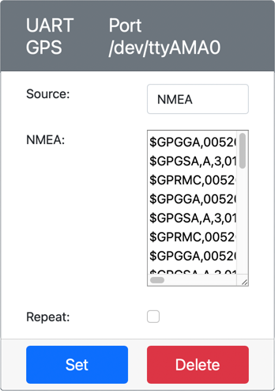

<!--
CO_OP_TRANSLATOR_METADATA:
{
  "original_hash": "64f18a8f8aaa1fef5e7320e0992d8b3a",
  "translation_date": "2025-08-25T00:46:20+00:00",
  "source_file": "3-transport/lessons/1-location-tracking/virtual-device-gps-sensor.md",
  "language_code": "ja"
}
-->
# GPSデータを読み取る - 仮想IoTハードウェア

このレッスンのこの部分では、仮想IoTデバイスにGPSセンサーを追加し、その値を読み取ります。

## 仮想ハードウェア

仮想IoTデバイスは、シリアルポートを介してUARTでアクセス可能なシミュレートされたGPSセンサーを使用します。

物理的なGPSセンサーには、GPS衛星からの電波を受信するためのアンテナがあり、GPS信号をGPSデータに変換します。仮想版では、緯度と経度を設定したり、生のNMEA文を送信したり、複数の位置を含むGPXファイルをアップロードして順次返すことができます。

> 🎓 NMEA文については、このレッスンの後半で説明します。

### CounterFitにセンサーを追加する

仮想GPSセンサーを使用するには、CounterFitアプリにセンサーを追加する必要があります。

#### タスク - CounterFitにセンサーを追加する

CounterFitアプリにGPSセンサーを追加します。

1. `gps-sensor`というフォルダーに単一のファイル`app.py`を含む新しいPythonアプリを作成し、Python仮想環境を設定して、CounterFitのpipパッケージを追加します。

    > ⚠️ 必要に応じて、[レッスン1のCounterFit Pythonプロジェクトの作成と設定に関する手順](../../../1-getting-started/lessons/1-introduction-to-iot/virtual-device.md)を参照してください。

1. シリアル接続を介してUARTベースのセンサーと通信できるCounterFitシムをインストールするための追加のPipパッケージをインストールします。この操作は、仮想環境が有効化されたターミナルで行ってください。

    ```sh
    pip install counterfit-shims-serial
    ```

1. CounterFitウェブアプリが実行中であることを確認します。

1. GPSセンサーを作成します：

    1. *Sensors*ペインの*Create sensor*ボックスで、*Sensor type*ドロップダウンを開き、*UART GPS*を選択します。

    1. *Port*は*/dev/ttyAMA0*のままにします。

    1. **Add**ボタンを選択して、ポート`/dev/ttyAMA0`にGPSセンサーを作成します。

    

    GPSセンサーが作成され、センサーリストに表示されます。

    

## GPSセンサーをプログラムする

仮想IoTデバイスは、仮想GPSセンサーを使用するようにプログラムできます。

### タスク - GPSセンサーをプログラムする

GPSセンサーアプリをプログラムします。

1. `gps-sensor`アプリがVS Codeで開かれていることを確認します。

1. `app.py`ファイルを開きます。

1. CounterFitにアプリを接続するために、以下のコードを`app.py`の先頭に追加します：

    ```python
    from counterfit_connection import CounterFitConnection
    CounterFitConnection.init('127.0.0.1', 5000)
    ```

1. 必要なライブラリをインポートするために、以下のコードをその下に追加します。これには、CounterFitシリアルポート用のライブラリも含まれます：

    ```python
    import time
    import counterfit_shims_serial
    
    serial = counterfit_shims_serial.Serial('/dev/ttyAMA0')
    ```

    このコードは、`counterfit_shims_serial` Pipパッケージから`serial`モジュールをインポートします。その後、仮想GPSセンサーがUARTポート用に使用するシリアルポート`/dev/ttyAMA0`に接続します。

1. シリアルポートからデータを読み取り、値をコンソールに出力するために、以下のコードをその下に追加します：

    ```python
    def print_gps_data(line):
        print(line.rstrip())
    
    while True:
        line = serial.readline().decode('utf-8')
    
        while len(line) > 0:
            print_gps_data(line)
            line = serial.readline().decode('utf-8')
    
        time.sleep(1)
    ```

    `print_gps_data`という関数が定義され、渡された行をコンソールに出力します。

    次に、コードは無限ループで動作し、各ループでシリアルポートから可能な限り多くのテキスト行を読み取ります。各行に対して`print_gps_data`関数を呼び出します。

    すべてのデータが読み取られた後、ループは1秒間スリープし、再試行します。

1. このコードを実行します。CounterFitアプリが実行中のターミナルとは別のターミナルを使用して実行してください。CounterFitアプリが引き続き実行されるようにします。

1. CounterFitアプリからGPSセンサーの値を変更します。以下のいずれかの方法で行うことができます：

    * **Source**を`Lat/Lon`に設定し、明示的な緯度、経度、およびGPS固定に使用される衛星の数を設定します。この値は一度だけ送信されるため、データを毎秒繰り返すには**Repeat**ボックスをチェックします。

      

    * **Source**を`NMEA`に設定し、NMEA文をテキストボックスに追加します。これらの値はすべて送信され、各新しいGGA（位置固定）文が読み取られる前に1秒の遅延があります。

      

      [nmeagen.org](https://www.nmeagen.org)のようなツールを使用して、地図上で描画してこれらの文を生成できます。これらの値は一度だけ送信されるため、すべて送信された後に1秒間隔でデータを繰り返すには**Repeat**ボックスをチェックします。

    * **Source**をGPXファイルに設定し、トラック位置を含むGPXファイルをアップロードします。[AllTrails](https://www.alltrails.com/)のような人気のある地図やハイキングサイトからGPXファイルをダウンロードできます。これらのファイルにはトレイルとして複数のGPS位置が含まれており、GPSセンサーは1秒間隔で各新しい位置を返します。

      

      これらの値は一度だけ送信されるため、すべて送信された後に1秒間隔でデータを繰り返すには**Repeat**ボックスをチェックします。

    GPS設定を構成したら、**Set**ボタンを選択してこれらの値をセンサーにコミットします。

1. GPSセンサーからの生データ出力が以下のように表示されます：

    ```output
    $GNGGA,020604.001,4738.538654,N,12208.341758,W,1,3,,164.7,M,-17.1,M,,*67
    $GNGGA,020604.001,4738.538654,N,12208.341758,W,1,3,,164.7,M,-17.1,M,,*67
    ```

> 💁 このコードは[code-gps/virtual-device](../../../../../3-transport/lessons/1-location-tracking/code-gps/virtual-device)フォルダーにあります。

😀 GPSセンサーのプログラムが成功しました！

**免責事項**:  
この文書は、AI翻訳サービス [Co-op Translator](https://github.com/Azure/co-op-translator) を使用して翻訳されています。正確性を期すよう努めておりますが、自動翻訳には誤りや不正確な部分が含まれる可能性があります。元の言語で記載された原文が公式な情報源と見なされるべきです。重要な情報については、専門の人間による翻訳を推奨します。本翻訳の使用に起因する誤解や誤認について、当方は一切の責任を負いません。