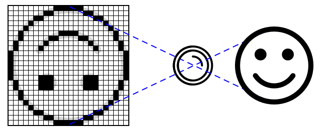

<!--
CO_OP_TRANSLATOR_METADATA:
{
  "original_hash": "557f4ee96b752e0651d2e6e74aa6bd14",
  "translation_date": "2025-08-24T21:27:11+00:00",
  "source_file": "4-manufacturing/lessons/2-check-fruit-from-device/README.md",
  "language_code": "ja"
}
-->
# IoTデバイスで果物の品質をチェックする


> スケッチノート作成者：[Nitya Narasimhan](https://github.com/nitya)。画像をクリックすると拡大版が表示されます。

## 講義前のクイズ

[講義前のクイズ](https://black-meadow-040d15503.1.azurestaticapps.net/quiz/31)

## はじめに

前回のレッスンでは、画像分類器について学び、それを使って良い果物と悪い果物を検出する方法を学びました。この画像分類器をIoTアプリケーションで使用するには、カメラを使って画像をキャプチャし、その画像をクラウドに送信して分類する必要があります。

今回のレッスンでは、カメラセンサーについて学び、それをIoTデバイスで使用して画像をキャプチャする方法を学びます。また、IoTデバイスから画像分類器を呼び出す方法も学びます。

このレッスンで学ぶ内容は以下の通りです：

* [カメラセンサー](../../../../../4-manufacturing/lessons/2-check-fruit-from-device)
* [IoTデバイスで画像をキャプチャする](../../../../../4-manufacturing/lessons/2-check-fruit-from-device)
* [画像分類器を公開する](../../../../../4-manufacturing/lessons/2-check-fruit-from-device)
* [IoTデバイスから画像を分類する](../../../../../4-manufacturing/lessons/2-check-fruit-from-device)
* [モデルを改善する](../../../../../4-manufacturing/lessons/2-check-fruit-from-device)

## カメラセンサー

カメラセンサーは、その名の通り、IoTデバイスに接続できるカメラです。静止画を撮影したり、ストリーミングビデオをキャプチャしたりすることができます。一部のカメラは生の画像データを返し、他のカメラはJPEGやPNGなどの画像ファイル形式に圧縮されたデータを返します。通常、IoTデバイスで使用されるカメラは、一般的なカメラよりも小型で解像度が低いですが、高解像度のカメラもあり、ハイエンドのスマートフォンに匹敵するものもあります。交換可能なレンズ、複数のカメラセットアップ、赤外線サーマルカメラ、UVカメラなど、さまざまな種類のカメラが利用可能です。



ほとんどのカメラセンサーは、各ピクセルがフォトダイオードで構成されたイメージセンサーを使用しています。レンズが画像をイメージセンサーに焦点を合わせ、数千または数百万のフォトダイオードがそれぞれに当たる光を検出し、ピクセルデータとして記録します。

> 💁 レンズは画像を反転させますが、カメラセンサーが画像を元の向きに戻します。これは人間の目でも同じで、目の後ろで上下逆さまに検出された画像を脳が修正します。

> 🎓 イメージセンサーはアクティブピクセルセンサー（APS）として知られており、最も一般的なAPSは相補型金属酸化膜半導体センサー、つまりCMOSセンサーです。カメラセンサーに関して「CMOSセンサー」という用語を聞いたことがあるかもしれません。

カメラセンサーはデジタルセンサーであり、通常は通信を提供するライブラリの助けを借りて、画像データをデジタルデータとして送信します。カメラはSPIのようなプロトコルを使用して接続し、大量のデータを送信します。画像は温度センサーなどの単一の数値データよりもはるかに大きいデータ量を持っています。

✅ IoTデバイスでの画像サイズに関する制限は何でしょうか？特にマイクロコントローラーハードウェアの制約について考えてみてください。

## IoTデバイスで画像をキャプチャする

IoTデバイスを使用して、分類するための画像をキャプチャできます。

### タスク - IoTデバイスで画像をキャプチャする

以下のガイドに従って、IoTデバイスを使用して画像をキャプチャしてください：

* [Arduino - Wio Terminal](wio-terminal-camera.md)
* [シングルボードコンピュータ - Raspberry Pi](pi-camera.md)
* [シングルボードコンピュータ - 仮想デバイス](virtual-device-camera.md)

## 画像分類器を公開する

前回のレッスンで画像分類器をトレーニングしました。IoTデバイスから使用する前に、このモデルを公開する必要があります。

### モデルのイテレーション

前回のレッスンでモデルをトレーニングした際、**パフォーマンス**タブにイテレーションが表示されていることに気づいたかもしれません。最初にモデルをトレーニングしたときは、トレーニング中に*Iteration 1*が表示されました。予測画像を使用してモデルを改善したときは、トレーニング中に*Iteration 2*が表示されました。

モデルをトレーニングするたびに新しいイテレーションが作成されます。これは、異なるデータセットでトレーニングされたモデルの異なるバージョンを追跡する方法です。**クイックテスト**を行うとき、ドロップダウンを使用してイテレーションを選択し、複数のイテレーション間で結果を比較できます。

イテレーションに満足したら、それを公開して外部アプリケーションから使用できるようにします。これにより、デバイスで使用される公開バージョンを持ちながら、新しいバージョンを複数のイテレーションで作業し、満足したらそれを公開することができます。

### タスク - イテレーションを公開する

イテレーションはCustom Visionポータルから公開します。

1. [CustomVision.ai](https://customvision.ai)でCustom Visionポータルを開き、まだ開いていない場合はサインインします。その後、`fruit-quality-detector`プロジェクトを開きます。

1. 上部のオプションから**パフォーマンス**タブを選択します。

1. サイドバーの*Iterations*リストから最新のイテレーションを選択します。

1. イテレーションの**公開**ボタンを選択します。

    

1. *Publish Model*ダイアログで、*Prediction resource*を前回のレッスンで作成した`fruit-quality-detector-prediction`リソースに設定します。名前は`Iteration2`のままにして、**Publish**ボタンを選択します。

1. 公開が完了したら、**Prediction URL**ボタンを選択します。これにより予測APIの詳細が表示され、IoTデバイスからモデルを呼び出す際に必要になります。下部のセクションは*If you have an image file*とラベル付けされており、ここに必要な詳細が記載されています。以下のようなURLをコピーしてください：

    ```output
    https://<location>.api.cognitive.microsoft.com/customvision/v3.0/Prediction/<id>/classify/iterations/Iteration2/image
    ```

    `<location>`はカスタムビジョンリソースを作成したときに使用した場所で、`<id>`は文字と数字で構成された長いIDです。

    また、*Prediction-Key*の値もコピーしてください。これはモデルを呼び出す際に渡す必要があるセキュアキーです。このキーを渡すアプリケーションのみがモデルを使用でき、それ以外のアプリケーションは拒否されます。

    

✅ 新しいイテレーションが公開されると、異なる名前が付けられます。IoTデバイスが使用するイテレーションをどのように変更すると思いますか？

## IoTデバイスから画像を分類する

これで、これらの接続情報を使用して、IoTデバイスから画像分類器を呼び出すことができます。

### タスク - IoTデバイスから画像を分類する

以下のガイドに従って、IoTデバイスを使用して画像を分類してください：

* [Arduino - Wio Terminal](wio-terminal-classify-image.md)
* [シングルボードコンピュータ - Raspberry Pi/仮想IoTデバイス](single-board-computer-classify-image.md)

## モデルを改善する

IoTデバイスに接続されたカメラを使用した場合、得られる結果が期待したものと一致しないことがあります。予測が、コンピュータからアップロードした画像を使用した場合ほど正確でないことがあります。これは、モデルが予測に使用されるデータとは異なるデータでトレーニングされたためです。

画像分類器で最良の結果を得るには、予測に使用される画像とできるだけ似た画像でモデルをトレーニングする必要があります。たとえば、スマートフォンのカメラを使用してトレーニング用の画像をキャプチャした場合、画像の品質、鮮明さ、色がIoTデバイスに接続されたカメラとは異なります。


上の画像では、左のバナナの画像はRaspberry Piカメラを使用して撮影され、右の画像は同じバナナを同じ場所でiPhoneを使用して撮影されました。品質には顕著な違いがあり、iPhoneの画像はより鮮明で、色が明るく、コントラストが高いです。

✅ IoTデバイスがキャプチャした画像が誤った予測をする原因として、他にどのような要因が考えられるでしょうか？IoTデバイスが使用される環境について考え、画像のキャプチャに影響を与える要因を挙げてみてください。

モデルを改善するには、IoTデバイスからキャプチャした画像を使用して再トレーニングします。

### タスク - モデルを改善する

1. IoTデバイスを使用して、熟した果物と未熟な果物の複数の画像を分類します。

1. Custom Visionポータルで、*Predictions*タブの画像を使用してモデルを再トレーニングします。

    > ⚠️ 必要に応じて、[レッスン1での分類器の再トレーニング手順](../1-train-fruit-detector/README.md#retrain-your-image-classifier)を参照してください。

1. トレーニングに使用した元の画像が現在の画像と大きく異なる場合、*Training Images*タブで元の画像をすべて選択して**削除**ボタンを押すことで削除できます。画像を選択するには、カーソルを画像の上に移動するとチェックマークが表示されるので、そのチェックマークを選択または解除してください。

1. 新しいイテレーションのモデルをトレーニングし、上記の手順を使用して公開します。

1. コード内のエンドポイントURLを更新し、アプリを再実行します。

1. 予測結果に満足するまで、これらの手順を繰り返します。

---

## 🚀 チャレンジ

画像の解像度や照明は予測にどの程度影響を与えるでしょうか？

デバイスコード内で画像の解像度を変更して、画像の品質に違いが出るか試してみてください。また、照明を変更してみてください。

農場や工場で販売する製品デバイスを作成する場合、常に一貫した結果を得るためにはどのようにすればよいでしょうか？

## 講義後のクイズ

[講義後のクイズ](https://black-meadow-040d15503.1.azurestaticapps.net/quiz/32)

## 復習と自己学習

ポータルを使用してカスタムビジョンモデルをトレーニングしました。これは画像が利用可能であることに依存していますが、現実の世界では、デバイスのカメラがキャプチャする画像に一致するトレーニングデータを取得できない場合があります。この問題を回避するために、トレーニングAPIを使用してデバイスから直接トレーニングを行い、IoTデバイスからキャプチャした画像を使用してモデルをトレーニングすることができます。

* [Custom Vision SDKクイックスタート](https://docs.microsoft.com/azure/cognitive-services/custom-vision-service/quickstarts/image-classification?WT.mc_id=academic-17441-jabenn&tabs=visual-studio&pivots=programming-language-python)でトレーニングAPIについて学んでください。

## 課題

[分類結果に応答する](assignment.md)

**免責事項**:  
この文書は、AI翻訳サービス [Co-op Translator](https://github.com/Azure/co-op-translator) を使用して翻訳されています。正確性を追求しておりますが、自動翻訳には誤りや不正確な部分が含まれる可能性があることをご承知ください。元の言語で記載された文書が正式な情報源とみなされるべきです。重要な情報については、専門の人間による翻訳を推奨します。この翻訳の使用に起因する誤解や誤解釈について、当方は一切の責任を負いません。