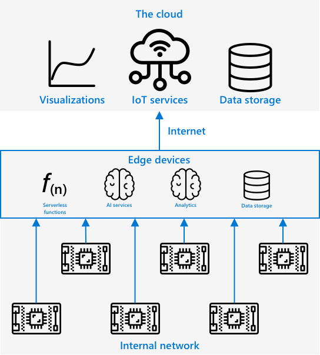

<!--
CO_OP_TRANSLATOR_METADATA:
{
  "original_hash": "2625af24587465c5547ae33d6cc000a5",
  "translation_date": "2025-08-24T21:41:42+00:00",
  "source_file": "4-manufacturing/lessons/3-run-fruit-detector-edge/README.md",
  "language_code": "ja"
}
-->
# エッジで果物検出器を実行する


> スケッチノート作成者：[Nitya Narasimhan](https://github.com/nitya)。画像をクリックすると拡大版が表示されます。

このビデオでは、IoTデバイス上で画像分類器を実行する方法についての概要を説明しています。このレッスンで取り上げるトピックです。

[](https://www.youtube.com/watch?v=_K5fqGLO8us)

## 講義前クイズ

[講義前クイズ](https://black-meadow-040d15503.1.azurestaticapps.net/quiz/33)

## はじめに

前回のレッスンでは、画像分類器を使用して熟した果物と未熟な果物を分類し、IoTデバイスのカメラで撮影した画像をインターネット経由でクラウドサービスに送信しました。しかし、これらの呼び出しには時間がかかり、コストが発生し、使用する画像データの種類によってはプライバシーの問題が生じる可能性があります。

このレッスンでは、クラウドではなく自分のネットワーク上で動作するIoTデバイスで機械学習（ML）モデルを実行する方法について学びます。エッジコンピューティングとクラウドコンピューティングの利点と欠点、AIモデルをエッジにデプロイする方法、そしてIoTデバイスからそれにアクセスする方法を学びます。

このレッスンで取り上げる内容は以下の通りです：

* [エッジコンピューティング](../../../../../4-manufacturing/lessons/3-run-fruit-detector-edge)
* [Azure IoT Edge](../../../../../4-manufacturing/lessons/3-run-fruit-detector-edge)
* [IoT Edgeデバイスを登録する](../../../../../4-manufacturing/lessons/3-run-fruit-detector-edge)
* [IoT Edgeデバイスをセットアップする](../../../../../4-manufacturing/lessons/3-run-fruit-detector-edge)
* [モデルをエクスポートする](../../../../../4-manufacturing/lessons/3-run-fruit-detector-edge)
* [デプロイ用コンテナを準備する](../../../../../4-manufacturing/lessons/3-run-fruit-detector-edge)
* [コンテナをデプロイする](../../../../../4-manufacturing/lessons/3-run-fruit-detector-edge)
* [IoT Edgeデバイスを使用する](../../../../../4-manufacturing/lessons/3-run-fruit-detector-edge)

## エッジコンピューティング

エッジコンピューティングとは、IoTデータを生成される場所にできるだけ近いコンピュータで処理することを指します。この処理をクラウドではなく、クラウドのエッジ、つまり内部ネットワークに移動させます。


これまでのレッスンでは、デバイスがデータを収集し、それをクラウドに送信して分析し、サーバーレス関数やAIモデルをクラウドで実行していました。



エッジコンピューティングでは、クラウドサービスの一部をクラウドから切り離し、IoTデバイスと同じネットワーク上で動作するコンピュータに移動させます。クラウドとの通信は必要な場合にのみ行います。例えば、エッジデバイス上でAIモデルを実行して果物の熟度を分析し、熟した果物と未熟な果物の数などの分析結果だけをクラウドに送信することができます。

✅ これまでに構築したIoTアプリケーションについて考えてみてください。その中で、どの部分をエッジに移動できるでしょうか。

### 利点

エッジコンピューティングの利点は以下の通りです：

1. **速度** - エッジコンピューティングは、デバイスと同じネットワーク上でアクションが実行されるため、時間に敏感なデータに最適です。インターネットを介した呼び出しを行う必要がないため、速度が向上します。内部ネットワークはインターネット接続よりもはるかに高速で動作し、データが移動する距離も短くなります。

    > 💁 光ファイバーケーブルを使用したインターネット接続ではデータが光速で移動しますが、データがクラウドプロバイダーに到達するまでには時間がかかることがあります。例えば、ヨーロッパからアメリカのクラウドサービスにデータを送信する場合、光ファイバーケーブルを横断するのに少なくとも28msかかります。これには、データが光ファイバーケーブルに到達するまでの時間、電気信号から光信号への変換、逆変換、クラウドプロバイダーへの到達時間は含まれていません。

    また、エッジコンピューティングではネットワークトラフィックが減少し、インターネット接続の帯域幅が限られている場合でもデータが遅延するリスクが軽減されます。

1. **リモートアクセス性** - エッジコンピューティングは、接続が制限されている場合や、接続が高額で継続的に使用できない場合に機能します。例えば、インフラが限られている人道的災害地域や発展途上国での作業時に役立ちます。

1. **コスト削減** - データ収集、保存、分析、アクションのトリガーをエッジデバイスで実行することで、クラウドサービスの使用量が減少し、IoTアプリケーションの全体的なコストを削減できます。最近では、[NVIDIAのJetson Nano](https://developer.nvidia.com/embedded/jetson-nano-developer-kit)のようなAIアクセラレーターボードなど、エッジコンピューティング用に設計されたデバイスが増加しており、100米ドル未満のコストでGPUベースのハードウェアを使用してAIワークロードを実行できます。

1. **プライバシーとセキュリティ** - エッジコンピューティングでは、データがネットワーク内に留まり、クラウドにアップロードされません。これは、特に個人を特定できる情報や機密情報に対して好まれます。また、データが分析後に保存される必要がないため、データ漏洩のリスクが大幅に軽減されます。例としては、医療データや防犯カメラの映像が挙げられます。

1. **安全でないデバイスの取り扱い** - セキュリティ上の欠陥があるデバイスをネットワークやインターネットに直接接続したくない場合、これらのデバイスを別のネットワークに接続し、ゲートウェイIoT Edgeデバイスを使用することができます。このエッジデバイスは、ネットワークやインターネットへの接続を持ち、データフローを管理します。

1. **非互換デバイスのサポート** - 例えば、HTTP接続のみ可能なデバイスやBluetooth接続しか持たないデバイスなど、IoT Hubに直接接続できないデバイスがある場合、IoT Edgeデバイスをゲートウェイデバイスとして使用し、メッセージをIoT Hubに転送できます。

✅ 調査してみましょう：エッジコンピューティングの他の利点にはどのようなものがあるでしょうか？

### 欠点

エッジコンピューティングには欠点もあり、クラウドが好まれる場合もあります：

1. **スケールと柔軟性** - クラウドコンピューティングは、ネットワークやデータのニーズに応じてリアルタイムでサーバーやリソースを追加・削減できます。エッジコンピュータを追加するには、手動でデバイスを追加する必要があります。

1. **信頼性と回復力** - クラウドコンピューティングは、冗長性や災害復旧のために複数の場所に複数のサーバーを提供します。同じレベルの冗長性をエッジで実現するには、大規模な投資と多くの設定作業が必要です。

1. **メンテナンス** - クラウドサービスプロバイダーは、システムのメンテナンスや更新を提供します。

✅ 調査してみましょう：エッジコンピューティングの他の欠点にはどのようなものがあるでしょうか？

これらの欠点は、クラウドを使用する利点の反対とも言えます。つまり、クラウドプロバイダーの専門知識やスケールに依存するのではなく、これらのデバイスを自分で構築し管理する必要があります。

ただし、エッジコンピューティングの性質そのものがいくつかのリスクを軽減します。例えば、工場で稼働しているエッジデバイスが機械からデータを収集している場合、災害復旧シナリオについて考える必要はありません。工場の電力が停止した場合、データを生成する機械も電力を失うため、バックアップエッジデバイスは必要ありません。

IoTシステムでは、クラウドとエッジコンピューティングを組み合わせて使用することが多く、システム、顧客、メンテナンス担当者のニーズに応じて各サービスを活用します。

## Azure IoT Edge


Azure IoT Edgeは、クラウドからエッジにワークロードを移動するのを支援するサービスです。デバイスをエッジデバイスとして設定し、クラウドからそのエッジデバイスにコードをデプロイできます。これにより、クラウドとエッジの機能を組み合わせることができます。

> 🎓 *ワークロード*とは、AIモデル、アプリケーション、サーバーレス関数など、何らかの作業を行うサービスを指します。

例えば、クラウドで画像分類器をトレーニングし、その後クラウドからエッジデバイスにデプロイすることができます。IoTデバイスは、インターネット経由で画像を送信する代わりに、エッジデバイスに画像を送信して分類を行います。新しいモデルのバージョンをデプロイする必要がある場合は、クラウドでトレーニングを行い、IoT Edgeを使用してエッジデバイス上のモデルを新しいバージョンに更新できます。

> 🎓 IoT Edgeにデプロイされるソフトウェアは*モジュール*と呼ばれます。デフォルトでは、IoT Edgeは`edgeAgent`や`edgeHub`モジュールなど、IoT Hubと通信するモジュールを実行します。画像分類器をデプロイする場合、これは追加のモジュールとしてデプロイされます。

IoT EdgeはIoT Hubに組み込まれているため、IoTデバイスを管理するのと同じサービスを使用してエッジデバイスを管理できます。また、同じレベルのセキュリティが提供されます。

IoT Edgeは*コンテナ*からコードを実行します。コンテナとは、コンピュータ上の他のアプリケーションから隔離された状態で実行される自己完結型のアプリケーションです。コンテナを実行すると、それはコンピュータ内で別のコンピュータのように動作し、独自のソフトウェア、サービス、アプリケーションを実行します。通常、コンテナは共有を選択しない限り、コンピュータ上の何かにアクセスすることはできません。例えば、フォルダをコンテナと共有することができます。その後、コンテナはオープンポートを介してサービスを提供し、ネットワークに接続できます。


例えば、ポート80（デフォルトのHTTPポート）で動作するWebサイトを持つコンテナを作成し、それをコンピュータ上でもポート80で公開することができます。

✅ 調査してみましょう：コンテナやDocker、Mobyなどのサービスについて調べてみてください。

Custom Visionを使用して画像分類器をダウンロードし、コンテナとしてデプロイすることができます。これをデバイスに直接実行するか、IoT Edgeを介してデプロイします。一度コンテナで実行されると、クラウド版と同じREST APIを使用してアクセスできますが、エンドポイントはコンテナを実行しているエッジデバイスを指します。

## IoT Edgeデバイスを登録する

IoT Edgeデバイスを使用するには、IoT Hubに登録する必要があります。

### タスク - IoT Edgeデバイスを登録する

1. `fruit-quality-detector`リソースグループにIoT Hubを作成します。`fruit-quality-detector`を基にした一意の名前を付けてください。

1. IoT Hubに`fruit-quality-detector-edge`という名前のIoT Edgeデバイスを登録します。これを行うコマンドは、通常のデバイスを登録するコマンドと似ていますが、`--edge-enabled`フラグを渡します。

    ```sh
    az iot hub device-identity create --edge-enabled \
                                      --device-id fruit-quality-detector-edge \
                                      --hub-name <hub_name>
    ```

    `<hub_name>`をIoT Hubの名前に置き換えてください。

1. 次のコマンドを使用してデバイスの接続文字列を取得します：

    ```sh
    az iot hub device-identity connection-string show --device-id fruit-quality-detector-edge \
                                                      --output table \
                                                      --hub-name <hub_name>
    ```

    `<hub_name>`をIoT Hubの名前に置き換えてください。

    出力に表示される接続文字列をコピーしてください。

## IoT Edgeデバイスをセットアップする

エッジデバイスの登録をIoT Hubで作成したら、エッジデバイスをセットアップできます。

### タスク - IoT Edgeランタイムをインストールして開始する

**IoT EdgeランタイムはLinuxコンテナのみを実行します。** Linux上で実行するか、Linux仮想マシンを使用してWindows上で実行できます。

* IoTデバイスとしてRaspberry Piを使用している場合、これはサポートされているLinuxバージョンを実行しており、IoT Edgeランタイムをホストできます。[Microsoft DocsのAzure IoT Edge for Linuxインストールガイド](https://docs.microsoft.com/azure/iot-edge/how-to-install-iot-edge?WT.mc_id=academic-17441-jabenn)に従って、IoT Edgeをインストールし、接続文字列を設定してください。

    > 💁 Raspberry Pi OSはDebian Linuxの派生版です。

* Raspberry Piを使用していないがLinuxコンピュータを持っている場合、IoT Edgeランタイムを実行できます。[Microsoft DocsのAzure IoT Edge for Linuxインストールガイド](https://docs.microsoft.com/azure/iot-edge/how-to-install-iot-edge?WT.mc_id=academic-17441-jabenn)に従って、IoT Edgeをインストールし、接続文字列を設定してください。

* Windowsを使用している場合、[Microsoft DocsのWindowsデバイスに最初のIoT Edgeモジュールをデプロイするクイックスタート](https://docs.microsoft.com/azure/iot-edge/quickstart?WT.mc_id=academic-17441-jabenn#install-and-start-the-iot-edge-runtime)の「IoT Edgeランタイムをインストールして開始する」セクションに従って、Linux仮想マシンにIoT Edgeランタイムをインストールできます。「モジュールをデプロイする」セクションに到達したら停止してください。

* macOSを使用している場合、クラウドで使用するIoT Edgeデバイス用の仮想マシン（VM）を作成できます。これらは、インターネット経由でアクセスできるクラウド上のコンピュータです。IoT EdgeがインストールされたLinux VMを作成できます。[IoT Edgeを実行する仮想マシンを作成するガイド](vm-iotedge.md)に従って、これを行う方法を確認してください。

## モデルをエクスポートする

分類器をエッジで実行するには、Custom Visionからエクスポート
1. [CustomVision.ai](https://customvision.ai) の Custom Vision ポータルを開き、まだサインインしていない場合はサインインしてください。その後、`fruit-quality-detector` プロジェクトを開きます。

1. **設定** ボタン（⚙ アイコン）を選択します。

1. *ドメイン* リストから *Food (compact)* を選択します。

1. *エクスポート機能* の下で、*Basic platforms (Tensorflow, CoreML, ONNX, ...)* が選択されていることを確認します。

1. 設定ページの下部で、**変更を保存** を選択します。

1. **トレーニング** ボタンを使用してモデルを再トレーニングし、*クイックトレーニング* を選択します。

### タスク - モデルをエクスポートする

モデルがトレーニングされたら、コンテナとしてエクスポートする必要があります。

1. **パフォーマンス** タブを選択し、コンパクトドメインを使用してトレーニングされた最新のイテレーションを見つけます。

1. 上部の **エクスポート** ボタンを選択します。

1. **DockerFile** を選択し、エッジデバイスに対応するバージョンを選択します：

    * Linux コンピュータ、Windows コンピュータ、または仮想マシンで IoT Edge を実行している場合は、*Linux* バージョンを選択します。
    * Raspberry Pi で IoT Edge を実行している場合は、*ARM (Raspberry Pi 3)* バージョンを選択します。

> 🎓 Docker はコンテナ管理のための最も人気のあるツールの1つであり、DockerFile はコンテナをセットアップするための指示のセットです。

1. **エクスポート** を選択して Custom Vision に関連ファイルを作成させ、**ダウンロード** を選択して ZIP ファイルとしてダウンロードします。

1. ファイルをコンピュータに保存し、フォルダを解凍します。

## コンテナをデプロイ用に準備する


モデルをダウンロードしたら、それをコンテナにビルドし、コンテナレジストリにプッシュする必要があります。コンテナレジストリは、コンテナを保存するためのオンラインの場所です。その後、IoT Edge がレジストリからコンテナをダウンロードし、デバイスにプッシュします。


このレッスンで使用するコンテナレジストリは Azure Container Registry です。これは無料サービスではないため、作業が完了したら[プロジェクトをクリーンアップ](../../../clean-up.md)してコストを節約してください。

> 💁 Azure Container Registry の利用料金は [Azure Container Registry の料金ページ](https://azure.microsoft.com/pricing/details/container-registry/?WT.mc_id=academic-17441-jabenn) で確認できます。

### タスク - Docker をインストールする

分類器をビルドしてデプロイするには、[Docker](https://www.docker.com/) をインストールする必要がある場合があります。

IoT Edge をインストールしたデバイスとは別のデバイスでコンテナをビルドする場合のみ、Docker をインストールする必要があります。IoT Edge のインストールの一環として Docker がインストールされます。

1. IoT Edge デバイスとは別のデバイスで Docker コンテナをビルドする場合は、[Docker インストールページ](https://www.docker.com/products/docker-desktop) の指示に従って Docker Desktop または Docker エンジンをインストールしてください。インストール後に Docker が実行されていることを確認してください。

### タスク - コンテナレジストリリソースを作成する

1. ターミナルまたはコマンドプロンプトから以下のコマンドを実行して Azure Container Registry リソースを作成します：

    ```sh
    az acr create --resource-group fruit-quality-detector \
                  --sku Basic \
                  --name <Container registry name>
    ```

    `<Container registry name>` をコンテナレジストリの一意の名前に置き換えます。この名前には英数字のみを使用してください。`fruitqualitydetector` をベースにすると良いでしょう。この名前はコンテナレジストリにアクセスするための URL の一部になるため、グローバルで一意である必要があります。

1. 以下のコマンドを使用して Azure Container Registry にログインします：

    ```sh
    az acr login --name <Container registry name>
    ```

    `<Container registry name>` をコンテナレジストリの名前に置き換えます。

1. 以下のコマンドを使用してコンテナレジストリを管理モードに設定し、パスワードを生成できるようにします：

    ```sh
    az acr update --admin-enabled true \
                 --name <Container registry name>
    ```

    `<Container registry name>` をコンテナレジストリの名前に置き換えます。

1. 以下のコマンドを使用してコンテナレジストリのパスワードを生成します：

    ```sh
     az acr credential renew --password-name password \
                             --output table \
                             --name <Container registry name>
    ```

    `<Container registry name>` をコンテナレジストリの名前に置き換えます。

    `PASSWORD` の値をコピーしておいてください。後で必要になります。

### タスク - コンテナをビルドする

Custom Vision からダウンロードしたものは、コンテナのビルド方法を指示する DockerFile と、カスタムビジョンモデルをホストするためのアプリケーションコード、およびそれを呼び出すための REST API を含んでいます。Docker を使用して DockerFile からタグ付きコンテナをビルドし、それをコンテナレジストリにプッシュできます。

> 🎓 コンテナには名前とバージョンを定義するタグが付けられます。コンテナを更新する必要がある場合は、同じタグで新しいバージョンをビルドできます。

1. ターミナルまたはコマンドプロンプトを開き、Custom Vision からダウンロードした解凍済みモデルのフォルダに移動します。

1. 以下のコマンドを実行してイメージをビルドし、タグ付けします：

    ```sh
    docker build --platform <platform> -t <Container registry name>.azurecr.io/classifier:v1 .
    ```

    `<platform>` をこのコンテナが実行されるプラットフォームに置き換えます。Raspberry Pi で IoT Edge を実行している場合は `linux/armhf` に設定し、それ以外の場合は `linux/amd64` に設定します。

    > 💁 IoT Edge を実行しているデバイス（例：Raspberry Pi）からこのコマンドを実行している場合、`--platform <platform>` 部分を省略できます。デフォルトで現在のプラットフォームが使用されます。

    `<Container registry name>` をコンテナレジストリの名前に置き換えます。

    > 💁 Linux または Raspberry Pi OS を使用している場合、このコマンドを実行するには `sudo` が必要な場合があります。

    Docker はイメージをビルドし、必要なすべてのソフトウェアを構成します。その後、イメージは `classifier:v1` としてタグ付けされます。

    ```output
    ➜  d4ccc45da0bb478bad287128e1274c3c.DockerFile.Linux docker build --platform linux/amd64 -t  fruitqualitydetectorjimb.azurecr.io/classifier:v1 .
    [+] Building 102.4s (11/11) FINISHED
     => [internal] load build definition from Dockerfile
     => => transferring dockerfile: 131B
     => [internal] load .dockerignore
     => => transferring context: 2B
     => [internal] load metadata for docker.io/library/python:3.7-slim
     => [internal] load build context
     => => transferring context: 905B
     => [1/6] FROM docker.io/library/python:3.7-slim@sha256:b21b91c9618e951a8cbca5b696424fa5e820800a88b7e7afd66bba0441a764d6
     => => resolve docker.io/library/python:3.7-slim@sha256:b21b91c9618e951a8cbca5b696424fa5e820800a88b7e7afd66bba0441a764d6
     => => sha256:b4d181a07f8025e00e0cb28f1cc14613da2ce26450b80c54aea537fa93cf3bda 27.15MB / 27.15MB
     => => sha256:de8ecf497b753094723ccf9cea8a46076e7cb845f333df99a6f4f397c93c6ea9 2.77MB / 2.77MB
     => => sha256:707b80804672b7c5d8f21e37c8396f319151e1298d976186b4f3b76ead9f10c8 10.06MB / 10.06MB
     => => sha256:b21b91c9618e951a8cbca5b696424fa5e820800a88b7e7afd66bba0441a764d6 1.86kB / 1.86kB
     => => sha256:44073386687709c437586676b572ff45128ff1f1570153c2f727140d4a9accad 1.37kB / 1.37kB
     => => sha256:3d94f0f2ca798607808b771a7766f47ae62a26f820e871dd488baeccc69838d1 8.31kB / 8.31kB
     => => sha256:283715715396fd56d0e90355125fd4ec57b4f0773f306fcd5fa353b998beeb41 233B / 233B
     => => sha256:8353afd48f6b84c3603ea49d204bdcf2a1daada15f5d6cad9cc916e186610a9f 2.64MB / 2.64MB
     => => extracting sha256:b4d181a07f8025e00e0cb28f1cc14613da2ce26450b80c54aea537fa93cf3bda
     => => extracting sha256:de8ecf497b753094723ccf9cea8a46076e7cb845f333df99a6f4f397c93c6ea9
     => => extracting sha256:707b80804672b7c5d8f21e37c8396f319151e1298d976186b4f3b76ead9f10c8
     => => extracting sha256:283715715396fd56d0e90355125fd4ec57b4f0773f306fcd5fa353b998beeb41
     => => extracting sha256:8353afd48f6b84c3603ea49d204bdcf2a1daada15f5d6cad9cc916e186610a9f
     => [2/6] RUN pip install -U pip
     => [3/6] RUN pip install --no-cache-dir numpy~=1.17.5 tensorflow~=2.0.2 flask~=1.1.2 pillow~=7.2.0
     => [4/6] RUN pip install --no-cache-dir mscviplib==2.200731.16
     => [5/6] COPY app /app
     => [6/6] WORKDIR /app
     => exporting to image
     => => exporting layers
     => => writing image sha256:1846b6f134431f78507ba7c079358ed66d944c0e185ab53428276bd822400386
     => => naming to fruitqualitydetectorjimb.azurecr.io/classifier:v1
    ```

### タスク - コンテナをコンテナレジストリにプッシュする

1. 以下のコマンドを使用してコンテナをコンテナレジストリにプッシュします：

    ```sh
    docker push <Container registry name>.azurecr.io/classifier:v1
    ```

    `<Container registry name>` をコンテナレジストリの名前に置き換えます。

    > 💁 Linux を使用している場合、このコマンドを実行するには `sudo` が必要な場合があります。

    コンテナはコンテナレジストリにプッシュされます。

    ```output
    ➜  d4ccc45da0bb478bad287128e1274c3c.DockerFile.Linux docker push fruitqualitydetectorjimb.azurecr.io/classifier:v1
    The push refers to repository [fruitqualitydetectorjimb.azurecr.io/classifier]
    5f70bf18a086: Pushed 
    8a1ba9294a22: Pushed 
    56cf27184a76: Pushed 
    b32154f3f5dd: Pushed 
    36103e9a3104: Pushed 
    e2abb3cacca0: Pushed 
    4213fd357bbe: Pushed 
    7ea163ba4dce: Pushed 
    537313a13d90: Pushed 
    764055ebc9a7: Pushed 
    v1: digest: sha256:ea7894652e610de83a5a9e429618e763b8904284253f4fa0c9f65f0df3a5ded8 size: 2423
    ```

1. プッシュを確認するには、以下のコマンドを使用してレジストリ内のコンテナを一覧表示します：

    ```sh
    az acr repository list --output table \
                           --name <Container registry name> 
    ```

    `<Container registry name>` をコンテナレジストリの名前に置き換えます。

    ```output
    ➜  d4ccc45da0bb478bad287128e1274c3c.DockerFile.Linux az acr repository list --name fruitqualitydetectorjimb --output table
    Result
    ----------
    classifier
    ```

    出力に分類器が表示されます。

## コンテナをデプロイする

コンテナを IoT Edge デバイスにデプロイできるようになりました。デプロイするには、デプロイメントマニフェストを定義する必要があります。これは、エッジデバイスにデプロイされるモジュールを一覧表示する JSON ドキュメントです。

### タスク - デプロイメントマニフェストを作成する

1. コンピュータの任意の場所に `deployment.json` という新しいファイルを作成します。

1. このファイルに以下を追加します：

    ```json
    {
        "content": {
            "modulesContent": {
                "$edgeAgent": {
                    "properties.desired": {
                        "schemaVersion": "1.1",
                        "runtime": {
                            "type": "docker",
                            "settings": {
                                "minDockerVersion": "v1.25",
                                "loggingOptions": "",
                                "registryCredentials": {
                                    "ClassifierRegistry": {
                                        "username": "<Container registry name>",
                                        "password": "<Container registry password>",
                                        "address": "<Container registry name>.azurecr.io"
                                      }
                                }
                            }
                        },
                        "systemModules": {
                            "edgeAgent": {
                                "type": "docker",
                                "settings": {
                                    "image": "mcr.microsoft.com/azureiotedge-agent:1.1",
                                    "createOptions": "{}"
                                }
                            },
                            "edgeHub": {
                                "type": "docker",
                                "status": "running",
                                "restartPolicy": "always",
                                "settings": {
                                    "image": "mcr.microsoft.com/azureiotedge-hub:1.1",
                                    "createOptions": "{\"HostConfig\":{\"PortBindings\":{\"5671/tcp\":[{\"HostPort\":\"5671\"}],\"8883/tcp\":[{\"HostPort\":\"8883\"}],\"443/tcp\":[{\"HostPort\":\"443\"}]}}}"
                                }
                            }
                        },
                        "modules": {
                            "ImageClassifier": {
                                "version": "1.0",
                                "type": "docker",
                                "status": "running",
                                "restartPolicy": "always",
                                "settings": {
                                    "image": "<Container registry name>.azurecr.io/classifier:v1",
                                    "createOptions": "{\"ExposedPorts\": {\"80/tcp\": {}},\"HostConfig\": {\"PortBindings\": {\"80/tcp\": [{\"HostPort\": \"80\"}]}}}"
                                }
                            }
                        }
                    }
                },
                "$edgeHub": {
                    "properties.desired": {
                        "schemaVersion": "1.1",
                        "routes": {
                            "upstream": "FROM /messages/* INTO $upstream"
                        },
                        "storeAndForwardConfiguration": {
                            "timeToLiveSecs": 7200
                        }
                    }
                }
            }
        }
    }
    ```

    > 💁 このファイルは [code-deployment/deployment](../../../../../4-manufacturing/lessons/3-run-fruit-detector-edge/code-deployment/deployment) フォルダにあります。

    `ImageClassifier` モジュールセクションの1つと、`registryCredentials` セクションの2つの合計3か所にある `<Container registry name>` をコンテナレジストリの名前に置き換えます。

    `registryCredentials` セクションの `<Container registry password>` をコンテナレジストリのパスワードに置き換えます。

1. デプロイメントマニフェストを含むフォルダから以下のコマンドを実行します：

    ```sh
    az iot edge set-modules --device-id fruit-quality-detector-edge \
                            --content deployment.json \
                            --hub-name <hub_name>
    ```

    `<hub_name>` を IoT Hub の名前に置き換えます。

    イメージ分類器モジュールがエッジデバイスにデプロイされます。

### タスク - 分類器が実行されていることを確認する

1. IoT Edge デバイスに接続します：

    * Raspberry Pi を使用して IoT Edge を実行している場合、ターミナルから ssh を使用するか、VS Code のリモート SSH セッションを介して接続します。
    * Windows 上の Linux コンテナで IoT Edge を実行している場合、[構成の成功を確認するガイド](https://docs.microsoft.com/azure/iot-edge/how-to-install-iot-edge-on-windows?WT.mc_id=academic-17441-jabenn&view=iotedge-2018-06&tabs=powershell#verify-successful-configuration) の手順に従って IoT Edge デバイスに接続します。
    * 仮想マシンで IoT Edge を実行している場合、VM を作成するときに設定した `adminUsername` と `password` を使用して、IP アドレスまたは DNS 名を使用してマシンに SSH 接続します：

        ```sh
        ssh <adminUsername>@<IP address>
        ```

        または：

        ```sh
        ssh <adminUsername>@<DNS Name>
        ```

        プロンプトが表示されたらパスワードを入力します。

1. 接続したら、以下のコマンドを実行して IoT Edge モジュールのリストを取得します：

    ```sh
    iotedge list
    ```

    > 💁 このコマンドを実行するには `sudo` が必要な場合があります。

    実行中のモジュールが表示されます：

    ```output
    jim@fruit-quality-detector-jimb:~$ iotedge list
    NAME             STATUS           DESCRIPTION      CONFIG
    ImageClassifier  running          Up 42 minutes    fruitqualitydetectorjimb.azurecr.io/classifier:v1
    edgeAgent        running          Up 42 minutes    mcr.microsoft.com/azureiotedge-agent:1.1
    edgeHub          running          Up 42 minutes    mcr.microsoft.com/azureiotedge-hub:1.1
    ```

1. 以下のコマンドを使用してイメージ分類器モジュールのログを確認します：

    ```sh
    iotedge logs ImageClassifier
    ```

    > 💁 このコマンドを実行するには `sudo` が必要な場合があります。

    ```output
    jim@fruit-quality-detector-jimb:~$ iotedge logs ImageClassifier
    2021-07-05 20:30:15.387144: I tensorflow/core/platform/cpu_feature_guard.cc:142] Your CPU supports instructions that this TensorFlow binary was not compiled to use: AVX2 FMA
    2021-07-05 20:30:15.392185: I tensorflow/core/platform/profile_utils/cpu_utils.cc:94] CPU Frequency: 2394450000 Hz
    2021-07-05 20:30:15.392712: I tensorflow/compiler/xla/service/service.cc:168] XLA service 0x55ed9ac83470 executing computations on platform Host. Devices:
    2021-07-05 20:30:15.392806: I tensorflow/compiler/xla/service/service.cc:175]   StreamExecutor device (0): Host, Default Version
    Loading model...Success!
    Loading labels...2 found. Success!
     * Serving Flask app "app" (lazy loading)
     * Environment: production
       WARNING: This is a development server. Do not use it in a production deployment.
       Use a production WSGI server instead.
     * Debug mode: off
     * Running on http://0.0.0.0:80/ (Press CTRL+C to quit)
    ```

### タスク - イメージ分類器をテストする

1. CURL を使用して、IoT Edge エージェントを実行しているコンピュータの IP アドレスまたはホスト名を使用してイメージ分類器をテストできます。IP アドレスを見つけます：

    * IoT Edge を実行しているマシンと同じマシンにいる場合、ホスト名として `localhost` を使用できます。
    * VM を使用している場合、VM の IP アドレスまたは DNS 名を使用できます。
    * それ以外の場合、IoT Edge を実行しているマシンの IP アドレスを取得できます：
      * Windows 10 の場合、[IP アドレスを見つけるガイド](https://support.microsoft.com/windows/find-your-ip-address-f21a9bbc-c582-55cd-35e0-73431160a1b9?WT.mc_id=academic-17441-jabenn) に従います。
      * macOS の場合、[Mac で IP アドレスを見つける方法ガイド](https://www.hellotech.com/guide/for/how-to-find-ip-address-on-mac) に従います。
      * Linux の場合、[Linux で IP アドレスを見つける方法ガイド](https://opensource.com/article/18/5/how-find-ip-address-linux) のプライベート IP アドレスを見つけるセクションに従います。

1. 以下の curl コマンドを実行してローカルファイルでコンテナをテストできます：

    ```sh
    curl --location \
         --request POST 'http://<IP address or name>/image' \
         --header 'Content-Type: image/png' \
         --data-binary '@<file_Name>' 
    ```

    `<IP address or name>` を IoT Edge を実行しているコンピュータの IP アドレスまたはホスト名に置き換えます。`<file_Name>` をテストするファイルの名前に置き換えます。

    出力に予測結果が表示されます：

    ```output
    {
        "created": "2021-07-05T21:44:39.573181",
        "id": "",
        "iteration": "",
        "predictions": [
            {
                "boundingBox": null,
                "probability": 0.9995615482330322,
                "tagId": "",
                "tagName": "ripe"
            },
            {
                "boundingBox": null,
                "probability": 0.0004384400090202689,
                "tagId": "",
                "tagName": "unripe"
            }
        ],
        "project": ""
    }
    ```

    > 💁 ここでは予測キーを提供する必要はありません。これは Azure リソースを使用していないためです。代わりに、内部ネットワークのセキュリティニーズに基づいてセキュリティが構成されます。これは、パブリックエンドポイントと API キーに依存するのではなく、内部セキュリティに基づいています。

## IoT Edge デバイスを使用する

イメージ分類器が IoT Edge デバイスにデプロイされたので、IoT デバイスから使用できます。

### タスク - IoT Edge デバイスを使用する

IoT Edge 分類器を使用して画像を分類するための関連ガイドを進めてください：

* [Arduino - Wio Terminal](wio-terminal.md)
* [シングルボードコンピュータ - Raspberry Pi/仮想 IoT デバイス](single-board-computer.md)

### モデルの再トレーニング

IoT Edge 上でイメージ分類器を実行することの欠点の1つは、それが Custom Vision プロジェクトに接続されていないことです。Custom Vision の **予測** タブを確認しても、エッジベースの分類器を使用して分類された画像は表示されません。

これは期待される動作です。画像はクラウドに送信されて分類されないため、クラウドには利用できません。IoT Edge を使用する利点の1つはプライバシーであり、画像がネットワーク外に出ないことを保証します。もう1つの利点はオフラインで作業できることです。デバイスにインターネット接続がない場合でも画像をアップロードする必要がありません。一方で、モデルを改善するには、手動で再分類してイメージ分類器を改善および再トレーニングするための別の方法を実装する必要があります。

✅ 分類器を再トレーニングするために画像をアップロードする方法を考えてみてください。

---

## 🚀 チャレンジ

エッジデバイスで AI モデルを実行することは、クラウドで実行するよりも高速になる場合があります。ネットワークのホップが短いからです。一方で、モデルを実行するハードウェアがクラウドほど強力でない場合、遅くなることもあります。

エッジデバイスへの呼び出しがクラウドへの呼び出しよりも高速か遅いかを比較するタイミングを測定してください。違いがある理由、または違いがない理由を考えてみてください。エッジで AI モデルを高速に実行するための専用ハードウェアを調査してください。

## 講義後のクイズ

[講義後のクイズ](https://black-meadow-040d15503.1.azurestaticapps.net/quiz/34)

## 復習と自己学習

* Wikipedia の [OSレベル仮想化ページ](https://wikipedia.org/wiki/OS-level_virtualization) でコンテナについてさらに学んでください。
* エッジコンピューティングについて詳しく知りたい方は、5Gがエッジコンピューティングの拡大にどのように役立つかに焦点を当てた[NetworkWorldの記事「エッジコンピューティングとは何か、そしてなぜ重要なのか」](https://www.networkworld.com/article/3224893/what-is-edge-computing-and-how-its-changing-the-network.html)をご覧ください。
* IoT EdgeでAIサービスを実行する方法について詳しく知りたい方は、[Microsoft Channel9のLearn Liveエピソード「Azure IoT Edgeを使用してエッジ上の事前構築されたAIサービスで言語検出を行う方法を学ぶ」](https://channel9.msdn.com/Shows/Learn-Live/Sharpen-Your-AI-Edge-Skills-Episode-4-Learn-How-to-Use-Azure-IoT-Edge-on-a-Pre-Built-AI-Service-on-t?WT.mc_id=academic-17441-jabenn)をご覧ください。

## 課題

[エッジで他のサービスを実行する](assignment.md)

**免責事項**:  
この文書は、AI翻訳サービス [Co-op Translator](https://github.com/Azure/co-op-translator) を使用して翻訳されています。正確性を追求しておりますが、自動翻訳には誤りや不正確な部分が含まれる可能性があることをご承知ください。元の言語で記載された文書が正式な情報源とみなされるべきです。重要な情報については、専門の人間による翻訳を推奨します。この翻訳の使用に起因する誤解や誤解釈について、当社は責任を負いません。