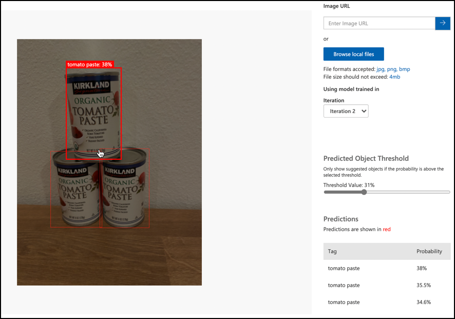

<!--
CO_OP_TRANSLATOR_METADATA:
{
  "original_hash": "8df310a42f902139a01417dacb1ffbef",
  "translation_date": "2025-08-24T21:16:46+00:00",
  "source_file": "5-retail/lessons/1-train-stock-detector/README.md",
  "language_code": "ja"
}
-->
# 在庫検出器をトレーニングする

> スケッチノート作成者: [Nitya Narasimhan](https://github.com/nitya)。画像をクリックすると拡大表示されます。

このビデオでは、Azure Custom Vision サービスを使用したオブジェクト検出の概要を説明します。このレッスンで取り上げる内容です。

> 🎥 上の画像をクリックしてビデオを視聴してください

## 講義前のクイズ

[講義前のクイズ](https://black-meadow-040d15503.1.azurestaticapps.net/quiz/37)

## はじめに

前回のプロジェクトでは、AIを使用して画像分類器をトレーニングしました。このモデルは、画像に熟した果物や未熟な果物が含まれているかどうかを判別できます。画像に使用できるもう1つのAIモデルはオブジェクト検出です。これらのモデルは画像をタグで分類するのではなく、オブジェクトを認識し、画像内でその位置を特定するようにトレーニングされます。これにより、画像内のオブジェクトを数えることが可能になります。

このレッスンでは、オブジェクト検出について学び、それが小売業でどのように活用できるかを理解します。また、クラウドでオブジェクト検出器をトレーニングする方法も学びます。

このレッスンで取り上げる内容は以下の通りです：

* [オブジェクト検出](../../../../../5-retail/lessons/1-train-stock-detector)
* [小売業でのオブジェクト検出の活用](../../../../../5-retail/lessons/1-train-stock-detector)
* [オブジェクト検出器のトレーニング](../../../../../5-retail/lessons/1-train-stock-detector)
* [オブジェクト検出器のテスト](../../../../../5-retail/lessons/1-train-stock-detector)
* [オブジェクト検出器の再トレーニング](../../../../../5-retail/lessons/1-train-stock-detector)

## オブジェクト検出

オブジェクト検出は、AIを使用して画像内のオブジェクトを検出する技術です。前回のプロジェクトでトレーニングした画像分類器とは異なり、オブジェクト検出は画像全体に最適なタグを予測するのではなく、画像内の1つ以上のオブジェクトを見つけることに焦点を当てています。

### オブジェクト検出と画像分類の違い

画像分類は、画像全体を分類することに焦点を当てています。モデルをトレーニングする際に使用した各タグに対する確率を返します。

上記の例では、カシューナッツの容器またはトマトペーストの缶を分類するモデルを使用して、2つの画像を分類しています。最初の画像はカシューナッツの容器で、画像分類器から以下の結果が得られます：

| タグ            | 確率       |
| -------------- | ----------: |
| `cashew nuts`  | 98.4%       |
| `tomato paste` | 1.6%        |

2番目の画像はトマトペーストの缶で、結果は以下の通りです：

| タグ            | 確率       |
| -------------- | ----------: |
| `cashew nuts`  | 0.7%        |
| `tomato paste` | 99.3%       |

これらの値を使用して、画像に何が含まれているかを予測することができます。しかし、画像に複数のトマトペーストの缶やカシューナッツとトマトペーストの両方が含まれている場合はどうでしょうか？この結果では、望む情報が得られない可能性があります。ここでオブジェクト検出が役立ちます。

オブジェクト検出では、モデルをトレーニングしてオブジェクトを認識させます。画像にオブジェクトが含まれていることを伝えるのではなく、画像内の特定のオブジェクトが含まれている部分を強調表示し、それにタグを付けます。これにより、モデルはオブジェクトそのものの外観を学習します。

予測時には、タグと確率のリストではなく、検出されたオブジェクトのリスト、バウンディングボックス、およびそのタグに一致する確率が返されます。

> 🎓 *バウンディングボックス*とは、オブジェクトの周りに描かれるボックスのことです。

上記の画像には、カシューナッツの容器とトマトペーストの缶が3つ含まれています。オブジェクト検出器はカシューナッツを検出し、バウンディングボックスとその確率（この場合は97.6%）を返しました。また、トマトペーストの缶3つも検出し、それぞれの缶に対してバウンディングボックスと確率を提供しました。

✅ 画像ベースのAIモデルを使用したいさまざまなシナリオを考えてみてください。それぞれのシナリオで分類が必要か、オブジェクト検出が必要かを考えてみましょう。

### オブジェクト検出の仕組み

オブジェクト検出は複雑な機械学習モデルを使用します。これらのモデルは画像を複数のセルに分割し、バウンディングボックスの中心がトレーニングに使用された画像の中心と一致するかどうかを確認します。これは、画像分類器を画像の異なる部分に適用して一致を探すようなものと考えることができます。

> 💁 これは非常に単純化した説明です。オブジェクト検出にはさまざまな手法があり、詳細は[Wikipediaのオブジェクト検出ページ](https://wikipedia.org/wiki/Object_detection)で読むことができます。

オブジェクト検出を行うモデルはいくつかあります。有名なモデルの1つに[YOLO (You Only Look Once)](https://pjreddie.com/darknet/yolo/)があります。このモデルは非常に高速で、人、犬、ボトル、車など20種類のオブジェクトを検出できます。

✅ [pjreddie.com/darknet/yolo/](https://pjreddie.com/darknet/yolo/)でYOLOモデルについて調べてみましょう。

オブジェクト検出モデルは、転移学習を使用してカスタムオブジェクトを検出するように再トレーニングすることができます。

## 小売業でのオブジェクト検出の活用

オブジェクト検出は小売業でさまざまな用途があります。以下はその一部です：

* **在庫確認とカウント** - 棚の在庫が少ない場合を認識し、スタッフやロボットに補充を通知。
* **マスク検出** - 公衆衛生上のイベントでマスク着用が義務付けられている店舗で、マスクを着用している人と着用していない人を認識。
* **自動請求** - 自動化された店舗で棚から取られた商品を検出し、顧客に適切に請求。
* **危険物検出** - 床に落ちた破損した商品やこぼれた液体を認識し、清掃スタッフに通知。

✅ 調査してみましょう：小売業でのオブジェクト検出の他の活用例は何でしょうか？

## オブジェクト検出器のトレーニング

Custom Visionを使用して、画像分類器をトレーニングした方法と同様にオブジェクト検出器をトレーニングできます。

### タスク - オブジェクト検出器を作成する

1. このプロジェクト用に`stock-detector`という名前のリソースグループを作成します。

1. `stock-detector`リソースグループ内に、無料のCustom Visionトレーニングリソースと予測リソースを作成します。それぞれ`stock-detector-training`と`stock-detector-prediction`と名付けます。

    > 💁 無料のトレーニングリソースと予測リソースは1つずつしか作成できないため、以前のレッスンで使用したプロジェクトをクリーンアップしておいてください。

    > ⚠️ 必要に応じて、[プロジェクト4、レッスン1のトレーニングおよび予測リソースの作成手順](../../../4-manufacturing/lessons/1-train-fruit-detector/README.md#task---create-a-cognitive-services-resource)を参照してください。

1. [CustomVision.ai](https://customvision.ai)でCustom Visionポータルを開き、Azureアカウントで使用したMicrosoftアカウントでサインインします。

1. Microsoft Docsの[オブジェクト検出器を構築するクイックスタートの「新しいプロジェクトを作成する」セクション](https://docs.microsoft.com/azure/cognitive-services/custom-vision-service/get-started-build-detector?WT.mc_id=academic-17441-jabenn#create-a-new-project)に従って、新しいCustom Visionプロジェクトを作成します。UIは変更される可能性があるため、これらのドキュメントが最新の参考資料です。

    プロジェクト名を`stock-detector`とします。

    プロジェクトを作成する際、先ほど作成した`stock-detector-training`リソースを使用してください。*オブジェクト検出*プロジェクトタイプと*棚の商品*ドメインを選択します。

    

    ✅ 棚の商品ドメインは、店舗の棚にある在庫を検出するために特化されています。Microsoft Docsの[ドメインの選択に関するドキュメント](https://docs.microsoft.com/azure/cognitive-services/custom-vision-service/select-domain?WT.mc_id=academic-17441-jabenn#object-detection)で詳細を確認してください。

✅ オブジェクト検出器のCustom Vision UIを探索してみましょう。

### タスク - オブジェクト検出器をトレーニングする

モデルをトレーニングするには、検出したいオブジェクトを含む画像セットが必要です。

1. 検出したいオブジェクトを含む画像を集めます。各オブジェクトを検出するために、異なる角度や照明条件で撮影された画像を少なくとも15枚用意します。ただし、多ければ多いほど良いです。このオブジェクト検出器は*棚の商品*ドメインを使用するため、オブジェクトを店舗の棚に配置したように設定してください。また、モデルをテストするための画像もいくつか必要です。複数のオブジェクトを検出する場合は、すべてのオブジェクトを含むテスト画像も用意してください。

    > 💁 複数の異なるオブジェクトを含む画像は、画像内のすべてのオブジェクトに対して15枚の最小画像数にカウントされます。

    画像はpngまたはjpeg形式で、6MB未満である必要があります。たとえば、iPhoneで作成した場合、高解像度のHEIC画像になる可能性があるため、変換して縮小する必要があります。画像が多いほど良いですが、熟したものと未熟なものの数を均等にするようにしてください。

    モデルは棚の商品を対象としているため、オブジェクトを棚に置いた状態で写真を撮影してください。

    [images](../../../../../5-retail/lessons/1-train-stock-detector/images)フォルダーには、カシューナッツとトマトペーストの例の画像が含まれていますので、これを使用することもできます。

1. Microsoft Docsの[オブジェクト検出器を構築するクイックスタートの「画像をアップロードしてタグ付けする」セクション](https://docs.microsoft.com/azure/cognitive-services/custom-vision-service/get-started-build-detector?WT.mc_id=academic-17441-jabenn#upload-and-tag-images)に従って、トレーニング画像をアップロードします。検出したいオブジェクトの種類に応じて適切なタグを作成してください。

    

    オブジェクトのバウンディングボックスを描く際は、オブジェクトの周りをきっちり囲むようにしてください。すべての画像をアウトライン化するのに時間がかかる場合がありますが、ツールがバウンディングボックスを自動検出するため、作業が速くなります。

    

    > 💁 各オブジェクトに15枚以上の画像がある場合、15枚でトレーニングを開始し、その後**推奨タグ**機能を使用できます。この機能は、トレーニング済みモデルを使用してタグ付けされていない画像内のオブジェクトを検出します。その後、検出されたオブジェクトを確認または拒否し、必要に応じてバウンディングボックスを再描画できます。これにより、作業時間を大幅に短縮できます。

1. Microsoft Docsの[オブジェクト検出器を構築するクイックスタートの「検出器をトレーニングする」セクション](https://docs.microsoft.com/azure/cognitive-services/custom-vision-service/get-started-build-detector?WT.mc_id=academic-17441-jabenn#train-the-detector)に従って、タグ付けした画像を使用してオブジェクト検出器をトレーニングします。

    トレーニングタイプを選択する際は、**クイックトレーニング**を選択してください。

オブジェクト検出器のトレーニングが開始されます。トレーニングが完了するまで数分かかります。

## オブジェクト検出器のテスト

オブジェクト検出器がトレーニングされたら、新しい画像を使用してオブジェクトを検出できるかテストします。

### タスク - オブジェクト検出器をテストする

1. **クイックテスト**ボタンを使用してテスト画像をアップロードし、オブジェクトが検出されるか確認します。トレーニングに使用した画像ではなく、以前に作成したテスト画像を使用してください。

    

1. 利用可能なすべてのテスト画像を試し、確率を観察してください。

## オブジェクト検出器の再トレーニング

オブジェクト検出器をテストした際、期待した結果が得られない場合があります。これは、前回のプロジェクトで画像分類器を使用した場合と同様です。オブジェクト検出器を改善するには、誤った結果を得た画像を使用して再トレーニングすることができます。

クイックテストオプションを使用して予測を行うたびに、画像と結果が保存されます。これらの画像を使用してモデルを再トレーニングできます。

1. **予測**タブを使用して、テストに使用した画像を見つけます。

1. 正確な検出を確認し、誤った検出を削除し、欠落しているオブジェクトを追加します。

1. モデルを再トレーニングし、再テストします。

---

## 🚀 チャレンジ

トマトペーストの缶と刻んだトマトの缶など、似たような外観のアイテムをオブジェクト検出器で使用した場合、どのような結果になるでしょうか？

似たような外観のアイテムがある場合、それらの画像をオブジェクト検出器に追加してテストしてみてください。

## 講義後のクイズ
[講義後のクイズ](https://black-meadow-040d15503.1.azurestaticapps.net/quiz/38)

## 復習と自己学習

* オブジェクト検出器をトレーニングした際に、作成されたモデルを評価するための*Precision*、*Recall*、*mAP*の値を確認したはずです。[Microsoft Docsの「オブジェクト検出器の評価」セクション](https://docs.microsoft.com/azure/cognitive-services/custom-vision-service/get-started-build-detector?WT.mc_id=academic-17441-jabenn#evaluate-the-detector)を使って、これらの値が何を意味するのかを調べてみましょう。
* オブジェクト検出についてさらに詳しく知りたい場合は、[Wikipediaのオブジェクト検出ページ](https://wikipedia.org/wiki/Object_detection)を読んでみてください。

## 課題

[ドメインの比較](assignment.md)

**免責事項**:  
この文書は、AI翻訳サービス [Co-op Translator](https://github.com/Azure/co-op-translator) を使用して翻訳されています。正確性を期すよう努めておりますが、自動翻訳には誤りや不正確な表現が含まれる可能性があります。元の言語で記載された文書が正式な情報源と見なされるべきです。重要な情報については、専門の人間による翻訳を推奨します。この翻訳の使用に起因する誤解や誤認について、当方は一切の責任を負いません。