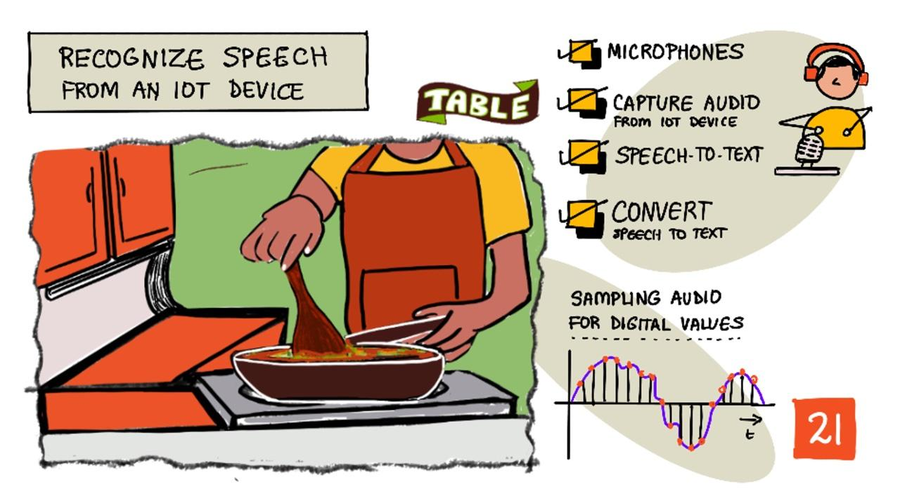

<!--
CO_OP_TRANSLATOR_METADATA:
{
  "original_hash": "6d6aa1be033625d201a190fc9c5cbfb4",
  "translation_date": "2025-08-25T00:20:49+00:00",
  "source_file": "6-consumer/lessons/1-speech-recognition/README.md",
  "language_code": "ja"
}
-->
# IoTデバイスで音声を認識する



> スケッチノート作成者：[Nitya Narasimhan](https://github.com/nitya)。画像をクリックすると拡大版が表示されます。

このビデオでは、Azure Speech Serviceの概要を説明しています。このレッスンで取り上げるトピックです：

[](https://www.youtube.com/watch?v=iW0Fw0l3mrA)

> 🎥 上の画像をクリックしてビデオを視聴してください

## レクチャー前のクイズ

[レクチャー前のクイズ](https://black-meadow-040d15503.1.azurestaticapps.net/quiz/41)

## はじめに

「アレクサ、12分のタイマーをセットして」

「アレクサ、タイマーの状況は？」

「アレクサ、スチームブロッコリー用に8分のタイマーをセットして」

スマートデバイスはますます普及しています。HomePod、Echo、Google Homeのようなスマートスピーカーだけでなく、スマートフォン、スマートウォッチ、さらには照明器具やサーモスタットにも組み込まれています。

> 💁 私の家には少なくとも19台の音声アシスタント対応デバイスがあります。それも私が把握している範囲だけです！

音声操作は、動きが制限されている人々がデバイスとやり取りするためのアクセシビリティを向上させます。生まれつき腕がないなどの永続的な障害から、腕を骨折した一時的な障害、または買い物袋や幼い子供で手がふさがっている場合など、音声で家を操作できることはアクセスの世界を広げます。例えば、「ヘイSiri、ガレージのドアを閉めて」と叫びながら、赤ちゃんのおむつ替えや手のかかる幼児の世話をするのは、生活を少しだけでも改善する効果的な方法です。

音声アシスタントの最も一般的な用途の1つはタイマーの設定です。特にキッチンタイマーとしての利用が人気です。音声だけで複数のタイマーを設定できるのは、キッチンで非常に便利です。パン生地をこねたり、スープをかき混ぜたり、手を洗ったりする必要がなくなります。

このレッスンでは、IoTデバイスに音声認識を組み込む方法を学びます。マイクをセンサーとして使用する方法、IoTデバイスに接続されたマイクから音声をキャプチャする方法、そしてAIを使って聞いた内容をテキストに変換する方法を学びます。このプロジェクト全体を通じて、音声で複数の言語でタイマーを設定できるスマートキッチンタイマーを構築します。

このレッスンで取り上げる内容は以下の通りです：

* [マイクロフォン](../../../../../6-consumer/lessons/1-speech-recognition)
* [IoTデバイスから音声をキャプチャする](../../../../../6-consumer/lessons/1-speech-recognition)
* [音声をテキストに変換する](../../../../../6-consumer/lessons/1-speech-recognition)
* [音声をテキストに変換する方法](../../../../../6-consumer/lessons/1-speech-recognition)

## マイクロフォン

マイクロフォンは、音波を電気信号に変換するアナログセンサーです。空気中の振動がマイクロフォン内の部品をわずかに動かし、それが電気信号の微小な変化を引き起こします。この変化は増幅されて電気出力を生成します。

### マイクロフォンの種類

マイクロフォンにはさまざまな種類があります：

* ダイナミック - ダイナミックマイクロフォンは、コイル内で動くダイアフラムに取り付けられた磁石を使用して電流を生成します。これは、電流を使用して磁石を動かし、ダイアフラムを動かして音を生成するスピーカーとは逆の仕組みです。そのため、スピーカーはダイナミックマイクロフォンとして使用でき、ダイナミックマイクロフォンはスピーカーとして使用できます。インターホンのように、ユーザーが聞くか話すかのどちらか一方を行うデバイスでは、1つのデバイスがスピーカーとマイクロフォンの両方として機能します。

    ダイナミックマイクロフォンは動作に電力を必要としません。電気信号は完全にマイクロフォンから生成されます。

    

* リボン - リボンマイクロフォンはダイナミックマイクロフォンに似ていますが、ダイアフラムの代わりに金属製のリボンを使用します。このリボンが磁場内で動き、電流を生成します。ダイナミックマイクロフォンと同様に、リボンマイクロフォンも動作に電力を必要としません。

    

* コンデンサー - コンデンサーマイクロフォンは、薄い金属製のダイアフラムと固定された金属製のバックプレートを持っています。これらの両方に電力が供給され、ダイアフラムが振動すると、プレート間の静電荷が変化して信号を生成します。コンデンサーマイクロフォンは動作に電力を必要とします。この電力は*ファンタム電源*と呼ばれます。

    

* MEMS - マイクロエレクトロメカニカルシステムマイクロフォン、またはMEMSは、チップ上のマイクロフォンです。シリコンチップにエッチングされた圧力感知ダイアフラムを持ち、コンデンサーマイクロフォンに似た仕組みで動作します。これらのマイクロフォンは非常に小型で、回路に統合することができます。

    

    上の画像では、**LEFT**とラベル付けされたチップがMEMSマイクロフォンで、幅1ミリ未満の小さなダイアフラムを持っています。

✅ 調査してみましょう：あなたの周りにあるマイクロフォンを調べてみてください。コンピュータ、スマートフォン、ヘッドセット、またはその他のデバイスにどのようなマイクロフォンが使われているかを確認してください。それらはどのタイプのマイクロフォンですか？

### デジタルオーディオ

オーディオは非常に細かい情報を持つアナログ信号です。この信号をデジタルに変換するには、1秒間に何千回もサンプリングする必要があります。

> 🎓 サンプリングとは、オーディオ信号をその時点のデジタル値に変換することです。


デジタルオーディオはパルス符号変調（PCM）を使用してサンプリングされます。PCMでは信号の電圧を読み取り、その電圧に最も近い離散値を定義されたサイズで選択します。

> 💁 PCMは、パルス幅変調（PWM）のセンサー版と考えることができます（PWMは[入門プロジェクトのレッスン3](../../../1-getting-started/lessons/3-sensors-and-actuators/README.md#pulse-width-modulation)で取り上げました）。PCMはアナログ信号をデジタルに変換し、PWMはデジタル信号をアナログに変換します。

例えば、ほとんどのストリーミング音楽サービスは16ビットまたは24ビットのオーディオを提供しています。これは、電圧を16ビット整数または24ビット整数に収まる値に変換することを意味します。16ビットオーディオは-32,768から32,767の範囲に収まり、24ビットは−8,388,608から8,388,607の範囲です。ビット数が多いほど、サンプルは私たちの耳が実際に聞く音に近くなります。

> 💁 8ビットオーディオを聞いたことがあるかもしれません。これはLoFiと呼ばれることが多く、8ビットだけでサンプリングされたオーディオです。初期のコンピュータオーディオはハードウェアの制約により8ビットに制限されていたため、レトロゲームでよく見られます。

これらのサンプルは、1秒間に何千回も、KHz（1秒間のサンプリング回数を千単位で表す）で測定される定義されたサンプルレートで取得されます。ストリーミング音楽サービスはほとんどの場合48KHzを使用しますが、一部の「ロスレス」オーディオでは96KHzや192KHzまで使用されます。サンプルレートが高いほど、元の音に近くなりますが、ある程度までです。48KHz以上で人間が違いを感じ取れるかどうかについては議論があります。

✅ 調査してみましょう：あなたが使用しているストリーミング音楽サービスのサンプルレートとサイズは何ですか？CDを使用している場合、CDオーディオのサンプルレートとサイズは何ですか？

オーディオデータにはさまざまな形式があります。例えば、mp3ファイルは品質を損なうことなくデータを圧縮して小さくしたオーディオデータです。非圧縮オーディオはWAVファイルとして保存されることが多いです。WAVファイルには44バイトのヘッダー情報が含まれ、その後に生のオーディオデータが続きます。ヘッダーには、サンプルレート（例：16KHzの場合は16000）、サンプルサイズ（例：16ビットの場合は16）、チャンネル数などの情報が含まれています。ヘッダーの後には生のオーディオデータが含まれます。

> 🎓 チャンネルとは、オーディオを構成する異なる音声ストリームの数を指します。例えば、ステレオオーディオ（左と右）では2チャンネル、ホームシアターシステムの7.1サラウンドサウンドでは8チャンネルです。

### オーディオデータのサイズ

オーディオデータは比較的大きいです。例えば、16ビットオーディオを16KHzで非圧縮でキャプチャする場合（音声認識モデルで使用するのに十分なレート）、1秒あたり32KBのデータが必要です：

* 16ビットは1サンプルあたり2バイト（1バイトは8ビット）。
* 16KHzは1秒間に16,000サンプル。
* 16,000 x 2バイト = 32,000バイト/秒。

これは少量のデータのように思えるかもしれませんが、メモリが限られているマイクロコントローラーを使用している場合、これは大きな負担になります。例えば、Wio Terminalには192KBのメモリがあり、その中にはプログラムコードや変数も保存する必要があります。プログラムコードが非常に小さい場合でも、5秒以上のオーディオをキャプチャすることはできません。

マイクロコントローラーはSDカードやフラッシュメモリなどの追加ストレージにアクセスできます。オーディオをキャプチャするIoTデバイスを構築する際には、追加ストレージを確保するだけでなく、マイクロフォンからキャプチャしたオーディオを直接そのストレージに書き込み、クラウドに送信する際にはストレージからウェブリクエストにストリームするコードを作成する必要があります。これにより、メモリ全体にオーディオデータを保持しようとしてメモリ不足になるのを防ぐことができます。

## IoTデバイスから音声をキャプチャする

IoTデバイスはマイクロフォンに接続して音声をキャプチャし、テキストに変換する準備を整えることができます。また、スピーカーに接続して音声を出力することも可能です。後のレッスンでは、音声フィードバックを提供するために使用しますが、マイクロフォンをテストするためにスピーカーを設定しておくと便利です。

### タスク - マイクロフォンとスピーカーの設定

以下のガイドに従って、IoTデバイスのマイクロフォンとスピーカーを設定してください：

* [Arduino - Wio Terminal](wio-terminal-microphone.md)
* [シングルボードコンピュータ - Raspberry Pi](pi-microphone.md)
* [シングルボードコンピュータ - 仮想デバイス](virtual-device-microphone.md)

### タスク - 音声をキャプチャする

以下のガイドに従って、IoTデバイスで音声をキャプチャしてください：

* [Arduino - Wio Terminal](wio-terminal-audio.md)
* [シングルボードコンピュータ - Raspberry Pi](pi-audio.md)
* [シングルボードコンピュータ - 仮想デバイス](virtual-device-audio.md)

## 音声をテキストに変換する

音声をテキストに変換する、または音声認識は、AIを使用して音声信号内の単語をテキストに変換するプロセスです。

### 音声認識モデル

音声をテキストに変換するには、オーディオ信号のサンプルをグループ化し、それをリカレントニューラルネットワーク（RNN）に基づいた機械学習モデルに入力します。これは、以前のデータを使用して新しいデータに関する決定を下すことができるタイプの機械学習モデルです。例えば、RNNはオーディオサンプルの1ブロックを「Hel」という音として検出し、次に「lo」という音を検出した場合、それを前の音と組み合わせて「Hello」が有効な単語であると判断し、それを結果として選択します。

MLモデルは常に同じサイズのデータを受け入れます。以前のレッスンで構築した画像分類器は、画像を固定サイズにリサイズして処理しました。同様に、音声モデルも固定サイズのオーディオチャンクを処理する必要があります。音声モデルは、複数の予測の出力を組み合わせて答えを得る必要があります。これにより、「Hi」と「Highway」や「flock」と「floccinaucinihilipilification」を区別することができます。

音声モデルはまた、文脈を理解し、処理される音が増えるにつれて検出した単語を修正することができます。例えば、「I went to the shops to get two bananas and an apple too」と言った場合、同じ音で異なるスペルの単語（to、two、too）を3つ使用します。音声モデルは文脈を理解し、適切なスペルの単語を使用することができます。
💁 一部の音声サービスでは、工場のような騒がしい環境や、化学物質の名前のような業界特有の単語に対応するためにカスタマイズが可能です。これらのカスタマイズは、サンプル音声とその文字起こしを提供することでトレーニングされ、転移学習を使用して動作します。これは、前のレッスンで少数の画像だけを使って画像分類器をトレーニングした方法と同じです。
### プライバシー

消費者向けIoTデバイスで音声認識を使用する際、プライバシーは非常に重要です。これらのデバイスは常に音声を聞いているため、消費者としては、自分が話すすべての内容がクラウドに送信されてテキストに変換されることを望まないでしょう。これにより大量のインターネット帯域幅が消費されるだけでなく、特に一部のスマートデバイスメーカーがモデル改善のためにランダムに音声を選び、[人間が生成されたテキストと照合する](https://www.theverge.com/2019/4/10/18305378/amazon-alexa-ai-voice-assistant-annotation-listen-private-recordings)場合、大きなプライバシー問題が発生します。

スマートデバイスが音声をクラウドに送信して処理するのは、デバイスを使用しているときだけであり、自宅で聞こえる音声、たとえばプライベートな会議や親密なやり取りを含む可能性のある音声を送信するべきではありません。ほとんどのスマートデバイスは、*ウェイクワード*（「Alexa」や「Hey Siri」、「OK Google」などのキーフレーズ）を使用して動作します。このフレーズがデバイスを「起動」させ、話し終わりを検出するまでの音声を聞き取ります。

> 🎓 ウェイクワード検出は、*キーワードスポッティング*や*キーワード認識*とも呼ばれます。

これらのウェイクワードはクラウドではなくデバイス上で検出されます。これらのスマートデバイスには、小型のAIモデルが搭載されており、ウェイクワードを聞き取ると、音声をクラウドにストリーミングして認識を開始します。これらのモデルは非常に特化しており、ウェイクワードだけを聞き取ります。

> 💁 一部のテクノロジー企業は、デバイスにさらなるプライバシーを追加し、音声認識の一部をデバイス上で行うようにしています。Appleは、2021年のiOSおよびmacOSのアップデートの一環として、デバイス上で音声認識をサポートし、多くのリクエストをクラウドを使用せずに処理できるようにすると発表しました。これは、MLモデルを実行できる強力なプロセッサをデバイスに搭載しているおかげです。

✅ クラウドに送信された音声を保存することのプライバシーや倫理的な影響についてどう思いますか？この音声を保存すべきでしょうか？保存する場合、どのようにすべきでしょうか？録音を法執行機関で使用することは、プライバシーの損失に見合う価値があると思いますか？

ウェイクワード検出には通常、TinyMLと呼ばれる技術が使用されます。これは、MLモデルをマイクロコントローラー上で実行できるように変換する技術です。これらのモデルは小型で、実行に必要な電力も非常に少ないです。

ウェイクワードモデルをトレーニングして使用する複雑さを避けるため、このレッスンで作成するスマートタイマーでは、音声認識をオンにするためにボタンを使用します。

> 💁 Wio TerminalやRaspberry Piで動作するウェイクワード検出モデルを作成してみたい場合は、[Edge Impulseの音声応答チュートリアル](https://docs.edgeimpulse.com/docs/responding-to-your-voice)をチェックしてください。コンピュータを使用してこれを試したい場合は、[Microsoft Docsのカスタムキーワードクイックスタート](https://docs.microsoft.com/azure/cognitive-services/speech-service/keyword-recognition-overview?WT.mc_id=academic-17441-jabenn)を参照してください。

## 音声をテキストに変換する


以前のプロジェクトで画像分類を行ったように、音声を音声ファイルとして受け取り、テキストに変換する事前構築済みのAIサービスがあります。その一つがSpeech Serviceで、Cognitive Servicesの一部として提供される事前構築済みのAIサービスです。

### タスク - 音声AIリソースを構成する

1. このプロジェクト用に`smart-timer`という名前のリソースグループを作成します。

1. 以下のコマンドを使用して無料の音声リソースを作成します：

    ```sh
    az cognitiveservices account create --name smart-timer \
                                        --resource-group smart-timer \
                                        --kind SpeechServices \
                                        --sku F0 \
                                        --yes \
                                        --location <location>
    ```

    `<location>`をリソースグループを作成した場所に置き換えてください。

1. コードから音声リソースにアクセスするためのAPIキーが必要です。以下のコマンドを実行してキーを取得してください：

    ```sh
    az cognitiveservices account keys list --name smart-timer \
                                           --resource-group smart-timer \
                                           --output table
    ```

    キーの一つをコピーしてください。

### タスク - 音声をテキストに変換する

IoTデバイスで音声をテキストに変換するための関連ガイドを進めてください：

* [Arduino - Wio Terminal](wio-terminal-speech-to-text.md)
* [シングルボードコンピュータ - Raspberry Pi](pi-speech-to-text.md)
* [シングルボードコンピュータ - 仮想デバイス](virtual-device-speech-to-text.md)

---

## 🚀 チャレンジ

音声認識は長い間存在しており、継続的に進化しています。現在の能力を調査し、これがどのように進化してきたか、特に機械による文字起こしの精度が人間と比較してどの程度向上したかを比較してください。

音声認識の未来はどうなると思いますか？

## 講義後のクイズ

[講義後のクイズ](https://black-meadow-040d15503.1.azurestaticapps.net/quiz/42)

## 復習と自己学習

* [Musician's HQの記事「ダイナミックマイクとコンデンサーマイクの違い」](https://musicianshq.com/whats-the-difference-between-dynamic-and-condenser-microphones/)を読んで、さまざまなマイクの種類とその仕組みについて学びましょう。
* [Microsoft Docsの音声サービスドキュメント](https://docs.microsoft.com/azure/cognitive-services/speech-service/?WT.mc_id=academic-17441-jabenn)でCognitive Servicesの音声サービスについてさらに学びましょう。
* [Microsoft Docsのキーワード認識ドキュメント](https://docs.microsoft.com/azure/cognitive-services/speech-service/keyword-recognition-overview?WT.mc_id=academic-17441-jabenn)でキーワードスポッティングについて学びましょう。

## 課題

[](assignment.md)

**免責事項**:  
この文書は、AI翻訳サービス [Co-op Translator](https://github.com/Azure/co-op-translator) を使用して翻訳されています。正確性を追求しておりますが、自動翻訳には誤りや不正確さが含まれる可能性があります。元の言語で記載された原文が正式な情報源と見なされるべきです。重要な情報については、専門の人間による翻訳を推奨します。この翻訳の使用に起因する誤解や誤訳について、当社は一切の責任を負いません。