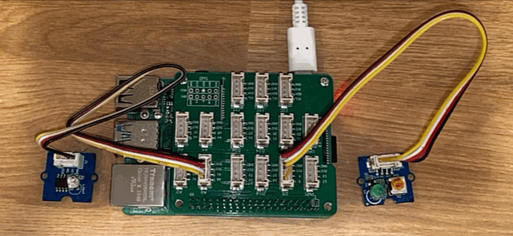

<!--
CO_OP_TRANSLATOR_METADATA:
{
  "original_hash": "4db8a3879a53490513571df2f6cf7641",
  "translation_date": "2026-01-07T02:11:56+00:00",
  "source_file": "1-getting-started/lessons/3-sensors-and-actuators/pi-actuator.md",
  "language_code": "kn"
}
-->
# ಒಂದು ನೈಟ್‌ಲೈನ್‌ಟ್ ನಿರ್ಮಿಸಿ - ರಾಸ್ಪ್ಬೆರ್ರಿ ಪೈ

ಈ ಪಾಠದ ಭಾಗದಲ್ಲಿ, ನೀವು您的 ರಾಸ್ಪ್ಬೆರ್ರಿ ಪೈಗೆ ಒಂದು LED ಅನ್ನು ಸೇರಿಸಿ ಅದನ್ನು ನೈಟ್‌ಲೈನ್‌ಟ್ ರಚಿಸಲು ಬಳಸುತ್ತೀರಿ.

## ಹಾರ್ಡ್‌ವೇರ್

ನೈಟ್‌ಲೈನ್‌ಟ್ ಈಗ ಅಕ್ಟುಯೇಟರ್ ಅನ್ನು ಬೇಕಾಗುತ್ತದೆ.

ಅಕ್ಟುಯೇಟರ್ ಒಂದು **LED**, ಒಂದು [ಲೈಟ್-ಏಮಿಟಿಂಗ್ ಡಯೋಡ್](https://wikipedia.org/wiki/Light-emitting_diode) ಆಗಿದ್ದು, ಅದರ ಮೂಲಕ ವಿದ್ಯುತ್ ಹರಿದಾಗ ಬೆಳಕಿನನ್ನೊಂದು ಹೊರಡಿಸುತ್ತದೆ. ಇದು ಎರಡು ಸ್ಥಿತಿಗಳಲ್ಲಿ ಇರುವ ಡಿಜಿಟಲ್ ಅಕ್ಟುಯೇಟರ್ — ಆನ್ ಮತ್ತು ಆಫ್. 1 ಎಂಬ ಮೌಲ್ಯವನ್ನು ಕಳುಹಿಸಿದರೆ LED ಆನ್ ಆಗುತ್ತದೆ ಹಾಗು 0 ಕಳುಹಿಸಿದರೆ ಆಫ್ ಆಗುತ್ತದೆ. LED ಒಂದು ಬಹಿರಂಗ Grove ಅಕ್ಟುಯೇಟರ್ ಆಗಿದ್ದು, ರಾಸ್ಪ್ಬೆರ್ರಿ ಪೈನ Grove ಬೇಸ್ ಹ್ಯಾಟ್‌ಗೆ ಜೋಡಿಸುವ ಅಗತ್ಯವಿದೆ.

ನೈಟ್‌ಲೈನ್‌ಟ್ ಲಾಜಿಕ್ ಪ್ಸ್ಯೂಡೋ-ಕೋಡ್‌ನಲ್ಲಿ:

```output
Check the light level.
If the light is less than 300
    Turn the LED on
Otherwise
    Turn the LED off
```

### LED ಅನ್ನು ಜೋಡಿಸಿ

Grove LED ಮಿನಿ LEDಗಳ ಆಯ್ಕೆಯೊಂದಿಗೆ ಒಂದು ಮೋಡ್ಯೂಲ್ ಎಂತೆ ಲಭ್ಯವಿದೆ, ಇದರಿಂದ ನೀವು ಬಣ್ಣವನ್ನು ಆಯ್ಕೆಮಾಡಬಹುದು.

#### ಕಾರ್ಯ - LED ಕನೆಕ್ಟ್ ಮಾಡಿ

LED ಅನ್ನು ಜೋಡಿಸಿ.


1. ನಿಮ್ಮ ಇಷ್ಟದ LED ಆಯ್ದು ಅದರ ಕಾಲುಗಳನ್ನು LED ಮೋಡ್ಯೂಲ್‌ನ ಎರಡು ರಂಧ್ರಗಳಲ್ಲಿ ಇನ್ಸರ್ಟ್ ಮಾಡಿ.

    LEDಗಳು ಲೈಟ್-ಎಮಿಟಿಂಗ್ ಡಯೋಡ್‌ಗಳು, ಮತ್ತು ಡಯೋಡ್‌ಗಳು ಓರೆಯ ದಿಕ್ಕಿನಲ್ಲಿ ಮಾತ್ರ ವಿದ್ಯುತ್ ಹರಿಸುವ ಎಲೆಕ್ಟ್ರಾನಿಕ್ ಸಾಧನಗಳು. ಇದರಿಂದ LED ಸರಿಯಾದ ದಿಕ್ಕಿನಲ್ಲಿ ಜೋಡಿಸಬೇಕು, ಹಾಗಾಗದಿದ್ದರೆ ಅದು ಕಾರ್ಯನಿರ್ವಹಿಸುವುದಿಲ್ಲ.

    LEDಯ ಒಂದು ಕಾಲು ಧನಾತ್ಮಕ ಪಿನ್ ಮತ್ತು ಇನ್ನೊಂದು RPG ತಡ್ಡೆ ಪಿನ್. LED ಸಂಪೂರ್ಣ ವೃತ್ತಾಕಾರವಾಗಿಲ್ಲ ಮತ್ತು ಒಂದು ಬದಿಯಲ್ಲಿ ಸ್ವಲ್ಪ ತಟ್ಟನೆಯಾಗಿದೆ. ಸ್ವಲ್ಪ ತಟ್ಟನೆಯ ಬದಿತ RPG ವಾಡಿ ಪಿನ್. ನೀವು LEDನ್ನು ಮೋಡ್ಯೂಲ್‌ಗೆ ಜೋಡಿಸುವಾಗ ಗોળದ ಬದಿಯ ಪಿನ್ ಮೋಡ್ಯೂಲ್‌ನ ಹೊರಭಾಗದಲ್ಲಿ **+** ಎಂದು ಗುರುತಿಸಿದ ಸಕ್ಕಟ್‌ಗೆ ಮತ್ತು ಸ್ವಲ್ಪ ತಟ್ಟನೆಯ ಬದಿಯ ಪಿನ್ ಮೋಡ್ಯೂಲ್‌ನ ಮಧ್ಯದ ಸಮೀಪದ ಸಕ್ಕಟ್‌ಗೆ ಜೋಡಿಸಬೇಕು.

1. LED ಮೋಡ್ಯೂಲ್‌ನಲ್ಲಿ ಸ್ಪಿನ್ ಬಟನ್ ಇರುತ್ತದೆ, ಇದು ನಿಮ್ಮ ಐಚ್ಛಿಕವಾಗಿ ತೀವ್ರತೆಯನ್ನು ನಿಯಂತ್ರಿಸಲು ಸಹಾಯ ಮಾಡುತ್ತದೆ. ಇದನ್ನು ಪ್ರಾರಂಭದಲ್ಲಿ ಪರ್ಜ್ಞಾಯುತವಾಗಿ ಇದನನ್ನು ಆಂಟಿ-ಕ್ಲಾಕ್ ವೈಸ್ ಆಗಿ ಸಣ್ಣ ಫಿಲಿಪ್ಸ್ ಹೆಡ್ ಸ್ಕ್ರೂಡ್ರೈವರ್ ಬಳಸಿ ಸಂಪೂರ್ಣವಾಗಿ ತಿರುಗಿಸಿ.

1. Grove ಕೇಬಲ್‌ನ ಒಂದು ಬದಿಯನ್ನು LED ಮೋಡ್ಯೂಲ್‌ನ ಸಕ್ಕಟ್‌ಗೆ ಸೇರಿಸಿ. ಇದು ಒಂದು ದಿಕ್ಕಿನಲ್ಲಿ ಮಾತ್ರ ಸೇರಲಿದೆ.

1. ರಾಸ್ಪ್ಬೆರ್ರಿ ಪೈ ಆಫ್ ಇದ್ದಾಗ Grove ಕೇಬಲ್‌ನ ಇನ್ನೊಂದು ಬದಿಯನ್ನು Grove Base hat ನಲ್ಲಿ ಡಿಜಿಟಲ್ ಸಕ್ಕಟ್ **D5** ಗೆ ಜೋಡಿಸಿ. ಇದು ಬೆಲೆಯಾಗಿ ಎಡದಿಂದ ಎರಡನೆಯದು ಮತ್ತು GPIO ಪಿನ್‌ಗಳ ಹತ್ತಿರ ಇರುವ ರೋಗಳಲ್ಲಿದೆ.


## ನೈಟ್‌ಲೈನ್‌ಟ್ ಪ್ರೋಗ್ರಾಮ್ ಮಾಡಿ

ನೈಟ್‌ಲೈನ್‌ಟ್ ಈಗ Grove ಲೈಟ್ ಸೆನ್ಸಾರ್ ಮತ್ತು Grove LED ಬಳಸಿ ಪ್ರೋಗ್ರಾಮ್ ಮಾಡಬಹುದು.

### ಕಾರ್ಯ - ನೈಟ್‌ಲೈನ್‌ಟ್ ಪ್ರೋಗ್ರಾಮ್ ಮಾಡಿ

ನೈಟ್‌ಲೈನ್‌ಟ್ ಅನ್ನು ಪ್ರೋಗ್ರಾಮ್ ಮಾಡಿ.

1. ಪೈ ಪವರ್ ಆನ್ ಮಾಡಿ ಮತ್ತು ಅದು ಬೂಟ್ ಆಗಲು ಕಾಯಿರಿ.

1. ಹಿಂದಿನ ಭಾಗದಲ್ಲಿ ಸೃಷ್ಟಿಸಿದ ನೈಟ್‌ಲೈನ್‌ಟ್ ಪ್ರಾಜೆಕ್ಟ್ ಅನ್ನು VS ಕೋಡ್ನಲ್ಲಿ ತೆರೆಯಿರಿ, ನೇರವಾಗಿ ಪೈಯಲ್ಲಿ ಓಡಿಸುತ್ತಿದ್ದರೆ ಅಥವಾ ರಿಮೋಡ್ SSH ವಿಸ್ತರಣೆ ಬಳಸಿ ಸಂಪರ್ಕ ಹೊಂದಿದ್ದರೆ.

1. ಅಗತ್ಯವಾದ ಲೈಬ್ರರಿ ಅನ್ನು ಆಮದು ಮಾಡಲು `app.py` ಫೈಲ್‌ಗೆ ಕೆಳಗಿನ ಕೋಡ್ ಸೇರಿಸಿ. ಇವನ್ನು ಮೇಲಿನ import ಲೈನ್ಗಳ ಮುಂದೆಯೂ ಸೇರಿಸಬಹುದು.

    ```python
    from grove.grove_led import GroveLed
    ```

    `from grove.grove_led import GroveLed` ಹೇಳಿಕೆ Grove Python ಲೈಬ್ರರಿಗಳಿಂದ `GroveLed` ಅನ್ನು ಆಮದು ಮಾಡುತ್ತದೆ. ಈ ಲೈಬ್ರರಿ Grove LED ಜೊತೆಗೆ ಸಂವಹನ ಮಾಡಲು ಕೋಡ್ ಅನ್ನು ಒದಗಿಸುತ್ತದೆ.

1. `light_sensor` ಘೋಷಣೆಯ ನಂತರ ಕೆಳಗಿನ ಕೋಡ್ ಸ್ಫೂರ್ತಿ ಪಡೆದು LED ನಿರ್ವಹಿಸುವ ಕ್ಲಾಸ್‌ನ ಉದಾಹರಣೆಯನ್ನು ರಚಿಸಿ:

    ```python
    led = GroveLed(5)
    ```

    `led = GroveLed(5)` ಲೈನ್ D5 ಪಿನ್ ಗೆ ಸಂಪರ್ಕ ಹೊಂದಿರುವ GroveLed ಕ್ಲಾಸ್‌ನ ಉದಾಹರಣೆ ಸೃಷ್ಟಿಸುತ್ತದೆ - ಡಿಜಿಟಲ್ Grove ಪಿನ್‌ಗೆ LED ಮಜುಜಾಗಿರುತ್ತದೆ.

    > 💁 ಎಲ್ಲಾ ಸಕ್ಕಟ್‌ಗಳು ವಿಭಿನ್ನ ಪಿನ್ ಸಂಖ್ಯೆಗಳನ್ನು ಹೊಂದಿರುತ್ತವೆ. 0, 2, 4, 6 ಪಿನ್‌ಗಳು ಅನಾಲಾಗ್ ಪಿನ್‌ಗಳಾಗಿದ್ದು, 5, 16, 18, 22, 24, 26 ಪಿನ್‌ಗಳು ಡಿಜಿಟಲ್ ಪಿನ್‌ಗಳು.

1. `while` ಲೂಪ್ ಒಳಗೆ, ಮತ್ತು `time.sleep` ಗಿಂತ ಹಿಂದಿನಂತೆ, ಬೆಳಕು ಮಟ್ಟವನ್ನು ಪರಿಶೀಲಿಸಿ LED ಆನ್ ಅಥವಾ ಆಫ್ ಮಾಡುವ ಪರಿಶೀಲನೆ ಸೇರಿಸಿ:

    ```python
    if light < 300:
        led.on()
    else:
        led.off()
    ```

    ಈ ಕೋಡ್ `light` ಮೌಲ್ಯವನ್ನು ಪರಿಶೀಲಿಸುತ್ತದೆ. 300 ಕಿಂತ ಕಡಿಮೆಯಿದ್ದರೆ ಇದು GroveLed ಕ್ಲಾಸ್‌ನ `on` ಮೆಥಡ್ ಅನ್ನು ಕರೆಸುತ್ತದೆ, ಇದು LED ಗೆ ಡಿಜಿಟಲ್ ಮೌಲ್ಯ 1 ಕಳುಹಿಸಿ ಅದನ್ನು ಆನ್ ಮಾಡುತ್ತದೆ. ಬೆಳಕು ಮೌಲ್ಯ 300ಕ್ಕೆ ಸಮಾನ ಅಥವಾ ಹೆಚ್ಚು ಇದ್ದರೆ `off` ಮೆಥಡ್ ಕರೆಸುತ್ತದೆ, LED ಗೆ ಡಿಜಿಟಲ್ ಮೌಲ್ಯ 0 ಕಳುಹಿಸಿ ಅದನ್ನು ಆಫ್ ಮಾಡುತ್ತದೆ.

    > 💁 ಈ ಕೋಡ್ ಅನ್ನು `print('Light level:', light)` ಲೈನ್ ಜೊತೆ ಸಮಾನ ಮಟ್ಟಕ್ಕೆ ಇಡಿ, ಹೀಗೆ ಇದು while ಲೂಪಿನೊಳಕ್ಕೆ ಬರುವುದಾಗಿರಬೇಕು!

    > 💁 ಡಿಜಿಟಲ್ ಮೌಲ್ಯಗಳನ್ನು ಅಕ್ಟುಯೇಟರ್‌ಗಳಿಗೆ ಕಳುಹಿಸುವಾಗ, 0 ಮೌಲ್ಯವು 0V ಮತ್ತು 1 ಮೌಲ್ಯವು ಸಾಧನದ ಗರಿಷ್ಠ ವೋಲ್ಟೇಜ್ ಆಗಿದೆ. Grove ಸೆನ್ಸಾರ್ ಮತ್ತು ಅಕ್ಟುಯೇಟರ್‌ಗಳು ಇರುವ ರಾಸ್ಪ್ಬೆರ್ರಿ ಪೈನಿಗೆ 1 ಮೌಲ್ಯವು 3.3V.

1. VS ಕೋಡ್ ಟರ್ಮಿನಲ್ನಲ್ಲಿ ನಿಮ್ಮ ಪೈಥನ್ ಅಪ್ಲಿಕೇಶನ್ ಚಲಾಯಿಸಲು ಕೆಳಗಿನ ಆಜ್ಞೆಯನ್ನು ನಿರ್ವಹಿಸಿ:

    ```sh
    python3 app.py
    ```

    ಬೆಳಕು ಮೌಲ್ಯಗಳು ಕಾನ್ಸೋಲ್ ಗೆ ಔಟ್‌ಪುಟ್ ಆಗುತ್ತದೆ.

    ```output
    pi@raspberrypi:~/nightlight $ python3 app.py 
    Light level: 634
    Light level: 634
    Light level: 634
    Light level: 230
    Light level: 104
    Light level: 290
    ```

1. ಲೈಟ್ ಸೆನ್ಸಾರ್ ಅನ್ನು ಮುಚ್ಚಿ ಮತ್ತು ತೆರೆಯಿರಿ. ಬೆಳಕು ಲೆವೆಲ್ 300 ಅಥವಾ ಅದರಿಗಿಂತ ಕಡಿಮೆ ಇದ್ದಾಗ LED ಬೆಳಗುತ್ತದೆ ಮತ್ತು 300ಕ್ಕಿಂತ ಹೆಚ್ಚಿನಾಗಿದ್ದಾಗ ಆಫ್ ಆಗುತ್ತದೆ ಎಂದು ಗಮನಿಸಿ.

    > 💁 LED ಆನ್ ಆಗದಿದ್ದರೆ ಅದು ಸರಿಯಾದ ದಿಕ್ಕಿನಲ್ಲಿ ಸಂಪರ್ಕಗೊಂಡಿದೆಯೇ ಮತ್ತು ಸ್ಪಿನ್ ಬಟನ್ ಸಂಪೂರ್ಣ ಆನ್ ಆಗಿದೆಯೇ ಎಂದು ಪರಿಶೀಲಿಸಿ.



> 💁 ನೀವು ಈ ಕೋಡ್ ಅನ್ನು [code-actuator/pi](../../../../../1-getting-started/lessons/3-sensors-and-actuators/code-actuator/pi) ಫೋಲ್ಡರ್‌ನಲ್ಲಿ ಕಂಡುಹಿಡಿಯಬಹುದು.

😀 ನಿಮ್ಮ ನೈಟ್‌ಲೈನ್‌ಟ್ ಪ್ರೋಗ್ರಾಮ್ ಯಶಸ್ವಿಯಾಯಿತು!

---

<!-- CO-OP TRANSLATOR DISCLAIMER START -->
**ನೇಮಕಾತಿ**:  
ಈ ದಾಖಲೆ ಯಂತ್ರ ಭಾಶಾಂತರ ಸೇವೆ [Co-op Translator](https://github.com/Azure/co-op-translator) ಬಳಸಿ ಅನುವಾದಿಸಲಾಗಿದೆ. ನಾವು ನಿಖರತೆಯಿಗಾಗಿ ಪ್ರಯತ್ನಿಸುವಾಗ, ಸ್ವಯಂಚಾಲಿತ ಅನುವಾದಗಳಲ್ಲಿ ದೋಷಗಳು ಅಥವಾ ಅಸಂಬದ್ಧತೆಗಳು ಇರಬಹುದು ಎಂದು ದಯವಿಟ್ಟು ಗಮನದಲ್ಲಿರಲಿ. ಮೂಲ ಭಾಷೆಯ ಮೂಲ ದಾಖಲೆ ಅಧಿಕೃತ ಮೂಲವಾಗಿದ್ದು ಅದನ್ನು ಪರಿಗಣಿಸಬೇಕಾಗಿದೆ. ಮಹತ್ವಪೂರ್ಣ ಮಾಹಿತಿಗಾಗಿ ವೃತ್ತಿಪರ ಮಾನವ ಅನುವಾದವನ್ನು ಶಿಫಾರಸು ಮಾಡಲಾಗಿದೆ. ಈ ಅನುವಾದ ಬಳಕೆಯಿಂದ ಉಂಟಾಗುವ ಯಾವುದೇ ತಪ್ಪು ಗ್ರಹಿಕೆಗಳು ಅಥವಾ ತಪ್ಪು ವ್ಯಾಖ್ಯಾನಗಳಿಗಾಗಿ ನಾವು ಜವಾಬ್ದಾರರಲ್ಲ.
<!-- CO-OP TRANSLATOR DISCLAIMER END -->