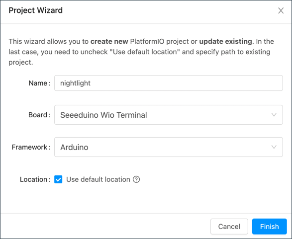

<!--
CO_OP_TRANSLATOR_METADATA:
{
  "original_hash": "a4f0c166010e31fd7b6ca20bc88dec6d",
  "translation_date": "2025-08-24T23:40:12+00:00",
  "source_file": "1-getting-started/lessons/1-introduction-to-iot/wio-terminal.md",
  "language_code": "ko"
}
-->
# Wio Terminal

[Seeed Studios의 Wio Terminal](https://www.seeedstudio.com/Wio-Terminal-p-4509.html)은 WiFi와 일부 센서 및 액추에이터가 내장된 Arduino 호환 마이크로컨트롤러입니다. 또한 [Grove](https://www.seeedstudio.com/category/Grove-c-1003.html)라는 하드웨어 생태계를 사용하여 더 많은 센서와 액추에이터를 추가할 수 있는 포트를 제공합니다.


## 설정

Wio Terminal을 사용하려면 컴퓨터에 몇 가지 무료 소프트웨어를 설치해야 합니다. 또한 WiFi에 연결하기 전에 Wio Terminal의 펌웨어를 업데이트해야 합니다.

### 작업 - 설정

필요한 소프트웨어를 설치하고 펌웨어를 업데이트하세요.

1. Visual Studio Code (VS Code)를 설치하세요. 이 편집기는 C/C++로 디바이스 코드를 작성하는 데 사용됩니다. VS Code 설치에 대한 지침은 [VS Code 문서](https://code.visualstudio.com?WT.mc_id=academic-17441-jabenn)를 참조하세요.

    > 💁 Arduino 개발을 위한 또 다른 인기 있는 IDE는 [Arduino IDE](https://www.arduino.cc/en/software)입니다. 이 도구에 익숙하다면 VS Code와 PlatformIO 대신 사용할 수 있지만, 강의에서는 VS Code를 사용하는 방법을 기준으로 설명합니다.

1. VS Code PlatformIO 확장을 설치하세요. 이 확장은 VS Code에서 C/C++로 마이크로컨트롤러를 프로그래밍할 수 있도록 지원합니다. VS Code에서 이 확장을 설치하는 방법은 [PlatformIO 확장 문서](https://marketplace.visualstudio.com/items?WT.mc_id=academic-17441-jabenn&itemName=platformio.platformio-ide)를 참조하세요. 이 확장은 Microsoft C/C++ 확장에 의존하며, PlatformIO를 설치하면 C/C++ 확장이 자동으로 설치됩니다.

1. Wio Terminal을 컴퓨터에 연결하세요. Wio Terminal 하단에는 USB-C 포트가 있으며, 이를 컴퓨터의 USB 포트에 연결해야 합니다. Wio Terminal에는 USB-C to USB-A 케이블이 포함되어 있지만, 컴퓨터에 USB-C 포트만 있는 경우 USB-C 케이블 또는 USB-A to USB-C 어댑터가 필요합니다.

1. [Wio Terminal Wiki WiFi 개요 문서](https://wiki.seeedstudio.com/Wio-Terminal-Network-Overview/)의 지침을 따라 Wio Terminal을 설정하고 펌웨어를 업데이트하세요.

## Hello World

새로운 프로그래밍 언어 또는 기술을 시작할 때는 일반적으로 'Hello World' 애플리케이션을 만듭니다. 이는 모든 도구가 올바르게 구성되었는지 확인하기 위해 `"Hello World"`와 같은 텍스트를 출력하는 작은 애플리케이션입니다.

Wio Terminal의 Hello World 앱은 Visual Studio Code가 PlatformIO와 함께 마이크로컨트롤러 개발을 위해 올바르게 설치되었는지 확인합니다.

### PlatformIO 프로젝트 생성

첫 번째 단계는 Wio Terminal에 맞게 구성된 새로운 PlatformIO 프로젝트를 생성하는 것입니다.

#### 작업 - PlatformIO 프로젝트 생성

PlatformIO 프로젝트를 생성하세요.

1. Wio Terminal을 컴퓨터에 연결하세요.

1. VS Code를 실행하세요.

1. PlatformIO 아이콘이 사이드 메뉴 바에 표시됩니다:

    

    이 메뉴 항목을 선택한 후 *PIO Home -> Open*을 선택하세요.

    

1. 환영 화면에서 **+ New Project** 버튼을 선택하세요.

    

1. *Project Wizard*에서 프로젝트를 구성하세요:

    1. 프로젝트 이름을 `nightlight`로 지정하세요.

    1. *Board* 드롭다운에서 `WIO`를 입력하여 보드를 필터링하고 *Seeeduino Wio Terminal*을 선택하세요.

    1. *Framework*는 *Arduino*로 유지하세요.

    1. *Use default location* 체크박스를 체크 상태로 유지하거나 체크 해제 후 프로젝트 위치를 선택하세요.

    1. **Finish** 버튼을 선택하세요.

    

    PlatformIO는 Wio Terminal의 코드를 컴파일하는 데 필요한 구성 요소를 다운로드하고 프로젝트를 생성합니다. 이 과정은 몇 분 정도 걸릴 수 있습니다.

### PlatformIO 프로젝트 탐색

VS Code 탐색기는 PlatformIO 마법사가 생성한 여러 파일과 폴더를 보여줍니다.

#### 폴더

* `.pio` - 이 폴더는 PlatformIO가 필요로 하는 라이브러리나 컴파일된 코드와 같은 임시 데이터를 포함합니다. 삭제되면 자동으로 다시 생성되며, GitHub과 같은 사이트에서 프로젝트를 공유할 때 소스 코드 관리에 추가할 필요가 없습니다.
* `.vscode` - 이 폴더는 PlatformIO와 VS Code에서 사용하는 설정을 포함합니다. 삭제되면 자동으로 다시 생성되며, GitHub과 같은 사이트에서 프로젝트를 공유할 때 소스 코드 관리에 추가할 필요가 없습니다.
* `include` - 이 폴더는 코드에 추가 라이브러리를 추가할 때 필요한 외부 헤더 파일을 위한 것입니다. 이 강의에서는 이 폴더를 사용하지 않습니다.
* `lib` - 이 폴더는 코드에서 호출할 외부 라이브러리를 위한 것입니다. 이 강의에서는 이 폴더를 사용하지 않습니다.
* `src` - 이 폴더는 애플리케이션의 주요 소스 코드를 포함합니다. 초기에는 단일 파일 `main.cpp`만 포함됩니다.
* `test` - 이 폴더는 코드에 대한 유닛 테스트를 넣는 곳입니다.

#### 파일

* `main.cpp` - `src` 폴더에 있는 이 파일은 애플리케이션의 진입점을 포함합니다. 이 파일을 열면 다음 코드가 포함되어 있습니다:

    ```cpp
    #include <Arduino.h>
    
    void setup() {
      // put your setup code here, to run once:
    }
    
    void loop() {
      // put your main code here, to run repeatedly:
    }
    ```

    디바이스가 시작되면 Arduino 프레임워크는 `setup` 함수를 한 번 실행한 후, 디바이스가 꺼질 때까지 `loop` 함수를 반복적으로 실행합니다.

* `.gitignore` - 이 파일은 Git 소스 코드 관리에 추가할 때 무시해야 할 파일과 디렉터리를 나열합니다. 예를 들어 GitHub에 업로드할 때.

* `platformio.ini` - 이 파일은 디바이스와 애플리케이션의 설정을 포함합니다. 이 파일을 열면 다음 코드가 포함되어 있습니다:

    ```ini
    [env:seeed_wio_terminal]
    platform = atmelsam
    board = seeed_wio_terminal
    framework = arduino
    ```

    `[env:seeed_wio_terminal]` 섹션은 Wio Terminal에 대한 설정을 포함합니다. 여러 `env` 섹션을 추가하여 여러 보드에 대해 코드를 컴파일할 수 있습니다.

    다른 값들은 프로젝트 마법사의 설정과 일치합니다:

  * `platform = atmelsam`은 Wio Terminal이 사용하는 하드웨어(ATSAMD51 기반 마이크로컨트롤러)를 정의합니다.
  * `board = seeed_wio_terminal`은 마이크로컨트롤러 보드 유형(Wio Terminal)을 정의합니다.
  * `framework = arduino`는 이 프로젝트가 Arduino 프레임워크를 사용하고 있음을 정의합니다.

### Hello World 앱 작성

이제 Hello World 앱을 작성할 준비가 되었습니다.

#### 작업 - Hello World 앱 작성

Hello World 앱을 작성하세요.

1. VS Code에서 `main.cpp` 파일을 엽니다.

1. 코드를 다음과 같이 변경하세요:

    ```cpp
    #include <Arduino.h>

    void setup()
    {
        Serial.begin(9600);

        while (!Serial)
            ; // Wait for Serial to be ready
    
        delay(1000);
    }
    
    void loop()
    {
        Serial.println("Hello World");
        delay(5000);
    }
    ```

    `setup` 함수는 USB 포트를 통해 Wio Terminal을 컴퓨터에 연결하는 직렬 포트 연결을 초기화합니다. 매개변수 `9600`은 [baud rate](https://wikipedia.org/wiki/Symbol_rate) (심볼 속도) 또는 직렬 포트를 통해 초당 전송되는 데이터 속도를 나타냅니다. 이 설정은 초당 9,600 비트(0과 1)의 데이터를 전송합니다. 그런 다음 직렬 포트가 준비될 때까지 대기합니다.

    `loop` 함수는 직렬 포트에 `Hello World!`라는 줄을 전송합니다. 이 줄은 `Hello World!` 문자와 새 줄 문자를 포함합니다. 그런 다음 5,000밀리초(5초) 동안 대기합니다. `loop`가 끝나면 다시 실행되며, 디바이스가 켜져 있는 동안 계속 반복됩니다.

1. Wio Terminal을 업로드 모드로 설정하세요. 디바이스에 새 코드를 업로드할 때마다 이 작업을 수행해야 합니다:

    1. 전원 스위치를 두 번 빠르게 아래로 당기세요. 스위치는 각 당김 후 다시 켜짐 위치로 돌아갑니다.

    1. USB 포트 오른쪽의 파란 상태 LED를 확인하세요. LED가 천천히 깜빡여야 합니다.
    
    [](https://youtu.be/LeKU_7zLRrQ)
    
    위 이미지를 클릭하면 이를 보여주는 비디오를 볼 수 있습니다.

1. 코드를 Wio Terminal에 빌드하고 업로드하세요.

    1. VS Code 명령 팔레트를 엽니다.

    1. `PlatformIO Upload`를 입력하여 업로드 옵션을 검색하고 *PlatformIO: Upload*를 선택하세요.

        

        PlatformIO는 필요할 경우 자동으로 코드를 빌드한 후 업로드합니다.

    1. 코드가 컴파일되고 Wio Terminal에 업로드됩니다.

        > 💁 macOS를 사용하는 경우 *DISK NOT EJECTED PROPERLY*라는 알림이 나타날 수 있습니다. 이는 Wio Terminal이 플래싱 과정의 일부로 드라이브로 마운트되며, 컴파일된 코드가 디바이스에 쓰여질 때 연결이 끊어지기 때문입니다. 이 알림은 무시해도 됩니다.

    ⚠️ 업로드 포트가 사용 불가능하다는 오류가 발생하면 먼저 Wio Terminal이 컴퓨터에 연결되어 있고, 화면 왼쪽의 스위치를 사용하여 켜져 있으며 업로드 모드로 설정되어 있는지 확인하세요. 하단의 녹색 LED가 켜져 있고 파란 LED가 천천히 깜빡여야 합니다. 여전히 오류가 발생하면 전원 스위치를 두 번 빠르게 아래로 당겨 Wio Terminal을 강제로 업로드 모드로 설정한 후 다시 업로드를 시도하세요.

PlatformIO에는 Wio Terminal에서 USB 케이블을 통해 전송된 데이터를 모니터링할 수 있는 Serial Monitor가 있습니다. 이를 통해 `Serial.println("Hello World");` 명령으로 전송된 데이터를 모니터링할 수 있습니다.

1. VS Code 명령 팔레트를 엽니다.

1. `PlatformIO Serial`을 입력하여 Serial Monitor 옵션을 검색하고 *PlatformIO: Serial Monitor*를 선택하세요.

    

    새 터미널이 열리고 직렬 포트를 통해 전송된 데이터가 이 터미널에 스트리밍됩니다:

    ```output
    > Executing task: platformio device monitor <
    
    --- Available filters and text transformations: colorize, debug, default, direct, hexlify, log2file, nocontrol, printable, send_on_enter, time
    --- More details at http://bit.ly/pio-monitor-filters
    --- Miniterm on /dev/cu.usbmodem101  9600,8,N,1 ---
    --- Quit: Ctrl+C | Menu: Ctrl+T | Help: Ctrl+T followed by Ctrl+H ---
    Hello World
    Hello World
    ```

    `Hello World`가 5초마다 직렬 모니터에 출력됩니다.

> 💁 이 코드는 [code/wio-terminal](../../../../../1-getting-started/lessons/1-introduction-to-iot/code/wio-terminal) 폴더에서 찾을 수 있습니다.

😀 'Hello World' 프로그램이 성공적으로 실행되었습니다!

**면책 조항**:  
이 문서는 AI 번역 서비스 [Co-op Translator](https://github.com/Azure/co-op-translator)를 사용하여 번역되었습니다. 정확성을 위해 최선을 다하고 있지만, 자동 번역에는 오류나 부정확성이 포함될 수 있습니다. 원본 문서를 해당 언어로 작성된 상태에서 권위 있는 자료로 간주해야 합니다. 중요한 정보의 경우, 전문적인 인간 번역을 권장합니다. 이 번역 사용으로 인해 발생하는 오해나 잘못된 해석에 대해 당사는 책임을 지지 않습니다.