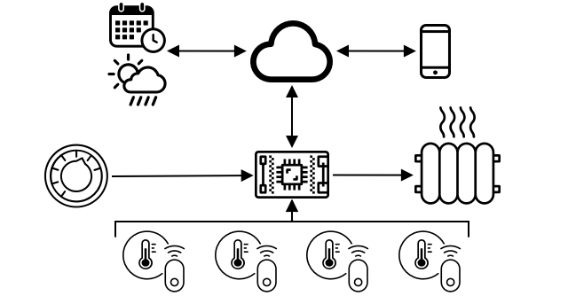

<!--
CO_OP_TRANSLATOR_METADATA:
{
  "original_hash": "9dd7f645ad1c6f20b72fee512987f772",
  "translation_date": "2025-08-24T23:45:57+00:00",
  "source_file": "1-getting-started/lessons/2-deeper-dive/README.md",
  "language_code": "ko"
}
-->
# IoT에 대한 심층 탐구

> 스케치노트 제공: [Nitya Narasimhan](https://github.com/nitya). 이미지를 클릭하면 더 큰 버전을 볼 수 있습니다.

이 강의는 [Microsoft Reactor](https://developer.microsoft.com/reactor/?WT.mc_id=academic-17441-jabenn)의 [Hello IoT 시리즈](https://youtube.com/playlist?list=PLmsFUfdnGr3xRts0TIwyaHyQuHaNQcb6-)의 일부로 진행되었습니다. 강의는 1시간짜리 강의와, 강의 내용을 더 깊이 탐구하고 질문에 답변하는 1시간짜리 오피스 아워로 구성된 두 개의 비디오로 진행되었습니다.

> 🎥 위 이미지를 클릭하면 비디오를 시청할 수 있습니다.

## 강의 전 퀴즈

[강의 전 퀴즈](https://black-meadow-040d15503.1.azurestaticapps.net/quiz/3)

## 소개

이번 강의에서는 이전 강의에서 다룬 몇 가지 개념을 더 깊이 탐구합니다.

이번 강의에서 다룰 내용은 다음과 같습니다:

* [IoT 애플리케이션의 구성 요소](../../../../../1-getting-started/lessons/2-deeper-dive)
* [마이크로컨트롤러에 대한 심층 탐구](../../../../../1-getting-started/lessons/2-deeper-dive)
* [싱글보드 컴퓨터에 대한 심층 탐구](../../../../../1-getting-started/lessons/2-deeper-dive)

## IoT 애플리케이션의 구성 요소

IoT 애플리케이션은 *인터넷*과 *사물*이라는 두 가지 구성 요소로 이루어져 있습니다. 이 두 구성 요소를 조금 더 자세히 살펴보겠습니다.

### 사물 (Thing)

IoT의 **사물(Thing)** 부분은 물리적 세계와 상호작용할 수 있는 장치를 의미합니다. 이러한 장치는 일반적으로 작고 저렴한 컴퓨터로, 낮은 속도로 작동하며 적은 전력을 사용합니다. 예를 들어, 몇 킬로바이트의 RAM을 가진 간단한 마이크로컨트롤러(PC의 기가바이트 RAM과 비교)로 몇 백 메가헤르츠로 작동하며(PC의 기가헤르츠와 비교), 때로는 매우 적은 전력을 소비하여 배터리로 몇 주, 몇 달 또는 몇 년 동안 작동할 수 있습니다.

이 장치는 센서를 사용하여 주변 환경에서 데이터를 수집하거나 출력 장치 또는 액추에이터를 제어하여 물리적 변화를 일으키는 방식으로 물리적 세계와 상호작용합니다. 대표적인 예는 스마트 온도 조절 장치입니다. 이 장치는 온도 센서, 다이얼 또는 터치스크린과 같은 원하는 온도를 설정할 수 있는 수단, 그리고 감지된 온도가 원하는 범위를 벗어날 때 켜질 수 있는 난방 또는 냉방 시스템과의 연결을 갖추고 있습니다. 온도 센서는 방이 너무 춥다는 것을 감지하고 액추에이터가 난방을 켭니다.

IoT 장치로 작동할 수 있는 다양한 사물들이 있습니다. 특정 하드웨어에서 하나의 센서를 감지하는 장치부터 일반적인 용도의 장치, 심지어 스마트폰까지 포함됩니다! 스마트폰은 센서를 사용하여 주변 환경을 감지하고 액추에이터를 사용하여 세계와 상호작용할 수 있습니다. 예를 들어 GPS 센서를 사용하여 위치를 감지하고 스피커를 사용하여 목적지로의 내비게이션 지침을 제공할 수 있습니다.

✅ 주변에서 센서를 통해 데이터를 읽고 이를 기반으로 결정을 내리는 다른 시스템을 생각해 보세요. 예를 들어 오븐의 온도 조절 장치가 하나의 예가 될 수 있습니다. 더 많은 예를 찾아보세요.

### 인터넷

IoT 애플리케이션의 **인터넷** 측면은 IoT 장치가 데이터를 보내고 받을 수 있는 애플리케이션과 IoT 장치의 데이터를 처리하여 액추에이터에 보낼 요청을 결정하는 데 도움을 줄 수 있는 다른 애플리케이션으로 구성됩니다.

일반적인 설정은 IoT 장치가 연결하는 클라우드 서비스를 갖추는 것입니다. 이 클라우드 서비스는 보안 처리, IoT 장치로부터 메시지 수신 및 장치로 메시지 전송 등을 처리합니다. 이 클라우드 서비스는 센서 데이터를 처리하거나 저장하거나 다른 시스템의 데이터와 결합하여 결정을 내리는 애플리케이션과 연결됩니다.

장치가 항상 WiFi 또는 유선 연결을 통해 직접 인터넷에 연결되는 것은 아닙니다. 일부 장치는 블루투스와 같은 기술을 통해 서로 통신하는 메쉬 네트워킹을 사용하며, 인터넷 연결이 있는 허브 장치를 통해 연결됩니다.

스마트 온도 조절 장치의 예를 들어보면, 온도 조절 장치는 집 WiFi를 사용하여 클라우드에서 실행되는 클라우드 서비스에 연결됩니다. 이 장치는 온도 데이터를 클라우드 서비스로 보내고, 클라우드 서비스는 이를 데이터베이스에 기록하여 집주인이 전화 앱을 통해 현재 및 과거 온도를 확인할 수 있도록 합니다. 클라우드의 또 다른 서비스는 집주인이 원하는 온도를 알고, 클라우드 서비스를 통해 IoT 장치에 메시지를 보내 난방 시스템을 켜거나 끄도록 지시합니다.

더 스마트한 버전은 클라우드에서 AI를 사용하여 다른 IoT 장치에 연결된 점유 센서와 같은 다른 센서의 데이터, 날씨 데이터, 심지어 캘린더 데이터를 활용하여 스마트하게 온도를 설정하는 결정을 내릴 수 있습니다. 예를 들어, 캘린더에서 휴가 중이라는 정보를 읽으면 난방을 끄거나, 사용하지 않는 방의 난방을 끄는 등 데이터를 학습하여 점점 더 정확해질 수 있습니다.

✅ 인터넷에 연결된 온도 조절 장치를 더 스마트하게 만드는 데 도움이 될 수 있는 다른 데이터는 무엇일까요?

### 엣지에서의 IoT

IoT의 'I'는 인터넷을 의미하지만, 이러한 장치가 반드시 인터넷에 연결될 필요는 없습니다. 일부 경우에는 장치가 '엣지' 장치에 연결될 수 있습니다. 엣지 장치는 로컬 네트워크에서 실행되며 인터넷을 통해 호출하지 않고 데이터를 처리할 수 있습니다. 이는 많은 데이터를 처리하거나 인터넷 연결이 느릴 때 더 빠를 수 있으며, 인터넷 연결이 불가능한 배, 인도주의적 위기 대응을 위한 재난 지역 등에서 오프라인으로 실행할 수 있고 데이터를 비공개로 유지할 수 있습니다. 일부 장치는 클라우드 도구를 사용하여 생성된 처리 코드를 포함하고 이를 로컬에서 실행하여 인터넷 연결 없이 데이터를 수집하고 응답할 수 있습니다.

예를 들어 Apple HomePod, Amazon Alexa, Google Home과 같은 스마트 홈 장치는 클라우드에서 훈련된 AI 모델을 사용하여 음성을 듣지만, 로컬에서 실행됩니다. 이러한 장치는 특정 단어 또는 구문이 말해질 때 '깨어나' 음성을 인터넷으로 전송하여 처리합니다. 장치는 음성에서 멈춤을 감지하면 적절한 시점에서 음성 전송을 중지합니다. 장치를 깨우는 단어를 말하기 전과 장치가 듣기를 멈춘 후에 말하는 모든 내용은 장치 제공업체의 인터넷으로 전송되지 않으므로 비공개로 유지됩니다.

✅ 데이터 처리가 클라우드가 아닌 엣지에서 이루어지는 것이 더 나은 경우를 생각해 보세요. 힌트: 카메라나 기타 이미징 장치를 사용하는 IoT 장치를 생각해 보세요.

### IoT 보안

인터넷 연결이 있는 경우 보안은 중요한 고려 사항입니다. 'IoT의 S는 Security(보안)를 의미한다'는 오래된 농담이 있습니다. IoT에는 'S'가 없다는 점을 암시하며, 이는 보안이 부족하다는 뜻입니다.

IoT 장치는 클라우드 서비스에 연결되며, 따라서 해당 클라우드 서비스만큼만 안전합니다. 클라우드 서비스가 모든 장치의 연결을 허용한다면 악성 데이터가 전송되거나 바이러스 공격이 발생할 수 있습니다. IoT 장치는 다른 장치를 제어하고 상호작용하기 때문에 이러한 공격은 실제 세계에 심각한 영향을 미칠 수 있습니다. 예를 들어, [Stuxnet 웜](https://wikipedia.org/wiki/Stuxnet)은 원심분리기의 밸브를 조작하여 손상을 입혔습니다. 해커들은 또한 [보안이 취약한 베이비 모니터](https://www.npr.org/sections/thetwo-way/2018/06/05/617196788/s-c-mom-says-baby-monitor-was-hacked-experts-say-many-devices-are-vulnerable) 및 기타 홈 감시 장치에 접근한 사례도 있습니다.

> 💁 일부 IoT 장치와 엣지 장치는 데이터를 비공개로 유지하고 안전하게 보호하기 위해 인터넷과 완전히 격리된 네트워크에서 실행됩니다. 이를 [에어갭(Air-gapping)](https://wikipedia.org/wiki/Air_gap_(networking))이라고 합니다.

## 마이크로컨트롤러에 대한 심층 탐구

지난 강의에서는 마이크로컨트롤러를 소개했습니다. 이제 이를 더 깊이 탐구해 보겠습니다.

### CPU

CPU는 마이크로컨트롤러의 '두뇌'입니다. 이는 코드를 실행하고 연결된 장치로 데이터를 보내거나 받을 수 있는 프로세서입니다. CPU는 하나 이상의 코어를 포함할 수 있으며, 이는 코드를 실행하는 데 협력할 수 있는 하나 이상의 CPU를 의미합니다.

CPU는 초당 수백만 또는 수십억 번의 틱을 하는 클럭에 의존합니다. 각 틱(사이클)은 CPU가 수행할 수 있는 작업을 동기화합니다. 각 틱마다 CPU는 프로그램의 명령을 실행할 수 있습니다. 예를 들어 외부 장치에서 데이터를 가져오거나 수학적 계산을 수행하는 작업을 실행할 수 있습니다. 이 규칙적인 사이클은 다음 명령이 처리되기 전에 모든 작업이 완료되도록 합니다.

클럭 사이클이 빠를수록 초당 처리할 수 있는 명령이 많아지고 CPU가 더 빨라집니다. CPU 속도는 [헤르츠(Hz)](https://wikipedia.org/wiki/Hertz)라는 표준 단위로 측정되며, 1Hz는 초당 한 번의 사이클 또는 클럭 틱을 의미합니다.

> 🎓 CPU 속도는 종종 MHz 또는 GHz로 표시됩니다. 1MHz는 100만 Hz, 1GHz는 10억 Hz입니다.

> 💁 CPU는 [명령어 사이클(fetch-decode-execute cycle)](https://wikipedia.org/wiki/Instruction_cycle)을 사용하여 프로그램을 실행합니다. 각 클럭 틱마다 CPU는 메모리에서 다음 명령을 가져오고(fetch), 이를 해석(decode)한 후 실행(execute)합니다. 예를 들어 산술 논리 장치(ALU)를 사용하여 두 숫자를 더하는 작업을 수행할 수 있습니다. 일부 실행은 여러 틱이 걸릴 수 있으므로 다음 사이클은 명령이 완료된 후 다음 틱에서 실행됩니다.

마이크로컨트롤러는 데스크톱이나 노트북 컴퓨터, 또는 대부분의 스마트폰보다 훨씬 낮은 클럭 속도를 가집니다. 예를 들어 Wio Terminal의 CPU는 120MHz, 즉 초당 120,000,000 사이클로 작동합니다.

✅ 평균적인 PC나 Mac은 수십억 번의 클럭 틱을 초당 실행하는 다중 코어 CPU를 가지고 있습니다. 자신의 컴퓨터의 클럭 속도를 조사하고 Wio Terminal과 비교하여 얼마나 더 빠른지 알아보세요.

각 클럭 사이클은 전력을 소비하고 열을 발생시킵니다. 틱이 빠를수록 소비되는 전력과 발생하는 열이 많아집니다. PC는 열을 제거하기 위해 히트싱크와 팬을 가지고 있으며, 없으면 몇 초 안에 과열되어 종료됩니다. 마이크로컨트롤러는 일반적으로 히트싱크나 팬이 없으며, 훨씬 낮은 속도로 작동하여 열이 적게 발생합니다. PC는 전원이나 몇 시간 동안 사용할 수 있는 대형 배터리로 작동하지만, 마이크로컨트롤러는 작은 배터리로 며칠, 몇 달, 또는 몇 년 동안 작동할 수 있습니다. 마이크로컨트롤러는 또한 서로 다른 속도로 작동하는 코어를 가질 수 있으며, CPU의 수요가 낮을 때 더 느리고 저전력 코어로 전환하여 전력 소비를 줄일 수 있습니다.

> 💁 일부 PC와 Mac은 배터리 수명 또는 속도를 최적화하기 위해 작업에 따라 빠르고 고성능 코어와 느리고 저전력 코어를 전환하는 동일한 기술을 채택하고 있습니다. 예를 들어 최신 Apple 노트북의 M1 칩은 4개의 성능 코어와 4개의 효율 코어 간에 전환하여 배터리 수명 또는 속도를 최적화할 수 있습니다.

✅ 간단한 조사: [Wikipedia CPU 기사](https://wikipedia.org/wiki/Central_processing_unit)를 읽고 CPU에 대해 알아보세요.

#### 과제

Wio Terminal을 조사해 보세요.

이 강의에서 Wio Terminal을 사용하는 경우 CPU를 찾아보세요. [Wio Terminal 제품 페이지](https://www.seeedstudio.com/Wio-Terminal-p-4509.html)의 *하드웨어 개요* 섹션에서 내부 사진을 찾아보고, 뒷면의 투명 플라스틱 창을 통해 CPU를 찾아보세요.

### 메모리

마이크로컨트롤러는 일반적으로 프로그램 메모리와 랜덤 액세스 메모리(RAM)라는 두 가지 유형의 메모리를 가지고 있습니다.

프로그램 메모리는 비휘발성으로, 전원이 꺼져도 저장된 내용이 유지됩니다. 이는 프로그램 코드를 저장하는 메모리입니다.

RAM은 프로그램이 실행되는 동안 사용하는 메모리로, 프로그램에서 할당된 변수와 주변 장치에서 수집된 데이터를 포함합니다. RAM은 휘발성이며, 전원이 꺼지면 내용이 손실되어 프로그램이 사실상 초기화됩니다.
🎓 프로그램 메모리는 코드를 저장하며 전원이 꺼져도 유지됩니다.
> 🎓 RAM은 프로그램 실행에 사용되며 전원이 꺼지면 초기화됩니다.

CPU와 마찬가지로, 마이크로컨트롤러의 메모리는 PC나 Mac에 비해 훨씬 작습니다. 일반적인 PC는 8GB(기가바이트)의 RAM, 즉 8,000,000,000 바이트를 가지고 있으며, 각 바이트는 문자 하나 또는 0-255 사이의 숫자를 저장할 수 있는 공간입니다. 반면, 마이크로컨트롤러는 킬로바이트(KB) 단위의 RAM만 가지고 있으며, 1KB는 1,000 바이트입니다. 위에서 언급한 Wio 터미널은 192KB의 RAM, 즉 192,000 바이트를 가지고 있으며, 이는 평균적인 PC보다 40,000배 이상 적은 용량입니다!

아래 다이어그램은 192KB와 8GB의 상대적인 크기 차이를 보여줍니다. 중앙의 작은 점이 192KB를 나타냅니다.

프로그램 저장 공간도 PC보다 작습니다. 일반적인 PC는 프로그램 저장을 위해 500GB 하드 드라이브를 사용할 수 있지만, 마이크로컨트롤러는 킬로바이트 또는 몇 메가바이트(MB)의 저장 공간만 가질 수 있습니다(1MB는 1,000KB 또는 1,000,000 바이트). Wio 터미널은 4MB의 프로그램 저장 공간을 가지고 있습니다.

✅ 간단한 조사를 해보세요: 현재 이 글을 읽고 있는 컴퓨터의 RAM과 저장 공간은 얼마나 되나요? 마이크로컨트롤러와 비교했을 때 어떤 차이가 있나요?

### 입력/출력

마이크로컨트롤러는 센서로부터 데이터를 읽고 액추에이터로 제어 신호를 보내기 위해 입력 및 출력(I/O) 연결이 필요합니다. 일반적으로 다목적 입출력(GPIO) 핀을 여러 개 포함하고 있으며, 이 핀들은 소프트웨어에서 입력(신호를 받음) 또는 출력(신호를 보냄)으로 설정할 수 있습니다.

🧠⬅️ 입력 핀은 센서로부터 값을 읽는 데 사용됩니다.

🧠➡️ 출력 핀은 액추에이터로 명령을 보냅니다.

✅ 다음 강의에서 이에 대해 더 자세히 배울 것입니다.

#### 과제

Wio 터미널을 조사해보세요.

이 강의를 위해 Wio 터미널을 사용 중이라면, GPIO 핀을 찾아보세요. [Wio 터미널 제품 페이지](https://www.seeedstudio.com/Wio-Terminal-p-4509.html)의 *Pinout 다이어그램* 섹션을 확인하여 각 핀이 어떤 역할을 하는지 알아보세요. Wio 터미널에는 핀 번호가 적힌 스티커가 함께 제공되므로, 아직 붙이지 않았다면 지금 붙여보세요.

### 물리적 크기

마이크로컨트롤러는 일반적으로 크기가 작습니다. 가장 작은 마이크로컨트롤러 중 하나인 [Freescale Kinetis KL03 MCU는 골프공의 딤플 안에 들어갈 정도로 작습니다](https://www.edn.com/tiny-arm-cortex-m0-based-mcu-shrinks-package/). 반면, PC의 CPU는 40mm x 40mm 크기이며, 과열 없이 몇 초 이상 작동하기 위해 필요한 방열판과 팬을 포함하지 않은 크기입니다. Wio 터미널 개발 키트는 마이크로컨트롤러, 케이스, 화면, 다양한 연결 및 구성 요소를 포함하고 있지만, 방열판과 팬이 포함된 Intel i9 CPU보다 훨씬 작습니다.

| 장치                              | 크기                  |
| --------------------------------- | --------------------- |
| Freescale Kinetis KL03            | 1.6mm x 2mm x 1mm     |
| Wio 터미널                        | 72mm x 57mm x 12mm    |
| Intel i9 CPU, 방열판 및 팬 포함   | 136mm x 145mm x 103mm |

### 프레임워크와 운영 체제

속도와 메모리 크기가 낮기 때문에, 마이크로컨트롤러는 데스크톱 운영 체제(OS)를 실행하지 않습니다. 컴퓨터를 구동하는 운영 체제(Windows, Linux, macOS)는 마이크로컨트롤러에는 불필요한 작업을 실행하기 위해 많은 메모리와 처리 능력을 필요로 합니다. 마이크로컨트롤러는 일반적으로 하나 이상의 특정 작업을 수행하도록 프로그래밍되며, PC나 Mac처럼 사용자 인터페이스를 지원하거나 음악, 영화 재생, 문서 작성, 게임 실행, 인터넷 브라우징 등을 할 필요가 없습니다.

운영 체제 없이 마이크로컨트롤러를 프로그래밍하려면, 마이크로컨트롤러가 실행할 수 있는 방식으로 코드를 빌드하고 주변 장치와 통신할 수 있는 API를 사용하는 도구가 필요합니다. 각 마이크로컨트롤러는 다르기 때문에, 제조업체는 일반적으로 표준 프레임워크를 지원하여 표준 '레시피'를 따라 코드를 빌드하고 해당 프레임워크를 지원하는 모든 마이크로컨트롤러에서 실행할 수 있도록 합니다.

운영 체제를 사용하는 마이크로컨트롤러도 프로그래밍할 수 있습니다. 이러한 운영 체제는 실시간 운영 체제(RTOS)라고 하며, 실시간으로 주변 장치와 데이터를 주고받는 작업을 처리하도록 설계되었습니다. RTOS는 매우 가볍고 다음과 같은 기능을 제공합니다:

* 멀티스레딩: 여러 코어에서 동시에 또는 하나의 코어에서 번갈아가며 여러 코드 블록을 실행할 수 있습니다.
* 네트워킹: 인터넷을 통해 안전하게 통신할 수 있습니다.
* 그래픽 사용자 인터페이스(GUI) 구성 요소: 화면이 있는 장치에서 사용자 인터페이스(UI)를 구축할 수 있습니다.

✅ 다양한 RTOS에 대해 읽어보세요: [Azure RTOS](https://azure.microsoft.com/services/rtos/?WT.mc_id=academic-17441-jabenn), [FreeRTOS](https://www.freertos.org), [Zephyr](https://www.zephyrproject.org)

#### Arduino

[Arduino](https://www.arduino.cc)는 아마도 학생, 취미 개발자, 메이커들 사이에서 가장 인기 있는 마이크로컨트롤러 프레임워크일 것입니다. Arduino는 소프트웨어와 하드웨어를 결합한 오픈 소스 전자 플랫폼입니다. Arduino 자체 또는 다른 제조업체에서 Arduino 호환 보드를 구매한 후 Arduino 프레임워크를 사용하여 코드를 작성할 수 있습니다.

Arduino 보드는 C 또는 C++로 코딩됩니다. C/C++를 사용하면 코드가 매우 작게 컴파일되고 빠르게 실행될 수 있어, 마이크로컨트롤러와 같은 제약이 많은 장치에서 필요합니다. Arduino 애플리케이션의 핵심은 '스케치'라고 하며, 이는 `setup`과 `loop`라는 두 개의 함수로 구성된 C/C++ 코드입니다. 보드가 시작되면 Arduino 프레임워크 코드는 `setup` 함수를 한 번 실행한 후, `loop` 함수를 계속 반복 실행합니다. 전원이 꺼질 때까지 이 과정이 계속됩니다.

`setup` 함수에는 WiFi 및 클라우드 서비스 연결 또는 입력 및 출력 핀 초기화와 같은 설정 코드를 작성합니다. `loop` 함수에는 센서 데이터를 읽고 클라우드로 값을 전송하는 등의 처리 코드를 작성합니다. 일반적으로 각 루프 끝에 지연을 추가하여, 예를 들어 센서 데이터를 10초마다 전송하려면 루프 끝에 10초 지연을 추가하여 마이크로컨트롤러가 전력을 절약하며 대기하도록 합니다. 그런 다음 10초 후에 루프가 다시 실행됩니다.

✅ 이 프로그램 아키텍처는 *이벤트 루프* 또는 *메시지 루프*로 알려져 있습니다. 많은 애플리케이션이 이 방식을 내부적으로 사용하며, Windows, macOS, Linux와 같은 운영 체제에서 실행되는 대부분의 데스크톱 애플리케이션의 표준입니다. `loop`는 버튼과 같은 사용자 인터페이스 구성 요소 또는 키보드와 같은 장치로부터 메시지를 수신하고 이에 응답합니다. [이벤트 루프에 대한 위키피디아 기사](https://wikipedia.org/wiki/Event_loop)에서 더 읽어보세요.

Arduino는 마이크로컨트롤러 및 I/O 핀과 상호작용하기 위한 표준 라이브러리를 제공합니다. 이러한 표준 라이브러리는 특정 보드에서 실행되는 코드가 다른 Arduino 보드에서도 핀과 기능이 동일하다면 재컴파일하여 실행할 수 있도록 합니다.

또한, Arduino 프로젝트에 추가 기능을 제공하는 서드파티 Arduino 라이브러리 생태계가 풍부합니다. 예를 들어, 센서 및 액추에이터 사용 또는 클라우드 IoT 서비스 연결과 같은 기능을 추가할 수 있습니다.

##### 과제

Wio 터미널을 조사해보세요.

이 강의를 위해 Wio 터미널을 사용 중이라면, 이전 강의에서 작성한 코드를 다시 읽어보세요. `setup`과 `loop` 함수를 찾아보세요. `loop` 함수가 반복 호출되는 것을 확인하기 위해 직렬 출력을 모니터링하세요. `setup` 함수에 직렬 포트로 데이터를 쓰는 코드를 추가하고, 이 코드가 장치를 재부팅할 때마다 한 번만 호출되는 것을 관찰하세요. 장치 측면의 전원 스위치를 사용하여 장치를 재부팅하고, 재부팅 시 이 코드가 호출되는 것을 확인하세요.

## 싱글보드 컴퓨터에 대한 심층 탐구

이전 강의에서 싱글보드 컴퓨터를 소개했습니다. 이제 이를 더 깊이 살펴보겠습니다.

### 라즈베리 파이

[Raspberry Pi Foundation](https://www.raspberrypi.org)은 2009년 영국에서 설립된 자선 단체로, 특히 학교 수준에서 컴퓨터 과학 학습을 촉진하기 위해 설립되었습니다. 이 미션의 일환으로, Raspberry Pi라는 싱글보드 컴퓨터를 개발했습니다. 현재 Raspberry Pi는 풀 사이즈 버전, 더 작은 Pi Zero, 그리고 최종 IoT 장치에 내장할 수 있는 컴퓨트 모듈의 3가지 변형으로 제공됩니다.

풀 사이즈 Raspberry Pi의 최신 버전은 Raspberry Pi 4B입니다. 이 보드는 1.5GHz로 작동하는 쿼드코어(4코어) CPU, 2, 4 또는 8GB의 RAM, 기가비트 이더넷, WiFi, 4k 화면을 지원하는 2개의 HDMI 포트, 오디오 및 복합 비디오 출력 포트, USB 포트(USB 2.0 2개, USB 3.0 2개), 40개의 GPIO 핀, Raspberry Pi 카메라 모듈용 카메라 커넥터, SD 카드 슬롯을 갖추고 있습니다. 이 모든 것이 88mm x 58mm x 19.5mm 크기의 보드에 포함되어 있으며, 3A USB-C 전원 공급 장치로 작동합니다. 가격은 US$35부터 시작하며, PC나 Mac보다 훨씬 저렴합니다.

> 💁 Pi4가 내장된 키보드 형태의 Pi400 올인원 컴퓨터도 있습니다.

Pi Zero는 훨씬 작고 전력 소모가 적습니다. 이 보드는 1GHz 단일 코어 CPU, 512MB RAM, WiFi(Zero W 모델), 단일 HDMI 포트, 마이크로 USB 포트, 40개의 GPIO 핀, Raspberry Pi 카메라 모듈용 카메라 커넥터, SD 카드 슬롯을 갖추고 있습니다. 크기는 65mm x 30mm x 5mm이며, 전력 소모가 매우 적습니다. Zero는 US$5, WiFi가 포함된 W 버전은 US$10입니다.

> 🎓 두 모델의 CPU는 ARM 프로세서로, 대부분의 PC와 Mac에서 사용하는 Intel/AMD x86 또는 x64 프로세서와는 다릅니다. 이는 일부 마이크로컨트롤러, 거의 모든 모바일 폰, Microsoft Surface X, 그리고 새로운 Apple Silicon 기반 Mac에서 사용하는 CPU와 유사합니다.

Raspberry Pi의 모든 변형은 Raspberry Pi OS라는 Debian Linux 버전을 실행합니다. 화면이 필요 없는 '헤드리스' 프로젝트에 적합한 데스크톱 없는 라이트 버전과, 웹 브라우저, 오피스 애플리케이션, 코딩 도구 및 게임이 포함된 전체 데스크톱 환경을 제공하는 풀 버전이 있습니다. 이 OS는 Debian Linux의 버전이므로, ARM 프로세서에서 실행되는 Debian용으로 빌드된 모든 애플리케이션이나 도구를 설치할 수 있습니다.

#### 과제

Raspberry Pi를 조사해보세요.

이 강의를 위해 Raspberry Pi를 사용 중이라면, 보드의 다양한 하드웨어 구성 요소에 대해 읽어보세요.

* [Raspberry Pi 하드웨어 문서 페이지](https://www.raspberrypi.org/documentation/hardware/raspberrypi/)에서 사용 중인 Pi에 사용된 프로세서에 대한 세부 정보를 찾아보세요.
* GPIO 핀을 찾아보세요. [Raspberry Pi GPIO 문서](https://www.raspberrypi.org/documentation/hardware/raspberrypi/gpio/README.md)를 읽어보세요. [GPIO 핀 사용 가이드](https://www.raspberrypi.org/documentation/usage/gpio/README.md)를 사용하여 Pi의 다양한 핀을 식별하세요.

### 싱글보드 컴퓨터 프로그래밍

싱글보드 컴퓨터는 전체 OS를 실행하는 완전한 컴퓨터입니다. 따라서 마이크로컨트롤러가 Arduino와 같은 프레임워크 지원에 의존하는 것과 달리, 다양한 프로그래밍 언어, 프레임워크 및 도구를 사용하여 코딩할 수 있습니다. 대부분의 프로그래밍 언어는 GPIO 핀에 접근하여 센서 및 액추에이터로부터 데이터를 송수신할 수 있는 라이브러리를 제공합니다.

✅ 익숙한 프로그래밍 언어는 무엇인가요? 해당 언어가 Linux에서 지원되나요?

Raspberry Pi에서 IoT 애플리케이션을 구축하는 데 가장 일반적인 프로그래밍 언어는 Python입니다. Raspberry Pi를 위해 설계된 하드웨어 생태계가 방대하며, 이들 대부분은 Python 라이브러리로 필요한 코드를 제공합니다. 이러한 생태계 중 일부는 'HAT'을 기반으로 하며, 이는 Pi 위에 모자처럼 얹혀져 40개의 GPIO 핀에 큰 소켓으로 연결됩니다. 이러한 HAT은 화면, 센서, 원격 제어 자동차 또는 표준화된 케이블로 센서를 연결할 수 있는 어댑터와 같은 추가 기능을 제공합니다.
### 전문 IoT 배포에서 싱글보드 컴퓨터의 활용

싱글보드 컴퓨터는 단순히 개발자 키트로만 사용되는 것이 아니라, 전문 IoT 배포에서도 활용됩니다. 이러한 컴퓨터는 하드웨어를 제어하고 머신 러닝 모델 실행과 같은 복잡한 작업을 수행하는 강력한 방법을 제공합니다. 예를 들어, [Raspberry Pi 4 컴퓨트 모듈](https://www.raspberrypi.org/blog/raspberry-pi-compute-module-4/)은 Raspberry Pi 4의 모든 성능을 제공하면서도 대부분의 포트를 제거하여 더 작고 저렴한 형태로 제공되며, 맞춤형 하드웨어에 설치되도록 설계되었습니다.

---

## 🚀 도전 과제

지난 강의의 도전 과제는 집, 학교 또는 직장에서 사용할 수 있는 IoT 기기를 최대한 많이 나열하는 것이었습니다. 이 목록에 있는 각 기기가 마이크로컨트롤러, 싱글보드 컴퓨터, 또는 이 둘의 혼합으로 구성되어 있다고 생각하나요?

## 강의 후 퀴즈

[강의 후 퀴즈](https://black-meadow-040d15503.1.azurestaticapps.net/quiz/4)

## 복습 및 자기 학습

* Arduino 플랫폼에 대해 더 잘 이해하기 위해 [Arduino 시작 가이드](https://www.arduino.cc/en/Guide/Introduction)를 읽어보세요.
* Raspberry Pi에 대해 더 배우기 위해 [Raspberry Pi 4 소개](https://www.raspberrypi.org/products/raspberry-pi-4-model-b/)를 읽어보세요.
* [Electrical Engineering Journal의 "What the FAQ are CPUs, MPUs, MCUs, and GPUs" 기사](https://www.eejournal.com/article/what-the-faq-are-cpus-mpus-mcus-and-gpus/)에서 CPU, MPU, MCU, GPU와 같은 개념과 약어에 대해 더 알아보세요.

✅ 이 가이드와 [하드웨어 가이드](../../../hardware.md) 링크를 따라 확인할 수 있는 비용 정보를 활용하여 사용할 하드웨어 플랫폼을 결정하거나, 가상 기기를 사용할지 여부를 판단하세요.

## 과제

[마이크로컨트롤러와 싱글보드 컴퓨터 비교 및 대조](assignment.md)

**면책 조항**:  
이 문서는 AI 번역 서비스 [Co-op Translator](https://github.com/Azure/co-op-translator)를 사용하여 번역되었습니다. 정확성을 위해 최선을 다하고 있지만, 자동 번역에는 오류나 부정확성이 포함될 수 있습니다. 원본 문서를 해당 언어로 작성된 상태에서 권위 있는 자료로 간주해야 합니다. 중요한 정보의 경우, 전문적인 인간 번역을 권장합니다. 이 번역 사용으로 인해 발생하는 오해나 잘못된 해석에 대해 당사는 책임을 지지 않습니다.