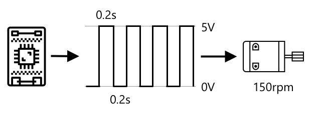

<!--
CO_OP_TRANSLATOR_METADATA:
{
  "original_hash": "e9ee00eb5fc55922a73762acc542166b",
  "translation_date": "2025-08-24T23:18:24+00:00",
  "source_file": "1-getting-started/lessons/3-sensors-and-actuators/README.md",
  "language_code": "ko"
}
-->
# 센서와 액추에이터로 물리적 세계와 상호작용하기


> 스케치노트: [Nitya Narasimhan](https://github.com/nitya). 이미지를 클릭하면 더 큰 버전을 볼 수 있습니다.

이 강의는 [Microsoft Reactor](https://developer.microsoft.com/reactor/?WT.mc_id=academic-17441-jabenn)의 [Hello IoT 시리즈](https://youtube.com/playlist?list=PLmsFUfdnGr3xRts0TIwyaHyQuHaNQcb6-)의 일부로 진행되었습니다. 강의는 1시간짜리 강의와, 강의의 일부를 더 깊이 탐구하고 질문에 답변하는 1시간짜리 오피스 아워로 구성된 두 개의 비디오로 진행되었습니다.

[](https://youtu.be/Lqalu1v6aF4)

[](https://youtu.be/qR3ekcMlLWA)

> 🎥 위 이미지를 클릭하면 비디오를 시청할 수 있습니다.

## 강의 전 퀴즈

[강의 전 퀴즈](https://black-meadow-040d15503.1.azurestaticapps.net/quiz/5)

## 소개

이 강의에서는 IoT 디바이스의 중요한 두 가지 개념인 센서와 액추에이터를 소개합니다. 또한, 이들을 직접 다뤄보며 IoT 프로젝트에 조도 센서를 추가하고, 조도 수준에 따라 제어되는 LED를 추가하여 효과적으로 야간등을 만들어볼 것입니다.

이 강의에서 다룰 내용은 다음과 같습니다:

* [센서란 무엇인가?](../../../../../1-getting-started/lessons/3-sensors-and-actuators)
* [센서 사용하기](../../../../../1-getting-started/lessons/3-sensors-and-actuators)
* [센서 유형](../../../../../1-getting-started/lessons/3-sensors-and-actuators)
* [액추에이터란 무엇인가?](../../../../../1-getting-started/lessons/3-sensors-and-actuators)
* [액추에이터 사용하기](../../../../../1-getting-started/lessons/3-sensors-and-actuators)
* [액추에이터 유형](../../../../../1-getting-started/lessons/3-sensors-and-actuators)

## 센서란 무엇인가?

센서는 물리적 세계를 감지하는 하드웨어 장치입니다. 즉, 주변의 하나 이상의 특성을 측정하고 IoT 디바이스에 정보를 전달합니다. 측정할 수 있는 것이 매우 다양하기 때문에 센서는 매우 다양한 장치로 구성됩니다. 예를 들어, 공기 온도와 같은 자연적 특성부터 움직임과 같은 물리적 상호작용까지 측정할 수 있습니다.

일반적인 센서의 예는 다음과 같습니다:

* 온도 센서 - 공기 온도나 센서가 담긴 물체의 온도를 감지합니다. 취미용이나 개발자용으로는 종종 공기 압력 및 습도 센서와 결합되어 있습니다.
* 버튼 - 눌렸는지 여부를 감지합니다.
* 조도 센서 - 빛의 강도를 감지하며, 특정 색상, UV 빛, IR 빛 또는 일반 가시광선에 대해 작동할 수 있습니다.
* 카메라 - 사진을 찍거나 비디오를 스트리밍하여 세상의 시각적 표현을 감지합니다.
* 가속도계 - 여러 방향의 움직임을 감지합니다.
* 마이크 - 일반적인 소리 수준이나 방향성 소리를 감지합니다.

✅ 조사해보세요. 여러분의 휴대폰에는 어떤 센서가 있나요?

모든 센서는 한 가지 공통점을 가지고 있습니다. 감지한 것을 전기 신호로 변환하여 IoT 디바이스가 해석할 수 있도록 합니다. 이 전기 신호가 어떻게 해석되는지는 센서와 IoT 디바이스와의 통신 프로토콜에 따라 달라집니다.

## 센서 사용하기

아래의 관련 가이드를 따라 IoT 디바이스에 센서를 추가하세요:

* [Arduino - Wio Terminal](wio-terminal-sensor.md)
* [싱글보드 컴퓨터 - Raspberry Pi](pi-sensor.md)
* [싱글보드 컴퓨터 - 가상 디바이스](virtual-device-sensor.md)

## 센서 유형

센서는 아날로그 또는 디지털로 나뉩니다.

### 아날로그 센서

가장 기본적인 센서 중 일부는 아날로그 센서입니다. 이 센서는 IoT 디바이스로부터 전압을 받아 센서 구성 요소가 이 전압을 조정하며, 센서에서 반환된 전압을 측정하여 센서 값을 제공합니다.

> 🎓 전압은 전기를 한 곳에서 다른 곳으로 이동시키는 "밀어내는 힘"의 크기를 측정한 것입니다. 예를 들어, 표준 AA 배터리는 1.5V(볼트의 기호는 V)이며, 양극 단자에서 음극 단자로 1.5V의 힘으로 전기를 밀어낼 수 있습니다. 다양한 전기 하드웨어는 작동하기 위해 서로 다른 전압을 필요로 합니다. 예를 들어, LED는 2-3V로 빛을 낼 수 있지만, 100W 필라멘트 전구는 240V가 필요합니다. 전압에 대해 더 알고 싶다면 [Wikipedia의 전압 페이지](https://wikipedia.org/wiki/Voltage)를 참조하세요.

그 예로는 포텐셔미터가 있습니다. 이는 두 위치 사이를 회전할 수 있는 다이얼로, 센서는 회전 정도를 측정합니다.


IoT 디바이스는 포텐셔미터에 5볼트(5V)와 같은 전기 신호를 보냅니다. 포텐셔미터가 조정되면 출력되는 전압이 변경됩니다. 예를 들어, 포텐셔미터가 0에서 [11](https://wikipedia.org/wiki/Up_to_eleven)까지의 다이얼로 표시되어 있다고 상상해보세요. 포텐셔미터가 완전히 꺼진 위치(0)에 있으면 0V(0볼트)가 출력됩니다. 완전히 켜진 위치(11)에 있으면 5V(5볼트)가 출력됩니다.

> 🎓 이는 단순화된 설명이며, 포텐셔미터와 가변 저항기에 대해 더 알고 싶다면 [Wikipedia의 포텐셔미터 페이지](https://wikipedia.org/wiki/Potentiometer)를 참조하세요.

센서에서 출력된 전압은 IoT 디바이스에 의해 읽히며, 디바이스는 이에 반응할 수 있습니다. 센서에 따라 이 전압은 임의의 값일 수도 있고, 표준 단위에 매핑될 수도 있습니다. 예를 들어, [서미스터](https://wikipedia.org/wiki/Thermistor)를 기반으로 한 아날로그 온도 센서는 온도에 따라 저항이 변합니다. 출력 전압은 코드 내 계산을 통해 켈빈 온도로 변환될 수 있으며, 이를 다시 °C 또는 °F로 변환할 수 있습니다.

✅ 센서가 보낸 전압이 입력 전압보다 높다면(예: 외부 전원 공급 장치에서 오는 경우) 어떤 일이 발생할까요? ⛔️ 절대 직접 실험하지 마세요.

#### 아날로그-디지털 변환

IoT 디바이스는 디지털 방식으로 작동합니다. 즉, 아날로그 값을 처리할 수 없으며, 0과 1만 처리할 수 있습니다. 따라서 아날로그 센서 값은 처리되기 전에 디지털 신호로 변환되어야 합니다. 많은 IoT 디바이스에는 아날로그 입력을 디지털 값으로 변환하는 아날로그-디지털 변환기(ADC)가 내장되어 있습니다. 센서도 커넥터 보드를 통해 ADC와 함께 작동할 수 있습니다. 예를 들어, Seeed Grove 생태계에서 Raspberry Pi와 함께 아날로그 센서는 Pi의 GPIO 핀에 연결된 'hat'의 특정 포트에 연결되며, 이 hat에는 전압을 디지털 신호로 변환하는 ADC가 포함되어 있습니다.

예를 들어, 3.3V로 작동하는 IoT 디바이스에 연결된 아날로그 조도 센서가 1V 값을 반환한다고 가정해봅시다. 이 1V는 디지털 세계에서는 의미가 없으므로 변환이 필요합니다. 전압은 디바이스와 센서에 따라 달라지는 스케일을 사용하여 아날로그 값으로 변환됩니다. 예를 들어, Seeed Grove 조도 센서는 0에서 1,023까지의 값을 출력합니다. 이 센서가 3.3V로 작동할 때 1V 출력은 300의 값에 해당합니다. IoT 디바이스는 300을 아날로그 값으로 처리할 수 없으므로, Grove hat에 의해 300의 이진 표현인 `0000000100101100`으로 변환됩니다. 그런 다음 IoT 디바이스에서 이를 처리합니다.

✅ 이진법을 모른다면, 0과 1로 숫자가 어떻게 표현되는지 간단히 조사해보세요. [BBC Bitesize의 이진법 소개 강의](https://www.bbc.co.uk/bitesize/guides/zwsbwmn/revision/1)가 좋은 시작점입니다.

코딩 관점에서 보면, 이러한 변환은 보통 센서와 함께 제공되는 라이브러리에 의해 처리되므로 직접 신경 쓸 필요는 없습니다. Grove 조도 센서의 경우 Python 라이브러리를 사용하여 `light` 속성을 호출하거나 Arduino 라이브러리를 사용하여 `analogRead`를 호출하면 300 값을 얻을 수 있습니다.

### 디지털 센서

디지털 센서는 아날로그 센서와 마찬가지로 전압 변화를 통해 주변 환경을 감지합니다. 차이점은 디지털 신호를 출력한다는 점입니다. 이는 두 가지 상태만 측정하거나 내장된 ADC를 사용하는 방식으로 이루어집니다. 디지털 센서는 커넥터 보드나 IoT 디바이스 자체에서 ADC를 사용할 필요가 없기 때문에 점점 더 보편화되고 있습니다.

가장 간단한 디지털 센서는 버튼이나 스위치입니다. 이는 켜짐 또는 꺼짐의 두 가지 상태를 가진 센서입니다.


IoT 디바이스의 GPIO 핀과 같은 핀은 이 신호를 0 또는 1로 직접 측정할 수 있습니다. 입력 전압과 출력 전압이 같으면 값은 1, 그렇지 않으면 값은 0으로 읽힙니다. 변환이 필요 없으며, 값은 1 또는 0 중 하나만 가능합니다.

> 💁 전압은 항상 정확하지 않습니다. 특히 센서의 구성 요소가 약간의 저항을 가지기 때문에 허용 오차가 존재합니다. 예를 들어, Raspberry Pi의 GPIO 핀은 3.3V로 작동하며, 반환 신호가 1.8V 이상이면 1로, 1.8V 미만이면 0으로 읽습니다.

* 3.3V가 버튼으로 들어갑니다. 버튼이 꺼져 있으므로 0V가 출력되어 값은 0입니다.
* 3.3V가 버튼으로 들어갑니다. 버튼이 켜져 있으므로 3.3V가 출력되어 값은 1입니다.

더 발전된 디지털 센서는 아날로그 값을 읽은 후 내장된 ADC를 사용하여 디지털 신호로 변환합니다. 예를 들어, 디지털 온도 센서는 아날로그 센서와 마찬가지로 서미스터를 사용하며, 현재 온도에서 서미스터의 저항에 의해 발생하는 전압 변화를 측정합니다. 아날로그 값을 반환하고 디바이스나 커넥터 보드가 디지털 신호로 변환하는 대신, 센서에 내장된 ADC가 값을 변환하여 0과 1의 시리즈로 IoT 디바이스에 보냅니다. 이러한 0과 1은 버튼의 디지털 신호와 동일한 방식으로 전송되며, 1은 전체 전압, 0은 0V를 나타냅니다.


디지털 데이터를 전송하면 센서가 더 복잡해지고, 더 세부적인 데이터나 심지어 암호화된 데이터를 보낼 수 있습니다. 예를 들어, 카메라는 이미지를 캡처하고 이를 디지털 데이터로 전송하는 센서입니다. 이 데이터는 보통 JPEG와 같은 압축 형식으로 IoT 디바이스에서 읽을 수 있습니다. 카메라는 이미지를 캡처하여 프레임 단위로 전송하거나 압축된 비디오 스트림으로 전송하여 비디오를 스트리밍할 수도 있습니다.

## 액추에이터란 무엇인가?

액추에이터는 센서와 반대입니다. IoT 디바이스로부터 전기 신호를 받아 물리적 세계와 상호작용합니다. 예를 들어, 빛이나 소리를 방출하거나 모터를 움직이는 등의 작업을 수행합니다.

일반적인 액추에이터의 예는 다음과 같습니다:

* LED - 켜지면 빛을 방출합니다.
* 스피커 - 신호에 따라 소리를 방출하며, 기본적인 부저부터 음악을 재생할 수 있는 오디오 스피커까지 다양합니다.
* 스테퍼 모터 - 신호를 일정한 회전량으로 변환하여 다이얼을 90° 회전시키는 등의 작업을 수행합니다.
* 릴레이 - 전기 신호로 켜거나 끌 수 있는 스위치입니다. IoT 디바이스의 낮은 전압으로 더 높은 전압을 켜거나 끌 수 있습니다.
* 화면 - 다중 세그먼트 디스플레이에 정보를 표시하는 더 복잡한 액추에이터입니다. 화면은 간단한 LED 디스플레이부터 고해상도 비디오 모니터까지 다양합니다.

✅ 조사해보세요. 여러분의 휴대폰에는 어떤 액추에이터가 있나요?

## 액추에이터 사용하기

아래의 관련 가이드를 따라 센서로 제어되는 액추에이터를 IoT 디바이스에 추가하여 IoT 야간등을 만들어보세요. 조도 센서로 빛의 강도를 측정하고, LED 형태의 액추에이터를 사용하여 감지된 빛의 강도가 너무 낮을 때 빛을 방출하도록 설정합니다.


* [Arduino - Wio Terminal](wio-terminal-actuator.md)
* [싱글보드 컴퓨터 - Raspberry Pi](pi-actuator.md)
* [싱글보드 컴퓨터 - 가상 디바이스](virtual-device-actuator.md)

## 액추에이터 유형

센서와 마찬가지로, 액추에이터도 아날로그 또는 디지털로 나뉩니다.

### 아날로그 액추에이터

아날로그 액추에이터는 아날로그 신호를 받아 이를 상호작용으로 변환하며, 공급된 전압에 따라 상호작용이 달라집니다.

그 예로는 집에서 사용하는 조광 가능한 조명이 있습니다. 조명에 공급되는 전압의 크기에 따라 밝기가 결정됩니다.


센서와 마찬가지로 실제 IoT 장치는 아날로그 신호가 아닌 디지털 신호로 작동합니다. 즉, 아날로그 신호를 보내려면 IoT 장치에 디지털-아날로그 변환기(DAC)가 필요합니다. 이는 IoT 장치 자체에 직접 내장되어 있거나 연결 보드에 있을 수 있습니다. DAC는 IoT 장치의 0과 1을 액추에이터가 사용할 수 있는 아날로그 전압으로 변환합니다.

✅ IoT 장치가 액추에이터가 처리할 수 있는 전압보다 높은 전압을 보낸다면 어떤 일이 발생할까요?  
⛔️ 이를 직접 테스트하지 마세요.

#### 펄스 폭 변조 (Pulse-Width Modulation)

IoT 장치의 디지털 신호를 아날로그 신호로 변환하는 또 다른 방법은 펄스 폭 변조(PWM)입니다. 이는 아날로그 신호처럼 작동하는 짧은 디지털 펄스를 많이 보내는 방식입니다.

예를 들어, PWM을 사용하여 모터의 속도를 제어할 수 있습니다.

5V 전원을 사용하는 모터를 제어한다고 가정해봅시다. 모터에 짧은 펄스를 보내 0.02초 동안 전압을 높게(5V) 설정합니다. 이 시간 동안 모터는 1/10 회전, 즉 36°를 회전할 수 있습니다. 그런 다음 신호가 0.02초 동안 멈추고 낮은 신호(0V)를 보냅니다. 켜짐과 꺼짐의 각 주기는 0.04초 동안 지속됩니다. 이 주기는 반복됩니다.



이는 1초 동안 0.02초의 5V 펄스가 25번 발생하여 모터를 회전시키고, 각 펄스 뒤에는 0.02초 동안 0V의 정지 상태가 이어지는 것을 의미합니다. 각 펄스는 모터를 1/10 회전시키므로 모터는 초당 2.5회 회전합니다. 디지털 신호를 사용하여 모터를 초당 2.5회 회전시키거나 150 [분당 회전수](https://wikipedia.org/wiki/Revolutions_per_minute)로 회전시킨 것입니다(회전 속도의 비표준 측정 단위).

```output
25 pulses per second x 0.1 rotations per pulse = 2.5 rotations per second
2.5 rotations per second x 60 seconds in a minute = 150rpm
```

> 🎓 PWM 신호가 절반의 시간 동안 켜져 있고 절반의 시간 동안 꺼져 있을 때 이를 [50% 듀티 사이클](https://wikipedia.org/wiki/Duty_cycle)이라고 합니다. 듀티 사이클은 신호가 켜져 있는 상태의 시간 비율을 꺼져 있는 상태의 시간 비율과 비교하여 백분율로 측정됩니다.


펄스 크기를 변경하여 모터 속도를 조정할 수 있습니다. 예를 들어, 동일한 모터에서 주기 시간은 0.04초로 유지하면서 켜짐 펄스를 0.01초로 줄이고 꺼짐 펄스를 0.03초로 늘릴 수 있습니다. 초당 펄스 수는 동일하게 25개지만, 각 켜짐 펄스는 절반 길이로 줄어듭니다. 절반 길이의 펄스는 모터를 1/20 회전만 시키며, 초당 25개의 펄스는 초당 1.25회 회전하거나 75rpm을 완성합니다. 디지털 신호의 펄스 속도를 변경하여 아날로그 모터의 속도를 절반으로 줄인 것입니다.

```output
25 pulses per second x 0.05 rotations per pulse = 1.25 rotations per second
1.25 rotations per second x 60 seconds in a minute = 75rpm
```

✅ 모터 회전을 특히 저속에서 부드럽게 유지하려면 어떻게 해야 할까요? 긴 펄스와 긴 정지 시간을 적게 사용하는 것이 좋을까요, 아니면 매우 짧은 펄스와 짧은 정지 시간을 많이 사용하는 것이 좋을까요?

> 💁 일부 센서는 아날로그 신호를 디지털 신호로 변환하기 위해 PWM을 사용하기도 합니다.

> 🎓 펄스 폭 변조에 대한 자세한 내용은 [Wikipedia의 펄스 폭 변조 페이지](https://wikipedia.org/wiki/Pulse-width_modulation)에서 읽어볼 수 있습니다.

### 디지털 액추에이터

디지털 액추에이터는 디지털 센서와 마찬가지로 높은 전압 또는 낮은 전압으로 제어되는 두 가지 상태를 가지거나 DAC가 내장되어 있어 디지털 신호를 아날로그 신호로 변환할 수 있습니다.

간단한 디지털 액추에이터의 예는 LED입니다. 장치가 디지털 신호 1을 보내면 높은 전압이 전달되어 LED가 켜집니다. 디지털 신호 0이 보내지면 전압이 0V로 떨어져 LED가 꺼집니다.


✅ 생각할 수 있는 다른 간단한 2상태 액추에이터는 무엇이 있을까요? 한 가지 예는 솔레노이드입니다. 솔레노이드는 전자석으로, 문을 잠그거나 잠금 해제하는 도어 볼트를 움직이는 등의 작업을 수행할 수 있습니다.

더 고급 디지털 액추에이터는 화면과 같이 특정 형식으로 디지털 데이터를 보내야 합니다. 이러한 액추에이터는 일반적으로 올바른 데이터를 보내어 제어를 쉽게 할 수 있도록 라이브러리를 제공합니다.

---

## 🚀 도전 과제

지난 두 강의에서 집, 학교 또는 직장에서 사용할 수 있는 IoT 장치를 최대한 많이 나열하고, 해당 장치가 마이크로컨트롤러 또는 싱글보드 컴퓨터를 기반으로 구축되었는지, 또는 둘의 혼합인지 결정하는 것이 과제였습니다.

나열한 각 장치에 연결된 센서와 액추에이터는 무엇인가요? 이러한 장치에 연결된 각 센서와 액추에이터의 목적은 무엇인가요?

## 강의 후 퀴즈

[강의 후 퀴즈](https://black-meadow-040d15503.1.azurestaticapps.net/quiz/6)

## 복습 및 자기 학습

* [ThingLearn](http://thinglearn.jenlooper.com/curriculum/)에서 전기와 회로에 대해 읽어보세요.  
* [Seeed Studios 온도 센서 가이드](https://www.seeedstudio.com/blog/2019/10/14/temperature-sensors-for-arduino-projects/)에서 다양한 유형의 온도 센서에 대해 읽어보세요.  
* [Wikipedia LED 페이지](https://wikipedia.org/wiki/Light-emitting_diode)에서 LED에 대해 읽어보세요.  

## 과제

[센서와 액추에이터 조사하기](assignment.md)  

**면책 조항**:  
이 문서는 AI 번역 서비스 [Co-op Translator](https://github.com/Azure/co-op-translator)를 사용하여 번역되었습니다. 정확성을 위해 최선을 다하고 있으나, 자동 번역에는 오류나 부정확성이 포함될 수 있습니다. 원본 문서를 해당 언어로 작성된 상태에서 권위 있는 자료로 간주해야 합니다. 중요한 정보의 경우, 전문적인 인간 번역을 권장합니다. 이 번역 사용으로 인해 발생하는 오해나 잘못된 해석에 대해 당사는 책임을 지지 않습니다.