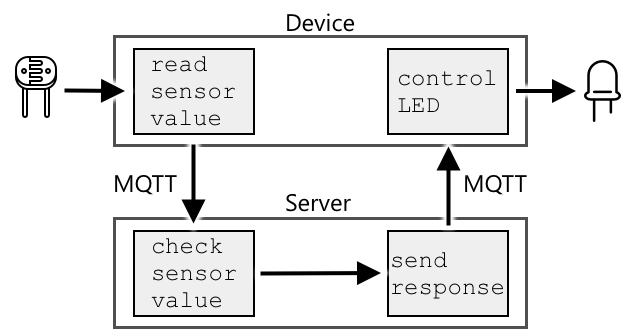

<!--
CO_OP_TRANSLATOR_METADATA:
{
  "original_hash": "71b5040e0b3472f1c0949c9b55f224c0",
  "translation_date": "2025-08-24T23:06:51+00:00",
  "source_file": "1-getting-started/lessons/4-connect-internet/README.md",
  "language_code": "ko"
}
-->
# 디바이스를 인터넷에 연결하기


> 스케치노트 제공: [Nitya Narasimhan](https://github.com/nitya). 이미지를 클릭하면 더 큰 버전을 볼 수 있습니다.

이 강의는 [Microsoft Reactor](https://developer.microsoft.com/reactor/?WT.mc_id=academic-17441-jabenn)의 [Hello IoT 시리즈](https://youtube.com/playlist?list=PLmsFUfdnGr3xRts0TIwyaHyQuHaNQcb6-)의 일부로 진행되었습니다. 강의는 1시간짜리 강의와, 강의 내용을 더 깊이 다루고 질문에 답변하는 1시간짜리 오피스 아워로 구성된 두 개의 비디오로 진행되었습니다.

[](https://youtu.be/O4dd172mZhs)

[](https://youtu.be/j-cVCzRDE2Q)

> 🎥 위 이미지를 클릭하면 비디오를 시청할 수 있습니다.

## 강의 전 퀴즈

[강의 전 퀴즈](https://black-meadow-040d15503.1.azurestaticapps.net/quiz/7)

## 소개

IoT에서 **I**는 **Internet**을 의미합니다. 이는 클라우드 연결 및 서비스를 통해 IoT 디바이스의 다양한 기능을 가능하게 합니다. 예를 들어, 디바이스에 연결된 센서로부터 측정값을 수집하거나 액추에이터를 제어하는 메시지를 보내는 것 등이 있습니다. IoT 디바이스는 일반적으로 표준 통신 프로토콜을 사용하여 단일 클라우드 IoT 서비스에 연결되며, 이 서비스는 AI 서비스(데이터에 대한 스마트한 결정을 내리기 위해)나 제어 및 보고를 위한 웹 애플리케이션 등 IoT 애플리케이션의 나머지 부분과 연결됩니다.

> 🎓 센서로부터 수집된 데이터를 클라우드로 전송하는 것을 원격 측정(telemetry)이라고 합니다.

IoT 디바이스는 클라우드로부터 메시지를 받을 수 있습니다. 이러한 메시지에는 명령이 포함되는 경우가 많습니다. 이는 내부적으로 수행해야 할 작업(예: 재부팅 또는 펌웨어 업데이트)이나 액추에이터를 사용한 작업(예: 조명 켜기)에 대한 지침을 의미합니다.

이번 강의에서는 IoT 디바이스가 클라우드에 연결할 때 사용할 수 있는 몇 가지 통신 프로토콜과 송수신할 수 있는 데이터 유형을 소개합니다. 또한, 인터넷 제어를 야간 조명에 추가하고, LED 제어 로직을 로컬에서 실행되는 '서버' 코드로 이동시키는 실습도 진행합니다.

이번 강의에서 다룰 내용은 다음과 같습니다:

* [통신 프로토콜](../../../../../1-getting-started/lessons/4-connect-internet)
* [메시지 큐잉 텔레메트리 전송(MQTT)](../../../../../1-getting-started/lessons/4-connect-internet)
* [원격 측정](../../../../../1-getting-started/lessons/4-connect-internet)
* [명령](../../../../../1-getting-started/lessons/4-connect-internet)

## 통신 프로토콜

IoT 디바이스가 인터넷과 통신하기 위해 사용하는 여러 인기 있는 통신 프로토콜이 있습니다. 가장 널리 사용되는 프로토콜은 브로커를 통해 게시/구독 메시징을 기반으로 합니다. IoT 디바이스는 브로커에 연결하여 원격 측정을 게시하고 명령을 구독합니다. 클라우드 서비스도 브로커에 연결하여 모든 원격 측정 메시지를 구독하고 특정 디바이스나 디바이스 그룹에 명령을 게시합니다.


MQTT는 IoT 디바이스에서 가장 인기 있는 통신 프로토콜이며, 이번 강의에서 다룹니다. 그 외에도 AMQP와 HTTP/HTTPS 같은 프로토콜이 있습니다.

## 메시지 큐잉 텔레메트리 전송(MQTT)

[MQTT](http://mqtt.org)는 디바이스 간 메시지를 전송할 수 있는 경량의 오픈 표준 메시징 프로토콜입니다. 1999년에 석유 파이프라인을 모니터링하기 위해 설계되었으며, 15년 후 IBM에 의해 오픈 표준으로 공개되었습니다.

MQTT는 단일 브로커와 다수의 클라이언트로 구성됩니다. 모든 클라이언트는 브로커에 연결되며, 브로커는 관련 클라이언트로 메시지를 라우팅합니다. 메시지는 개별 클라이언트로 직접 전송되는 대신, 이름이 지정된 주제를 사용하여 라우팅됩니다. 클라이언트는 주제에 메시지를 게시할 수 있으며, 해당 주제를 구독한 모든 클라이언트는 메시지를 수신합니다.


✅ 조사해 보세요. 많은 IoT 디바이스가 있을 경우, MQTT 브로커가 모든 메시지를 처리할 수 있도록 어떻게 보장할 수 있을까요?

### IoT 디바이스를 MQTT에 연결하기

야간 조명에 인터넷 제어를 추가하는 첫 번째 단계는 MQTT 브로커에 연결하는 것입니다.

#### 과제

디바이스를 MQTT 브로커에 연결하세요.

이번 강의의 이 부분에서는 IoT 야간 조명을 인터넷에 연결하여 원격으로 제어할 수 있도록 합니다. 이후 강의에서는 IoT 디바이스가 MQTT를 통해 공용 MQTT 브로커로 조도 수준에 대한 원격 측정 메시지를 전송하고, 이를 수신한 서버 코드가 조도 수준을 확인한 후 LED를 켜거나 끄라는 명령 메시지를 디바이스로 다시 보냅니다.

이러한 설정의 실제 사용 사례는 조명이 많은 장소(예: 경기장)에서 여러 조도 센서로부터 데이터를 수집한 후 조명을 켜는 결정을 내리는 것입니다. 이렇게 하면 구름이나 새로 인해 한 센서만 가려졌을 때 다른 센서가 충분한 빛을 감지하면 조명이 켜지지 않도록 할 수 있습니다.

✅ 여러 센서의 데이터를 평가한 후 명령을 보내야 하는 다른 상황은 무엇이 있을까요?

이번 과제에서는 MQTT 브로커를 설정하는 복잡성을 다루는 대신, [Eclipse Mosquitto](https://www.mosquitto.org)라는 오픈 소스 MQTT 브로커를 실행하는 공용 테스트 서버를 사용할 수 있습니다. 이 테스트 브로커는 [test.mosquitto.org](https://test.mosquitto.org)에서 공개적으로 제공되며, 계정을 설정할 필요가 없어 MQTT 클라이언트와 서버를 테스트하기에 적합한 도구입니다.

> 💁 이 테스트 브로커는 공개적이며 보안이 없습니다. 누구나 게시한 내용을 들을 수 있으므로 비공개로 유지해야 하는 데이터에는 사용하지 마세요.



아래의 관련 단계를 따라 디바이스를 MQTT 브로커에 연결하세요:

* [Arduino - Wio Terminal](wio-terminal-mqtt.md)
* [단일 보드 컴퓨터 - Raspberry Pi/가상 IoT 디바이스](single-board-computer-mqtt.md)

### MQTT 심화 학습

주제는 계층 구조를 가질 수 있으며, 클라이언트는 와일드카드를 사용하여 계층의 다른 수준을 구독할 수 있습니다. 예를 들어, `/telemetry/temperature` 주제로 온도 원격 측정 메시지를 보내고 `/telemetry/humidity` 주제로 습도 메시지를 보낸 다음, 클라우드 앱에서 `/telemetry/*` 주제를 구독하여 온도와 습도 원격 측정 메시지를 모두 받을 수 있습니다.

메시지는 품질 보증(QoS) 수준과 함께 전송될 수 있으며, 이는 메시지가 수신될 보증 수준을 결정합니다.

* 최대 1회 - 메시지는 한 번만 전송되며, 클라이언트와 브로커는 추가적으로 전달을 확인하지 않습니다(발송 후 잊기).
* 최소 1회 - 송신자는 확인을 받을 때까지 메시지를 여러 번 재시도합니다(확인된 전달).
* 정확히 1회 - 송신자와 수신자는 2단계 핸드셰이크를 통해 메시지가 한 번만 수신되도록 보장합니다(보장된 전달).

✅ 어떤 상황에서 보장된 전달 메시지가 발송 후 잊기 메시지보다 필요할까요?

MQTT는 이름에 메시지 큐잉이 포함되어 있지만 실제로는 메시지 큐를 지원하지 않습니다. 즉, 클라이언트가 연결이 끊긴 후 다시 연결되면, QoS 프로세스를 통해 이미 처리 중이던 메시지를 제외하고는 연결이 끊긴 동안 전송된 메시지를 받을 수 없습니다. 메시지에 보존 플래그가 설정된 경우, MQTT 브로커는 이 플래그가 설정된 주제에서 마지막으로 전송된 메시지를 저장하고, 이후 해당 주제를 구독하는 클라이언트에게 이 메시지를 전송합니다. 이를 통해 클라이언트는 항상 최신 메시지를 받을 수 있습니다.

MQTT는 또한 메시지 간 긴 간격 동안 연결이 여전히 살아 있는지 확인하는 유지 기능을 지원합니다.

> 🦟 [Eclipse Foundation의 Mosquitto](https://mosquitto.org)는 MQTT를 실험할 수 있는 무료 MQTT 브로커를 제공하며, [test.mosquitto.org](https://test.mosquitto.org)에서 테스트용으로 사용할 수 있는 공용 MQTT 브로커도 제공합니다.

MQTT 연결은 공개적이고 개방적일 수도 있고, 사용자 이름과 비밀번호 또는 인증서를 사용하여 암호화되고 보안될 수도 있습니다.

> 💁 MQTT는 HTTP와 동일한 기본 네트워크 프로토콜인 TCP/IP를 통해 통신하지만, 다른 포트를 사용합니다. 또한, 웹 브라우저에서 실행되는 웹 앱과 통신하거나 방화벽이나 기타 네트워킹 규칙이 표준 MQTT 연결을 차단하는 상황에서 웹소켓을 통해 MQTT를 사용할 수도 있습니다.

## 원격 측정

원격 측정(telemetry)이라는 단어는 '원격으로 측정하다'라는 의미의 그리스어 어원에서 유래했습니다. 원격 측정은 센서로부터 데이터를 수집하여 클라우드로 전송하는 행위를 말합니다.

> 💁 최초의 원격 측정 장치 중 하나는 1874년 프랑스에서 발명되었으며, 몽블랑에서 파리로 실시간 날씨와 눈 깊이를 전송했습니다. 당시에는 무선 기술이 없었기 때문에 물리적 전선을 사용했습니다.

Lesson 1에서 다룬 스마트 온도 조절기의 예를 다시 살펴봅시다.


온도 조절기는 원격 측정을 위해 온도 센서를 사용합니다. 내장된 온도 센서가 하나 있을 가능성이 높으며, [Bluetooth Low Energy](https://wikipedia.org/wiki/Bluetooth_Low_Energy) (BLE)와 같은 무선 프로토콜을 통해 여러 외부 온도 센서와 연결될 수 있습니다.

전송될 원격 측정 데이터의 예는 다음과 같습니다:

| 이름 | 값 | 설명 |
| ---- | ----- | ----------- |
| `thermostat_temperature` | 18°C | 온도 조절기의 내장 온도 센서로 측정된 온도 |
| `livingroom_temperature` | 19°C | `livingroom`이라는 이름으로 방을 식별한 원격 온도 센서로 측정된 온도 |
| `bedroom_temperature` | 21°C | `bedroom`이라는 이름으로 방을 식별한 원격 온도 센서로 측정된 온도 |

클라우드 서비스는 이 원격 측정 데이터를 사용하여 난방을 제어하기 위한 명령을 내릴 수 있습니다.

### IoT 디바이스에서 원격 측정 데이터 전송하기

야간 조명에 인터넷 제어를 추가하는 다음 단계는 조도 수준 원격 측정 데이터를 MQTT 브로커의 원격 측정 주제로 전송하는 것입니다.

#### 과제 - IoT 디바이스에서 원격 측정 데이터 전송하기

조도 수준 원격 측정 데이터를 MQTT 브로커로 전송하세요.

데이터는 JSON(JavaScript Object Notation) 형식으로 인코딩되어 전송됩니다. JSON은 키/값 쌍을 사용하여 데이터를 텍스트로 인코딩하는 표준입니다.

✅ JSON을 처음 접한다면, [JSON.org 문서](https://www.json.org/)에서 더 알아볼 수 있습니다.

아래의 관련 단계를 따라 디바이스에서 MQTT 브로커로 원격 측정 데이터를 전송하세요:

* [Arduino - Wio Terminal](wio-terminal-telemetry.md)
* [단일 보드 컴퓨터 - Raspberry Pi/가상 IoT 디바이스](single-board-computer-telemetry.md)

### MQTT 브로커에서 원격 측정 데이터 수신하기

원격 측정 데이터를 전송해도 이를 수신하는 것이 없다면 의미가 없습니다. 조도 수준 원격 측정 데이터를 처리하려면 이를 수신하는 무언가가 필요합니다. 이 '서버' 코드는 더 큰 IoT 애플리케이션의 일부로 클라우드 서비스에 배포할 코드 유형이지만, 여기서는 이 코드를 로컬 컴퓨터(또는 Pi에서 직접 코딩하는 경우 Pi)에서 실행합니다. 서버 코드는 MQTT를 통해 조도 수준 원격 측정 메시지를 수신하는 Python 앱으로 구성됩니다. 이후 강의에서는 이 앱이 LED를 켜거나 끄라는 명령 메시지로 응답하도록 만듭니다.

✅ 조사해 보세요: MQTT 메시지에 리스너가 없으면 어떻게 될까요?

#### Python 및 VS Code 설치

로컬에 Python과 VS Code가 설치되어 있지 않다면, 서버 코드를 작성하기 위해 둘 다 설치해야 합니다. 가상 IoT 디바이스를 사용하거나 Raspberry Pi에서 작업 중이라면 이미 설치 및 구성되어 있으므로 이 단계를 건너뛸 수 있습니다.

##### 과제 - Python 및 VS Code 설치

Python과 VS Code를 설치하세요.

1. Python을 설치하세요. 최신 버전의 Python을 설치하는 방법은 [Python 다운로드 페이지](https://www.python.org/downloads/)를 참조하세요.

1. Visual Studio Code(VS Code)를 설치하세요. 이는 Python으로 가상 디바이스 코드를 작성할 때 사용할 편집기입니다. VS Code 설치 방법은 [VS Code 문서](https://code.visualstudio.com?WT.mc_id=academic-17441-jabenn)를 참조하세요.
💁 여러분이 선호하는 도구가 있다면 이 강의를 진행하면서 원하는 Python IDE나 편집기를 자유롭게 사용할 수 있습니다. 하지만 강의에서는 VS Code를 기준으로 설명이 진행됩니다.
1. VS Code Pylance 확장 프로그램을 설치하세요. 이는 VS Code에서 Python 언어 지원을 제공하는 확장 프로그램입니다. VS Code에서 이 확장 프로그램을 설치하는 방법은 [Pylance 확장 프로그램 문서](https://marketplace.visualstudio.com/items?WT.mc_id=academic-17441-jabenn&itemName=ms-python.vscode-pylance)를 참조하세요.

#### Python 가상 환경 구성

Python의 강력한 기능 중 하나는 [pip 패키지](https://pypi.org)를 설치할 수 있다는 점입니다. 이는 다른 사람들이 작성하여 인터넷에 공개한 코드 패키지입니다. 한 명령어로 pip 패키지를 컴퓨터에 설치한 후, 해당 패키지를 코드에서 사용할 수 있습니다. 여기서는 MQTT 통신을 위해 pip를 사용하여 패키지를 설치할 것입니다.

기본적으로 패키지를 설치하면 컴퓨터 전체에서 사용할 수 있게 되는데, 이는 패키지 버전 문제를 초래할 수 있습니다. 예를 들어, 한 애플리케이션이 특정 버전의 패키지에 의존하는데, 다른 애플리케이션을 위해 새 버전을 설치하면 문제가 발생할 수 있습니다. 이러한 문제를 해결하기 위해 [Python 가상 환경](https://docs.python.org/3/library/venv.html)을 사용할 수 있습니다. 이는 전용 폴더에 Python의 복사본을 생성하며, pip 패키지를 설치하면 해당 폴더에만 설치됩니다.

##### 작업 - Python 가상 환경 구성

Python 가상 환경을 구성하고 MQTT pip 패키지를 설치하세요.

1. 터미널 또는 명령줄에서 원하는 위치에서 다음 명령어를 실행하여 새 디렉터리를 생성하고 해당 디렉터리로 이동하세요:

    ```sh
    mkdir nightlight-server
    cd nightlight-server
    ```

1. 이제 `.venv` 폴더에 가상 환경을 생성하려면 다음 명령어를 실행하세요:

    ```sh
    python3 -m venv .venv
    ```

    > 💁 Python 2가 Python 3과 함께 설치되어 있는 경우를 대비해 가상 환경을 생성할 때 `python3`을 명시적으로 호출해야 합니다. Python 2가 설치되어 있다면 `python`을 호출하면 Python 2가 실행됩니다.

1. 가상 환경을 활성화하세요:

    * Windows에서:
        * 명령 프롬프트 또는 Windows Terminal의 명령 프롬프트를 사용하는 경우:

            ```cmd
            .venv\Scripts\activate.bat
            ```

        * PowerShell을 사용하는 경우:

            ```powershell
            .\.venv\Scripts\Activate.ps1
            ```

    * macOS 또는 Linux에서는 다음을 실행하세요:

        ```cmd
        source ./.venv/bin/activate
        ```

    > 💁 이러한 명령어는 가상 환경을 생성한 동일한 위치에서 실행해야 합니다. `.venv` 폴더로 직접 이동할 필요는 없으며, 항상 가상 환경을 활성화한 후 패키지를 설치하거나 코드를 실행하세요.

1. 가상 환경이 활성화되면 기본 `python` 명령어는 가상 환경을 생성할 때 사용한 Python 버전을 실행합니다. 다음 명령어를 실행하여 버전을 확인하세요:

    ```sh
    python --version
    ```

    출력은 다음과 유사할 것입니다:

    ```output
    (.venv) ➜  nightlight-server python --version
    Python 3.9.1
    ```

    > 💁 Python 버전은 다를 수 있습니다. 버전이 3.6 이상이면 괜찮습니다. 그렇지 않다면 이 폴더를 삭제하고 최신 Python 버전을 설치한 후 다시 시도하세요.

1. [Paho-MQTT](https://pypi.org/project/paho-mqtt/)라는 인기 있는 MQTT 라이브러리를 설치하려면 다음 명령어를 실행하세요:

    ```sh
    pip install paho-mqtt
    ```

    이 pip 패키지는 가상 환경에만 설치되며, 가상 환경 외부에서는 사용할 수 없습니다.

#### 서버 코드 작성

이제 Python으로 서버 코드를 작성할 수 있습니다.

##### 작업 - 서버 코드 작성

서버 코드를 작성하세요.

1. 가상 환경 내에서 터미널 또는 명령줄에서 다음 명령어를 실행하여 `app.py`라는 Python 파일을 생성하세요:

    * Windows에서:

        ```cmd
        type nul > app.py
        ```

    * macOS 또는 Linux에서:

        ```cmd
        touch app.py
        ```

1. 현재 폴더를 VS Code에서 여세요:

    ```sh
    code .
    ```

1. VS Code가 실행되면 Python 가상 환경이 활성화됩니다. 이는 하단 상태 표시줄에 표시됩니다:

    

1. VS Code가 시작될 때 VS Code 터미널이 이미 실행 중이라면 가상 환경이 활성화되지 않을 수 있습니다. 가장 쉬운 방법은 **활성 터미널 인스턴스 종료** 버튼을 사용하여 터미널을 종료하는 것입니다:

    

1. *Terminal -> New Terminal*을 선택하거나 `` CTRL+` ``를 눌러 새 VS Code 터미널을 실행하세요. 새 터미널은 가상 환경을 로드하며, 터미널에 활성화 명령어가 표시됩니다. 가상 환경 이름(`.venv`)도 프롬프트에 표시됩니다:

    ```output
    ➜  nightlight-server source .venv/bin/activate
    (.venv) ➜  nightlight 
    ```

1. VS Code 탐색기에서 `app.py` 파일을 열고 다음 코드를 추가하세요:

    ```python
    import json
    import time
    
    import paho.mqtt.client as mqtt
    
    id = '<ID>'
    
    client_telemetry_topic = id + '/telemetry'
    client_name = id + 'nightlight_server'
    
    mqtt_client = mqtt.Client(client_name)
    mqtt_client.connect('test.mosquitto.org')
    
    mqtt_client.loop_start()
    
    def handle_telemetry(client, userdata, message):
        payload = json.loads(message.payload.decode())
        print("Message received:", payload)
    
    mqtt_client.subscribe(client_telemetry_topic)
    mqtt_client.on_message = handle_telemetry
    
    while True:
        time.sleep(2)
    ```

    6번째 줄의 `<ID>`를 디바이스 코드를 생성할 때 사용한 고유 ID로 바꾸세요.

    ⚠️ 이 ID는 디바이스에서 사용한 것과 동일해야 합니다. 그렇지 않으면 서버 코드가 올바른 토픽에 구독하거나 게시하지 않습니다.

    이 코드는 고유 이름을 가진 MQTT 클라이언트를 생성하고 *test.mosquitto.org* 브로커에 연결합니다. 그런 다음 백그라운드 스레드에서 실행되는 처리 루프를 시작하여 구독된 토픽의 메시지를 수신합니다.

    클라이언트는 텔레메트리 토픽의 메시지를 구독한 후 메시지를 수신할 때 호출되는 함수를 정의합니다. 텔레메트리 메시지를 수신하면 `handle_telemetry` 함수가 호출되어 수신된 메시지를 콘솔에 출력합니다.

    마지막으로 무한 루프가 애플리케이션을 계속 실행합니다. MQTT 클라이언트는 백그라운드 스레드에서 메시지를 수신하며 메인 애플리케이션이 실행되는 동안 계속 작동합니다.

1. VS Code 터미널에서 다음 명령어를 실행하여 Python 앱을 실행하세요:

    ```sh
    python app.py
    ```

    앱이 IoT 디바이스로부터 메시지를 수신하기 시작합니다.

1. 디바이스가 실행 중이며 텔레메트리 메시지를 전송하고 있는지 확인하세요. 물리적 또는 가상 디바이스의 조도 수준을 조정하세요. 수신된 메시지가 터미널에 출력됩니다.

    ```output
    (.venv) ➜  nightlight-server python app.py
    Message received: {'light': 0}
    Message received: {'light': 400}
    ```

    nightlight 가상 환경의 app.py 파일이 실행 중이어야 nightlight-server 가상 환경의 app.py 파일이 전송된 메시지를 수신할 수 있습니다.

> 💁 이 코드는 [code-server/server](../../../../../1-getting-started/lessons/4-connect-internet/code-server/server) 폴더에서 확인할 수 있습니다.

### 텔레메트리는 얼마나 자주 전송해야 할까요?

텔레메트리를 얼마나 자주 측정하고 전송해야 할지는 상황에 따라 다릅니다. 자주 측정하면 변화에 더 빠르게 대응할 수 있지만, 더 많은 전력, 대역폭, 데이터를 사용하며 클라우드 리소스가 더 많이 필요합니다. 적절한 빈도로 측정해야 하지만 너무 자주 측정해서는 안 됩니다.

예를 들어, 온도 조절기의 경우 몇 분마다 측정하는 것으로 충분합니다. 온도는 자주 변하지 않기 때문입니다. 반면, 공장 기계의 데이터를 모니터링하는 경우 기계가 고장 나면 큰 손실이 발생할 수 있으므로 초당 여러 번 측정이 필요할 수 있습니다.

> 💁 이 경우 인터넷 의존도를 줄이기 위해 엣지 디바이스를 사용하여 텔레메트리를 먼저 처리하는 것을 고려할 수 있습니다.

### 연결 끊김

인터넷 연결은 종종 불안정할 수 있습니다. IoT 디바이스는 이러한 상황에서 데이터를 잃어야 할까요, 아니면 연결이 복구될 때까지 데이터를 저장해야 할까요? 이 역시 상황에 따라 다릅니다.

온도 조절기의 경우 새 온도 측정값이 있으면 이전 데이터는 잃어도 괜찮습니다. 반면, 기계의 경우 트렌드를 분석하기 위해 데이터를 보관해야 할 수 있습니다. 예를 들어, 기계 학습 모델은 일정 기간 동안의 데이터를 분석하여 이상치를 감지할 수 있습니다.

IoT 디바이스 설계자는 인터넷 연결이 끊기거나 신호가 약한 위치에서도 디바이스가 작동할 수 있는지 고려해야 합니다. 예를 들어, 스마트 온도 조절기는 클라우드에 텔레메트리를 전송할 수 없는 경우에도 제한된 결정을 내릴 수 있어야 합니다.

[](https://twitter.com/internetofshit/status/1315736960082808832)

MQTT에서 연결 끊김을 처리하려면 디바이스와 서버 코드가 메시지 전달을 보장해야 합니다. 예를 들어, 모든 메시지가 응답 토픽에서 추가 메시지로 응답되도록 요구하거나, 그렇지 않을 경우 수동으로 큐에 저장하여 나중에 재전송할 수 있습니다.

## 명령

명령은 클라우드에서 디바이스로 전송되어 특정 작업을 수행하도록 지시하는 메시지입니다. 대부분의 경우 이는 액추에이터를 통해 출력을 제공하는 것이지만, 디바이스 자체에 대한 명령일 수도 있습니다. 예를 들어, 재부팅하거나 추가 텔레메트리를 수집하여 명령에 대한 응답으로 반환하는 것입니다.


온도 조절기는 클라우드에서 난방을 켜라는 명령을 받을 수 있습니다. 모든 센서의 텔레메트리 데이터를 기반으로 클라우드 서비스가 난방을 켜야 한다고 결정하면 관련 명령을 전송합니다.

### MQTT 브로커로 명령 전송

이제 인터넷으로 제어되는 야간 조명을 위해 서버 코드가 감지된 조도 수준에 따라 IoT 디바이스로 명령을 전송하도록 설정합니다.

1. VS Code에서 서버 코드를 여세요.

1. `client_telemetry_topic` 선언 뒤에 명령을 보낼 토픽을 정의하는 다음 줄을 추가하세요:

    ```python
    server_command_topic = id + '/commands'
    ```

1. `handle_telemetry` 함수 끝에 다음 코드를 추가하세요:

    ```python
    command = { 'led_on' : payload['light'] < 300 }
    print("Sending message:", command)
    
    client.publish(server_command_topic, json.dumps(command))
    ```

    이는 조도가 300 미만인지 여부에 따라 `led_on` 값을 true 또는 false로 설정하여 명령 토픽에 JSON 메시지를 전송합니다. 조도가 300 미만이면 LED를 켜라는 명령으로 true를 전송합니다.

1. 이전과 같이 코드를 실행하세요.

1. 물리적 또는 가상 디바이스의 조도 수준을 조정하세요. 수신된 메시지와 전송된 명령이 터미널에 출력됩니다:

    ```output
    (.venv) ➜  nightlight-server python app.py
    Message received: {'light': 0}
    Sending message: {'led_on': True}
    Message received: {'light': 400}
    Sending message: {'led_on': False}
    ```

> 💁 텔레메트리와 명령은 각각 단일 토픽에서 전송됩니다. 이는 여러 디바이스의 텔레메트리가 동일한 텔레메트리 토픽에 나타나고, 여러 디바이스의 명령이 동일한 명령 토픽에 나타난다는 것을 의미합니다. 특정 디바이스에 명령을 보내려면 고유 디바이스 ID로 명명된 여러 토픽을 사용할 수 있습니다. 예를 들어, `/commands/device1`, `/commands/device2`와 같이 설정하면 특정 디바이스만 해당 메시지를 수신하도록 할 수 있습니다.

> 💁 이 코드는 [code-commands/server](../../../../../1-getting-started/lessons/4-connect-internet/code-commands/server) 폴더에서 확인할 수 있습니다.

### IoT 디바이스에서 명령 처리

이제 서버에서 명령이 전송되었으므로 IoT 디바이스에 코드를 추가하여 명령을 처리하고 LED를 제어할 수 있습니다.

다음 단계에 따라 MQTT 브로커에서 명령을 수신하도록 설정하세요:

* [Arduino - Wio Terminal](wio-terminal-commands.md)
* [싱글보드 컴퓨터 - Raspberry Pi/가상 IoT 디바이스](single-board-computer-commands.md)

코드를 작성하고 실행한 후 조도 수준을 변경하며 서버와 디바이스의 출력 및 LED 상태를 확인하세요.

### 연결 끊김

클라우드 서비스가 오프라인 상태의 IoT 디바이스에 명령을 보내야 할 경우 어떻게 해야 할까요? 이 역시 상황에 따라 다릅니다.

최신 명령이 이전 명령을 덮어쓴다면 이전 명령은 무시해도 괜찮습니다. 예를 들어, 난방을 켜라는 명령 후 끄라는 명령이 전송되었다면 켜라는 명령은 무시할 수 있습니다.

명령이 순서대로 처리되어야 한다면, 예를 들어 로봇 팔을 위로 이동한 후 집게를 닫는 경우, 연결이 복구되면 순서대로 명령을 전송해야 합니다.

✅ 디바이스 또는 서버 코드가 MQTT를 통해 명령을 항상 순서대로 전송하고 처리하도록 보장하려면 어떻게 해야 할까요?

---

## 🚀 도전 과제

지난 세 강의의 도전 과제는 집, 학교 또는 직장에서 사용할 수 있는 IoT 디바이스를 최대한 많이 나열하고, 그것들이 마이크로컨트롤러, 싱글보드 컴퓨터, 또는 둘의 혼합으로 구성되었는지 결정하는 것이었습니다. 또한, 해당 디바이스가 사용하는 센서와 액추에이터에 대해 생각해 보세요.
이 장치들이 어떤 메시지를 보내거나 받는지 생각해 보세요. 어떤 텔레메트리를 보내나요? 어떤 메시지나 명령을 받을 수 있을까요? 이 장치들이 안전하다고 생각하나요?

## 강의 후 퀴즈

[강의 후 퀴즈](https://black-meadow-040d15503.1.azurestaticapps.net/quiz/8)

## 복습 및 자기 학습

MQTT에 대해 더 알아보려면 [MQTT Wikipedia 페이지](https://wikipedia.org/wiki/MQTT)를 읽어보세요.

직접 MQTT 브로커를 실행해보고 [Mosquitto](https://www.mosquitto.org)를 사용하여 IoT 장치와 서버 코드에서 연결해보세요.

> 💁 팁 - 기본적으로 Mosquitto는 익명 연결(즉, 사용자 이름과 비밀번호 없이 연결)을 허용하지 않으며, 실행 중인 컴퓨터 외부에서의 연결도 허용하지 않습니다.
> 이를 수정하려면 [`mosquitto.conf` 설정 파일](https://www.mosquitto.org/man/mosquitto-conf-5.html)을 사용하여 다음을 추가하세요:
>
> ```sh
> listener 1883 0.0.0.0
> allow_anonymous true
> ```

## 과제

[MQTT와 다른 통신 프로토콜 비교 및 대조](assignment.md)

**면책 조항**:  
이 문서는 AI 번역 서비스 [Co-op Translator](https://github.com/Azure/co-op-translator)를 사용하여 번역되었습니다. 정확성을 위해 최선을 다하고 있지만, 자동 번역에는 오류나 부정확성이 포함될 수 있습니다. 원본 문서의 원어를 신뢰할 수 있는 권위 있는 출처로 간주해야 합니다. 중요한 정보의 경우, 전문적인 인간 번역을 권장합니다. 이 번역 사용으로 인해 발생하는 오해나 잘못된 해석에 대해 책임을 지지 않습니다.