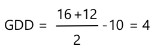

<!--
CO_OP_TRANSLATOR_METADATA:
{
  "original_hash": "d105b44deae539165855c976dcdeca99",
  "translation_date": "2025-08-24T22:01:06+00:00",
  "source_file": "2-farm/lessons/1-predict-plant-growth/README.md",
  "language_code": "ko"
}
-->
# IoT를 활용한 식물 성장 예측


> 스케치노트 제공: [Nitya Narasimhan](https://github.com/nitya). 이미지를 클릭하면 더 큰 버전을 볼 수 있습니다.

## 강의 전 퀴즈

[강의 전 퀴즈](https://black-meadow-040d15503.1.azurestaticapps.net/quiz/9)

## 소개

식물이 성장하려면 물, 이산화탄소, 영양소, 빛, 열이 필요합니다. 이번 강의에서는 공기 온도를 측정하여 식물의 성장 및 성숙 속도를 계산하는 방법을 배웁니다.

이번 강의에서 다룰 내용:

* [디지털 농업](../../../../../2-farm/lessons/1-predict-plant-growth)
* [농업에서 온도가 중요한 이유](../../../../../2-farm/lessons/1-predict-plant-growth)
* [주변 온도 측정](../../../../../2-farm/lessons/1-predict-plant-growth)
* [생장 적산온도(GDD)](../../../../../2-farm/lessons/1-predict-plant-growth)
* [온도 센서 데이터를 사용한 GDD 계산](../../../../../2-farm/lessons/1-predict-plant-growth)

## 디지털 농업

디지털 농업은 농업 데이터를 수집, 저장 및 분석하는 도구를 활용하여 농업 방식을 혁신하고 있습니다. 현재 우리는 세계경제포럼이 '4차 산업혁명'이라고 부르는 시기에 있으며, 디지털 농업의 부상은 '4차 농업혁명' 또는 '농업 4.0'으로 불리고 있습니다.

> 🎓 디지털 농업이라는 용어는 '농업 가치 사슬' 전체를 포함합니다. 즉, 농장에서 식탁까지의 모든 여정을 의미합니다. 여기에는 식품이 운송 및 가공되는 동안 품질을 추적하는 것, 창고 및 전자상거래 시스템, 심지어 트랙터 대여 앱도 포함됩니다!

이러한 변화는 농부들이 수확량을 늘리고, 비료와 살충제 사용을 줄이며, 물을 더 효율적으로 사용할 수 있도록 돕습니다. 주로 부유한 국가에서 사용되지만, 센서와 기타 장치의 가격이 점차 낮아지면서 개발도상국에서도 점차 접근 가능해지고 있습니다.

디지털 농업이 가능하게 한 몇 가지 기술은 다음과 같습니다:

* 온도 측정 - 온도를 측정하면 농부들이 식물의 성장과 성숙을 예측할 수 있습니다.
* 자동 급수 - 토양 습도를 측정하고 토양이 너무 건조할 때 관개 시스템을 작동시키는 방식으로, 정해진 시간에 물을 주는 방식과 다릅니다. 정해진 시간에 물을 주는 방식은 더운 건조한 날씨에 작물이 물 부족 상태가 되거나, 비가 오는 동안 과도하게 물을 주는 상황을 초래할 수 있습니다. 토양이 필요로 할 때만 물을 주면 농부들은 물 사용을 최적화할 수 있습니다.
* 해충 방제 - 농부들은 자동화된 로봇이나 드론에 장착된 카메라를 사용해 해충을 확인하고, 필요한 곳에만 살충제를 뿌려 살충제 사용량을 줄이고 지역 수자원으로의 살충제 유출을 줄일 수 있습니다.

✅ 조사해 보세요. 농업 수확량을 개선하기 위해 사용되는 다른 기술은 무엇이 있을까요?

> 🎓 '정밀 농업'이라는 용어는 필드 단위 또는 필드의 일부를 기준으로 작물을 관찰, 측정 및 대응하는 것을 정의합니다. 여기에는 물, 영양소 및 해충 수준을 측정하고 정확히 대응하는 것이 포함됩니다. 예를 들어, 필드의 작은 부분에만 물을 주는 방식입니다.

## 농업에서 온도가 중요한 이유

식물에 대해 배울 때 대부분의 학생들은 물, 빛, 이산화탄소, 영양소의 필요성에 대해 배우지만, 식물이 성장하려면 따뜻함도 필요합니다. 이는 봄에 온도가 상승하면서 식물이 꽃을 피우는 이유, 짧은 따뜻한 날씨로 인해 눈꽃이나 수선화가 일찍 싹트는 이유, 그리고 온실이 식물을 잘 자라게 하는 이유입니다.

> 🎓 온실과 비닐하우스는 비슷한 역할을 하지만 중요한 차이점이 있습니다. 비닐하우스는 인공적으로 가열되어 온도를 더 정확히 제어할 수 있는 반면, 온실은 태양열에 의존하며 일반적으로 열을 배출하기 위해 창문이나 다른 개구부를 사용하는 정도의 제어만 가능합니다.

식물은 일일 평균 온도를 기준으로 기본 온도, 최적 온도, 최대 온도를 가지고 있습니다.

* 기본 온도 - 식물이 성장하기 위해 필요한 최소 일일 평균 온도입니다.
* 최적 온도 - 가장 빠른 성장을 위해 필요한 최적의 일일 평균 온도입니다.
* 최대 온도 - 식물이 견딜 수 있는 최대 온도입니다. 이 온도를 초과하면 식물은 물을 보존하고 생존하기 위해 성장을 멈춥니다.

> 💁 이는 일일 및 야간 온도를 평균화한 평균 온도입니다. 식물은 광합성을 더 효율적으로 하고 밤에 에너지를 절약하기 위해 낮과 밤에 서로 다른 온도가 필요합니다.

각 식물 종은 기본, 최적, 최대 온도 값이 다릅니다. 이는 어떤 식물은 더운 나라에서 잘 자라고, 어떤 식물은 추운 나라에서 잘 자라는 이유입니다.

✅ 조사해 보세요. 정원, 학교 또는 지역 공원에 있는 식물 중 기본 온도를 찾아보세요.


위 그래프는 성장률과 온도의 관계를 보여줍니다. 기본 온도까지는 성장이 없습니다. 성장률은 최적 온도까지 증가하다가, 이 정점을 넘으면 감소합니다. 최대 온도에서는 성장이 멈춥니다.

이 그래프의 형태는 식물 종에 따라 다릅니다. 어떤 식물은 최적 온도 이상에서 급격히 감소하고, 어떤 식물은 기본 온도에서 최적 온도까지 천천히 증가합니다.

> 💁 농부가 최적의 성장을 얻으려면 세 가지 온도 값을 알고, 자신이 재배하는 식물의 그래프 형태를 이해해야 합니다.

농부가 온도를 제어할 수 있다면, 예를 들어 상업용 비닐하우스에서, 식물에 맞게 최적화할 수 있습니다. 예를 들어, 상업용 비닐하우스에서 토마토를 재배할 경우 낮에는 약 25°C, 밤에는 20°C로 설정하여 가장 빠른 성장을 유도합니다.

> 🍅 이러한 온도에 인공 조명, 비료 및 제어된 이산화탄소 수준을 결합하면 상업 재배자는 연중 내내 재배 및 수확이 가능합니다.

## 주변 온도 측정

온도 센서를 IoT 장치와 함께 사용하여 주변 온도를 측정할 수 있습니다.

### 과제 - 온도 측정

IoT 장치를 사용하여 온도를 모니터링하는 관련 가이드를 따라 진행하세요:

* [Arduino - Wio Terminal](wio-terminal-temp.md)
* [단일 보드 컴퓨터 - Raspberry Pi](pi-temp.md)
* [단일 보드 컴퓨터 - 가상 장치](virtual-device-temp.md)

## 생장 적산온도(GDD)

생장 적산온도(또는 생장 적산 단위)는 온도를 기준으로 식물의 성장을 측정하는 방법입니다. 식물이 충분한 물, 영양소 및 이산화탄소를 가지고 있다고 가정할 때, 온도가 성장 속도를 결정합니다.

생장 적산온도(GDD)는 하루 동안 식물의 기본 온도 이상인 하루 평균 온도로 계산됩니다. 각 식물은 성장, 개화 또는 작물 성숙을 위해 특정 GDD가 필요합니다. 하루에 GDD가 많을수록 식물이 더 빨리 자랍니다.

> 🇺🇸 미국에서는 GDD를 화씨로도 계산할 수 있습니다. 섭씨 5 GDD는 화씨 9 GDD와 동일합니다.

GDD의 전체 공식은 약간 복잡하지만, 종종 근사치로 사용되는 간단한 방정식이 있습니다:


* **GDD** - 생장 적산온도
* **T max** - 하루 최대 온도(섭씨)
* **T min** - 하루 최소 온도(섭씨)
* **T base** - 식물의 기본 온도(섭씨)

> 💁 T max가 30°C 이상이거나 T min이 T base 이하인 경우를 처리하는 변형도 있지만, 여기서는 이를 무시합니다.

### 예제 - 옥수수 🌽

품종에 따라 옥수수(또는 옥수수)는 성숙하기 위해 800에서 2,700 GDD가 필요하며, 기본 온도는 10°C입니다.

기본 온도 이상인 첫날에 다음과 같은 온도가 측정되었습니다:

| 측정값      | 온도 °C |
| :---------- | :-----: |
| 최대        | 16      |
| 최소        | 12      |

이 숫자를 계산에 대입하면:

* T max = 16
* T min = 12
* T base = 10

계산 결과:



이날 옥수수는 4 GDD를 받았습니다. 성숙하기 위해 800 GDD가 필요한 옥수수 품종을 가정하면, 성숙까지 796 GDD가 더 필요합니다.

✅ 조사해 보세요. 정원, 학교 또는 지역 공원에 있는 식물 중 성숙하거나 작물을 생산하기 위해 필요한 GDD를 찾아보세요.

## 온도 센서 데이터를 사용한 GDD 계산

식물은 고정된 날짜에 자라지 않습니다. 예를 들어, 씨앗을 심고 정확히 100일 후에 열매를 맺는다고 알 수는 없습니다. 대신 농부는 식물이 자라는 데 걸리는 대략적인 시간을 알고, 매일 확인하여 작물이 준비되었는지 확인합니다.

이는 대규모 농장에서 큰 노동력을 필요로 하며, 예상보다 일찍 준비된 작물을 놓칠 위험이 있습니다. 온도를 측정하면 농부는 식물이 받은 GDD를 계산할 수 있어, 예상 성숙 시점에 가까워졌을 때만 확인하면 됩니다.

IoT 장치를 사용하여 온도 데이터를 수집하면, 식물이 성숙에 가까워졌을 때 자동으로 알림을 받을 수 있습니다. 일반적인 아키텍처는 IoT 장치가 온도를 측정한 후 MQTT와 같은 프로토콜을 사용하여 인터넷을 통해 이 원격 데이터를 전송하는 것입니다. 서버 코드는 이 데이터를 수신하고 데이터베이스와 같은 곳에 저장합니다. 이렇게 하면 데이터를 나중에 분석할 수 있습니다. 예를 들어, 매일 밤 GDD를 계산하고, 각 작물의 총 GDD를 합산하며, 식물이 성숙에 가까워졌을 때 알림을 보낼 수 있습니다.


서버 코드는 데이터에 추가 정보를 첨가할 수도 있습니다. 예를 들어, IoT 장치는 자신을 식별하는 ID를 전송할 수 있으며, 서버 코드는 이를 사용하여 장치의 위치와 모니터링 중인 작물을 조회할 수 있습니다. 또한 일부 IoT 장치에는 정확한 시간을 추적할 하드웨어가 없거나 인터넷을 통해 현재 시간을 읽는 추가 코드가 필요하기 때문에 현재 시간을 추가할 수도 있습니다.

✅ 왜 서로 다른 필드가 서로 다른 온도를 가질 수 있다고 생각하나요?

### 과제 - 온도 정보 전송

IoT 장치를 사용하여 MQTT를 통해 온도 데이터를 전송하고 나중에 분석할 수 있도록 관련 가이드를 따라 진행하세요:

* [Arduino - Wio Terminal](wio-terminal-temp-publish.md)
* [단일 보드 컴퓨터 - Raspberry Pi/가상 IoT 장치](single-board-computer-temp-publish.md)

### 과제 - 온도 정보 캡처 및 저장

IoT 장치가 원격 데이터를 전송하기 시작하면, 서버 코드를 작성하여 이 데이터를 구독하고 저장할 수 있습니다. 데이터베이스에 저장하는 대신, 서버 코드는 데이터를 쉼표로 구분된 값(CSV) 파일에 저장합니다. CSV 파일은 텍스트로 된 값의 행을 저장하며, 각 값은 쉼표로 구분되고 각 레코드는 새 줄에 저장됩니다. 이는 데이터를 파일로 저장하는 데 편리하고 사람이 읽을 수 있으며 널리 지원되는 방법입니다.

CSV 파일에는 두 개의 열이 있습니다 - *date*와 *temperature*. *date* 열은 서버가 메시지를 수신한 현재 날짜와 시간으로 설정되며, *temperature*는 원격 데이터 메시지에서 가져옵니다.

1. 4강의 단계를 반복하여 원격 데이터를 구독하는 서버 코드를 작성하세요. 명령을 전송하는 코드를 추가할 필요는 없습니다.

    이 단계는 다음과 같습니다:

    * Python 가상 환경 구성 및 활성화

    * paho-mqtt pip 패키지 설치

    * 원격 데이터가 게시된 MQTT 주제를 수신하는 코드를 작성

      > ⚠️ [4강의 MQTT 브로커에서 원격 데이터를 수신하는 Python 앱 생성 지침](../../../1-getting-started/lessons/4-connect-internet/README.md#receive-telemetry-from-the-mqtt-broker)을 참조할 수 있습니다.

    이 프로젝트의 폴더 이름을 `temperature-sensor-server`로 지정하세요.

1. `client_name`이 이 프로젝트를 반영하도록 설정하세요:

    ```cpp
    client_name = id + 'temperature_sensor_server'
    ```

1. 기존 가져오기(import) 아래에 다음 가져오기를 파일 상단에 추가하세요:

    ```python
    from os import path
    import csv
    from datetime import datetime
    ```

    이는 파일을 읽기 위한 라이브러리, CSV 파일과 상호작용하기 위한 라이브러리, 날짜와 시간을 처리하기 위한 라이브러리를 가져옵니다.

1. `handle_telemetry` 함수 이전에 다음 코드를 추가하세요:

    ```python
    temperature_file_name = 'temperature.csv'
    fieldnames = ['date', 'temperature']
    
    if not path.exists(temperature_file_name):
        with open(temperature_file_name, mode='w') as csv_file:
            writer = csv.DictWriter(csv_file, fieldnames=fieldnames)
            writer.writeheader()
    ```

    이 코드는 CSV 파일에 쓸 파일 이름과 CSV 파일의 열 헤더 이름을 선언합니다. CSV 파일의 첫 번째 행은 전통적으로 쉼표로 구분된 열 헤더를 포함합니다.

    그런 다음 CSV 파일이 이미 존재하는지 확인합니다. 존재하지 않으면 열 헤더가 포함된 첫 번째 행으로 파일이 생성됩니다.

1. `handle_telemetry` 함수 끝에 다음 코드를 추가하세요:

    ```python
    with open(temperature_file_name, mode='a') as temperature_file:        
        temperature_writer = csv.DictWriter(temperature_file, fieldnames=fieldnames)
        temperature_writer.writerow({'date' : datetime.now().astimezone().replace(microsecond=0).isoformat(), 'temperature' : payload['temperature']})
    ```
이 코드는 CSV 파일을 열고, 마지막에 새로운 행을 추가합니다. 이 행에는 현재 날짜와 시간이 사람이 읽을 수 있는 형식으로 포맷된 데이터와 IoT 디바이스에서 받은 온도가 포함됩니다. 데이터는 [ISO 8601 형식](https://wikipedia.org/wiki/ISO_8601)으로 시간대 정보를 포함하지만 마이크로초는 제외하고 저장됩니다.

1. 이전과 동일한 방식으로 이 코드를 실행하세요. IoT 디바이스가 데이터를 전송하고 있는지 확인하세요. `temperature.csv`라는 CSV 파일이 동일한 폴더에 생성됩니다. 파일을 열어보면 날짜/시간과 온도 측정값을 확인할 수 있습니다:

    ```output
    date,temperature
    2021-04-19T17:21:36-07:00,25
    2021-04-19T17:31:36-07:00,24
    2021-04-19T17:41:36-07:00,25
    ```

1. 데이터를 수집하기 위해 이 코드를 잠시 실행하세요. 이상적으로는 GDD 계산을 위한 충분한 데이터를 수집하기 위해 하루 종일 실행하는 것이 좋습니다.

    
> 💁 가상 IoT 디바이스를 사용하는 경우, 랜덤 체크박스를 선택하고 범위를 설정하여 온도 값이 매번 동일하게 반환되지 않도록 하세요.
     

    > 💁 하루 종일 실행하려면 서버 코드가 실행 중인 컴퓨터가 절전 모드로 전환되지 않도록 해야 합니다. 전원 설정을 변경하거나 [이 시스템 활성 유지 Python 스크립트](https://github.com/jaqsparow/keep-system-active)와 같은 것을 실행하세요.
    
> 💁 이 코드는 [code-server/temperature-sensor-server](../../../../../2-farm/lessons/1-predict-plant-growth/code-server/temperature-sensor-server) 폴더에서 찾을 수 있습니다.

### 작업 - 저장된 데이터를 사용하여 GDD 계산하기

서버가 온도 데이터를 수집한 후, 식물의 GDD를 계산할 수 있습니다.

수동으로 이 작업을 수행하는 단계는 다음과 같습니다:

1. 식물의 기준 온도를 찾습니다. 예를 들어, 딸기의 기준 온도는 10°C입니다.

1. `temperature.csv`에서 하루 동안의 최고 온도와 최저 온도를 찾습니다.

1. 이전에 제공된 GDD 계산 공식을 사용하여 GDD를 계산합니다.

예를 들어, 하루 동안의 최고 온도가 25°C이고 최저 온도가 12°C인 경우:


* 25 + 12 = 37
* 37 / 2 = 18.5
* 18.5 - 10 = 8.5

따라서 딸기는 **8.5** GDD를 받았습니다. 딸기가 열매를 맺으려면 약 250 GDD가 필요하므로 아직 시간이 더 필요합니다.

---

## 🚀 도전 과제

식물이 자라기 위해서는 열 외에도 다른 요소들이 필요합니다. 어떤 것들이 필요할까요?

이 요소들을 측정할 수 있는 센서가 있는지 찾아보세요. 이러한 수준을 제어할 수 있는 액추에이터는 어떨까요? 식물 성장을 최적화하기 위해 하나 이상의 IoT 디바이스를 어떻게 구성할 수 있을지 생각해보세요.

## 강의 후 퀴즈

[강의 후 퀴즈](https://black-meadow-040d15503.1.azurestaticapps.net/quiz/10)

## 복습 및 자기 학습

* [디지털 농업 위키백과 페이지](https://wikipedia.org/wiki/Digital_agriculture)에서 디지털 농업에 대해 더 읽어보세요. 또한 [정밀 농업 위키백과 페이지](https://wikipedia.org/wiki/Precision_agriculture)에서 정밀 농업에 대해 더 알아보세요.
* 완전한 생장도일 계산은 여기 제공된 단순화된 계산보다 더 복잡합니다. [생장도일 위키백과 페이지](https://wikipedia.org/wiki/Growing_degree-day)에서 더 복잡한 공식과 기준 온도 이하의 온도를 처리하는 방법에 대해 읽어보세요.
* 미래에는 기존 농업 방식만으로는 식량이 부족할 수 있습니다. [미래의 하이테크 농장 YouTube 비디오](https://www.youtube.com/watch?v=KIEOuKD9KX8)에서 하이테크 농업 기술에 대해 더 알아보세요.

## 과제

[Jupyter Notebook을 사용하여 GDD 데이터 시각화하기](assignment.md)

**면책 조항**:  
이 문서는 AI 번역 서비스 [Co-op Translator](https://github.com/Azure/co-op-translator)를 사용하여 번역되었습니다. 정확성을 위해 최선을 다하고 있지만, 자동 번역에는 오류나 부정확성이 포함될 수 있습니다. 원본 문서의 모국어 버전이 권위 있는 자료로 간주되어야 합니다. 중요한 정보의 경우, 전문적인 인간 번역을 권장합니다. 이 번역 사용으로 인해 발생하는 오해나 잘못된 해석에 대해 당사는 책임을 지지 않습니다.