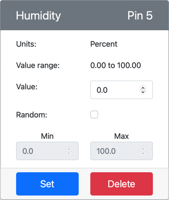

<!--
CO_OP_TRANSLATOR_METADATA:
{
  "original_hash": "70e5a428b607cd5a9a4f422c2a4df03d",
  "translation_date": "2025-08-24T22:07:37+00:00",
  "source_file": "2-farm/lessons/1-predict-plant-growth/virtual-device-temp.md",
  "language_code": "ko"
}
-->
# 온도 측정 - 가상 IoT 하드웨어

이 수업의 이번 부분에서는 가상 IoT 장치에 온도 센서를 추가합니다.

## 가상 하드웨어

가상 IoT 장치는 시뮬레이션된 Grove 디지털 습도 및 온도 센서를 사용합니다. 이는 실제 Grove DHT11 센서를 사용하는 Raspberry Pi와 동일한 방식으로 실습을 진행할 수 있도록 합니다.

이 센서는 **온도 센서**와 **습도 센서**를 결합한 형태이지만, 이번 실습에서는 온도 센서 구성 요소에만 집중합니다. 실제 IoT 장치에서 온도 센서는 [서미스터](https://wikipedia.org/wiki/Thermistor)를 사용하여 온도가 변할 때 저항의 변화를 감지하여 온도를 측정합니다. 온도 센서는 일반적으로 디지털 센서로, 내부적으로 측정된 저항을 섭씨(또는 켈빈, 화씨) 온도로 변환합니다.

### CounterFit에 센서 추가하기

가상 습도 및 온도 센서를 사용하려면 CounterFit 앱에 두 개의 센서를 추가해야 합니다.

#### 작업 - CounterFit에 센서 추가하기

CounterFit 앱에 습도 및 온도 센서를 추가합니다.

1. `temperature-sensor`라는 폴더에 단일 파일 `app.py`와 Python 가상 환경을 포함한 새 Python 앱을 컴퓨터에 생성하고 CounterFit pip 패키지를 추가합니다.

    > ⚠️ 필요하다면 [수업 1에서 CounterFit Python 프로젝트를 생성하고 설정하는 방법에 대한 지침](../../../1-getting-started/lessons/1-introduction-to-iot/virtual-device.md)을 참조하세요.

1. DHT11 센서를 위한 CounterFit shim을 설치하기 위해 추가 Pip 패키지를 설치합니다. 가상 환경이 활성화된 터미널에서 설치해야 합니다.

    ```sh
    pip install counterfit-shims-seeed-python-dht
    ```

1. CounterFit 웹 앱이 실행 중인지 확인합니다.

1. 습도 센서를 생성합니다:

    1. *Sensors* 창의 *Create sensor* 상자에서 *Sensor type* 드롭다운을 열고 *Humidity*를 선택합니다.

    1. *Units*를 *Percentage*로 설정합니다.

    1. *Pin*을 *5*로 설정합니다.

    1. **Add** 버튼을 선택하여 Pin 5에 습도 센서를 생성합니다.

    

    습도 센서가 생성되어 센서 목록에 나타납니다.

    

1. 온도 센서를 생성합니다:

    1. *Sensors* 창의 *Create sensor* 상자에서 *Sensor type* 드롭다운을 열고 *Temperature*를 선택합니다.

    1. *Units*를 *Celsius*로 설정합니다.

    1. *Pin*을 *6*으로 설정합니다.

    1. **Add** 버튼을 선택하여 Pin 6에 온도 센서를 생성합니다.

    

    온도 센서가 생성되어 센서 목록에 나타납니다.

    

## 온도 센서 앱 프로그래밍

이제 CounterFit 센서를 사용하여 온도 센서 앱을 프로그래밍할 수 있습니다.

### 작업 - 온도 센서 앱 프로그래밍

온도 센서 앱을 프로그래밍합니다.

1. VS Code에서 `temperature-sensor` 앱이 열려 있는지 확인합니다.

1. `app.py` 파일을 엽니다.

1. CounterFit에 앱을 연결하기 위해 `app.py` 상단에 다음 코드를 추가합니다:

    ```python
    from counterfit_connection import CounterFitConnection
    CounterFitConnection.init('127.0.0.1', 5000)
    ```

1. 필요한 라이브러리를 가져오기 위해 `app.py` 파일에 다음 코드를 추가합니다:

    ```python
    import time
    from counterfit_shims_seeed_python_dht import DHT
    ```

    `from seeed_dht import DHT` 문은 `counterfit_shims_seeed_python_dht` 모듈에서 가상 Grove 온도 센서를 상호작용하기 위한 `DHT` 센서 클래스를 가져옵니다.

1. 위 코드 아래에 가상 습도 및 온도 센서를 관리하는 클래스의 인스턴스를 생성하는 코드를 추가합니다:

    ```python
    sensor = DHT("11", 5)
    ```

    이는 가상 **D**igital **H**umidity 및 **T**emperature 센서를 관리하는 `DHT` 클래스의 인스턴스를 선언합니다. 첫 번째 매개변수는 사용 중인 센서가 가상 *DHT11* 센서임을 코드에 알립니다. 두 번째 매개변수는 센서가 포트 `5`에 연결되어 있음을 코드에 알립니다.

    > 💁 CounterFit은 이 결합된 습도 및 온도 센서를 시뮬레이션하기 위해 두 개의 센서에 연결합니다. `DHT` 클래스가 생성될 때 지정된 핀에 습도 센서가 연결되고, 온도 센서는 다음 핀에서 실행됩니다. 습도 센서가 핀 5에 있다면, shim은 온도 센서가 핀 6에 있다고 가정합니다.

1. 위 코드 아래에 무한 루프를 추가하여 온도 센서 값을 폴링하고 콘솔에 출력합니다:

    ```python
    while True:
        _, temp = sensor.read()
        print(f'Temperature {temp}°C')
    ```

    `sensor.read()` 호출은 습도와 온도의 튜플을 반환합니다. 여기서는 온도 값만 필요하므로 습도는 무시됩니다. 그런 다음 온도 값이 콘솔에 출력됩니다.

1. 루프 끝에 10초의 짧은 대기 시간을 추가하여 온도 수준을 지속적으로 확인할 필요가 없도록 합니다. 대기 시간은 장치의 전력 소비를 줄여줍니다.

    ```python
    time.sleep(10)
    ```

1. VS Code 터미널에서 가상 환경이 활성화된 상태로 다음 명령을 실행하여 Python 앱을 실행합니다:

    ```sh
    python app.py
    ```

1. CounterFit 앱에서 앱이 읽을 온도 센서 값을 변경합니다. 이를 두 가지 방법으로 할 수 있습니다:

    * 온도 센서의 *Value* 상자에 숫자를 입력한 후 **Set** 버튼을 선택합니다. 입력한 숫자가 센서가 반환하는 값이 됩니다.

    * *Random* 체크박스를 선택하고 *Min* 및 *Max* 값을 입력한 후 **Set** 버튼을 선택합니다. 센서가 값을 읽을 때마다 *Min*과 *Max* 사이의 임의의 숫자를 읽습니다.

    설정한 값이 콘솔에 나타나는 것을 볼 수 있습니다. *Value* 또는 *Random* 설정을 변경하여 값이 변경되는 것을 확인하세요.

    ```output
    (.venv) ➜  temperature-sensor python app.py
    Temperature 28.25°C
    Temperature 30.71°C
    Temperature 25.17°C
    ```

> 💁 이 코드는 [code-temperature/virtual-device](../../../../../2-farm/lessons/1-predict-plant-growth/code-temperature/virtual-device) 폴더에서 확인할 수 있습니다.

😀 온도 센서 프로그램이 성공적으로 작동했습니다!

**면책 조항**:  
이 문서는 AI 번역 서비스 [Co-op Translator](https://github.com/Azure/co-op-translator)를 사용하여 번역되었습니다. 정확성을 위해 최선을 다하고 있지만, 자동 번역에는 오류나 부정확성이 포함될 수 있습니다. 원본 문서를 해당 언어로 작성된 상태에서 권위 있는 자료로 간주해야 합니다. 중요한 정보의 경우, 전문적인 인간 번역을 권장합니다. 이 번역 사용으로 인해 발생하는 오해나 잘못된 해석에 대해 당사는 책임을 지지 않습니다.