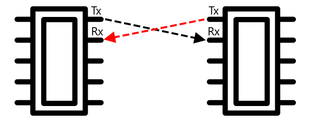

<!--
CO_OP_TRANSLATOR_METADATA:
{
  "original_hash": "4fb20273d299dc8d07a8f06c9cd0cdd9",
  "translation_date": "2025-08-24T22:35:54+00:00",
  "source_file": "2-farm/lessons/2-detect-soil-moisture/README.md",
  "language_code": "ko"
}
-->
C는 *아이 스퀘어드 씨*로 발음되며, 다중 컨트롤러 및 다중 주변 장치 프로토콜로, 연결된 모든 장치가 컨트롤러 또는 주변 장치로 작동하며 I²C 버스(데이터를 전송하는 통신 시스템)에서 통신할 수 있습니다. 데이터는 주소가 포함된 패킷 형태로 전송되며, 각 패킷에는 해당 데이터가 의도된 연결 장치의 주소가 포함됩니다.

> 💁 이 모델은 과거에 마스터/슬레이브로 불렸으나, 노예제와 관련된 용어라는 이유로 점차 사용되지 않고 있습니다. [오픈 소스 하드웨어 협회는 컨트롤러/주변 장치라는 용어를 채택](https://www.oshwa.org/a-resolution-to-redefine-spi-signal-names/)했지만, 여전히 이전 용어를 참조하는 경우를 볼 수 있습니다.

장치는 I²C 버스에 연결될 때 사용되는 주소를 가지며, 이는 일반적으로 장치에 하드코딩되어 있습니다. 예를 들어, Seeed의 Grove 센서는 동일한 주소를 가지며, 모든 조도 센서는 동일한 주소를 가지고, 모든 버튼은 조도 센서와는 다른 주소를 가집니다. 일부 장치는 점퍼 설정을 변경하거나 핀을 납땜하여 주소를 변경할 수 있는 방법을 제공합니다.

I²C는 2개의 주요 와이어와 2개의 전원 와이어로 구성된 버스를 가지고 있습니다:

| 와이어 | 이름 | 설명 |
| ---- | --------- | ----------- |
| SDA | Serial Data | 장치 간 데이터를 전송하는 와이어입니다. |
| SCL | Serial Clock | 컨트롤러가 설정한 속도로 클럭 신호를 보내는 와이어입니다. |
| VCC | Voltage common collector | 장치에 전원을 공급하는 와이어입니다. SDA와 SCL 와이어에 연결되어 풀업 저항을 통해 컨트롤러가 없을 때 신호를 끕니다. |
| GND | Ground | 전기 회로에 공통 접지를 제공합니다. |

데이터를 보내기 위해 한 장치는 데이터를 보낼 준비가 되었음을 나타내는 시작 조건을 발행합니다. 이 장치는 컨트롤러 역할을 하게 됩니다. 컨트롤러는 통신하려는 장치의 주소와 데이터를 읽거나 쓰려는지 여부를 함께 보냅니다. 데이터 전송이 완료되면 컨트롤러는 작업이 끝났음을 나타내는 종료 조건을 발행합니다. 이후 다른 장치가 컨트롤러 역할을 하여 데이터를 보내거나 받을 수 있습니다.

2C에는 속도 제한이 있으며, 3가지 모드에서 고정된 속도로 작동합니다. 가장 빠른 모드는 High Speed 모드로 최대 속도는 3.4Mbps(초당 메가비트)입니다. 하지만 이 속도를 지원하는 장치는 거의 없습니다. 예를 들어, Raspberry Pi는 400Kbps(초당 킬로비트)의 Fast 모드로 제한됩니다. Standard 모드는 100Kbps로 작동합니다.

> 💁 Raspberry Pi를 IoT 하드웨어로 사용하고 Grove Base Hat을 장착한 경우, I2C 센서와 통신할 수 있는 여러 I2C 소켓을 보드에서 확인할 수 있습니다. 아날로그 Grove 센서도 ADC를 사용하여 아날로그 값을 디지털 데이터로 변환해 I2C를 통해 전송합니다. 따라서 사용한 조도 센서는 아날로그 핀을 시뮬레이션하며, Raspberry Pi는 디지털 핀만 지원하므로 값이 I2C를 통해 전송됩니다.

### 범용 비동기 수신 송신기 (UART)

UART는 두 장치가 통신할 수 있도록 하는 물리적 회로를 포함합니다. 각 장치는 송신(Tx) 및 수신(Rx) 핀 2개를 가지며, 첫 번째 장치의 Tx 핀은 두 번째 장치의 Rx 핀에 연결되고, 두 번째 장치의 Tx 핀은 첫 번째 장치의 Rx 핀에 연결됩니다. 이를 통해 양방향 데이터 전송이 가능합니다.

* 장치 1은 Tx 핀에서 데이터를 송신하고, 장치 2는 Rx 핀에서 이를 수신합니다.
* 장치 1은 Rx 핀에서 데이터를 수신하며, 이는 장치 2가 Tx 핀에서 송신한 데이터입니다.

> 🎓 데이터는 한 번에 1비트씩 전송되며, 이를 *직렬* 통신이라고 합니다. 대부분의 운영 체제와 마이크로컨트롤러는 *직렬 포트*를 가지고 있으며, 이는 코드에서 사용할 수 있는 직렬 데이터를 송수신할 수 있는 연결입니다.

UART 장치는 [보드레이트](https://wikipedia.org/wiki/Symbol_rate)(Symbol rate라고도 함)를 가지며, 이는 초당 비트 단위로 데이터를 송수신하는 속도를 나타냅니다. 일반적인 보드레이트는 9,600으로, 이는 초당 9,600비트(0과 1)의 데이터가 전송된다는 의미입니다.

UART는 시작 비트와 정지 비트를 사용합니다. 즉, 데이터를 전송하기 전에 시작 비트를 보내고, 8비트(1바이트)의 데이터를 전송한 후 정지 비트를 보냅니다.

UART 속도는 하드웨어에 따라 다르지만, 가장 빠른 구현에서도 6.5Mbps(초당 메가비트)를 초과하지 않습니다.

GPIO 핀을 통해 UART를 사용할 수 있습니다. 한 핀을 Tx로, 다른 핀을 Rx로 설정한 후 이를 다른 장치에 연결할 수 있습니다.

> 💁 Raspberry Pi를 IoT 하드웨어로 사용하고 Grove Base Hat을 장착한 경우, UART 프로토콜을 사용하는 센서와 통신할 수 있는 UART 소켓을 보드에서 확인할 수 있습니다.

### 직렬 주변 장치 인터페이스 (SPI)

SPI는 플래시 메모리와 같은 저장 장치와 통신하기 위해 설계된 단거리 통신 프로토콜입니다. 이는 컨트롤러/주변 장치 모델을 기반으로 하며, 단일 컨트롤러(일반적으로 IoT 장치의 프로세서)가 여러 주변 장치와 상호작용합니다. 컨트롤러는 주변 장치를 선택하고 데이터를 보내거나 요청함으로써 모든 것을 제어합니다.

> 💁 I2C와 마찬가지로, 컨트롤러와 주변 장치라는 용어는 최근에 변경된 것이므로 이전 용어가 여전히 사용되는 경우를 볼 수 있습니다.

SPI 컨트롤러는 3개의 와이어와 주변 장치당 1개의 추가 와이어를 사용합니다. 주변 장치는 4개의 와이어를 사용합니다. 이 와이어들은 다음과 같습니다:

| 와이어 | 이름 | 설명 |
| ---- | --------- | ----------- |
| COPI | Controller Output, Peripheral Input | 컨트롤러에서 주변 장치로 데이터를 보내는 와이어입니다. |
| CIPO | Controller Input, Peripheral Output | 주변 장치에서 컨트롤러로 데이터를 보내는 와이어입니다. |
| SCLK | Serial Clock | 컨트롤러가 설정한 속도로 클럭 신호를 보내는 와이어입니다. |
| CS   | Chip Select | 컨트롤러는 주변 장치당 하나의 와이어를 가지며, 각 와이어는 해당 주변 장치의 CS 와이어에 연결됩니다. |

CS 와이어는 한 번에 하나의 주변 장치만 활성화하여 COPI 및 CIPO 와이어를 통해 통신합니다. 컨트롤러가 주변 장치를 변경해야 할 때는 현재 활성화된 주변 장치의 CS 와이어를 비활성화한 후, 다음으로 통신하려는 주변 장치의 CS 와이어를 활성화합니다.

SPI는 *전이중* 통신이 가능하며, 이는 컨트롤러가 COPI 및 CIPO 와이어를 사용하여 동일한 주변 장치에서 동시에 데이터를 송수신할 수 있음을 의미합니다. SPI는 SCLK 와이어의 클럭 신호를 사용하여 장치 간 동기화를 유지하므로, UART처럼 시작 및 정지 비트가 필요하지 않습니다.

SPI에는 정의된 속도 제한이 없으며, 구현에 따라 초당 여러 메가바이트의 데이터를 전송할 수 있습니다.

IoT 개발 키트는 종종 GPIO 핀을 통해 SPI를 지원합니다. 예를 들어, Raspberry Pi에서는 GPIO 핀 19, 21, 23, 24 및 26을 SPI로 사용할 수 있습니다.

### 무선

일부 센서는 Bluetooth(주로 Bluetooth Low Energy, BLE), LoRaWAN(저전력 장거리 네트워킹 프로토콜) 또는 WiFi와 같은 표준 무선 프로토콜을 통해 통신할 수 있습니다. 이를 통해 IoT 장치에 물리적으로 연결되지 않은 원격 센서를 사용할 수 있습니다.

상업용 토양 수분 센서가 그 예입니다. 이러한 센서는 들판의 토양 수분을 측정한 후 LoRaWAN을 통해 허브 장치로 데이터를 전송합니다. 허브 장치는 데이터를 처리하거나 인터넷으로 전송합니다. 이를 통해 센서가 데이터를 관리하는 IoT 장치에서 멀리 떨어져 있어도 전력 소비를 줄이고 대규모 WiFi 네트워크나 긴 케이블이 필요하지 않게 됩니다.

BLE는 피트니스 트래커와 같은 고급 센서에 인기가 많습니다. 이러한 센서는 여러 센서를 결합하여 센서 데이터를 BLE를 통해 스마트폰과 같은 IoT 장치로 전송합니다.

✅ 집, 학교 또는 몸에 Bluetooth 센서가 있나요? 여기에는 온도 센서, 점유 센서, 장치 추적기 및 피트니스 장치가 포함될 수 있습니다.

상업용 장치가 연결되는 인기 있는 방법 중 하나는 Zigbee입니다. Zigbee는 WiFi를 사용하여 장치 간 메쉬 네트워크를 형성합니다. 각 장치는 가능한 한 많은 인근 장치에 연결되어 거미줄처럼 많은 연결을 형성합니다. 한 장치가 인터넷으로 메시지를 보내고자 할 때, 가장 가까운 장치로 메시지를 보내고, 이 장치는 다시 인근 장치로 전달하며, 이러한 과정을 반복하여 코디네이터에 도달한 후 인터넷으로 전송됩니다.

> 🐝 Zigbee라는 이름은 꿀벌이 벌집으로 돌아온 후 춤을 추는 모습을 나타냅니다.

## 토양 수분 수준 측정

토양 수분 센서, IoT 장치, 화분 또는 근처의 흙을 사용하여 토양의 수분 수준을 측정할 수 있습니다.

### 작업 - 토양 수분 측정

IoT 장치를 사용하여 토양 수분을 측정하는 관련 가이드를 따라 작업하세요:

* [Arduino - Wio Terminal](wio-terminal-soil-moisture.md)
* [단일 보드 컴퓨터 - Raspberry Pi](pi-soil-moisture.md)
* [단일 보드 컴퓨터 - 가상 장치](virtual-device-soil-moisture.md)

## 센서 보정

센서는 저항 또는 정전 용량과 같은 전기적 특성을 측정합니다.

> 🎓 저항은 전류가 물질을 통과할 때 얼마나 많은 저항이 있는지를 나타내며, 단위는 옴(Ω)입니다. 전압이 물질에 가해지면, 이를 통과하는 전류의 양은 물질의 저항에 따라 달라집니다. [전기 저항에 대한 Wikipedia 페이지](https://wikipedia.org/wiki/Electrical_resistance_and_conductance)에서 더 읽어보세요.

> 🎓 정전 용량은 전기 에너지를 수집하고 저장하는 능력을 나타내며, 단위는 패럿(F)입니다. [정전 용량에 대한 Wikipedia 페이지](https://wikipedia.org/wiki/Capacitance)에서 더 읽어보세요.

이러한 측정값은 항상 유용하지는 않습니다. 예를 들어, 온도 센서가 22.5KΩ의 값을 제공한다고 상상해보세요! 대신 측정된 값을 유용한 단위로 변환하기 위해 보정이 필요합니다. 이는 측정된 값을 측정된 양과 일치시켜 새로운 측정값을 올바른 단위로 변환할 수 있도록 하는 과정입니다.

일부 센서는 사전 보정되어 제공됩니다. 예를 들어, 이전 수업에서 사용한 온도 센서는 이미 보정되어 °C 단위로 온도 측정값을 반환할 수 있었습니다. 공장에서 처음 제작된 센서는 알려진 온도 범위에 노출되고 저항이 측정됩니다. 그런 다음 이를 사용하여 Ω(저항의 단위)에서 °C로 변환할 수 있는 계산식을 만듭니다.

> 💁 온도로부터 저항을 계산하는 공식은 [Steinhart–Hart 방정식](https://wikipedia.org/wiki/Steinhart–Hart_equation)이라고 합니다.

### 토양 수분 센서 보정

토양 수분은 중량 수분 함량 또는 부피 수분 함량을 사용하여 측정됩니다.

* 중량 수분 함량은 단위 무게의 흙에 포함된 물의 무게를 측정하며, 건조 흙 1kg당 물의 킬로그램 수로 나타냅니다.
* 부피 수분 함량은 단위 부피의 흙에 포함된 물의 부피를 측정하며, 건조 흙 1세제곱미터당 물의 세제곱미터 수로 나타냅니다.

> 🇺🇸 미국에서는 단위의 일관성 때문에 킬로그램 대신 파운드, 세제곱미터 대신 세제곱피트를 사용할 수 있습니다.

토양 수분 센서는 전기 저항 또는 정전 용량을 측정합니다. 이는 토양 수분뿐만 아니라 토양 유형에 따라 달라지며, 토양의 구성 요소가 전기적 특성을 변경할 수 있기 때문입니다. 이상적으로는 센서를 보정해야 합니다. 즉, 센서에서 읽은 값을 보다 과학적인 방법으로 얻은 측정값과 비교하는 것입니다. 예를 들어, 특정 들판의 샘플을 연간 몇 번 채취하여 실험실에서 중량 수분 함량을 계산하고, 이 값을 사용하여 센서를 보정하여 센서 읽기값을 중량 수분 함량과 일치시킬 수 있습니다.

위 그래프는 센서를 보정하는 방법을 보여줍니다. 흙 샘플의 전압을 캡처한 후, 실험실에서 습윤 무게와 건조 무게를 비교하여 측정합니다(습윤 상태에서 무게를 측정한 후 오븐에서 건조시켜 건조 상태의 무게를 측정). 몇 가지 측정값을 얻은 후, 이를 그래프에 플롯하고 점에 맞는 선을 그립니다. 이 선을 사용하여 IoT 장치가 측정한 토양 수분 센서 읽기값을 실제 토양 수분 측정값으로 변환할 수 있습니다.

💁 저항식 토양 수분 센서의 경우, 토양 수분이 증가함에 따라 전압이 증가합니다. 정전식 토양 수분 센서의 경우, 토양 수분이 증가함에 따라 전압이 감소하므로, 이러한 그래프는 위로 기울지 않고 아래로 기울게 됩니다.

위 그래프는 토양 수분 센서의 전압 읽기값을 보여주며, 그래프의 선을 따라가면 실제 토양 수분을 계산할 수 있습니다.

이 접근법을 사용하면 농부는 들판에 대해 몇 가지 실험실 측정값만 얻으면 되고, IoT 장치를 사용하여 토양 수분을 측정할 수 있습니다. 이는 측정 시간을 크게 단축시킵니다.

---

## 🚀 도전 과제

저항식 및 정전식 토양 수분 센서는 여러 차이점이 있습니다. 이러한 차이점은 무엇이며, 농부가 사용하기에 가장 적합한 유형은 무엇인가요? 개발도상국과 선진국 간에 이 답변이 달라질까요?

## 강의 후 퀴즈

[강의 후 퀴즈](https://black-meadow-040d15503.1.azurestaticapps.net/quiz/12)

## 복습 및 자습

센서와 액추에이터에 사용되는 하드웨어 및 프로토콜에 대해 읽어보세요:

* [GPIO Wikipedia 페이지](https://wikipedia.org/wiki/General-purpose_input/output)
* [UART Wikipedia 페이지](https://wikipedia.org/wiki/Universal_asynchronous_receiver-transmitter)
* [SPI Wikipedia 페이지](https://wikipedia.org/wiki/Serial_Peripheral_Interface)
* [I2C Wikipedia 페이지](https://wikipedia.org/wiki/I²C)
* [Zigbee Wikipedia 페이지](https://wikipedia.org/wiki/Zigbee)

## 과제

[센서 보정하기](assignment.md)

**면책 조항**:  
이 문서는 AI 번역 서비스 [Co-op Translator](https://github.com/Azure/co-op-translator)를 사용하여 번역되었습니다. 정확성을 위해 최선을 다하고 있으나, 자동 번역에는 오류나 부정확성이 포함될 수 있습니다. 원본 문서를 해당 언어로 작성된 상태에서 권위 있는 자료로 간주해야 합니다. 중요한 정보의 경우, 전문적인 인간 번역을 권장합니다. 이 번역 사용으로 인해 발생하는 오해나 잘못된 해석에 대해 당사는 책임을 지지 않습니다.