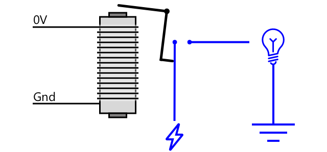

<!--
CO_OP_TRANSLATOR_METADATA:
{
  "original_hash": "f7bb24ba53fb627ddb38a8b24a05e594",
  "translation_date": "2025-08-24T22:13:50+00:00",
  "source_file": "2-farm/lessons/3-automated-plant-watering/README.md",
  "language_code": "ko"
}
-->
# 자동 식물 급수


> 스케치노트 제공: [Nitya Narasimhan](https://github.com/nitya). 이미지를 클릭하면 더 큰 버전을 볼 수 있습니다.

이 강의는 [Microsoft Reactor](https://developer.microsoft.com/reactor/?WT.mc_id=academic-17441-jabenn)의 [IoT for Beginners 프로젝트 2 - 디지털 농업 시리즈](https://youtube.com/playlist?list=PLmsFUfdnGr3yCutmcVg6eAUEfsGiFXgcx)에서 진행되었습니다.

[](https://youtu.be/g9FfZwv9R58)

## 강의 전 퀴즈

[강의 전 퀴즈](https://black-meadow-040d15503.1.azurestaticapps.net/quiz/13)

## 소개

지난 강의에서는 토양 수분을 모니터링하는 방법을 배웠습니다. 이번 강의에서는 토양 수분에 반응하는 자동 급수 시스템의 핵심 구성 요소를 구축하는 방법을 배웁니다. 또한 센서가 변화에 반응하는 데 시간이 걸리고, 액추에이터가 센서가 측정하는 속성을 변경하는 데 시간이 걸릴 수 있다는 점에서 타이밍에 대해 배우게 됩니다.

이번 강의에서 다룰 내용은 다음과 같습니다:

* [저전력 IoT 장치로 고전력 장치 제어](../../../../../2-farm/lessons/3-automated-plant-watering)
* [릴레이 제어](../../../../../2-farm/lessons/3-automated-plant-watering)
* [MQTT를 통해 식물 제어](../../../../../2-farm/lessons/3-automated-plant-watering)
* [센서와 액추에이터의 타이밍](../../../../../2-farm/lessons/3-automated-plant-watering)
* [식물 제어 서버에 타이밍 추가](../../../../../2-farm/lessons/3-automated-plant-watering)

## 저전력 IoT 장치로 고전력 장치 제어

IoT 장치는 낮은 전압을 사용합니다. 이는 센서나 LED와 같은 저전력 액추에이터에는 충분하지만, 관개용 물 펌프와 같은 더 큰 하드웨어를 제어하기에는 부족합니다. 심지어 실내 식물에 사용할 수 있는 작은 펌프조차도 IoT 개발 키트에는 너무 많은 전류를 소모하여 보드를 손상시킬 수 있습니다.

> 🎓 전류는 암페어(A)로 측정되며, 회로를 통해 이동하는 전기의 양을 나타냅니다. 전압은 전기를 밀어내는 힘을 제공하고, 전류는 밀려나는 전기의 양입니다. 전류에 대한 자세한 내용은 [위키백과의 전류 페이지](https://wikipedia.org/wiki/Electric_current)를 참조하세요.

이 문제를 해결하려면 펌프를 외부 전원 공급 장치에 연결하고, 액추에이터를 사용하여 펌프를 켜는 방식으로 제어해야 합니다. 이는 손가락으로 스위치를 켜는 것과 유사합니다. 손가락의 작은 에너지만으로 스위치를 켜고, 이를 통해 110v/240v의 전압으로 작동하는 전등에 전력을 공급할 수 있습니다.


> 🎓 [가정용 전기](https://wikipedia.org/wiki/Mains_electricity)는 세계 여러 지역에서 국가 인프라를 통해 가정과 사업장에 공급되는 전기를 의미합니다.

✅ IoT 장치는 일반적으로 3.3V 또는 5V를 제공하며, 전류는 1암페어(A) 미만입니다. 이에 비해 가정용 전기는 대부분 230V(북미는 120V, 일본은 100V)이며, 30A를 소모하는 장치에도 전력을 공급할 수 있습니다.

이 문제를 해결하기 위해 사용할 수 있는 여러 액추에이터가 있으며, 기존 스위치에 부착하여 손가락으로 스위치를 켜는 동작을 모방하는 기계적 장치도 있습니다. 그중 가장 널리 사용되는 것이 릴레이입니다.

### 릴레이

릴레이는 전기 신호를 기계적 움직임으로 변환하여 스위치를 켜거나 끄는 전자기 기계식 스위치입니다. 릴레이의 핵심은 전자석입니다.

> 🎓 [전자석](https://wikipedia.org/wiki/Electromagnet)은 전류가 코일을 통과할 때 생성되는 자석입니다. 전류가 흐르면 코일이 자성을 띠고, 전류가 끊기면 자성을 잃습니다.


릴레이에서는 제어 회로가 전자석에 전력을 공급합니다. 전자석이 켜지면 레버를 당겨 스위치를 움직이고, 접점을 닫아 출력 회로를 완성합니다.



제어 회로가 꺼지면 전자석도 꺼지고, 레버가 풀리면서 접점이 열려 출력 회로가 꺼집니다. 릴레이는 디지털 액추에이터로, 릴레이에 높은 신호를 보내면 켜지고, 낮은 신호를 보내면 꺼집니다.

출력 회로는 관개 시스템과 같은 추가 하드웨어에 전력을 공급하는 데 사용할 수 있습니다. IoT 장치는 릴레이를 켜서 출력 회로를 완성하고 관개 시스템에 전력을 공급하여 식물에 물을 줍니다. 그런 다음 릴레이를 꺼서 관개 시스템의 전원을 차단하고 물을 끕니다.


위 영상에서는 릴레이가 켜지는 모습을 보여줍니다. 릴레이에 있는 LED가 켜져 릴레이가 작동 중임을 나타내며(일부 릴레이 보드에는 릴레이의 상태를 나타내는 LED가 있음), 펌프에 전력이 공급되어 물이 식물로 전달됩니다.

> 💁 릴레이는 하나의 출력 회로를 켜고 끄는 대신 두 개의 출력 회로 간에 전환하는 데도 사용할 수 있습니다. 레버가 움직이면서 스위치가 한 출력 회로에서 다른 출력 회로로 전환되며, 일반적으로 공통 전원 연결 또는 공통 접지 연결을 공유합니다.

✅ 조사해보기: 릴레이에는 여러 종류가 있으며, 제어 회로가 전력을 공급받을 때 릴레이를 켜거나 끄는 방식, 또는 여러 출력 회로를 지원하는 방식 등 차이가 있습니다. 이러한 다양한 릴레이 유형에 대해 조사해보세요.

레버가 움직일 때, 전자석과 접촉하는 소리가 잘 정의된 클릭 소리로 들릴 수 있습니다.

> 💁 릴레이는 연결이 이루어지면 실제로 릴레이의 전원을 차단하도록 배선할 수 있습니다. 이 경우 릴레이가 꺼지면서 다시 전원을 공급받아 켜지고, 이 과정이 반복됩니다. 이로 인해 릴레이가 매우 빠르게 클릭하며 윙윙거리는 소리를 냅니다. 이는 초기 전기 초인종에서 사용된 버저의 작동 방식이기도 합니다.

### 릴레이 전력

전자석은 레버를 당기고 활성화하는 데 많은 전력이 필요하지 않으며, IoT 개발 키트의 3.3V 또는 5V 출력으로 제어할 수 있습니다. 출력 회로는 릴레이에 따라 더 높은 전력을 전달할 수 있으며, 가정용 전압이나 산업용으로 더 높은 전력 수준도 처리할 수 있습니다. 이를 통해 IoT 개발 키트는 단일 식물을 위한 작은 펌프부터 상업용 농장을 위한 대규모 산업 시스템까지 다양한 관개 시스템을 제어할 수 있습니다.


위 이미지는 Grove 릴레이를 보여줍니다. 제어 회로는 IoT 장치에 연결되어 3.3V 또는 5V로 릴레이를 켜거나 끕니다. 출력 회로에는 두 개의 단자가 있으며, 어느 쪽이든 전원 또는 접지로 사용할 수 있습니다. 출력 회로는 최대 250V, 10A까지 처리할 수 있어 다양한 가정용 전력 장치에 적합합니다. 더 높은 전력을 처리할 수 있는 릴레이도 구할 수 있습니다.


위 이미지는 릴레이를 통해 펌프에 전력을 공급하는 모습을 보여줍니다. 빨간색 전선이 USB 전원 공급 장치의 +5V 단자에서 릴레이 출력 회로의 한 단자로 연결되고, 다른 빨간색 전선이 출력 회로의 다른 단자에서 펌프로 연결됩니다. 검은색 전선은 펌프를 USB 전원 공급 장치의 접지와 연결합니다. 릴레이가 켜지면 회로가 완성되어 펌프에 5V가 공급되고, 펌프가 작동합니다.

## 릴레이 제어

IoT 개발 키트를 사용하여 릴레이를 제어할 수 있습니다.

### 작업 - 릴레이 제어

IoT 장치를 사용하여 릴레이를 제어하는 관련 가이드를 따라 작업하세요:

* [Arduino - Wio Terminal](wio-terminal-relay.md)
* [싱글보드 컴퓨터 - Raspberry Pi](pi-relay.md)
* [싱글보드 컴퓨터 - 가상 장치](virtual-device-relay.md)

## MQTT를 통해 식물 제어

현재 릴레이는 단일 토양 수분 측정값을 기반으로 IoT 장치에서 직접 제어됩니다. 상업용 관개 시스템에서는 제어 로직이 중앙 집중화되어 여러 센서의 데이터를 사용해 물을 주는 결정을 내리고, 모든 설정을 한 곳에서 변경할 수 있습니다. 이를 시뮬레이션하기 위해 MQTT를 통해 릴레이를 제어할 수 있습니다.

### 작업 - MQTT를 통해 릴레이 제어

1. `soil-moisture-sensor` 프로젝트에 MQTT 라이브러리/파이썬 패키지와 코드를 추가하여 MQTT에 연결하세요. 클라이언트 ID는 본인의 ID를 접두사로 사용하여 `soilmoisturesensor_client`로 설정하세요.

    > ⚠️ [프로젝트 1, 강의 4의 MQTT 연결 지침](../../../1-getting-started/lessons/4-connect-internet/README.md#connect-your-iot-device-to-mqtt)을 참고할 수 있습니다.

1. 토양 수분 설정값과 함께 원격 측정 데이터를 전송하는 장치 코드를 추가하세요. 원격 측정 메시지에서 속성 이름은 `soil_moisture`로 설정하세요.

    > ⚠️ [프로젝트 1, 강의 4의 원격 측정 데이터 전송 지침](../../../1-getting-started/lessons/4-connect-internet/README.md#send-telemetry-from-your-iot-device)을 참고할 수 있습니다.

1. `soil-moisture-sensor-server`라는 폴더에 원격 측정 데이터를 구독하고 릴레이를 제어하는 명령을 전송하는 로컬 서버 코드를 작성하세요. 명령 메시지의 속성 이름은 `relay_on`으로 설정하고, 클라이언트 ID는 본인의 ID를 접두사로 사용하여 `soilmoisturesensor_server`로 설정하세요. 이 코드는 이후 강의에서 확장할 예정이므로 프로젝트 1, 강의 4에서 작성한 서버 코드와 동일한 구조를 유지하세요.

    > ⚠️ [MQTT로 원격 측정 데이터 전송](../../../1-getting-started/lessons/4-connect-internet/README.md#write-the-server-code) 및 [MQTT로 명령 전송](../../../1-getting-started/lessons/4-connect-internet/README.md#send-commands-to-the-mqtt-broker)에 대한 지침을 참고할 수 있습니다.

1. 수신된 명령에서 `relay_on` 속성을 사용하여 릴레이를 제어하는 장치 코드를 추가하세요. `soil_moisture` 값이 450보다 크면 `relay_on`에 true를 전송하고, 그렇지 않으면 false를 전송하세요. 이는 이전에 IoT 장치에 추가한 로직과 동일합니다.

    > ⚠️ [MQTT에서 명령에 응답하는 방법](../../../1-getting-started/lessons/4-connect-internet/README.md#handle-commands-on-the-iot-device)에 대한 지침을 참고할 수 있습니다.

> 💁 이 코드는 [code-mqtt](../../../../../2-farm/lessons/3-automated-plant-watering/code-mqtt) 폴더에서 확인할 수 있습니다.

장치와 로컬 서버에서 코드를 실행하고, 가상 센서에서 전송하는 값을 변경하거나 토양에 물을 추가하거나 센서를 토양에서 제거하여 토양 수분 수준을 변경하며 테스트하세요.

## 센서와 액추에이터의 타이밍

3강에서 야간 조명을 제작했을 때, 조도 센서가 낮은 조도 수준을 감지하자마자 LED가 켜졌습니다. 조도 센서는 즉각적으로 변화에 반응했고, 장치는 빠르게 응답할 수 있었습니다. 이는 `loop` 함수나 `while True:` 루프의 지연 시간에만 제한되었습니다. 하지만 IoT 개발자로서 항상 이렇게 빠른 피드백 루프를 기대할 수는 없습니다.

### 토양 수분의 타이밍

물리적 센서를 사용하여 지난 강의에서 토양 수분을 측정했다면, 식물에 물을 준 후 토양 수분 값이 떨어지는 데 몇 초가 걸리는 것을 발견했을 것입니다. 이는 센서가 느리기 때문이 아니라, 물이 토양에 스며드는 데 시간이 걸리기 때문입니다.


위 다이어그램에서 토양 수분 측정값은 658을 나타냅니다. 식물에 물을 주었지만, 물이 센서에 도달하지 않았기 때문에 이 값은 즉시 변하지 않습니다. 물을 주는 작업이 끝난 후에야 물이 센서에 도달하고, 새로운 수분 수준을 반영하여 값이 떨어집니다.

만약 토양 수분 수준을 기준으로 릴레이를 통해 관개 시스템을 제어하는 코드를 작성한다면, 이 지연 시간을 고려하여 IoT 장치에 더 스마트한 타이밍을 구축해야 합니다.

✅ 잠시 시간을 내어 이를 어떻게 구현할지 생각해 보세요.

### 센서와 액추에이터의 타이밍 제어

농장을 위한 관개 시스템을 구축하라는 과제를 받았다고 상상해 보세요. 토양 유형에 따라, 재배되는 식물에 이상적인 토양 수분 수준은 아날로그 전압 값으로 400-450에 해당한다고 합니다.

야간 조명과 같은 방식으로 장치를 프로그래밍할 수 있습니다. 즉, 센서가 450 이상의 값을 읽는 동안 릴레이를 켜서 펌프를 작동시키는 것입니다. 문제는 펌프에서 나온 물이 토양을 통해 센서에 도달하는 데 시간이 걸린다는 점입니다. 센서는 450 수준을 감지하면 물을 멈추지만, 펌프에서 나온 물이 계속 토양에 스며들면서 수분 수준은 계속 떨어질 것입니다. 그 결과 물이 낭비되고 뿌리가 손상될 위험이 있습니다.

✅ 기억하세요 - 너무 많은 물은 너무 적은 물만큼이나 식물에 해로울 수 있으며, 귀중한 자원을 낭비하게 됩니다.

더 나은 해결책은 액추에이터가 켜진 후 센서가 읽는 속성이 변하는 데 지연이 있다는 점을 이해하는 것입니다. 이는 센서가 값을 다시 측정하기 전에 잠시 기다려야 할 뿐만 아니라, 다음 센서 측정이 이루어지기 전에 액추에이터가 잠시 꺼져 있어야 한다는 것을 의미합니다.

릴레이는 매번 얼마나 오래 켜져 있어야 할까요? 신중하게 접근하여 릴레이를 짧은 시간 동안만 켜고, 물이 스며들기를 기다린 후 수분 수준을 다시 확인하는 것이 좋습니다. 결국, 물을 더 추가하기 위해 펌프를 다시 켤 수는 있지만, 이미 토양에 스며든 물을 제거할 수는 없습니다.

> 💁 이러한 타이밍 제어는 구축 중인 IoT 장치, 측정 중인 속성, 사용 중인 센서 및 액추에이터에 따라 매우 구체적입니다.


예를 들어, 저는 토양 수분 센서와 릴레이로 제어되는 펌프가 있는 딸기 식물을 가지고 있습니다. 물을 추가하면 토양 수분 측정값이 안정화되는 데 약 20초가 걸린다는 것을 관찰했습니다. 이는 릴레이를 끄고 수분 수준을 확인하기 전에 20초를 기다려야 한다는 것을 의미합니다. 저는 물이 너무 많은 것보다는 부족한 것이 낫다고 생각합니다. 펌프를 다시 켤 수는 있지만, 식물에서 물을 제거할 수는 없기 때문입니다.


따라서 가장 좋은 과정은 다음과 같은 물 주기일 것입니다:

* 펌프를 5초 동안 켭니다.
* 20초 동안 기다립니다.
* 토양 수분을 확인합니다.
* 필요한 수준보다 여전히 높다면 위 단계를 반복합니다.

펌프를 5초 동안 켜는 것이 너무 길 수도 있습니다. 특히 수분 수준이 필요한 수준보다 약간 높은 경우에는 그렇습니다. 가장 좋은 방법은 시도해 보고, 센서 데이터를 통해 조정하며, 지속적인 피드백 루프를 유지하는 것입니다. 이는 고정된 5초 대신, 필요한 토양 수분 수준보다 100만큼 높을 때마다 펌프를 1초 동안 켜는 것과 같은 더 세분화된 타이밍으로 이어질 수 있습니다.

✅ 연구해 보세요: 다른 타이밍 고려 사항이 있을까요? 토양 수분이 너무 낮을 때 언제든지 물을 줄 수 있나요, 아니면 식물에 물을 주기에 좋은 시간과 나쁜 시간이 있나요?

> 💁 야외 재배를 위한 자동 관개 시스템을 제어할 때 날씨 예보도 고려할 수 있습니다. 비가 예상된다면, 비가 끝난 후까지 물 주기를 보류할 수 있습니다. 그 시점에서 토양이 충분히 촉촉해져 물을 줄 필요가 없을 수도 있습니다. 이는 비가 오기 직전에 물을 주는 것보다 훨씬 효율적입니다.

## 식물 제어 서버에 타이밍 추가

서버 코드를 수정하여 물 주기 타이밍을 제어하고, 토양 수분 수준이 변하기를 기다릴 수 있습니다. 릴레이 타이밍을 제어하는 서버 로직은 다음과 같습니다:

1. 원격 측정 메시지 수신
1. 토양 수분 수준 확인
1. 적절하다면 아무것도 하지 않습니다. 읽은 값이 너무 높다면(즉, 토양 수분이 너무 낮다면):
    1. 릴레이를 켜라는 명령을 보냅니다.
    1. 5초 동안 기다립니다.
    1. 릴레이를 끄라는 명령을 보냅니다.
    1. 토양 수분 수준이 안정화되기를 20초 동안 기다립니다.

물 주기, 즉 원격 측정 메시지를 수신한 시점부터 토양 수분 수준을 다시 처리할 준비가 되는 시점까지의 과정은 약 25초가 걸립니다. 우리는 10초마다 토양 수분 수준을 전송하고 있으므로, 서버가 토양 수분 수준이 안정화되기를 기다리는 동안 메시지가 수신되어 또 다른 물 주기가 시작될 수 있는 겹침이 발생할 수 있습니다.

이를 해결하기 위한 두 가지 옵션이 있습니다:

* IoT 장치 코드를 변경하여 1분마다 원격 측정을 전송하도록 합니다. 이렇게 하면 물 주기가 완료된 후에 다음 메시지가 전송됩니다.
* 물 주기 동안 원격 측정을 구독 취소합니다.

첫 번째 옵션은 대규모 농장에서는 항상 좋은 해결책이 아닙니다. 예를 들어, 농부는 물을 주는 동안 토양 수분 수준을 캡처하여 나중에 분석하고, 농장의 다른 지역에서 물 흐름을 파악하여 더 목표 지향적인 물 주기를 계획하고 싶을 수 있습니다. 두 번째 옵션이 더 나은데, 코드는 사용할 수 없는 원격 측정을 무시할 뿐이며, 원격 측정은 여전히 다른 서비스에서 구독할 수 있도록 남아 있습니다.

> 💁 IoT 데이터는 단일 장치에서 단일 서비스로만 전송되지 않습니다. 대신 여러 장치가 데이터를 브로커로 전송할 수 있으며, 여러 서비스가 브로커에서 데이터를 수신할 수 있습니다. 예를 들어, 한 서비스는 토양 수분 데이터를 수신하여 나중에 분석하기 위해 데이터베이스에 저장할 수 있습니다. 또 다른 서비스는 동일한 원격 측정을 수신하여 관개 시스템을 제어할 수 있습니다.

### 과제 - 식물 제어 서버에 타이밍 추가

서버 코드를 업데이트하여 릴레이를 5초 동안 실행한 후 20초 동안 대기하도록 만드세요.

1. `soil-moisture-sensor-server` 폴더를 VS Code에서 엽니다. 가상 환경이 활성화되어 있는지 확인하세요.

1. `app.py` 파일을 엽니다.

1. 기존 import 아래에 다음 코드를 추가하세요:

    ```python
    import threading
    ```

    이 코드는 Python 라이브러리에서 `threading`을 가져옵니다. `threading`은 대기 중에도 다른 코드를 실행할 수 있도록 합니다.

1. 서버 코드에서 원격 측정 메시지를 처리하는 `handle_telemetry` 함수 이전에 다음 코드를 추가하세요:

    ```python
    water_time = 5
    wait_time = 20
    ```

    이는 릴레이를 실행할 시간(`water_time`)과 토양 수분을 확인하기 위해 기다릴 시간(`wait_time`)을 정의합니다.

1. 이 코드 아래에 다음을 추가하세요:

    ```python
    def send_relay_command(client, state):
        command = { 'relay_on' : state }
        print("Sending message:", command)
        client.publish(server_command_topic, json.dumps(command))
    ```

    이 코드는 MQTT를 통해 릴레이를 제어하는 명령을 보내는 `send_relay_command`라는 함수를 정의합니다. 원격 측정은 딕셔너리로 생성된 후 JSON 문자열로 변환됩니다. `state`에 전달된 값은 릴레이를 켜거나 끌지 결정합니다.

1. `send_relay_code` 함수 이후에 다음 코드를 추가하세요:

    ```python
    def control_relay(client):
        print("Unsubscribing from telemetry")
        mqtt_client.unsubscribe(client_telemetry_topic)
    
        send_relay_command(client, True)
        time.sleep(water_time)
        send_relay_command(client, False)
    
        time.sleep(wait_time)
    
        print("Subscribing to telemetry")
        mqtt_client.subscribe(client_telemetry_topic)
    ```

    이는 필요한 타이밍에 따라 릴레이를 제어하는 함수를 정의합니다. 이 함수는 원격 측정 구독을 취소하여 물 주기 동안 토양 수분 메시지가 처리되지 않도록 합니다. 그런 다음 릴레이를 켜라는 명령을 보냅니다. `water_time` 동안 대기한 후 릴레이를 끄라는 명령을 보냅니다. 마지막으로 `wait_time` 동안 토양 수분 수준이 안정화되기를 기다립니다. 그런 다음 원격 측정을 다시 구독합니다.

1. `handle_telemetry` 함수를 다음으로 변경하세요:

    ```python
    def handle_telemetry(client, userdata, message):
        payload = json.loads(message.payload.decode())
        print("Message received:", payload)
    
        if payload['soil_moisture'] > 450:
            threading.Thread(target=control_relay, args=(client,)).start()
    ```

    이 코드는 토양 수분 수준을 확인합니다. 값이 450보다 크면 토양에 물이 필요하므로 `control_relay` 함수를 호출합니다. 이 함수는 별도의 스레드에서 실행되어 백그라운드에서 실행됩니다.

1. IoT 장치가 실행 중인지 확인한 후 이 코드를 실행하세요. 토양 수분 수준을 변경하고 릴레이에서 어떤 일이 발생하는지 관찰하세요. 릴레이는 5초 동안 켜지고 최소 20초 동안 꺼져 있어야 하며, 토양 수분 수준이 충분하지 않을 때만 다시 켜져야 합니다.

    ```output
    (.venv) ➜  soil-moisture-sensor-server ✗ python app.py
    Message received: {'soil_moisture': 457}
    Unsubscribing from telemetry
    Sending message: {'relay_on': True}
    Sending message: {'relay_on': False}
    Subscribing to telemetry
    Message received: {'soil_moisture': 302}
    ```

    시뮬레이션된 관개 시스템에서 이를 테스트하는 좋은 방법은 마른 토양을 사용한 후 릴레이가 켜져 있는 동안 수동으로 물을 붓고, 릴레이가 꺼지면 물 붓기를 멈추는 것입니다.

> 💁 이 코드는 [code-timing](../../../../../2-farm/lessons/3-automated-plant-watering/code-timing) 폴더에서 찾을 수 있습니다.

> 💁 실제 관개 시스템을 구축하기 위해 펌프를 사용하려면 [6V 물 펌프](https://www.seeedstudio.com/6V-Mini-Water-Pump-p-1945.html)와 [USB 단자 전원 공급 장치](https://www.adafruit.com/product/3628)를 사용할 수 있습니다. 펌프의 전원은 릴레이를 통해 연결되어야 합니다.

---

## 🚀 도전 과제

센서가 액추에이터의 결과를 감지하는 데 시간이 걸리는 유사한 문제가 있는 다른 IoT 또는 전기 장치를 생각해 보세요. 집이나 학교에 몇 가지가 있을 수 있습니다.

* 어떤 속성을 측정하나요?
* 액추에이터를 사용한 후 속성이 변하는 데 얼마나 걸리나요?
* 속성이 필요한 값을 초과해도 괜찮나요?
* 필요한 경우 속성을 다시 필요한 값으로 어떻게 되돌릴 수 있나요?

## 강의 후 퀴즈

[강의 후 퀴즈](https://black-meadow-040d15503.1.azurestaticapps.net/quiz/14)

## 복습 및 자기 학습

* [릴레이 위키백과 페이지](https://wikipedia.org/wiki/Relay)에서 릴레이와 전화 교환기에서의 역사적 사용에 대해 더 읽어보세요.

## 과제

[더 효율적인 물 주기 구축](assignment.md)

**면책 조항**:  
이 문서는 AI 번역 서비스 [Co-op Translator](https://github.com/Azure/co-op-translator)를 사용하여 번역되었습니다. 정확성을 위해 최선을 다하고 있지만, 자동 번역에는 오류나 부정확성이 포함될 수 있습니다. 원본 문서를 해당 언어로 작성된 상태에서 권위 있는 자료로 간주해야 합니다. 중요한 정보의 경우, 전문적인 인간 번역을 권장합니다. 이 번역 사용으로 인해 발생하는 오해나 잘못된 해석에 대해 당사는 책임을 지지 않습니다.