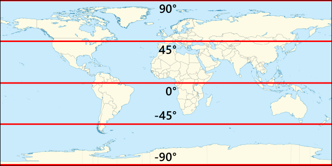
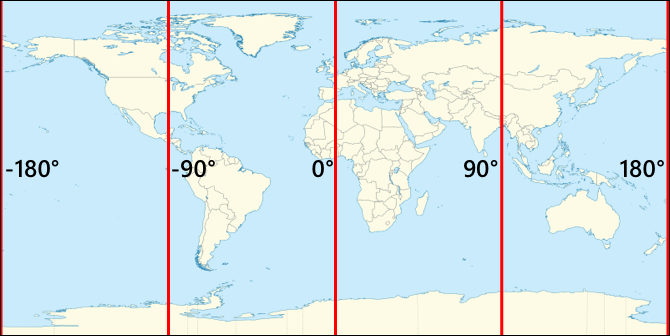

<!--
CO_OP_TRANSLATOR_METADATA:
{
  "original_hash": "52ed2bd997d08040f79a1a6ef2bac958",
  "translation_date": "2025-08-25T00:50:29+00:00",
  "source_file": "3-transport/lessons/1-location-tracking/README.md",
  "language_code": "ko"
}
-->
# 위치 추적

> 스케치노트: [Nitya Narasimhan](https://github.com/nitya). 이미지를 클릭하면 더 큰 버전을 볼 수 있습니다.

## 강의 전 퀴즈

[강의 전 퀴즈](https://black-meadow-040d15503.1.azurestaticapps.net/quiz/21)

## 소개

농부로부터 소비자에게 음식을 전달하는 주요 과정은 농산물을 상자에 담아 트럭, 선박, 비행기 또는 기타 상업용 운송 수단에 실어 고객에게 직접 전달하거나 중앙 허브나 창고로 운송하는 것입니다. 농장에서 소비자까지의 전체 프로세스는 *공급망*이라고 불리는 과정의 일부입니다. 아래의 애리조나 주립대학 W. P. 캐리 경영대학원의 비디오는 공급망의 개념과 이를 관리하는 방법에 대해 더 자세히 설명합니다.

> 🎥 위 이미지를 클릭하면 비디오를 볼 수 있습니다.

IoT 기기를 추가하면 공급망을 크게 개선할 수 있으며, 이를 통해 물품의 위치를 관리하고, 운송 및 물품 처리를 더 잘 계획하며, 문제에 더 빠르게 대응할 수 있습니다.

트럭과 같은 차량의 무리를 관리할 때, 특정 시간에 각 차량이 어디에 있는지 아는 것이 유용합니다. 차량에는 GPS 센서를 장착하여 위치를 IoT 시스템에 전송할 수 있으며, 이를 통해 소유자는 차량의 위치를 정확히 파악하고, 이동 경로를 확인하며, 목적지에 도착할 시간을 알 수 있습니다. 대부분의 차량은 WiFi 범위를 벗어나 작동하므로 이러한 데이터를 전송하기 위해 셀룰러 네트워크를 사용합니다. 때로는 GPS 센서가 전자 운행 기록장과 같은 더 복잡한 IoT 기기에 내장되어 있습니다. 이러한 기기는 트럭이 운행 중인 시간을 추적하여 운전자가 근로 시간에 대한 지역 법규를 준수하고 있는지 확인합니다.

이 강의에서는 글로벌 포지셔닝 시스템(GPS) 센서를 사용하여 차량의 위치를 추적하는 방법을 배웁니다.

이 강의에서 다룰 내용은 다음과 같습니다:

* [연결된 차량](../../../../../3-transport/lessons/1-location-tracking)
* [지리적 좌표](../../../../../3-transport/lessons/1-location-tracking)
* [글로벌 포지셔닝 시스템(GPS)](../../../../../3-transport/lessons/1-location-tracking)
* [GPS 센서 데이터 읽기](../../../../../3-transport/lessons/1-location-tracking)
* [NMEA GPS 데이터](../../../../../3-transport/lessons/1-location-tracking)
* [GPS 센서 데이터 디코딩](../../../../../3-transport/lessons/1-location-tracking)

## 연결된 차량

IoT는 *연결된 차량*의 무리를 만들어 물품 운송 방식을 혁신하고 있습니다. 이러한 차량은 위치 및 기타 센서 데이터를 보고하는 중앙 IT 시스템에 연결됩니다. 연결된 차량의 무리를 보유하면 다양한 이점이 있습니다:

* 위치 추적 - 차량의 위치를 언제든지 정확히 파악할 수 있어 다음과 같은 작업이 가능합니다:
  * 차량이 목적지에 도착하기 직전에 알림을 받아 하역 작업을 준비
  * 도난당한 차량의 위치 파악
  * 위치 및 경로 데이터를 교통 문제와 결합하여 여정 중간에 차량 경로 변경
  * 세금 준수. 일부 국가에서는 공공 도로에서 주행한 마일리지에 따라 차량에 세금을 부과합니다(예: [뉴질랜드의 RUC](https://www.nzta.govt.nz/vehicles/licensing-rego/road-user-charges/)). 따라서 차량이 공공 도로와 사유 도로 중 어디에 있는지 알면 세금을 계산하기가 더 쉬워집니다.
  * 고장 시 정비 팀을 보낼 위치 파악

* 운전자 텔레메트리 - 운전자가 속도 제한을 준수하고, 적절한 속도로 코너를 돌며, 효율적으로 브레이크를 밟고, 안전하게 운전하는지 확인. 연결된 차량에는 사고를 기록할 수 있는 카메라가 장착될 수도 있습니다. 이는 보험과 연계되어 우수한 운전자에게 할인 혜택을 제공합니다.

* 운전자 근무 시간 준수 - 엔진을 켜고 끄는 시간을 기준으로 운전자가 법적으로 허용된 시간만 운전하는지 확인.

이러한 이점은 결합될 수 있습니다. 예를 들어, 운전자 근무 시간 준수와 위치 추적을 결합하여 운전자가 허용된 운전 시간 내에 목적지에 도달할 수 없는 경우 경로를 변경할 수 있습니다. 또한 온도 제어 트럭의 온도 데이터와 같은 차량별 텔레메트리와 결합하여 현재 경로로 인해 물품이 적정 온도로 유지되지 않을 경우 차량 경로를 변경할 수 있습니다.

> 🎓 물류는 농장에서 슈퍼마켓까지 한 곳에서 다른 곳으로 물품을 운송하는 과정입니다. 예를 들어, 농부가 토마토 상자를 포장하여 트럭에 실어 중앙 창고로 운송한 후, 다양한 농산물이 혼합된 두 번째 트럭에 실어 슈퍼마켓으로 운송합니다.

차량 추적의 핵심 구성 요소는 GPS입니다. GPS는 지구상의 어느 곳에서든 위치를 정확히 파악할 수 있는 센서입니다. 이 강의에서는 GPS 센서를 사용하는 방법을 배우며, 먼저 지구상의 위치를 정의하는 방법에 대해 알아봅니다.

## 지리적 좌표

지리적 좌표는 컴퓨터 화면의 픽셀을 그리거나 십자수에서 바늘 위치를 지정하는 것처럼 지구 표면의 점을 정의하는 데 사용됩니다. 단일 점에는 좌표 쌍이 있습니다. 예를 들어, 미국 워싱턴주 레드먼드에 있는 마이크로소프트 캠퍼스는 47.6423109, -122.1390293에 위치해 있습니다.

### 위도와 경도

지구는 구형, 즉 3차원 원입니다. 따라서 점은 원의 기하학과 동일하게 360도로 나누어 정의됩니다. 위도는 북쪽에서 남쪽으로의 각도를 측정하고, 경도는 동쪽에서 서쪽으로의 각도를 측정합니다.

> 💁 원이 360도로 나뉜 원래 이유는 아무도 정확히 알지 못합니다. [위키백과의 각도 페이지](https://wikipedia.org/wiki/Degree_(angle))에서 몇 가지 가능한 이유를 확인할 수 있습니다.

위도는 적도를 기준으로 지구를 나누는 선으로 측정되며, 북반구와 남반구를 각각 90°로 나눕니다. 적도는 0°, 북극은 90°(90° 북위), 남극은 -90°(90° 남위)입니다.

경도는 동쪽과 서쪽으로 측정된 각도입니다. 경도의 0° 기준점은 *본초 자오선*이라고 하며, 1884년에 [영국 그리니치 왕립 천문대](https://wikipedia.org/wiki/Royal_Observatory,_Greenwich)를 통과하는 북극에서 남극까지의 선으로 정의되었습니다.

> 🎓 자오선은 북극에서 남극까지의 반원을 형성하는 가상의 직선입니다.

어떤 점의 경도를 측정하려면 본초 자오선에서 해당 점을 통과하는 자오선까지 적도를 따라 측정된 각도를 측정합니다. 경도는 -180°(180° 서경)에서 0°(본초 자오선), 180°(180° 동경)까지 이어집니다. 180°와 -180°는 동일한 지점, 즉 본초 자오선의 반대편에 있는 자오선(대척 자오선)을 나타냅니다.

> 💁 대척 자오선은 국제 날짜 변경선과 혼동하지 마세요. 국제 날짜 변경선은 대략 같은 위치에 있지만 직선이 아니며, 지리적-정치적 경계를 고려해 변형됩니다.

✅ 조사해 보세요: 현재 위치의 위도와 경도를 찾아보세요.

### 도, 분, 초와 소수점 좌표

전통적으로 위도와 경도의 각도 측정은 고대 바빌로니아인들이 시간과 거리를 처음 측정하고 기록할 때 사용한 60진법(섹스지십진법)으로 이루어졌습니다. 여러분은 아마도 매일 60진법을 사용하고 있을 것입니다. 시간은 60분으로, 분은 60초로 나누는 방식이 바로 그것입니다.

위도와 경도는 도, 분, 초로 측정되며, 1분은 1도의 1/60, 1초는 1분의 1/60입니다.

예를 들어, 적도에서:

* 위도 1°는 **111.3킬로미터**
* 위도 1분은 111.3/60 = **1.855킬로미터**
* 위도 1초는 1.855/60 = **0.031킬로미터**

분의 기호는 작은 따옴표('), 초의 기호는 큰 따옴표(")입니다. 예를 들어, 2도 17분 43초는 2°17'43"으로 표시됩니다. 초의 소수점은 소수로 표시되며, 예를 들어 0.5초는 0°0'0.5"입니다.

컴퓨터는 60진법으로 작동하지 않으므로 GPS 데이터에서 대부분의 컴퓨터 시스템은 이러한 좌표를 소수점 좌표로 제공합니다. 예를 들어, 2°17'43"는 2.295277로 변환됩니다. 이때 보통 도 기호는 생략됩니다.

좌표는 항상 `위도, 경도` 형식으로 제공됩니다. 따라서 앞서 언급한 마이크로소프트 캠퍼스의 좌표 47.6423109,-122.117198은 다음과 같습니다:

* 위도: 47.6423109 (적도에서 북쪽으로 47.6423109도)
* 경도: -122.1390293 (본초 자오선에서 서쪽으로 122.1390293도)

## 글로벌 포지셔닝 시스템(GPS)

GPS 시스템은 지구를 도는 여러 위성을 사용하여 위치를 파악합니다. 여러분은 아마도 GPS 시스템을 모르는 사이에 사용했을 것입니다. 예를 들어, 스마트폰의 지도 앱(Apple 지도나 Google 지도)에서 위치를 찾거나, 차량 호출 앱(Uber나 Lyft)에서 차량의 위치를 확인하거나, 자동차의 위성 내비게이션(내비)을 사용할 때 말입니다.

> 🎓 '위성 내비게이션'의 위성은 GPS 위성을 의미합니다!

GPS 시스템은 여러 위성이 현재 위치와 정확한 타임스탬프를 포함한 신호를 보내는 방식으로 작동합니다. 이러한 신호는 전파를 통해 전송되며 GPS 센서의 안테나에서 감지됩니다. GPS 센서는 이러한 신호를 감지하고, 현재 시간을 사용하여 신호가 위성에서 센서까지 도달하는 데 걸린 시간을 측정합니다. 전파의 속도는 일정하기 때문에 GPS 센서는 전송된 타임스탬프를 사용하여 센서가 위성에서 얼마나 떨어져 있는지 계산할 수 있습니다. 최소 3개의 위성에서 전송된 데이터와 위치를 결합하여 GPS 센서는 지구상의 위치를 정확히 파악할 수 있습니다.

> 💁 GPS 센서는 전파를 감지하기 위해 안테나가 필요합니다. 차량에 내장된 GPS의 안테나는 보통 전파를 잘 수신할 수 있도록 앞유리나 지붕에 위치합니다. 스마트폰이나 IoT 기기와 같은 별도의 GPS 시스템을 사용하는 경우, GPS 시스템이나 스마트폰에 내장된 안테나가 하늘을 잘 볼 수 있는 위치(예: 앞유리)에 있어야 합니다.

GPS 위성은 지구를 돌고 있으며, 센서 바로 위에 고정된 것이 아니기 때문에 위치 데이터에는 위도와 경도뿐만 아니라 해발 고도도 포함됩니다.

GPS는 한때 미국 군대에 의해 정확도가 약 5미터로 제한되었으나, 2000년에 이 제한이 제거되어 30센티미터의 정확도를 제공할 수 있게 되었습니다. 그러나 간섭으로 인해 항상 이 정확도를 얻을 수 있는 것은 아닙니다.

✅ 스마트폰이 있다면 지도 앱을 실행하여 자신의 위치가 얼마나 정확한지 확인해 보세요. 여러 위성을 감지하여 더 정확한 위치를 얻는 데 약간의 시간이 걸릴 수 있습니다.
💁 위성에는 매우 정확한 원자 시계가 탑재되어 있지만, 아인슈타인의 특수 및 일반 상대성 이론에 따라 속도가 증가하면 시간이 느려지는 현상 때문에 지구의 원자 시계와 비교했을 때 하루에 38마이크로초(0.0000038초)씩 오차가 발생합니다. 이는 위성이 지구의 자전보다 더 빠르게 이동하기 때문입니다. 이러한 시간 오차는 특수 및 일반 상대성 이론의 예측을 입증하는 데 사용되었으며, GPS 시스템 설계 시 반드시 조정되어야 합니다. 말 그대로 GPS 위성에서는 시간이 더 느리게 흐릅니다.
GPS 시스템은 미국, 러시아, 일본, 인도, EU, 중국을 포함한 여러 국가와 정치 연합에 의해 개발되고 배포되었습니다. 현대 GPS 센서는 이러한 시스템 대부분에 연결하여 더 빠르고 정확한 위치를 얻을 수 있습니다.

> 🎓 각 배포에 포함된 위성 그룹은 별자리(constellations)라고 불립니다.

## GPS 센서 데이터 읽기

대부분의 GPS 센서는 UART를 통해 GPS 데이터를 전송합니다.

> ⚠️ UART는 [프로젝트 2, 레슨 2](../../../2-farm/lessons/2-detect-soil-moisture/README.md#universal-asynchronous-receiver-transmitter-uart)에서 다루었습니다. 필요하면 해당 레슨을 다시 참조하세요.

IoT 장치에서 GPS 센서를 사용하여 GPS 데이터를 얻을 수 있습니다.

### 작업 - GPS 센서를 연결하고 GPS 데이터 읽기

IoT 장치를 사용하여 GPS 데이터를 읽는 관련 가이드를 따라 진행하세요:

* [Arduino - Wio Terminal](wio-terminal-gps-sensor.md)
* [싱글보드 컴퓨터 - Raspberry Pi](pi-gps-sensor.md)
* [싱글보드 컴퓨터 - 가상 장치](virtual-device-gps-sensor.md)

## NMEA GPS 데이터

코드를 실행했을 때 출력에서 난해한 텍스트를 본 적이 있을 것입니다. 이것은 실제로 표준 GPS 데이터이며, 모두 의미를 가지고 있습니다.

GPS 센서는 NMEA 메시지를 사용하여 데이터를 출력하며, NMEA 0183 표준을 따릅니다. NMEA는 [National Marine Electronics Association](https://www.nmea.org)의 약자로, 해양 전자 장치 간의 통신 표준을 설정하는 미국 기반의 무역 조직입니다.

> 💁 이 표준은 독점적이며 최소 2,000달러에 판매되지만, 공개 도메인에 충분한 정보가 있어 대부분의 표준이 역설계되어 오픈 소스 및 기타 비상업적 코드에서 사용할 수 있습니다.

이 메시지는 텍스트 기반입니다. 각 메시지는 `$` 문자로 시작하는 *문장(sentence)*으로 구성되며, 메시지의 출처를 나타내는 2개의 문자(예: 미국 GPS 시스템의 경우 GP, 러시아 GPS 시스템 GLONASS의 경우 GN)와 메시지 유형을 나타내는 3개의 문자가 뒤따릅니다. 메시지의 나머지 부분은 쉼표로 구분된 필드로 구성되며, 새 줄 문자로 끝납니다.

수신할 수 있는 메시지 유형은 다음과 같습니다:

| 유형 | 설명 |
| ---- | ----------- |
| GGA | GPS 고정 데이터로, GPS 센서의 위도, 경도, 고도와 이 고정을 계산하기 위해 관측 가능한 위성 수를 포함합니다. |
| ZDA | 현재 날짜와 시간, 로컬 시간대를 포함합니다. |
| GSV | 관측 가능한 위성의 세부 정보 - GPS 센서가 신호를 감지할 수 있는 위성으로 정의됩니다. |

> 💁 GPS 데이터에는 타임스탬프가 포함되어 있으므로 IoT 장치는 GPS 센서를 통해 필요한 경우 시간을 얻을 수 있으며, NTP 서버나 내부 실시간 시계에 의존할 필요가 없습니다.

GGA 메시지는 `(dd)dmm.mmmm` 형식을 사용하여 현재 위치를 포함하며, 방향을 나타내는 단일 문자를 포함합니다. 형식의 `d`는 도(degree), `m`은 분(minute)이며, 초는 분의 소수로 표시됩니다. 예를 들어, 2°17'43"는 217.716666667 - 2도, 17.716666667분입니다.

방향 문자는 위도의 경우 북쪽 또는 남쪽을 나타내는 `N` 또는 `S`, 경도의 경우 동쪽 또는 서쪽을 나타내는 `E` 또는 `W`일 수 있습니다. 예를 들어, 위도 2°17'43"는 방향 문자가 `N`이고, -2°17'43"는 방향 문자가 `S`입니다.

예를 들어 - NMEA 문장 `$GNGGA,020604.001,4738.538654,N,12208.341758,W,1,3,,164.7,M,-17.1,M,,*67`

* 위도 부분은 `4738.538654,N`이며, 이는 소수점 좌표로 47.6423109로 변환됩니다. `4738.538654`는 47.6423109이고, 방향은 `N`(북쪽)이므로 양의 위도입니다.

* 경도 부분은 `12208.341758,W`이며, 이는 소수점 좌표로 -122.1390293로 변환됩니다. `12208.341758`는 122.1390293°이고, 방향은 `W`(서쪽)이므로 음의 경도입니다.

## GPS 센서 데이터 디코딩

원시 NMEA 데이터를 사용하는 대신, 더 유용한 형식으로 디코딩하는 것이 좋습니다. 원시 NMEA 메시지에서 유용한 데이터를 추출하는 데 도움을 줄 수 있는 여러 오픈 소스 라이브러리가 있습니다.

### 작업 - GPS 센서 데이터 디코딩

IoT 장치를 사용하여 GPS 센서 데이터를 디코딩하는 관련 가이드를 따라 진행하세요:

* [Arduino - Wio Terminal](wio-terminal-gps-decode.md)
* [싱글보드 컴퓨터 - Raspberry Pi/가상 IoT 장치](single-board-computer-gps-decode.md)

---

## 🚀 챌린지

자신만의 NMEA 디코더를 작성해보세요! NMEA 문장을 디코딩하기 위해 서드파티 라이브러리에 의존하지 않고, NMEA 문장에서 위도와 경도를 추출하는 디코더를 작성할 수 있나요?

## 강의 후 퀴즈

[강의 후 퀴즈](https://black-meadow-040d15503.1.azurestaticapps.net/quiz/22)

## 복습 및 자기 학습

* [위키피디아의 지리 좌표 시스템 페이지](https://wikipedia.org/wiki/Geographic_coordinate_system)에서 지리 좌표에 대해 더 읽어보세요.
* [위키피디아의 본초 자오선 페이지](https://wikipedia.org/wiki/Prime_meridian#Prime_meridian_on_other_planetary_bodies)에서 지구 외 다른 천체의 본초 자오선에 대해 읽어보세요.
* EU, 일본, 러시아, 인도, 미국 등 다양한 세계 정부와 정치 연합의 다양한 GPS 시스템을 조사해보세요.

## 과제

[다른 GPS 데이터 조사하기](assignment.md)

**면책 조항**:  
이 문서는 AI 번역 서비스 [Co-op Translator](https://github.com/Azure/co-op-translator)를 사용하여 번역되었습니다. 정확성을 위해 최선을 다하고 있으나, 자동 번역에는 오류나 부정확성이 포함될 수 있습니다. 원본 문서를 해당 언어로 작성된 상태에서 권위 있는 자료로 간주해야 합니다. 중요한 정보의 경우, 전문적인 인간 번역을 권장합니다. 이 번역 사용으로 인해 발생할 수 있는 오해나 잘못된 해석에 대해 당사는 책임을 지지 않습니다.