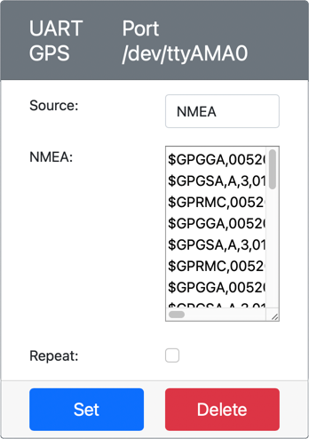

<!--
CO_OP_TRANSLATOR_METADATA:
{
  "original_hash": "64f18a8f8aaa1fef5e7320e0992d8b3a",
  "translation_date": "2025-08-25T00:46:45+00:00",
  "source_file": "3-transport/lessons/1-location-tracking/virtual-device-gps-sensor.md",
  "language_code": "ko"
}
-->
# GPS 데이터 읽기 - 가상 IoT 하드웨어

이 수업의 이 부분에서는 가상 IoT 장치에 GPS 센서를 추가하고 값을 읽는 방법을 배웁니다.

## 가상 하드웨어

가상 IoT 장치는 UART를 통해 시리얼 포트로 접근 가능한 시뮬레이션된 GPS 센서를 사용합니다.

물리적인 GPS 센서는 GPS 위성으로부터 라디오 신호를 수신하기 위한 안테나를 가지고 있으며, GPS 신호를 GPS 데이터로 변환합니다. 가상 버전은 위도와 경도를 설정하거나, 원시 NMEA 문장을 전송하거나, 여러 위치가 순차적으로 반환될 수 있는 GPX 파일을 업로드하는 방식으로 이를 시뮬레이션합니다.

> 🎓 NMEA 문장은 이 수업의 후반부에서 다룰 예정입니다.

### CounterFit에 센서 추가하기

가상 GPS 센서를 사용하려면 CounterFit 앱에 센서를 추가해야 합니다.

#### 작업 - CounterFit에 센서 추가하기

CounterFit 앱에 GPS 센서를 추가하세요.

1. `gps-sensor`라는 폴더에 단일 파일 `app.py`와 Python 가상 환경을 포함한 새로운 Python 앱을 컴퓨터에 생성하고, CounterFit pip 패키지를 추가하세요.

    > ⚠️ 필요하다면 [수업 1에서 CounterFit Python 프로젝트를 생성하고 설정하는 방법에 대한 지침을 참조하세요](../../../1-getting-started/lessons/1-introduction-to-iot/virtual-device.md).

1. UART 기반 센서와 시리얼 연결을 통해 통신할 수 있는 CounterFit shim을 설치하기 위해 추가적인 Pip 패키지를 설치하세요. 가상 환경이 활성화된 터미널에서 설치해야 합니다.

    ```sh
    pip install counterfit-shims-serial
    ```

1. CounterFit 웹 앱이 실행 중인지 확인하세요.

1. GPS 센서를 생성하세요:

    1. *Sensors* 창의 *Create sensor* 상자에서 *Sensor type* 드롭다운을 열고 *UART GPS*를 선택하세요.

    1. *Port*를 */dev/ttyAMA0*로 그대로 두세요.

    1. **Add** 버튼을 선택하여 포트 `/dev/ttyAMA0`에 GPS 센서를 생성하세요.

    

    GPS 센서가 생성되어 센서 목록에 나타납니다.

    

## GPS 센서 프로그래밍하기

이제 가상 IoT 장치가 가상 GPS 센서를 사용할 수 있도록 프로그래밍할 수 있습니다.

### 작업 - GPS 센서 프로그래밍하기

GPS 센서 앱을 프로그래밍하세요.

1. `gps-sensor` 앱이 VS Code에서 열려 있는지 확인하세요.

1. `app.py` 파일을 여세요.

1. CounterFit에 앱을 연결하기 위해 `app.py` 상단에 다음 코드를 추가하세요:

    ```python
    from counterfit_connection import CounterFitConnection
    CounterFitConnection.init('127.0.0.1', 5000)
    ```

1. 필요한 라이브러리, 특히 CounterFit 시리얼 포트를 위한 라이브러리를 가져오기 위해 아래 코드를 추가하세요:

    ```python
    import time
    import counterfit_shims_serial
    
    serial = counterfit_shims_serial.Serial('/dev/ttyAMA0')
    ```

    이 코드는 `counterfit_shims_serial` Pip 패키지에서 `serial` 모듈을 가져옵니다. 그런 다음 가상 GPS 센서가 UART 포트로 사용하는 `/dev/ttyAMA0` 시리얼 포트에 연결합니다.

1. 시리얼 포트에서 데이터를 읽고 콘솔에 값을 출력하기 위해 아래 코드를 추가하세요:

    ```python
    def print_gps_data(line):
        print(line.rstrip())
    
    while True:
        line = serial.readline().decode('utf-8')
    
        while len(line) > 0:
            print_gps_data(line)
            line = serial.readline().decode('utf-8')
    
        time.sleep(1)
    ```

    `print_gps_data`라는 함수가 정의되어 전달된 줄을 콘솔에 출력합니다.

    이후 코드가 무한 루프를 돌며 시리얼 포트에서 가능한 많은 텍스트 줄을 읽습니다. 각 줄에 대해 `print_gps_data` 함수를 호출합니다.

    모든 데이터를 읽은 후 루프는 1초 동안 대기한 뒤 다시 시도합니다.

1. 이 코드를 실행하세요. CounterFit 앱이 실행 중인 터미널과는 다른 터미널을 사용하여 실행해야 CounterFit 앱이 계속 실행됩니다.

1. CounterFit 앱에서 GPS 센서 값을 변경하세요. 다음 방법 중 하나를 사용할 수 있습니다:

    * **Source**를 `Lat/Lon`으로 설정하고 명시적인 위도, 경도 및 GPS 고정을 얻는 데 사용된 위성 수를 설정하세요. 이 값은 한 번만 전송되므로 **Repeat** 상자를 체크하여 데이터가 매초 반복되도록 설정하세요.

      

    * **Source**를 `NMEA`로 설정하고 텍스트 상자에 NMEA 문장을 추가하세요. 모든 값이 전송되며, 각 새로운 GGA(위치 고정) 문장이 읽히기 전에 1초의 지연이 있습니다.

      

      [nmeagen.org](https://www.nmeagen.org)와 같은 도구를 사용하여 지도에서 그리며 이러한 문장을 생성할 수 있습니다. 이 값은 한 번만 전송되므로 **Repeat** 상자를 체크하여 모든 값이 전송된 후 1초 후에 반복되도록 설정하세요.

    * **Source**를 GPX 파일로 설정하고 트랙 위치가 포함된 GPX 파일을 업로드하세요. [AllTrails](https://www.alltrails.com/)와 같은 인기 있는 지도 및 하이킹 사이트에서 GPX 파일을 다운로드할 수 있습니다. 이러한 파일은 트레일로서 여러 GPS 위치를 포함하며, GPS 센서는 1초 간격으로 각 새로운 위치를 반환합니다.

      

      이 값은 한 번만 전송되므로 **Repeat** 상자를 체크하여 모든 값이 전송된 후 1초 후에 반복되도록 설정하세요.

    GPS 설정을 구성한 후 **Set** 버튼을 선택하여 이러한 값을 센서에 적용하세요.

1. GPS 센서의 원시 출력이 다음과 같은 형태로 표시됩니다:

    ```output
    $GNGGA,020604.001,4738.538654,N,12208.341758,W,1,3,,164.7,M,-17.1,M,,*67
    $GNGGA,020604.001,4738.538654,N,12208.341758,W,1,3,,164.7,M,-17.1,M,,*67
    ```

> 💁 이 코드는 [code-gps/virtual-device](../../../../../3-transport/lessons/1-location-tracking/code-gps/virtual-device) 폴더에서 찾을 수 있습니다.

😀 GPS 센서 프로그램이 성공적으로 실행되었습니다!

**면책 조항**:  
이 문서는 AI 번역 서비스 [Co-op Translator](https://github.com/Azure/co-op-translator)를 사용하여 번역되었습니다. 정확성을 위해 최선을 다하고 있으나, 자동 번역에는 오류나 부정확성이 포함될 수 있습니다. 원본 문서를 해당 언어로 작성된 상태에서 권위 있는 자료로 간주해야 합니다. 중요한 정보의 경우, 전문적인 인간 번역을 권장합니다. 이 번역 사용으로 인해 발생하는 오해나 잘못된 해석에 대해 당사는 책임을 지지 않습니다.