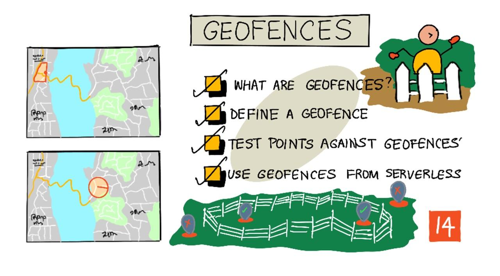

<!--
CO_OP_TRANSLATOR_METADATA:
{
  "original_hash": "078ae664c7b686bf069545e9a5fc95b2",
  "translation_date": "2025-08-25T00:42:16+00:00",
  "source_file": "3-transport/lessons/4-geofences/README.md",
  "language_code": "ko"
}
-->
# 지오펜스



> 스케치노트 제공: [Nitya Narasimhan](https://github.com/nitya). 이미지를 클릭하면 더 큰 버전을 볼 수 있습니다.

이 비디오는 지오펜스와 Azure Maps에서 이를 사용하는 방법에 대한 개요를 제공합니다. 이 강의에서 다룰 주제는 다음과 같습니다:

[](https://www.youtube.com/watch?v=nsrgYhaYNVY)

> 🎥 위 이미지를 클릭하면 비디오를 시청할 수 있습니다.

## 강의 전 퀴즈

[강의 전 퀴즈](https://black-meadow-040d15503.1.azurestaticapps.net/quiz/27)

## 소개

지난 3개의 강의에서 IoT를 사용하여 농장에서 가공 허브로 농산물을 운송하는 트럭의 위치를 추적했습니다. GPS 데이터를 캡처하고 이를 클라우드에 저장한 후 지도를 통해 시각화했습니다. 공급망의 효율성을 높이기 위한 다음 단계는 트럭이 가공 허브에 도착하기 직전에 알림을 받는 것입니다. 이를 통해 하역 작업에 필요한 크루가 지게차와 기타 장비를 준비하여 차량이 도착하자마자 신속히 하역할 수 있습니다. 이렇게 하면 트럭과 운전자가 대기하는 시간을 줄일 수 있습니다.

이번 강의에서는 지오펜스에 대해 배우게 됩니다. 지오펜스는 가공 허브에서 2km 이내의 운전 거리와 같은 정의된 지리적 영역을 나타냅니다. GPS 좌표가 지오펜스 안에 있는지 밖에 있는지를 테스트하여 GPS 센서가 특정 지역에 도착했는지 떠났는지를 확인할 수 있습니다.

이번 강의에서 다룰 내용은 다음과 같습니다:

* [지오펜스란 무엇인가](../../../../../3-transport/lessons/4-geofences)
* [지오펜스 정의하기](../../../../../3-transport/lessons/4-geofences)
* [지오펜스에 대한 점 테스트](../../../../../3-transport/lessons/4-geofences)
* [서버리스 코드에서 지오펜스 사용하기](../../../../../3-transport/lessons/4-geofences)

> 🗑 이 프로젝트의 마지막 강의입니다. 강의와 과제를 완료한 후에는 클라우드 서비스를 정리하는 것을 잊지 마세요. 과제를 완료하려면 서비스가 필요하니 먼저 과제를 완료하세요.
>
> 필요하다면 [프로젝트 정리 가이드](../../../clean-up.md)를 참조하여 이를 수행하는 방법을 확인하세요.

## 지오펜스란 무엇인가

지오펜스는 실제 지리적 영역에 대한 가상의 경계입니다. 지오펜스는 건물 주변 100m 반경의 원과 같은 점과 반경으로 정의된 원형일 수도 있고, 학교 구역, 도시 경계, 대학 또는 사무실 캠퍼스와 같은 영역을 포함하는 다각형일 수도 있습니다.


> 💁 이미 지오펜스를 사용해본 적이 있을지도 모릅니다. iOS 리마인더 앱이나 Google Keep에서 위치를 기반으로 알림을 설정한 적이 있다면 지오펜스를 사용한 것입니다. 이러한 앱은 제공된 위치를 기반으로 지오펜스를 설정하고 휴대폰이 지오펜스에 들어갈 때 알림을 제공합니다.

지오펜스 안에 차량이 있는지 밖에 있는지를 알고 싶어하는 이유는 다양합니다:

* **하역 준비** - 차량이 현장에 도착했다는 알림을 받으면 크루가 차량을 하역할 준비를 할 수 있어 차량 대기 시간을 줄일 수 있습니다. 이를 통해 운전자는 대기 시간이 줄어든 상태에서 하루에 더 많은 배송을 할 수 있습니다.
* **세금 준수** - 뉴질랜드와 같은 일부 국가에서는 디젤 차량이 공공 도로에서만 차량 중량에 따라 도로세를 부과합니다. 지오펜스를 사용하면 농장이나 벌목 지역과 같은 사유 도로가 아닌 공공 도로에서 주행한 거리를 추적할 수 있습니다.
* **도난 감시** - 차량이 농장과 같은 특정 지역에만 머물러야 하는데 지오펜스를 벗어나면 도난당했을 가능성이 있습니다.
* **위치 준수** - 작업 현장, 농장 또는 공장의 일부 지역은 특정 차량에 출입이 제한될 수 있습니다. 예를 들어, 인공 비료와 살충제를 운반하는 차량이 유기농 작물을 재배하는 밭에서 멀리 떨어져 있어야 합니다. 지오펜스에 들어가면 차량이 준수 범위를 벗어난 것이며 운전자에게 알림을 보낼 수 있습니다.

✅ 지오펜스를 활용할 수 있는 다른 방법을 생각해볼 수 있나요?

지난 강의에서 GPS 데이터를 시각화하는 데 사용한 Azure Maps는 지오펜스를 정의하고, 특정 점이 지오펜스 안에 있는지 밖에 있는지를 테스트할 수 있는 기능을 제공합니다.

## 지오펜스 정의하기

지오펜스는 이전 강의에서 지도에 추가된 점과 동일한 GeoJSON을 사용하여 정의됩니다. 이 경우, `Point` 값의 `FeatureCollection` 대신 `Polygon`을 포함하는 
위 이미지에서는 Microsoft 캠퍼스 일부를 포함하는 지오펜스가 표시되어 있습니다. 빨간 선은 520번 도로를 따라 이동하는 트럭을 나타내며, 원은 GPS 측정값을 나타냅니다. 대부분의 측정값은 정확하며 520번 도로를 따라 위치해 있지만, 하나의 부정확한 측정값이 지오펜스 내부에 있습니다. 해당 측정값이 올바를 가능성은 없습니다. 트럭이 갑자기 520번 도로에서 캠퍼스로 이동한 후 다시 520번 도로로 돌아올 수 있는 도로가 없기 때문입니다. 이 지오펜스를 확인하는 코드는 지오펜스 테스트 결과를 처리하기 전에 이전 측정값을 고려해야 합니다.

✅ GPS 측정값이 올바른지 확인하기 위해 추가로 어떤 데이터를 확인해야 할까요?

### 작업 - 지오펜스에 대해 포인트 테스트하기

1. 웹 API 쿼리를 위한 URL을 생성합니다. 형식은 다음과 같습니다:

    ```output
    https://atlas.microsoft.com/spatial/geofence/json?api-version=1.0&deviceId=gps-sensor&subscription-key=<subscription-key>&udid=<UDID>&lat=<lat>&lon=<lon>
    ```

    `<subscription_key>`를 Azure Maps 계정의 API 키로 교체합니다.

    `<UDID>`를 이전 작업에서 생성한 지오펜스의 UDID로 교체합니다.

    `<lat>`와 `<lon>`을 테스트하려는 위도와 경도로 교체합니다.

    이 URL은 GeoJSON을 사용하여 정의된 지오펜스를 쿼리하기 위해 `https://atlas.microsoft.com/spatial/geofence/json` API를 사용합니다. API 버전 `1.0`을 대상으로 하며, `deviceId` 매개변수는 필수이며 위도와 경도가 가져온 장치의 이름이어야 합니다.

    기본 검색 버퍼는 50m이며, `searchBuffer=<distance>` 매개변수를 추가하여 검색 버퍼 거리를 0에서 500m 사이로 설정할 수 있습니다.

1. curl을 사용하여 이 URL에 대해 GET 요청을 실행합니다:

    ```sh
    curl --request GET '<URL>'
    ```

    > 💁 `BadRequest` 응답 코드와 함께 다음과 같은 오류가 발생하면:
    >
    > ```output
    > Invalid GeoJSON: All feature properties should contain a geometryId, which is used for identifying the geofence.
    > ```
    >
    > GeoJSON에 `geometryId`가 포함된 `properties` 섹션이 누락된 것입니다. GeoJSON을 수정한 후 위 단계를 반복하여 다시 업로드하고 새로운 UDID를 얻어야 합니다.

1. 응답에는 GeoJSON을 사용하여 생성된 지오펜스에 정의된 각 폴리곤에 대해 하나씩 `geometries` 목록이 포함됩니다. 각 지오메트리에는 `distance`, `nearestLat`, `nearestLon`이라는 3개의 관심 필드가 있습니다.

    ```output
    {
        "geometries": [
            {
                "deviceId": "gps-sensor",
                "udId": "7c3776eb-da87-4c52-ae83-caadf980323a",
                "geometryId": "1",
                "distance": 999.0,
                "nearestLat": 47.645875,
                "nearestLon": -122.142713
            }
        ],
        "expiredGeofenceGeometryId": [],
        "invalidPeriodGeofenceGeometryId": []
    }
    ```

    * `nearestLat`와 `nearestLon`은 테스트 중인 위치에서 지오펜스 가장자리까지 가장 가까운 점의 위도와 경도입니다.

    * `distance`는 테스트 중인 위치에서 지오펜스 가장자리까지 가장 가까운 점까지의 거리입니다. 음수는 지오펜스 내부를, 양수는 외부를 의미합니다. 이 값은 기본 검색 버퍼인 50보다 작거나 999입니다.

1. 지오펜스 내부와 외부의 위치를 사용하여 여러 번 반복 테스트를 수행합니다.

## 서버리스 코드에서 지오펜스 사용하기

이제 Functions 앱에 새로운 트리거를 추가하여 IoT Hub GPS 이벤트 데이터를 지오펜스와 비교할 수 있습니다.

### 소비자 그룹

이전 수업에서 배운 바와 같이, IoT Hub는 허브에서 수신된 이벤트를 재생할 수 있지만 아직 처리되지 않은 이벤트를 처리할 수 있습니다. 하지만 여러 트리거가 연결되면 어떻게 될까요? 어떤 트리거가 어떤 이벤트를 처리했는지 어떻게 알 수 있을까요?

답은 알 수 없다는 것입니다! 대신 이벤트를 읽기 위한 여러 개의 별도 연결을 정의할 수 있으며, 각 연결은 읽지 않은 메시지의 재생을 관리할 수 있습니다. 이를 *소비자 그룹*이라고 합니다. 엔드포인트에 연결할 때 연결하려는 소비자 그룹을 지정할 수 있습니다. 애플리케이션의 각 구성 요소는 서로 다른 소비자 그룹에 연결됩니다.


이론적으로 각 소비자 그룹에 최대 5개의 애플리케이션이 연결될 수 있으며, 메시지가 도착하면 모두 메시지를 수신합니다. 각 소비자 그룹에 하나의 애플리케이션만 액세스하도록 설정하는 것이 모범 사례입니다. 이렇게 하면 중복 메시지 처리를 방지하고 재시작 시 모든 대기 메시지가 올바르게 처리되도록 보장할 수 있습니다. 예를 들어 Functions 앱을 로컬에서 실행하면서 클라우드에서도 실행하면 두 앱이 메시지를 처리하여 스토리지 계정에 중복된 Blob이 저장될 수 있습니다.

이전에 생성한 IoT Hub 트리거의 `function.json` 파일을 검토하면 이벤트 허브 트리거 바인딩 섹션에서 소비자 그룹을 확인할 수 있습니다:

```json
"consumerGroup": "$Default"
```

IoT Hub를 생성하면 기본적으로 `$Default` 소비자 그룹이 생성됩니다. 추가 트리거를 추가하려면 새로운 소비자 그룹을 사용하여 추가할 수 있습니다.

> 💁 이번 수업에서는 GPS 데이터를 저장하는 데 사용된 함수와는 다른 함수를 사용하여 지오펜스를 테스트합니다. 이는 소비자 그룹을 사용하는 방법과 코드를 분리하여 읽고 이해하기 쉽게 만드는 방법을 보여주기 위함입니다. 실제 애플리케이션에서는 이를 설계하는 방법이 다양합니다. 하나의 함수에 모두 넣거나, 스토리지 계정의 트리거를 사용하여 지오펜스를 확인하는 함수를 실행하거나, 여러 함수를 사용하는 방법 등이 있습니다. '정답'은 없으며 애플리케이션의 나머지 부분과 요구 사항에 따라 달라집니다.

### 작업 - 새로운 소비자 그룹 생성하기

1. IoT Hub에 `geofence`라는 새로운 소비자 그룹을 생성하려면 다음 명령을 실행합니다:

    ```sh
    az iot hub consumer-group create --name geofence \
                                     --hub-name <hub_name>
    ```

    `<hub_name>`을 IoT Hub의 이름으로 교체합니다.

1. IoT Hub의 모든 소비자 그룹을 확인하려면 다음 명령을 실행합니다:

    ```sh
    az iot hub consumer-group list --output table \
                                   --hub-name <hub_name>
    ```

    `<hub_name>`을 IoT Hub의 이름으로 교체합니다. 이 명령은 모든 소비자 그룹을 나열합니다.

    ```output
    Name      ResourceGroup
    --------  ---------------
    $Default  gps-sensor
    geofence  gps-sensor
    ```

> 💁 이전 수업에서 IoT Hub 이벤트 모니터를 실행했을 때 `$Default` 소비자 그룹에 연결되었습니다. 이 때문에 이벤트 모니터와 이벤트 트리거를 동시에 실행할 수 없었습니다. 둘 다 실행하려면 모든 Functions 앱에 다른 소비자 그룹을 사용하고 `$Default`는 이벤트 모니터에 유지할 수 있습니다.

### 작업 - 새로운 IoT Hub 트리거 생성하기

1. 이전 수업에서 생성한 `gps-trigger` 함수 앱에 새로운 IoT Hub 이벤트 트리거를 추가합니다. 이 함수를 `geofence-trigger`라고 명명합니다.

    > ⚠️ [프로젝트 2, 수업 5의 IoT Hub 이벤트 트리거 생성 지침](../../../2-farm/lessons/5-migrate-application-to-the-cloud/README.md#create-an-iot-hub-event-trigger)을 참조할 수 있습니다.

1. `function.json` 파일에서 IoT Hub 연결 문자열을 구성합니다. `local.settings.json`은 Functions 앱의 모든 트리거에서 공유됩니다.

1. `function.json` 파일에서 `consumerGroup` 값을 새로운 `geofence` 소비자 그룹으로 업데이트합니다:

    ```json
    "consumerGroup": "geofence"
    ```

1. 이 트리거에서 Azure Maps 계정의 구독 키를 사용해야 하므로 `local.settings.json` 파일에 `MAPS_KEY`라는 새 항목을 추가합니다.

1. Functions 앱을 실행하여 메시지를 연결하고 처리하는지 확인합니다. 이전 수업의 `iot-hub-trigger`도 실행되어 Blob을 스토리지에 업로드합니다.

    > Blob 스토리지에 중복된 GPS 측정값을 방지하려면 클라우드에서 실행 중인 Functions 앱을 중지할 수 있습니다. 이를 위해 다음 명령을 사용합니다:
    >
    > ```sh
    > az functionapp stop --resource-group gps-sensor \
    >                     --name <functions_app_name>
    > ```
    >
    > `<functions_app_name>`을 Functions 앱의 이름으로 교체합니다.
    >
    > 나중에 다음 명령으로 다시 시작할 수 있습니다:
    >
    > ```sh
    > az functionapp start --resource-group gps-sensor \
    >                     --name <functions_app_name>
    > ```
    >
    > `<functions_app_name>`을 Functions 앱의 이름으로 교체합니다.

### 작업 - 트리거에서 지오펜스 테스트하기

이전 수업에서 curl을 사용하여 지오펜스를 쿼리하여 포인트가 내부 또는 외부에 있는지 확인했습니다. 트리거 내부에서 유사한 웹 요청을 실행할 수 있습니다.

1. 지오펜스를 쿼리하려면 UDID가 필요합니다. `local.settings.json` 파일에 `GEOFENCE_UDID`라는 새 항목을 추가하여 이 값을 설정합니다.

1. 새로운 `geofence-trigger` 트리거의 `__init__.py` 파일을 엽니다.

1. 파일 상단에 다음 import를 추가합니다:

    ```python
    import json
    import os
    import requests
    ```

    `requests` 패키지를 사용하면 웹 API 호출을 실행할 수 있습니다. Azure Maps는 Python SDK를 제공하지 않으므로 Python 코드에서 사용하려면 웹 API 호출을 실행해야 합니다.

1. `main` 메서드 시작 부분에 다음 두 줄을 추가하여 Maps 구독 키를 가져옵니다:

    ```python
    maps_key = os.environ['MAPS_KEY']
    geofence_udid = os.environ['GEOFENCE_UDID']    
    ```

1. `for event in events` 루프 내부에서 각 이벤트에서 위도와 경도를 가져오기 위해 다음 코드를 추가합니다:

    ```python
    event_body = json.loads(event.get_body().decode('utf-8'))
    lat = event_body['gps']['lat']
    lon = event_body['gps']['lon']
    ```

    이 코드는 이벤트 본문에서 JSON을 딕셔너리로 변환한 다음 `gps` 필드에서 `lat`과 `lon`을 추출합니다.

1. `requests`를 사용할 때 curl처럼 긴 URL을 작성하는 대신 URL 부분만 사용하고 매개변수를 딕셔너리로 전달할 수 있습니다. 호출할 URL을 정의하고 매개변수를 구성하기 위해 다음 코드를 추가합니다:

    ```python
    url = 'https://atlas.microsoft.com/spatial/geofence/json'

    params = {
        'api-version': 1.0,
        'deviceId': 'gps-sensor',
        'subscription-key': maps_key,
        'udid' : geofence_udid,
        'lat' : lat,
        'lon' : lon
    }
    ```

    `params` 딕셔너리의 항목은 curl을 사용하여 웹 API를 호출할 때 사용한 키-값 쌍과 일치합니다.

1. 웹 API를 호출하기 위해 다음 코드를 추가합니다:

    ```python
    response = requests.get(url, params=params)
    response_body = json.loads(response.text)
    ```

    이 코드는 URL과 매개변수를 호출하고 응답 객체를 반환합니다.

1. 이 아래에 다음 코드를 추가합니다:

    ```python
    distance = response_body['geometries'][0]['distance']

    if distance == 999:
        logging.info('Point is outside geofence')
    elif distance > 0:
        logging.info(f'Point is just outside geofence by a distance of {distance}m')
    elif distance == -999:
        logging.info(f'Point is inside geofence')
    else:
        logging.info(f'Point is just inside geofence by a distance of {distance}m')
    ```

    이 코드는 하나의 지오메트리를 가정하고 해당 단일 지오메트리에서 거리를 추출합니다. 그런 다음 거리 값에 따라 다른 메시지를 로그로 기록합니다.

1. 이 코드를 실행합니다. GPS 좌표가 지오펜스 내부 또는 외부에 있는지, 그리고 포인트가 50m 이내에 있는 경우 거리를 로그 출력에서 확인할 수 있습니다. GPS 센서의 위치를 기준으로 다른 지오펜스를 사용하여 이 코드를 테스트해보세요. 센서를 이동하거나(예: 모바일 폰의 WiFi를 연결하거나 가상 IoT 장치에서 다른 좌표를 사용) 변화를 확인해보세요.

1. 준비가 되면 이 코드를 클라우드의 Functions 앱에 배포합니다. 새로운 애플리케이션 설정을 배포하는 것을 잊지 마세요.

    > ⚠️ [프로젝트 2, 수업 5의 애플리케이션 설정 업로드 지침](../../../2-farm/lessons/5-migrate-application-to-the-cloud/README.md#task---upload-your-application-settings)을 참조할 수 있습니다.

    > ⚠️ [프로젝트 2, 수업 5의 Functions 앱 배포 지침](../../../2-farm/lessons/5-migrate-application-to-the-cloud/README.md#task---deploy-your-functions-app-to-the-cloud)을 참조할 수 있습니다.

> 💁 이 코드는 [code/functions](../../../../../3-transport/lessons/4-geofences/code/functions) 폴더에서 찾을 수 있습니다.

---

## 🚀 챌린지

이번 수업에서는 단일 폴리곤을 포함하는 GeoJSON 파일을 사용하여 하나의 지오펜스를 추가했습니다. `properties` 섹션에서 서로 다른 `geometryId` 값을 가진 여러 폴리곤을 포함하는 GeoJSON 파일을 업로드하고 GPS 좌표가 가장 가까운 폴리곤 또는 내부에 있는 폴리곤을 찾도록 코드를 조정해보세요.

## 강의 후 퀴즈

[강의 후 퀴즈](https://black-meadow-040d15503.1.azurestaticapps.net/quiz/28)

## 복습 및 자기 학습

* [Wikipedia의 지오펜스 페이지](https://en.wikipedia.org/wiki/Geo-fence)에서 지오펜스와 그 사용 사례에 대해 더 읽어보세요.
* [Microsoft Azure Maps Spatial - Get Geofence 문서](https://docs.microsoft.com/rest/api/maps/spatial/getgeofence?WT.mc_id=academic-17441-jabenn)에서 Azure Maps 지오펜싱 API에 대해 더 읽어보세요.
* [Microsoft 문서의 Azure Event Hubs 기능 및 용어 - 이벤트 소비자 문서](https://docs.microsoft.com/azure/event-hubs/event-hubs-features?WT.mc_id=academic-17441-jabenn#event-consumers)에서 소비자 그룹에 대해 더 읽어보세요.

## 과제

[Twilio를 사용하여 알림 보내기](assignment.md)

**면책 조항**:  
이 문서는 AI 번역 서비스 [Co-op Translator](https://github.com/Azure/co-op-translator)를 사용하여 번역되었습니다. 정확성을 위해 최선을 다하고 있지만, 자동 번역에는 오류나 부정확성이 포함될 수 있습니다. 원본 문서를 해당 언어로 작성된 상태에서 권위 있는 자료로 간주해야 합니다. 중요한 정보의 경우, 전문적인 인간 번역을 권장합니다. 이 번역 사용으로 인해 발생하는 오해나 잘못된 해석에 대해 당사는 책임을 지지 않습니다.