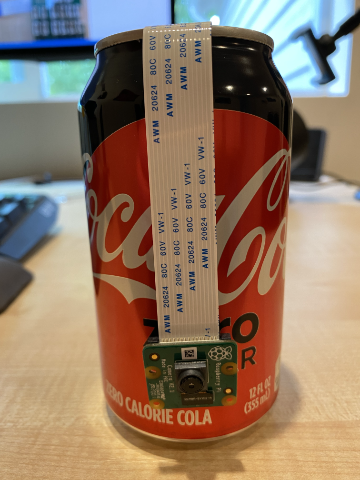

<!--
CO_OP_TRANSLATOR_METADATA:
{
  "original_hash": "c677667095f6133eee418c7e53615d05",
  "translation_date": "2025-08-24T21:30:32+00:00",
  "source_file": "4-manufacturing/lessons/2-check-fruit-from-device/pi-camera.md",
  "language_code": "ko"
}
-->
# 이미지 캡처 - 라즈베리 파이

이 수업의 이 부분에서는 라즈베리 파이에 카메라 센서를 추가하고 이미지를 읽는 방법을 배웁니다.

## 하드웨어

라즈베리 파이에는 카메라가 필요합니다.

사용할 카메라는 [Raspberry Pi Camera Module](https://www.raspberrypi.org/products/camera-module-v2/)입니다. 이 카메라는 라즈베리 파이와 함께 작동하도록 설계되었으며, Pi의 전용 커넥터를 통해 연결됩니다.

> 💁 이 카메라는 [Camera Serial Interface, Mobile Industry Processor Interface Alliance의 프로토콜](https://wikipedia.org/wiki/Camera_Serial_Interface)을 사용합니다. 이는 이미지를 전송하기 위한 전용 프로토콜입니다.

## 카메라 연결하기

카메라는 리본 케이블을 사용하여 라즈베리 파이에 연결할 수 있습니다.

### 작업 - 카메라 연결하기


1. Pi의 전원을 끕니다.

1. 카메라에 포함된 리본 케이블을 카메라에 연결합니다. 이를 위해, 홀더의 검은색 플라스틱 클립을 살짝 당겨 약간 빼낸 후, 케이블을 소켓에 삽입합니다. 이때 파란색 면이 렌즈와 반대 방향을 향하고, 금속 핀이 있는 면이 렌즈를 향하도록 합니다. 케이블이 완전히 삽입되면 검은색 플라스틱 클립을 다시 제자리에 밀어 넣습니다.

    클립을 열고 케이블을 삽입하는 방법에 대한 애니메이션은 [Raspberry Pi Getting Started with the Camera module documentation](https://projects.raspberrypi.org/en/projects/getting-started-with-picamera/2)에서 확인할 수 있습니다.

    

1. Grove Base Hat을 Pi에서 제거합니다.

1. 리본 케이블을 Grove Base Hat의 카메라 슬롯을 통해 통과시킵니다. 이때 케이블의 파란색 면이 **A0**, **A1** 등으로 표시된 아날로그 포트를 향하도록 합니다.

    

1. 리본 케이블을 Pi의 카메라 포트에 삽입합니다. 다시 한 번, 검은색 플라스틱 클립을 위로 당겨 케이블을 삽입한 후 클립을 다시 밀어 넣습니다. 케이블의 파란색 면이 USB 및 이더넷 포트를 향해야 합니다.

    

1. Grove Base Hat을 다시 장착합니다.

## 카메라 프로그래밍

이제 라즈베리 파이는 [PiCamera](https://pypi.org/project/picamera/) Python 라이브러리를 사용하여 카메라를 프로그래밍할 수 있습니다.

### 작업 - 레거시 카메라 모드 활성화

불행히도 Raspberry Pi OS Bullseye가 출시되면서 OS에 포함된 카메라 소프트웨어가 변경되어 기본적으로 PiCamera가 더 이상 작동하지 않습니다. 이를 대체할 PiCamera2라는 소프트웨어가 개발 중이지만, 아직 사용 가능한 상태는 아닙니다.

현재로서는 Pi를 레거시 카메라 모드로 설정하여 PiCamera를 사용할 수 있습니다. 카메라 소켓은 기본적으로 비활성화되어 있지만, 레거시 카메라 소프트웨어를 활성화하면 소켓도 자동으로 활성화됩니다.

1. Pi의 전원을 켜고 부팅이 완료될 때까지 기다립니다.

1. VS Code를 실행합니다. Pi에서 직접 실행하거나 Remote SSH 확장을 통해 연결할 수 있습니다.

1. 터미널에서 다음 명령어를 실행합니다:

    ```sh
    sudo raspi-config nonint do_legacy 0
    sudo reboot
    ```

    이 명령어는 레거시 카메라 소프트웨어를 활성화하는 설정을 토글한 후, 해당 설정을 적용하기 위해 Pi를 재부팅합니다.

1. Pi가 재부팅되면 VS Code를 다시 실행합니다.

### 작업 - 카메라 프로그래밍

장치를 프로그래밍합니다.

1. 터미널에서 `pi` 사용자의 홈 디렉토리에 `fruit-quality-detector`라는 새 폴더를 만듭니다. 이 폴더에 `app.py`라는 파일을 생성합니다.

1. 이 폴더를 VS Code에서 엽니다.

1. 카메라와 상호작용하려면 PiCamera Python 라이브러리를 사용할 수 있습니다. 다음 명령어로 Pip 패키지를 설치합니다:

    ```sh
    pip3 install picamera
    ```

1. `app.py` 파일에 다음 코드를 추가합니다:

    ```python
    import io
    import time
    from picamera import PiCamera
    ```

    이 코드는 `PiCamera` 라이브러리를 포함하여 필요한 몇 가지 라이브러리를 가져옵니다.

1. 아래에 카메라를 초기화하는 다음 코드를 추가합니다:

    ```python
    camera = PiCamera()
    camera.resolution = (640, 480)
    camera.rotation = 0
    
    time.sleep(2)
    ```

    이 코드는 PiCamera 객체를 생성하고 해상도를 640x480으로 설정합니다. 더 높은 해상도(최대 3280x2464)도 지원되지만, 이미지 분류기는 훨씬 작은 이미지(227x227)에서 작동하므로 더 큰 이미지를 캡처하거나 전송할 필요가 없습니다.

    `camera.rotation = 0` 줄은 이미지의 회전을 설정합니다. 리본 케이블은 카메라의 아래쪽으로 들어오지만, 카메라를 회전시켜 분류하려는 항목을 더 쉽게 가리키도록 설정한 경우 이 줄을 회전 각도로 변경할 수 있습니다.

    

    예를 들어, 리본 케이블을 카메라 상단에 매달아 놓은 경우 회전을 180으로 설정합니다:

    ```python
    camera.rotation = 180
    ```

    카메라가 시작하는 데 몇 초가 걸리므로 `time.sleep(2)`가 필요합니다.

1. 아래에 이미지를 바이너리 데이터로 캡처하는 다음 코드를 추가합니다:

    ```python
    image = io.BytesIO()
    camera.capture(image, 'jpeg')
    image.seek(0)
    ```

    이 코드는 바이너리 데이터를 저장하기 위한 `BytesIO` 객체를 생성합니다. 이미지는 JPEG 파일로 카메라에서 읽혀 이 객체에 저장됩니다. 이 객체는 데이터를 기록할 위치를 나타내는 위치 표시기를 가지고 있으므로, `image.seek(0)` 줄은 나중에 모든 데이터를 읽을 수 있도록 이 위치를 시작점으로 되돌립니다.

1. 아래에 이미지를 파일로 저장하는 다음 코드를 추가합니다:

    ```python
    with open('image.jpg', 'wb') as image_file:
        image_file.write(image.read())
    ```

    이 코드는 `image.jpg`라는 파일을 쓰기 모드로 열고, `BytesIO` 객체에서 모든 데이터를 읽어 파일에 씁니다.

    > 💁 이미지를 `BytesIO` 객체 대신 파일에 직접 캡처하려면 `camera.capture` 호출에 파일 이름을 전달하면 됩니다. 이 수업의 뒷부분에서 이미지를 이미지 분류기로 전송하기 위해 `BytesIO` 객체를 사용하는 이유입니다.

1. 카메라를 무언가에 맞추고 이 코드를 실행합니다.

1. 이미지가 캡처되어 현재 폴더에 `image.jpg`로 저장됩니다. 이 파일은 VS Code 탐색기에서 확인할 수 있습니다. 파일을 선택하여 이미지를 확인하세요. 회전이 필요하면 `camera.rotation = 0` 줄을 적절히 업데이트하고 다시 사진을 찍으세요.

> 💁 이 코드는 [code-camera/pi](../../../../../4-manufacturing/lessons/2-check-fruit-from-device/code-camera/pi) 폴더에서 확인할 수 있습니다.

😀 카메라 프로그램이 성공적으로 작동했습니다!

**면책 조항**:  
이 문서는 AI 번역 서비스 [Co-op Translator](https://github.com/Azure/co-op-translator)를 사용하여 번역되었습니다. 정확성을 위해 최선을 다하고 있지만, 자동 번역에는 오류나 부정확성이 포함될 수 있습니다. 원본 문서의 원어 버전을 권위 있는 출처로 간주해야 합니다. 중요한 정보의 경우, 전문적인 인간 번역을 권장합니다. 이 번역 사용으로 인해 발생하는 오해나 잘못된 해석에 대해 책임을 지지 않습니다.