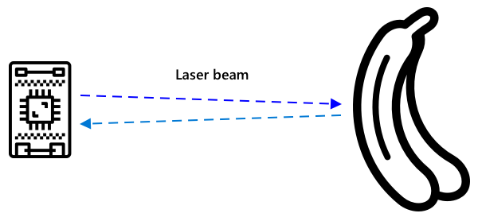

<!--
CO_OP_TRANSLATOR_METADATA:
{
  "original_hash": "f74f4ccb61f00e5f7e9f49c3ed416e36",
  "translation_date": "2025-08-24T21:51:40+00:00",
  "source_file": "4-manufacturing/lessons/4-trigger-fruit-detector/README.md",
  "language_code": "ko"
}
-->
# 센서로 과일 품질 감지 트리거하기


> 스케치노트: [Nitya Narasimhan](https://github.com/nitya). 이미지를 클릭하면 더 큰 버전을 볼 수 있습니다.

## 강의 전 퀴즈

[강의 전 퀴즈](https://black-meadow-040d15503.1.azurestaticapps.net/quiz/35)

## 소개

IoT 애플리케이션은 단일 장치가 데이터를 캡처하고 클라우드로 전송하는 것만이 아닙니다. 대부분의 경우 여러 장치가 협력하여 센서를 통해 물리적 세계에서 데이터를 캡처하고, 그 데이터를 기반으로 결정을 내리며, 액추에이터나 시각화를 통해 물리적 세계와 상호작용합니다.

이 강의에서는 복잡한 IoT 애플리케이션을 설계하는 방법, 여러 센서와 클라우드 서비스를 통합하여 데이터를 분석하고 저장하는 방법, 그리고 액추에이터를 통해 응답을 표시하는 방법을 배웁니다. 과일 품질 관리 시스템 프로토타입을 설계하는 방법, 근접 센서를 사용하여 IoT 애플리케이션을 트리거하는 방법, 그리고 이 프로토타입의 아키텍처에 대해 알아볼 것입니다.

이 강의에서 다룰 내용은 다음과 같습니다:

* [복잡한 IoT 애플리케이션 설계](../../../../../4-manufacturing/lessons/4-trigger-fruit-detector)
* [과일 품질 관리 시스템 설계](../../../../../4-manufacturing/lessons/4-trigger-fruit-detector)
* [센서를 사용해 과일 품질 검사 트리거](../../../../../4-manufacturing/lessons/4-trigger-fruit-detector)
* [과일 품질 감지기에 사용되는 데이터](../../../../../4-manufacturing/lessons/4-trigger-fruit-detector)
* [여러 IoT 장치를 시뮬레이션하기 위한 개발자 장치 사용](../../../../../4-manufacturing/lessons/4-trigger-fruit-detector)
* [프로덕션으로 이동](../../../../../4-manufacturing/lessons/4-trigger-fruit-detector)

> 🗑 이 프로젝트의 마지막 강의입니다. 이 강의와 과제를 완료한 후에는 클라우드 서비스를 정리하는 것을 잊지 마세요. 과제를 완료하려면 서비스가 필요하니, 먼저 과제를 완료하세요.
>
> 필요하다면 [프로젝트 정리 가이드](../../../clean-up.md)를 참조하여 정리 방법을 확인하세요.

## 복잡한 IoT 애플리케이션 설계

IoT 애플리케이션은 다양한 구성 요소로 이루어져 있습니다. 여기에는 여러 장치와 인터넷 서비스가 포함됩니다.

IoT 애플리케이션은 데이터를 전송하는 *사물* (장치)로 설명할 수 있습니다. 이 데이터는 *인사이트*를 생성하며, 이 *인사이트*는 비즈니스나 프로세스를 개선하기 위한 *행동*을 유발합니다. 예를 들어, 엔진(사물)이 온도 데이터를 전송한다고 가정해봅시다. 이 데이터는 엔진이 예상대로 작동하는지 평가하는 데 사용됩니다(인사이트). 이 인사이트는 엔진의 유지보수 일정을 우선적으로 조정하는 데 사용됩니다(행동).

* 서로 다른 사물은 서로 다른 데이터를 수집합니다.
* IoT 서비스는 이 데이터를 분석하고, 때로는 추가 소스의 데이터를 보강하여 인사이트를 제공합니다.
* 이러한 인사이트는 장치의 액추에이터를 제어하거나 데이터를 시각화하여 사람이 결정을 내릴 수 있도록 하는 행동을 유발합니다.

### 참조 IoT 아키텍처


위 그림은 참조 IoT 아키텍처를 보여줍니다.

> 🎓 *참조 아키텍처*는 새로운 시스템을 설계할 때 참조할 수 있는 예제 아키텍처입니다. 이 경우, 새로운 IoT 시스템을 구축할 때 참조 아키텍처를 따라 적절한 장치와 서비스를 대체하여 사용할 수 있습니다.

* **사물**은 센서에서 데이터를 수집하는 장치로, 이미지 데이터를 해석하기 위한 이미지 분류기와 같은 엣지 서비스를 통해 데이터를 해석할 수 있습니다. 장치에서 수집된 데이터는 IoT 서비스로 전송됩니다.
* **인사이트**는 서버리스 애플리케이션이나 저장된 데이터에 대한 분석에서 나옵니다.
* **행동**은 장치로 전송된 명령이거나, 사람이 결정을 내릴 수 있도록 데이터를 시각화하는 것입니다.


위 그림은 이 강의에서 다룬 구성 요소와 서비스가 참조 IoT 아키텍처에서 어떻게 연결되는지 보여줍니다.

* **사물** - 센서에서 데이터를 캡처하고, 클라우드와 엣지 장치 모두에서 실행되는 Custom Vision을 사용하여 이미지를 분석하는 장치 코드를 작성했습니다. 이 데이터는 IoT Hub로 전송되었습니다.
* **인사이트** - IoT Hub로 전송된 메시지에 응답하기 위해 Azure Functions를 사용했으며, 데이터를 나중에 분석할 수 있도록 Azure Storage에 저장했습니다.
* **행동** - 클라우드에서 내린 결정과 장치로 전송된 명령을 기반으로 액추에이터를 제어했으며, Azure Maps를 사용하여 데이터를 시각화했습니다.

✅ 스마트 홈 가전제품과 같은 IoT 장치를 사용한 경험이 있다면, 해당 장치와 소프트웨어에서 사물, 인사이트, 행동이 어떻게 작동하는지 생각해보세요.

이 패턴은 필요에 따라 크거나 작게 확장할 수 있으며, 더 많은 장치와 서비스를 추가할 수 있습니다.

### 데이터와 보안

시스템의 아키텍처를 정의할 때는 항상 데이터와 보안을 고려해야 합니다.

* 장치가 어떤 데이터를 송수신하나요?
* 해당 데이터는 어떻게 보호되고 보안이 유지되어야 하나요?
* 장치와 클라우드 서비스에 대한 접근은 어떻게 제어해야 하나요?

✅ 소유하고 있는 IoT 장치의 데이터 보안에 대해 생각해보세요. 해당 데이터 중 얼마나 개인적이고 전송 중이거나 저장될 때 비공개로 유지되어야 하나요? 어떤 데이터는 저장되지 않아야 하나요?

## 과일 품질 관리 시스템 설계

이제 사물, 인사이트, 행동의 개념을 과일 품질 감지기에 적용하여 더 큰 엔드 투 엔드 애플리케이션을 설계해봅시다.

과일이 컨베이어 벨트 시스템을 통해 이동하는 가공 공장을 상상해보세요. 현재 직원들이 손으로 과일을 검사하고 도착한 덜 익은 과일을 제거하는 데 시간을 소비하고 있습니다. 공장 소유자는 비용을 줄이기 위해 자동화된 시스템을 원합니다.

✅ IoT와 기술의 발전으로 인해 수작업이 기계로 대체되는 추세가 있습니다. 조사해보세요: IoT로 인해 몇 개의 일자리가 사라질 것으로 예상되나요? IoT 장치를 구축하는 데 몇 개의 새로운 일자리가 창출될까요?

컨베이어 벨트에 과일이 도착하면 이를 감지하고, 사진을 찍어 엣지에서 실행되는 AI 모델로 확인하는 시스템을 구축해야 합니다. 결과는 클라우드에 저장되며, 과일이 덜 익은 경우 알림이 제공되어 덜 익은 과일을 제거할 수 있도록 해야 합니다.

|   |   |
| - | - |
| **사물** | 컨베이어 벨트에 과일이 도착했는지 감지하는 감지기<br>과일을 사진 찍고 분류하는 카메라<br>분류기를 실행하는 엣지 장치<br>덜 익은 과일을 알리는 장치 |
| **인사이트** | 과일의 익은 정도를 확인하기로 결정<br>익은 정도 분류 결과 저장<br>덜 익은 과일에 대한 알림 필요 여부 결정 |
| **행동** | 과일을 사진 찍고 이미지 분류기로 확인하라는 명령을 장치에 전송<br>덜 익은 과일임을 알리는 장치에 명령 전송 |

### 애플리케이션 프로토타이핑


위 그림은 이 프로토타입 애플리케이션의 참조 아키텍처를 보여줍니다.

* 근접 센서를 장착한 IoT 장치가 과일의 도착을 감지합니다. 이는 클라우드로 메시지를 보내 과일이 감지되었음을 알립니다.
* 클라우드의 서버리스 애플리케이션이 다른 장치에 사진을 찍고 이미지를 분류하라는 명령을 보냅니다.
* 카메라가 장착된 IoT 장치가 사진을 찍고 엣지에서 실행되는 이미지 분류기로 전송합니다. 결과는 클라우드로 전송됩니다.
* 클라우드의 서버리스 애플리케이션이 이 정보를 저장하여 나중에 덜 익은 과일의 비율을 분석합니다. 과일이 덜 익은 경우, LED를 통해 공장 직원에게 알리기 위해 다른 IoT 장치에 명령을 보냅니다.

> 💁 이 전체 IoT 애플리케이션은 단일 장치로 구현될 수도 있습니다. 모든 로직이 내장되어 이미지 분류를 시작하고 LED를 제어할 수 있습니다. IoT Hub는 단순히 덜 익은 과일의 수를 추적하고 장치를 구성하는 데 사용될 수 있습니다. 이 강의에서는 대규모 IoT 애플리케이션의 개념을 설명하기 위해 확장되었습니다.

프로토타입에서는 모든 것을 단일 장치에서 구현합니다. 마이크로컨트롤러를 사용하는 경우 이미지 분류기를 실행하기 위해 별도의 엣지 장치를 사용해야 할 수도 있습니다. 이미 필요한 대부분의 기술을 배웠습니다.

## 센서를 사용해 과일 품질 검사 트리거

IoT 장치는 과일이 분류될 준비가 되었음을 나타내는 트리거가 필요합니다. 한 가지 트리거는 센서를 통해 컨베이어 벨트에서 과일이 올바른 위치에 있는지 측정하는 것입니다.



근접 센서는 센서와 물체 사이의 거리를 측정하는 데 사용될 수 있습니다. 일반적으로 레이저 빔이나 적외선과 같은 전자기 방사선을 방출한 후, 물체에서 반사된 방사선을 감지합니다. 레이저 빔이 발사된 시간과 신호가 반사되어 돌아오는 시간의 차이를 사용하여 센서까지의 거리를 계산할 수 있습니다.

> 💁 근접 센서를 사용한 경험이 있을 가능성이 높습니다. 대부분의 스마트폰은 통화 중 귀에 대면 화면을 꺼서 귀로 인해 통화가 종료되지 않도록 합니다. 이는 근접 센서를 사용하여 통화 중 화면 근처에 물체가 있음을 감지하고, 일정 거리 이상 떨어질 때까지 터치 기능을 비활성화하는 방식으로 작동합니다.

### 작업 - 거리 센서를 사용해 과일 품질 감지 트리거

IoT 장치를 사용하여 근접 센서를 통해 물체를 감지하는 관련 가이드를 따라 작업하세요:

* [Arduino - Wio Terminal](wio-terminal-proximity.md)
* [싱글보드 컴퓨터 - Raspberry Pi](pi-proximity.md)
* [싱글보드 컴퓨터 - 가상 장치](virtual-device-proximity.md)

## 과일 품질 감지기에 사용되는 데이터

프로토타입 과일 감지기는 서로 통신하는 여러 구성 요소로 이루어져 있습니다.


* 근접 센서가 과일과의 거리를 측정하고 이를 IoT Hub로 전송
* 카메라 장치를 제어하는 명령이 IoT Hub에서 카메라 장치로 전송
* 이미지 분류 결과가 IoT Hub로 전송
* 덜 익은 과일임을 알리기 위해 LED를 제어하는 명령이 IoT Hub에서 LED 장치로 전송

이러한 메시지의 구조를 애플리케이션을 구축하기 전에 미리 정의하는 것이 좋습니다.

> 💁 경험 많은 개발자라면 누구나 데이터가 예상과 다르게 전송되어 발생한 버그를 해결하는 데 몇 시간, 며칠, 심지어 몇 주를 소비한 경험이 있을 것입니다.

예를 들어, 온도 정보를 전송한다고 가정해봅시다. JSON을 어떻게 정의하시겠습니까? `temperature`라는 필드를 사용할 수도 있고, 일반적인 약어인 `temp`를 사용할 수도 있습니다.

```json
{
    "temperature": 20.7
}
```

또는:

```json
{
    "temp": 20.7
}
```

단위도 고려해야 합니다. 온도가 °C인지 °F인지 명확히 해야 합니다. 소비자 장치에서 표시 단위를 변경하더라도 클라우드로 전송되는 단위는 일관성을 유지해야 합니다.

✅ 조사해보세요: 단위 문제로 인해 1억 2,500만 달러의 Mars Climate Orbiter가 어떻게 추락했는지 알아보세요.

과일 품질 감지기에 전송되는 데이터를 생각해보세요. 각 메시지를 어떻게 정의하시겠습니까? 데이터를 어디에서 분석하고 어떤 데이터를 전송할지 결정하시겠습니까?

예를 들어, 근접 센서를 사용해 이미지 분류를 트리거한다고 가정해봅시다. IoT 장치가 거리를 측정하지만, 어디에서 결정을 내릴까요? 장치가 과일이 충분히 가까이 있다고 판단하고 IoT Hub에 분류를 트리거하라는 메시지를 보낼까요? 아니면 근접 측정값을 전송하고 IoT Hub가 결정을 내릴까요?

이 질문에 대한 답은 상황에 따라 다릅니다. 각 사용 사례는 다르기 때문에 IoT 개발자로서 구축 중인 시스템, 사용 방식, 감지 중인 데이터를 이해해야 합니다.

* IoT Hub에서 결정을 내린다면 여러 거리 측정값을 전송해야 합니다.
* 메시지를 너무 많이 전송하면 IoT Hub의 비용이 증가하고, IoT 장치(특히 수백만 개의 장치가 있는 공장)의 대역폭 요구량이 증가합니다. 또한 장치의 속도가 느려질 수 있습니다.
* 장치에서 결정을 내린다면 기계를 미세 조정할 수 있도록 장치를 구성하는 방법을 제공해야 합니다.

## 여러 IoT 장치를 시뮬레이션하기 위한 개발자 장치 사용

프로토타입을 구축하려면 IoT 개발 키트를 사용하여 여러 장치처럼 동작하도록 만들어야 합니다. 이는 텔레메트리를 전송하고 명령에 응답하는 방식으로 이루어집니다.

### Raspberry Pi 또는 가상 IoT 하드웨어에서 여러 IoT 장치 시뮬레이션

Raspberry Pi와 같은 싱글보드 컴퓨터를 사용하는 경우 여러 애플리케이션을 동시에 실행할 수 있습니다. 이를 통해 여러 IoT 장치를 시뮬레이션할 수 있으며, 각 'IoT 장치'를 별도의 애플리케이션으로 구현할 수 있습니다. 예를 들어, 각 장치를 개별 Python 파일로 구현하고 다른 터미널 세션에서 실행할 수 있습니다.
💁 일부 하드웨어는 여러 애플리케이션이 동시에 실행되며 접근할 경우 작동하지 않을 수 있습니다.
### 마이크로컨트롤러에서 여러 디바이스 시뮬레이션하기

마이크로컨트롤러에서 여러 디바이스를 시뮬레이션하는 것은 더 복잡합니다. 싱글 보드 컴퓨터와 달리 여러 애플리케이션을 동시에 실행할 수 없으며, 모든 개별 IoT 디바이스의 로직을 하나의 애플리케이션에 포함시켜야 합니다.

이 과정을 더 쉽게 만드는 몇 가지 제안은 다음과 같습니다:

* IoT 디바이스별로 하나 이상의 클래스를 생성하세요. 예를 들어, `DistanceSensor`, `ClassifierCamera`, `LEDController`와 같은 클래스를 만들 수 있습니다. 각각의 클래스는 메인 `setup` 및 `loop` 함수에 의해 호출되는 자체 `setup` 및 `loop` 메서드를 가질 수 있습니다.
* 명령을 한 곳에서 처리하고, 필요한 경우 관련 디바이스 클래스에 전달하세요.
* 메인 `loop` 함수에서 각 디바이스의 타이밍을 고려해야 합니다. 예를 들어, 10초마다 처리해야 하는 디바이스 클래스가 하나 있고, 1초마다 처리해야 하는 클래스가 있다면, 메인 `loop` 함수에서 1초 지연을 사용하세요. 각 `loop` 호출은 1초마다 처리해야 하는 디바이스의 관련 코드를 트리거하며, 카운터를 사용해 각 루프를 세고, 카운터가 10에 도달하면 다른 디바이스를 처리한 후 카운터를 초기화하세요.

## 프로덕션으로 전환하기

프로토타입은 최종 프로덕션 시스템의 기반이 됩니다. 프로덕션으로 전환할 때의 차이점은 다음과 같습니다:

* 견고한 구성 요소 - 공장의 소음, 열, 진동 및 스트레스를 견딜 수 있도록 설계된 하드웨어 사용.
* 내부 통신 사용 - 일부 구성 요소는 클라우드로 데이터를 전송하지 않고 직접 통신하며, 데이터는 클라우드에 저장됩니다. 이는 공장 설정에 따라 다르며, 직접 통신하거나 게이트웨이 디바이스를 사용해 IoT 서비스를 엣지에서 실행하는 방식으로 이루어질 수 있습니다.
* 구성 옵션 - 각 공장과 사용 사례는 다르므로 하드웨어는 구성 가능해야 합니다. 예를 들어, 근접 센서는 서로 다른 거리에서 서로 다른 과일을 감지해야 할 수 있습니다. 분류를 트리거하는 거리를 하드코딩하는 대신, 클라우드를 통해 구성 가능하도록 설정하고, 예를 들어 디바이스 트윈을 사용할 수 있습니다.
* 자동 과일 제거 - 과일이 익지 않았음을 알리기 위해 LED를 사용하는 대신, 자동화된 장치가 이를 제거하도록 설정합니다.

✅ 연구해보세요: 프로덕션 디바이스가 개발자 키트와 다른 점은 무엇일까요?

---

## 🚀 도전 과제

이번 강의에서는 IoT 시스템을 설계하는 데 필요한 몇 가지 개념을 배웠습니다. 이전 프로젝트를 떠올려 보세요. 그것들이 위에 제시된 참조 아키텍처와 어떻게 맞아떨어질까요?

지금까지의 프로젝트 중 하나를 선택하고, 프로젝트에서 다루지 않은 여러 기능을 결합한 더 복잡한 솔루션의 설계를 생각해 보세요. 아키텍처를 그려보고 필요한 모든 디바이스와 서비스를 고려해 보세요.

예를 들어, GPS와 센서를 결합해 냉장 트럭의 온도, 엔진의 작동 및 정지 시간, 운전자의 신원을 모니터링하는 차량 추적 장치를 설계할 수 있습니다. 관련된 디바이스, 서비스, 전송되는 데이터, 보안 및 개인정보 보호 고려 사항은 무엇일까요?

## 강의 후 퀴즈

[강의 후 퀴즈](https://black-meadow-040d15503.1.azurestaticapps.net/quiz/36)

## 복습 및 자기 학습

* [Microsoft Docs의 Azure IoT 참조 아키텍처 문서](https://docs.microsoft.com/azure/architecture/reference-architectures/iot?WT.mc_id=academic-17441-jabenn)에서 IoT 아키텍처에 대해 더 읽어보세요.
* [Microsoft Docs의 IoT Hub 문서에서 디바이스 트윈 이해 및 사용](https://docs.microsoft.com/azure/iot-hub/iot-hub-devguide-device-twins?WT.mc_id=academic-17441-jabenn)에 대해 더 읽어보세요.
* 산업 자동화에서 사용되는 기계 간 통신 프로토콜인 OPC-UA에 대해 [Wikipedia의 OPC-UA 페이지](https://wikipedia.org/wiki/OPC_Unified_Architecture)에서 읽어보세요.

## 과제

[과일 품질 감지기 만들기](assignment.md)

**면책 조항**:  
이 문서는 AI 번역 서비스 [Co-op Translator](https://github.com/Azure/co-op-translator)를 사용하여 번역되었습니다. 정확성을 위해 최선을 다하고 있지만, 자동 번역에는 오류나 부정확성이 포함될 수 있습니다. 원본 문서를 해당 언어로 작성된 상태에서 권위 있는 자료로 간주해야 합니다. 중요한 정보의 경우, 전문적인 인간 번역을 권장합니다. 이 번역 사용으로 인해 발생하는 오해나 잘못된 해석에 대해 당사는 책임을 지지 않습니다.