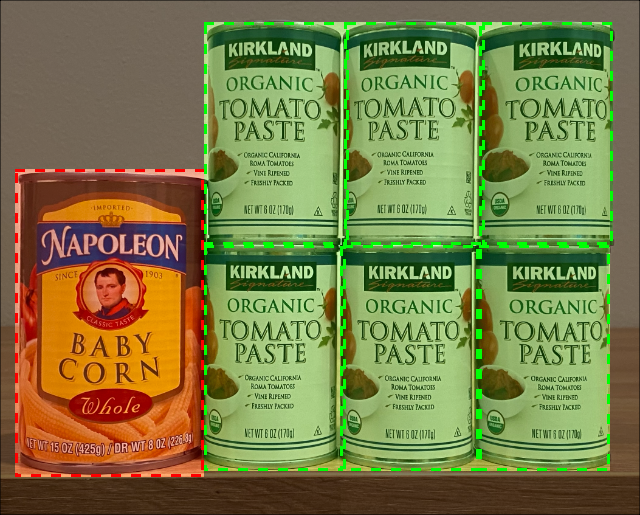

<!--
CO_OP_TRANSLATOR_METADATA:
{
  "original_hash": "1c9e5fa8b7be726c75a97232b1e41c97",
  "translation_date": "2025-08-24T21:09:55+00:00",
  "source_file": "5-retail/lessons/2-check-stock-device/README.md",
  "language_code": "ko"
}
-->
# IoT 기기를 사용한 재고 확인


> 스케치노트: [Nitya Narasimhan](https://github.com/nitya). 이미지를 클릭하면 더 큰 버전을 볼 수 있습니다.

## 강의 전 퀴즈

[강의 전 퀴즈](https://black-meadow-040d15503.1.azurestaticapps.net/quiz/39)

## 소개

이전 강의에서는 소매업에서 객체 감지의 다양한 활용 사례에 대해 배웠습니다. 또한 객체 감지기를 훈련시켜 재고를 식별하는 방법도 배웠습니다. 이번 강의에서는 IoT 기기에서 객체 감지기를 사용하여 재고를 계산하는 방법을 배웁니다.

이번 강의에서는 다음 내용을 다룹니다:

* [재고 계산](../../../../../5-retail/lessons/2-check-stock-device)
* [IoT 기기에서 객체 감지기 호출](../../../../../5-retail/lessons/2-check-stock-device)
* [바운딩 박스](../../../../../5-retail/lessons/2-check-stock-device)
* [모델 재훈련](../../../../../5-retail/lessons/2-check-stock-device)
* [재고 계산](../../../../../5-retail/lessons/2-check-stock-device)

> 🗑 이번 프로젝트의 마지막 강의입니다. 강의와 과제를 완료한 후에는 클라우드 서비스를 정리하는 것을 잊지 마세요. 과제를 완료하려면 서비스가 필요하니 먼저 과제를 완료하세요.
>
> 필요하다면 [프로젝트 정리 가이드](../../../clean-up.md)를 참조하여 정리 방법을 확인하세요.

## 재고 계산

객체 감지기는 재고 확인에 사용될 수 있습니다. 재고를 계산하거나 재고가 있어야 할 위치에 있는지 확인하는 데 활용됩니다. 카메라가 장착된 IoT 기기를 매장 곳곳에 배치하여 재고를 모니터링할 수 있습니다. 특히 소량의 고가 품목이 있는 중요한 구역부터 시작하면 좋습니다.

예를 들어, 카메라가 8개의 토마토 페이스트 캔을 보관할 수 있는 선반을 가리키고 있고 객체 감지기가 7개만 감지했다면 하나가 부족하다는 것을 알 수 있습니다.


위 이미지에서 객체 감지기는 선반에 있는 7개의 토마토 페이스트 캔을 감지했습니다. 선반은 8개의 캔을 보관할 수 있습니다. IoT 기기는 재고 보충이 필요하다는 알림을 보낼 수 있을 뿐만 아니라, 부족한 품목의 위치를 알려줄 수도 있습니다. 이는 로봇을 사용해 선반을 보충하는 경우 중요한 데이터가 됩니다.

> 💁 매장과 품목의 인기에 따라 캔이 하나만 부족한 경우에는 재고 보충이 이루어지지 않을 수도 있습니다. 품목, 고객 및 기타 기준에 따라 언제 재고를 보충할지 결정하는 알고리즘을 구축해야 합니다.

✅ 객체 감지와 로봇을 결합할 수 있는 다른 시나리오에는 어떤 것이 있을까요?

때로는 선반에 잘못된 재고가 있을 수 있습니다. 이는 재고를 보충하는 과정에서의 인간 실수일 수도 있고, 고객이 구매를 취소하고 품목을 아무 곳에나 놓아두는 경우일 수도 있습니다. 캔과 같은 비상하는 품목의 경우 이는 단순한 불편함일 수 있습니다. 하지만 냉동 또는 냉장 품목과 같은 상하는 품목의 경우, 품목이 냉동고 밖에 얼마나 오래 있었는지 알 수 없기 때문에 판매가 불가능해질 수 있습니다.

객체 감지는 예상치 못한 품목을 감지하는 데 사용될 수 있으며, 이를 통해 인간이나 로봇이 품목을 즉시 원래 위치로 되돌릴 수 있도록 알림을 보낼 수 있습니다.



위 이미지에서 베이비콘 캔이 토마토 페이스트 선반에 놓여 있습니다. 객체 감지기가 이를 감지하여 IoT 기기가 인간이나 로봇에게 캔을 올바른 위치로 되돌리도록 알릴 수 있습니다.

## IoT 기기에서 객체 감지기 호출

이전 강의에서 훈련한 객체 감지기를 IoT 기기에서 호출할 수 있습니다.

### 작업 - 객체 감지기의 반복 버전 게시

Custom Vision 포털에서 반복 버전을 게시합니다.

1. [CustomVision.ai](https://customvision.ai)에서 Custom Vision 포털을 열고 로그인합니다. 이미 열려 있지 않다면 열어주세요. 그런 다음 `stock-detector` 프로젝트를 엽니다.

1. 상단 옵션에서 **Performance** 탭을 선택합니다.

1. 측면의 *Iterations* 목록에서 최신 반복 버전을 선택합니다.

1. 반복 버전의 **Publish** 버튼을 선택합니다.

    

1. *Publish Model* 대화 상자에서 *Prediction resource*를 이전 강의에서 생성한 `stock-detector-prediction` 리소스로 설정합니다. 이름은 `Iteration2`로 유지하고 **Publish** 버튼을 선택합니다.

1. 게시가 완료되면 **Prediction URL** 버튼을 선택합니다. 여기에서 예측 API의 세부 정보를 확인할 수 있으며, IoT 기기에서 모델을 호출할 때 필요합니다. 하단 섹션은 *If you have an image file*로 표시되어 있으며, 필요한 세부 정보가 포함되어 있습니다. 다음과 같은 URL을 복사하세요:

    ```output
    https://<location>.api.cognitive.microsoft.com/customvision/v3.0/Prediction/<id>/detect/iterations/Iteration2/image
    ```

    여기서 `<location>`은 Custom Vision 리소스를 생성할 때 사용한 위치이며, `<id>`는 문자와 숫자로 이루어진 긴 ID입니다.

    또한 *Prediction-Key* 값을 복사하세요. 이는 모델을 호출할 때 전달해야 하는 보안 키입니다. 이 키를 전달하는 애플리케이션만 모델을 사용할 수 있으며, 다른 애플리케이션은 거부됩니다.

    

✅ 새로운 반복 버전이 게시되면 이름이 달라집니다. IoT 기기가 사용하는 반복 버전을 변경하려면 어떻게 해야 할까요?

### 작업 - IoT 기기에서 객체 감지기 호출

아래의 관련 가이드를 따라 IoT 기기에서 객체 감지기를 사용하세요:

* [Arduino - Wio Terminal](wio-terminal-object-detector.md)
* [싱글보드 컴퓨터 - Raspberry Pi/가상 기기](single-board-computer-object-detector.md)

## 바운딩 박스

객체 감지기를 사용할 때, 감지된 객체의 태그와 확률뿐만 아니라 객체의 바운딩 박스도 반환됩니다. 바운딩 박스는 객체 감지기가 특정 확률로 객체를 감지한 영역을 정의합니다.

> 💁 바운딩 박스는 감지된 객체를 포함하는 영역을 정의하는 상자입니다. 객체의 경계를 나타냅니다.

Custom Vision의 **Predictions** 탭에서 예측 결과는 예측을 위해 전송된 이미지에 바운딩 박스가 그려져 있습니다.


위 이미지에서 4개의 토마토 페이스트 캔이 감지되었습니다. 결과에는 감지된 각 객체에 대해 빨간색 사각형이 이미지에 오버레이되어 바운딩 박스를 나타냅니다.

✅ Custom Vision에서 예측을 열어 바운딩 박스를 확인하세요.

바운딩 박스는 4개의 값으로 정의됩니다 - top, left, height, width. 이 값들은 0-1의 비율로 표현되며, 이미지 크기의 백분율로 위치를 나타냅니다. 원점(0,0 위치)은 이미지의 왼쪽 상단이므로 top 값은 상단에서의 거리, 바운딩 박스의 하단은 top 값에 height를 더한 값입니다.


위 이미지는 너비가 600픽셀, 높이가 800픽셀입니다. 바운딩 박스는 320픽셀 아래에서 시작하며, top 좌표는 0.4입니다(800 x 0.4 = 320). 왼쪽에서 바운딩 박스는 240픽셀에서 시작하며, left 좌표는 0.4입니다(600 x 0.4 = 240). 바운딩 박스의 높이는 240픽셀로, height 값은 0.3입니다(800 x 0.3 = 240). 바운딩 박스의 너비는 120픽셀로, width 값은 0.2입니다(600 x 0.2 = 120).

| 좌표       | 값    |
| ---------- | ----: |
| Top        | 0.4   |
| Left       | 0.4   |
| Height     | 0.3   |
| Width      | 0.2   |

0-1의 비율 값을 사용하면 이미지 크기가 어떻게 조정되든 바운딩 박스는 항상 0.4만큼 아래와 옆으로 시작하며, 높이는 0.3, 너비는 0.2로 유지됩니다.

바운딩 박스와 확률을 결합하여 감지의 정확성을 평가할 수 있습니다. 예를 들어, 객체 감지기가 겹치는 여러 객체를 감지할 수 있습니다. 예를 들어 하나의 캔이 다른 캔 안에 있는 것으로 감지될 수 있습니다. 코드는 바운딩 박스를 확인하고, 이것이 불가능하다는 것을 이해하여 다른 객체와 크게 겹치는 객체를 무시할 수 있습니다.


위 예에서 하나의 바운딩 박스는 78.3% 확률로 토마토 페이스트 캔을 예측했습니다. 두 번째 바운딩 박스는 약간 작으며 첫 번째 바운딩 박스 내부에 있으며 확률은 64.3%입니다. 코드는 바운딩 박스를 확인하고, 두 바운딩 박스가 완전히 겹친다는 것을 확인하여 낮은 확률을 무시할 수 있습니다. 캔이 다른 캔 안에 있을 수는 없기 때문입니다.

✅ 객체가 다른 객체 안에 있는 것이 유효한 상황은 어떤 경우일까요?

## 모델 재훈련

이미지 분류기와 마찬가지로 IoT 기기에서 캡처한 데이터를 사용하여 모델을 재훈련할 수 있습니다. 실제 데이터를 사용하면 IoT 기기에서 모델이 잘 작동하도록 보장할 수 있습니다.

이미지 분류기와는 달리 이미지를 태그로만 표시할 수는 없습니다. 대신 모델이 감지한 모든 바운딩 박스를 검토해야 합니다. 박스가 잘못된 객체를 감싸고 있다면 삭제해야 하고, 위치가 잘못되었다면 조정해야 합니다.

### 작업 - 모델 재훈련

1. IoT 기기를 사용하여 다양한 이미지를 캡처했는지 확인하세요.

1. **Predictions** 탭에서 이미지를 선택합니다. 감지된 객체의 바운딩 박스가 빨간색으로 표시됩니다.

1. 각 바운딩 박스를 검토합니다. 먼저 바운딩 박스를 선택하면 태그가 표시된 팝업이 나타납니다. 필요하다면 바운딩 박스의 모서리 핸들을 사용하여 크기를 조정하세요. 태그가 잘못되었다면 **X** 버튼을 사용하여 제거하고 올바른 태그를 추가하세요. 바운딩 박스가 객체를 포함하지 않는 경우 휴지통 버튼을 사용하여 삭제하세요.

1. 편집을 완료하면 이미지는 **Predictions** 탭에서 **Training Images** 탭으로 이동합니다. 모든 예측에 대해 이 과정을 반복하세요.

1. **Train** 버튼을 사용하여 모델을 재훈련합니다. 훈련이 완료되면 반복 버전을 게시하고 IoT 기기가 새 반복 버전의 URL을 사용하도록 업데이트하세요.

1. 코드를 다시 배포하고 IoT 기기를 테스트하세요.

## 재고 계산

감지된 객체 수와 바운딩 박스를 조합하여 선반의 재고를 계산할 수 있습니다.

### 작업 - 재고 계산

아래의 관련 가이드를 따라 IoT 기기에서 객체 감지기의 결과를 사용하여 재고를 계산하세요:

* [Arduino - Wio Terminal](wio-terminal-count-stock.md)
* [싱글보드 컴퓨터 - Raspberry Pi/가상 기기](single-board-computer-count-stock.md)

---

## 🚀 도전 과제

잘못된 재고를 감지할 수 있나요? 여러 객체로 모델을 훈련한 후, 잘못된 재고가 감지되면 알림을 보내도록 앱을 업데이트하세요.

이를 더 발전시켜 같은 선반에 나란히 놓인 재고를 감지하고, 바운딩 박스의 제한을 정의하여 잘못된 위치에 놓인 품목을 확인해보세요.

## 강의 후 퀴즈

[강의 후 퀴즈](https://black-meadow-040d15503.1.azurestaticapps.net/quiz/40)

## 복습 및 자기 학습

* [Microsoft Docs의 Out of stock detection at the edge 패턴 가이드](https://docs.microsoft.com/hybrid/app-solutions/pattern-out-of-stock-at-edge?WT.mc_id=academic-17441-jabenn)를 통해 재고 감지 시스템을 끝에서 끝까지 설계하는 방법을 알아보세요.
* IoT와 클라우드 서비스를 결합하여 다양한 소매 솔루션을 구축하는 방법을 [Behind the scenes of a retail solution - Hands On! YouTube 영상](https://www.youtube.com/watch?v=m3Pc300x2Mw)을 통해 배워보세요.

## 과제

[엣지에서 객체 감지기 사용하기](assignment.md)

**면책 조항**:  
이 문서는 AI 번역 서비스 [Co-op Translator](https://github.com/Azure/co-op-translator)를 사용하여 번역되었습니다. 정확성을 위해 최선을 다하고 있지만, 자동 번역에는 오류나 부정확성이 포함될 수 있습니다. 원본 문서를 해당 언어로 작성된 상태에서 권위 있는 자료로 간주해야 합니다. 중요한 정보의 경우, 전문적인 인간 번역을 권장합니다. 이 번역 사용으로 인해 발생하는 오해나 잘못된 해석에 대해 당사는 책임을 지지 않습니다.