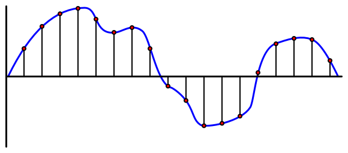

<!--
CO_OP_TRANSLATOR_METADATA:
{
  "original_hash": "6d6aa1be033625d201a190fc9c5cbfb4",
  "translation_date": "2025-08-25T00:22:01+00:00",
  "source_file": "6-consumer/lessons/1-speech-recognition/README.md",
  "language_code": "ko"
}
-->
# IoT 기기로 음성 인식하기


> 스케치노트: [Nitya Narasimhan](https://github.com/nitya). 이미지를 클릭하면 더 큰 버전을 볼 수 있습니다.

이 비디오는 Azure 음성 서비스에 대한 개요를 제공하며, 이 강의에서 다룰 주제입니다:

[](https://www.youtube.com/watch?v=iW0Fw0l3mrA)

> 🎥 위 이미지를 클릭하여 비디오를 시청하세요

## 강의 전 퀴즈

[강의 전 퀴즈](https://black-meadow-040d15503.1.azurestaticapps.net/quiz/41)

## 소개

'Alexa, 12분 타이머 설정해줘'

'Alexa, 타이머 상태 알려줘'

'Alexa, 브로콜리 찌기라는 이름으로 8분 타이머 설정해줘'

스마트 기기는 점점 더 널리 사용되고 있습니다. HomePod, Echo, Google Home 같은 스마트 스피커뿐만 아니라, 휴대폰, 손목시계, 심지어 조명 기구와 온도 조절 장치에도 내장되어 있습니다.

> 💁 제 집에는 음성 비서가 있는 기기가 최소 19개 있습니다. 제가 알고 있는 것만 해도 그렇습니다!

음성 제어는 손의 움직임이 제한된 사람들에게 기기를 조작할 수 있는 접근성을 제공합니다. 선천적으로 팔이 없는 경우와 같은 영구적인 장애부터 팔이 부러진 경우와 같은 일시적인 장애, 또는 쇼핑 가방이나 어린아이를 안고 있는 상황까지, 손 대신 음성으로 집을 제어할 수 있다는 것은 접근성을 크게 향상시킵니다. 예를 들어, 아기 기저귀를 갈고 말썽꾸러기 아이를 돌보는 동안 '헤이 Siri, 차고 문 닫아줘'라고 외치는 것은 삶을 조금 더 편리하게 만들어 줄 수 있습니다.

음성 비서의 가장 인기 있는 사용 사례 중 하나는 타이머 설정입니다. 특히 주방에서 여러 개의 타이머를 음성으로 설정할 수 있다는 것은 큰 도움이 됩니다. 반죽을 치거나, 수프를 저으며, 손에 묻은 만두 속을 닦을 필요 없이 물리적 타이머를 사용할 수 있습니다.

이 강의에서는 IoT 기기에 음성 인식 기능을 구축하는 방법을 배웁니다. 마이크를 센서로 사용하는 방법, IoT 기기에 연결된 마이크에서 오디오를 캡처하는 방법, 그리고 AI를 사용해 들은 내용을 텍스트로 변환하는 방법을 배우게 됩니다. 프로젝트를 진행하면서 여러 언어로 음성을 사용해 타이머를 설정할 수 있는 스마트 주방 타이머를 구축하게 됩니다.

이 강의에서 다룰 내용은 다음과 같습니다:

* [마이크](../../../../../6-consumer/lessons/1-speech-recognition)
* [IoT 기기에서 오디오 캡처](../../../../../6-consumer/lessons/1-speech-recognition)
* [음성을 텍스트로 변환](../../../../../6-consumer/lessons/1-speech-recognition)
* [음성 텍스트 변환](../../../../../6-consumer/lessons/1-speech-recognition)

## 마이크

마이크는 소리의 파동을 전기 신호로 변환하는 아날로그 센서입니다. 공기의 진동이 마이크 내부의 구성 요소를 미세하게 움직이게 하고, 이로 인해 전기 신호에 작은 변화가 생깁니다. 이러한 변화는 증폭되어 전기 출력으로 생성됩니다.

### 마이크 유형

마이크는 다양한 유형으로 제공됩니다:

* 다이내믹 - 다이내믹 마이크는 움직이는 다이어프램에 자석이 부착되어 있으며, 이 자석이 와이어 코일 안에서 움직이며 전류를 생성합니다. 이는 대부분의 스피커와 반대 작용을 합니다. 스피커는 전류를 사용해 자석을 움직이고, 다이어프램을 움직여 소리를 생성합니다. 따라서 스피커는 다이내믹 마이크로 사용할 수 있고, 다이내믹 마이크는 스피커로 사용할 수 있습니다. 예를 들어, 인터콤 같은 기기에서는 사용자가 듣거나 말하는 경우에 하나의 장치가 스피커와 마이크 역할을 모두 할 수 있습니다.

    다이내믹 마이크는 작동하기 위해 전원이 필요하지 않습니다. 전기 신호는 마이크 자체에서 생성됩니다.

    

* 리본 - 리본 마이크는 다이내믹 마이크와 유사하지만, 다이어프램 대신 금속 리본을 사용합니다. 이 리본은 자기장 안에서 움직이며 전류를 생성합니다. 다이내믹 마이크와 마찬가지로 리본 마이크도 작동하기 위해 전원이 필요하지 않습니다.

    

* 콘덴서 - 콘덴서 마이크는 얇은 금속 다이어프램과 고정된 금속 백플레이트를 가지고 있습니다. 두 구성 요소에 전기가 공급되며, 다이어프램이 진동할 때 두 판 사이의 정전하가 변화하여 신호를 생성합니다. 콘덴서 마이크는 작동하기 위해 전원이 필요하며, 이를 *팬텀 전원*이라고 합니다.

    

* MEMS - 마이크로전자기계 시스템 마이크, 또는 MEMS는 칩 위에 있는 마이크입니다. 실리콘 칩에 압력에 민감한 다이어프램이 새겨져 있으며, 콘덴서 마이크와 유사하게 작동합니다. 이 마이크는 매우 작으며 회로에 통합될 수 있습니다.

    

    위 이미지에서 **LEFT**로 표시된 칩은 MEMS 마이크로, 다이어프램의 크기가 1밀리미터도 되지 않습니다.

✅ 조사해보기: 컴퓨터, 휴대폰, 헤드셋 또는 기타 기기에서 어떤 종류의 마이크를 사용하고 있는지 확인해보세요. 이 마이크는 어떤 유형인가요?

### 디지털 오디오

오디오는 매우 세밀한 정보를 전달하는 아날로그 신호입니다. 이 신호를 디지털로 변환하려면 초당 수천 번 샘플링해야 합니다.

> 🎓 샘플링은 오디오 신호를 특정 시점의 디지털 값으로 변환하는 과정입니다.



디지털 오디오는 펄스 코드 변조(PCM)를 사용해 샘플링됩니다. PCM은 신호의 전압을 읽고, 정의된 크기를 사용해 해당 전압에 가장 가까운 이산 값을 선택하는 방식입니다.

> 💁 PCM은 펄스 폭 변조(PWM)의 센서 버전이라고 생각할 수 있습니다. (PWM은 [시작 프로젝트의 3강](../../../1-getting-started/lessons/3-sensors-and-actuators/README.md#pulse-width-modulation)에서 다뤘습니다). PCM은 아날로그 신호를 디지털로 변환하고, PWM은 디지털 신호를 아날로그로 변환합니다.

예를 들어, 대부분의 스트리밍 음악 서비스는 16비트 또는 24비트 오디오를 제공합니다. 이는 전압을 16비트 정수 또는 24비트 정수에 맞는 값으로 변환한다는 뜻입니다. 16비트 오디오는 -32,768에서 32,767 범위의 값을 사용하며, 24비트는 −8,388,608에서 8,388,607 범위를 사용합니다. 비트가 많을수록 샘플이 실제로 귀로 들리는 소리에 더 가까워집니다.

> 💁 8비트 오디오, 흔히 LoFi라고 불리는 오디오를 들어본 적이 있을 것입니다. 이는 8비트만 사용해 샘플링된 오디오로, -128에서 127 범위를 사용합니다. 초기 컴퓨터 오디오는 하드웨어 제한으로 인해 8비트로 제한되었으며, 이는 종종 레트로 게임에서 볼 수 있습니다.

이 샘플은 초당 수천 번의 고정된 샘플 속도로 측정됩니다. 샘플 속도는 KHz(초당 수천 번의 읽기)로 측정됩니다. 스트리밍 음악 서비스는 대부분 48KHz를 사용하지만, 일부 '무손실' 오디오는 최대 96KHz 또는 192KHz까지 사용합니다. 샘플 속도가 높을수록 원본 오디오에 가까워지지만, 일정 수준 이상은 인간이 차이를 느끼기 어렵다는 논쟁이 있습니다.

✅ 조사해보기: 스트리밍 음악 서비스를 사용하는 경우, 해당 서비스는 어떤 샘플 속도와 크기를 사용하나요? CD를 사용하는 경우, CD 오디오의 샘플 속도와 크기는 무엇인가요?

오디오 데이터에는 다양한 형식이 있습니다. mp3 파일은 품질을 유지하면서 데이터를 압축해 크기를 줄이는 방식으로 잘 알려져 있습니다. 압축되지 않은 오디오는 종종 WAV 파일로 저장됩니다. WAV 파일은 44바이트의 헤더 정보와 원시 오디오 데이터로 구성됩니다. 헤더에는 샘플 속도(예: 16000은 16KHz), 샘플 크기(16은 16비트), 채널 수 등의 정보가 포함됩니다. 헤더 뒤에는 원시 오디오 데이터가 저장됩니다.

> 🎓 채널은 오디오를 구성하는 서로 다른 스트림의 수를 나타냅니다. 예를 들어, 스테레오 오디오는 왼쪽과 오른쪽 채널로 구성되며, 2개의 채널이 있습니다. 홈 시어터 시스템의 7.1 서라운드 사운드는 8개의 채널을 가집니다.

### 오디오 데이터 크기

오디오 데이터는 상대적으로 크기가 큽니다. 예를 들어, 압축되지 않은 16비트 오디오를 16KHz로 캡처하면, 초당 32KB의 데이터가 필요합니다:

* 16비트는 샘플당 2바이트를 의미합니다(1바이트는 8비트).
* 16KHz는 초당 16,000개의 샘플을 의미합니다.
* 16,000 x 2바이트 = 초당 32,000바이트.

이 데이터 크기는 작아 보일 수 있지만, 메모리가 제한된 마이크로컨트롤러를 사용하는 경우에는 상당히 많은 양입니다. 예를 들어, Wio Terminal은 192KB의 메모리를 가지고 있으며, 이 메모리는 프로그램 코드와 변수도 저장해야 합니다. 프로그램 코드가 매우 작다고 하더라도 5초 이상의 오디오를 캡처할 수 없습니다.

마이크로컨트롤러는 SD 카드나 플래시 메모리 같은 추가 저장소에 접근할 수 있습니다. 오디오를 캡처하는 IoT 기기를 구축할 때는 추가 저장소를 확보하고, 마이크에서 캡처한 오디오를 코드가 직접 저장소에 기록하도록 해야 합니다. 클라우드로 데이터를 보낼 때는 저장소에서 웹 요청으로 스트리밍해야 합니다. 이렇게 하면 메모리에 전체 오디오 데이터를 한 번에 저장하려고 하다가 메모리가 부족해지는 문제를 방지할 수 있습니다.

## IoT 기기에서 오디오 캡처

IoT 기기는 마이크에 연결되어 오디오를 캡처할 수 있으며, 스피커에 연결되어 오디오를 출력할 수도 있습니다. 이후 강의에서는 오디오 피드백을 제공하기 위해 스피커를 사용할 예정이지만, 마이크를 테스트하기 위해 지금 스피커를 설정하는 것이 유용합니다.

### 작업 - 마이크와 스피커 설정

IoT 기기에 마이크와 스피커를 설정하기 위한 관련 가이드를 따라 진행하세요:

* [Arduino - Wio Terminal](wio-terminal-microphone.md)
* [싱글보드 컴퓨터 - Raspberry Pi](pi-microphone.md)
* [싱글보드 컴퓨터 - 가상 기기](virtual-device-microphone.md)

### 작업 - 오디오 캡처

IoT 기기에서 오디오를 캡처하기 위한 관련 가이드를 따라 진행하세요:

* [Arduino - Wio Terminal](wio-terminal-audio.md)
* [싱글보드 컴퓨터 - Raspberry Pi](pi-audio.md)
* [싱글보드 컴퓨터 - 가상 기기](virtual-device-audio.md)

## 음성을 텍스트로 변환

음성을 텍스트로 변환하는 음성 인식은 AI를 사용해 오디오 신호의 단어를 텍스트로 변환하는 과정입니다.

### 음성 인식 모델

음성을 텍스트로 변환하려면 오디오 신호의 샘플을 그룹화하여 순환 신경망(RNN)을 기반으로 한 머신 러닝 모델에 입력해야 합니다. RNN은 이전 데이터를 사용해 들어오는 데이터를 결정할 수 있는 머신 러닝 모델의 한 유형입니다. 예를 들어, RNN은 오디오 샘플의 한 블록을 'Hel' 소리로 감지하고, 다음 블록에서 'lo' 소리를 감지하면 이전 소리와 결합해 'Hello'가 유효한 단어임을 찾아 결과로 선택할 수 있습니다.

ML 모델은 항상 동일한 크기의 데이터를 처리해야 합니다. 이전 강의에서 만든 이미지 분류기는 이미지를 고정된 크기로 조정해 처리했습니다. 음성 모델도 마찬가지로 고정된 크기의 오디오 청크를 처리해야 합니다. 음성 모델은 여러 예측 결과를 결합해 답을 도출할 수 있어야 합니다. 이를 통해 'Hi'와 'Highway', 또는 'flock'과 'floccinaucinihilipilification'을 구분할 수 있습니다.

음성 모델은 또한 문맥을 이해할 수 있을 만큼 발전하여, 처리된 소리가 많아질수록 단어를 수정할 수 있습니다. 예를 들어, "I went to the shops to get two bananas and an apple too"라고 말하면, 'to', 'two', 'too'처럼 소리는 같지만 철자가 다른 세 단어를 사용하게 됩니다. 음성 모델은 문맥을 이해하고 적절한 철자를 선택할 수 있습니다.
💁 일부 음성 서비스는 공장과 같은 소음이 많은 환경이나 화학 물질 이름과 같은 산업별 용어에 더 잘 작동하도록 사용자 정의를 허용합니다. 이러한 사용자 정의는 샘플 오디오와 전사를 제공하여 훈련되며, 이전 강의에서 소수의 이미지만 사용하여 이미지 분류기를 훈련했던 것과 동일한 전이 학습을 사용하여 작동합니다.
### 개인정보 보호

소비자 IoT 기기에서 음성을 텍스트로 변환하는 기능을 사용할 때, 개인정보 보호는 매우 중요합니다. 이러한 기기들은 지속적으로 오디오를 듣고 있기 때문에, 소비자로서 당신이 말하는 모든 것이 클라우드로 전송되어 텍스트로 변환되는 것을 원치 않을 것입니다. 이는 많은 인터넷 대역폭을 사용할 뿐만 아니라, 특히 일부 스마트 기기 제조업체가 [모델 개선을 위해 생성된 텍스트와 비교하도록 무작위로 오디오를 선택하여 사람이 검증하도록 하는 경우](https://www.theverge.com/2019/4/10/18305378/amazon-alexa-ai-voice-assistant-annotation-listen-private-recordings) 엄청난 개인정보 문제를 야기할 수 있습니다.

스마트 기기가 당신이 실제로 사용할 때만 오디오를 클라우드로 전송하길 원하며, 집에서 들리는 오디오(예: 사적인 회의나 친밀한 대화)가 전송되지 않기를 바랍니다. 대부분의 스마트 기기는 *웨이크 워드*라는 키워드(예: "Alexa", "Hey Siri", "OK Google")를 사용하여 작동합니다. 이 키워드는 기기가 '깨어나' 사용자가 말하는 내용을 듣기 시작하게 하며, 사용자가 말을 멈췄음을 감지할 때까지 듣습니다.

> 🎓 웨이크 워드 감지는 *키워드 스포팅* 또는 *키워드 인식*이라고도 합니다.

이러한 웨이크 워드는 클라우드가 아닌 기기에서 감지됩니다. 스마트 기기에는 웨이크 워드를 듣기 위해 기기에서 실행되는 작은 AI 모델이 탑재되어 있으며, 웨이크 워드가 감지되면 오디오를 클라우드로 스트리밍하여 인식을 시작합니다. 이러한 모델은 매우 특화되어 있으며, 웨이크 워드만 감지합니다.

> 💁 일부 기술 회사들은 기기에 더 많은 개인정보 보호 기능을 추가하고, 음성을 텍스트로 변환하는 작업을 기기에서 처리하고 있습니다. Apple은 2021년 iOS 및 macOS 업데이트의 일환으로 기기에서 음성을 텍스트로 변환하고, 클라우드를 사용하지 않고도 많은 요청을 처리할 수 있는 기능을 지원한다고 발표했습니다. 이는 기기 내 강력한 프로세서가 ML 모델을 실행할 수 있기 때문입니다.

✅ 클라우드로 전송된 오디오를 저장하는 것의 개인정보 및 윤리적 영향을 어떻게 생각하시나요? 이 오디오를 저장해야 한다면, 어떻게 저장해야 할까요? 법 집행을 위해 녹음을 사용하는 것이 개인정보 침해에 대한 적절한 대가라고 생각하시나요?

웨이크 워드 감지는 일반적으로 TinyML이라는 기술을 사용합니다. 이는 ML 모델을 마이크로컨트롤러에서 실행할 수 있도록 변환하는 기술입니다. 이러한 모델은 크기가 작고, 실행에 필요한 전력도 매우 적습니다.

웨이크 워드 모델을 훈련시키고 사용하는 복잡성을 피하기 위해, 이번 강의에서 제작할 스마트 타이머는 버튼을 사용하여 음성 인식을 활성화합니다.

> 💁 Wio Terminal 또는 Raspberry Pi에서 실행할 웨이크 워드 감지 모델을 만들고 싶다면, [Edge Impulse의 음성 응답 튜토리얼](https://docs.edgeimpulse.com/docs/responding-to-your-voice)을 확인해보세요. 컴퓨터를 사용하고 싶다면, [Microsoft Docs의 Custom Keyword 빠른 시작 가이드](https://docs.microsoft.com/azure/cognitive-services/speech-service/keyword-recognition-overview?WT.mc_id=academic-17441-jabenn)를 참고하세요.

## 음성을 텍스트로 변환하기


이전 프로젝트에서 이미지 분류를 했던 것처럼, 음성을 오디오 파일로 받아 텍스트로 변환할 수 있는 사전 구축된 AI 서비스가 있습니다. 그 중 하나가 Cognitive Services의 일부인 Speech Service로, 앱에서 사용할 수 있는 사전 구축된 AI 서비스입니다.

### 작업 - 음성 AI 리소스 구성하기

1. 이 프로젝트를 위한 `smart-timer`라는 리소스 그룹을 생성하세요.

1. 다음 명령어를 사용하여 무료 음성 리소스를 생성하세요:

    ```sh
    az cognitiveservices account create --name smart-timer \
                                        --resource-group smart-timer \
                                        --kind SpeechServices \
                                        --sku F0 \
                                        --yes \
                                        --location <location>
    ```

    `<location>`을 리소스 그룹을 생성할 때 사용한 위치로 대체하세요.

1. 코드에서 음성 리소스에 접근하려면 API 키가 필요합니다. 다음 명령어를 실행하여 키를 가져오세요:

    ```sh
    az cognitiveservices account keys list --name smart-timer \
                                           --resource-group smart-timer \
                                           --output table
    ```

    키 중 하나를 복사해 두세요.

### 작업 - 음성을 텍스트로 변환하기

IoT 기기에서 음성을 텍스트로 변환하는 관련 가이드를 따라 작업하세요:

* [Arduino - Wio Terminal](wio-terminal-speech-to-text.md)
* [싱글보드 컴퓨터 - Raspberry Pi](pi-speech-to-text.md)
* [싱글보드 컴퓨터 - 가상 기기](virtual-device-speech-to-text.md)

---

## 🚀 도전 과제

음성 인식 기술은 오랜 역사를 가지고 있으며, 지속적으로 발전하고 있습니다. 현재 기술의 능력을 조사하고, 시간이 지남에 따라 어떻게 발전해왔는지 비교해보세요. 기계의 음성 전사 정확도가 인간과 비교했을 때 어떤 수준인지도 살펴보세요.

음성 인식의 미래는 어떻게 될 것이라고 생각하시나요?

## 강의 후 퀴즈

[강의 후 퀴즈](https://black-meadow-040d15503.1.azurestaticapps.net/quiz/42)

## 복습 및 자기 학습

* 다양한 마이크 유형과 작동 방식에 대해 [Musician's HQ의 동적 마이크와 콘덴서 마이크의 차이점](https://musicianshq.com/whats-the-difference-between-dynamic-and-condenser-microphones/)을 읽어보세요.
* Cognitive Services의 음성 서비스에 대해 더 알아보려면 [Microsoft Docs의 음성 서비스 문서](https://docs.microsoft.com/azure/cognitive-services/speech-service/?WT.mc_id=academic-17441-jabenn)를 읽어보세요.
* 키워드 감지에 대해 더 알아보려면 [Microsoft Docs의 키워드 인식 문서](https://docs.microsoft.com/azure/cognitive-services/speech-service/keyword-recognition-overview?WT.mc_id=academic-17441-jabenn)를 참고하세요.

## 과제

[](assignment.md)

**면책 조항**:  
이 문서는 AI 번역 서비스 [Co-op Translator](https://github.com/Azure/co-op-translator)를 사용하여 번역되었습니다. 정확성을 위해 최선을 다하고 있지만, 자동 번역에는 오류나 부정확성이 포함될 수 있습니다. 원본 문서를 해당 언어로 작성된 상태에서 권위 있는 자료로 간주해야 합니다. 중요한 정보의 경우, 전문적인 인간 번역을 권장합니다. 이 번역 사용으로 인해 발생하는 오해나 잘못된 해석에 대해 당사는 책임을 지지 않습니다.