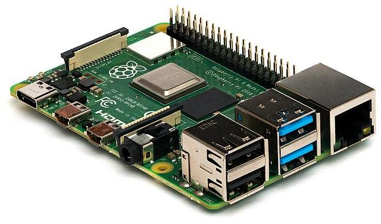

<!--
CO_OP_TRANSLATOR_METADATA:
{
  "original_hash": "9bae08314d8487cb76ddf3d8797e1544",
  "translation_date": "2025-08-28T19:59:59+00:00",
  "source_file": "1-getting-started/lessons/1-introduction-to-iot/README.md",
  "language_code": "lt"
}
-->
# Įvadas į IoT

> Sketchnote sukūrė [Nitya Narasimhan](https://github.com/nitya). Spustelėkite paveikslėlį, kad pamatytumėte didesnę versiją.

Ši pamoka buvo dėstoma kaip dalis [Hello IoT serijos](https://youtube.com/playlist?list=PLmsFUfdnGr3xRts0TIwyaHyQuHaNQcb6-) iš [Microsoft Reactor](https://developer.microsoft.com/reactor/?WT.mc_id=academic-17441-jabenn). Pamoka buvo pateikta per 2 vaizdo įrašus – 1 valandos pamoka ir 1 valandos konsultacija, kurioje gilinamasi į pamokos dalis ir atsakoma į klausimus.

> 🎥 Spustelėkite aukščiau esančius paveikslėlius, kad peržiūrėtumėte vaizdo įrašus

## Klausimynas prieš pamoką

[Klausimynas prieš pamoką](https://black-meadow-040d15503.1.azurestaticapps.net/quiz/1)

## Įvadas

Šioje pamokoje aptariamos pagrindinės temos apie daiktų internetą (IoT) ir pateikiami pirmieji žingsniai, kaip paruošti savo įrangą.

Šioje pamokoje aptarsime:

* [Kas yra „Daiktų internetas“?](../../../../../1-getting-started/lessons/1-introduction-to-iot)
* [IoT įrenginiai](../../../../../1-getting-started/lessons/1-introduction-to-iot)
* [Įrenginio paruošimas](../../../../../1-getting-started/lessons/1-introduction-to-iot)
* [IoT pritaikymo sritys](../../../../../1-getting-started/lessons/1-introduction-to-iot)
* [IoT įrenginių pavyzdžiai aplink jus](../../../../../1-getting-started/lessons/1-introduction-to-iot)

## Kas yra „Daiktų internetas“?

Terminą „Daiktų internetas“ 1999 m. sugalvojo [Kevinas Ashtonas](https://wikipedia.org/wiki/Kevin_Ashton), norėdamas apibūdinti interneto sujungimą su fiziniu pasauliu per jutiklius. Nuo tada šis terminas buvo naudojamas apibūdinti bet kokį įrenginį, kuris sąveikauja su aplinkiniu fiziniu pasauliu, arba rinkdamas duomenis iš jutiklių, arba atlikdamas realaus pasaulio veiksmus per aktuatorius (įrenginius, kurie atlieka veiksmus, pvz., įjungia jungiklį ar uždega LED lemputę), paprastai sujungtus su kitais įrenginiais ar internetu.

> **Jutikliai** renka informaciją iš pasaulio, pvz., matuoja greitį, temperatūrą ar vietą.
>
> **Aktuatoriai** paverčia elektrinius signalus į realaus pasaulio veiksmus, pvz., įjungia jungiklį, uždega šviesas, skleidžia garsus arba siunčia valdymo signalus kitiems įrenginiams, pvz., įjungia elektros lizdą.

IoT kaip technologijų sritis apima ne tik įrenginius – ji apima debesų paslaugas, kurios gali apdoroti jutiklių duomenis arba siųsti užklausas aktuatoriams, prijungtiems prie IoT įrenginių. Ji taip pat apima įrenginius, kurie neturi arba nereikalauja interneto ryšio, dažnai vadinamus „kraštiniais įrenginiais“. Tai yra įrenginiai, kurie gali patys apdoroti ir reaguoti į jutiklių duomenis, paprastai naudodami debesyje apmokytus AI modelius.

IoT yra sparčiai auganti technologijų sritis. Apskaičiuota, kad iki 2020 m. pabaigos buvo įdiegta ir prijungta prie interneto 30 milijardų IoT įrenginių. Žvelgiant į ateitį, prognozuojama, kad iki 2025 m. IoT įrenginiai surinks beveik 80 zettabaitų duomenų arba 80 trilijonų gigabaitų. Tai labai daug duomenų!

✅ Atlikite nedidelį tyrimą: Kiek duomenų, surinktų IoT įrenginių, iš tikrųjų yra naudojama, o kiek yra iššvaistoma? Kodėl tiek daug duomenų yra ignoruojama?

Šie duomenys yra IoT sėkmės pagrindas. Norėdami tapti sėkmingu IoT kūrėju, turite suprasti, kokius duomenis reikia rinkti, kaip juos rinkti, kaip priimti sprendimus remiantis jais ir, jei reikia, kaip naudoti tuos sprendimus sąveikai su fiziniu pasauliu.

## IoT įrenginiai

**T** IoT reiškia **Daiktus** – įrenginius, kurie sąveikauja su aplinkiniu fiziniu pasauliu, arba rinkdami duomenis iš jutiklių, arba atlikdami realaus pasaulio veiksmus per aktuatorius.

Įrenginiai, skirti gamybai ar komerciniam naudojimui, pvz., vartotojų fitneso sekimo įrenginiai ar pramoniniai mašinų valdikliai, paprastai yra specialiai sukurti. Jie naudoja specialias grandines, galbūt net specialius procesorius, sukurtus tam tikram užduočių poreikiui, nesvarbu, ar tai būtų pakankamai mažas dydis, kad tilptų ant riešo, ar pakankamai tvirtas, kad veiktų aukštos temperatūros, didelės apkrovos ar didelės vibracijos gamyklos aplinkoje.

Kaip kūrėjas, kuris mokosi apie IoT arba kuria įrenginio prototipą, turėsite pradėti nuo kūrėjų rinkinio. Tai yra bendros paskirties IoT įrenginiai, skirti kūrėjams naudoti, dažnai su funkcijomis, kurių nebūtų gamybos įrenginyje, pvz., išoriniais kaiščiais, skirtais prijungti jutiklius ar aktuatorius, aparatinę įrangą, palaikančią derinimą, arba papildomus išteklius, kurie pridėtų nereikalingų išlaidų didelės gamybos metu.

Šie kūrėjų rinkiniai paprastai skirstomi į dvi kategorijas – mikrovaldiklius ir vieno plokštės kompiuterius. Jie bus pristatyti čia, o kitame pamokoje bus aptarti išsamiau.

> 💁 Jūsų telefonas taip pat gali būti laikomas bendros paskirties IoT įrenginiu, turinčiu įmontuotus jutiklius ir aktuatorius, su skirtingomis programomis, naudojančiomis jutiklius ir aktuatorius skirtingais būdais su skirtingomis debesų paslaugomis. Kai kurie IoT mokymai netgi naudoja telefono programėlę kaip IoT įrenginį.

### Mikrovaldikliai

Mikrovaldiklis (taip pat vadinamas MCU, trumpinys nuo mikrovaldiklio vieneto) yra mažas kompiuteris, sudarytas iš:

🧠 Vieno ar daugiau centrinio procesoriaus (CPU) – mikrovaldiklio „smegenys“, kurios vykdo jūsų programą

💾 Atminties (RAM ir programos atminties) – kur saugoma jūsų programa, duomenys ir kintamieji

🔌 Programuojamų įvesties/išvesties (I/O) jungčių – skirtų bendrauti su išoriniais periferiniais įrenginiais (prijungtais įrenginiais), pvz., jutikliais ir aktuatoriais

Mikrovaldikliai paprastai yra nebrangūs kompiuteriniai įrenginiai, kurių vidutinė kaina, naudojama specialiai sukurtoje aparatinėje įrangoje, sumažėja iki maždaug 0,50 USD, o kai kurie įrenginiai kainuoja vos 0,03 USD. Kūrėjų rinkiniai gali prasidėti nuo 4 USD, o kaina kyla, kai pridedama daugiau funkcijų. [Wio Terminal](https://www.seeedstudio.com/Wio-Terminal-p-4509.html), mikrovaldiklio kūrėjų rinkinys iš [Seeed studios](https://www.seeedstudio.com), turintis jutiklius, aktuatorius, WiFi ir ekraną, kainuoja apie 30 USD.

> 💁 Ieškodami mikrovaldiklių internete, būkite atsargūs ieškodami termino **MCU**, nes tai gali grąžinti daug rezultatų apie „Marvel Cinematic Universe“, o ne mikrovaldiklius.

Mikrovaldikliai yra sukurti vykdyti ribotą skaičių labai specifinių užduočių, o ne būti bendros paskirties kompiuteriais, tokiais kaip PC ar Mac. Išskyrus labai specifinius scenarijus, negalite prijungti monitoriaus, klaviatūros ir pelės ir naudoti jų bendros paskirties užduotims.

Mikrovaldiklių kūrėjų rinkiniai paprastai turi papildomus įmontuotus jutiklius ir aktuatorius. Dauguma plokščių turės vieną ar daugiau programuojamų LED, kartu su kitais įrenginiais, pvz., standartiniais kištukais, skirtais pridėti daugiau jutiklių ar aktuatorių naudojant įvairių gamintojų ekosistemas arba įmontuotus jutiklius (paprastai populiariausius, pvz., temperatūros jutiklius). Kai kurie mikrovaldikliai turi įmontuotą belaidį ryšį, pvz., „Bluetooth“ ar „WiFi“, arba papildomus mikrovaldiklius plokštėje, kad pridėtų šį ryšį.

> 💁 Mikrovaldikliai paprastai programuojami naudojant C/C++.

### Vieno plokštės kompiuteriai

Vieno plokštės kompiuteris yra mažas kompiuterinis įrenginys, turintis visus pilno kompiuterio elementus vienoje mažoje plokštėje. Tai yra įrenginiai, kurių specifikacijos yra artimos staliniams ar nešiojamiesiems kompiuteriams, veikia pilna operacinė sistema, tačiau yra mažesni, naudoja mažiau energijos ir yra žymiai pigesni.

„Raspberry Pi“ yra vienas populiariausių vieno plokštės kompiuterių.

Kaip ir mikrovaldiklis, vieno plokštės kompiuteriai turi CPU, atmintį ir įvesties/išvesties kaiščius, tačiau jie turi papildomų funkcijų, pvz., grafikos lustą, leidžiantį prijungti monitorius, garso išvestis ir USB prievadus, skirtus prijungti klaviatūras, peles ir kitus standartinius USB įrenginius, pvz., internetines kameras ar išorinę atmintį. Programos saugomos SD kortelėse arba kietuosiuose diskuose kartu su operacine sistema, o ne atminties lustu, įmontuotu į plokštę.

> 🎓 Vieno plokštės kompiuterį galite laikyti mažesne, pigesne PC ar Mac versija, kurią skaitote dabar, su papildomais GPIO (bendros paskirties įvesties/išvesties) kaiščiais, skirtais sąveikai su jutikliais ir aktuatoriais.

Vieno plokštės kompiuteriai yra pilnai funkcionalūs kompiuteriai, todėl juos galima programuoti bet kuria kalba. IoT įrenginiai paprastai programuojami naudojant Python.

### Aparatinės įrangos pasirinkimas likusioms pamokoms

Visos vėlesnės pamokos apima užduotis, naudojant IoT įrenginį sąveikai su fiziniu pasauliu ir komunikacijai su debesimi. Kiekviena pamoka palaiko 3 įrenginių pasirinkimus – Arduino (naudojant Seeed Studios Wio Terminal), arba vieno plokštės kompiuterį, fizinį įrenginį (Raspberry Pi 4) arba virtualų vieno plokštės kompiuterį, veikiantį jūsų PC ar Mac.

Apie aparatinę įrangą, reikalingą visoms užduotims atlikti, galite perskaityti [aparatinės įrangos vadove](../../../hardware.md).

> 💁 Jums nereikia pirkti jokios IoT aparatinės įrangos, kad atliktumėte užduotis, viską galite atlikti naudodami virtualų vieno plokštės kompiuterį.

Kokį aparatinės įrangos variantą pasirinkti, priklauso nuo to, ką turite namuose ar mokykloje, ir kokią programavimo kalbą žinote arba planuojate išmokti. Abu aparatinės įrangos variantai naudos tą pačią jutiklių ekosistemą, todėl, jei pradėsite vieną kelią, galėsite pereiti prie kito, nepakeisdami daugumos rinkinio. Virtualus vieno plokštės kompiuteris bus lygiavertis mokymuisi su Raspberry Pi, o dauguma kodo bus perkeliamas į Pi, jei galiausiai įsigysite įrenginį ir jutiklius.

### Arduino kūrėjų rinkinys

Jei jus domina mikrovaldiklių kūrimas, užduotis galite atlikti naudodami Arduino įrenginį. Jums reikės pagrindinių C/C++ programavimo žinių, nes pamokose bus mokoma tik kodo, susijusio su Arduino sistema, naudojamais jutikliais ir aktuatoriais bei bibliotekomis, kurios sąveikauja su debesimi.

Užduotims atlikti bus naudojama [Visual Studio Code](https://code.visualstudio.com/?WT.mc_id=academic-17441-jabenn) su [PlatformIO plėtiniu mikrovaldiklių kūrimui](https://platformio.org). Taip pat galite naudoti Arduino IDE, jei turite patirties su šiuo įrankiu, nes instrukcijos nebus pateiktos.

### Vieno plokštės kompiuterio kūrėjų rinkinys

Jei jus domina IoT kūrimas naudojant vieno plokštės kompiuterius, užduotis galite atlikti naudodami Raspberry Pi arba virtualų įrenginį, veikiantį jūsų PC ar Mac.

Jums reikės pagrindinių Python programavimo žinių, nes pamokose bus mokoma tik kodo, susijusio su naudojamais jutikliais ir aktuatoriais bei bibliotekomis, kurios sąveikauja su debesimi.

> 💁 Jei norite išmokti programuoti Python, peržiūrėkite šias dvi vaizdo serijas:
>
> * [Python pradedantiesiems](https://channel9.msdn.com/Series/Intro-to-Python-Development?WT.mc_id=academic-17441-jabenn)
> * [Daugiau Python pradedantiesiems](https://channel9.msdn.com/Series/More-Python-for-Beginners?WT.mc_id=academic-7372-jabenn)

Užduotims atlikti bus naudojama [Visual Studio Code](https://code.visualstudio.com/?WT.mc_id=academic-17441-jabenn).

Jei naudojate Raspberry Pi, galite arba paleisti Pi naudodami pilną Raspberry Pi OS darbalaukio versiją ir visą kodavimą atlikti tiesiogiai Pi, naudodami [Raspberry Pi OS versiją VS Code](https://code.visualstudio.com/docs/setup/raspberry-pi?WT.mc_id=academic-17441-jabenn), arba paleisti Pi kaip „be galvos“ įrenginį ir koduoti iš savo PC ar Mac, naudodami VS Code su [Remote SSH plėtiniu](https://code.visualstudio.com/docs/remote/ssh?WT.mc_id=academic-17441-jabenn), kuris leidžia prisijungti prie Pi ir redaguoti, derinti bei vykdyti kodą taip, tarsi koduotumėte tiesiogiai jame.

Jei naudojate virtualų įrenginį, koduosite tiesiogiai savo kompiuteryje. Vietoj jutiklių ir aktuatorių naudosite įrankį, kuris simuliuos šią aparatinę įrangą, pateikdamas jutiklių reikšmes, kurias galite apibrėžti, ir ekrane rodydamas aktuatorių rezultatus.

## Įrenginio paruošimas

Prieš pradėdami programuoti savo IoT įrenginį,
💁 Jei dar neturite įrenginio, peržiūrėkite [aparatinės įrangos vadovą](../../../hardware.md), kuris padės nuspręsti, kokį įrenginį naudoti ir kokią papildomą aparatinę įrangą reikia įsigyti. Jums nereikia pirkti aparatinės įrangos, nes visi projektai gali būti vykdomi virtualioje aplinkoje.
Šios instrukcijos apima nuorodas į trečiųjų šalių svetaines, susijusias su įranga ar įrankiais, kuriuos naudosite. Tai užtikrina, kad visada turėsite naujausias instrukcijas įvairiems įrankiams ir įrangai.

Peržiūrėkite atitinkamą vadovą, kad nustatytumėte savo įrenginį ir užbaigtumėte „Hello World“ projektą. Tai bus pirmasis žingsnis kuriant IoT naktinę lemputę per 4 pamokas šioje pradedančiųjų dalyje.

* [Arduino - Wio Terminal](wio-terminal.md)
* [Vieno plokštės kompiuteris - Raspberry Pi](pi.md)
* [Vieno plokštės kompiuteris - Virtualus įrenginys](virtual-device.md)

✅ Naudosite VS Code tiek Arduino, tiek vieno plokštės kompiuteriams. Jei dar nesate jo naudoję, daugiau informacijos rasite [VS Code svetainėje](https://code.visualstudio.com?WT.mc_id=academic-17441-jabenn).

## IoT taikymo sritys

IoT apima daugybę naudojimo atvejų, suskirstytų į kelias plačias grupes:

* Vartotojų IoT
* Komercinis IoT
* Pramoninis IoT
* Infrastruktūrinis IoT

✅ Šiek tiek pasidomėkite: Kiekvienai iš žemiau aprašytų sričių raskite vieną konkretų pavyzdį, kuris nėra pateiktas tekste.

### Vartotojų IoT

Vartotojų IoT apima IoT įrenginius, kuriuos vartotojai perka ir naudoja namuose. Kai kurie iš šių įrenginių yra labai naudingi, pavyzdžiui, išmanieji garsiakalbiai, išmaniosios šildymo sistemos ir robotai dulkių siurbliai. Kiti yra abejotini dėl savo naudingumo, pavyzdžiui, balsu valdomi čiaupai, kurių negalite išjungti, nes balsų kontrolė negirdi jūsų per tekančio vandens garsą.

Vartotojų IoT įrenginiai suteikia žmonėms galimybę pasiekti daugiau savo aplinkoje, ypač 1 milijardui žmonių, turinčių negalią. Robotai dulkių siurbliai gali užtikrinti švarius grindis žmonėms, turintiems judėjimo problemų, kurie negali patys siurbti, balsu valdomos orkaitės leidžia žmonėms su ribotu regėjimu ar motorine kontrole šildyti orkaites tik balsu, sveikatos stebėjimo įrenginiai leidžia pacientams stebėti lėtines ligas su dažnesniais ir detalesniais atnaujinimais apie jų būklę. Šie įrenginiai tampa tokie įprasti, kad net maži vaikai juos naudoja kasdien, pavyzdžiui, mokiniai, besimokantys nuotoliniu būdu COVID pandemijos metu, nustato laikmačius išmaniuosiuose namų įrenginiuose, kad stebėtų savo mokymosi laiką ar priminimus apie artėjančius pamokų susitikimus.

✅ Kokius vartotojų IoT įrenginius turite savo namuose ar su savimi?

### Komercinis IoT

Komercinis IoT apima IoT naudojimą darbo vietoje. Biuro aplinkoje gali būti užimtumo jutikliai ir judesio detektoriai, kurie valdo apšvietimą ir šildymą, kad šviesos ir šiluma būtų išjungtos, kai jų nereikia, taip sumažinant išlaidas ir anglies dvideginio emisijas. Gamyklos aplinkoje IoT įrenginiai gali stebėti saugumo pavojus, pavyzdžiui, darbuotojus, nedėvinčius apsauginių šalmų, arba triukšmą, kuris pasiekė pavojingą lygį. Mažmeninėje prekyboje IoT įrenginiai gali matuoti šaldymo įrangos temperatūrą, perspėdami parduotuvės savininką, jei šaldytuvas ar šaldiklis yra už reikiamos temperatūros ribų, arba jie gali stebėti prekes lentynose, nukreipdami darbuotojus papildyti parduotus produktus. Transporto pramonė vis daugiau pasikliauja IoT, kad stebėtų transporto priemonių vietas, sekant kelių naudojimo kilometrus, vairuotojų darbo valandas ir pertraukų laikymąsi arba pranešant darbuotojams, kai transporto priemonė artėja prie depo, kad pasiruoštų pakrovimui ar iškrovimui.

✅ Kokius komercinius IoT įrenginius turite savo mokykloje ar darbo vietoje?

### Pramoninis IoT (IIoT)

Pramoninis IoT, arba IIoT, apima IoT įrenginių naudojimą mašinų valdymui ir valdymui dideliu mastu. Tai apima daugybę naudojimo atvejų, nuo gamyklų iki skaitmeninės žemdirbystės.

Gamyklos naudoja IoT įrenginius įvairiais būdais. Mašinos gali būti stebimos naudojant kelis jutiklius, kad būtų sekami tokie dalykai kaip temperatūra, vibracija ir sukimosi greitis. Šiuos duomenis galima stebėti, kad mašina būtų sustabdyta, jei ji išeina už tam tikrų tolerancijos ribų - pavyzdžiui, perkaista ir yra išjungta. Šiuos duomenis taip pat galima rinkti ir analizuoti laikui bėgant, kad būtų atliekama numatomoji priežiūra, kur AI modeliai analizuoja duomenis, vedančius į gedimą, ir naudoja juos kitų gedimų prognozavimui prieš jiems įvykstant.

Skaitmeninė žemdirbystė yra svarbi, jei planeta nori pamaitinti augančią populiaciją, ypač 2 milijardus žmonių 500 milijonų namų ūkių, kurie išgyvena iš [pragyvenimo žemdirbystės](https://wikipedia.org/wiki/Subsistence_agriculture). Skaitmeninė žemdirbystė gali apimti nuo kelių dolerių vertės jutiklių iki didžiulių komercinių sistemų. Ūkininkas gali pradėti stebėdamas temperatūrą ir naudodamas [auginimo laipsnių dienas](https://wikipedia.org/wiki/Growing_degree-day), kad numatytų, kada derlius bus paruoštas nuimti. Jie gali prijungti dirvožemio drėgmės stebėjimą prie automatizuotų laistymo sistemų, kad augalai gautų tiek vandens, kiek reikia, bet ne daugiau, užtikrinant, kad jų derlius neišdžiūtų, nešvaistant vandens. Ūkininkai netgi žengia dar toliau, naudodami dronus, palydovinius duomenis ir AI, kad stebėtų augalų augimą, ligas ir dirvožemio kokybę didžiulėse žemės ūkio teritorijose.

✅ Kokie kiti IoT įrenginiai galėtų padėti ūkininkams?

### Infrastruktūrinis IoT

Infrastruktūrinis IoT apima vietinės ir pasaulinės infrastruktūros, kurią žmonės naudoja kasdien, stebėjimą ir valdymą.

[Išmanieji miestai](https://wikipedia.org/wiki/Smart_city) yra urbanizuotos teritorijos, kurios naudoja IoT įrenginius, kad rinktų duomenis apie miestą ir naudotų juos miesto veikimui gerinti. Šie miestai paprastai valdomi bendradarbiaujant vietos valdžiai, akademinei bendruomenei ir vietos verslui, stebint ir valdant įvairius dalykus, nuo transporto iki parkavimo ir taršos. Pavyzdžiui, Kopenhagoje, Danijoje, oro tarša yra svarbi vietos gyventojams, todėl ji matuojama, o duomenys naudojami informacijai apie švariausius dviračių ir bėgimo maršrutus teikti.

[Išmanieji elektros tinklai](https://wikipedia.org/wiki/Smart_grid) leidžia geriau analizuoti elektros poreikį, rinkdami naudojimo duomenis individualių namų lygiu. Šie duomenys gali padėti priimti sprendimus šalies lygiu, įskaitant tai, kur statyti naujas elektrines, ir asmeniniu lygiu, suteikiant vartotojams įžvalgų apie tai, kiek elektros jie naudoja, kada ją naudoja, ir netgi pasiūlymus, kaip sumažinti išlaidas, pavyzdžiui, įkraunant elektrinius automobilius naktį.

✅ Jei galėtumėte pridėti IoT įrenginius, kad matuotų ką nors jūsų gyvenamojoje vietoje, ką tai būtų?

## IoT įrenginių pavyzdžiai, kuriuos galite turėti aplink save

Būtumėte nustebinti, kiek IoT įrenginių turite aplink save. Rašau tai iš namų ir turiu šiuos įrenginius, prijungtus prie interneto su išmaniosiomis funkcijomis, tokiomis kaip programėlių valdymas, balsų kontrolė arba galimybė siųsti duomenis į mano telefoną:

* Keli išmanieji garsiakalbiai
* Šaldytuvas, indaplovė, orkaitė ir mikrobangų krosnelė
* Elektros monitorius saulės baterijoms
* Išmanieji kištukai
* Vaizdo durų skambutis ir apsaugos kameros
* Išmanusis termostatas su keliais išmaniais kambario jutikliais
* Garažo durų atidarytuvas
* Namų pramogų sistemos ir balsu valdomi televizoriai
* Šviestuvai
* Fitneso ir sveikatos stebėjimo įrenginiai

Visi šie įrenginiai turi jutiklius ir/arba aktuatorius ir yra prijungti prie interneto. Galiu iš savo telefono sužinoti, ar mano garažo durys yra atidarytos, ir paprašyti išmaniojo garsiakalbio jas uždaryti. Galiu netgi nustatyti laikmatį, kad jei jos vis dar atidarytos naktį, jos užsidarytų automatiškai. Kai skamba mano durų skambutis, galiu iš savo telefono matyti, kas yra prie durų, kad ir kur būčiau pasaulyje, ir kalbėtis su jais per garsiakalbį ir mikrofoną, įmontuotą į durų skambutį. Galiu stebėti savo gliukozės kiekį kraujyje, širdies ritmą ir miego modelius, ieškodamas duomenų modelių, kad pagerinčiau savo sveikatą. Galiu valdyti savo šviestuvus per debesiją ir sėdėti tamsoje, kai nutrūksta interneto ryšys.

---

## 🚀 Iššūkis

Išvardinkite kuo daugiau IoT įrenginių, kuriuos turite savo namuose, mokykloje ar darbo vietoje – jų gali būti daugiau, nei manote!

## Po paskaitos testas

[Po paskaitos testas](https://black-meadow-040d15503.1.azurestaticapps.net/quiz/2)

## Apžvalga ir savarankiškas mokymasis

Pasidomėkite vartotojų IoT projektų privalumais ir nesėkmėmis. Peržiūrėkite naujienų svetaines, ieškodami straipsnių apie tai, kada projektai nepavyko, pavyzdžiui, privatumo problemos, techninės įrangos gedimai ar problemos, susijusios su ryšio trūkumu.

Keletas pavyzdžių:

* Peržiūrėkite Twitter paskyrą **[Internet of Sh*t](https://twitter.com/internetofshit)** *(įspėjimas dėl keiksmažodžių)*, kur rasite gerų vartotojų IoT nesėkmių pavyzdžių.
* [c|net - Mano Apple Watch išgelbėjo mano gyvybę: 5 žmonės dalijasi savo istorijomis](https://www.cnet.com/news/apple-watch-lifesaving-health-features-read-5-peoples-stories/)
* [c|net - ADT technikas prisipažino šnipinėjęs klientų kamerų vaizdus metų metus](https://www.cnet.com/news/adt-home-security-technician-pleads-guilty-to-spying-on-customer-camera-feeds-for-years/) *(įspėjimas dėl nepageidaujamo vojerizmo)*

## Užduotis

[Tyrinėkite IoT projektą](assignment.md)

---

**Atsakomybės atsisakymas**:  
Šis dokumentas buvo išverstas naudojant AI vertimo paslaugą [Co-op Translator](https://github.com/Azure/co-op-translator). Nors siekiame tikslumo, prašome atkreipti dėmesį, kad automatiniai vertimai gali turėti klaidų ar netikslumų. Originalus dokumentas jo gimtąja kalba turėtų būti laikomas autoritetingu šaltiniu. Kritinei informacijai rekomenduojama profesionali žmogaus vertimo paslauga. Mes neprisiimame atsakomybės už nesusipratimus ar klaidingus interpretavimus, atsiradusius dėl šio vertimo naudojimo.