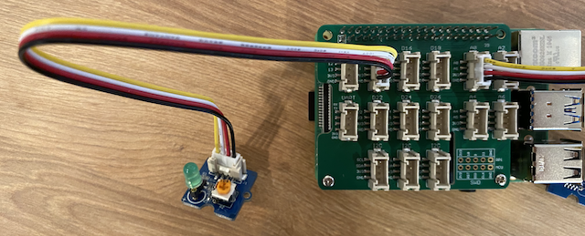

<!--
CO_OP_TRANSLATOR_METADATA:
{
  "original_hash": "4db8a3879a53490513571df2f6cf7641",
  "translation_date": "2025-08-28T20:08:20+00:00",
  "source_file": "1-getting-started/lessons/3-sensors-and-actuators/pi-actuator.md",
  "language_code": "lt"
}
-->
# Sukurkite naktinę lemputę - Raspberry Pi

Šioje pamokos dalyje pridėsite LED prie savo Raspberry Pi ir naudosite jį naktinei lemputei sukurti.

## Aparatinė įranga

Dabar naktinei lemputei reikia vykdytojo.

Vykdytojas yra **LED**, [šviesos diodas](https://wikipedia.org/wiki/Light-emitting_diode), kuris skleidžia šviesą, kai per jį teka srovė. Tai yra skaitmeninis vykdytojas, turintis 2 būsenas: įjungta ir išjungta. Siunčiant reikšmę 1, LED įsijungia, o siunčiant 0 – išsijungia. LED yra išorinis Grove vykdytojas, kurį reikia prijungti prie Grove Base hat ant Raspberry Pi.

Naktinės lemputės logika pseudo-kode yra tokia:

```output
Check the light level.
If the light is less than 300
    Turn the LED on
Otherwise
    Turn the LED off
```

### Prijunkite LED

Grove LED pateikiamas kaip modulis su įvairių spalvų LED, leidžiančių pasirinkti norimą spalvą.

#### Užduotis - prijunkite LED

Prijunkite LED.


1. Pasirinkite mėgstamą LED ir įkiškite jo kojeles į dvi skyles LED modulyje.

    LED yra šviesos diodai, o diodai yra elektroniniai įrenginiai, kurie leidžia srovei tekėti tik viena kryptimi. Tai reiškia, kad LED turi būti prijungtas teisinga kryptimi, kitaip jis neveiks.

    Viena iš LED kojelių yra teigiamas kontaktas, kita – neigiamas. LED nėra visiškai apvalus ir viena jo pusė yra šiek tiek plokštesnė. Plokštesnė pusė yra neigiamas kontaktas. Prijungdami LED prie modulio, įsitikinkite, kad kojelė, esanti apvalesnėje pusėje, yra prijungta prie lizdo, pažymėto **+**, esančio modulio išorėje, o plokštesnė pusė – prie lizdo, esančio arčiau modulio vidurio.

1. LED modulis turi sukimo mygtuką, leidžiantį reguliuoti ryškumą. Pradžioje pasukite jį iki galo prieš laikrodžio rodyklę, naudodami mažą kryžminį atsuktuvą.

1. Įkiškite vieną Grove kabelio galą į lizdą ant LED modulio. Jis įsistato tik viena kryptimi.

1. Išjungę Raspberry Pi, prijunkite kitą Grove kabelio galą prie skaitmeninio lizdo, pažymėto **D5**, esančio ant Grove Base hat, prijungto prie Pi. Šis lizdas yra antras iš kairės, eilėje šalia GPIO kontaktų.



## Užprogramuokite naktinę lemputę

Dabar naktinę lemputę galima užprogramuoti naudojant Grove šviesos jutiklį ir Grove LED.

### Užduotis - užprogramuokite naktinę lemputę

Užprogramuokite naktinę lemputę.

1. Įjunkite Pi ir palaukite, kol jis užsikraus.

1. Atidarykite naktinės lemputės projektą VS Code, kurį sukūrėte ankstesnėje šios užduoties dalyje, arba tiesiogiai Pi, arba naudodami Remote SSH plėtinį.

1. Pridėkite šį kodą į `app.py` failą, kad importuotumėte reikalingą biblioteką. Šis kodas turėtų būti pridėtas viršuje, po kitų `import` eilučių.

    ```python
    from grove.grove_led import GroveLed
    ```

    `from grove.grove_led import GroveLed` eilutė importuoja `GroveLed` iš Grove Python bibliotekų. Ši biblioteka turi kodą, skirtą sąveikai su Grove LED.

1. Pridėkite šį kodą po `light_sensor` deklaracijos, kad sukurtumėte klasės, valdančios LED, egzempliorių:

    ```python
    led = GroveLed(5)
    ```

    Eilutė `led = GroveLed(5)` sukuria `GroveLed` klasės egzempliorių, prijungtą prie **D5** lizdo – skaitmeninio Grove lizdo, prie kurio prijungtas LED.

    > 💁 Visi lizdai turi unikalius kontaktų numerius. Kontaktai 0, 2, 4 ir 6 yra analoginiai, o kontaktai 5, 16, 18, 22, 24 ir 26 yra skaitmeniniai.

1. Pridėkite patikrą `while` ciklo viduje, prieš `time.sleep`, kad patikrintumėte šviesos lygį ir įjungtumėte arba išjungtumėte LED:

    ```python
    if light < 300:
        led.on()
    else:
        led.off()
    ```

    Šis kodas tikrina `light` reikšmę. Jei ji mažesnė nei 300, kviečiamas `on` metodas iš `GroveLed` klasės, kuris siunčia skaitmeninę reikšmę 1 į LED, įjungdamas jį. Jei šviesos reikšmė yra 300 ar didesnė, kviečiamas `off` metodas, siunčiantis skaitmeninę reikšmę 0 į LED, išjungdamas jį.

    > 💁 Šis kodas turėtų būti įtrauktas į tą patį lygį kaip `print('Light level:', light)` eilutė, kad būtų `while` ciklo viduje!

    > 💁 Siunčiant skaitmenines reikšmes vykdytojams, reikšmė 0 yra 0V, o reikšmė 1 yra maksimali įrenginio įtampa. Raspberry Pi su Grove jutikliais ir vykdytojais maksimali įtampa yra 3.3V.

1. VS Code terminale paleiskite šią komandą, kad paleistumėte savo Python programą:

    ```sh
    python3 app.py
    ```

    Šviesos reikšmės bus išvestos į konsolę.

    ```output
    pi@raspberrypi:~/nightlight $ python3 app.py 
    Light level: 634
    Light level: 634
    Light level: 634
    Light level: 230
    Light level: 104
    Light level: 290
    ```

1. Uždenkite ir atidenkite šviesos jutiklį. Pastebėsite, kaip LED užsidega, jei šviesos lygis yra 300 ar mažesnis, ir užgęsta, kai šviesos lygis yra didesnis nei 300.

    > 💁 Jei LED neįsijungia, įsitikinkite, kad jis prijungtas teisinga kryptimi, ir sukimo mygtukas nustatytas į maksimalų ryškumą.


> 💁 Šį kodą galite rasti [code-actuator/pi](../../../../../1-getting-started/lessons/3-sensors-and-actuators/code-actuator/pi) aplanke.

😀 Jūsų naktinės lemputės programa pavyko!

---

**Atsakomybės apribojimas**:  
Šis dokumentas buvo išverstas naudojant AI vertimo paslaugą [Co-op Translator](https://github.com/Azure/co-op-translator). Nors siekiame tikslumo, prašome atkreipti dėmesį, kad automatiniai vertimai gali turėti klaidų ar netikslumų. Originalus dokumentas jo gimtąja kalba turėtų būti laikomas autoritetingu šaltiniu. Kritinei informacijai rekomenduojama profesionali žmogaus vertimo paslauga. Mes neprisiimame atsakomybės už nesusipratimus ar klaidingus interpretavimus, atsiradusius naudojant šį vertimą.