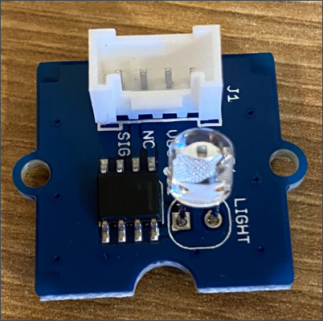

<!--
CO_OP_TRANSLATOR_METADATA:
{
  "original_hash": "ea733bd0cdf2479e082373f765a08678",
  "translation_date": "2025-08-28T20:09:00+00:00",
  "source_file": "1-getting-started/lessons/3-sensors-and-actuators/pi-sensor.md",
  "language_code": "lt"
}
-->
# Sukurkite naktinę lemputę - Raspberry Pi

Šioje pamokos dalyje pridėsite šviesos jutiklį prie savo Raspberry Pi.

## Aparatinė įranga

Šios pamokos jutiklis yra **šviesos jutiklis**, kuris naudoja [fotodiodą](https://wikipedia.org/wiki/Photodiode), kad paverstų šviesą į elektrinį signalą. Tai yra analoginis jutiklis, kuris siunčia sveikojo skaičiaus reikšmę nuo 0 iki 1 000, nurodydamas santykinį šviesos kiekį, kuris neatitinka jokio standartinio matavimo vieneto, pavyzdžiui, [liuksų](https://wikipedia.org/wiki/Lux).

Šviesos jutiklis yra išorinis Grove jutiklis ir turi būti prijungtas prie Grove Base hat ant Raspberry Pi.

### Prijunkite šviesos jutiklį

Grove šviesos jutiklis, naudojamas šviesos lygiams aptikti, turi būti prijungtas prie Raspberry Pi.

#### Užduotis - prijunkite šviesos jutiklį

Prijunkite šviesos jutiklį.



1. Įstatykite vieną Grove kabelio galą į lizdą ant šviesos jutiklio modulio. Jis įsistatys tik viena kryptimi.

1. Išjungus Raspberry Pi, prijunkite kitą Grove kabelio galą prie analoginio lizdo, pažymėto **A0**, esančio ant Grove Base hat, prijungto prie Pi. Šis lizdas yra antras iš dešinės, eilėje šalia GPIO pinų.


## Užprogramuokite šviesos jutiklį

Dabar įrenginį galima programuoti naudojant Grove šviesos jutiklį.

### Užduotis - užprogramuokite šviesos jutiklį

Užprogramuokite įrenginį.

1. Įjunkite Pi ir palaukite, kol jis užsikraus.

1. Atidarykite naktinės lemputės projektą VS Code, kurį sukūrėte ankstesnėje šios užduoties dalyje, arba tiesiogiai Pi, arba naudodami Remote SSH plėtinį.

1. Atidarykite `app.py` failą ir pašalinkite visą jame esantį kodą.

1. Pridėkite šį kodą į `app.py` failą, kad importuotumėte reikalingas bibliotekas:

    ```python
    import time
    from grove.grove_light_sensor_v1_2 import GroveLightSensor
    ```

    `import time` eilutė importuoja `time` modulį, kuris bus naudojamas vėliau šioje užduotyje.

    `from grove.grove_light_sensor_v1_2 import GroveLightSensor` eilutė importuoja `GroveLightSensor` iš Grove Python bibliotekų. Ši biblioteka turi kodą, skirtą sąveikai su Grove šviesos jutikliu, ir buvo įdiegta globaliai Pi nustatymo metu.

1. Pridėkite šį kodą po aukščiau esančio kodo, kad sukurtumėte klasės, valdančios šviesos jutiklį, egzempliorių:

    ```python
    light_sensor = GroveLightSensor(0)
    ```

    Eilutė `light_sensor = GroveLightSensor(0)` sukuria `GroveLightSensor` klasės egzempliorių, prijungtą prie **A0** lizdo - analoginio Grove lizdo, prie kurio prijungtas šviesos jutiklis.

1. Pridėkite begalinę kilpą po aukščiau esančio kodo, kad nuskaitytumėte šviesos jutiklio reikšmę ir atspausdintumėte ją konsolėje:

    ```python
    while True:
        light = light_sensor.light
        print('Light level:', light)
    ```

    Tai nuskaitys dabartinį šviesos lygį skalėje nuo 0 iki 1 023, naudojant `light` savybę iš `GroveLightSensor` klasės. Ši savybė nuskaito analoginę reikšmę iš lizdo. Ši reikšmė tada atspausdinama konsolėje.

1. Pridėkite vienos sekundės pauzę kilpos pabaigoje, nes šviesos lygiai neturi būti tikrinami nuolat. Pauzė sumažina įrenginio energijos suvartojimą.

    ```python
    time.sleep(1)
    ```

1. VS Code terminale paleiskite šią komandą, kad paleistumėte savo Python programą:

    ```sh
    python3 app.py
    ```

    Šviesos reikšmės bus išvedamos į konsolę. Uždenkite ir atidenkite šviesos jutiklį, ir reikšmės keisis:

    ```output
    pi@raspberrypi:~/nightlight $ python3 app.py 
    Light level: 634
    Light level: 634
    Light level: 634
    Light level: 230
    Light level: 104
    Light level: 290
    ```

> 💁 Šį kodą galite rasti [code-sensor/pi](../../../../../1-getting-started/lessons/3-sensors-and-actuators/code-sensor/pi) aplanke.

😀 Pridėti jutiklį prie savo naktinės lemputės programos pavyko!

---

**Atsakomybės apribojimas**:  
Šis dokumentas buvo išverstas naudojant AI vertimo paslaugą [Co-op Translator](https://github.com/Azure/co-op-translator). Nors siekiame tikslumo, prašome atkreipti dėmesį, kad automatiniai vertimai gali turėti klaidų ar netikslumų. Originalus dokumentas jo gimtąja kalba turėtų būti laikomas autoritetingu šaltiniu. Kritinei informacijai rekomenduojama naudoti profesionalų žmogaus vertimą. Mes neprisiimame atsakomybės už nesusipratimus ar klaidingus interpretavimus, atsiradusius dėl šio vertimo naudojimo.