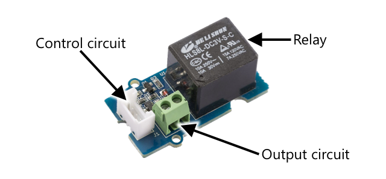
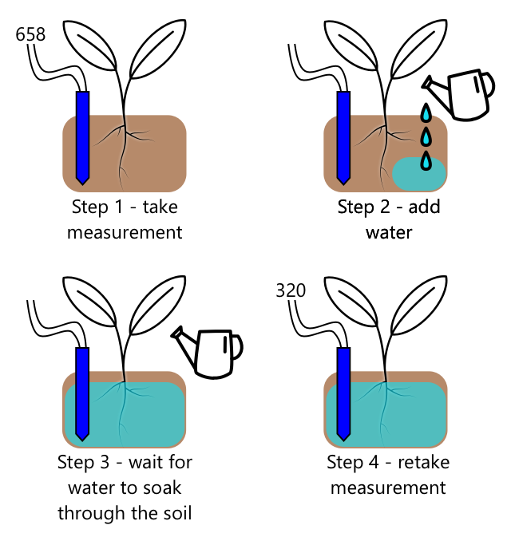

<!--
CO_OP_TRANSLATOR_METADATA:
{
  "original_hash": "f7bb24ba53fb627ddb38a8b24a05e594",
  "translation_date": "2025-08-28T20:42:11+00:00",
  "source_file": "2-farm/lessons/3-automated-plant-watering/README.md",
  "language_code": "lt"
}
-->
# Automatinis augalų laistymas


> Sketchnote sukūrė [Nitya Narasimhan](https://github.com/nitya). Spustelėkite paveikslėlį, kad pamatytumėte didesnę versiją.

Ši pamoka buvo dėstoma kaip dalis [IoT pradedantiesiems 2 projekto - Skaitmeninė žemdirbystė serijos](https://youtube.com/playlist?list=PLmsFUfdnGr3yCutmcVg6eAUEfsGiFXgcx) iš [Microsoft Reactor](https://developer.microsoft.com/reactor/?WT.mc_id=academic-17441-jabenn).

[](https://youtu.be/g9FfZwv9R58)

## Klausimynas prieš paskaitą

[Klausimynas prieš paskaitą](https://black-meadow-040d15503.1.azurestaticapps.net/quiz/13)

## Įvadas

Praeitoje pamokoje išmokote stebėti dirvožemio drėgmę. Šioje pamokoje sužinosite, kaip sukurti pagrindinius automatizuotos laistymo sistemos komponentus, kurie reaguoja į dirvožemio drėgmę. Taip pat sužinosite apie laiko aspektą – kaip jutikliams gali prireikti laiko reaguoti į pokyčius, o aktuatoriams – pakeisti jutiklių matuojamas savybes.

Šioje pamokoje aptarsime:

* [Kaip valdyti didelės galios įrenginius iš mažos galios IoT įrenginio](../../../../../2-farm/lessons/3-automated-plant-watering)
* [Kaip valdyti relę](../../../../../2-farm/lessons/3-automated-plant-watering)
* [Kaip valdyti augalą per MQTT](../../../../../2-farm/lessons/3-automated-plant-watering)
* [Jutiklių ir aktuatorių laiko aspektai](../../../../../2-farm/lessons/3-automated-plant-watering)
* [Kaip pridėti laiko aspektą augalų valdymo serveriui](../../../../../2-farm/lessons/3-automated-plant-watering)

## Kaip valdyti didelės galios įrenginius iš mažos galios IoT įrenginio

IoT įrenginiai naudoja mažą įtampą. Nors to pakanka jutikliams ir mažos galios aktuatoriams, tokiems kaip LED, tai yra per mažai didesniems įrenginiams, pavyzdžiui, vandens siurbliui, naudojamam drėkinimui. Net mažiems siurbliams, kuriuos galėtumėte naudoti kambariniams augalams, reikia per daug srovės IoT kūrimo rinkiniui, ir tai galėtų sugadinti plokštę.

> 🎓 Srovė, matuojama amperais (A), yra elektros kiekis, judantis per grandinę. Įtampa suteikia postūmį, o srovė nurodo, kiek yra stumiama. Daugiau apie srovę galite perskaityti [elektros srovės puslapyje Vikipedijoje](https://wikipedia.org/wiki/Electric_current).

Sprendimas yra prijungti siurblį prie išorinio maitinimo šaltinio ir naudoti aktuatorių, kad įjungtumėte siurblį, panašiai kaip įjungtumėte šviesą. Jūsų pirštui reikia labai mažai energijos (kūno energijos forma), kad perjungtumėte jungiklį, ir tai sujungia šviesą su elektros tinklu, veikiančiu 110V/240V.


> 🎓 [Elektros tinklas](https://wikipedia.org/wiki/Mains_electricity) reiškia elektrą, tiekiamą namams ir verslui per nacionalinę infrastruktūrą daugelyje pasaulio vietų.

✅ IoT įrenginiai paprastai gali tiekti 3.3V arba 5V, mažiau nei 1 amperą (1A) srovės. Palyginkite tai su elektros tinklu, kuris dažniausiai yra 230V (120V Šiaurės Amerikoje ir 100V Japonijoje) ir gali tiekti energiją įrenginiams, kuriems reikia 30A.

Yra keletas aktuatorių, kurie gali tai padaryti, įskaitant mechaninius įrenginius, kuriuos galite pritvirtinti prie esamų jungiklių, imituojančių piršto veiksmą. Populiariausias yra relė.

### Relės

Relė yra elektromagnetinis jungiklis, kuris elektrinį signalą paverčia mechaniniu judesiu, įjungiančiu jungiklį. Relės šerdis yra elektromagnetas.

> 🎓 [Elektromagnetai](https://wikipedia.org/wiki/Electromagnet) yra magnetai, kurie sukuriami leidžiant elektrą per vielos ritę. Kai elektra įjungiama, ritė tampa magnetinė. Kai elektra išjungiama, ritė praranda magnetizmą.


Relėje valdymo grandinė maitina elektromagnetą. Kai elektromagnetas įjungtas, jis traukia svirtį, kuri perkelia jungiklį, uždarydama kontaktus ir užbaigdama išvesties grandinę.


Kai valdymo grandinė išjungta, elektromagnetas išsijungia, atleidžia svirtį ir atidaro kontaktus, išjungdamas išvesties grandinę. Relės yra skaitmeniniai aktuatoriai – aukštas signalas į relę ją įjungia, žemas signalas ją išjungia.

Išvesties grandinė gali būti naudojama papildomai įrangai maitinti, pavyzdžiui, drėkinimo sistemai. IoT įrenginys gali įjungti relę, užbaigdamas išvesties grandinę, kuri maitina drėkinimo sistemą, ir augalai bus laistomi. IoT įrenginys gali tada išjungti relę, nutraukdamas energiją drėkinimo sistemai, išjungdamas vandenį.


Vaizdo įraše aukščiau relė įjungiama. Relės LED užsidega, kad parodytų, jog ji įjungta (kai kurios relės plokštės turi LED, rodančius, ar relė įjungta, ar išjungta), ir energija siunčiama į siurblį, kuris įsijungia ir pumpuoja vandenį į augalą.

> 💁 Relės taip pat gali būti naudojamos perjungti tarp dviejų išvesties grandinių, o ne įjungti arba išjungti vieną. Kai svirtis juda, ji perkelia jungiklį nuo vienos išvesties grandinės užbaigimo prie kitos, paprastai dalijantis bendru maitinimo arba bendru žemės jungimu.

✅ Atlikite tyrimą: Yra keli relės tipai, turintys skirtumų, pavyzdžiui, ar valdymo grandinė įjungia ar išjungia relę, kai tiekiama energija, arba kelių išvesties grandinių. Sužinokite apie šiuos skirtingus tipus.

Kai svirtis juda, paprastai galite girdėti, kaip ji kontaktuoja su elektromagnetu, skleidžiant aiškų spragtelėjimo garsą.

> 💁 Relė gali būti sujungta taip, kad jungimas iš tikrųjų nutrauktų energiją relėje, išjungdamas ją, o tai tada siunčia energiją atgal į relę, vėl ją įjungdama, ir taip toliau. Tai reiškia, kad relė spragtelės labai greitai, skleidžiant dūzgimo garsą. Taip veikė kai kurie pirmieji elektriniai durų skambučiai.

### Relės galia

Elektromagnetui nereikia daug energijos, kad aktyvuotų ir trauktų svirtį, jis gali būti valdomas naudojant 3.3V arba 5V iš IoT kūrimo rinkinio. Išvesties grandinė gali perduoti daug daugiau energijos, priklausomai nuo relės, įskaitant elektros tinklo įtampą ar net didesnės galios lygius pramoniniam naudojimui. Tokiu būdu IoT kūrimo rinkinys gali valdyti drėkinimo sistemą – nuo mažo siurblio vienam augalui iki didžiulės pramoninės sistemos visam komerciniam ūkiui.



Paveikslėlyje aukščiau parodyta Grove relė. Valdymo grandinė jungiasi prie IoT įrenginio ir įjungia arba išjungia relę naudojant 3.3V arba 5V. Išvesties grandinė turi du terminalus, bet kuris iš jų gali būti maitinimas arba žemė. Išvesties grandinė gali valdyti iki 250V ir 10A, pakankamai įvairiems elektros tinklo įrenginiams. Galite gauti relės, kurios gali valdyti dar didesnės galios lygius.


Paveikslėlyje aukščiau energija tiekiama siurbliui per relę. Raudonas laidas jungia +5V terminalą USB maitinimo šaltinio su vienu išvesties grandinės terminalu relėje, o kitas raudonas laidas jungia kitą išvesties grandinės terminalą su siurbliu. Juodas laidas jungia siurblį su USB maitinimo šaltinio žeme. Kai relė įjungiama, ji užbaigia grandinę, siunčia 5V į siurblį, įjungia siurblį.

## Kaip valdyti relę

Relę galite valdyti iš savo IoT kūrimo rinkinio.

### Užduotis - valdyti relę

Atlikite atitinkamą vadovą, kad valdytumėte relę naudodami savo IoT įrenginį:

* [Arduino - Wio Terminal](wio-terminal-relay.md)
* [Vieno plokštės kompiuteris - Raspberry Pi](pi-relay.md)
* [Vieno plokštės kompiuteris - Virtualus įrenginys](virtual-device-relay.md)

## Kaip valdyti augalą per MQTT

Iki šiol jūsų relė buvo valdoma tiesiogiai IoT įrenginiu, remiantis vienu dirvožemio drėgmės matavimu. Komercinėje drėkinimo sistemoje valdymo logika bus centralizuota, leidžianti priimti sprendimus dėl laistymo naudojant duomenis iš kelių jutiklių ir leidžianti bet kokius nustatymus pakeisti vienoje vietoje. Norėdami tai imituoti, galite valdyti relę per MQTT.

### Užduotis - valdyti relę per MQTT

1. Pridėkite atitinkamas MQTT bibliotekas/pip paketus ir kodą į savo `soil-moisture-sensor` projektą, kad prisijungtumėte prie MQTT. Pavadinkite kliento ID kaip `soilmoisturesensor_client`, pridėdami savo ID priešdėlį.

    > ⚠️ Galite pasinaudoti [instrukcijomis, kaip prisijungti prie MQTT 1 projekte, 4 pamokoje, jei reikia](../../../1-getting-started/lessons/4-connect-internet/README.md#connect-your-iot-device-to-mqtt).

1. Pridėkite atitinkamą įrenginio kodą, kad siųstumėte telemetriją su dirvožemio drėgmės nustatymais. Telemetrijos pranešime pavadinkite savybę `soil_moisture`.

    > ⚠️ Galite pasinaudoti [instrukcijomis, kaip siųsti telemetriją į MQTT 1 projekte, 4 pamokoje, jei reikia](../../../1-getting-started/lessons/4-connect-internet/README.md#send-telemetry-from-your-iot-device).

1. Sukurkite vietinio serverio kodą, kuris prenumeruotų telemetriją ir siųstų komandą valdyti relę aplanke, pavadintame `soil-moisture-sensor-server`. Pavadinkite savybę komandos pranešime `relay_on`, o kliento ID kaip `soilmoisturesensor_server`, pridėdami savo ID priešdėlį. Išlaikykite tą pačią struktūrą kaip serverio kodas, kurį rašėte 1 projekte, 4 pamokoje, nes vėliau šioje pamokoje pridėsite prie šio kodo.

    > ⚠️ Galite pasinaudoti [instrukcijomis, kaip siųsti telemetriją į MQTT](../../../1-getting-started/lessons/4-connect-internet/README.md#write-the-server-code) ir [siųsti komandas per MQTT](../../../1-getting-started/lessons/4-connect-internet/README.md#send-commands-to-the-mqtt-broker) 1 projekte, 4 pamokoje, jei reikia.

1. Pridėkite atitinkamą įrenginio kodą, kad valdytumėte relę iš gautų komandų, naudodami `relay_on` savybę iš pranešimo. Siųskite true `relay_on`, jei `soil_moisture` yra didesnis nei 450, kitaip siųskite false, kaip logiką, kurią pridėjote IoT įrenginiui anksčiau.

    > ⚠️ Galite pasinaudoti [instrukcijomis, kaip reaguoti į komandas iš MQTT 1 projekte, 4 pamokoje, jei reikia](../../../1-getting-started/lessons/4-connect-internet/README.md#handle-commands-on-the-iot-device).

> 💁 Šį kodą galite rasti [code-mqtt](../../../../../2-farm/lessons/3-automated-plant-watering/code-mqtt) aplanke.

Įsitikinkite, kad kodas veikia jūsų įrenginyje ir vietiniame serveryje, ir išbandykite jį, keisdami dirvožemio drėgmės lygius, arba keisdami vertes, siunčiamas virtualaus jutiklio, arba keisdami dirvožemio drėgmės lygius, pridėdami vandens arba išimdami jutiklį iš dirvožemio.

## Jutiklių ir aktuatorių laiko aspektai

Trečioje pamokoje sukūrėte naktinę lemputę – LED, kuris įsijungia, kai šviesos lygis, aptiktas šviesos jutiklio, yra žemas. Šviesos jutiklis aptiko šviesos lygio pokytį akimirksniu, ir įrenginys galėjo greitai reaguoti, ribojamas tik `loop` funkcijos arba `while True:` ciklo vėlavimo. Kaip IoT kūrėjas, ne visada galite pasikliauti tokiu greitu grįžtamuoju ryšiu.

### Dirvožemio drėgmės laiko aspektas

Jei atlikote paskutinę pamoką apie dirvožemio drėgmę, naudodami fizinį jutiklį, pastebėjote, kad dirvožemio drėgmės rodmenims prireikė kelių sekundžių, kad sumažėtų po to, kai palaistėte augalą. Taip yra ne dėl to, kad jutiklis yra lėtas, bet dėl to, kad vandeniui reikia laiko įsigerti į dirvožemį.
💁 Jei laistėte per arti jutiklio, galėjote pastebėti, kad rodmenys greitai sumažėjo, o vėliau vėl pakilo – tai įvyksta dėl vandens, esančio šalia jutiklio, kuris pasklinda po likusį dirvožemį ir sumažina drėgmę ties jutikliu.


Aukščiau pateiktame diagramoje dirvožemio drėgmės matavimas rodo 658. Augalas yra laistomas, tačiau šis rodmuo iš karto nesikeičia, nes vanduo dar nepasiekė jutiklio. Laistymas gali baigtis dar prieš tai, kai vanduo pasiekia jutiklį, o vertė sumažėja, atspindėdama naują drėgmės lygį.

Jei rašytumėte kodą, skirtą valdyti drėkinimo sistemą per relę, remiantis dirvožemio drėgmės lygiais, turėtumėte atsižvelgti į šį vėlavimą ir įdiegti išmanesnį laiko valdymą savo IoT įrenginyje.

✅ Skirkite akimirką pagalvoti, kaip galėtumėte tai padaryti.

### Valdykite jutiklio ir vykdiklio laiką

Įsivaizduokite, kad jums pavesta sukurti drėkinimo sistemą ūkiui. Remiantis dirvožemio tipu, idealus dirvožemio drėgmės lygis augalams atitinka analoginį įtampos matavimą nuo 400 iki 450.

Galėtumėte užprogramuoti įrenginį taip pat, kaip naktinę lemputę – visą laiką, kai jutiklis rodo daugiau nei 450, įjungti relę, kad įjungtumėte siurblį. Problema ta, kad vandeniui reikia laiko, kad jis iš siurblio patektų per dirvožemį iki jutiklio. Jutiklis sustabdys vandens tiekimą, kai aptiks 450 lygį, tačiau vandens lygis ir toliau mažės, nes pumpuojamas vanduo toliau įsigeria į dirvožemį. Galutinis rezultatas – švaistomas vanduo ir rizika pažeisti šaknis.

✅ Atminkite – per daug vandens augalams gali būti taip pat blogai, kaip ir per mažai, be to, tai švaisto brangų išteklių.

Geresnis sprendimas yra suprasti, kad yra vėlavimas tarp vykdiklio įjungimo ir savybės, kurią matuoja jutiklis, pasikeitimo. Tai reiškia, kad ne tik jutiklis turėtų palaukti, kol vėl išmatuos vertę, bet ir vykdiklis turi būti išjungtas tam tikrą laiką prieš kitą jutiklio matavimą.

Kiek laiko relė turėtų būti įjungta kiekvieną kartą? Geriau būti atsargiems ir įjungti relę tik trumpam laikui, tada palaukti, kol vanduo įsigers, ir vėl patikrinti drėgmės lygį. Juk visada galite vėl įjungti siurblį, kad pridėtumėte daugiau vandens, tačiau negalite pašalinti vandens iš dirvožemio.

> 💁 Tokio tipo laiko valdymas yra labai specifinis IoT įrenginiui, kurį kuriate, matuojamai savybei ir naudojamiems jutikliams bei vykdikliams.


Pavyzdžiui, turiu braškių augalą su dirvožemio drėgmės jutikliu ir siurbliu, valdomu per relę. Pastebėjau, kad kai pridedu vandens, dirvožemio drėgmės rodmuo stabilizuojasi maždaug per 20 sekundžių. Tai reiškia, kad turiu išjungti relę ir palaukti 20 sekundžių prieš tikrindamas drėgmės lygį. Verčiau turėti per mažai vandens nei per daug – visada galiu vėl įjungti siurblį, tačiau negaliu pašalinti vandens iš augalo.



Tai reiškia, kad geriausias procesas būtų laistymo ciklas, kuris atrodytų maždaug taip:

* Įjungti siurblį 5 sekundėms
* Palaukti 20 sekundžių
* Patikrinti dirvožemio drėgmę
* Jei lygis vis dar viršija reikiamą, pakartoti aukščiau nurodytus veiksmus

5 sekundės siurbliui gali būti per ilgas laikas, ypač jei drėgmės lygis tik šiek tiek viršija reikiamą lygį. Geriausias būdas sužinoti, kokį laiką naudoti, yra išbandyti, tada koreguoti, kai turite jutiklio duomenis, su nuolatiniu grįžtamojo ryšio ciklu. Tai gali netgi lemti detalesnį laiko valdymą, pavyzdžiui, įjungti siurblį 1 sekundei už kiekvieną 100 virš reikiamo dirvožemio drėgmės lygio, o ne fiksuotoms 5 sekundėms.

✅ Atlikite tyrimą: Ar yra kitų laiko valdymo aspektų? Ar augalą galima laistyti bet kuriuo metu, kai dirvožemio drėgmė yra per maža, ar yra tam tikri dienos laikai, kurie yra geri arba blogi augalų laistymui?

> 💁 Orų prognozės taip pat gali būti įtrauktos į automatizuotų laistymo sistemų valdymą lauko augalams. Jei prognozuojamas lietus, laistymą galima atidėti iki lietaus pabaigos. Tuo metu dirvožemis gali būti pakankamai drėgnas, kad nereikėtų laistyti, o tai yra daug efektyviau nei švaistyti vandenį laistant prieš pat lietų.

## Pridėkite laiko valdymą savo augalų kontrolės serveriui

Serverio kodą galima modifikuoti, kad būtų pridėta kontrolė aplink laistymo ciklo laiką ir laukimą, kol dirvožemio drėgmės lygis pasikeis. Serverio logika relės laiko valdymui yra tokia:

1. Gauta telemetrijos žinutė
1. Patikrinti dirvožemio drėgmės lygį
1. Jei viskas gerai, nieko nedaryti. Jei rodmuo per didelis (tai reiškia, kad dirvožemio drėgmė per maža), tada:
    1. Siųsti komandą įjungti relę
    1. Palaukti 5 sekundes
    1. Siųsti komandą išjungti relę
    1. Palaukti 20 sekundžių, kol dirvožemio drėgmės lygis stabilizuosis

Laistymo ciklas, procesas nuo telemetrijos žinutės gavimo iki pasirengimo vėl apdoroti dirvožemio drėgmės lygį, trunka apie 25 sekundes. Mes siunčiame dirvožemio drėgmės lygius kas 10 sekundžių, todėl yra persidengimas, kai žinutė gaunama, kol serveris laukia, kol dirvožemio drėgmės lygis stabilizuosis, o tai gali pradėti kitą laistymo ciklą.

Yra du būdai, kaip tai išspręsti:

* Pakeisti IoT įrenginio kodą, kad telemetrija būtų siunčiama tik kas minutę, tokiu būdu laistymo ciklas bus baigtas prieš siunčiant kitą žinutę
* Atsisakyti telemetrijos prenumeratos laistymo ciklo metu

Pirmasis variantas ne visada yra geras sprendimas dideliems ūkiams. Ūkininkas gali norėti užfiksuoti dirvožemio drėgmės lygius, kol dirvožemis yra laistomas, kad vėliau galėtų analizuoti, pavyzdžiui, kad būtų galima stebėti vandens srautą skirtingose ūkio vietose ir nukreipti tikslinį laistymą. Antrasis variantas yra geresnis – kodas tiesiog ignoruoja telemetriją, kai jos negali panaudoti, tačiau telemetrija vis tiek yra prieinama kitoms paslaugoms, kurios gali ją prenumeruoti.

> 💁 IoT duomenys nėra siunčiami tik iš vieno įrenginio į vieną paslaugą, vietoj to daugelis įrenginių gali siųsti duomenis į brokerį, o daugelis paslaugų gali klausytis duomenų iš brokerio. Pavyzdžiui, viena paslauga gali klausytis dirvožemio drėgmės duomenų ir saugoti juos duomenų bazėje, kad vėliau būtų galima analizuoti. Kita paslauga taip pat gali klausytis tos pačios telemetrijos, kad valdytų drėkinimo sistemą.

### Užduotis – pridėkite laiko valdymą savo augalų kontrolės serveriui

Atnaujinkite savo serverio kodą, kad relė veiktų 5 sekundes, tada lauktų 20 sekundžių.

1. Atidarykite `soil-moisture-sensor-server` aplanką VS Code, jei jis dar neatidarytas. Įsitikinkite, kad virtuali aplinka yra aktyvuota.

1. Atidarykite `app.py` failą

1. Pridėkite šį kodą į `app.py` failą po esamais importais:

    ```python
    import threading
    ```

    Šis teiginys importuoja `threading` iš Python bibliotekų, threading leidžia Python vykdyti kitą kodą, kol laukia.

1. Pridėkite šį kodą prieš `handle_telemetry` funkciją, kuri apdoroja telemetrijos žinutes, gautas serverio kode:

    ```python
    water_time = 5
    wait_time = 20
    ```

    Tai apibrėžia, kiek laiko relė turėtų veikti (`water_time`), ir kiek laiko laukti po to, kad patikrintų dirvožemio drėgmę (`wait_time`).

1. Po šio kodo pridėkite šį:

    ```python
    def send_relay_command(client, state):
        command = { 'relay_on' : state }
        print("Sending message:", command)
        client.publish(server_command_topic, json.dumps(command))
    ```

    Šis kodas apibrėžia funkciją, vadinamą `send_relay_command`, kuri siunčia komandą per MQTT, kad valdytų relę. Telemetrija sukuriama kaip žodynas, tada konvertuojama į JSON eilutę. Vertė, perduota į `state`, nustato, ar relė turėtų būti įjungta, ar išjungta.

1. Po `send_relay_code` funkcijos pridėkite šį kodą:

    ```python
    def control_relay(client):
        print("Unsubscribing from telemetry")
        mqtt_client.unsubscribe(client_telemetry_topic)
    
        send_relay_command(client, True)
        time.sleep(water_time)
        send_relay_command(client, False)
    
        time.sleep(wait_time)
    
        print("Subscribing to telemetry")
        mqtt_client.subscribe(client_telemetry_topic)
    ```

    Tai apibrėžia funkciją, kuri valdo relę pagal reikiamą laiką. Ji pradeda atsisakydama telemetrijos prenumeratos, kad dirvožemio drėgmės žinutės nebūtų apdorojamos laistymo metu. Tada ji siunčia komandą įjungti relę. Po to laukia `water_time`, kol siunčia komandą išjungti relę. Galiausiai ji laukia, kol dirvožemio drėgmės lygis stabilizuosis `wait_time` sekundėmis. Tada ji vėl prenumeruoja telemetriją.

1. Pakeiskite `handle_telemetry` funkciją į šią:

    ```python
    def handle_telemetry(client, userdata, message):
        payload = json.loads(message.payload.decode())
        print("Message received:", payload)
    
        if payload['soil_moisture'] > 450:
            threading.Thread(target=control_relay, args=(client,)).start()
    ```

    Šis kodas tikrina dirvožemio drėgmės lygį. Jei jis didesnis nei 450, dirvožemiui reikia laistymo, todėl jis iškviečia `control_relay` funkciją. Ši funkcija vykdoma atskiroje gijoje, veikiančioje fone.

1. Įsitikinkite, kad jūsų IoT įrenginys veikia, tada paleiskite šį kodą. Pakeiskite dirvožemio drėgmės lygius ir stebėkite, kas vyksta su rele – ji turėtų įsijungti 5 sekundėms, tada likti išjungta bent 20 sekundžių, įsijungdama tik tada, jei dirvožemio drėgmės lygis nėra pakankamas.

    ```output
    (.venv) ➜  soil-moisture-sensor-server ✗ python app.py
    Message received: {'soil_moisture': 457}
    Unsubscribing from telemetry
    Sending message: {'relay_on': True}
    Sending message: {'relay_on': False}
    Subscribing to telemetry
    Message received: {'soil_moisture': 302}
    ```

    Geras būdas išbandyti tai simuliuotoje drėkinimo sistemoje yra naudoti sausą dirvožemį, tada rankiniu būdu pilti vandenį, kol relė yra įjungta, sustojant pilti, kai relė išsijungia.

> 💁 Šį kodą galite rasti [code-timing](../../../../../2-farm/lessons/3-automated-plant-watering/code-timing) aplanke.

> 💁 Jei norite naudoti siurblį, kad sukurtumėte realią drėkinimo sistemą, galite naudoti [6V vandens siurblį](https://www.seeedstudio.com/6V-Mini-Water-Pump-p-1945.html) su [USB terminalo maitinimo šaltiniu](https://www.adafruit.com/product/3628). Įsitikinkite, kad siurblio maitinimas yra prijungtas per relę.

---

## 🚀 Iššūkis

Ar galite sugalvoti kitų IoT ar elektrinių įrenginių, kurie turi panašią problemą, kai vykdiklio rezultatai pasiekia jutiklį tik po tam tikro laiko? Tikriausiai turite keletą tokių savo namuose ar mokykloje.

* Kokias savybes jie matuoja?
* Kiek laiko užtrunka, kol savybė pasikeičia po vykdiklio naudojimo?
* Ar gerai, jei savybė pasikeičia daugiau nei reikia?
* Kaip ji gali būti grąžinta į reikiamą vertę, jei reikia?

## Po paskaitos testas

[Po paskaitos testas](https://black-meadow-040d15503.1.azurestaticapps.net/quiz/14)

## Peržiūra ir savarankiškas mokymasis

* Skaitykite daugiau apie relės, įskaitant jų istorinį naudojimą telefonų stotyse, [relės Wikipedia puslapyje](https://wikipedia.org/wiki/Relay).

## Užduotis

[Sukurkite efektyvesnį laistymo ciklą](assignment.md)

---

**Atsakomybės apribojimas**:  
Šis dokumentas buvo išverstas naudojant AI vertimo paslaugą [Co-op Translator](https://github.com/Azure/co-op-translator). Nors siekiame tikslumo, prašome atkreipti dėmesį, kad automatiniai vertimai gali turėti klaidų ar netikslumų. Originalus dokumentas jo gimtąja kalba turėtų būti laikomas autoritetingu šaltiniu. Kritinei informacijai rekomenduojama naudoti profesionalų žmogaus vertimą. Mes neprisiimame atsakomybės už nesusipratimus ar klaidingus interpretavimus, atsiradusius dėl šio vertimo naudojimo.