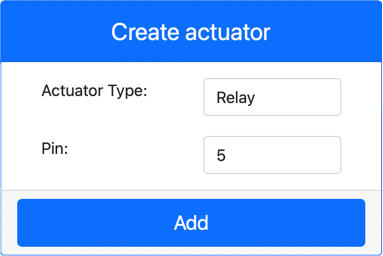

<!--
CO_OP_TRANSLATOR_METADATA:
{
  "original_hash": "f8f541ee945545017a51aaf309aa37c3",
  "translation_date": "2025-08-28T20:43:52+00:00",
  "source_file": "2-farm/lessons/3-automated-plant-watering/virtual-device-relay.md",
  "language_code": "lt"
}
-->
# Valdykite relę - Virtuali IoT įranga

Šioje pamokos dalyje pridėsite relę prie savo virtualaus IoT įrenginio, be dirvožemio drėgmės jutiklio, ir valdysite ją pagal dirvožemio drėgmės lygį.

## Virtuali įranga

Virtualus IoT įrenginys naudos simuliuotą Grove relę. Tai leidžia šį laboratorinį darbą išlaikyti tokį patį, kaip naudojant Raspberry Pi su fizine Grove rele.

Fiziniame IoT įrenginyje relė būtų paprastai atvira relė (tai reiškia, kad išėjimo grandinė yra atvira arba atjungta, kai relei nėra siunčiamas signalas). Tokia relė gali valdyti išėjimo grandines iki 250V ir 10A.

### Pridėkite relę prie CounterFit

Norėdami naudoti virtualią relę, turite ją pridėti prie CounterFit programos.

#### Užduotis

Pridėkite relę prie CounterFit programos.

1. Atidarykite `soil-moisture-sensor` projektą iš paskutinės pamokos VS Code, jei jis dar neatidarytas. Jūs papildysite šį projektą.

1. Įsitikinkite, kad CounterFit internetinė programa veikia.

1. Sukurkite relę:

    1. *Create actuator* laukelyje, esančiame *Actuators* skydelyje, išskleiskite *Actuator type* laukelį ir pasirinkite *Relay*.

    1. Nustatykite *Pin* į *5*.

    1. Paspauskite **Add** mygtuką, kad sukurtumėte relę ant 5 kaiščio.

    

    Relė bus sukurta ir pasirodys aktuatorių sąraše.

    

## Programuokite relę

Dabar dirvožemio drėgmės jutiklio programą galima programuoti naudoti virtualią relę.

### Užduotis

Programuokite virtualų įrenginį.

1. Atidarykite `soil-moisture-sensor` projektą iš paskutinės pamokos VS Code, jei jis dar neatidarytas. Jūs papildysite šį projektą.

1. Pridėkite šį kodą prie `app.py` failo, po esamais importais:

    ```python
    from counterfit_shims_grove.grove_relay import GroveRelay
    ```

    Šis teiginys importuoja `GroveRelay` iš Grove Python shim bibliotekų, kad galėtumėte sąveikauti su virtualia Grove rele.

1. Pridėkite šį kodą po `ADC` klasės deklaracijos, kad sukurtumėte `GroveRelay` instanciją:

    ```python
    relay = GroveRelay(5)
    ```

    Tai sukuria relę, naudojant **5** kaištį, prie kurio prijungėte relę.

1. Norėdami patikrinti, ar relė veikia, pridėkite šį kodą prie `while True:` ciklo:

    ```python
    relay.on()
    time.sleep(.5)
    relay.off()
    ```

    Kodas įjungia relę, laukia 0,5 sekundės, tada ją išjungia.

1. Paleiskite Python programą. Relė įsijungs ir išsijungs kas 10 sekundžių, su pusės sekundės pertrauka tarp įjungimo ir išjungimo. CounterFit programoje matysite, kaip virtuali relė užsidaro ir atsidaro, kai relė įjungiama ir išjungiama.

    

## Valdykite relę pagal dirvožemio drėgmę

Dabar, kai relė veikia, ją galima valdyti reaguojant į dirvožemio drėgmės rodmenis.

### Užduotis

Valdykite relę.

1. Ištrinkite 3 kodo eilutes, kurias pridėjote norėdami patikrinti relę. Pakeiskite jas šiuo kodu:

    ```python
    if soil_moisture > 450:
        print("Soil Moisture is too low, turning relay on.")
        relay.on()
    else:
        print("Soil Moisture is ok, turning relay off.")
        relay.off()
    ```

    Šis kodas tikrina dirvožemio drėgmės lygį iš dirvožemio drėgmės jutiklio. Jei jis viršija 450, relė įjungiama, o jei nukrenta žemiau 450, ji išjungiama.

    > 💁 Atminkite, kad talpinis dirvožemio drėgmės jutiklis rodo: kuo mažesnis dirvožemio drėgmės lygis, tuo daugiau drėgmės yra dirvožemyje, ir atvirkščiai.

1. Paleiskite Python programą. Matysite, kaip relė įsijungia arba išsijungia, priklausomai nuo dirvožemio drėgmės lygio. Pakeiskite *Value* arba *Random* nustatymus dirvožemio drėgmės jutikliui, kad pamatytumėte, kaip keičiasi reikšmė.

    ```output
    Soil Moisture: 638
    Soil Moisture is too low, turning relay on.
    Soil Moisture: 452
    Soil Moisture is too low, turning relay on.
    Soil Moisture: 347
    Soil Moisture is ok, turning relay off.
    ```

> 💁 Šį kodą galite rasti [code-relay/virtual-device](../../../../../2-farm/lessons/3-automated-plant-watering/code-relay/virtual-device) aplanke.

😀 Jūsų virtualus dirvožemio drėgmės jutiklis, valdantis relę, buvo sėkmingas!

---

**Atsakomybės apribojimas**:  
Šis dokumentas buvo išverstas naudojant AI vertimo paslaugą [Co-op Translator](https://github.com/Azure/co-op-translator). Nors siekiame tikslumo, prašome atkreipti dėmesį, kad automatiniai vertimai gali turėti klaidų ar netikslumų. Originalus dokumentas jo gimtąja kalba turėtų būti laikomas autoritetingu šaltiniu. Kritinei informacijai rekomenduojama naudoti profesionalų žmogaus vertimą. Mes neprisiimame atsakomybės už nesusipratimus ar klaidingus interpretavimus, atsiradusius dėl šio vertimo naudojimo.