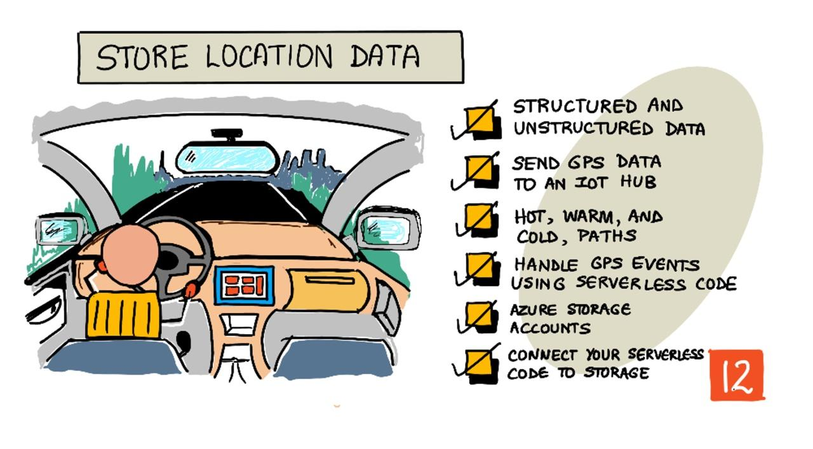

<!--
CO_OP_TRANSLATOR_METADATA:
{
  "original_hash": "e345843ccfeb7261d81500d19c64d476",
  "translation_date": "2025-08-28T19:47:43+00:00",
  "source_file": "3-transport/lessons/2-store-location-data/README.md",
  "language_code": "lt"
}
-->
# Parduotuvės vietos duomenys



> Eskizą sukūrė [Nitya Narasimhan](https://github.com/nitya). Spustelėkite paveikslėlį, kad pamatytumėte didesnę versiją.

## Klausimynas prieš paskaitą

[Klausimynas prieš paskaitą](https://black-meadow-040d15503.1.azurestaticapps.net/quiz/23)

## Įvadas

Praėjusioje pamokoje išmokote naudoti GPS jutiklį vietos duomenims fiksuoti. Norint šiuos duomenis vizualizuoti, pavyzdžiui, stebėti maisto prikrauto sunkvežimio vietą ir kelionę, juos reikia siųsti į debesijos IoT paslaugą ir kažkur saugoti.

Šioje pamokoje sužinosite apie skirtingus IoT duomenų saugojimo būdus ir išmoksite saugoti duomenis iš savo IoT paslaugos naudojant serverless kodą.

Šioje pamokoje aptarsime:

* [Struktūrizuoti ir nestruktūrizuoti duomenys](../../../../../3-transport/lessons/2-store-location-data)
* [GPS duomenų siuntimas į IoT Hub](../../../../../3-transport/lessons/2-store-location-data)
* [Karštieji, šiltieji ir šalti keliai](../../../../../3-transport/lessons/2-store-location-data)
* [GPS įvykių apdorojimas naudojant serverless kodą](../../../../../3-transport/lessons/2-store-location-data)
* [Azure saugojimo paskyros](../../../../../3-transport/lessons/2-store-location-data)
* [Serverless kodo prijungimas prie saugyklos](../../../../../3-transport/lessons/2-store-location-data)

## Struktūrizuoti ir nestruktūrizuoti duomenys

Kompiuterinės sistemos dirba su duomenimis, kurie gali būti įvairių formų ir dydžių. Jie gali būti nuo pavienių skaičių iki didelių tekstų, vaizdo įrašų, nuotraukų ar IoT duomenų. Duomenys paprastai skirstomi į dvi kategorijas – *struktūrizuoti* ir *nestruktūrizuoti* duomenys.

* **Struktūrizuoti duomenys** – tai duomenys, turintys aiškią, griežtą struktūrą, kuri nesikeičia, ir paprastai atitinka lenteles su tarpusavio ryšiais. Pavyzdys – asmens duomenys, tokie kaip vardas, gimimo data ir adresas.

* **Nestruktūrizuoti duomenys** – tai duomenys, neturintys aiškios, griežtos struktūros, įskaitant duomenis, kurių struktūra gali dažnai keistis. Pavyzdys – dokumentai, tokie kaip rašytiniai tekstai ar skaičiuoklės.

✅ Atlikite tyrimą: Ar galite sugalvoti kitų struktūrizuotų ir nestruktūrizuotų duomenų pavyzdžių?

> 💁 Taip pat egzistuoja pusiau struktūrizuoti duomenys, kurie turi struktūrą, bet netelpa į fiksuotas lenteles.

IoT duomenys paprastai laikomi nestruktūrizuotais duomenimis.

Įsivaizduokite, kad įdiegiate IoT įrenginius didelės komercinės fermos transporto priemonių parke. Galbūt norėsite naudoti skirtingus įrenginius skirtingoms transporto priemonėms. Pavyzdžiui:

* Ūkio technikai, tokiai kaip traktoriai, norite GPS duomenų, kad įsitikintumėte, jog jie dirba tinkamuose laukuose.
* Maisto pristatymo sunkvežimiams norite GPS duomenų, taip pat greičio ir pagreičio duomenų, kad įsitikintumėte, jog vairuotojas vairuoja saugiai, bei vairuotojo tapatybės ir start/stop duomenų, kad užtikrintumėte darbo valandų laikymąsi pagal vietinius įstatymus.
* Šaldytuvuose sunkvežimiuose norite temperatūros duomenų, kad maistas nesugestų dėl per aukštos ar žemos temperatūros.

Šie duomenys gali nuolat keistis. Pavyzdžiui, jei IoT įrenginys yra sunkvežimio kabinoje, jis gali siųsti skirtingus duomenis, kai keičiasi priekaba, pavyzdžiui, tik temperatūros duomenis, kai naudojama šaldytuvo priekaba.

✅ Kokius kitus IoT duomenis galima fiksuoti? Pagalvokite apie krovinius, kuriuos gali vežti sunkvežimiai, taip pat apie techninės priežiūros duomenis.

Šie duomenys skiriasi priklausomai nuo transporto priemonės, tačiau visi jie siunčiami į tą pačią IoT paslaugą apdorojimui. IoT paslauga turi sugebėti apdoroti šiuos nestruktūrizuotus duomenis, juos saugoti taip, kad būtų galima ieškoti ar analizuoti, tačiau dirbti su skirtingomis šių duomenų struktūromis.

### SQL ir NoSQL saugyklos

Duomenų bazės yra paslaugos, leidžiančios saugoti ir užklausinėti duomenis. Duomenų bazės skirstomos į dvi rūšis – SQL ir NoSQL.

#### SQL duomenų bazės

Pirmosios duomenų bazės buvo reliacinės duomenų bazių valdymo sistemos (RDBMS), dar vadinamos SQL duomenų bazėmis dėl struktūrizuotos užklausų kalbos (SQL), naudojamos duomenims pridėti, pašalinti, atnaujinti ar užklausinėti. Šios duomenų bazės turi schemą – aiškiai apibrėžtą duomenų lentelių rinkinį, panašų į skaičiuoklę. Kiekviena lentelė turi kelis pavadintus stulpelius. Kai įterpiate duomenis, pridedate eilutę į lentelę, įrašydami reikšmes į kiekvieną stulpelį. Tai užtikrina labai griežtą duomenų struktūrą – nors galite palikti stulpelius tuščius, jei norite pridėti naują stulpelį, turite tai padaryti duomenų bazėje, užpildydami reikšmes esamoms eilutėms. Šios duomenų bazės yra reliacinės – viena lentelė gali turėti ryšį su kita.


Pavyzdžiui, jei saugote vartotojo asmeninius duomenis lentelėje, turėtumėte tam tikrą unikalų ID kiekvienam vartotojui, kuris naudojamas eilutėje lentelėje, kurioje yra vartotojo vardas ir adresas. Jei norėtumėte saugoti kitus duomenis apie tą vartotoją, pavyzdžiui, jo pirkimus, kitoje lentelėje turėtumėte vieną stulpelį tam vartotojo ID. Kai ieškote vartotojo, galite naudoti jo ID, kad gautumėte asmeninius duomenis iš vienos lentelės ir pirkimus iš kitos.

SQL duomenų bazės idealiai tinka struktūrizuotiems duomenims saugoti ir kai norite užtikrinti, kad duomenys atitiktų jūsų schemą.

✅ Jei dar nesate naudoję SQL, skirkite laiko perskaityti apie tai [SQL puslapyje Vikipedijoje](https://wikipedia.org/wiki/SQL).

Kai kurios gerai žinomos SQL duomenų bazės yra Microsoft SQL Server, MySQL ir PostgreSQL.

✅ Atlikite tyrimą: Perskaitykite apie kai kurias iš šių SQL duomenų bazių ir jų galimybes.

#### NoSQL duomenų bazės

NoSQL duomenų bazės vadinamos NoSQL, nes jos neturi tokios griežtos struktūros kaip SQL duomenų bazės. Jos taip pat vadinamos dokumentų duomenų bazėmis, nes gali saugoti nestruktūrizuotus duomenis, tokius kaip dokumentai.

> 💁 Nepaisant jų pavadinimo, kai kurios NoSQL duomenų bazės leidžia naudoti SQL užklausoms vykdyti.


NoSQL duomenų bazės neturi iš anksto apibrėžtos schemos, kuri ribotų, kaip duomenys saugomi. Vietoj to, galite įterpti bet kokius nestruktūrizuotus duomenis, paprastai naudojant JSON dokumentus. Šie dokumentai gali būti organizuojami į aplankus, panašiai kaip failai jūsų kompiuteryje. Kiekvienas dokumentas gali turėti skirtingus laukus nei kiti dokumentai – pavyzdžiui, jei saugote IoT duomenis iš savo ūkio transporto priemonių, kai kurie gali turėti laukus akselerometro ir greičio duomenims, kiti – priekabos temperatūros duomenims. Jei pridėtumėte naujo tipo sunkvežimį, pavyzdžiui, su įmontuotomis svarstyklėmis, skirtomis stebėti vežamo krovinio svorį, jūsų IoT įrenginys galėtų pridėti šį naują lauką, ir jis būtų saugomas be jokių pakeitimų duomenų bazėje.

Kai kurios gerai žinomos NoSQL duomenų bazės yra Azure CosmosDB, MongoDB ir CouchDB.

✅ Atlikite tyrimą: Perskaitykite apie kai kurias iš šių NoSQL duomenų bazių ir jų galimybes.

Šioje pamokoje naudosite NoSQL saugyklą IoT duomenims saugoti.

## GPS duomenų siuntimas į IoT Hub

Praėjusioje pamokoje fiksavote GPS duomenis iš GPS jutiklio, prijungto prie jūsų IoT įrenginio. Norėdami saugoti šiuos IoT duomenis debesyje, turite juos siųsti į IoT paslaugą. Vėl naudosite Azure IoT Hub – tą pačią IoT debesijos paslaugą, kurią naudojote ankstesniame projekte.


### Užduotis – GPS duomenų siuntimas į IoT Hub

1. Sukurkite naują IoT Hub, naudodami nemokamą planą.

    > ⚠️ Jei reikia, galite pasinaudoti [instrukcijomis, kaip sukurti IoT Hub iš 2 projekto, 4 pamokos](../../../2-farm/lessons/4-migrate-your-plant-to-the-cloud/README.md#create-an-iot-service-in-the-cloud).

    Nepamirškite sukurti naujos išteklių grupės. Naują išteklių grupę pavadinkite `gps-sensor`, o naują IoT Hub – unikaliu pavadinimu, pagrįstu `gps-sensor`, pavyzdžiui, `gps-sensor-<jūsų vardas>`.

    > 💁 Jei vis dar turite savo IoT Hub iš ankstesnio projekto, galite jį naudoti iš naujo. Nepamirškite naudoti šio IoT Hub pavadinimo ir išteklių grupės, kurioje jis yra, kai kuriate kitas paslaugas.

1. Pridėkite naują įrenginį prie IoT Hub. Pavadinkite šį įrenginį `gps-sensor`. Gaukite įrenginio prisijungimo eilutę.

1. Atnaujinkite savo įrenginio kodą, kad GPS duomenys būtų siunčiami į naują IoT Hub, naudojant ankstesniame žingsnyje gautą prisijungimo eilutę.

    > ⚠️ Jei reikia, galite pasinaudoti [instrukcijomis, kaip prijungti savo įrenginį prie IoT iš 2 projekto, 4 pamokos](../../../2-farm/lessons/4-migrate-your-plant-to-the-cloud/README.md#connect-your-device-to-the-iot-service).

1. Siųskite GPS duomenis JSON formatu, naudodami šią struktūrą:

    ```json
    {
        "gps" :
        {
            "lat" : <latitude>,
            "lon" : <longitude>
        }
    }
    ```

1. Siųskite GPS duomenis kas minutę, kad neišnaudotumėte savo dienos pranešimų limito.

Jei naudojate Wio Terminal, nepamirškite pridėti visų reikalingų bibliotekų ir nustatyti laiką naudojant NTP serverį. Jūsų kodas taip pat turi užtikrinti, kad jis perskaitytų visus duomenis iš serijinio prievado prieš siunčiant GPS vietą, naudodamas esamą kodą iš praėjusios pamokos. Naudokite šį kodą JSON dokumentui sukurti:

```cpp
DynamicJsonDocument doc(1024);
doc["gps"]["lat"] = gps.location.lat();
doc["gps"]["lon"] = gps.location.lng();
```

Jei naudojate virtualų IoT įrenginį, nepamirškite įdiegti visų reikalingų bibliotekų, naudodami virtualią aplinką.

Tiek Raspberry Pi, tiek virtualiam IoT įrenginiui naudokite esamą kodą iš praėjusios pamokos, kad gautumėte platumos ir ilgumos reikšmes, tada siųskite jas tinkamu JSON formatu, naudodami šį kodą:

```python
message_json = { "gps" : { "lat":lat, "lon":lon } }
print("Sending telemetry", message_json)
message = Message(json.dumps(message_json))
```

> 💁 Šį kodą galite rasti [code/wio-terminal](../../../../../3-transport/lessons/2-store-location-data/code/wio-terminal), [code/pi](../../../../../3-transport/lessons/2-store-location-data/code/pi) arba [code/virtual-device](../../../../../3-transport/lessons/2-store-location-data/code/virtual-device) aplankuose.

Paleiskite savo įrenginio kodą ir įsitikinkite, kad pranešimai pasiekia IoT Hub, naudodami `az iot hub monitor-events` CLI komandą.

## Karštieji, šiltieji ir šalti keliai

Duomenys, kurie teka iš IoT įrenginio į debesį, ne visada apdorojami realiuoju laiku. Kai kurie duomenys turi būti apdorojami realiuoju laiku, kiti – šiek tiek vėliau, o dar kiti – daug vėliau. Duomenų srautas į skirtingas paslaugas, kurios apdoroja duomenis skirtingu laiku, vadinamas karštaisiais, šiltaisiais ir šaltaisiais keliais.

### Karštasis kelias

Karštasis kelias reiškia duomenis, kuriuos reikia apdoroti realiuoju arba beveik realiuoju laiku. Karštieji duomenys naudojami įspėjimams, pavyzdžiui, kai transporto priemonė artėja prie sandėlio arba kai šaldytuvo sunkvežimio temperatūra yra per aukšta.

Norėdami naudoti karštuosius duomenis, jūsų kodas turi reaguoti į įvykius, kai tik jie pasiekia jūsų debesijos paslaugas.

### Šiltasis kelias

Šiltasis kelias reiškia duomenis, kuriuos galima apdoroti šiek tiek vėliau, pavyzdžiui, ataskaitoms ar trumpalaikei analizei. Šiltieji duomenys gali būti naudojami kasdienėms ataskaitoms apie transporto priemonių ridą, naudojant ankstesnės dienos duomenis.

Šiltieji duomenys saugomi debesyje, kai tik jie pasiekiami, tam tikroje greitai pasiekiamoje saugykloje.

### Šaltasis kelias

Šaltasis kelias reiškia istorinius duomenis, kurie saugomi ilgą laiką ir gali būti apdorojami bet kada. Pavyzdžiui, šaltieji duomenys gali būti naudojami metinėms transporto priemonių ridų ataskaitoms arba maršrutų analizei, siekiant rasti optimaliausią maršrutą degalų sąnaudoms sumažinti.

Šaltieji duomenys saugomi duomenų sandėliuose – duomenų bazėse, skirtose dideliam nekintančių duomenų kiekiui saugoti, kuriuos galima greitai ir lengvai užklausti. Paprastai jūsų debesijos programoje būtų reguliariai vykdomas darbas, kuris kasdien, kas savaitę ar kas mėnesį perkelia duomenis iš šiltosios saugyklos į duomenų sandėlį.

✅ Pagalvokite apie duomenis, kuriuos iki šiol fiksavote šiose pamokose. Ar jie priklauso karštajam, šiltajam ar šaltajam keliui?

## GPS įvykių apdorojimas naudojant serverless kodą

Kai duomenys pasiekia jūsų IoT Hub, galite parašyti serverless kodą, kuris klausytų įvykių, siunčiamų į Event-Hub suderinamą galinį tašką. Tai yra šiltasis kelias – šie duomenys bus
> ⚠️ Galite pasinaudoti [instrukcijomis, kaip sukurti Azure Functions projektą iš 2 projekto, 5 pamokos](../../../2-farm/lessons/5-migrate-application-to-the-cloud/README.md#create-a-serverless-application), jei reikia.
1. Pridėkite IoT Hub įvykio trigerį, kuris naudoja IoT Hub suderinamą Event Hub galinį tašką.

    > ⚠️ Jei reikia, galite pasinaudoti [instrukcijomis, kaip sukurti IoT Hub įvykio trigerį iš projekto 2, pamokos 5](../../../2-farm/lessons/5-migrate-application-to-the-cloud/README.md#create-an-iot-hub-event-trigger).

1. Nustatykite Event Hub suderinamo galinio taško prisijungimo eilutę `local.settings.json` faile ir naudokite šio įrašo raktą `function.json` faile.

1. Naudokite Azurite programą kaip vietinį saugyklos emuliatorių.

1. Paleiskite savo funkcijų programą, kad įsitikintumėte, jog ji gauna įvykius iš jūsų GPS įrenginio. Įsitikinkite, kad jūsų IoT įrenginys taip pat veikia ir siunčia GPS duomenis.

    ```output
    Python EventHub trigger processed an event: {"gps": {"lat": 47.73481, "lon": -122.25701}}
    ```

## Azure saugyklos paskyros


Azure saugyklos paskyros yra universali saugyklos paslauga, kuri gali saugoti duomenis įvairiais būdais. Duomenis galite saugoti kaip blobus, eilėse, lentelėse arba failuose, ir visa tai vienu metu.

### Blob saugykla

Žodis *Blob* reiškia didelius dvejetainius objektus, tačiau tapo terminu, apibūdinančiu bet kokius nestruktūrizuotus duomenis. Blob saugykloje galite saugoti bet kokius duomenis, nuo JSON dokumentų su IoT duomenimis iki vaizdų ir filmų failų. Blob saugykla turi *konteinerių* koncepciją – pavadintus „kibirus“, kuriuose galite saugoti duomenis, panašiai kaip lentelės reliacinėje duomenų bazėje. Šie konteineriai gali turėti vieną ar daugiau aplankų blobams saugoti, o kiekvienas aplankas gali turėti kitus aplankus, panašiai kaip failai saugomi jūsų kompiuterio kietajame diske.

Šioje pamokoje naudosite blob saugyklą IoT duomenims saugoti.

✅ Atlikite tyrimą: Perskaitykite apie [Azure Blob Storage](https://docs.microsoft.com/azure/storage/blobs/storage-blobs-overview?WT.mc_id=academic-17441-jabenn)

### Lentelių saugykla

Lentelių saugykla leidžia saugoti pusiau struktūrizuotus duomenis. Lentelių saugykla iš tikrųjų yra NoSQL duomenų bazė, todėl nereikalauja iš anksto apibrėžtų lentelių rinkinio, tačiau ji skirta duomenims saugoti vienoje ar keliose lentelėse, naudojant unikalius raktus kiekvienai eilutei apibrėžti.

✅ Atlikite tyrimą: Perskaitykite apie [Azure Table Storage](https://docs.microsoft.com/azure/storage/tables/table-storage-overview?WT.mc_id=academic-17441-jabenn)

### Eilių saugykla

Eilių saugykla leidžia saugoti iki 64 KB dydžio pranešimus eilėje. Pranešimus galite pridėti eilės gale ir skaityti juos iš eilės priekio. Eilės saugo pranešimus neribotą laiką, kol yra pakankamai saugyklos vietos, todėl leidžia pranešimus saugoti ilgą laiką, o vėliau juos perskaityti, kai reikia. Pavyzdžiui, jei norėtumėte vykdyti mėnesinį darbą GPS duomenims apdoroti, galėtumėte pridėti pranešimus į eilę kiekvieną dieną mėnesį, o mėnesio pabaigoje apdoroti visus pranešimus iš eilės.

✅ Atlikite tyrimą: Perskaitykite apie [Azure Queue Storage](https://docs.microsoft.com/azure/storage/queues/storage-queues-introduction?WT.mc_id=academic-17441-jabenn)

### Failų saugykla

Failų saugykla yra failų saugojimas debesyje, o bet kokios programos ar įrenginiai gali prisijungti naudodami pramonės standartus. Failus galite rašyti į failų saugyklą, o vėliau prijungti ją kaip diską prie savo kompiuterio ar Mac.

✅ Atlikite tyrimą: Perskaitykite apie [Azure File Storage](https://docs.microsoft.com/azure/storage/files/storage-files-introduction?WT.mc_id=academic-17441-jabenn)

## Prijunkite savo serverless kodą prie saugyklos

Dabar jūsų funkcijų programa turi prisijungti prie blob saugyklos, kad galėtų saugoti pranešimus iš IoT Hub. Yra 2 būdai tai padaryti:

* Funkcijos kode prisijungti prie blob saugyklos naudojant blob saugyklos Python SDK ir rašyti duomenis kaip blobus
* Naudoti išvesties funkcijos susiejimą, kad susietumėte funkcijos grąžinimo vertę su blob saugykla ir automatiškai išsaugotumėte blobą

Šioje pamokoje naudosite Python SDK, kad pamatytumėte, kaip sąveikauti su blob saugykla.


Duomenys bus išsaugoti kaip JSON blobas su šiuo formatu:

```json
{
    "device_id": <device_id>,
    "timestamp" : <time>,
    "gps" :
    {
        "lat" : <latitude>,
        "lon" : <longitude>
    }
}
```

### Užduotis - prijunkite savo serverless kodą prie saugyklos

1. Sukurkite Azure saugyklos paskyrą. Pavadinkite ją, pavyzdžiui, `gps<jūsų vardas>`.

    > ⚠️ Jei reikia, galite pasinaudoti [instrukcijomis, kaip sukurti saugyklos paskyrą iš projekto 2, pamokos 5](../../../2-farm/lessons/5-migrate-application-to-the-cloud/README.md#task---create-the-cloud-resources).

    Jei vis dar turite saugyklos paskyrą iš ankstesnio projekto, galite ją pakartotinai naudoti.

    > 💁 Vėliau šioje pamokoje galėsite naudoti tą pačią saugyklos paskyrą savo Azure Functions programai diegti.

1. Paleiskite šią komandą, kad gautumėte saugyklos paskyros prisijungimo eilutę:

    ```sh
    az storage account show-connection-string --output table \
                                              --name <storage_name>
    ```

    Pakeiskite `<storage_name>` į saugyklos paskyros pavadinimą, kurį sukūrėte ankstesniame žingsnyje.

1. Pridėkite naują įrašą `local.settings.json` faile savo saugyklos paskyros prisijungimo eilutei, naudodami vertę iš ankstesnio žingsnio. Pavadinkite jį `STORAGE_CONNECTION_STRING`.

1. Pridėkite šiuos įrašus į `requirements.txt` failą, kad įdiegtumėte Azure saugyklos Pip paketus:

    ```sh
    azure-storage-blob
    ```

    Įdiekite paketus iš šio failo savo virtualioje aplinkoje.

    > Jei gaunate klaidą, atnaujinkite savo Pip versiją virtualioje aplinkoje į naujausią versiją naudodami šią komandą, tada bandykite dar kartą:
    >
    > ```sh
    > pip install --upgrade pip
    > ```

1. `__init__.py` faile `iot-hub-trigger` pridėkite šiuos importavimo teiginius:

    ```python
    import json
    import os
    import uuid
    from azure.storage.blob import BlobServiceClient, PublicAccess
    ```

    `json` sisteminis modulis bus naudojamas JSON skaitymui ir rašymui, `os` sisteminis modulis bus naudojamas prisijungimo eilutės skaitymui, `uuid` sisteminis modulis bus naudojamas unikaliam GPS skaitymo ID generavimui.

    `azure.storage.blob` paketas turi Python SDK darbui su blob saugykla.

1. Prieš `main` metodą pridėkite šią pagalbinę funkciją:

    ```python
    def get_or_create_container(name):
        connection_str = os.environ['STORAGE_CONNECTION_STRING']
        blob_service_client = BlobServiceClient.from_connection_string(connection_str)
    
        for container in blob_service_client.list_containers():
            if container.name == name:
                return blob_service_client.get_container_client(container.name)
        
        return blob_service_client.create_container(name, public_access=PublicAccess.Container)
    ```

    Python blob SDK neturi pagalbinio metodo konteinerio sukūrimui, jei jis neegzistuoja. Šis kodas įkels prisijungimo eilutę iš `local.settings.json` failo (arba Application Settings, kai bus įdiegtas debesyje), tada sukurs `BlobServiceClient` klasę, kad sąveikautų su blob saugyklos paskyra. Tada jis peržiūrės visus blob saugyklos paskyros konteinerius, ieškodamas tokio su pateiktu pavadinimu – jei ras, grąžins `ContainerClient` klasę, kuri gali sąveikauti su konteineriu, kad sukurtų blobus. Jei neranda, konteineris bus sukurtas ir grąžinamas naujo konteinerio klientas.

    Kai naujas konteineris sukuriamas, suteikiama vieša prieiga užklausoms apie konteinerio blobus. Tai bus naudojama kitoje pamokoje GPS duomenims vizualizuoti žemėlapyje.

1. Skirtingai nei su dirvožemio drėgme, šiuo kodu norime saugoti kiekvieną įvykį, todėl pridėkite šį kodą `for event in events:` cikle `main` funkcijoje, po `logging` teiginio:

    ```python
    device_id = event.iothub_metadata['connection-device-id']
    blob_name = f'{device_id}/{str(uuid.uuid1())}.json'
    ```

    Šis kodas gauna įrenginio ID iš įvykio metaduomenų, tada naudoja jį blob pavadinimui sukurti. Blobai gali būti saugomi aplankuose, o įrenginio ID bus naudojamas kaip aplanko pavadinimas, todėl kiekvienas įrenginys turės visus savo GPS įvykius viename aplanke. Blob pavadinimas yra šis aplankas, po kurio eina dokumento pavadinimas, atskirtas pasviraisiais brūkšniais, panašiai kaip Linux ir macOS keliai (panašiai kaip Windows, tačiau Windows naudoja atgalinius brūkšnius). Dokumento pavadinimas yra unikalus ID, sugeneruotas naudojant Python `uuid` modulį, su failo tipu `json`.

    Pavyzdžiui, įrenginio ID `gps-sensor` blob pavadinimas gali būti `gps-sensor/a9487ac2-b9cf-11eb-b5cd-1e00621e3648.json`.

1. Pridėkite šį kodą po to:

    ```python
    container_client = get_or_create_container('gps-data')
    blob = container_client.get_blob_client(blob_name)
    ```

    Šis kodas gauna konteinerio klientą naudodamas `get_or_create_container` pagalbinę klasę, o tada gauna blob klientą naudodamas blob pavadinimą. Šie blob klientai gali nurodyti esamus blobus arba, kaip šiuo atveju, naujus blobus.

1. Pridėkite šį kodą po to:

    ```python
    event_body = json.loads(event.get_body().decode('utf-8'))
    blob_body = {
        'device_id' : device_id,
        'timestamp' : event.iothub_metadata['enqueuedtime'],
        'gps': event_body['gps']
    }
    ```

    Šis kodas sukuria blob turinį, kuris bus įrašytas į blob saugyklą. Tai JSON dokumentas, kuriame yra įrenginio ID, laikas, kada telemetrija buvo išsiųsta į IoT Hub, ir GPS koordinatės iš telemetrijos.

    > 💁 Svarbu naudoti pranešimo įkėlimo laiką, o ne dabartinį laiką, kad gautumėte laiką, kada pranešimas buvo išsiųstas. Jis gali būti laikomas hub'e kurį laiką, kol bus paimtas, jei Functions App neveikia.

1. Pridėkite šį kodą po to:

    ```python
    logging.info(f'Writing blob to {blob_name} - {blob_body}')
    blob.upload_blob(json.dumps(blob_body).encode('utf-8'))
    ```

    Šis kodas registruoja, kad blobas bus įrašytas su jo detalėmis, tada įkelia blob turinį kaip naujo blobo turinį.

1. Paleiskite Functions programą. Matysite, kaip blobai įrašomi visiems GPS įvykiams išvestyje:

    ```output
    [2021-05-21T01:31:14.325Z] Python EventHub trigger processed an event: {"gps": {"lat": 47.73092, "lon": -122.26206}}
    ...
    [2021-05-21T01:31:14.351Z] Writing blob to gps-sensor/4b6089fe-ba8d-11eb-bc7b-1e00621e3648.json - {'device_id': 'gps-sensor', 'timestamp': '2021-05-21T00:57:53.878Z', 'gps': {'lat': 47.73092, 'lon': -122.26206}}
    ```

    > 💁 Įsitikinkite, kad tuo pačiu metu neveikia IoT Hub įvykių stebėjimo įrankis.

> 💁 Šį kodą galite rasti [code/functions](../../../../../3-transport/lessons/2-store-location-data/code/functions) aplanke.

### Užduotis - patikrinkite įkeltus blobus

1. Norėdami peržiūrėti sukurtus blobus, galite naudoti [Azure Storage Explorer](https://azure.microsoft.com/features/storage-explorer/?WT.mc_id=academic-17441-jabenn), nemokamą įrankį, leidžiantį peržiūrėti ir valdyti saugyklos paskyras, arba CLI.

    1. Norėdami naudoti CLI, pirmiausia jums reikės paskyros rakto. Paleiskite šią komandą, kad gautumėte šį raktą:

        ```sh
        az storage account keys list --output table \
                                     --account-name <storage_name>
        ```

        Pakeiskite `<storage_name>` į saugyklos paskyros pavadinimą.

        Nukopijuokite `key1` reikšmę.

    1. Paleiskite šią komandą, kad išvardytumėte blobus konteineryje:

        ```sh
        az storage blob list --container-name gps-data \
                             --output table \
                             --account-name <storage_name> \
                             --account-key <key1>
        ```

        Pakeiskite `<storage_name>` į saugyklos paskyros pavadinimą ir `<key1>` į `key1` reikšmę, kurią nukopijavote ankstesniame žingsnyje.

        Tai išvardins visus blobus konteineryje:

        ```output
        Name                                                  Blob Type    Blob Tier    Length    Content Type              Last Modified              Snapshot
        ----------------------------------------------------  -----------  -----------  --------  ------------------------  -------------------------  ----------
        gps-sensor/1810d55e-b9cf-11eb-9f5b-1e00621e3648.json  BlockBlob    Hot          45        application/octet-stream  2021-05-21T00:54:27+00:00
        gps-sensor/18293e46-b9cf-11eb-9f5b-1e00621e3648.json  BlockBlob    Hot          45        application/octet-stream  2021-05-21T00:54:28+00:00
        gps-sensor/1844549c-b9cf-11eb-9f5b-1e00621e3648.json  BlockBlob    Hot          45        application/octet-stream  2021-05-21T00:54:28+00:00
        gps-sensor/1894d714-b9cf-11eb-9f5b-1e00621e3648.json  BlockBlob    Hot          45        application/octet-stream  2021-05-21T00:54:28+00:00
        ```

    1. Atsisiųskite vieną iš blobų naudodami šią komandą:

        ```sh
        az storage blob download --container-name gps-data \
                                 --account-name <storage_name> \
                                 --account-key <key1> \
                                 --name <blob_name> \
                                 --file <file_name>
        ```

        Pakeiskite `<storage_name>` į saugyklos paskyros pavadinimą ir `<key1>` į `key1` reikšmę, kurią nukopijavote ankstesniame žingsnyje.

        Pakeiskite `<blob_name>` į pilną pavadinimą iš `Name` stulpelio ankstesnio žingsnio išvestyje, įskaitant aplanko pavadinimą. Pakeiskite `<file_name>` į vietinio failo pavadinimą, kuriame bus išsaugotas blobas.

    Atsisiuntus, galite atidaryti JSON failą VS Code ir matysite blobą su GPS vietos detalėmis:

    ```json
    {"device_id": "gps-sensor", "timestamp": "2021-05-21T00:57:53.878Z", "gps": {"lat": 47.73092, "lon": -122.26206}}
    ```

### Užduotis - įdiekite savo Functions programą į debesį

Dabar, kai jūsų Functions programa veikia, galite ją įdiegti į debesį.

1. Sukurkite naują Azure Functions programą, naudodami saugyklos paskyrą, kurią sukūrėte anksčiau. Pavadinkite ją, pavyzdžiui, `gps-sensor-` ir pridėkite unikalų identifikatorių, pvz., kelis atsitiktinius žodžius arba savo vardą.

    > ⚠️ Jei reikia, galite pasinaudoti [instrukcijomis, kaip sukurti Functions programą iš projekto 2, pamokos 5](../../../2-farm/lessons/5-migrate-application-to-the-cloud/README.md#task---create-the-cloud-resources).

1. Įkelkite `IOT_HUB_CONNECTION_STRING` ir `STORAGE_CONNECTION_STRING` reikšmes į Application Settings.

    > ⚠️ Jei reikia, galite pasinaudoti [instrukcijomis, kaip įkelti Application Settings iš projekto 2, pamokos 5](../../../2-farm/lessons/5-migrate-application-to-the-cloud/README.md#task---upload-your-application-settings).

1. Įdiekite savo vietinę Functions programą į debesį.
> ⚠️ Galite pasinaudoti [instrukcijomis, kaip įdiegti savo Functions programą iš 2 projekto, 5 pamokos](../../../2-farm/lessons/5-migrate-application-to-the-cloud/README.md#task---deploy-your-functions-app-to-the-cloud), jei reikia.
## 🚀 Iššūkis

GPS duomenys nėra visiškai tikslūs, o aptinkamos vietos gali būti netikslios keliais metrais ar net daugiau, ypač tuneliuose ir aukštų pastatų zonose.

Pagalvokite, kaip palydovinė navigacija galėtų įveikti šią problemą? Kokius duomenis jūsų navigacijos sistema turi, kurie leistų tiksliau numatyti jūsų buvimo vietą?

## Klausimai po paskaitos

[Klausimai po paskaitos](https://black-meadow-040d15503.1.azurestaticapps.net/quiz/24)

## Peržiūra ir savarankiškas mokymasis

* Perskaitykite apie struktūrizuotus duomenis [Duomenų modelio puslapyje Vikipedijoje](https://wikipedia.org/wiki/Data_model)
* Perskaitykite apie pusiau struktūrizuotus duomenis [Pusiau struktūrizuotų duomenų puslapyje Vikipedijoje](https://wikipedia.org/wiki/Semi-structured_data)
* Perskaitykite apie nestruktūrizuotus duomenis [Nestruktūrizuotų duomenų puslapyje Vikipedijoje](https://wikipedia.org/wiki/Unstructured_data)
* Sužinokite daugiau apie „Azure Storage“ ir skirtingus saugojimo tipus [„Azure Storage“ dokumentacijoje](https://docs.microsoft.com/azure/storage/?WT.mc_id=academic-17441-jabenn)

## Užduotis

[Ištirkite funkcijų susiejimus](assignment.md)

---

**Atsakomybės apribojimas**:  
Šis dokumentas buvo išverstas naudojant dirbtinio intelekto vertimo paslaugą [Co-op Translator](https://github.com/Azure/co-op-translator). Nors siekiame tikslumo, atkreipkite dėmesį, kad automatiniai vertimai gali turėti klaidų ar netikslumų. Originalus dokumentas jo gimtąja kalba turėtų būti laikomas autoritetingu šaltiniu. Dėl svarbios informacijos rekomenduojama kreiptis į profesionalius vertėjus. Mes neprisiimame atsakomybės už nesusipratimus ar klaidingus aiškinimus, kylančius dėl šio vertimo naudojimo.