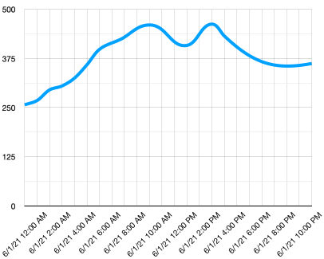

<!--
CO_OP_TRANSLATOR_METADATA:
{
  "original_hash": "9095c61445c2bca7245ef9b59a186a11",
  "translation_date": "2025-08-28T19:44:37+00:00",
  "source_file": "3-transport/lessons/3-visualize-location-data/README.md",
  "language_code": "lt"
}
-->
# Vizualizuokite vietos duomenis


> Eskizas sukurtas [Nitya Narasimhan](https://github.com/nitya). Spustelėkite paveikslėlį, kad pamatytumėte didesnę versiją.

Šiame vaizdo įraše pateikiama „Azure Maps“ su IoT apžvalga – paslauga, kuri bus aptarta šioje pamokoje.

[](https://www.youtube.com/watch?v=P5i2GFTtb2s)

> 🎥 Spustelėkite aukščiau esantį paveikslėlį, kad peržiūrėtumėte vaizdo įrašą

## Klausimynas prieš paskaitą

[Klausimynas prieš paskaitą](https://black-meadow-040d15503.1.azurestaticapps.net/quiz/25)

## Įvadas

Paskutinėje pamokoje sužinojote, kaip gauti GPS duomenis iš savo jutiklių ir išsaugoti juos debesyje naudojant serverless kodą. Dabar sužinosite, kaip vizualizuoti šiuos taškus „Azure“ žemėlapyje. Išmoksite sukurti žemėlapį tinklalapyje, susipažinsite su GeoJSON duomenų formatu ir sužinosite, kaip naudoti jį visiems užfiksuotiems GPS taškams žemėlapyje pažymėti.

Šioje pamokoje aptarsime:

* [Kas yra duomenų vizualizacija](../../../../../3-transport/lessons/3-visualize-location-data)
* [Žemėlapių paslaugos](../../../../../3-transport/lessons/3-visualize-location-data)
* [Sukurkite „Azure Maps“ išteklių](../../../../../3-transport/lessons/3-visualize-location-data)
* [Rodykite žemėlapį tinklalapyje](../../../../../3-transport/lessons/3-visualize-location-data)
* [GeoJSON formatas](../../../../../3-transport/lessons/3-visualize-location-data)
* [GPS duomenų vaizdavimas žemėlapyje naudojant GeoJSON](../../../../../3-transport/lessons/3-visualize-location-data)

> 💁 Šioje pamokoje bus naudojama nedidelė HTML ir JavaScript dalis. Jei norite daugiau sužinoti apie tinklalapių kūrimą naudojant HTML ir JavaScript, peržiūrėkite [Tinklalapių kūrimas pradedantiesiems](https://github.com/microsoft/Web-Dev-For-Beginners).

## Kas yra duomenų vizualizacija

Duomenų vizualizacija – kaip rodo pavadinimas – yra duomenų pateikimas vizualiai, kad žmonėms būtų lengviau juos suprasti. Ji dažniausiai siejama su diagramomis ir grafikais, tačiau tai gali būti bet koks būdas vaizdžiai pateikti duomenis, kad žmonės galėtų ne tik geriau juos suprasti, bet ir priimti sprendimus.

Paprastas pavyzdys – ūkininkavimo projekte jūs fiksavote dirvožemio drėgmės rodmenis. Dirvožemio drėgmės duomenų lentelė, užfiksuota kas valandą 2021 m. birželio 1 d., gali atrodyti taip:

| Data             | Rodmuo |
| ---------------- | ------: |
| 01/06/2021 00:00 |     257 |
| 01/06/2021 01:00 |     268 |
| 01/06/2021 02:00 |     295 |
| 01/06/2021 03:00 |     305 |
| 01/06/2021 04:00 |     325 |
| 01/06/2021 05:00 |     359 |
| 01/06/2021 06:00 |     398 |
| 01/06/2021 07:00 |     410 |
| 01/06/2021 08:00 |     429 |
| 01/06/2021 09:00 |     451 |
| 01/06/2021 10:00 |     460 |
| 01/06/2021 11:00 |     452 |
| 01/06/2021 12:00 |     420 |
| 01/06/2021 13:00 |     408 |
| 01/06/2021 14:00 |     431 |
| 01/06/2021 15:00 |     462 |
| 01/06/2021 16:00 |     432 |
| 01/06/2021 17:00 |     402 |
| 01/06/2021 18:00 |     387 |
| 01/06/2021 19:00 |     360 |
| 01/06/2021 20:00 |     358 |
| 01/06/2021 21:00 |     354 |
| 01/06/2021 22:00 |     356 |
| 01/06/2021 23:00 |     362 |

Žmogui suprasti šiuos duomenis gali būti sunku. Tai tiesiog skaičių siena be jokios prasmės. Pirmasis žingsnis vizualizuojant šiuos duomenis – juos pavaizduoti linijiniame grafike:



Šį grafiką galima dar labiau patobulinti, pridedant liniją, kuri nurodo, kada automatinė laistymo sistema buvo įjungta esant dirvožemio drėgmės rodmeniui 450:


Šis grafikas greitai parodo ne tik dirvožemio drėgmės lygius, bet ir taškus, kuriuose buvo įjungta laistymo sistema.

Diagramos nėra vienintelis įrankis duomenims vizualizuoti. IoT įrenginiai, stebintys orą, gali turėti žiniatinklio ar mobiliąsias programas, kurios vizualizuoja oro sąlygas naudodamos simbolius, pvz., debesies simbolį debesuotoms dienoms, lietaus debesį lietingoms dienoms ir pan. Yra daugybė būdų vizualizuoti duomenis – kai kurie rimti, kai kurie linksmi.

✅ Pagalvokite apie būdus, kuriais matėte vizualizuotus duomenis. Kurie metodai buvo aiškiausi ir leido greičiausiai priimti sprendimus?

Geriausios vizualizacijos leidžia žmonėms greitai priimti sprendimus. Pavyzdžiui, matyti daugybę prietaisų rodmenų iš pramoninių mašinų gali būti sunku, tačiau mirksinti raudona lemputė, kai kažkas negerai, leidžia žmogui greitai reaguoti. Kartais geriausia vizualizacija yra mirksinti lemputė!

Dirbant su GPS duomenimis, aiškiausia vizualizacija gali būti duomenų pateikimas žemėlapyje. Pavyzdžiui, žemėlapis, rodantis pristatymo sunkvežimius, gali padėti darbuotojams apdorojimo įmonėje matyti, kada sunkvežimiai atvyks. Jei šiame žemėlapyje pateikiama daugiau nei tik sunkvežimių dabartinės vietos nuotraukos, bet ir informacija apie jų turinį, darbuotojai gali atitinkamai planuoti – jei jie mato netoliese esantį šaldytuvą, jie žino, kad reikia paruošti vietą šaldytuve.

## Žemėlapių paslaugos

Darbas su žemėlapiais yra įdomus uždavinys, ir yra daug pasirinkimų, tokių kaip „Bing Maps“, „Leaflet“, „Open Street Maps“ ir „Google Maps“. Šioje pamokoje sužinosite apie [Azure Maps](https://azure.microsoft.com/services/azure-maps/?WT.mc_id=academic-17441-jabenn) ir kaip jie gali rodyti jūsų GPS duomenis.


„Azure Maps“ yra „geografinės informacijos paslaugų ir SDK rinkinys, naudojantis naujausius žemėlapių duomenis, kad suteiktų geografinį kontekstą žiniatinklio ir mobiliųjų programų kūrimui.“ Kūrėjams suteikiami įrankiai kurti gražius, interaktyvius žemėlapius, kurie gali atlikti tokius veiksmus kaip rekomenduoti eismo maršrutus, teikti informaciją apie eismo įvykius, vidaus navigaciją, paieškos galimybes, aukščio informaciją, orų paslaugas ir dar daugiau.

✅ Eksperimentuokite su kai kuriais [žemėlapių kodo pavyzdžiais](https://docs.microsoft.com/samples/browse?WT.mc_id=academic-17441-jabenn&products=azure-maps)

Galite rodyti žemėlapius kaip tuščią drobę, plyteles, palydovinius vaizdus, palydovinius vaizdus su keliais, įvairių tipų pilkus žemėlapius, žemėlapius su šešėliu reljefui parodyti, naktinius žemėlapius ir aukšto kontrasto žemėlapius. Galite gauti realaus laiko atnaujinimus savo žemėlapiuose, integruodami juos su [Azure Event Grid](https://azure.microsoft.com/services/event-grid/?WT.mc_id=academic-17441-jabenn). Galite valdyti savo žemėlapių elgseną ir išvaizdą, įgalindami įvairius valdiklius, leidžiančius žemėlapiui reaguoti į tokius veiksmus kaip suspaudimas, vilkimas ir spustelėjimas. Norėdami valdyti savo žemėlapio išvaizdą, galite pridėti sluoksnių, įskaitant burbulus, linijas, daugiakampius, šilumos žemėlapius ir dar daugiau. Kokį žemėlapio stilių įgyvendinsite, priklauso nuo jūsų pasirinkto SDK.

Galite pasiekti „Azure Maps“ API naudodami [REST API](https://docs.microsoft.com/javascript/api/azure-maps-rest/?WT.mc_id=academic-17441-jabenn&view=azure-maps-typescript-latest), [Web SDK](https://docs.microsoft.com/azure/azure-maps/how-to-use-map-control?WT.mc_id=academic-17441-jabenn) arba, jei kuriate mobiliąją programėlę, [Android SDK](https://docs.microsoft.com/azure/azure-maps/how-to-use-android-map-control-library?WT.mc_id=academic-17441-jabenn&pivots=programming-language-java-android).

Šioje pamokoje naudosite „Web SDK“, kad nupieštumėte žemėlapį ir parodytumėte savo jutiklio GPS vietos kelią.

## Sukurkite „Azure Maps“ išteklių

Pirmasis žingsnis – sukurti „Azure Maps“ paskyrą.

### Užduotis – sukurkite „Azure Maps“ išteklių

1. Paleiskite šią komandą iš savo terminalo arba komandų eilutės, kad sukurtumėte „Azure Maps“ išteklių savo `gps-sensor` išteklių grupėje:

    ```sh
    az maps account create --name gps-sensor \
                           --resource-group gps-sensor \
                           --accept-tos \
                           --sku S1
    ```

    Tai sukurs „Azure Maps“ išteklių, pavadintą `gps-sensor`. Naudojamas lygis yra `S1`, kuris yra mokamas lygis, tačiau su dosniu nemokamų užklausų kiekiu.

    > 💁 Norėdami sužinoti „Azure Maps“ naudojimo kainą, peržiūrėkite [Azure Maps kainų puslapį](https://azure.microsoft.com/pricing/details/azure-maps/?WT.mc_id=academic-17441-jabenn).

1. Jums reikės API rakto žemėlapių ištekliui. Naudokite šią komandą, kad gautumėte šį raktą:

    ```sh
    az maps account keys list --name gps-sensor \
                              --resource-group gps-sensor \
                              --output table
    ```

    Nukopijuokite `PrimaryKey` reikšmę.

## Rodykite žemėlapį tinklalapyje

Dabar galite pereiti prie kito žingsnio – parodyti savo žemėlapį tinklalapyje. Naudosime tik vieną `html` failą jūsų mažai žiniatinklio programai; atminkite, kad gamybos ar komandinėje aplinkoje jūsų žiniatinklio programa greičiausiai turės daugiau komponentų!

### Užduotis – parodykite žemėlapį tinklalapyje

1. Sukurkite failą, pavadintą `index.html`, aplanke savo kompiuteryje. Pridėkite HTML žymėjimą, kad būtų vieta žemėlapiui:

    ```html
    <html>
    <head>
        <style>
            #myMap {
                width:100%;
                height:100%;
            }
        </style>
    </head>
    
    <body onload="init()">
        <div id="myMap"></div>
    </body>
    </html>
    ```

    Žemėlapis bus įkeltas į `myMap` `div`. Keletas stilių leidžia jam užimti visą puslapio plotį ir aukštį.

    > 🎓 `div` yra tinklalapio sekcija, kurią galima pavadinti ir stilizuoti.

1. Po atidarymo `<head>` žymos pridėkite išorinį stilių lapą, kad valdytumėte žemėlapio rodymą, ir išorinį scenarijų iš „Web SDK“, kad valdytumėte jo elgseną:

    ```html
    <link rel="stylesheet" href="https://atlas.microsoft.com/sdk/javascript/mapcontrol/2/atlas.min.css" type="text/css" />
    <script src="https://atlas.microsoft.com/sdk/javascript/mapcontrol/2/atlas.min.js"></script>
    ```

    Šis stilių lapas apima nustatymus, kaip atrodo žemėlapis, o scenarijaus failas apima kodą žemėlapiui įkelti. Šio kodo pridėjimas yra panašus į C++ antraštės failų įtraukimą arba Python modulių importavimą.

1. Po šio scenarijaus pridėkite scenarijų bloką, kad paleistumėte žemėlapį.

    ```javascript
    <script type='text/javascript'>
        function init() {
            var map = new atlas.Map('myMap', {
                center: [-122.26473, 47.73444],
                zoom: 12,
                authOptions: {
                    authType: "subscriptionKey",
                    subscriptionKey: "<subscription_key>",

                }
            });
        }
    </script>
    ```

    Pakeiskite `<subscription_key>` savo „Azure Maps“ paskyros API raktu.

    Jei atidarysite savo `index.html` failą žiniatinklio naršyklėje, turėtumėte pamatyti žemėlapį, sutelktą į Sietlo sritį.

    

    ✅ Eksperimentuokite su mastelio ir centro parametrais, kad pakeistumėte žemėlapio rodymą. Galite pridėti skirtingas koordinates, atitinkančias jūsų duomenų platumą ir ilgumą, kad pakeistumėte žemėlapio centrą.

> 💁 Geresnis būdas dirbti su žiniatinklio programomis vietoje yra įdiegti [http-server](https://www.npmjs.com/package/http-server). Jums reikės įdiegti [node.js](https://nodejs.org/) ir [npm](https://www.npmjs.com/) prieš naudojant šį įrankį. Kai šie įrankiai bus įdiegti, galite pereiti prie savo `index.html` failo vietos ir įvesti `http-server`. Žiniatinklio programa atsidarys vietiniame žiniatinklio serveryje [http://127.0.0.1:8080/](http://127.0.0.1:8080/).

## GeoJSON formatas

Dabar, kai jūsų žiniatinklio programa yra paruošta ir žemėlapis rodomas, jums reikia išgauti GPS duomenis iš savo saugyklos paskyros ir parodyti juos kaip žymeklių sluoksnį žemėlapyje. Prieš tai padarydami, pažvelkime į [GeoJSON](https://wikipedia.org/wiki/GeoJSON) formatą, kurio reikalauja „Azure Maps“.

[GeoJSON](https://geojson.org/) yra atviras JSON standartas su specialiu formatu, skirtu geografiniams duomenims apdoroti. Galite apie jį sužinoti, išbandydami pavyzdinius duomenis naudodami [geojson.io](https://geojson.io), kuris taip pat yra naudingas įrankis GeoJSON failams derinti.

Pavyzdiniai GeoJSON duomenys atrodo taip:

```json
{
  "type": "FeatureCollection",
  "features": [
    {
      "type": "Feature",
      "geometry": {
        "type": "Point",
        "coordinates": [
          -2.10237979888916,
          57.164918677004714
        ]
      }
    }
  ]
}
```

Ypač svarbu atkreipti dėmesį į tai, kaip duomenys yra įdėti kaip `Feature` „FeatureCollection“ objekte. Šiame objekte yra `geometry` su `coordinates`, nurodančiais platumą ir ilgumą.

✅ Kurdamas savo GeoJSON, atkreipkite dėmesį į `latitude` ir `longitude` tvarką objekte, kitaip jūsų taškai neatsiras ten, kur turėtų! GeoJSON tikisi duomenų tvarka `lon,lat` taškams, o ne `lat,lon`.

`Geometry` gali turėti skirtingus tipus, pvz., vieną tašką arba daugiakampį. Šiame pavyzdyje tai yra taškas su dviem nurodytomis koordinatėmis – ilguma ir platuma.
✅ Azure Maps palaiko standartinį GeoJSON formatą ir kai kurias [patobulintas funkcijas](https://docs.microsoft.com/azure/azure-maps/extend-geojson?WT.mc_id=academic-17441-jabenn), įskaitant galimybę piešti apskritimus ir kitas geometrijas.

## GPS duomenų atvaizdavimas žemėlapyje naudojant GeoJSON

Dabar esate pasiruošę naudoti duomenis iš saugyklos, kurią sukūrėte ankstesnėje pamokoje. Primename, kad jie saugomi kaip failai blob saugykloje, todėl reikės juos gauti ir apdoroti, kad Azure Maps galėtų juos naudoti.

### Užduotis – sukonfigūruoti saugyklą, kad ji būtų pasiekiama iš tinklalapio

Jei bandysite gauti duomenis iš savo saugyklos, galite nustebti, pamatę klaidas naršyklės konsolėje. Taip yra todėl, kad reikia nustatyti [CORS](https://developer.mozilla.org/docs/Web/HTTP/CORS) leidimus šiai saugyklai, kad išorinės žiniatinklio programos galėtų skaityti jos duomenis.

> 🎓 CORS reiškia „Cross-Origin Resource Sharing“ (kryžminis šaltinių dalijimasis) ir dažniausiai turi būti aiškiai nustatytas Azure dėl saugumo priežasčių. Tai apsaugo nuo netikėtų svetainių prieigos prie jūsų duomenų.

1. Paleiskite šią komandą, kad įjungtumėte CORS:

    ```sh
    az storage cors add --methods GET \
                        --origins "*" \
                        --services b \
                        --account-name <storage_name> \
                        --account-key <key1>
    ```

    Pakeiskite `<storage_name>` savo saugyklos paskyros pavadinimu. Pakeiskite `<key1>` savo saugyklos paskyros raktiniu kodu.

    Ši komanda leidžia bet kuriai svetainei (žvaigždutė `*` reiškia bet kurią) atlikti *GET* užklausą, t. y. gauti duomenis iš jūsų saugyklos paskyros. Parametras `--services b` reiškia, kad šis nustatymas taikomas tik blob saugykloms.

### Užduotis – įkelti GPS duomenis iš saugyklos

1. Pakeiskite visą `init` funkcijos turinį šiuo kodu:

    ```javascript
    fetch("https://<storage_name>.blob.core.windows.net/gps-data/?restype=container&comp=list")
        .then(response => response.text())
        .then(str => new window.DOMParser().parseFromString(str, "text/xml"))
        .then(xml => {
            let blobList = Array.from(xml.querySelectorAll("Url"));
                blobList.forEach(async blobUrl => {
                    loadJSON(blobUrl.innerHTML)                
        });
    })
    .then( response => {
        map = new atlas.Map('myMap', {
            center: [-122.26473, 47.73444],
            zoom: 14,
            authOptions: {
                authType: "subscriptionKey",
                subscriptionKey: "<subscription_key>",
    
            }
        });
        map.events.add('ready', function () {
            var source = new atlas.source.DataSource();
            map.sources.add(source);
            map.layers.add(new atlas.layer.BubbleLayer(source));
            source.add(features);
        })
    })
    ```

    Pakeiskite `<storage_name>` savo saugyklos paskyros pavadinimu. Pakeiskite `<subscription_key>` savo Azure Maps paskyros API raktu.

    Čia vyksta keli dalykai. Pirma, kodas gauna jūsų GPS duomenis iš blob konteinerio naudodamas URL, sukurtą pagal jūsų saugyklos paskyros pavadinimą. Šis URL nurodo `gps-data`, rodydamas, kad ištekliaus tipas yra konteineris (`restype=container`), ir pateikia informaciją apie visus blob failus. Šis sąrašas negrąžins pačių blob failų, bet pateiks URL kiekvienam blob failui, kurį galima naudoti duomenims įkelti.

    > 💁 Šį URL galite įvesti į savo naršyklę, kad pamatytumėte visų konteinerio blob failų detales. Kiekvienas elementas turės `Url` savybę, kurią taip pat galite įkelti į naršyklę, kad pamatytumėte blob turinį.

    Šis kodas tada įkelia kiekvieną blob failą, iškviesdamas `loadJSON` funkciją, kurią sukursime kitame žingsnyje. Tada jis sukuria žemėlapio valdiklį ir prideda kodą prie `ready` įvykio. Šis įvykis iškviečiamas, kai žemėlapis rodomas tinklalapyje.

    `Ready` įvykis sukuria Azure Maps duomenų šaltinį – konteinerį, kuriame yra GeoJSON duomenys, kurie bus užpildyti vėliau. Šis duomenų šaltinis naudojamas burbulų sluoksniui sukurti – tai yra apskritimų rinkinys žemėlapyje, išdėstytas pagal kiekvieną GeoJSON tašką.

1. Pridėkite `loadJSON` funkciją į savo scenarijų bloką, žemiau `init` funkcijos:

    ```javascript
    var map, features;

    function loadJSON(file) {
        var xhr = new XMLHttpRequest();
        features = [];
        xhr.onreadystatechange = function () {
            if (xhr.readyState === XMLHttpRequest.DONE) {
                if (xhr.status === 200) {
                    gps = JSON.parse(xhr.responseText)
                    features.push(
                        new atlas.data.Feature(new atlas.data.Point([parseFloat(gps.gps.lon), parseFloat(gps.gps.lat)]))
                    )
                }
            }
        };
        xhr.open("GET", file, true);
        xhr.send();
    }    
    ```

    Ši funkcija yra iškviečiama užklausos metu, kad būtų galima analizuoti JSON duomenis ir konvertuoti juos į ilgumos ir platumos koordinates kaip GeoJSON.
    Kai duomenys yra apdoroti, jie nustatomi kaip GeoJSON `Feature`. Žemėlapis bus inicijuotas, ir mažos burbuliukai atsiras aplink kelią, kurį žymi jūsų duomenys:

1. Įkelkite HTML puslapį į savo naršyklę. Jis įkels žemėlapį, tada įkels visus GPS duomenis iš saugyklos ir atvaizduos juos žemėlapyje.

    

> 💁 Šį kodą galite rasti [code](../../../../../3-transport/lessons/3-visualize-location-data/code) aplanke.

---

## 🚀 Iššūkis

Smagu rodyti statinius duomenis žemėlapyje kaip žymeklius. Ar galite patobulinti šią žiniatinklio programą, kad pridėtumėte animaciją ir parodytumėte žymeklių kelią laikui bėgant, naudojant laiko žymėmis pažymėtus JSON failus? Štai [keletas pavyzdžių](https://azuremapscodesamples.azurewebsites.net/) apie animacijos naudojimą žemėlapiuose.

## Po paskaitos testas

[Po paskaitos testas](https://black-meadow-040d15503.1.azurestaticapps.net/quiz/26)

## Apžvalga ir savarankiškas mokymasis

Azure Maps yra ypač naudingas dirbant su IoT įrenginiais.

* Pasidomėkite kai kuriais naudojimo būdais [Azure Maps dokumentacijoje Microsoft docs](https://docs.microsoft.com/azure/azure-maps/tutorial-iot-hub-maps?WT.mc_id=academic-17441-jabenn).
* Gilinkite savo žinias apie žemėlapių kūrimą ir maršrutus naudodami [Azure Maps savarankiško mokymosi modulį Microsoft Learn](https://docs.microsoft.com/learn/modules/create-your-first-app-with-azure-maps/?WT.mc_id=academic-17441-jabenn).

## Užduotis

[Įdiekite savo programą](assignment.md)

---

**Atsakomybės apribojimas**:  
Šis dokumentas buvo išverstas naudojant AI vertimo paslaugą [Co-op Translator](https://github.com/Azure/co-op-translator). Nors siekiame tikslumo, prašome atkreipti dėmesį, kad automatiniai vertimai gali turėti klaidų ar netikslumų. Originalus dokumentas jo gimtąja kalba turėtų būti laikomas autoritetingu šaltiniu. Kritinei informacijai rekomenduojama profesionali žmogaus vertimo paslauga. Mes neprisiimame atsakomybės už nesusipratimus ar klaidingus interpretavimus, atsiradusius naudojant šį vertimą.