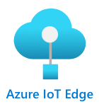

<!--
CO_OP_TRANSLATOR_METADATA:
{
  "original_hash": "2625af24587465c5547ae33d6cc000a5",
  "translation_date": "2025-08-28T19:05:25+00:00",
  "source_file": "4-manufacturing/lessons/3-run-fruit-detector-edge/README.md",
  "language_code": "lt"
}
-->
# Paleiskite vaisių detektorių krašte


> Piešinys sukurtas [Nitya Narasimhan](https://github.com/nitya). Spustelėkite paveikslėlį, kad pamatytumėte didesnę versiją.

Šiame vaizdo įraše pateikiama apžvalga apie vaizdų klasifikatorių veikimą IoT įrenginiuose, tema, kuri aptariama šioje pamokoje.

[](https://www.youtube.com/watch?v=_K5fqGLO8us)

## Klausimynas prieš paskaitą

[Klausimynas prieš paskaitą](https://black-meadow-040d15503.1.azurestaticapps.net/quiz/33)

## Įvadas

Praeitoje pamokoje jūs naudojote vaizdų klasifikatorių, kad atskirtumėte prinokusius ir neprinokusius vaisius, siųsdami vaizdą, užfiksuotą jūsų IoT įrenginio kamera, per internetą į debesų paslaugą. Tokie skambučiai užtrunka, kainuoja pinigus, o priklausomai nuo naudojamų vaizdų duomenų tipo, gali turėti privatumo pasekmių.

Šioje pamokoje sužinosite, kaip paleisti mašininio mokymosi (ML) modelius krašte – IoT įrenginiuose, veikiančiuose jūsų pačių tinkle, o ne debesyje. Sužinosite kraštinio skaičiavimo privalumus ir trūkumus, kaip diegti savo AI modelį krašte ir kaip pasiekti jį iš savo IoT įrenginio.

Šioje pamokoje aptarsime:

* [Kraštinis skaičiavimas](../../../../../4-manufacturing/lessons/3-run-fruit-detector-edge)
* [Azure IoT Edge](../../../../../4-manufacturing/lessons/3-run-fruit-detector-edge)
* [IoT Edge įrenginio registravimas](../../../../../4-manufacturing/lessons/3-run-fruit-detector-edge)
* [IoT Edge įrenginio nustatymas](../../../../../4-manufacturing/lessons/3-run-fruit-detector-edge)
* [Modelio eksportavimas](../../../../../4-manufacturing/lessons/3-run-fruit-detector-edge)
* [Konteinerio paruošimas diegimui](../../../../../4-manufacturing/lessons/3-run-fruit-detector-edge)
* [Konteinerio diegimas](../../../../../4-manufacturing/lessons/3-run-fruit-detector-edge)
* [IoT Edge įrenginio naudojimas](../../../../../4-manufacturing/lessons/3-run-fruit-detector-edge)

## Kraštinis skaičiavimas

Kraštinis skaičiavimas apima kompiuterius, kurie apdoroja IoT duomenis kuo arčiau vietos, kurioje tie duomenys generuojami. Vietoj to, kad apdorojimas vyktų debesyje, jis perkeliamas į debesies kraštą – jūsų vidinį tinklą.


Iki šiol pamokose jūsų įrenginiai rinko duomenis ir siuntė juos į debesį analizei, vykdydami serverless funkcijas arba AI modelius debesyje.


Kraštinis skaičiavimas apima dalies debesų paslaugų perkėlimą iš debesies į kompiuterius, veikiančius tame pačiame tinkle kaip IoT įrenginiai, tik bendraujant su debesiu, jei reikia. Pavyzdžiui, galite paleisti AI modelius kraštiniuose įrenginiuose, kad analizuotumėte vaisių prinokimą, ir tik siųsti analizės duomenis į debesį, pvz., prinokusių ir neprinokusių vaisių skaičių.

✅ Pagalvokite apie IoT programas, kurias sukūrėte iki šiol. Kurias jų dalis būtų galima perkelti į kraštą?

### Privalumai

Kraštinio skaičiavimo privalumai:

1. **Greitis** – kraštinis skaičiavimas yra idealus laiko jautriems duomenims, nes veiksmai atliekami tame pačiame tinkle kaip įrenginys, o ne atliekant skambučius per internetą. Tai leidžia pasiekti didesnį greitį, nes vidiniai tinklai gali veikti žymiai greičiau nei interneto ryšiai, o duomenys keliauja daug trumpesnį atstumą.

    > 💁 Nors optiniai kabeliai naudojami interneto ryšiams leidžia duomenims keliauti šviesos greičiu, duomenys gali užtrukti keliaudami aplink pasaulį iki debesų paslaugų teikėjų. Pavyzdžiui, jei siunčiate duomenis iš Europos į debesų paslaugas JAV, duomenims prireikia bent 28 ms, kad per optinį kabelį perplauktų Atlanto vandenyną, nekalbant apie laiką, reikalingą duomenims pasiekti transatlantinį kabelį, konvertuoti iš elektrinių signalų į šviesos signalus ir atgal, o tada iš optinio kabelio į debesų paslaugų teikėją.

    Kraštinis skaičiavimas taip pat reikalauja mažiau tinklo srauto, sumažinant riziką, kad jūsų duomenys sulėtės dėl interneto ryšio pralaidumo apribojimų.

1. **Nuotolinė prieiga** – kraštinis skaičiavimas veikia, kai turite ribotą arba jokio ryšio, arba ryšys yra per brangus nuolatiniam naudojimui. Pavyzdžiui, dirbant humanitarinių nelaimių zonose, kur infrastruktūra yra ribota, arba besivystančiose šalyse.

1. **Mažesnės išlaidos** – duomenų rinkimas, saugojimas, analizė ir veiksmų inicijavimas kraštiniuose įrenginiuose sumažina debesų paslaugų naudojimą, o tai gali sumažinti bendras IoT programos išlaidas. Pastaruoju metu padaugėjo įrenginių, skirtų kraštiniam skaičiavimui, pvz., AI akceleratorių plokštės, tokios kaip [Jetson Nano iš NVIDIA](https://developer.nvidia.com/embedded/jetson-nano-developer-kit), kurios gali vykdyti AI užduotis naudodamos GPU pagrįstą aparatinę įrangą įrenginiuose, kurių kaina mažesnė nei 100 USD.

1. **Privatumas ir saugumas** – naudojant kraštinį skaičiavimą, duomenys lieka jūsų tinkle ir nėra įkeliami į debesį. Tai dažnai yra pageidautina jautriems ir asmeniškai identifikuojamiems duomenims, ypač todėl, kad duomenų nereikia saugoti po analizės, o tai labai sumažina duomenų nutekėjimo riziką. Pavyzdžiai apima medicininius duomenis ir saugumo kamerų vaizdo įrašus.

1. **Darbas su nesaugiais įrenginiais** – jei turite įrenginių su žinomais saugumo trūkumais, kurių nenorite tiesiogiai prijungti prie savo tinklo ar interneto, galite prijungti juos prie atskiro tinklo, naudojant IoT Edge įrenginį kaip vartų įrenginį. Šis kraštinis įrenginys taip pat gali turėti ryšį su jūsų platesniu tinklu ar internetu ir valdyti duomenų srautus pirmyn ir atgal.

1. **Palaikymas nesuderinamiems įrenginiams** – jei turite įrenginių, kurie negali prisijungti prie IoT Hub, pavyzdžiui, įrenginių, kurie gali prisijungti tik per HTTP ryšius arba įrenginių, kurie turi tik „Bluetooth“ ryšį, galite naudoti IoT Edge įrenginį kaip vartų įrenginį, perduodantį pranešimus į IoT Hub.

✅ Atlikite tyrimą: Kokie kiti kraštinio skaičiavimo privalumai galėtų būti?

### Trūkumai

Kraštinio skaičiavimo trūkumai, kai debesų paslaugos gali būti geresnis pasirinkimas:

1. **Mastelis ir lankstumas** – debesų skaičiavimas gali realiu laiku prisitaikyti prie tinklo ir duomenų poreikių, pridėdamas arba sumažindamas serverius ir kitus išteklius. Norint pridėti daugiau kraštinių kompiuterių, reikia rankiniu būdu pridėti daugiau įrenginių.

1. **Patikimumas ir atsparumas** – debesų skaičiavimas užtikrina daugybę serverių, dažnai keliose vietose, siekiant užtikrinti atsargumą ir nelaimių atkūrimą. Norint pasiekti tokį patį atsargumo lygį krašte, reikia didelių investicijų ir daug konfigūracijos darbo.

1. **Priežiūra** – debesų paslaugų teikėjai teikia sistemų priežiūrą ir atnaujinimus.

✅ Atlikite tyrimą: Kokie kiti kraštinio skaičiavimo trūkumai galėtų būti?

Trūkumai iš esmės yra priešingi debesų paslaugų privalumams – jūs turite patys kurti ir valdyti šiuos įrenginius, o ne pasikliauti debesų paslaugų teikėjų patirtimi ir mastu.

Kai kurie rizikos veiksniai yra sumažinami pačiu kraštinio skaičiavimo pobūdžiu. Pavyzdžiui, jei turite kraštinį įrenginį, veikiantį gamykloje, renkantį duomenis iš mašinų, jums nereikia galvoti apie kai kuriuos nelaimių atkūrimo scenarijus. Jei gamykloje nutrūksta elektros tiekimas, jums nereikia atsarginio kraštinio įrenginio, nes mašinos, generuojančios duomenis, kuriuos kraštinis įrenginys apdoroja, taip pat bus be elektros.

IoT sistemoms dažnai norėsite derinti debesų ir kraštinio skaičiavimo paslaugas, pasinaudodami kiekviena paslauga pagal sistemos, jos klientų ir jos prižiūrėtojų poreikius.

## Azure IoT Edge



Azure IoT Edge yra paslauga, kuri gali padėti perkelti darbo krūvius iš debesies į kraštą. Jūs nustatote įrenginį kaip kraštinį įrenginį, o iš debesies galite diegti kodą į tą kraštinį įrenginį. Tai leidžia derinti debesies ir krašto galimybes.

> 🎓 *Darbo krūviai* – tai terminas, apibūdinantis bet kokią paslaugą, kuri atlieka tam tikrą darbą, pvz., AI modelius, programas ar serverless funkcijas.

Pavyzdžiui, galite išmokyti vaizdų klasifikatorių debesyje, o tada iš debesies jį diegti į kraštinį įrenginį. Jūsų IoT įrenginys tada siunčia vaizdus į kraštinį įrenginį klasifikavimui, o ne siunčia vaizdus per internetą. Jei reikia diegti naują modelio iteraciją, galite jį išmokyti debesyje ir naudoti IoT Edge, kad atnaujintumėte modelį kraštiniame įrenginyje į naują iteraciją.

> 🎓 Programinė įranga, diegiama IoT Edge, vadinama *moduliais*. Pagal numatymą IoT Edge vykdo modulius, kurie bendrauja su IoT Hub, pvz., `edgeAgent` ir `edgeHub` modulius. Kai diegiate vaizdų klasifikatorių, jis diegiamas kaip papildomas modulis.

IoT Edge yra integruotas į IoT Hub, todėl galite valdyti kraštinius įrenginius naudodami tą pačią paslaugą, kurią naudotumėte IoT įrenginiams valdyti, su tokiu pačiu saugumo lygiu.

IoT Edge vykdo kodą iš *konteinerių* – savarankiškų programų, kurios veikia izoliuotai nuo kitų programų jūsų kompiuteryje. Kai paleidžiate konteinerį, jis veikia kaip atskiras kompiuteris jūsų kompiuteryje, turintis savo programinę įrangą, paslaugas ir programas. Daugeliu atvejų konteineriai negali pasiekti nieko jūsų kompiuteryje, nebent nuspręsite pasidalinti, pvz., aplanku su konteineriu. Konteineris tada atveria paslaugas per atvirą prievadą, kurį galite prijungti arba atverti savo tinklui.


Pavyzdžiui, galite turėti konteinerį su tinklalapiu, veikiančiu 80 prievade, numatytame HTTP prievade, ir tada jį atverti iš savo kompiuterio taip pat 80 prievade.

✅ Atlikite tyrimą: Perskaitykite apie konteinerius ir paslaugas, tokias kaip Docker ar Moby.

Galite naudoti Custom Vision, kad atsisiųstumėte vaizdų klasifikatorius ir diegtumėte juos kaip konteinerius, arba tiesiogiai į įrenginį, arba per IoT Edge. Kai jie veikia konteineryje, juos galima pasiekti naudojant tą patį REST API kaip debesies versiją, tačiau su galiniu tašku, nukreiptu į kraštinį įrenginį, vykdantį konteinerį.

## IoT Edge įrenginio registravimas

Norint naudoti IoT Edge įrenginį, jį reikia užregistruoti IoT Hub.

### Užduotis – IoT Edge įrenginio registravimas

1. Sukurkite IoT Hub `fruit-quality-detector` resursų grupėje. Suteikite jam unikalų pavadinimą, susijusį su `fruit-quality-detector`.

1. Užregistruokite IoT Edge įrenginį, pavadintą `fruit-quality-detector-edge`, savo IoT Hub. Komanda tai padaryti yra panaši į tą, kuri naudojama registruoti ne kraštinį įrenginį, išskyrus tai, kad pridedate `--edge-enabled` vėliavą.

    ```sh
    az iot hub device-identity create --edge-enabled \
                                      --device-id fruit-quality-detector-edge \
                                      --hub-name <hub_name>
    ```

    Pakeiskite `<hub_name>` savo IoT Hub pavadinimu.

1. Gaukite savo įrenginio prisijungimo eilutę naudodami šią komandą:

    ```sh
    az iot hub device-identity connection-string show --device-id fruit-quality-detector-edge \
                                                      --output table \
                                                      --hub-name <hub_name>
    ```

    Pakeiskite `<hub_name>` savo IoT Hub pavadinimu.

    Nukopijuokite prisijungimo eilutę, kuri rodoma išvestyje.

## IoT Edge įrenginio nustatymas

Kai sukūrėte kraštinio įrenginio registraciją savo IoT Hub, galite nustatyti kraštinį įrenginį.

### Užduotis – IoT Edge Runtime diegimas ir paleidimas

**IoT Edge Runtime veikia tik Linux konteineriuose.** Jis gali būti paleistas Linux arba Windows naudojant Linux virtualias mašinas.

* Jei naudojate Raspberry Pi kaip savo IoT įrenginį, jis veikia palaikomą Linux versiją ir gali talpinti IoT Edge Runtime. Sekite [Azure IoT Edge diegimo Linux vadovą Microsoft dokumentacijoje](https://docs.microsoft.com/azure/iot-edge/how-to-install-iot-edge?WT.mc_id=academic-17441-jabenn), kad įdiegtumėte IoT Edge ir nustatytumėte prisijungimo eilutę.

    > 💁 Atminkite, kad Raspberry Pi OS yra Debian Linux variantas.

* Jei nenaudojate Raspberry Pi, bet turite Linux kompiuterį, galite paleisti IoT Edge Runtime. Sekite [Azure IoT Edge diegimo Linux vadovą Microsoft dokumentacijoje](https://docs.microsoft.com/azure/iot-edge/how-to-install-iot-edge?WT.mc_id=academic-17441-jabenn), kad įdiegtumėte IoT Edge ir nustatytumėte prisijungimo eilutę.

* Jei naudojate Windows, galite įdiegti IoT Edge Runtime Linux virtualioje mašinoje, sekdami [IoT Edge modulio diegimo Windows įrenginyje greitojo starto vadovą Microsoft dokumentacijoje](https://docs.microsoft.com/azure/iot-edge/quickstart?WT.mc_id=academic-17441-jabenn#install-and-start-the-iot-edge-runtime). Galite sustoti, kai pasieksite *Modulio diegimas* skyrių.

* Jei naudojate macOS, galite sukurti virtualią mašiną (VM) debesyje, kurią naudosite kaip savo IoT Edge įrenginį. Tai yra kompi
1. Atidarykite Custom Vision portalą adresu [CustomVision.ai](https://customvision.ai) ir prisijunkite, jei dar to nepadarėte. Tada atidarykite savo projektą `fruit-quality-detector`.

1. Pasirinkite mygtuką **Settings** (⚙ piktograma).

1. Sąraše *Domains* pasirinkite *Food (compact)*.

1. Skiltyje *Export Capabilities* įsitikinkite, kad pasirinkta *Basic platforms (Tensorflow, CoreML, ONNX, ...)*.

1. Puslapio apačioje spustelėkite **Save Changes**.

1. Iš naujo apmokykite modelį naudodami mygtuką **Train**, pasirinkdami *Quick training*.

### Užduotis - eksportuokite savo modelį

Kai modelis bus apmokytas, jį reikia eksportuoti kaip konteinerį.

1. Pasirinkite skirtuką **Performance** ir suraskite naujausią iteraciją, kuri buvo apmokyta naudojant kompaktišką domeną.

1. Paspauskite mygtuką **Export** viršuje.

1. Pasirinkite **DockerFile**, tada pasirinkite versiją, atitinkančią jūsų kraštinį įrenginį:

    * Jei naudojate IoT Edge Linux kompiuteryje, Windows kompiuteryje ar virtualioje mašinoje, pasirinkite *Linux* versiją.
    * Jei naudojate IoT Edge Raspberry Pi įrenginyje, pasirinkite *ARM (Raspberry Pi 3)* versiją.

> 🎓 Docker yra vienas populiariausių įrankių konteineriams valdyti, o DockerFile yra instrukcijų rinkinys, kaip sukonfigūruoti konteinerį.

1. Paspauskite **Export**, kad Custom Vision sukurtų reikalingus failus, tada **Download**, kad atsisiųstumėte juos ZIP faile.

1. Išsaugokite failus savo kompiuteryje ir išskleiskite aplanką.

## Paruoškite savo konteinerį diegimui


Kai atsisiųsite savo modelį, jį reikia sukurti kaip konteinerį, tada įkelti į konteinerių registrą - internetinę vietą, kurioje galite saugoti konteinerius. IoT Edge gali atsisiųsti konteinerį iš registro ir perkelti jį į jūsų įrenginį.


Šioje pamokoje naudojamas konteinerių registras yra Azure Container Registry. Tai nėra nemokama paslauga, todėl norėdami sutaupyti pinigų, įsitikinkite, kad [išvalėte savo projektą](../../../clean-up.md), kai baigsite.

> 💁 Azure Container Registry naudojimo kainas galite peržiūrėti [Azure Container Registry kainų puslapyje](https://azure.microsoft.com/pricing/details/container-registry/?WT.mc_id=academic-17441-jabenn).

### Užduotis - įdiekite Docker

Norėdami sukurti ir diegti klasifikatorių, gali tekti įdiegti [Docker](https://www.docker.com/).

Tai reikės padaryti tik tuo atveju, jei planuojate kurti konteinerį kitame įrenginyje nei tas, kuriame įdiegėte IoT Edge - kaip IoT Edge diegimo dalis, Docker jau yra įdiegtas.

1. Jei kuriate Docker konteinerį kitame įrenginyje nei jūsų IoT Edge įrenginys, sekite Docker diegimo instrukcijas [Docker diegimo puslapyje](https://www.docker.com/products/docker-desktop), kad įdiegtumėte Docker Desktop arba Docker engine. Įsitikinkite, kad jis veikia po diegimo.

### Užduotis - sukurkite konteinerių registro resursą

1. Paleiskite šią komandą iš savo terminalo arba komandinės eilutės, kad sukurtumėte Azure Container Registry resursą:

    ```sh
    az acr create --resource-group fruit-quality-detector \
                  --sku Basic \
                  --name <Container registry name>
    ```

    Pakeiskite `<Container registry name>` į unikalų jūsų konteinerių registro pavadinimą, naudodami tik raides ir skaičius. Pavadinimą pagrįskite `fruitqualitydetector`. Šis pavadinimas taps URL dalimi, skirtu pasiekti konteinerių registrą, todėl jis turi būti globaliai unikalus.

1. Prisijunkite prie Azure Container Registry naudodami šią komandą:

    ```sh
    az acr login --name <Container registry name>
    ```

    Pakeiskite `<Container registry name>` į pavadinimą, kurį naudojote savo konteinerių registrui.

1. Įjunkite konteinerių registrą administravimo režimu, kad galėtumėte sugeneruoti slaptažodį, naudodami šią komandą:

    ```sh
    az acr update --admin-enabled true \
                 --name <Container registry name>
    ```

    Pakeiskite `<Container registry name>` į pavadinimą, kurį naudojote savo konteinerių registrui.

1. Sugeneruokite slaptažodžius savo konteinerių registrui naudodami šią komandą:

    ```sh
     az acr credential renew --password-name password \
                             --output table \
                             --name <Container registry name>
    ```

    Pakeiskite `<Container registry name>` į pavadinimą, kurį naudojote savo konteinerių registrui.

    Nukopijuokite `PASSWORD` reikšmę, nes jos prireiks vėliau.

### Užduotis - sukurkite savo konteinerį

Tai, ką atsisiuntėte iš Custom Vision, buvo DockerFile, kuriame pateiktos instrukcijos, kaip turėtų būti sukurtas konteineris, kartu su programos kodu, kuris bus vykdomas konteineryje, kad būtų galima talpinti jūsų Custom Vision modelį ir REST API, skirtą jį iškviesti. Galite naudoti Docker, kad sukurtumėte pažymėtą konteinerį iš DockerFile, tada įkelti jį į savo konteinerių registrą.

> 🎓 Konteineriai gauna žymą, kuri apibrėžia jų pavadinimą ir versiją. Kai reikia atnaujinti konteinerį, galite jį sukurti su ta pačia žyma, bet naujesne versija.

1. Atidarykite savo terminalą arba komandinę eilutę ir pereikite į išskleistą modelio aplanką, kurį atsisiuntėte iš Custom Vision.

1. Paleiskite šią komandą, kad sukurtumėte ir pažymėtumėte vaizdą:

    ```sh
    docker build --platform <platform> -t <Container registry name>.azurecr.io/classifier:v1 .
    ```

    Pakeiskite `<platform>` į platformą, kurioje šis konteineris bus vykdomas. Jei naudojate IoT Edge Raspberry Pi įrenginyje, nustatykite tai kaip `linux/armhf`, kitu atveju nustatykite kaip `linux/amd64`.

    > 💁 Jei vykdote šią komandą iš įrenginio, kuriame vykdote IoT Edge, pvz., iš Raspberry Pi, galite praleisti `--platform <platform>` dalį, nes ji pagal numatymą nustatoma kaip dabartinė platforma.

    Pakeiskite `<Container registry name>` į pavadinimą, kurį naudojote savo konteinerių registrui.

    > 💁 Jei naudojate Linux arba Raspberry Pi OS, gali tekti naudoti `sudo`, kad paleistumėte šią komandą.

    Docker sukurs vaizdą, sukonfigūruodamas visą reikalingą programinę įrangą. Vaizdas bus pažymėtas kaip `classifier:v1`.

    ```output
    ➜  d4ccc45da0bb478bad287128e1274c3c.DockerFile.Linux docker build --platform linux/amd64 -t  fruitqualitydetectorjimb.azurecr.io/classifier:v1 .
    [+] Building 102.4s (11/11) FINISHED
     => [internal] load build definition from Dockerfile
     => => transferring dockerfile: 131B
     => [internal] load .dockerignore
     => => transferring context: 2B
     => [internal] load metadata for docker.io/library/python:3.7-slim
     => [internal] load build context
     => => transferring context: 905B
     => [1/6] FROM docker.io/library/python:3.7-slim@sha256:b21b91c9618e951a8cbca5b696424fa5e820800a88b7e7afd66bba0441a764d6
     => => resolve docker.io/library/python:3.7-slim@sha256:b21b91c9618e951a8cbca5b696424fa5e820800a88b7e7afd66bba0441a764d6
     => => sha256:b4d181a07f8025e00e0cb28f1cc14613da2ce26450b80c54aea537fa93cf3bda 27.15MB / 27.15MB
     => => sha256:de8ecf497b753094723ccf9cea8a46076e7cb845f333df99a6f4f397c93c6ea9 2.77MB / 2.77MB
     => => sha256:707b80804672b7c5d8f21e37c8396f319151e1298d976186b4f3b76ead9f10c8 10.06MB / 10.06MB
     => => sha256:b21b91c9618e951a8cbca5b696424fa5e820800a88b7e7afd66bba0441a764d6 1.86kB / 1.86kB
     => => sha256:44073386687709c437586676b572ff45128ff1f1570153c2f727140d4a9accad 1.37kB / 1.37kB
     => => sha256:3d94f0f2ca798607808b771a7766f47ae62a26f820e871dd488baeccc69838d1 8.31kB / 8.31kB
     => => sha256:283715715396fd56d0e90355125fd4ec57b4f0773f306fcd5fa353b998beeb41 233B / 233B
     => => sha256:8353afd48f6b84c3603ea49d204bdcf2a1daada15f5d6cad9cc916e186610a9f 2.64MB / 2.64MB
     => => extracting sha256:b4d181a07f8025e00e0cb28f1cc14613da2ce26450b80c54aea537fa93cf3bda
     => => extracting sha256:de8ecf497b753094723ccf9cea8a46076e7cb845f333df99a6f4f397c93c6ea9
     => => extracting sha256:707b80804672b7c5d8f21e37c8396f319151e1298d976186b4f3b76ead9f10c8
     => => extracting sha256:283715715396fd56d0e90355125fd4ec57b4f0773f306fcd5fa353b998beeb41
     => => extracting sha256:8353afd48f6b84c3603ea49d204bdcf2a1daada15f5d6cad9cc916e186610a9f
     => [2/6] RUN pip install -U pip
     => [3/6] RUN pip install --no-cache-dir numpy~=1.17.5 tensorflow~=2.0.2 flask~=1.1.2 pillow~=7.2.0
     => [4/6] RUN pip install --no-cache-dir mscviplib==2.200731.16
     => [5/6] COPY app /app
     => [6/6] WORKDIR /app
     => exporting to image
     => => exporting layers
     => => writing image sha256:1846b6f134431f78507ba7c079358ed66d944c0e185ab53428276bd822400386
     => => naming to fruitqualitydetectorjimb.azurecr.io/classifier:v1
    ```

### Užduotis - įkelkite savo konteinerį į konteinerių registrą

1. Naudokite šią komandą, kad įkeltumėte savo konteinerį į konteinerių registrą:

    ```sh
    docker push <Container registry name>.azurecr.io/classifier:v1
    ```

    Pakeiskite `<Container registry name>` į pavadinimą, kurį naudojote savo konteinerių registrui.

    > 💁 Jei naudojate Linux, gali tekti naudoti `sudo`, kad paleistumėte šią komandą.

    Konteineris bus įkeltas į konteinerių registrą.

    ```output
    ➜  d4ccc45da0bb478bad287128e1274c3c.DockerFile.Linux docker push fruitqualitydetectorjimb.azurecr.io/classifier:v1
    The push refers to repository [fruitqualitydetectorjimb.azurecr.io/classifier]
    5f70bf18a086: Pushed 
    8a1ba9294a22: Pushed 
    56cf27184a76: Pushed 
    b32154f3f5dd: Pushed 
    36103e9a3104: Pushed 
    e2abb3cacca0: Pushed 
    4213fd357bbe: Pushed 
    7ea163ba4dce: Pushed 
    537313a13d90: Pushed 
    764055ebc9a7: Pushed 
    v1: digest: sha256:ea7894652e610de83a5a9e429618e763b8904284253f4fa0c9f65f0df3a5ded8 size: 2423
    ```

1. Norėdami patikrinti įkėlimą, galite išvardyti konteinerius savo registre naudodami šią komandą:

    ```sh
    az acr repository list --output table \
                           --name <Container registry name> 
    ```

    Pakeiskite `<Container registry name>` į pavadinimą, kurį naudojote savo konteinerių registrui.

    ```output
    ➜  d4ccc45da0bb478bad287128e1274c3c.DockerFile.Linux az acr repository list --name fruitqualitydetectorjimb --output table
    Result
    ----------
    classifier
    ```

    Matysite savo klasifikatorių išvestyje.

## Diekite savo konteinerį

Dabar jūsų konteinerį galima diegti į IoT Edge įrenginį. Norėdami diegti, turite apibrėžti diegimo manifestą - JSON dokumentą, kuriame išvardyti moduliai, kurie bus diegiami į kraštinį įrenginį.

### Užduotis - sukurkite diegimo manifestą

1. Sukurkite naują failą pavadinimu `deployment.json` kažkur savo kompiuteryje.

1. Pridėkite šį turinį į failą:

    ```json
    {
        "content": {
            "modulesContent": {
                "$edgeAgent": {
                    "properties.desired": {
                        "schemaVersion": "1.1",
                        "runtime": {
                            "type": "docker",
                            "settings": {
                                "minDockerVersion": "v1.25",
                                "loggingOptions": "",
                                "registryCredentials": {
                                    "ClassifierRegistry": {
                                        "username": "<Container registry name>",
                                        "password": "<Container registry password>",
                                        "address": "<Container registry name>.azurecr.io"
                                      }
                                }
                            }
                        },
                        "systemModules": {
                            "edgeAgent": {
                                "type": "docker",
                                "settings": {
                                    "image": "mcr.microsoft.com/azureiotedge-agent:1.1",
                                    "createOptions": "{}"
                                }
                            },
                            "edgeHub": {
                                "type": "docker",
                                "status": "running",
                                "restartPolicy": "always",
                                "settings": {
                                    "image": "mcr.microsoft.com/azureiotedge-hub:1.1",
                                    "createOptions": "{\"HostConfig\":{\"PortBindings\":{\"5671/tcp\":[{\"HostPort\":\"5671\"}],\"8883/tcp\":[{\"HostPort\":\"8883\"}],\"443/tcp\":[{\"HostPort\":\"443\"}]}}}"
                                }
                            }
                        },
                        "modules": {
                            "ImageClassifier": {
                                "version": "1.0",
                                "type": "docker",
                                "status": "running",
                                "restartPolicy": "always",
                                "settings": {
                                    "image": "<Container registry name>.azurecr.io/classifier:v1",
                                    "createOptions": "{\"ExposedPorts\": {\"80/tcp\": {}},\"HostConfig\": {\"PortBindings\": {\"80/tcp\": [{\"HostPort\": \"80\"}]}}}"
                                }
                            }
                        }
                    }
                },
                "$edgeHub": {
                    "properties.desired": {
                        "schemaVersion": "1.1",
                        "routes": {
                            "upstream": "FROM /messages/* INTO $upstream"
                        },
                        "storeAndForwardConfiguration": {
                            "timeToLiveSecs": 7200
                        }
                    }
                }
            }
        }
    }
    ```

    > 💁 Šį failą galite rasti [code-deployment/deployment](../../../../../4-manufacturing/lessons/3-run-fruit-detector-edge/code-deployment/deployment) aplanke.

    Pakeiskite tris `<Container registry name>` atvejus į pavadinimą, kurį naudojote savo konteinerių registrui. Vienas yra `ImageClassifier` modulio skiltyje, kiti du yra `registryCredentials` skiltyje.

    Pakeiskite `<Container registry password>` `registryCredentials` skiltyje į savo konteinerių registro slaptažodį.

1. Iš aplanko, kuriame yra jūsų diegimo manifestas, paleiskite šią komandą:

    ```sh
    az iot edge set-modules --device-id fruit-quality-detector-edge \
                            --content deployment.json \
                            --hub-name <hub_name>
    ```

    Pakeiskite `<hub_name>` į savo IoT Hub pavadinimą.

    Vaizdo klasifikatoriaus modulis bus diegiamas į jūsų kraštinį įrenginį.

### Užduotis - patikrinkite, ar klasifikatorius veikia

1. Prisijunkite prie IoT Edge įrenginio:

    * Jei naudojate Raspberry Pi, kad vykdytumėte IoT Edge, prisijunkite naudodami ssh iš savo terminalo arba per nuotolinę SSH sesiją VS Code.
    * Jei vykdote IoT Edge Linux konteineryje Windows sistemoje, sekite [sėkmingos konfigūracijos patikrinimo vadovą](https://docs.microsoft.com/azure/iot-edge/how-to-install-iot-edge-on-windows?WT.mc_id=academic-17441-jabenn&view=iotedge-2018-06&tabs=powershell#verify-successful-configuration), kad prisijungtumėte prie IoT Edge įrenginio.
    * Jei vykdote IoT Edge virtualioje mašinoje, galite prisijungti prie mašinos naudodami `adminUsername` ir `password`, kuriuos nustatėte kurdami VM, ir naudodami IP adresą arba DNS pavadinimą:

        ```sh
        ssh <adminUsername>@<IP address>
        ```

        Arba:

        ```sh
        ssh <adminUsername>@<DNS Name>
        ```

        Įveskite savo slaptažodį, kai būsite paprašyti.

1. Kai prisijungsite, paleiskite šią komandą, kad gautumėte IoT Edge modulių sąrašą:

    ```sh
    iotedge list
    ```

    > 💁 Gali tekti paleisti šią komandą su `sudo`.

    Matysite veikiančius modulius:

    ```output
    jim@fruit-quality-detector-jimb:~$ iotedge list
    NAME             STATUS           DESCRIPTION      CONFIG
    ImageClassifier  running          Up 42 minutes    fruitqualitydetectorjimb.azurecr.io/classifier:v1
    edgeAgent        running          Up 42 minutes    mcr.microsoft.com/azureiotedge-agent:1.1
    edgeHub          running          Up 42 minutes    mcr.microsoft.com/azureiotedge-hub:1.1
    ```

1. Patikrinkite vaizdo klasifikatoriaus modulio žurnalus naudodami šią komandą:

    ```sh
    iotedge logs ImageClassifier
    ```

    > 💁 Gali tekti paleisti šią komandą su `sudo`.

    ```output
    jim@fruit-quality-detector-jimb:~$ iotedge logs ImageClassifier
    2021-07-05 20:30:15.387144: I tensorflow/core/platform/cpu_feature_guard.cc:142] Your CPU supports instructions that this TensorFlow binary was not compiled to use: AVX2 FMA
    2021-07-05 20:30:15.392185: I tensorflow/core/platform/profile_utils/cpu_utils.cc:94] CPU Frequency: 2394450000 Hz
    2021-07-05 20:30:15.392712: I tensorflow/compiler/xla/service/service.cc:168] XLA service 0x55ed9ac83470 executing computations on platform Host. Devices:
    2021-07-05 20:30:15.392806: I tensorflow/compiler/xla/service/service.cc:175]   StreamExecutor device (0): Host, Default Version
    Loading model...Success!
    Loading labels...2 found. Success!
     * Serving Flask app "app" (lazy loading)
     * Environment: production
       WARNING: This is a development server. Do not use it in a production deployment.
       Use a production WSGI server instead.
     * Debug mode: off
     * Running on http://0.0.0.0:80/ (Press CTRL+C to quit)
    ```

### Užduotis - išbandykite vaizdo klasifikatorių

1. Galite naudoti CURL, kad išbandytumėte vaizdo klasifikatorių, naudodami kompiuterio, kuriame veikia IoT Edge agentas, IP adresą arba pavadinimą. Suraskite IP adresą:

    * Jei esate tame pačiame įrenginyje, kuriame veikia IoT Edge, galite naudoti `localhost` kaip pavadinimą.
    * Jei naudojate VM, galite naudoti IP adresą arba DNS pavadinimą.
    * Kitu atveju galite gauti įrenginio, kuriame veikia IoT Edge, IP adresą:
      * Windows 10 sistemoje sekite [IP adreso paieškos vadovą](https://support.microsoft.com/windows/find-your-ip-address-f21a9bbc-c582-55cd-35e0-73431160a1b9?WT.mc_id=academic-17441-jabenn).
      * macOS sistemoje sekite [kaip rasti IP adresą Mac įrenginyje vadovą](https://www.hellotech.com/guide/for/how-to-find-ip-address-on-mac).
      * Linux sistemoje sekite skyrių apie privataus IP adreso paiešką [kaip rasti IP adresą Linux vadove](https://opensource.com/article/18/5/how-find-ip-address-linux).

1. Galite išbandyti konteinerį su vietiniu failu, paleisdami šią CURL komandą:

    ```sh
    curl --location \
         --request POST 'http://<IP address or name>/image' \
         --header 'Content-Type: image/png' \
         --data-binary '@<file_Name>' 
    ```

    Pakeiskite `<IP address or name>` į kompiuterio, kuriame veikia IoT Edge, IP adresą arba pavadinimą. Pakeiskite `<file_Name>` į failo, kurį norite išbandyti, pavadinimą.

    Matysite prognozės rezultatus išvestyje:

    ```output
    {
        "created": "2021-07-05T21:44:39.573181",
        "id": "",
        "iteration": "",
        "predictions": [
            {
                "boundingBox": null,
                "probability": 0.9995615482330322,
                "tagId": "",
                "tagName": "ripe"
            },
            {
                "boundingBox": null,
                "probability": 0.0004384400090202689,
                "tagId": "",
                "tagName": "unripe"
            }
        ],
        "project": ""
    }
    ```

    > 💁 Čia nereikia pateikti prognozės rakto, nes tai nenaudoja Azure resurso. Vietoj to, saugumas būtų konfigūruojamas vidiniame tinkle, remiantis vidiniais saugumo poreikiais, o ne viešu galiniu tašku ir API raktu.

## Naudokite savo IoT Edge įrenginį

Dabar, kai jūsų vaizdo klasifikatorius buvo įdiegtas IoT Edge įrenginyje, galite jį naudoti iš savo IoT įrenginio.

### Užduotis - naudokite savo IoT Edge įrenginį

Sekite atitinkamą vadovą, kad klasifikuotumėte vaizdus naudodami IoT Edge klasifikatorių:

* [Arduino - Wio Terminal](wio-terminal.md)
* [Vieno plokštės kompiuteris - Raspberry Pi/Virtualus IoT įrenginys](single-board-computer.md)

### Modelio perkvalifikavimas

Vienas iš trūkumų, naudojant vaizdo klasifikatorius IoT Edge, yra tas, kad jie nėra prijungti prie jūsų Custom Vision projekto. Jei peržiūrėsite **Predictions** skirtuką Custom Vision, nematysite vaizdų, kurie buvo klasifikuoti naudojant Edge pagrįstą klasifikatorių.

Tai yra numatytas elgesys - vaizdai nėra siunčiami į debesį klasifikavimui, todėl jie nebus pasiekiami debesyje. Vienas iš privalumų, naudojant IoT Edge, yra privatumas, užtikrinantis, kad vaizdai nepalieka jūsų tinklo, kitas - galimybė dirbti neprisijungus, todėl nereikia pasikliauti vaizdų įkėlimu, kai įrenginys neturi interneto ryšio. Trūkumas yra modelio tobulinimas - jums reikėtų įgyvendinti kitą būdą, kaip saugoti vaizdus, kuriuos galima rankiniu būdu perkvalifikuoti, kad būtų galima patobulinti ir iš naujo apmokyti vaizdo klasifikatorių.

✅ Pagalvokite apie būdus, kaip įkelti vaizdus, kad perkvalifikuotumėte klasifikatorių.

---

## 🚀 Iššūkis

AI modelių vykdymas kraštiniuose įrenginiuose gali būti greitesnis nei debesyje - tinklo perėjimas yra trumpesnis. Jie taip pat gali būti lėtesni, nes įrenginio, kuriame vykdomas modelis, aparatinė įranga gali būti ne tokia galinga kaip debesyje.

Atlikite laiko matavimus ir palyginkite, ar skambutis į jūsų kraštinį įrenginį yra greitesnis ar lėtesnis nei skambutis į debesį? Pagalvokite apie priežastis, paaiškinančias skirtumą arba jo nebuvimą. Tyrinėkite būdus, kaip greičiau vykdyti AI modelius krašte, naudojant specializuotą aparatinę įrangą.

## Po paskaitos testas

[Po paskaitos testas](https://black-meadow-040d15503.1.azurestaticapps.net/quiz/34)

## Apžvalga ir savarankiškas mokymasis

* Skaitykite daugiau apie konteinerius [OS lygio virtualizacijos puslapyje Wikipedia](https://wikipedia.org/wiki/OS-level_virtualization).
* Sužinokite daugiau apie „edge“ kompiuteriją, ypatingą dėmesį skiriant tam, kaip 5G gali padėti išplėsti „edge“ kompiuteriją, skaitydami [kas yra „edge“ kompiuterija ir kodėl ji svarbi? straipsnį NetworkWorld](https://www.networkworld.com/article/3224893/what-is-edge-computing-and-how-its-changing-the-network.html)
* Sužinokite daugiau apie AI paslaugų vykdymą IoT Edge žiūrėdami [kaip naudoti Azure IoT Edge su iš anksto paruošta AI paslauga „Edge“ kalbos atpažinimui epizodą iš Learn Live Microsoft Channel9](https://channel9.msdn.com/Shows/Learn-Live/Sharpen-Your-AI-Edge-Skills-Episode-4-Learn-How-to-Use-Azure-IoT-Edge-on-a-Pre-Built-AI-Service-on-t?WT.mc_id=academic-17441-jabenn)

## Užduotis

[Naudokite kitas paslaugas „edge“](assignment.md)

---

**Atsakomybės apribojimas**:  
Šis dokumentas buvo išverstas naudojant dirbtinio intelekto vertimo paslaugą [Co-op Translator](https://github.com/Azure/co-op-translator). Nors siekiame tikslumo, atkreipiame dėmesį, kad automatiniai vertimai gali turėti klaidų ar netikslumų. Originalus dokumentas jo gimtąja kalba turėtų būti laikomas autoritetingu šaltiniu. Kritinei informacijai rekomenduojama naudotis profesionalių vertėjų paslaugomis. Mes neprisiimame atsakomybės už nesusipratimus ar klaidingus aiškinimus, kylančius dėl šio vertimo naudojimo.