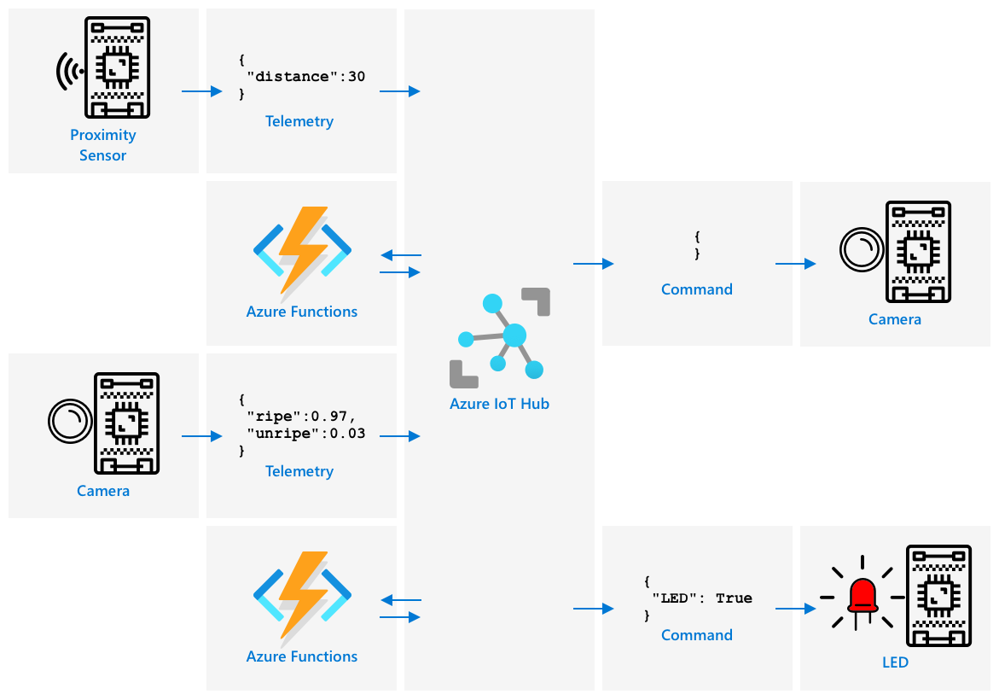

<!--
CO_OP_TRANSLATOR_METADATA:
{
  "original_hash": "f74f4ccb61f00e5f7e9f49c3ed416e36",
  "translation_date": "2025-08-28T19:01:27+00:00",
  "source_file": "4-manufacturing/lessons/4-trigger-fruit-detector/README.md",
  "language_code": "lt"
}
-->
# Paleidžiame vaisių kokybės aptikimą iš jutiklio


> Sketchnote sukūrė [Nitya Narasimhan](https://github.com/nitya). Spustelėkite paveikslėlį, kad pamatytumėte didesnę versiją.

## Klausimai prieš paskaitą

[Klausimai prieš paskaitą](https://black-meadow-040d15503.1.azurestaticapps.net/quiz/35)

## Įvadas

IoT aplikacija nėra vien tik vienas įrenginys, kuris renka duomenis ir siunčia juos į debesį. Dažniausiai tai yra keli įrenginiai, kurie dirba kartu, kad surinktų duomenis iš fizinio pasaulio naudodami jutiklius, priimtų sprendimus remdamiesi tais duomenimis ir sąveikautų su fiziniu pasauliu per aktuatorius ar vizualizacijas.

Šioje pamokoje sužinosite daugiau apie sudėtingų IoT aplikacijų architektūrą, įtraukiant kelis jutiklius, kelias debesų paslaugas duomenų analizei ir saugojimui, bei atsakymų rodymą per aktuatorius. Sužinosite, kaip sukurti vaisių kokybės kontrolės sistemos prototipą, įskaitant tai, kaip naudoti artumo jutiklius IoT aplikacijos paleidimui ir kokia būtų šio prototipo architektūra.

Šioje pamokoje aptarsime:

* [Sudėtingų IoT aplikacijų architektūra](../../../../../4-manufacturing/lessons/4-trigger-fruit-detector)
* [Vaisių kokybės kontrolės sistemos dizainas](../../../../../4-manufacturing/lessons/4-trigger-fruit-detector)
* [Vaisių kokybės tikrinimo paleidimas iš jutiklio](../../../../../4-manufacturing/lessons/4-trigger-fruit-detector)
* [Duomenys, naudojami vaisių kokybės detektoriui](../../../../../4-manufacturing/lessons/4-trigger-fruit-detector)
* [Kūrėjų įrenginių naudojimas kelių IoT įrenginių simuliacijai](../../../../../4-manufacturing/lessons/4-trigger-fruit-detector)
* [Perėjimas į gamybą](../../../../../4-manufacturing/lessons/4-trigger-fruit-detector)

> 🗑 Tai yra paskutinė pamoka šiame projekte, todėl baigę pamoką ir užduotį nepamirškite išvalyti savo debesų paslaugų. Jums reikės paslaugų užduoties atlikimui, todėl įsitikinkite, kad pirmiausia ją atlikote.
>
> Jei reikia, kreipkitės į [projekto valymo vadovą](../../../clean-up.md) dėl instrukcijų, kaip tai padaryti.

## Sudėtingų IoT aplikacijų architektūra

IoT aplikacijos susideda iš daugybės komponentų. Tai apima įvairius įrenginius ir interneto paslaugas.

IoT aplikacijas galima apibūdinti kaip *daiktus* (įrenginius), kurie siunčia duomenis, generuojančius *įžvalgas*. Šios *įžvalgos* generuoja *veiksmus*, kurie padeda pagerinti verslą ar procesą. Pavyzdžiui, variklis (daiktas) siunčia temperatūros duomenis. Šie duomenys naudojami įvertinti, ar variklis veikia kaip tikėtasi (įžvalga). Įžvalga naudojama proaktyviai prioritetizuoti variklio priežiūros grafiką (veiksmas).

* Skirtingi daiktai renka skirtingus duomenis.
* IoT paslaugos suteikia įžvalgas apie tuos duomenis, kartais papildydamos juos duomenimis iš kitų šaltinių.
* Šios įžvalgos skatina veiksmus, įskaitant aktuatorių valdymą įrenginiuose arba duomenų vizualizavimą.

### IoT architektūros pavyzdys


Aukščiau pateiktame paveikslėlyje parodyta IoT architektūros pavyzdys.

> 🎓 *Architektūros pavyzdys* yra pavyzdinė architektūra, kurią galite naudoti kaip nuorodą kurdami naujas sistemas. Šiuo atveju, jei kuriate naują IoT sistemą, galite sekti šį pavyzdį, pritaikydami savo įrenginius ir paslaugas, kur tai tinkama.

* **Daiktai** yra įrenginiai, kurie renka duomenis iš jutiklių, galbūt sąveikauja su kraštinėmis paslaugomis, kad interpretuotų tuos duomenis, pavyzdžiui, vaizdų klasifikatoriais, kurie interpretuoja vaizdo duomenis. Duomenys iš įrenginių siunčiami į IoT paslaugą.
* **Įžvalgos** gaunamos iš serverless aplikacijų arba analizuojant saugomus duomenis.
* **Veiksmai** gali būti komandos, siunčiamos į įrenginius, arba duomenų vizualizavimas, leidžiantis žmonėms priimti sprendimus.


Aukščiau pateiktame paveikslėlyje parodyti kai kurie komponentai ir paslaugos, aptarti šiose pamokose, ir kaip jie susiję IoT architektūros pavyzdyje.

* **Daiktai** - jūs rašėte įrenginio kodą, kad surinktumėte duomenis iš jutiklių ir analizuotumėte vaizdus naudodami Custom Vision, veikiančią tiek debesyje, tiek kraštiniame įrenginyje. Šie duomenys buvo siunčiami į IoT Hub.
* **Įžvalgos** - jūs naudojote Azure Functions, kad reaguotumėte į pranešimus, siunčiamus į IoT Hub, ir saugojote duomenis vėlesnei analizei Azure Storage.
* **Veiksmai** - jūs valdėte aktuatorius, remdamiesi debesyje priimtais sprendimais ir komandomis, siunčiamomis į įrenginius, bei vizualizavote duomenis naudodami Azure Maps.

✅ Pagalvokite apie kitus IoT įrenginius, kuriuos naudojote, pavyzdžiui, išmaniuosius namų prietaisus. Kokie yra daiktai, įžvalgos ir veiksmai, susiję su tuo įrenginiu ir jo programine įranga?

Šis modelis gali būti išplėstas tiek dideliu, tiek mažu mastu, pridedant daugiau įrenginių ir paslaugų.

### Duomenys ir saugumas

Kuriant sistemos architektūrą, nuolat reikia galvoti apie duomenis ir saugumą.

* Kokius duomenis jūsų įrenginys siunčia ir gauna?
* Kaip tie duomenys turėtų būti apsaugoti?
* Kaip turėtų būti kontroliuojama prieiga prie įrenginio ir debesų paslaugos?

✅ Pagalvokite apie savo IoT įrenginių duomenų saugumą. Kiek iš tų duomenų yra asmeniniai ir turėtų būti laikomi privačiais, tiek perduodant, tiek saugant? Kokie duomenys neturėtų būti saugomi?

## Vaisių kokybės kontrolės sistemos dizainas

Dabar pritaikykime daiktų, įžvalgų ir veiksmų idėją mūsų vaisių kokybės detektoriui, kad sukurtume didesnę, pilną aplikaciją.

Įsivaizduokite, kad jums buvo pavesta sukurti vaisių kokybės detektorių, kuris būtų naudojamas perdirbimo gamykloje. Vaisiai keliauja konvejerio juosta, kur šiuo metu darbuotojai rankomis tikrina vaisius ir pašalina nesunokusius vaisius, kai jie atvyksta. Siekiant sumažinti išlaidas, gamyklos savininkas nori automatizuotos sistemos.

✅ Viena iš IoT (ir technologijų apskritai) augimo tendencijų yra ta, kad rankiniai darbai pakeičiami mašinomis. Atlikite tyrimą: Kiek darbo vietų numatoma prarasti dėl IoT? Kiek naujų darbo vietų bus sukurta kuriant IoT įrenginius?

Jums reikia sukurti sistemą, kurioje vaisiai būtų aptikti, kai jie atvyksta ant konvejerio juostos, tada jie būtų nufotografuoti ir patikrinti naudojant AI modelį, veikiantį kraštiniame įrenginyje. Rezultatai siunčiami į debesį, o jei vaisiai yra nesunokę, pateikiamas pranešimas, kad nesunokę vaisiai būtų pašalinti.

|   |   |
| - | - |
| **Daiktai** | Detektorius vaisių aptikimui ant konvejerio juostos<br>Kamera vaisių fotografavimui ir klasifikavimui<br>Kraštinis įrenginys, vykdantis klasifikatorių<br>Įrenginys pranešimui apie nesunokusius vaisius |
| **Įžvalgos** | Sprendimas patikrinti vaisių sunokimą<br>Rezultatų saugojimas apie vaisių klasifikaciją<br>Nustatymas, ar reikia pranešti apie nesunokusius vaisius |
| **Veiksmai** | Komandos siuntimas į įrenginį vaisių fotografavimui ir tikrinimui naudojant vaizdų klasifikatorių<br>Komandos siuntimas į įrenginį pranešti apie nesunokusius vaisius |

### Jūsų aplikacijos prototipas


Aukščiau pateiktame paveikslėlyje parodyta šios prototipinės aplikacijos architektūra.

* IoT įrenginys su artumo jutikliu aptinka vaisių atvykimą. Jis siunčia pranešimą į debesį, kad vaisius buvo aptiktas.
* Serverless aplikacija debesyje siunčia komandą kitam įrenginiui nufotografuoti ir klasifikuoti vaizdą.
* IoT įrenginys su kamera nufotografuoja ir siunčia vaizdą į kraštinį įrenginį, kuriame veikia vaizdų klasifikatorius. Rezultatai siunčiami į debesį.
* Serverless aplikacija debesyje saugo šią informaciją, kad vėliau būtų galima analizuoti, kokia procentinė dalis vaisių yra nesunokę. Jei vaisiai yra nesunokę, ji siunčia komandą kitam IoT įrenginiui pranešti gamyklos darbuotojams apie nesunokusius vaisius per LED.

> 💁 Visa ši IoT aplikacija galėtų būti įgyvendinta kaip vienas įrenginys, su visa logika, reikalinga vaizdų klasifikacijai pradėti ir LED valdymui. Ji galėtų naudoti IoT Hub tik tam, kad stebėtų nesunokusių vaisių skaičių ir konfigūruotų įrenginį. Šioje pamokoje ji išplėsta, kad būtų parodytos didelio masto IoT aplikacijų koncepcijos.

Prototipui įgyvendinsite viską viename įrenginyje. Jei naudojate mikrovaldiklį, tada naudosite atskirą kraštinį įrenginį vaizdų klasifikatoriui vykdyti. Jūs jau išmokote daugumą dalykų, kurių jums reikės, kad galėtumėte tai sukurti.

## Vaisių kokybės tikrinimo paleidimas iš jutiklio

IoT įrenginiui reikia tam tikro paleidimo mechanizmo, kuris nurodytų, kada vaisius yra pasiruošęs klasifikacijai. Vienas iš paleidimo mechanizmų galėtų būti vaisiaus vietos ant konvejerio juostos matavimas naudojant atstumo jutiklį.


Artumo jutikliai gali būti naudojami atstumui nuo jutiklio iki objekto matavimui. Jie paprastai perduoda elektromagnetinės spinduliuotės, tokios kaip lazerio spindulys ar infraraudonųjų spindulių šviesa, pluoštą, tada aptinka spinduliuotę, atsispindėjusią nuo objekto. Laikas tarp lazerio spindulio siuntimo ir signalo atsispindėjimo gali būti naudojamas atstumui iki jutiklio apskaičiuoti.

> 💁 Tikriausiai naudojote artumo jutiklius net nežinodami apie tai. Dauguma išmaniųjų telefonų išjungia ekraną, kai laikote juos prie ausies, kad netyčia neužbaigtumėte skambučio ausies lanku. Tai veikia naudojant artumo jutiklį, kuris aptinka objektą arti ekrano skambučio metu ir išjungia prisilietimo funkcijas, kol telefonas yra tam tikru atstumu.

### Užduotis - vaisių kokybės aptikimo paleidimas iš atstumo jutiklio

Atlikite atitinkamą vadovą, kad naudotumėte artumo jutiklį objekto aptikimui naudojant savo IoT įrenginį:

* [Arduino - Wio Terminal](wio-terminal-proximity.md)
* [Vieno plokštės kompiuteris - Raspberry Pi](pi-proximity.md)
* [Vieno plokštės kompiuteris - Virtualus įrenginys](virtual-device-proximity.md)

## Duomenys, naudojami vaisių kokybės detektoriui

Prototipinis vaisių detektorius turi kelis komponentus, kurie tarpusavyje komunikuoja.



* Artumo jutiklis, matuojantis atstumą iki vaisiaus ir siunčiantis tai į IoT Hub
* Komanda, valdanti kamerą, siunčiama iš IoT Hub į kamerą turintį įrenginį
* Vaizdų klasifikacijos rezultatai, siunčiami į IoT Hub
* Komanda, valdanti LED, kad praneštų apie nesunokusius vaisius, siunčiama iš IoT Hub į įrenginį su LED

Gera iš anksto apibrėžti šių pranešimų struktūrą, prieš pradedant kurti aplikaciją.

> 💁 Beveik kiekvienas patyręs programuotojas tam tikru savo karjeros momentu praleido valandas, dienas ar net savaites ieškodamas klaidų, kurias sukėlė skirtumai tarp siunčiamų duomenų ir tikėtinos struktūros.

Pavyzdžiui - jei siunčiate temperatūros informaciją, kaip apibrėžtumėte JSON? Galėtumėte turėti lauką pavadinimu `temperature`, arba galėtumėte naudoti įprastą santrumpą `temp`.

```json
{
    "temperature": 20.7
}
```

palyginti su:

```json
{
    "temp": 20.7
}
```

Taip pat turite apsvarstyti vienetus - ar temperatūra yra °C ar °F? Jei matuojate temperatūrą naudodami vartotojo įrenginį ir jie pakeičia ekrano vienetus, turite užtikrinti, kad vienetai, siunčiami į debesį, išliktų nuoseklūs.

✅ Atlikite tyrimą: Kaip vienetų problemos sukėlė $125 milijonų vertės Mars Climate Orbiter katastrofą?

Pagalvokite apie duomenis, siunčiamus vaisių kokybės detektoriui. Kaip apibrėžtumėte kiekvieną pranešimą? Kur analizuotumėte duomenis ir priimtumėte sprendimus, kokius duomenis siųsti?

Pavyzdžiui - vaizdų klasifikacijos paleidimas naudojant artumo jutiklį. IoT įrenginys matuoja atstumą, bet kur priimamas sprendimas? Ar įrenginys nusprendžia, kad vaisius yra pakankamai arti, ir siunčia pranešimą IoT Hub, kad paleistų klasifikaciją? Ar jis siunčia artumo matavimus ir leidžia IoT Hub priimti sprendimą?

Atsakymas į tokius klausimus yra - tai priklauso. Kiekvienas naudojimo atvejis yra skirtingas, todėl kaip IoT programuotojas turite suprasti sistemą, kurią kuriate, kaip ji naudojama ir kokius duomenis ji aptinka.

* Jei sprendimas priimamas IoT Hub, turite siųsti kelis atstumo matavimus.
* Jei siunčiate per daug pranešimų, tai padidina IoT Hub išlaidas ir IoT įrenginių reikalingą pralaidumą (ypač gamykloje su milijonais įrenginių). Tai taip pat gali sulėtinti jūsų įrenginį.
* Jei sprendimą priimate įrenginyje, turėsite suteikti galimyb
💁 Atminkite, kad kai kuri aparatinė įranga neveiks, jei ją bandys pasiekti kelios vienu metu veikiančios programos.
### Simuliuojant kelis įrenginius mikrovaldiklyje

Mikrovaldiklius yra sudėtingiau simuliuoti su keliais įrenginiais. Skirtingai nei vieno plokštės kompiuteriuose, mikrovaldikliuose negalite paleisti kelių programų vienu metu – visa logika, skirta atskiriems IoT įrenginiams, turi būti įtraukta į vieną programą.

Keletas pasiūlymų, kaip palengvinti šį procesą:

* Sukurkite vieną ar daugiau klasių kiekvienam IoT įrenginiui – pavyzdžiui, klases, pavadintas `DistanceSensor`, `ClassifierCamera`, `LEDController`. Kiekviena klasė gali turėti savo `setup` ir `loop` metodus, kuriuos iškviečia pagrindinės `setup` ir `loop` funkcijos.
* Komandas tvarkykite vienoje vietoje ir nukreipkite jas į atitinkamą įrenginio klasę pagal poreikį.
* Pagrindinėje `loop` funkcijoje turėsite atsižvelgti į kiekvieno įrenginio skirtingą laiko intervalą. Pavyzdžiui, jei turite vieną įrenginio klasę, kuri turi būti apdorojama kas 10 sekundžių, o kitą – kas 1 sekundę, pagrindinėje `loop` funkcijoje naudokite 1 sekundės vėlavimą. Kiekvienas `loop` iškvietimas paleidžia atitinkamą kodą įrenginiui, kuris turi būti apdorojamas kas sekundę, ir naudokite skaitiklį, kad suskaičiuotumėte kiekvieną ciklą, apdorodami kitą įrenginį, kai skaitiklis pasiekia 10 (po to skaitiklį iš naujo nustatykite).

## Perėjimas į gamybą

Prototipas taps pagrindu galutinei gamybos sistemai. Kai pereisite į gamybą, kai kurie skirtumai būtų:

* Sustiprinti komponentai – naudojant techninę įrangą, sukurtą atlaikyti triukšmą, karštį, vibraciją ir stresą gamykloje.
* Vidinė komunikacija – kai kurie komponentai komunikuotų tiesiogiai, vengdami ryšio per debesį, duomenis į debesį siųsdami tik saugojimui. Kaip tai daroma, priklauso nuo gamyklos konfigūracijos – tiesioginė komunikacija arba dalies IoT paslaugos vykdymas krašte naudojant vartų įrenginį.
* Konfigūracijos parinktys – kiekviena gamykla ir naudojimo atvejis yra skirtingi, todėl techninė įranga turėtų būti konfigūruojama. Pavyzdžiui, artumo jutiklis gali reikėti aptikti skirtingus vaisius skirtingais atstumais. Vietoj to, kad kietai užkoduotumėte atstumą klasifikacijai suaktyvinti, norėtumėte, kad tai būtų konfigūruojama per debesį, pavyzdžiui, naudojant įrenginio dvynį.
* Automatinis vaisių pašalinimas – vietoj LED, kuris įspėja, kad vaisius yra nesubrendęs, automatiniai įrenginiai pašalintų jį.

✅ Atlikite tyrimą: Kokiais kitais būdais gamybos įrenginiai skirtųsi nuo kūrėjų rinkinių?

---

## 🚀 Iššūkis

Šioje pamokoje išmokote kai kurių koncepcijų, kurias reikia žinoti, kaip sukurti IoT sistemą. Prisiminę ankstesnius projektus, pagalvokite, kaip jie atitinka aukščiau pateiktą referencinę architektūrą.

Pasirinkite vieną iš iki šiol atliktų projektų ir pagalvokite apie sudėtingesnio sprendimo dizainą, kuris sujungtų kelias galimybes, viršijančias tai, kas buvo aptarta projektuose. Nubraižykite architektūrą ir pagalvokite apie visus įrenginius ir paslaugas, kurių jums reikėtų.

Pavyzdžiui – transporto priemonės sekimo įrenginys, kuris sujungia GPS su jutikliais, stebinčiais, pavyzdžiui, temperatūrą šaldytuve esančiame sunkvežimyje, variklio įjungimo ir išjungimo laikus bei vairuotojo tapatybę. Kokie įrenginiai dalyvauja, kokios paslaugos naudojamos, kokie duomenys perduodami ir kokie saugumo bei privatumo aspektai?

## Po paskaitos testas

[Po paskaitos testas](https://black-meadow-040d15503.1.azurestaticapps.net/quiz/36)

## Apžvalga ir savarankiškas mokymasis

* Skaitykite daugiau apie IoT architektūrą [Azure IoT referencinės architektūros dokumentacijoje Microsoft docs](https://docs.microsoft.com/azure/architecture/reference-architectures/iot?WT.mc_id=academic-17441-jabenn)
* Skaitykite daugiau apie įrenginių dvynius [suprasti ir naudoti įrenginių dvynius IoT Hub dokumentacijoje Microsoft docs](https://docs.microsoft.com/azure/iot-hub/iot-hub-devguide-device-twins?WT.mc_id=academic-17441-jabenn)
* Skaitykite apie OPC-UA, mašinų komunikacijos protokolą, naudojamą pramonės automatizavime, [OPC-UA puslapyje Wikipedia](https://wikipedia.org/wiki/OPC_Unified_Architecture)

## Užduotis

[Sukurkite vaisių kokybės detektorių](assignment.md)

---

**Atsakomybės apribojimas**:  
Šis dokumentas buvo išverstas naudojant AI vertimo paslaugą [Co-op Translator](https://github.com/Azure/co-op-translator). Nors siekiame tikslumo, prašome atkreipti dėmesį, kad automatiniai vertimai gali turėti klaidų ar netikslumų. Originalus dokumentas jo gimtąja kalba turėtų būti laikomas autoritetingu šaltiniu. Kritinei informacijai rekomenduojama naudoti profesionalų žmogaus vertimą. Mes neprisiimame atsakomybės už nesusipratimus ar klaidingus interpretavimus, atsiradusius dėl šio vertimo naudojimo.