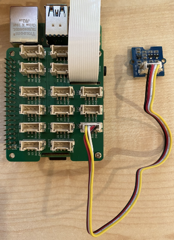

<!--
CO_OP_TRANSLATOR_METADATA:
{
  "original_hash": "6145a1d791731c8a9d0afd0a1bae5108",
  "translation_date": "2025-08-28T19:02:40+00:00",
  "source_file": "4-manufacturing/lessons/4-trigger-fruit-detector/pi-proximity.md",
  "language_code": "lt"
}
-->
# Aptikite artumą - Raspberry Pi

Šioje pamokos dalyje pridėsite artumo jutiklį prie savo Raspberry Pi ir skaitysite atstumą iš jo.

## Aparatinė įranga

Raspberry Pi reikalingas artumo jutiklis.

Naudojamas jutiklis yra [Grove Time of Flight atstumo jutiklis](https://www.seeedstudio.com/Grove-Time-of-Flight-Distance-Sensor-VL53L0X.html). Šis jutiklis naudoja lazerinį matavimo modulį atstumui aptikti. Jutiklio diapazonas yra nuo 10 mm iki 2000 mm (1 cm - 2 m), ir jis gana tiksliai praneša reikšmes šiame diapazone, o atstumai virš 1000 mm pranešami kaip 8109 mm.

Lazerinis atstumo matuoklis yra jutiklio gale, priešingoje pusėje nei Grove jungtis.

Tai yra I²C jutiklis.

### Prijunkite Time of Flight jutiklį

Grove Time of Flight jutiklis gali būti prijungtas prie Raspberry Pi.

#### Užduotis - prijunkite Time of Flight jutiklį

Prijunkite Time of Flight jutiklį.


1. Įstatykite vieną Grove kabelio galą į Time of Flight jutiklio jungtį. Jis įsistatys tik viena kryptimi.

1. Išjungus Raspberry Pi, prijunkite kitą Grove kabelio galą prie vienos iš I²C jungčių, pažymėtų **I²C**, esančių Grove Base hat, prijungto prie Pi. Šios jungtys yra apatinėje eilėje, priešingoje GPIO pinams ir šalia kameros kabelio lizdo.



## Programuokite Time of Flight jutiklį

Dabar Raspberry Pi galima programuoti naudoti prijungtą Time of Flight jutiklį.

### Užduotis - programuokite Time of Flight jutiklį

Programuokite įrenginį.

1. Įjunkite Pi ir palaukite, kol jis įsijungs.

1. Atidarykite `fruit-quality-detector` kodą VS Code, tiesiogiai Pi arba prisijungę per Remote SSH plėtinį.

1. Įdiekite `rpi-vl53l0x` Pip paketą, Python paketą, kuris sąveikauja su VL53L0X Time of Flight atstumo jutikliu. Įdiekite jį naudodami šią pip komandą:

    ```sh
    pip install rpi-vl53l0x
    ```

1. Sukurkite naują failą šiame projekte, pavadintą `distance-sensor.py`.

    > 💁 Paprastas būdas imituoti kelis IoT įrenginius yra kiekvieną jų programuoti atskirame Python faile, tada paleisti juos vienu metu.

1. Į šį failą pridėkite šį kodą:

    ```python
    import time
    
    from grove.i2c import Bus
    from rpi_vl53l0x.vl53l0x import VL53L0X
    ```

    Šis kodas importuoja Grove I²C magistralės biblioteką ir jutiklio biblioteką, skirtą pagrindinei Grove Time of Flight jutiklio aparatinei įrangai.

1. Po to pridėkite šį kodą, kad pasiektumėte jutiklį:

    ```python
    distance_sensor = VL53L0X(bus = Bus().bus)
    distance_sensor.begin()    
    ```

    Šis kodas deklaruoja atstumo jutiklį, naudodamas Grove I²C magistralę, ir paleidžia jutiklį.

1. Galiausiai pridėkite begalinę kilpą, kad skaitytumėte atstumus:

    ```python
    while True:
        distance_sensor.wait_ready()
        print(f'Distance = {distance_sensor.get_distance()} mm')
        time.sleep(1)
    ```

    Šis kodas laukia, kol bus paruošta reikšmė skaitymui iš jutiklio, tada išveda ją į konsolę.

1. Paleiskite šį kodą.

    > 💁 Nepamirškite, kad šis failas vadinasi `distance-sensor.py`! Įsitikinkite, kad paleidžiate jį per Python, o ne `app.py`.

1. Konsolėje pamatysite atstumo matavimus. Padėkite objektus šalia jutiklio ir pamatysite atstumo matavimus:

    ```output
    pi@raspberrypi:~/fruit-quality-detector $ python3 distance_sensor.py 
    Distance = 29 mm
    Distance = 28 mm
    Distance = 30 mm
    Distance = 151 mm
    ```

    Atstumo matuoklis yra jutiklio gale, todėl matuodami atstumą naudokite tinkamą pusę.

    

> 💁 Šį kodą galite rasti [code-proximity/pi](../../../../../4-manufacturing/lessons/4-trigger-fruit-detector/code-proximity/pi) aplanke.

😀 Jūsų artumo jutiklio programa pavyko!

---

**Atsakomybės apribojimas**:  
Šis dokumentas buvo išverstas naudojant AI vertimo paslaugą [Co-op Translator](https://github.com/Azure/co-op-translator). Nors stengiamės užtikrinti tikslumą, prašome atkreipti dėmesį, kad automatiniai vertimai gali turėti klaidų ar netikslumų. Originalus dokumentas jo gimtąja kalba turėtų būti laikomas autoritetingu šaltiniu. Dėl svarbios informacijos rekomenduojama profesionali žmogaus vertimo paslauga. Mes neprisiimame atsakomybės už nesusipratimus ar klaidingus interpretavimus, atsiradusius naudojant šį vertimą.