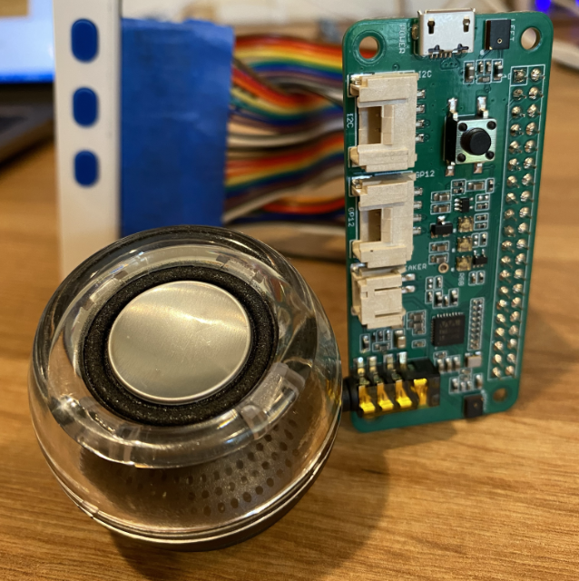

<!--
CO_OP_TRANSLATOR_METADATA:
{
  "original_hash": "93d352de36526b8990e41dd538100324",
  "translation_date": "2025-08-28T19:26:17+00:00",
  "source_file": "6-consumer/lessons/1-speech-recognition/wio-terminal-microphone.md",
  "language_code": "lt"
}
-->
# Konfigūruokite savo mikrofoną ir garsiakalbius - Wio Terminal

Šioje pamokos dalyje pridėsite garsiakalbius prie savo Wio Terminal. Wio Terminal jau turi įmontuotą mikrofoną, kuris gali būti naudojamas kalbai įrašyti.

## Aparatinė įranga

Wio Terminal jau turi įmontuotą mikrofoną, kuris gali būti naudojamas garso įrašymui ir kalbos atpažinimui.

Norėdami pridėti garsiakalbį, galite naudoti [ReSpeaker 2-Mics Pi Hat](https://www.seeedstudio.com/ReSpeaker-2-Mics-Pi-HAT.html). Tai yra išorinė plokštė, kurioje yra 2 MEMS mikrofonai, taip pat garsiakalbio jungtis ir ausinių lizdas.

Jums reikės prijungti ausines, garsiakalbį su 3,5 mm jungtimi arba garsiakalbį su JST jungtimi, pavyzdžiui, [Mono Enclosed Speaker - 2W 6 Ohm](https://www.seeedstudio.com/Mono-Enclosed-Speaker-2W-6-Ohm-p-2832.html).

Norėdami prijungti ReSpeaker 2-Mics Pi Hat, jums reikės 40 pinų jungiamųjų laidų (dar vadinamų vyras-vyras laidais).

> 💁 Jei mokate lituoti, galite naudoti [40 Pin Raspberry Pi Hat Adapter Board For Wio Terminal](https://www.seeedstudio.com/40-Pin-Raspberry-Pi-Hat-Adapter-Board-For-Wio-Terminal-p-4730.html), kad prijungtumėte ReSpeaker.

Jums taip pat reikės SD kortelės, kad galėtumėte atsisiųsti ir atkurti garsą. Wio Terminal palaiko tik iki 16 GB dydžio SD korteles, kurios turi būti suformatuotos kaip FAT32 arba exFAT.

### Užduotis - prijunkite ReSpeaker Pi Hat

1. Išjungę Wio Terminal, prijunkite ReSpeaker 2-Mics Pi Hat prie Wio Terminal naudodami jungiamuosius laidus ir GPIO lizdus Wio Terminal gale:

    Pinai turi būti prijungti taip:

    

1. Padėkite ReSpeaker ir Wio Terminal taip, kad GPIO lizdai būtų nukreipti į viršų ir būtų kairėje pusėje.

1. Pradėkite nuo viršutinio kairiojo GPIO lizdo ReSpeaker. Prijunkite jungiamąjį laidą nuo viršutinio kairiojo ReSpeaker lizdo prie viršutinio kairiojo Wio Terminal lizdo.

1. Kartokite šį veiksmą per visus GPIO lizdus kairėje pusėje. Įsitikinkite, kad pinai tvirtai įstatyti.

    

    

    > 💁 Jei jūsų jungiamieji laidai yra sujungti į juosteles, laikykite juos kartu - tai padės užtikrinti, kad visi laidai būtų prijungti teisinga tvarka.

1. Pakartokite procesą naudodami dešiniuosius GPIO lizdus ReSpeaker ir Wio Terminal. Šie laidai turi būti pervesti aplink jau prijungtus laidus.

    

    

    > 💁 Jei jūsų jungiamieji laidai yra sujungti į juosteles, padalykite juos į dvi juosteles. Vieną perveskite per vieną pusę, kitą - per kitą.

    > 💁 Galite naudoti lipnią juostą, kad pritvirtintumėte pinus į bloką ir išvengtumėte jų iškritimo jungiant.

    > 

1. Jums reikės pridėti garsiakalbį.

    * Jei naudojate garsiakalbį su JST kabeliu, prijunkite jį prie JST lizdo ReSpeaker.

      

    * Jei naudojate garsiakalbį su 3,5 mm jungtimi arba ausines, įstatykite jas į 3,5 mm lizdą.

      

### Užduotis - paruoškite SD kortelę

1. Prijunkite SD kortelę prie savo kompiuterio, naudodami išorinį skaitytuvą, jei neturite SD kortelės lizdo.

1. Suformatuokite SD kortelę naudodami tinkamą įrankį savo kompiuteryje, įsitikinkite, kad naudojate FAT32 arba exFAT failų sistemą.

1. Įstatykite SD kortelę į SD kortelės lizdą Wio Terminal kairėje pusėje, tiesiai po įjungimo mygtuku. Įsitikinkite, kad kortelė visiškai įstatyta ir spragtelėjo - jums gali prireikti plono įrankio arba kitos SD kortelės, kad ją visiškai įstumtumėte.

    

    > 💁 Norėdami išimti SD kortelę, turite ją šiek tiek įstumti, kad ji iššoktų. Tam gali prireikti plono įrankio, pavyzdžiui, plokščio atsuktuvo arba kitos SD kortelės.

---

**Atsakomybės apribojimas**:  
Šis dokumentas buvo išverstas naudojant AI vertimo paslaugą [Co-op Translator](https://github.com/Azure/co-op-translator). Nors siekiame tikslumo, prašome atkreipti dėmesį, kad automatiniai vertimai gali turėti klaidų ar netikslumų. Originalus dokumentas jo gimtąja kalba turėtų būti laikomas autoritetingu šaltiniu. Dėl svarbios informacijos rekomenduojama profesionali žmogaus vertimo paslauga. Mes neprisiimame atsakomybės už nesusipratimus ar klaidingus aiškinimus, atsiradusius naudojant šį vertimą.