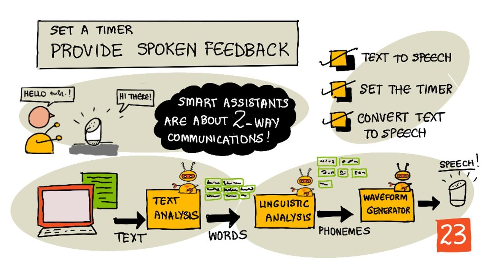

<!--
CO_OP_TRANSLATOR_METADATA:
{
  "original_hash": "b73fe10ec6b580fba2affb6f6e0a5c4d",
  "translation_date": "2025-08-28T19:18:19+00:00",
  "source_file": "6-consumer/lessons/3-spoken-feedback/README.md",
  "language_code": "lt"
}
-->
# Nustatykite laikmatį ir pateikite garsinį atsakymą



> Piešinys sukurtas [Nitya Narasimhan](https://github.com/nitya). Spustelėkite paveikslėlį, kad pamatytumėte didesnę versiją.

## Klausimynas prieš paskaitą

[Klausimynas prieš paskaitą](https://black-meadow-040d15503.1.azurestaticapps.net/quiz/45)

## Įvadas

Išmanieji asistentai nėra vienpusio bendravimo įrenginiai. Jūs kalbate su jais, o jie atsako:

„Alexa, nustatyk 3 minučių laikmatį“

„Gerai, jūsų laikmatis nustatytas 3 minutėms“

Per paskutines 2 pamokas išmokote, kaip paversti kalbą tekstu, o tada išgauti laikmačio nustatymo užklausą iš to teksto. Šioje pamokoje išmoksite, kaip nustatyti laikmatį IoT įrenginyje, atsakyti vartotojui garsiniais žodžiais, patvirtinančiais jų laikmatį, ir pranešti, kai laikmatis baigsis.

Šioje pamokoje aptarsime:

* [Teksto pavertimas kalba](../../../../../6-consumer/lessons/3-spoken-feedback)
* [Laikmačio nustatymas](../../../../../6-consumer/lessons/3-spoken-feedback)
* [Teksto konvertavimas į kalbą](../../../../../6-consumer/lessons/3-spoken-feedback)

## Teksto pavertimas kalba

Teksto pavertimas kalba, kaip rodo pavadinimas, yra procesas, kai tekstas paverčiamas garsu, kuriame tekstas pateikiamas kaip ištarti žodžiai. Pagrindinis principas yra suskaidyti teksto žodžius į jų sudedamuosius garsus (vadinamus fonemomis) ir sujungti šių garsų garso įrašus, naudojant iš anksto įrašytą garsą arba AI modelių generuotą garsą.


Teksto pavertimo kalba sistemos paprastai turi 3 etapus:

* Teksto analizė
* Lingvistinė analizė
* Bangos formos generavimas

### Teksto analizė

Teksto analizė apima pateikto teksto konvertavimą į žodžius, kurie gali būti naudojami kalbai generuoti. Pavyzdžiui, jei konvertuojate „Hello world“, teksto analizės nereikia, šie du žodžiai gali būti paversti kalba. Tačiau jei turite „1234“, tai gali reikėti konvertuoti į „Vienas tūkstantis du šimtai trisdešimt keturi“ arba „Vienas, du, trys, keturi“, priklausomai nuo konteksto. Jei sakinyje „Aš turiu 1234 obuolius“, tai būtų „Vienas tūkstantis du šimtai trisdešimt keturi“, bet sakinyje „Vaikas suskaičiavo 1234“ tai būtų „Vienas, du, trys, keturi“.

Sukurtų žodžių forma skiriasi ne tik pagal kalbą, bet ir pagal tos kalbos regioną. Pavyzdžiui, amerikietiškoje anglų kalboje 120 būtų „One hundred twenty“, o britiškoje anglų kalboje tai būtų „One hundred and twenty“, naudojant „and“ po šimtų.

✅ Kiti pavyzdžiai, kuriems reikalinga teksto analizė, yra „in“ kaip colio trumpinys ir „st“ kaip šventojo ar gatvės trumpinys. Ar galite sugalvoti kitų pavyzdžių savo kalboje, kur žodžiai be konteksto yra dviprasmiški?

Kai žodžiai yra apibrėžti, jie siunčiami lingvistinei analizei.

### Lingvistinė analizė

Lingvistinė analizė suskaido žodžius į fonemas. Fonemos yra pagrįstos ne tik naudojamomis raidėmis, bet ir kitomis raidėmis žodyje. Pavyzdžiui, anglų kalboje „a“ garsas žodyje „car“ ir „care“ yra skirtingas. Anglų kalba turi 44 skirtingas fonemas 26 abėcėlės raidėms, kai kurios dalijasi skirtingomis raidėmis, pavyzdžiui, ta pati fonema naudojama žodžių „circle“ ir „serpent“ pradžioje.

✅ Atlikite tyrimą: Kokios fonemos yra jūsų kalboje?

Kai žodžiai paverčiami fonemomis, šioms fonemoms reikia papildomų duomenų, kad būtų palaikoma intonacija, koreguojant toną ar trukmę priklausomai nuo konteksto. Vienas pavyzdys yra anglų kalboje, kur aukštesnis tonas gali būti naudojamas sakiniui paversti klausimu, padidėjęs tonas paskutiniam žodžiui reiškia klausimą.

Pavyzdžiui, sakinys „You have an apple“ yra teiginys, kad turite obuolį. Jei tonas pakyla pabaigoje, padidėja žodžiui „apple“, tai tampa klausimu „You have an apple?“, klausiant, ar turite obuolį. Lingvistinė analizė turi naudoti klaustuką pabaigoje, kad nuspręstų padidinti toną.

Kai fonemos yra sugeneruotos, jos gali būti siunčiamos bangos formos generavimui, kad būtų sukurtas garso išvestis.

### Bangos formos generavimas

Pirmosios elektroninės teksto pavertimo kalba sistemos naudojo vieną garso įrašą kiekvienai fonemai, todėl balsai skambėjo labai monotoniškai, robotizuotai. Lingvistinė analizė sugeneruodavo fonemas, jos būdavo įkeliamos iš garso duomenų bazės ir sujungiamos, kad būtų sukurtas garsas.

✅ Atlikite tyrimą: Suraskite garso įrašus iš ankstyvųjų kalbos sintezės sistemų. Palyginkite juos su modernia kalbos sinteze, tokia kaip naudojama išmaniuosiuose asistentuose.

Modernesnis bangos formos generavimas naudoja ML modelius, sukurtus naudojant gilųjį mokymąsi (labai didelius neuroninius tinklus, veikiančius panašiai kaip neuronai smegenyse), kad sukurtų natūraliau skambančius balsus, kurie gali būti neatskiriami nuo žmonių.

> 💁 Kai kurie iš šių ML modelių gali būti pertreniruoti naudojant perkėlimo mokymąsi, kad skambėtų kaip realūs žmonės. Tai reiškia, kad balsas kaip saugumo sistema, kurią bankai vis dažniau bando naudoti, nebėra gera idėja, nes bet kas, turintis kelių minučių jūsų balso įrašą, gali jus imituoti.

Šie dideli ML modeliai yra mokomi sujungti visus tris etapus į galutinius kalbos sintezatorius.

## Laikmačio nustatymas

Norėdami nustatyti laikmatį, jūsų IoT įrenginys turi iškviesti REST galinį tašką, kurį sukūrėte naudodami serverless kodą, o tada naudoti gautą sekundžių skaičių laikmačiui nustatyti.

### Užduotis - iškviesti serverless funkciją laikmačio laikui gauti

Sekite atitinkamą vadovą, kad iškviestumėte REST galinį tašką iš savo IoT įrenginio ir nustatytumėte laikmatį reikiamam laikui:

* [Arduino - Wio Terminal](wio-terminal-set-timer.md)
* [Vieno plokštės kompiuteris - Raspberry Pi/Virtualus IoT įrenginys](single-board-computer-set-timer.md)

## Teksto konvertavimas į kalbą

Ta pati kalbos paslauga, kurią naudojote kalbai paversti tekstu, gali būti naudojama tekstui paversti kalba, ir tai gali būti grojama per garsiakalbį jūsų IoT įrenginyje. Tekstas, kurį reikia konvertuoti, siunčiamas kalbos paslaugai kartu su reikalingo garso tipo (pvz., pavyzdžių dažnio) informacija, o grąžinami dvejetainiai duomenys, kuriuose yra garsas.

Kai siunčiate šį užklausą, ją siunčiate naudodami *Kalbos sintezės žymėjimo kalbą* (SSML), XML pagrįstą žymėjimo kalbą, skirtą kalbos sintezės programoms. Ji apibrėžia ne tik tekstą, kurį reikia konvertuoti, bet ir teksto kalbą, balsą, kurį reikia naudoti, ir netgi gali būti naudojama greičiui, garsumui ir tonui keisti kai kuriems ar visiems teksto žodžiams.

Pavyzdžiui, ši SSML apibrėžia užklausą konvertuoti tekstą „Jūsų 3 minučių 5 sekundžių laikmatis nustatytas“ į kalbą, naudojant britų anglų balsą, vadinamą `en-GB-MiaNeural`

```xml
<speak version='1.0' xml:lang='en-GB'>
    <voice xml:lang='en-GB' name='en-GB-MiaNeural'>
        Your 3 minute 5 second time has been set
    </voice>
</speak>
```

> 💁 Dauguma teksto pavertimo kalba sistemų turi kelis balsus skirtingoms kalboms, su atitinkamais akcentais, pvz., britų anglų balsą su anglišku akcentu ir Naujosios Zelandijos anglų balsą su Naujosios Zelandijos akcentu.

### Užduotis - konvertuoti tekstą į kalbą

Dirbkite pagal atitinkamą vadovą, kad konvertuotumėte tekstą į kalbą naudodami savo IoT įrenginį:

* [Arduino - Wio Terminal](wio-terminal-text-to-speech.md)
* [Vieno plokštės kompiuteris - Raspberry Pi](pi-text-to-speech.md)
* [Vieno plokštės kompiuteris - Virtualus įrenginys](virtual-device-text-to-speech.md)

---

## 🚀 Iššūkis

SSML turi būdų, kaip pakeisti, kaip žodžiai yra tariami, pvz., pridėti akcentą tam tikriems žodžiams, pridėti pauzes ar pakeisti toną. Išbandykite kai kuriuos iš jų, siųsdami skirtingą SSML iš savo IoT įrenginio ir palygindami rezultatą. Daugiau apie SSML, įskaitant tai, kaip pakeisti žodžių tarimą, galite perskaityti [Kalbos sintezės žymėjimo kalbos (SSML) 1.1 versijos specifikacijoje iš Pasaulinio tinklo konsorciumo](https://www.w3.org/TR/speech-synthesis11/).

## Klausimynas po paskaitos

[Klausimynas po paskaitos](https://black-meadow-040d15503.1.azurestaticapps.net/quiz/46)

## Apžvalga ir savarankiškas mokymasis

* Skaitykite daugiau apie kalbos sintezę [kalbos sintezės puslapyje Vikipedijoje](https://wikipedia.org/wiki/Speech_synthesis)
* Skaitykite daugiau apie būdus, kaip nusikaltėliai naudoja kalbos sintezę pinigams pavogti, [netikri balsai „padeda kibernetiniams nusikaltėliams vogti pinigus“ straipsnyje BBC naujienose](https://www.bbc.com/news/technology-48908736)
* Sužinokite daugiau apie riziką, kurią patiria balso aktoriai dėl sintetinių jų balsų versijų, [šiame straipsnyje apie TikTok ieškinį, kuris pabrėžia, kaip AI kenkia balso aktoriams, Vice](https://www.vice.com/en/article/z3xqwj/this-tiktok-lawsuit-is-highlighting-how-ai-is-screwing-over-voice-actors)

## Užduotis

[Atšaukti laikmatį](assignment.md)

---

**Atsakomybės apribojimas**:  
Šis dokumentas buvo išverstas naudojant dirbtinio intelekto vertimo paslaugą [Co-op Translator](https://github.com/Azure/co-op-translator). Nors siekiame tikslumo, atkreipkite dėmesį, kad automatiniai vertimai gali turėti klaidų ar netikslumų. Originalus dokumentas jo gimtąja kalba turėtų būti laikomas autoritetingu šaltiniu. Kritinei informacijai rekomenduojama naudoti profesionalų žmogaus vertimą. Mes neprisiimame atsakomybės už nesusipratimus ar klaidingus aiškinimus, kylančius dėl šio vertimo naudojimo.