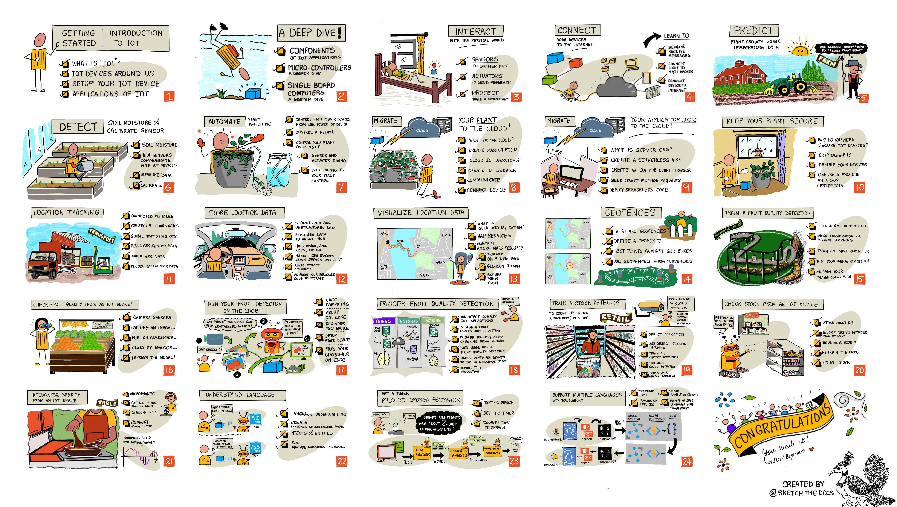

<!--
CO_OP_TRANSLATOR_METADATA:
{
  "original_hash": "859d11be071d66c7da196dd1857d47b4",
  "translation_date": "2025-10-24T09:29:55+00:00",
  "source_file": "README.md",
  "language_code": "lt"
}
-->
[](https://github.com/microsoft/IoT-For-Beginners/blob/master/LICENSE)
[](https://GitHub.com/microsoft/IoT-For-Beginners/graphs/contributors/)
[](https://GitHub.com/microsoft/IoT-For-Beginners/issues/)
[](https://GitHub.com/microsoft/IoT-For-Beginners/pulls/)
[](http://makeapullrequest.com)

[](https://GitHub.com/microsoft/IoT-For-Beginners/watchers/)
[](https://GitHub.com/microsoft/IoT-For-Beginners/network/)
[](https://GitHub.com/microsoft/IoT-For-Beginners/stargazers/)

### Prisijunkite prie Azure AI Foundry bendruomenės
[](https://discord.com/invite/ByRwuEEgH4)

Sekite šiuos žingsnius, kad pradėtumėte naudotis šiais ištekliais:
1. **Fork'uokite saugyklą**: Spustelėkite [](https://GitHub.com/microsoft/IoT-For-Beginners/fork)
2. **Klonuokite saugyklą**:   `git clone https://github.com/microsoft/IoT-For-Beginners.git`
3. [**Prisijunkite prie Azure AI Foundry Discord ir susipažinkite su ekspertais bei kitais kūrėjais**](https://discord.com/invite/ByRwuEEgH4)

### 🌐 Daugiakalbė parama

#### Palaikoma per GitHub Action (Automatizuota ir visada atnaujinta)

<!-- CO-OP TRANSLATOR LANGUAGES TABLE START -->
[Arabic](../ar/README.md) | [Bengali](../bn/README.md) | [Bulgarian](../bg/README.md) | [Burmese (Myanmar)](../my/README.md) | [Chinese (Simplified)](../zh/README.md) | [Chinese (Traditional, Hong Kong)](../hk/README.md) | [Chinese (Traditional, Macau)](../mo/README.md) | [Chinese (Traditional, Taiwan)](../tw/README.md) | [Croatian](../hr/README.md) | [Czech](../cs/README.md) | [Danish](../da/README.md) | [Dutch](../nl/README.md) | [Estonian](../et/README.md) | [Finnish](../fi/README.md) | [French](../fr/README.md) | [German](../de/README.md) | [Greek](../el/README.md) | [Hebrew](../he/README.md) | [Hindi](../hi/README.md) | [Hungarian](../hu/README.md) | [Indonesian](../id/README.md) | [Italian](../it/README.md) | [Japanese](../ja/README.md) | [Korean](../ko/README.md) | [Lithuanian](./README.md) | [Malay](../ms/README.md) | [Marathi](../mr/README.md) | [Nepali](../ne/README.md) | [Norwegian](../no/README.md) | [Persian (Farsi)](../fa/README.md) | [Polish](../pl/README.md) | [Portuguese (Brazil)](../br/README.md) | [Portuguese (Portugal)](../pt/README.md) | [Punjabi (Gurmukhi)](../pa/README.md) | [Romanian](../ro/README.md) | [Russian](../ru/README.md) | [Serbian (Cyrillic)](../sr/README.md) | [Slovak](../sk/README.md) | [Slovenian](../sl/README.md) | [Spanish](../es/README.md) | [Swahili](../sw/README.md) | [Swedish](../sv/README.md) | [Tagalog (Filipino)](../tl/README.md) | [Tamil](../ta/README.md) | [Thai](../th/README.md) | [Turkish](../tr/README.md) | [Ukrainian](../uk/README.md) | [Urdu](../ur/README.md) | [Vietnamese](../vi/README.md)
<!-- CO-OP TRANSLATOR LANGUAGES TABLE END -->

# IoT pradedantiesiems - mokymo programa

„Microsoft“ Azure Cloud Advocates džiaugiasi galėdami pasiūlyti 12 savaičių, 24 pamokų mokymo programą apie IoT pagrindus. Kiekviena pamoka apima prieš pamoką ir po pamokos testus, rašytines instrukcijas, kaip atlikti pamoką, sprendimus, užduotis ir dar daugiau. Mūsų projektinis mokymo metodas leidžia mokytis kuriant, o tai yra patikrintas būdas įsisavinti naujus įgūdžius.

Projektai apima maisto kelionę nuo ūkio iki stalo. Tai apima ūkininkavimą, logistiką, gamybą, mažmeninę prekybą ir vartotoją – visos populiarios pramonės sritys, kuriose naudojami IoT įrenginiai.



> Sketchnote sukūrė [Nitya Narasimhan](https://github.com/nitya). Spustelėkite paveikslėlį, kad pamatytumėte didesnę versiją.

**Nuoširdžiai dėkojame mūsų autoriams [Jen Fox](https://github.com/jenfoxbot), [Jen Looper](https://github.com/jlooper), [Jim Bennett](https://github.com/jimbobbennett) ir mūsų sketchnote menininkei [Nitya Narasimhan](https://github.com/nitya).**

**Taip pat dėkojame mūsų komandai [Microsoft Learn Student Ambassadors](https://studentambassadors.microsoft.com?WT.mc_id=academic-17441-jabenn), kurie peržiūrėjo ir išvertė šią mokymo programą - [Aditya Garg](https://github.com/AdityaGarg00), [Anurag Sharma](https://github.com/Anurag-0-1-A), [Arpita Das](https://github.com/Arpiiitaaa), [Aryan Jain](https://www.linkedin.com/in/aryan-jain-47a4a1145/), [Bhavesh Suneja](https://github.com/EliteWarrior315), [Faith Hunja](https://faithhunja.github.io/), [Lateefah Bello](https://www.linkedin.com/in/lateefah-bello/), [Manvi Jha](https://github.com/Severus-Matthew), [Mireille Tan](https://www.linkedin.com/in/mireille-tan-a4834819a/), [Mohammad Iftekher (Iftu) Ebne Jalal](https://github.com/Iftu119), [Mohammad Zulfikar](https://github.com/mohzulfikar), [Priyanshu Srivastav](https://www.linkedin.com/in/priyanshu-srivastav-b067241ba), [Thanmai Gowducheruvu](https://github.com/innovation-platform), ir [Zina Kamel](https://www.linkedin.com/in/zina-kamel/).**

Susipažinkite su komanda!

[](https://youtu.be/-wippUJRi5k)

**Gif sukūrė** [Mohit Jaisal](https://linkedin.com/in/mohitjaisal)

> 🎥 Spustelėkite aukščiau esantį paveikslėlį, kad pamatytumėte vaizdo įrašą apie projektą!

> **Mokytojai**, mes [įtraukėme keletą pasiūlymų](for-teachers.md), kaip naudoti šią mokymo programą. Jei norite sukurti savo pamokas, mes taip pat įtraukėme [pamokos šabloną](lesson-template/README.md).

> **[Studentai](https://aka.ms/student-page)**, norėdami savarankiškai naudotis šia mokymo programa, fork'uokite visą saugyklą ir atlikite užduotis savarankiškai, pradėdami nuo prieš paskaitą testo, tada perskaitykite paskaitą ir atlikite likusias veiklas. Stenkitės kurti projektus suprasdami pamokas, o ne kopijuodami sprendimo kodą; tačiau tas kodas yra prieinamas /solutions aplankuose kiekvienoje projektui skirtoje pamokoje. Kita idėja būtų suformuoti studijų grupę su draugais ir kartu peržiūrėti turinį. Tolimesniam mokymuisi rekomenduojame [Microsoft Learn](https://docs.microsoft.com/users/jimbobbennett/collections/ke2ehd351jopwr?WT.mc_id=academic-17441-jabenn).

Norėdami pamatyti šio kurso vaizdo įrašo apžvalgą, peržiūrėkite šį vaizdo įrašą:

[](https://youtube.com/watch?v=bccEMm8gRuc "Reklaminis vaizdo įrašas")

> 🎥 Spustelėkite aukščiau esantį paveikslėlį, kad pamatytumėte vaizdo įrašą apie projektą!

## Pedagogika

Kuriant šią mokymo programą pasirinkome du pedagoginius principus: užtikrinti, kad ji būtų projektinė, ir įtraukti dažnus testus. Iki šios serijos pabaigos studentai sukurs augalų stebėjimo ir laistymo sistemą, transporto priemonės sekimo įrenginį, išmaniąją gamyklos sistemą maisto stebėjimui ir tikrinimui bei balso valdomą gaminimo laikmatį, taip pat išmoks daiktų interneto pagrindus, įskaitant įrenginių kodavimą, prisijungimą prie debesies, telemetrijos analizę ir AI naudojimą krašte.

Užtikrinant, kad turinys atitiktų projektus, procesas tampa įdomesnis studentams, o koncepcijų išlaikymas sustiprėja.

Be to, mažo streso testas prieš pamoką nustato studento ketinimą mokytis temos, o antrasis testas po pamokos užtikrina tolesnį išlaikymą. Ši mokymo programa buvo sukurta taip, kad būtų lanksti ir įdomi, ją galima naudoti visą arba dalimis. Projektai prasideda nuo paprastų ir tampa vis sudėtingesni iki 12 savaičių ciklo pabaigos.

Kiekvienas projektas yra pagrįstas realiu aparatine įranga, prieinama studentams ir entuziastams. Kiekvienas projektas nagrinėja konkretų projekto domeną, suteikdamas atitinkamas pagrindines žinias. Norint tapti sėkmingu kūrėju, svarbu suprasti domeną, kuriame sprendžiamos problemos, o šios pagrindinės žinios leidžia studentams galvoti apie savo IoT sprendimus ir mokymus realių problemų, kurias jie gali būti paprašyti spręsti kaip IoT kūrėjai, kontekste. Studentai sužino „kodėl“ sprendimų, kuriuos jie kuria, ir įgyja galutinio vartotojo supratimą.

## Aparatinė įranga

Mes turime du IoT aparatinės įrangos pasirinkimus, kuriuos galima naudoti projektuose, priklausomai nuo asmeninių pageidavimų, programavimo kalbos žinių ar pageidavimų, mokymosi tikslų ir prieinamumo. Taip pat pateikėme „virtualios aparatinės įrangos“ versiją tiems, kurie neturi prieigos prie aparatinės įrangos arba nori sužinoti daugiau prieš įsigydami. Daugiau informacijos ir „pirkinių sąrašą“ galite rasti [aparatinės įrangos puslapyje](./hardware.md), įskaitant nuorodas į pilnus rinkinius iš mūsų draugų Seeed Studio.

> 💁 Raskite mūsų [Elgesio kodeksą](CODE_OF_CONDUCT.md), [Prisidėjimo](CONTRIBUTING.md) ir [Vertimo](TRANSLATIONS.md) gaires. Laukiame jūsų konstruktyvios nuomonės!

## Kiekviena pamoka apima:

- sketchnote
- pasirenkamą papildomą vaizdo įrašą
- prieš pamoką apšilimo testą
- rašytinę pamoką
- projektinėms pamokoms – žingsnis po žingsnio vadovus, kaip sukurti projektą
- žinių patikrinimus
- iššūkį
- papildomą skaitymą
- užduotį
- [po pamokos testą](https://ff-quizzes.netlify.app/en/)

> **Pastaba apie testus**: Visi testai yra patalpinti quiz-app aplanke, iš viso 48 testai po tris klausimus kiekviename. Jie yra susieti iš pamokų, tačiau quiz-app galima paleisti lokaliai arba įdiegti Azure; sekite instrukcijas `quiz-app` aplanke. Jie palaipsniui lokalizuojami.

## Pamokos

|       |              Projekto pavadinimas              |                       Mokomosios sąvokos                       | Mokymosi tikslai                                                                                                                                                 |                                                        Susieta pamoka                                                         |
| :---: | :------------------------------------: | :---------------------------------------------------------: | ------------------------------------------------------------------------------------------------------------------------------------------------------------------- | :--------------------------------------------------------------------------------------------------------------------------: |
|  01   | [Pradžia](./1-getting-started/README.md) |                     Įvadas į IoT                     | Sužinokite pagrindinius IoT principus ir pagrindinius IoT sprendimų komponentus, tokius kaip jutikliai ir debesų paslaugos, kol nustatote savo pirmąjį IoT įrenginį |                      [Įvadas į IoT](./1-getting-started/lessons/1-introduction-to-iot/README.md)                      |
|  02   | [Pradžia](./1-getting-started/README.md) |                   Gilesnis IoT supratimas                    | Sužinokite daugiau apie IoT sistemos komponentus, taip pat apie mikrovaldiklius ir vieno plokštės kompiuterius                                                            |                        [Gilesnis IoT supratimas](./1-getting-started/lessons/2-deeper-dive/README.md)                         |
|  03   | [Pradžia](./1-getting-started/README.md) | Sąveika su fiziniu pasauliu naudojant jutiklius ir aktuatorius | Sužinokite apie jutiklius, kurie renka duomenis iš fizinio pasaulio, ir aktuatorius, kurie siunčia atsiliepimus, kol kuriate naktinę lemputę                                           | [Sąveika su fiziniu pasauliu naudojant jutiklius ir aktuatorius](./1-getting-started/lessons/3-sensors-and-actuators/README.md) |
|  04   | [Pradžia](./1-getting-started/README.md) |             Prijunkite savo įrenginį prie interneto             | Sužinokite, kaip prijungti IoT įrenginį prie interneto, kad galėtumėte siųsti ir gauti pranešimus, prijungdami savo naktinę lemputę prie MQTT brokerio                               |               [Prijunkite savo įrenginį prie interneto](./1-getting-started/lessons/4-connect-internet/README.md)                |
|  05   |            [Ūkis](./2-farm/README.md)            |                    Augalų augimo prognozavimas                     | Sužinokite, kaip prognozuoti augalų augimą naudojant temperatūros duomenis, surinktus IoT įrenginiu                                                                                  |                          [Augalų augimo prognozavimas](./2-farm/lessons/1-predict-plant-growth/README.md)                           |
|  06   |            [Ūkis](./2-farm/README.md)            |                    Dirvožemio drėgmės aptikimas                     | Sužinokite, kaip aptikti dirvožemio drėgmę ir kalibruoti dirvožemio drėgmės jutiklį                                                                                              |                          [Dirvožemio drėgmės aptikimas](./2-farm/lessons/2-detect-soil-moisture/README.md)                           |
|  07   |            [Ūkis](./2-farm/README.md)            |                  Automatinis augalų laistymas                   | Sužinokite, kaip automatizuoti ir laiku laistyti naudojant relę ir MQTT                                                                                                      |                      [Automatinis augalų laistymas](./2-farm/lessons/3-automated-plant-watering/README.md)                       |
|  08   |            [Ūkis](./2-farm/README.md)            |               Perkelkite savo augalą į debesį               | Sužinokite apie debesį ir debesyje talpinamas IoT paslaugas bei kaip prijungti savo augalą prie vienos iš jų, o ne prie viešo MQTT brokerio                                   |               [Perkelkite savo augalą į debesį](./2-farm/lessons/4-migrate-your-plant-to-the-cloud/README.md)                |
|  09   |            [Ūkis](./2-farm/README.md)            |         Perkelkite savo programos logiką į debesį         | Sužinokite, kaip galite rašyti programos logiką debesyje, kuri reaguoja į IoT pranešimus                                                                          |         [Perkelkite savo programos logiką į debesį](./2-farm/lessons/5-migrate-application-to-the-cloud/README.md)         |
|  10   |            [Ūkis](./2-farm/README.md)            |                   Užtikrinkite savo augalo saugumą                    | Sužinokite apie IoT saugumą ir kaip užtikrinti savo augalo saugumą naudojant raktus ir sertifikatus                                                                          |                        [Užtikrinkite savo augalo saugumą](./2-farm/lessons/6-keep-your-plant-secure/README.md)                         |
|  11   |       [Transportas](./3-transport/README.md)       |                      Vietos sekimas                      | Sužinokite apie GPS vietos sekimą IoT įrenginiams                                                                                                                   |                           [Vietos sekimas](./3-transport/lessons/1-location-tracking/README.md)                           |
|  12   |       [Transportas](./3-transport/README.md)       |                     Vietos duomenų saugojimas                     | Sužinokite, kaip saugoti IoT duomenis, kad vėliau juos būtų galima vizualizuoti ar analizuoti                                                                                                      |                         [Vietos duomenų saugojimas](./3-transport/lessons/2-store-location-data/README.md)                         |
|  13   |       [Transportas](./3-transport/README.md)       |                   Vietos duomenų vizualizavimas                   | Sužinokite apie vietos duomenų vizualizavimą žemėlapyje ir kaip žemėlapiai atspindi realų 3D pasaulį 2D formatu                                                            |                     [Vietos duomenų vizualizavimas](./3-transport/lessons/3-visualize-location-data/README.md)                     |
|  14   |       [Transportas](./3-transport/README.md)       |                          Geotvoros                          | Sužinokite apie geotvoras ir kaip jos gali būti naudojamos pranešti, kai transporto priemonės tiekimo grandinėje yra arti savo paskirties vietos                                           |                                   [Geotvoros](./3-transport/lessons/4-geofences/README.md)                                   |
|  15   |   [Gamyba](./4-manufacturing/README.md)   |               Vaisių kokybės detektoriaus mokymas                | Sužinokite, kaip debesyje apmokyti vaizdų klasifikatorių vaisių kokybei nustatyti                                                                                       |                 [Vaisių kokybės detektoriaus mokymas](./4-manufacturing/lessons/1-train-fruit-detector/README.md)                 |
|  16   |   [Gamyba](./4-manufacturing/README.md)   |           Vaisių kokybės tikrinimas iš IoT įrenginio            | Sužinokite, kaip naudoti vaisių kokybės detektorių iš IoT įrenginio                                                                                                    |           [Vaisių kokybės tikrinimas iš IoT įrenginio](./4-manufacturing/lessons/2-check-fruit-from-device/README.md)            |
|  17   |   [Gamyba](./4-manufacturing/README.md)   |             Paleiskite vaisių detektorių krašte             | Sužinokite, kaip paleisti vaisių detektorių IoT įrenginyje krašte                                                                                                |             [Paleiskite vaisių detektorių krašte](./4-manufacturing/lessons/3-run-fruit-detector-edge/README.md)             |
|  18   |   [Gamyba](./4-manufacturing/README.md)   |        Vaisių kokybės aptikimo paleidimas iš jutiklio        | Sužinokite, kaip paleisti vaisių kokybės aptikimą iš jutiklio                                                                                                        |        [Vaisių kokybės aptikimo paleidimas iš jutiklio](./4-manufacturing/lessons/4-trigger-fruit-detector/README.md)         |
|  19   |          [Mažmeninė prekyba](./5-retail/README.md)          |                   Atsargų detektoriaus mokymas                    | Sužinokite, kaip naudoti objektų aptikimą, kad apmokytumėte atsargų detektorių skaičiuoti atsargas parduotuvėje                                                                                |                        [Atsargų detektoriaus mokymas](./5-retail/lessons/1-train-stock-detector/README.md)                         |
|  20   |          [Mažmeninė prekyba](./5-retail/README.md)          |               Atsargų tikrinimas iš IoT įrenginio                | Sužinokite, kaip tikrinti atsargas iš IoT įrenginio naudojant objektų aptikimo modelį                                                                                         |                     [Atsargų tikrinimas iš IoT įrenginio](./5-retail/lessons/2-check-stock-device/README.md)                      |
|  21   |        [Vartotojas](./6-consumer/README.md)        |             Kalbos atpažinimas su IoT įrenginiu             | Sužinokite, kaip atpažinti kalbą iš IoT įrenginio, kad sukurtumėte išmanų laikmatį                                                                                             |                  [Kalbos atpažinimas su IoT įrenginiu](./6-consumer/lessons/1-speech-recognition/README.md)                  |
|  22   |        [Vartotojas](./6-consumer/README.md)        |                     Kalbos supratimas                     | Sužinokite, kaip suprasti sakinius, pasakytus IoT įrenginiui                                                                                                           |                        [Kalbos supratimas](./6-consumer/lessons/2-language-understanding/README.md)                        |
|  23   |        [Vartotojas](./6-consumer/README.md)        |           Laikmačio nustatymas ir žodinis atsiliepimas           | Sužinokite, kaip nustatyti laikmatį IoT įrenginyje ir pateikti žodinį atsiliepimą, kada laikmatis nustatytas ir kada jis baigiasi                                                    |                 [Laikmačio nustatymas ir žodinis atsiliepimas](./6-consumer/lessons/3-spoken-feedback/README.md)                  |
|  24   |        [Vartotojas](./6-consumer/README.md)        |                 Daugiakalbės palaikymas                  | Sužinokite, kaip palaikyti daugiakalbį bendravimą, tiek kalbant su įrenginiu, tiek atsakymuose iš jūsų išmanaus laikmačio                                                               |                   [Daugiakalbės palaikymas](./6-consumer/lessons/4-multiple-language-support/README.md)                   |

## Prieiga neprisijungus

Šią dokumentaciją galite naudoti neprisijungę naudodami [Docsify](https://docsify.js.org/#/). Nukopijuokite šį repozitoriją, [įdiekite Docsify](https://docsify.js.org/#/quickstart) savo vietiniame kompiuteryje, o tada pagrindiniame šio repozitorijos aplanke įveskite `docsify serve`. Svetainė bus pasiekiama 3000 prievade jūsų vietiniame kompiuteryje: `localhost:3000`.

## Testas

Dėkojame bendruomenei už interaktyvų testą, kuris patikrina jūsų žinias apie kiekvieną skyrių. Savo žinias galite patikrinti [čia](https://ff-quizzes.netlify.app/en/) 

### PDF

Jei reikia, galite sugeneruoti šio turinio PDF versiją, kad galėtumėte naudotis neprisijungus. Norėdami tai padaryti, įsitikinkite, kad turite [įdiegtą npm](https://docs.npmjs.com/downloading-and-installing-node-js-and-npm) ir vykdykite šias komandas pagrindiniame šio repozitorijos aplanke:

```sh
npm i
npm run convert
```

### Skaidrės

Kai kurioms pamokoms yra paruoštos skaidrės [skaidrių](../../slides) aplanke.


## Kiti mokymo kursai

Mūsų komanda kuria ir kitus mokymo kursus! Peržiūrėkite:

<!-- CO-OP TRANSLATOR OTHER COURSES START -->
### Azure / Edge / MCP / Agentai
[](https://github.com/microsoft/AZD-for-beginners?WT.mc_id=academic-105485-koreyst)
[](https://github.com/microsoft/edgeai-for-beginners?WT.mc_id=academic-105485-koreyst)
[](https://github.com/microsoft/mcp-for-beginners?WT.mc_id=academic-105485-koreyst)
[](https://github.com/microsoft/ai-agents-for-beginners?WT.mc_id=academic-105485-koreyst)

---
 
### Generatyvios AI serijos
[](https://github.com/microsoft/generative-ai-for-beginners?WT.mc_id=academic-105485-koreyst)
[-9333EA?style=for-the-badge&labelColor=E5E7EB&color=9333EA)](https://github.com/microsoft/Generative-AI-for-beginners-dotnet?WT.mc_id=academic-105485-koreyst)
[-C084FC?style=for-the-badge&labelColor=E5E7EB&color=C084FC)](https://github.com/microsoft/generative-ai-for-beginners-java?WT.mc_id=academic-105485-koreyst)
[-E879F9?style=for-the-badge&labelColor=E5E7EB&color=E879F9)](https://github.com/microsoft/generative-ai-with-javascript?WT.mc_id=academic-105485-koreyst)

---
 
### Pagrindinis mokymasis
[](https://aka.ms/ml-beginners?WT.mc_id=academic-105485-koreyst)  
[](https://aka.ms/datascience-beginners?WT.mc_id=academic-105485-koreyst)  
[](https://aka.ms/ai-beginners?WT.mc_id=academic-105485-koreyst)  
[](https://github.com/microsoft/Security-101?WT.mc_id=academic-96948-sayoung)  
[](https://aka.ms/webdev-beginners?WT.mc_id=academic-105485-koreyst)  
[](https://aka.ms/iot-beginners?WT.mc_id=academic-105485-koreyst)  
[](https://github.com/microsoft/xr-development-for-beginners?WT.mc_id=academic-105485-koreyst)  

---

### Copilot serija  
[](https://aka.ms/GitHubCopilotAI?WT.mc_id=academic-105485-koreyst)  
[](https://github.com/microsoft/mastering-github-copilot-for-dotnet-csharp-developers?WT.mc_id=academic-105485-koreyst)  
[](https://github.com/microsoft/CopilotAdventures?WT.mc_id=academic-105485-koreyst)  

## Vaizdų priskyrimai  

Visus vaizdų, naudojamų šiame kurse, priskyrimus galite rasti, jei reikia, [Priskyrimai](./attributions.md).  

---

**Atsakomybės apribojimas**:  
Šis dokumentas buvo išverstas naudojant AI vertimo paslaugą [Co-op Translator](https://github.com/Azure/co-op-translator). Nors stengiamės užtikrinti tikslumą, prašome atkreipti dėmesį, kad automatiniai vertimai gali turėti klaidų ar netikslumų. Originalus dokumentas jo gimtąja kalba turėtų būti laikomas autoritetingu šaltiniu. Kritinei informacijai rekomenduojama naudoti profesionalų žmogaus vertimą. Mes neprisiimame atsakomybės už nesusipratimus ar klaidingus aiškinimus, atsiradusius dėl šio vertimo naudojimo.