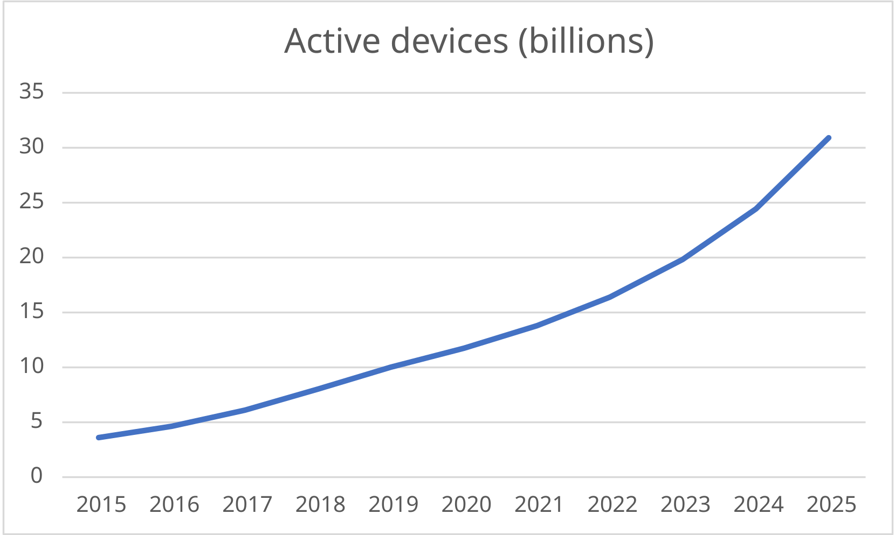

<!--
CO_OP_TRANSLATOR_METADATA:
{
  "original_hash": "9bae08314d8487cb76ddf3d8797e1544",
  "translation_date": "2026-01-07T02:49:26+00:00",
  "source_file": "1-getting-started/lessons/1-introduction-to-iot/README.md",
  "language_code": "ml"
}
-->
# IoT പരിചയം

> സ്‌കെച്ച്നോട്ട് [Nitya Narasimhan](https://github.com/nitya) നിർമിച്ചത്. വലുതായ പതിപ്പ് കാണുവാൻ ചിത്രം ക്ലിക്ക് ചെയ്യുക.

ഈ പാഠം [Microsoft Reactor](https://developer.microsoft.com/reactor/?WT.mc_id=academic-17441-jabenn) നിന്നുള്ള [Hello IoT സീരീസിന്റെ](https://youtube.com/playlist?list=PLmsFUfdnGr3xRts0TIwyaHyQuHaNQcb6-) ഭാഗമായി പഠിപ്പിച്ചിരുന്നു. ഒരു 1 മണിക്കൂർ പാഠവും 1 മണിക്കൂർ ഓഫീസ് മണിക്കൂറും ഉൾപ്പെടുന്ന രണ്ടു വീഡിയോകളായി പാഠം നൽകിയിരുന്നു, കൂടാതെ പാഠത്തിന്റെ ചില ഭാഗങ്ങളിൽ കൂടുതൽ വിശദമായി ചർച്ചയും ചോദ്യേ답നങ്ങളുമുണ്ടായിരുന്നു.

> 🎥 വീഡിയോ കാണുന്നതിന് മീതെ ചിത്രങ്ങൾ ക്ലിക്ക് ചെയ്യുക

## പ്രീ-ലെക്ചർ ക്വിസ്

[പ്രീ-ലെക്ചർ ക്വിസ്](https://black-meadow-040d15503.1.azurestaticapps.net/quiz/1)

## പരിചയം

ഇ പാഠം ഇന്റർനെറ്റ് ഓഫ് തിങ്സുമായി ബന്ധപ്പെട്ട ചില പ്രാഥമിക വിഷയങ്ങളെക്കുറിച്ചും നിങ്ങളുടെ ഹാർഡ്‌വെയർ ക്രമീകരണം ആരംഭിക്കുവാനുള്ള മാർഗ്ഗങ്ങളും ഉൾക്കൊള്ളുന്നു.

ഈ പാഠത്തിൽ നാം താഴെ പറയുന്നവ കാണാനാകുന്നതാണ്:

* [‘Internet of Things’ എന്നത് എന്ത്?](../../../../../1-getting-started/lessons/1-introduction-to-iot)
* [IoT ഉപകരണങ്ങൾ](../../../../../1-getting-started/lessons/1-introduction-to-iot)
* [ഉപകരണ സെറ്റ് അപ്പ് ചെയ്യുക](../../../../../1-getting-started/lessons/1-introduction-to-iot)
* [IoT പ്രയോഗങ്ങൾ](../../../../../1-getting-started/lessons/1-introduction-to-iot)
* [നിങ്ങളുടെ ചുറ്റുപാട് ഉള്ള IoT ഉപകരണങ്ങളുടെ ഉദാഹരണങ്ങൾ](../../../../../1-getting-started/lessons/1-introduction-to-iot)

## 'Internet of Things' എന്താണ്?

‘Internet of Things’ എന്ന പദം 1999-ൽ [Kevin Ashton](https://wikipedia.org/wiki/Kevin_Ashton) നിർമിച്ചത്, സෙන්സറുകൾ വഴി ഇന്റർനെറ്റ് പ്രകൃതി ലോകവുമായി ബന്ധിപ്പിക്കുന്നതിന്. പിന്നീട്, ഈ പദം ഏതൊരു ഉപകരണം, പരിസ്ഥിതിയിൽ നിന്നുള്ള ഡാറ്റ ശേഖരിക്കുകയോ ആക്ടുവേറ്ററുകൾ വഴി യാഥാർത്ഥ്യ ലോകത്തിൽ ഇടപെടുകയോ ചെയ്യുന്ന ഉപകരണത്തെ സൂചിപ്പിക്കാൻ ഉപയോഗിച്ചു, സാധാരണയായി വേറിട്ട ഉപകരണങ്ങളോ ഇന്റർനെറ്റോ ബന്ധിപ്പിച്ചിരിക്കുന്നു.

> **സെൻസറുകൾ** വേഗം, താപനില, സ്ഥാനം തുടങ്ങിയ വിവരങ്ങൾ ശേഖരിക്കുന്നു.
>
> **ആക്ടുവേറ്ററുകൾ** വൈദ്യുതസിഗ്നൽ യഥാർത്ഥ ഇടപെടലുകളായി മാറ്റുന്നു, ഉദാ: സ്വിച്ച് ഓണാക്കൽ, ലൈറ്റുകൾ തെളിയിക്കൽ, ശബ്ദം ഉൽപാദിപ്പിക്കൽ, അല്ലെങ്കിൽ മറ്റ് ഹാർഡ്‌വെയറിലേക്ക് നിയന്ത്രണസിഗ്നലുകൾ അയക്കൽ.

IoT സാങ്കേതിക മേഖല ഉപകരണങ്ങളേക്കാൾ കൂടുതൽ കാര്യങ്ങളാണ് ഉൾപ്പെടുന്നത് - സെൻസർ ഡാറ്റ പ്രോസസ് ചെയ്യുന്ന ക്ലൗഡ്-അടിസ്ഥാന സേവനങ്ങളും, ആക്ടുവേറ്ററുകളിലേക്ക് അഭ്യർത്ഥനകൾ അയക്കുന്നതും ഉൾപ്പെടുന്നു. കൂടാതെ, ഇന്റർനെറ്റ് കണക്ടിവിറ്റി ആവശ്യമായില്ലാത്ത എഡ്ജ് ഉപകരണങ്ങൾക്കും ഇത് ബാധകമാണ്. ഇവ സെൻസർ ഡാറ്റ തന്നെ പ്രോസസ് ചെയ്ത് പ്രതികരിക്കാനാകും, സാധാരണയായി ക്ലൗഡിൽ പരിശീലിപ്പിച്ച AI മോഡലുകൾ ഉപയോഗിച്ച്.

IoT ഒരു വേഗത്തിൽ വളരുന്ന സാങ്കേതിക മേഖലയാണ്. 2020-ന അവസാനം പരമാപ്തിയോടെ 30 ബില്യൺ IoT ഉപകരണങ്ങൾ ഇന്റർനെറ്റിൽ ബന്ധിപ്പിച്ചതാണെന്നാണ് കണക്കാക്കുന്നത്. ഭാവിയിൽ, 2025-നുള്ളിലായി IoT ഉപകരണങ്ങൾ ഏകദേശം 80 സെറ്റ്ബൈറ്റ് അല്ലെങ്കിൽ 80 ട്രില്യൺ ഗിഗാബൈറ്റ് ഡാറ്റ ശേഖരിക്കാനാകുമെന്ന് കണക്കാക്കിയിട്ടുണ്ട്. അത് വളരെ വലിയ ഡാറ്റയാണ്!

✅ ചെറിയൊരു ഗവേഷണം നടത്തൂ: IoT ഉപകരണങ്ങൾ സൃഷ്ടിക്കുന്ന ഡാറ്റയിൽ എത്രത്തോളം ഉപയോഗത്തിലാകും, എത്രം വേണ്ടവിധം കളയപ്പെടുന്നു? എന്തുകൊണ്ടാണ് ഇത്രയധികം ഡാറ്റ അവഗണിക്കുന്നത്?

ഈ ഡാറ്റയാണ് IoTയുടെ വിജയത്തിന് കീഴടക്കാം. വിജയകരമായ IoT ഡെവലപ്പർ ആകാൻ, നിങ്ങൾക്ക് ശേഖരിക്കേണ്ട ഡാറ്റയെ മനസ്സിലാക്കണം, അതിനെ എങ്ങനെ ശേഖരിക്കാം എന്നും, അതിനെ അടിസ്ഥാനമാക്കി എങ്ങനെ തീരുമാനം എടുക്കണം എന്നും, ആ തീരുമാനങ്ങൾ ഉപയോഗിച്ച് യഥാർത്ഥ ലോകത്തിൽ എങ്ങനെ ഇടപെടാമെന്ന് അറിയേണ്ടതാണ്.

## IoT ഉപകരണങ്ങൾ

IoT-യിൽ T എന്നത് **Things** (വസ്തുക്കൾ) എന്നാണ് - ചുറ്റുപാടിലുള്ള യഥാർത്ഥ ലോകവുമായി ബന്ധപ്പെടുന്ന ഉപകരണങ്ങൾ, സെൻസറുകളിൽ നിന്ന് ഡാറ്റ ശേഖരിക്കുകയോ ആക്ടുവേറ്ററുകൾ മുഖേന യാഥാർത്ഥ്യ ഇടപെടലുകൾ നൽകുകയോ ചെയ്യുന്നു.

ഉത്പാദനത്തിനോ വ്യവസായ ഉപയോഗത്തിനോ വേണ്ടി രൂപകൽപ്പന ചെയ്ത ഉപകരണങ്ങൾ, ഉദാ. ഉപഭോക്തൃ ഫിറ്റ്‌നസ് ട്രാക്കറുകൾ അല്ലെങ്കിൽ വ്യവസായ മെഷീൻ കൺട്രോൾറുകൾ, സാധാരണയായി കസ്റ്റമൈസ്ഡ് വർക്‌സ് ചെയ്യുന്നു. അവ കസ്റ്റം സર્ક്യൂട്ട് ബോർഡുകൾ, ചിലപ്പോൾ കസ്റ്റം പ്രോസസറുകൾ ഉപയോഗിക്കുന്നു, ചെറിയ വലുപ്പത്തിൽ അല്ലെങ്കിൽ ഉയർന്ന താപനില, മികപ്പെടൽ, കംപനം ഉള്ള ഫാക്ടറികളിൽ ഉപയോഗിക്കാൻ അനുയോജ്യമായി രൂപകൽപ്പന ചെയ്തവ ആയിരിക്കും.

IoT പഠിക്കുന്നതോ പ്രോട്ടോ ടൈപ്പ് വികസിപ്പിക്കുവാനോ നിങ്ങൾ ഡെവലപ്പറായെങ്കിൽ, സുരക്ഷിതമായി ഒരു ഡെവലപ്പർ കിറ്റ് ഉപയോഗിച്ച് തുടങ്ങണം. ഇത് പൊതുവായി വികസിപ്പിച്ച് ഉപഭോക്താക്കൾക്ക് നൽകുന്ന ഉപകരണങ്ങളേക്കാൾ വികാസകർക്കിന് പ്രത്യേകം സവിശേഷതകളോടെ രൂപകൽപ്പന ചെയ്ത IoT ഉപകരണങ്ങളാണ്, ഉദാ: സെൻസറുകൾ അഥവാ ആക്ടുവേറ്ററുകൾ കണക്ട് ചെയ്യുവാൻ ഉള്ള പിനുകൾ, ഡീബഗ്ഗിംഗിന് സഹായകമായ ഹാർഡ്‌വെയർ, അല്ലെങ്കിൽ വിലയേറിയ ഉപകരണങ്ങൾ.

ഇവ രണ്ടായി വേർതിരിച്ചുകാണാം - മൈക്രോകൺട്രോളറുകൾ (MCU) ഉപയോഗിക്കുന്നവയും single-board കമ്പ്യൂട്ടറുകൾ ഉപയോഗിക്കുന്നവയും. ഇവ ഇവിടെ പരിചയപ്പെടും, അടുത്ത പാഠത്തിൽ കൂടുതൽ വിശദീകരിക്കും.

> 💁 നിങ്ങളുടെ ഫോൺ പോലും ഒരു പൊതുവായ IoT ഉപകരണമായി കണക്കാക്കാം, സെൻസറുകളും ആക്ടുവേറ്ററുകളും ഉൾക്കൊള്ളുന്നതും വിവിധ ആപ്ലിക്കേഷനുകൾ വ്യത്യസ്ത ക്ലൗഡ് സേവന ങ്ങളുമായി ഉപയോഗിക്കുന്നതുമായിരിക്കും. ചില IoT പഠനങ്ങൾ ഫോണിന്റെ ആപ്പുകൾ ഉപയോഗിച്ച് ഉപകരണമായി പഠിപ്പിക്കാറുണ്ട്.

### മൈക്രോകൺട്രോളറുകൾ

മൈക്രോകൺട്രോളർ (MCU എന്ന പേരിൽ അറിയപ്പെടും) ഒരു ചെറുവശമുള്ള കമ്പ്യൂട്ടറാണ്:

🧠 ഒരോ കൂടുതൽ സെന്റ്രൽ പ്രോസസിംഗ് യൂണിറ്റുകൾ (CPU) – നിങ്ങളുടെ പ്രോഗ്രാം ચલിക്കുന്ന മസ്തിഷ്‌കം

💾 മെമ്മറി (RAM, പ്രോഗ്രാം മെമ്മറി) – പ്രോഗ്രാം, ഡാറ്റാ, വേരിയബിളുകൾ സൂക്ഷിക്കുന്ന സ്ഥലം

🔌 പ്രോഗ്രാമബിൾ ഇൻപുട്ട്/ഔട്ട്‌പുട്ട് (I/O) കണക്ഷനുകൾ – സെൻസറുകളോ ആക്ടുവേറ്ററുകളോ പോലുള്ള പുറത്തുള്ള ഉപകരണങ്ങൾക്കൊപ്പം കൂടിക്കാഴ്ച നടത്താൻ

മൈക്രോകൺട്രോളറുകൾ സാധാരണയായി കുറഞ്ഞ വിലയുള്ള കംപ്യൂട്ടിംഗ് ഉപകരണങ്ങളാണ്, കസ്റ്റം ഹാർഡ്‌വെയറിൽ ഉപയോഗിക്കുന്നവയുടെ സാധാരണ വില US$0.50 ആണ്, ചിലത് US$0.03 വരെ വില കുറഞ്ഞിരിക്കുന്നു. ഡെവലപ്പർ കിറ്റ് സാധാരണ US$4 മുതൽ ആരംഭിച്ച്, അധിക സവിശേഷതകൾ ചേർത്താൽ ചെലവ് കൂടും. [Seeed studios](https://www.seeedstudio.com) ന്റെ [Wio Terminal](https://www.seeedstudio.com/Wio-Terminal-p-4509.html) എന്നും അറിയപ്പെടുന്ന ഈ ഡെവലപ്പർ കിറ്റ് സെൻസറുകളും ആക്ടുവേറ്ററുകളും, WiFi, സ്ക്രീൻ എന്നിവയോടു കൂടിയതാണ്, വിലക്ക് ഏകദേശം US$30 ആണ്.

> 💁 MCU എന്നത് സെർച്ച് ചെയ്യുമ്പോൾ Marvel Cinematic Universe-യുടെ ഫലങ്ങൾ കൂടി വരാനുള്ള സാധ്യത ഉണ്ടെന്നു ജാഗ്രത പുലർത്തുക.

മൈക്രോകൺട്രോളറുകൾ വളരെ നിഷ്‌ചിതമായ задан ഫങ്‌സനുകൾ നടത്താൻ രൂപകൽപ്പന ചെയ്തിരിക്കുന്നു, PC-കളോ Macs-യോ പോലെ സാധാരണ കംപ്യൂട്ടറുകളല്ല. സാധാരണയായി, മോണിറ്റർ, കീസ്, മൗസ് എന്നിവ കണക്ട് ചെയ്ത് ഉപയോഗിക്കാൻ കഴിയില്ല.

മൈക്രോകൺട്രോളർ ഡെവലപ്പർ കിറ്റ് സാധാരണ അധിക സെൻസറുകൾ, ആക്ടുവേറ്ററുകൾ ഉൾക്കൊള്ളും. പല ബോർഡുകളിലും ഒരു അല്ലെങ്കിൽ കൂടുതൽ പ്രോഗ്രാമബിള്‍ LED-കൾ ഉണ്ടാകും. ചില ബോർഡുകളിൽ ബ്ലൂടൂത്ത്, WiFi തുടങ്ങിയ വയർലെസ് ബന്ധം ഉൾച്ചേർന്നിരിക്കും, അല്ലെങ്കിൽ കണക്ഷൻ കൂട്ടാൻ കൂടിയ മറ്റ് മൈക്രോകൺട്രോളറുകൾ ഉണ്ടാകാം.

> 💁 മൈക്രോകൺട്രോളറുകൾ സാധാരണയായി C/C++ ഭാഷയിൽ പ്രോഗ്രാം ചെയ്യപ്പെടുന്നു.

### സിംഗിൾ-ബോർഡ് കമ്പ്യൂട്ടറുകൾ

സിംഗിൾ-ബോർഡ് കമ്പ്യൂട്ടർ (SBC) എന്ന് പറയുന്നത്, എല്ലാ ഘടകങ്ങളും (CPU, മെമ്മറി, ഇൻപുട്ട് ഔട്ട്പുട്ട് പിനുകൾ മുതലായവ) ഒരു ചെറു ബോർഡിൽ ഉൾക്കൊള്ളുന്ന ചെറിയ കംപ്യൂട്ടർ ആണ്. പിസി, ലാപ്‌ടോപ്പ്, മാക് പോലുള്ള മുഴുവൻ ഓപ്പറേറ്റിങ് സിസ്റ്റവും അടങ്ങിയിട്ടുള്ള, പക്ഷേ ചെറുതും ശക്തി കുറഞ്ഞതുമായ, വില കുറഞ്ഞ ഉപകരണങ്ങളാണ്.

Raspberry Pi ഏറ്റവും പ്രശസ്തമായ Single-board കംപ്യൂട്ടറുകളിലൊന്നാണ്.

മൈക്രോകൺട്രോളറിനെ പോലെയാണെങ്കിലും, ഇവയിൽ ഗ്രാഫിക്‌സ് ചിപ്, മോണിറ്റർ കണക്ടർ, ഓഡിയോ ഔട്ട്‌പുട്ടുകൾ, കീബോർഡ്, മൗസ്, വെബ്‌കാമുകൾ പോലുള്ള USB ഉപകരണങ്ങൾ കണക്ട് ചെയ്യാനുള്ള USB പോർട്ടുകൾ തുടങ്ങിയ അധിക സവിശേഷതകളും ഉണ്ടാകുന്നു. പ്രോഗ്രാമുകൾ SD കാർഡ്, ഹാർഡ് ഡ്രൈവ് എന്നിവയിൽ സൂക്ഷിക്കുന്നു, ബോർഡിനകത്തുള്ള മെമ്മറി ചിപ്പ് അല്ല.

> 🎓 ഇത് വായിക്കുകയുള്ള PC അല്ലെങ്കിൽ Mac-ന്റെ ചെറുതും ഇക്കമാനമുള്ള പതിപ്പായി സിംഗിൾ-ബോർഡ് കമ്പ്യൂട്ടറിനെ നിങ്ങൾ കരുതാം, കൂടാതെ സെൻസറുകൾ, ആക്ടുവേറ്ററുകൾ എന്നിവയുമായി ഇടപെടാൻ GPIO (ജനറൽ-പർപ്പസ് ഇൻപുട്ട്/ഔട്ട്‌പുട്ട്) പിനുകൾ ഉണ്ട്.

സിംഗിൾ-ബോർഡ് കംപ്യൂട്ടറുകൾ പൂർണ്ണമായും ഫീച്ചർ സമ്പന്നമായ കംപ്യൂട്ടറുകളായതിനാൽ ഏത് പ്രോഗ്രാമിംഗ് ഭാഷയിൽയും ഉപയോഗിക്കാവുന്നതാണ്. IoT ഉപകരണങ്ങൾ സാധാരണയായി Python-ൽ പ്രോഗ്രാം ചെയ്യപ്പെടുന്നു.

### ശേഷിച്ച പാഠങ്ങൾക്ക് ഹാർഡ്‌വെയർ തിരഞ്ഞെടുക്കൽ

ശേഷിക്കുന്ന എല്ലാ പാഠങ്ങ ളിലും, IoT ഉപകരണങ്ങൾ ഉപയോഗിച്ച് യഥാർത്ഥ ലോകവുമായി ഇടപെടുകയും ക്ലൗഡുമായി സംവദിക്കുകയും ചെയ്യുന്ന അസൈൻമെന്റുകൾ അടങ്ങിയിരിക്കും. ഓരോ പാഠത്തിലും മൂന്ന് ഉപകരണ തിരഞ്ഞെടുപ്പ് പിന്തുണയുണ്ട് - Arduino (Seeed Studios Wio Terminal ഉപയോഗിച്ച്), അല്ലെങ്കിൽ സിംഗിൾ-ബോർഡ് കമ്പ്യൂട്ടർ, ഫിസിക്കൽ ഉപകരണം (Raspberry Pi 4) അല്ലെങ്കിൽ നിങ്ങളുടെ പിസി/മാക്-ൽ ഓടുന്ന വിർച്ച്വൽ സിംഗിൾ-ബോർഡ് കമ്പ്യൂട്ടർ.

അസൈൻമെന്റുകൾ പൂർത്തിയാക്കാനാവശ്യമായ ഹാർഡ്‌വെയറുകൾക്കുറിച്ച് ഇതിനകം [hardware guide](../../../hardware.md) ൽ വായിക്കാം.

> 💁 അസൈൻമെന്റുകൾ പൂർത്തിയാക്കാൻ നിങ്ങൾക്ക് IoT ഹാർഡ്‌വെയർ വാങ്ങേണ്ടതില്ല, മുഴുവനും വിർച്ച്വൽ സിംഗിൾ-ബോർഡ് കമ്പ്യൂട്ടർ ഉപയോഗിച്ച് ചെയ്യാം.

എന്ത് ഹാർഡ്‌വെയർ തിരഞ്ഞെടുക്കേണ്ടതാണോ അതത് നിങ്ങളുടെ തിരഞ്ഞെടുപ്പാണ് - അത് നിങ്ങൾക്ക് വീടിലും സ്കൂളിലും ലഭ്യമായുള്ളതിൽ ആശ്രയിച്ചിരിക്കും, കൂടാതെ നിങ്ങൾ അറിയുന്ന അല്ലെങ്കിൽ പഠിക്കാനുദ്ദേശിക്കുന്ന പ്രോഗ്രാമിംഗ് ഭാഷയിലും ആശ്രയിക്കും. രണ്ടുവരുടെയും സെൻസർ ഇക്കോസിസ്റ്റം ഒരുപോലെയാണ്, അതിനാൽ ഒരിടത്തുനിന്നും തുടക്കം കഴിഞ്ഞാൽ ബാക്കി കിറ്റ് മാറ്റാതെ മറ്റൊരു വഴിയിലേക്ക് മാറാം. വിർച്ച്വൽ സിംഗിൾ-ബോർഡ് കമ്പ്യൂട്ടർ Raspberry Pi-യിൽ പഠനം നടത്തുന്നതിന്റെ സമാനമാണ്, പിന്നീട് പൈ വാങ്ങിയാൽ അതിലെ ഒരു വലിയ പ്രോഗ്രാമിന്റെ നിർവചനവും പിന്‌വലക്കുന്നതുമായ പല കോഡുകളും ഉപയോഗിക്കാവുന്നതാകും.

### Arduino ഡെവലപ്പർ കിറ്റ്

മൈക്രോകൺട്രോളർ വികസനത്തിൽ താൽപര്യമുണ്ടെങ്കിൽ, അസൈൻമെന്റുകൾ Arduino ഉപകരണം ഉപയോഗിച്ച് പൂർത്തിയാക്കാം. C/C++ പ്രോഗ്രാമിംഗ് അടിസ്ഥാന ധാരണ വേണം, കാരണം പാഠങ്ങൾ Arduino ഫ്രെയിംവർക്ക്, ഉപയോഗിക്കുന്ന സെൻസറുകൾ, ആക്ടുവേറ്ററുകൾ, ക്ലൗഡുമായി ഇടപെടുന്ന ലൈബ്രറികൾ എന്നിവയ്ക്ക് മാത്രമേ ബാധകമായ കോഡ് പഠിപ്പിക്കൂ.

അസൈൻമെന്റുകൾ [Visual Studio Code](https://code.visualstudio.com/?WT.mc_id=academic-17441-jabenn) [PlatformIO extension for microcontroller development](https://platformio.org) ഉപയോഗിച്ച് പൂർത്തിയാക്കും. ഇതിൽ പരിചയമുള്ളവർക്ക് Arduino IDE ഉപയോഗിക്കാമെങ്കിലും അവർക്കു മാർഗ്ഗനിർദേശം നൽകുന്നില്ല.

### സിംഗിൾ-ബോർഡ് കമ്പ്യൂട്ടർ ഡെവലപ്പർ കിറ്റ്

സിംഗിൾ-ബോർഡ് കമ്പ്യൂട്ടറുകൾ ഉപയോഗിച്ച് IoT വികസനം പഠിക്കാൻ താൽപര്യമുണ്ടെങ്കിൽ, Raspberry Pi അല്ലെങ്കിൽ നിങ്ങളുടെ പിസി/മാക്-ൽ ഓടുന്ന വിർച്ച്വൽ ഉപകരണം ഉപയോഗിച്ച് അസൈൻമെന്റുകൾ പൂർത്തിയാക്കാം.

Python പ്രോഗ്രാമിംഗ് അടിസ്ഥാനത്തിലായ സേവനം ആവശ്യമാണ്, കാരണം പാഠങ്ങളിൽ സെൻസറുകൾ, ആക്ടുവേറ്ററുകൾ, ക്ലൗഡുമായി ഇടപെടുന്ന ലൈബ്രറികൾ ഉപയോഗിച്ചുള്ള കോഡ് മാത്രമേ പഠിപ്പിക്കൂ.

> 💁 Python കോഡ് പഠിക്കാൻ താല്പര്യമുണ്ടെങ്കില്‍ താഴെ പറയുന്ന രണ്ട് വീഡിയോ സീരിസ് പരിശോധിക്കുക:
>
> * [Python for beginners](https://channel9.msdn.com/Series/Intro-to-Python-Development?WT.mc_id=academic-17441-jabenn)
> * [More Python for beginners](https://channel9.msdn.com/Series/More-Python-for-Beginners?WT.mc_id=academic-7372-jabenn)

അസൈൻമെന്റുകൾ [Visual Studio Code](https://code.visualstudio.com/?WT.mc_id=academic-17441-jabenn) ഉപയോഗിക്കും.

Raspberry Pi ഉപയോഗിക്കുകയാണെങ്കിൽ, Pi-യെ ഒരു പൂർണ്ണ ഡെസ്ക്ടോപ്പ് പതിപ്പായ Raspberry Pi OS ഉപയോഗിച്ച് ഓടിക്കാം, അതിൽ തന്നെ എല്ലാ കോഡിങ്ങും VS Code (Raspberry Pi OS പതിപ്പ്) ഉപയോഗിച്ച് ചെയ്യാം, അല്ലെങ്കിൽ Piയെ ഹെഡ്ലസ് ഉപകരണമായി ഓടിച്ച്, പിസി/മാക്-ൽ നിന്നും VS Code-യുടെ [Remote SSH extension](https://code.visualstudio.com/docs/remote/ssh?WT.mc_id=academic-17441-jabenn) ഉപയോഗിച്ച് Pi-യിൽ നേരിട്ട് കോഡ് എഡിറ്റ്, ഡീബഗ്, റൺ ചെയ്യാം.

വിർച്ച്വൽ ഉപകരണം തിരഞ്ഞെടുക്കുന്നവർക്ക്, അവർ അവരുടെ കംപ്യൂട്ടറിൽ നേരിട്ട് കോഡ് ചെയ്യും. സെൻസറുകളും ആക്ടുവേറ്ററുകളും സിമുലേറ്റ് ചെയ്യുന്ന ഉപകരണം ഉപയോഗിച്ച്, നിങ്ങൾ നിർവ്വചിക്കുന്ന സെൻസർ മൂല്യങ്ങൾ പ്രദർശിപ്പിക്കുകയും ആക്ടുവേറ്ററുകളുടെ ഫലങ്ങൾ സ്ക്രീനിൽ കാണിക്കുകയും ചെയ്യും.

## നിങ്ങളുടെ ഉപകരണം സെറ്റ് അപ്പ് ചെയ്യുക

നിങ്ങളുടെ IoT ഉപകരണം പ്രോഗ്രാം ചെയ്യാൻ തുടങ്ങുന്നതിന് മുമ്പ്, ചെറിയ ക്രമീകരണങ്ങൾ വേണ്ടതാണ്. ഏത് ഉപകരണം ഉപയോഗിക്കുമെന്ന് ആശ്രയിച്ച് താഴെയുള്ള അനുയോജ്യമായ നിർദ്ദേശങ്ങൾ പാലിക്കുക.

> 💁 നിങ്ങൾക്ക് ഇപ്പോൾ ഉപകരണം ഇല്ലെങ്കിൽ [hardware guide](../../../hardware.md) നോക്കി ഉപകരണം തെരഞ്ഞെടുക്കാൻ സഹായം തേടാം, കൂടാതെ അധിക ഹാർഡ്‌വെയർ എന്ത് വാങ്ങേണ്ടതുണ്ട് എന്നും അറിയാം. എല്ലാ പ്രോജക്ടുകളും വിർച്ച്വൽ ഹാർഡ്‌വെയർ ഉപയോഗിച്ച് ചെയ്യാവുന്നതാണ്, അതിനാൽ വാങ്ങേണ്ടതില്ല.

ഇന്നസ്ട്രക്ഷനുകൾ ഹാർഡ്‌വെയർ അല്ലെങ്കിൽ ഉപകരണങ്ങൾ നിർമ്മിക്കുന്ന നിർമ്മാതാക്കൾ ഉള്ള മൂന്നാം പാര്ട്ടി വെബ്സൈറ്റുകളിലേക്കുള്ള ലിങ്കുകളും ഉൾക്കൊള്ളുന്നുണ്ട്. ഇതുകൊണ്ടാണ് നിങ്ങൾ എപ്പോഴും ഏറ്റവും പുതുമുഖ ഇൻസ്ട്രക്ഷനുകൾ ഉപയോഗിക്കുന്നതെന്ന് ഉറപ്പുവരുത്തുന്നത്.
നിങ്ങളുടെ ഉപകരണം സജ്ജമാക്കാനും 'Hello World' പ്രോജക്റ്റ് പൂർത്തിയാക്കാനും അനുയോജ്യമായ ഗൈഡ് വഴിപാടുകൾ പാലിക്കുക. ഈ പേര്‍റെ തുടക്കത്തിലെ നാല് പാഠങ്ങളിൽ IoT നൈറ്റ്ലൈറ്റ് സൃഷ്ടിക്കുന്നതിന് ആദ്യപടി ഇതാകും.

* [Arduino - Wio Terminal](wio-terminal.md)
* [Single-board computer - Raspberry Pi](pi.md)
* [Single-board computer - Virtual device](virtual-device.md)

✅ Arduinoക്കും സിംഗിൾ-ബോർഡ് കമ്പ്യൂട്ടർക്കും നിങ്ങൾ VS കോഡ് ഉപയോഗിക്കും. ഇത് മുമ്പ് ഉപയോഗിച്ചിട്ടില്ലെങ്കിൽ, [VS Code സൈറ്റ്](https://code.visualstudio.com?WT.mc_id=academic-17441-jabenn) ൽ കൂടുതൽ വായിക്കുക

## IoT യുടെ പ്രയോഗങ്ങൾ

IoT നിരവധി പ്രയോഗങ്ങൾ ഉൾക്കൊള്ളുന്നു, ചില വൻ വിഭാഗങ്ങളിൽ:

* കൺസ്യൂമർ IoT
* കൊമേഴ്സ്യൽ IoT
* ഇൻഡസ്ട്രിയൽ IoT
* ഇൻഫ്രാസ്ട്രക്ചർ IoT

✅ ചെറിയൊരു ഗവേഷണം നടത്തുക: താഴെ വിവരിച്ച പ്രദേശങ്ങളിൽ ഓരോന്നിലും, നൽകിയിട്ടുള്ളവയിൽ നിന്നും വേറെ ഒരു സ്പഷ്ടമായ ഉദാഹരണം കണ്ടെത്തുക.

### കൺസ്യൂമർ IoT

കൺസ്യൂമർ IoT നടപ്പിലാക്കുന്നത് ഉപഭോക്താക്കൾ വീട്ടിൽ കച്ചകുടപ്പായി വാങ്ങുകയും ഉപയോഗിക്കുകയും ചെയ്യുന്ന IoT ഉപകരണങ്ങളെയാണ് സൂചിപ്പിക്കുന്നത്. ചില ഉപകരണങ്ങൾ വളരെ ഉപകാരപ്രദമാണ്, ഉദാഹരണത്തിന് स्मार्ट സ്പീക്കറുകൾ, സ്പാർദ്ധിത ഹീറ്റിംഗ് സിസ്റ്റങ്ങൾ, റോബോട്ടിക് വാക്യം ക്ലീനറുകൾ. മറ്റ് ചില ഉപകരണങ്ങളുടെയും ഉപയോഗത്തിന് സംശയമുണ്ട്, ഉദാഹരണത്തിന് ശബ്ദ നിയന്ത്രണമുള്ള ടാപ്പുകൾ, അവയുടെ ശബ്‌ദം കടന്നുപോകുമ്പോൾ അവയെ നിർത്താൻ കഴിയാത്തവ.

കൺസ്യൂമർ IoT ഉപകരണങ്ങൾ പരിസരത്തോട് കൂടുതൽ ഫലം നേടാൻ മനുഷ്യരെ സാധ്യമാക്കുന്നു, പ്രത്യേകിച്ച് 1 ബില്യൺ പേരെ ബാധിക്കുന്ന അശക്തരായവർക്ക്. ചലനശേഷി കുറവുള്ളവർക്ക് റോബോട്ടിക് വാക്യംക്ലീനറുകൾ ശുചിത്വം ഉറപ്പാക്കുന്നു, കാഴ്ചക്കുറവുള്ളവർക്കും മോട്ടോർ നിയന്ത്രണം കുറവുള്ളവർക്കും ശബ്‌ദ നിയന്ത്രിത ഊണിടൽ കുക്കറുകൾ ഉപയോഗപ്പെടുത്താം, ആരോഗ്യ നിരീക്ഷണ ഉപകരണങ്ങൾ രോഗികൾക്ക് അവരുടെ അവസ്ഥകൾ കൂടുതൽ നിരന്തരം വിശദമായി നിരീക്ഷിക്കാനാകും. ഇവ ഉപകരണങ്ങൾ ഇചരിത്രമാക്കുമ്പോൾ ചെറിയ കുട്ടികളും ഇവ ഉപയോഗിക്കുന്നു, ഉദാഹരണത്തിന് COVID മഹാമാരി സമയത്ത് വിദ്യാർത്ഥികൾ വീട്ടിൽ നിന്ന് പഠിച്ച് സ്കൂൾ ജോലികൾ ട്രാക്ക് ചെയ്യാൻ ഓൺലൈൻ ഹോം ഡിവൈസുകളിൽ ടൈമറുകൾ സെറ്റ് ചെയ്‌തു, അല്ലെങ്കിൽ ക്ലാസ് മീറ്റിംഗുകൾക്ക് അലെർമുകൾ.

✅ നിങ്ങളുടെ കൈയിലോ വീട്ടിലോ ഉള്ള കൺസ്യൂമർ IoT ഉപകരണങ്ങൾ ഏതാണ്?

### കൊമേഴ്സ്യൽ IoT

കൊമേഴ്സ്യൽ IoT ജോലി സ്ഥലങ്ങളിൽ IoT ഉപകരണങ്ങൾ ഉപയോഗിക്കുന്നതാണ്. ഓഫീസുകളിൽ പ്രഭാഷണ സെൻസറുകൾ, മോഷൻ ഡിറ്റക്ടറുകൾ ഉപയോഗിച്ച് ലൈറ്റുകളും ഹീറ്റിംഗും മാനജ് ചെയ്യുമ്പോൾ ലൈറ്റുകളും ചൂടും ആവശ്യമില്ലാത്ത സമയത്ത് ഓഫാക്കാൻ ഇടം നേടും, ചെലവ്, കാർബൺ ഉത്സർജനവും കുറയും. ഫാക്ടറികളിൽ, ജീവനക്കാർ ഹാർഡ് ഹാട്സ് ധരിക്കാത്തതുപോലെ സുരക്ഷാ അപകടങ്ങൾ കണ്ടെത്താനുള്ള IoT ഉപകരണങ്ങൾ ഉപയോഗിക്കാം, അഥവാ ശബ്ദം അപകടപരമായ ലെവലാകുമ്പോൾ. റീട്ടെയ്ലിൽ, ഐറ്റം തണുത്ത സംഭരണത്തിന്റെ താപനില പരിപാലിക്കുന്നു, ഫ്രിഡ്ജ് അല്ലെങ്കിൽ ഫ്രിസർ ആവശ്യമായ താപനില പരിധിയിൽ ഇല്ലെങ്കിൽ ഉടമക്ക് അറിയിക്കുന്നു, അല്ലെങ്കിൽ ഷെൽഫുകളിലെ സാധനങ്ങൾ നിരീക്ഷിച്ച് വിൽക്കപ്പെട്ട ഉൽപ്പന്നങ്ങൾ പുനപൂരിപ്പിക്കാൻ ജീവനക്കാരെ കൈമാറുന്നു. ഗതാഗതവ്യവസായം വാഹന സ്ഥാനം നിരീക്ഷിക്കാൻ, റോഡ് ഉപഭോക്തൃ ചാർജിംഗിനായി റോഡ് മൈൽട്രാക്ക് ചെയ്യാൻ, ഡ്രൈവർ മണിക്കൂറുകളും ബ്രേക്കുകൾ പാലിക്കുന്നുണ്ടോ എന്ന് സൂക്ഷ്മമായി കണ്ടെത്താനും, വാഹനങ്ങൾ ഡെപ്പോയിൽ എത്തുമ്പോൾ ജീവനക്കാർക്ക് അറിയിപ്പു നൽകാനും കൂടുതൽ ആശ്രയിച്ചിരിക്കുന്നു.

✅ നിങ്ങളുടെ സ്കൂളിലും ജോലി സ്ഥലത്തും ഉള്ള കൊമേഴ്സ്യൽ IoT ഉപകരണങ്ങൾ ഏതാണ്?

### ഇൻഡസ്ട്രിയൽ IoT (IIoT)

ഇൻഡസ്ട്രിയൽ IoT, IIoT എന്ന് വിളിക്കുന്നത്, യന്ത്രങ്ങൾ വലിയ തോതിൽ നിയന്ത്രിക്കാൻ IoT ഉപകരണങ്ങൾ ഉപയോഗിക്കുന്നതാണ്. ഇത് ഫാക്ടറികളിലും ഡിജിറ്റൽ കൃഷിയിലും വ്യാപകമുണ്ട്.

ഫാക്ടറികളിൽ വിവിധ സെൻസറുകൾ ഉപയോഗിച്ച് യന്ത്രങ്ങളുടെ താപനില, കമ്പനം, പരിക്രമണ വേഗം എന്നിവ നിരീക്ഷിക്കുന്നു. ഈ ഡാറ്റ മനസിലാക്കി യന്ത്രം അനുവദിക്കുന്ന പരിധിക്കപ്പുറത്തേക്ക് പോയാൽ അത് നിർത്താം - ഉദാഹരണത്തിന് അതിവേഗം ചൂടാകാൻ തുടങ്ങി എഞ്ചിനീയറിങ്ങിന് നിർത്തി വയ്ക്കാം. ഈ ഡാറ്റ കാലയളവിൽ ശേഖരിച്ചും വിശകലനം ചെയ്തും ഭാവി നിർമാണത്തിന് predictive maintenance നടത്താം, ഏआई മോഡലുകൾ പ്രശ്നത്തിന്റെ മുമ്പ് ഡാറ്റ പരിശോധിച്ച് മറ്റ് പ്രശ്നങ്ങൾ പ്രവചിക്കും.

ഡിജിറ്റൽ കൃഷി, സ്ഥാപിത ജനസംഖ്യയെ പോഷിപ്പിക്കാൻ പ്രധാനമാണ്, പ്രത്യേകിച്ച് [subsistence farming](https://wikipedia.org/wiki/Subsistence_agriculture) അധിഷ്ഠിത 2 ബില്യൺ ആളുകളും 500 മില്യൺ വീടുകൾ കൂടിയ കുടുംബങ്ങളും. ഡിജിറ്റൽ കൃഷി ചെറിയ ചില ഡോളർ-വില സെൻസറുകളിൽ നിന്നും വൻ കൊമേഴ്സ്യൽ സംവിധാനങ്ങളിലേക്കുള്ള പരിസരം. താപനില നിരീക്ഷിച്ച് [growing degree days](https://wikipedia.org/wiki/Growing_degree-day) ഉപയോഗിച്ച് വിളവെടുപ്പ് സമയത്തെ പ്രവചിക്കാം. മണ്ണിലെ ഈർപ്പം നിരീക്ഷിച്ച് ഓട്ടോമേറ്റഡ് പോവൽ സംവിധാനങ്ങൾ കൃഷിയ്ക്ക് ആവശ്യമായ മാത്രം വെള്ളം കൊടുക്കുന്നു, അതിനപ്പുറം വെള്ളം അനാവശ്യമായി ചെലവഴിക്കാതിരിക്കാൻ. കർഷകർ ഡ്രോണുകളും സാറ്റലൈറ്റ് ഡാറ്റയും എഐയും ഉപയോഗിച്ച് കൃഷിരീതി, രോഗനിര പ്രതിരോധം, മണ്ണ് ഗുണമേന്മ തുടങ്ങിയവ വലിയ സ്ഥലങ്ങളിൽ നിരീക്ഷിക്കുന്നു.

✅ മറ്റേതെല്ലാം IoT ഉപകരണങ്ങൾ കർഷകർക്ക് സഹായകരമാകാം?

### ഇൻഫ്രാസ്ട്രക്ചർ IoT

ഇൻഫ്രാസ്ട്രക്ചർ IoT ആളുകൾ ദിവസേന ഉപയോഗിക്കുന്ന പ്രാദേശികവും ആഗോളവുമായ അടിസ്ഥാന സൗകര്യങ്ങൾ നിരീക്ഷിച്ചും നിയന്ത്രിച്ചും നടത്തുന്നു.

[Smart Cities](https://wikipedia.org/wiki/Smart_city) നഗര പ്രദേശങ്ങൾ ആണ്, ഇവിടെ IoT ഉപകരണങ്ങൾ നഗരം കുറിച്ചുള്ള ഡാറ്റ ശേഖരിച്ച് നഗരം മെച്ചപ്പെടുത്താൻ സഹായിക്കുന്നു. ഈ നഗരങ്ങൾ സാധാരണയായി പ്രാദേശിക സർക്കാരുകൾ, അക്കാദമിയ, പ്രാദേശിക ബിസിനസ്സുകൾ എന്നിവരുടെ സഹകരണത്തോടെ പ്രവർത്തിക്കുന്നു, ഗതാഗതം, പാർക്കിംഗ്, മലിനീകരണം തുടങ്ങിയ മേഖലകൾ മനസ്സിലാക്കി മാനേജ് ചെയ്യുന്നു. ഉദാഹരണത്തിന്, ഡെൻമാർക്കിലെ കോപ്പൺഹേഗൻ നഗരത്തിൽ സ്വദേശികൾക്ക് വായു മലിനീകരണം പ്രധാനമാണ്, അതിനാൽ ഇത് അളന്ന് ശുചിത്വമുള്ള സൈക്ലിംഗ്, ജോഗിംഗ് വഴികൾക്ക് സ്ഥാനം നൽകുന്നു.

[Smart power grids](https://wikipedia.org/wiki/Smart_grid) വ്യക്തിഗത വീടുകളിൽ തന്നെ വൈദ്യുതി ഉപയോഗത്തിന്റെ ഡാറ്റ ശേഖരിച്ച് വൈദ്യുതി ആവശ്യകതയുടെ മെച്ചപ്പെട്ട വിശകലനം സാധ്യമാക്കുന്നു. ഈ ഡാറ്റ രാജ്യാന്തരനിരീക്ഷണങ്ങൾക്കും, പുതിയ വൈദ്യുതി ഉൽപ്പാദന കേന്ദ്രങ്ങൾ എവിടെയുണ്ടാക്കണം എന്ന തീരുമാനത്തിനും സഹായിക്കുന്നു, കൂടാതെ വ്യക്തിഗത ടിമിൽ ഉപയോക്താക്കൾക്ക് എത്ര വൈദ്യുതി ഉപയോഗിക്കുന്നു, എപ്പോൾ ഉപയോഗിക്കുന്നു, ചെലവ് കുറയ്ക്കാനായുള്ള നിർദ്ദേശങ്ങളും നൽകുന്നു, ഉദാഹരണത്തിന് ഇലക്ട്രിക് കാർ രാത്രിയിൽ ചാർജിംഗ് ചെയ്യുക.

✅ നിങ്ങൾ താമസിക്കുന്ന സ്ഥലത്ത് IoT ഉപകരണങ്ങൾ ചേർക്കാൻ കഴിഞ്ഞാൽ എന്തൊക്കെ അളക്കാനാവുമെന്ന് തോന്നുന്നു?

## നിങ്ങളുടെ അടുത്തുള്ള IoT ഉപകരണങ്ങളുടെ ഉദാഹരണങ്ങൾ

നിങ്ങളുടെ ചുറ്റുപാടിൽ എത്ര IoT ഉപകരണങ്ങളാണെന്ന് ഞെട്ടിപ്പോകും. ഞാൻ ഇപ്പോൾ വീട്ടിൽ നിന്ന് എഴുതുമ്പോൾ എനിക്കും ഇന്റർനെറ്റിൽ ബന്ധിപ്പിച്ച് നിൽക്കുന്നവയാണ്, ആപ് നിയന്ത്രണം, ശബ്‌ദ നിയന്ത്രണം, ഫോൺ വഴിയുള്ള ഡാറ്റ അയക്കൽ എന്നീ സവിശേഷതകളോടെ ഇവ:

* അനേകം സ്മാർട്ട് സ്പീക്കറുകൾ
* ഫ്രിഡ്ജ്, ഡിഷ് വാഷർ, കുക്കർ, മൈക്രോവേവ്
* സോളാർ പാനൽ വൈദ്യുതി നിരീക്ഷകൻ
* സ്മാർട്ട് പ്ലഗുകൾ
* വീഡിയോ ഡോർബെൽ, സുരക്ഷാ ക്യാമറകൾ
* സ്മാർട്ട് താപനില നിയന്ത്രകൻ, നിരവധി സ്മാർട്ട് റൂം സെൻസറുകൾ
* ഗാരേജ് ഡോർ ഓപ്പണർ
* ഹോം എന്റർടൈൻമെന്റ് സിസ്റ്റങ്ങൾ, ശബ്‌ദ നിയന്ത്രിത ടിവികൾ
* ലൈറ്റുകൾ
* ഫിറ്റ്‌നസ്, ആരോഗ്യ ട്രാക്കറുകൾ

ഈ ഉപകരണങ്ങൾ എല്ലാമും സെൻസറുകളും/അക്ട്വേറ്ററുകളും ഉപയോഗിച്ച് ഇന്റർനെറ്റുമായി സംസാരിക്കുന്നു. ഫോൺ വഴി ഞാൻ കാണാൻ കഴിയും എന്റെ ഗാരേജ് ഡോർ തുറന്നിട്ടുണ്ടോ, സ്മാർട്ട് സ്പീക്കറിലൂടെ അത് അടയ്ക്കാൻ പറയാം. ടൈമർ സജ്ജീകരിച്ചിട്ടുണ്ടെങ്കിൽ രാത്രിയിൽ തുറന്നുവെങ്കിൽ ഓട്ടോമാറ്റിക്കായി അടയും. ഡോർബെൽ ഓടുമ്പോൾ ലോകത്തിന്റെ എവിടെ നിന്നോ ഫോൺ വഴി ആരാണെന്ന് അറിയാം, സ്‌പീക്കറും മൈക്രോഫോണും ഉപയോഗിച്ച് സംസാരിക്കാം. രക്തത്തിലെ ഗ്ലൂക്കോസും, ഹൃദയമിടിപ്പും, ഉറക്ക പാറ്റേണുകളും നിരീക്ഷിച്ച് ആരോഗ്യത്തിലെ മാറ്റങ്ങൾ കാണാം. ക്ലൗഡിലൂടെ ലൈറ്റുകൾ നിയന്ത്രിക്കാം, ഇന്റർനെറ്റ് പോയാൽ ഇരുട്ടിൽ ഇരിക്കും.

---

## 🚀 ചലഞ്ച്

വീട്ടിലും സ്കൂളിലും ജോലിയിടത്തും നിങ്ങള്ക്ക് തികച്ചും സുഖമുള്ള IoT ഉപകരണങ്ങൾ എത്രയും കൂടുതൽ തോന്നുന്നത് പട്ടികയിടുക - നിങ്ങൾ കരുതുന്നതിലും അതി കൂടുതലാകാം!

## ഉപദേശകശേഷം ക്വിസ്

[Post-lecture quiz](https://black-meadow-040d15503.1.azurestaticapps.net/quiz/2)

## അവലോകനം & സ്വയം പഠനം

കൺസ്യൂമർ IoT പദ്ധതികളുടെ ദോഷങ്ങളും ഗുണങ്ങളും വായിക്കൂ. സ്വകാര്യതാ പ്രശ്നങ്ങൾ, ഹാർഡ്വെയർ പ്രശ്നങ്ങൾ, ബന്ധം ലഭ്യമല്ലാത്തതിൽ ഉണ്ടാകുന്ന പിഴവുകൾ എന്നിങ്ങനെയുള്ളവ സംബന്ധിച്ച വാർത്താ ലേഖനങ്ങൾ പരിശോധിക്കുക.

ചില ഉദാഹരണങ്ങൾ:

* **[Internet of Sh*t](https://twitter.com/internetofshit)** എന്ന ട്വിറ്റർ അക്കൗണ്ടിൽ (അശുദ്ധ പദപ്രയോഗ മുന്നറിയിപ്പ്) കൺസ്യൂമർ IoT പരാജയങ്ങളുടെ നല്ല ഉദാഹരണങ്ങൾ കാണാം
* [c|net - My Apple Watch saved my life: 5 people share their stories](https://www.cnet.com/news/apple-watch-lifesaving-health-features-read-5-peoples-stories/)
* [c|net - ADT technician pleads guilty to spying on customer camera feeds for years](https://www.cnet.com/news/adt-home-security-technician-pleads-guilty-to-spying-on-customer-camera-feeds-for-years/) (trigger warning - അനധികൃത കാണാപ്പാടുകൾ)

## നിയോഗം

[Investigate an IoT project](assignment.md)

---

<!-- CO-OP TRANSLATOR DISCLAIMER START -->
**അസ്വീകാര്യം**:  
ഈ ഡോക്യുമെന്റ് AI വിവർത്തന സേവനമായ [Co-op Translator](https://github.com/Azure/co-op-translator) ഉപയോഗിച്ച് വിവർത്തനം ചെയ്‍തതാണ്. ഞങ്ങൾ കൃത്യതയ്ക്കായി പരിശ്രമിക്കുന്നുണ്ടെങ്കിലും, സ്വയംപരിഭാഷകൾ പിശകുകളോ അസാധുതകളോ ഉൾക്കൊണ്ടിരിക്കാമെന്നതു göz്ചിക്കേണ്ടതാണ്. അസൽ ഡോക്യുമെന്റ് ഇതിന്റെ നാട്ടു ഭാഷയിലുണ്ടായിരിക്കുന്നതാണ് അംഗീകൃത മാസ്റ്റർ ആയിരിക്കുക. നിർണായക വിവരങ്ങൾക്കായി പ്രൊഫഷണൽ മാനുഷിക വിവർത്തനം ശുപാർശ ചെയ്യുന്നു. ഈ വിവർത്തനം ഉപയോഗിക്കുന്നതിൽ നിന്ന് ഉണ്ടായിരിക്കുന്ന പിഴവുകൾക്കോ തെറ്റായ ഭാവനകൾക്കോ ഞങ്ങൾ ഉത്തരവാദിത്വം ഏറ്റെടുക്കുന്നില്ല.
<!-- CO-OP TRANSLATOR DISCLAIMER END -->