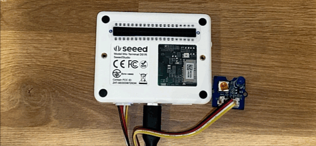

<!--
CO_OP_TRANSLATOR_METADATA:
{
  "original_hash": "db44083b4dc6fb06eac83c4f16448940",
  "translation_date": "2026-01-07T02:07:27+00:00",
  "source_file": "1-getting-started/lessons/3-sensors-and-actuators/wio-terminal-actuator.md",
  "language_code": "ml"
}
-->
# ഒരു നൈറ്റ്‌ലൈറ്റ് നിർമ്മിക്കുക - Wio ടെർമിനൽ

പാഠത്തിലെ ഈ ഭാഗത്തിൽ, നിങ്ങളുടെ Wio ടെർമിനലിലേക്ക് ഒരു LED ചേർത്തു അതുപയോഗിച്ച് നൈറ്റ്‌ലൈറ്റ് സൃഷ്ടിക്കാൻ പഠിക്കും.

## ഹാർഡ്‌വെയർ

നൈറ്റ്‌ലൈറ്റിന് ഇപ്പോൾ ഒരു ആക്ടുവേറ്റർ ആവശ്യമുണ്ട്.

ആക്ടുവേറ്റർ ഒരു **LED** ആണ്, ഒരു [ലൈറ്റ്-എമിറ്റിംഗ് ഡയോഡ്](https://wikipedia.org/wiki/Light-emitting_diode) ആയത്, ഇതിന്‌ ഇടപെടുമ്പോൾ വെളിച്ചം പുറപ്പെടും. ഇത് ഒരു ഡിജിറ്റൽ ആക്ടുവേറ്ററാണ്, രണ്ട് നിലകളിൽ പ്രവർത്തിക്കുന്നു, ഓൺ, ഓഫ്. 1 എന്ന മൂല്യം അയച്ചാൽ LED ഓണാകും, 0 അയച്ചാൽ ഓഫ് ആകും. ഇത് ഒരു പുറം Grove ആക്ടുവേറ്ററാണ്, Wio ടെർമിനലുമായി കണക്റ്റ് ചെയ്യേണ്ടതാണ്.

നൈറ്റ്‌ലൈറ്റ് ലൊജിക് പ്യൂഡോ-കোഡിൽ:

```output
Check the light level.
If the light is less than 300
    Turn the LED on
Otherwise
    Turn the LED off
```

### LED കണക്ട് ചെയ്യുക

Grove LED ഒരു മോഡ്യൂളായി ലഭിക്കുന്നു, പല നിറക്കുള്ള LED കളിൽ നിന്ന് തിരഞ്ഞെടുക്കാൻ.

#### ടാസ്ക് - LED കണക്ട് ചെയ്യുക

LED കണക്ട് ചെയ്യുക.


1. ഇഷ്ടമുള്ള LED തിരഞ്ഞെടുത്ത് LED മോഡ്യൂളിലെ രണ്ട് സ്തുതികളിൽ കാലുകൾ ഉള്‍ക്കൊണ്ടു ചേര്‍ക്കുക.

    LEDs ലൈറ്റ്-എമിറ്റിംഗ് ഡയോഡുകളാണ്, ഡയോഡുകൾ ഒരു ദിശയിൽ മാത്രമേ കറന്റ് കടത്തൂ. അതിനാൽ LED ശരിയായ ദിശയിൽ കണക്ട് ചെയ്യണം, അല്ലെങ്കിൽ പ്രവർത്തിക്കില്ല.

    LED യുടെ ഒരു കാലി പോസിറ്റീവ് പിൻ ആണ്, മറ്റത് നെഗറ്റീവ് പിൻ. LED പൂർണ്ണമായും വട്ടമല്ല, ഒരൊള്‌ വശത്ത് അല്പം തട്ടിക്കയായിരിക്കും. അല്പം തട്ടിയ വശം നെഗറ്റീവ് പിൻ ആണ്. LED മോഡ്യൂളിൽ കണക്ട് ചെയ്യുമ്പോൾ വട്ടമണ്ണിലുള്ള പിന് **+** എന്ന് ചിഹ്നിച്ച സോക്കറ്റിലേക്ക് കണക്ട് ചെയ്യുക, തട്ടിയ വശം മോഡ്യൂളിന്റെ മദ്ധ്യത്തിലേക്ക് അടുത്ത സോക്കറ്റിലേക്ക് കണക്ട് ചെയ്യുക.

1. LED മോഡ്യൂളിലുള്ള സ്പിൻ ബട്ടൺ വെളിച്ചത്തിന്റെ കാന്‍സട്രേഷൻ നിയന്ത്രിക്കാൻ ഉണ്ട്. ചെറിയ ഫിലിപ്സ് ഹെഡ് സ്ക്രൂഡ്രൈവർ ഉപയോഗിച്ച് അത് മുഴുവൻ ആന്റി-ക്ലോക്ക്വൈസ് തിരിയിച്ചു പരമാവധി മitando.

1. Grove കേബിളിന്റെ ഒരു അറ്റം LED മോഡ്യൂളിലെ സോക്കറ്റിൽ ഇടുക. അത് ഒരേ ദിശയിൽ മാത്രം പോകും.

1. Wio ടെർമിനൽ കമ്പ്യൂട്ടറിൽനിന്ന് അല്ലെങ്കിൽ മറ്റേതെങ്കിലും പവർ സപ്ലയി അനുപയോഗിച്ചവിടെ നിന്ന് വേർപ്പിച്ചു, Grove കേബിളിന്റെ മറുവശത്ത് സോക്കറ്റ് Wio ടെർമിനലിന്റെ സ്‌ക്രീൻ ദൃശ്യമാകുന്നതുപോലെ വലതുവശത്തെ Grove സോക്കറ്റിലേക്ക് കണക്ട് ചെയ്യുക. ഇത് പവർ ബട്ടണിന്റെ ഏറ്റവും അകലെയുള്ള സോക്കറ്റാണ്.

    > 💁 വലതു Grove സോക്കറ്റ് അനലോഗ് അല്ലെങ്കിൽ ഡിജിറ്റൽ സെൻസറുകളും ആക്ടുവേറ്ററുകളും ഉപയോഗിക്കാൻ കഴിയും. ഇടതു സോക്കറ്റ് I<sup>2</sup>C-നും ഡിജിറ്റൽ സെൻസറുകൾക്കും ആക്ടുവേറ്ററുകൾക്കും മാത്രം ആണ്. I<sup>2</sup>C പിന്നീട് പാഠങ്ങളിൽ പഠിക്കപ്പെടും.


## നൈറ്റ്‌ലൈറ്റ് പ്രോഗ്രാം ചെയ്യുക

നൈറ്റ്‌ലൈറ്റ് ഇപ്പോൾ ബിൽറ്റ്-ഇൻ ലൈറ്റ് സെൻസറും Grove LED യും ഉപയോഗിച്ച് പ്രോഗ്രാം ചെയ്യാം.

### ടാസ്ക് - നൈറ്റ്‌ലൈറ്റ് പ്രോഗ്രാം ചെയ്യുക

നൈറ്റ്‌ലൈറ്റ് പ്രോഗ്രാം ചെയ്യുക.

1. ഈ അസ്സൈൻമെന്റിന്റെ മുന്‍ ഭാഗത്ത് സൃഷ്ടിച്ച nightlight പ്രോജക്ട് VS Code-ൽ തുറക്കുക.

1. `setup` ഫംഗ്ഷന്റെ അടിയിൽ താഴെ പറയുന്ന വരി ചേർക്കുക:

    ```cpp
    pinMode(D0, OUTPUT);
    ```

    ഈ വരി Grove പോർട്ടിലൂടെ LED-യുമായി കമ്മ്യൂണിക്കേഷൻ നടത്തുന്ന പിന് കോൺഫിഗർ ചെയ്യുന്നു.

    `D0` പിന് വലതു Grove സോക്കറ്റിന്റെ ഡിജിറ്റൽ പിന് ആണ്. ഈ പിന് `OUTPUT` ആയി സജ്ജീകരിച്ചു, ആക്ടുവേറ്ററുമായി ബന്ധിപ്പിച്ചിരിക്കുന്നതിനും ഡാറ്റ പിന് എഴുതുന്നതിനും.

1. ലൂപ്പ് ഫംഗ്ഷന്റെ `delay` കമാൻഡിന് മുകളിൽ താഴെ പറയുന്ന കോഡ് ചേർക്കുക:

    ```cpp
    if (light < 300)
    {
        digitalWrite(D0, HIGH);
    }
    else
    {
        digitalWrite(D0, LOW);
    }
    ```

    ഈ കോഡ് `light` മൂല്യം പരിശോധിക്കുന്നു. ഇത് 300-ലധികം കുറവായാൽ `D0` ഡിജിറ്റൽ പിനിലേക്ക് `HIGH` മൂല്യം അയയ്ക്കും. ഈ `HIGH` മൂല്യം 1 ആണ്, LED ഓണാക്കുന്നു. ലൈറ്റ് 300-ല്‍ സമവായമോ കൂടുതലായിയിരുന്നാൽ, `LOW` മൂല്യം 0 പിനിലേക്ക് അയച്ച് LED ഓഫ് ആക്കുന്നു.

    > 💁 ഡിജിറ്റൽ മൂല്യങ്ങൾ ആക്ടുവേറ്ററുകളിലേക്ക് അയയ്ക്കുമ്പോൾ, LOW മൂല്യം 0 വോൾട്ട് ആണ്‌, HIGH മൂല്യം യന്ത്രത്തിന്റെ പരമാവധി വോൾട്ടേജ് ആണ്. Wio ടെർമിനലിന്, HIGH വോൾട്ടേജ് 3.3V ആണ്.

1. Wio ടെർമിനൽ വീണ്ടും നിങ്ങളുടെ കമ്പ്യൂട്ടറിൽ കണക്ട് ചെയ്ത് പുതിയ കോഡ് അപ്‌ലോഡ് ചെയ്യുക.

1. സീരിയൽ മുൻനോട്ടം (Serial Monitor) കണക്ട് ചെയ്യുക. വെളിച്ച മൂല്യങ്ങൾ ടേർമിനലിൽ പ്രദർശിപ്പിക്കും.

    ```output
    > Executing task: platformio device monitor <

    --- Available filters and text transformations: colorize, debug, default, direct, hexlify, log2file, nocontrol, printable, send_on_enter, time
    --- More details at http://bit.ly/pio-monitor-filters
    --- Miniterm on /dev/cu.usbmodem101  9600,8,N,1 ---
    --- Quit: Ctrl+C | Menu: Ctrl+T | Help: Ctrl+T followed by Ctrl+H ---
    Light value: 4
    Light value: 5
    Light value: 4
    Light value: 158
    Light value: 343
    Light value: 348
    Light value: 344
    ```

1. ലൈറ്റ് സെൻസർ മറച്ചുവെക്കുകയും തുറക്കുകയും ചെയ്യുക. വെളിച്ച നില 300 അല്ലെങ്കിൽ അതിൽ താഴെയുള്ളതായാൽ LED പ്രജ്വലിക്കും, 300-ലധികം ആയാൽ LED ഓഫ് ആകും എന്ന് ശ്രദ്ധിക്കുക.



> 💁 ഈ കോഡ് [code-actuator/wio-terminal](../../../../../1-getting-started/lessons/3-sensors-and-actuators/code-actuator/wio-terminal) ഫോളഡറിൽ കാണാം.

😀 നിങ്ങളുടെ നൈറ്റ്‌ലൈറ്റ് പ്രോഗ്രാം വിജയിക്കുകയുണ്ടായി!

---

<!-- CO-OP TRANSLATOR DISCLAIMER START -->
**ഡിസ്‍ക്ലെയിമര്‍**:  
ഈ ഡോക്യുമെന്റ് AI പരിഭാഷ സേവനം [Co-op Translator](https://github.com/Azure/co-op-translator) ഉപയോഗിച്ച് പരിഭാഷ ചെയ്തതാണ്. ഞങ്ങൾ കൃത്യതയ്ക്കായി ശ്രമിച്ചുവെങ്കിലും, സ്വയം പ്രവര്‍ത്തിക്കുന്ന പരിഭാഷകളിൽ പിശകുകൾ അല്ലെങ്കിൽ അച്ചടക്കക്കുറവുകൾ ഉണ്ടായിരിക്കാൻ സാധ്യതയുണ്ടെന്ന് ദയവായി മനസിലാക്കുക. യഥാർത്ഥ ഡോക്യുമെന്റ് അതിന്റെ പ്രാദേശിക ഭാഷയിൽ ആണ് അനിവാര്യമായ സ്രോതസ്സെന്ന് കണക്കാക്കണം. ഗൗരവമുള്ള വിവരങ്ങൾക്ക്, പ്രൊഫഷണല്‍ മനുഷ്യ പരിഭാഷ ശുപാർശ ചെയ്യപ്പെടുന്നു. ഈ പരിഭാഷ ഉപയോഗിച്ചതിന്റെ ഫലമായി ഉളവാകുന്ന ഏതെങ്കിലും തെറ്റിദ്ധാരണകൾക്കും വ്യാഖ്യാനക്കുറവുകൾക്കുമുള്ള ഉത്തരവാദിത്വം ഞങ്ങൾക്ക് ഉണ്ടാകില്ല.
<!-- CO-OP TRANSLATOR DISCLAIMER END -->