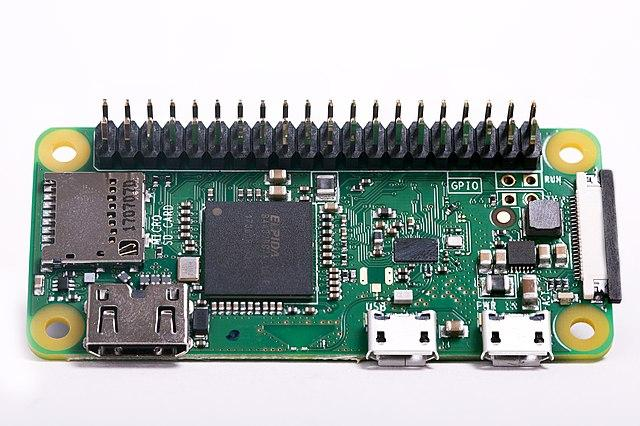

<!--
CO_OP_TRANSLATOR_METADATA:
{
  "original_hash": "9dd7f645ad1c6f20b72fee512987f772",
  "translation_date": "2025-08-26T23:49:07+00:00",
  "source_file": "1-getting-started/lessons/2-deeper-dive/README.md",
  "language_code": "mo"
}
-->
# 深入探討物聯網 (IoT)

> 手繪筆記由 [Nitya Narasimhan](https://github.com/nitya) 提供。點擊圖片查看更大版本。

本課程是 [Hello IoT 系列](https://youtube.com/playlist?list=PLmsFUfdnGr3xRts0TIwyaHyQuHaNQcb6-) 的一部分，由 [Microsoft Reactor](https://developer.microsoft.com/reactor/?WT.mc_id=academic-17441-jabenn) 提供。課程分為兩段影片進行教學：一段為 1 小時的課程，另一段為 1 小時的辦公時間，深入探討課程中的部分內容並回答問題。

> 🎥 點擊上方圖片觀看影片

## 課前測驗

[課前測驗](https://black-meadow-040d15503.1.azurestaticapps.net/quiz/3)

## 簡介

本課程將深入探討上一課中提到的一些概念。

在本課程中，我們將涵蓋：

* [物聯網應用的組成部分](../../../../../1-getting-started/lessons/2-deeper-dive)
* [深入探討微控制器](../../../../../1-getting-started/lessons/2-deeper-dive)
* [深入探討單板電腦](../../../../../1-getting-started/lessons/2-deeper-dive)

## 物聯網應用的組成部分

物聯網應用的兩個主要組成部分是 *網際網路* 和 *物件*。讓我們更詳細地了解這兩個部分。

### 物件

物聯網中的 **物件** 指的是能與物理世界互動的設備。這些設備通常是小型、低成本的電腦，運行速度較低且功耗低。例如，簡單的微控制器僅有幾千字節的 RAM（而非 PC 的幾 GB），運行速度僅有幾百 MHz（而非 PC 的 GHz），但功耗極低，有時甚至可以用電池運行數週、數月甚至數年。

這些設備通過使用感測器來收集周圍環境的數據，或者通過控制輸出或執行器來進行物理改變。典型的例子是智能恆溫器——一種具有溫度感測器、可設置所需溫度的方式（如旋鈕或觸控屏），以及連接到加熱或冷卻系統的設備，當檢測到的溫度超出所需範圍時，系統會啟動。溫度感測器檢測到房間太冷，執行器則啟動加熱系統。

物聯網設備的種類繁多，從專用硬體到一般用途設備，甚至包括您的智能手機！智能手機可以使用感測器檢測周圍環境，並使用執行器與世界互動——例如使用 GPS 感測器檢測您的位置，並使用揚聲器提供導航指示。

✅ 想想您周圍的其他系統，它們如何通過感測器讀取數據並據此做出決策。一個例子是烤箱上的恆溫器。您能找到更多例子嗎？

### 網際網路

物聯網應用中的 **網際網路** 部分包括物聯網設備可以連接以發送和接收數據的應用，以及其他可以處理物聯網設備數據並幫助做出決策的應用。

一種典型的設置是使用某種雲端服務，物聯網設備連接到該服務，該服務負責處理安全性、接收來自物聯網設備的消息以及向設備發送消息。該雲端服務還可以連接到其他應用，這些應用可以處理或存儲感測器數據，或者將感測器數據與其他系統的數據結合以做出決策。

設備並不總是直接通過 WiFi 或有線連接到網際網路。有些設備使用網狀網路技術，例如藍牙，通過一個具有網際網路連接的集線器設備進行通信。

以智能恆溫器為例，恆溫器通過家庭 WiFi 連接到雲端服務，並將溫度數據發送到該服務。雲端服務將數據寫入某種數據庫，讓房主可以通過手機應用查看當前和過去的溫度。雲端中的另一個服務知道房主想要的溫度，並通過雲端服務向物聯網設備發送消息，告訴加熱系統開啟或關閉。

更智能的版本可以使用雲端中的 AI，結合其他物聯網設備（如佔用感測器）連接的其他感測器數據，以及天氣和您的日曆等數據，智能地設置溫度。例如，如果日曆顯示您正在度假，它可以關閉加熱；或者根據您使用的房間逐一關閉加熱，並從數據中學習以越來越準確。

✅ 還有哪些數據可以幫助使網際網路連接的恆溫器更智能？

### 邊緣上的物聯網

雖然物聯網中的 "I" 代表網際網路，但這些設備並不一定需要連接到網際網路。在某些情況下，設備可以連接到 "邊緣" 設備——在本地網路上運行的網關設備，這意味著您可以在不通過網際網路的情況下處理數據。當您有大量數據或網際網路連接速度較慢時，這可能更快；它允許您在無法連接網際網路的情況下運行，例如在船上或在人道危機的災區；並且可以保護數據隱私。一些設備包含使用雲端工具創建的處理代碼，並在本地運行以收集和響應數據，而不需要使用網際網路連接來做出決策。

一個例子是智能家居設備，例如 Apple HomePod、Amazon Alexa 或 Google Home，它們使用在雲端訓練的 AI 模型來聆聽您的聲音，但在設備本地運行。這些設備會在聽到某個詞或短語時 "喚醒"，然後才將您的語音通過網際網路發送進行處理。設備會在檢測到您語音中的停頓時停止發送語音。您在喚醒設備之前說的所有內容，以及設備停止聆聽後說的所有內容，都不會被發送到設備提供商的網際網路，因此是私密的。

✅ 想想其他需要保護隱私的場景，因此數據處理最好在邊緣完成而不是在雲端。提示：想想帶有攝像頭或其他影像設備的物聯網設備。

### 物聯網安全性

任何網際網路連接都需要考慮安全性。有一個老笑話說 "物聯網中的 S 代表安全性"——物聯網中沒有 "S"，暗示它並不安全。

物聯網設備連接到雲端服務，因此其安全性取決於雲端服務的安全性——如果您的雲端服務允許任何設備連接，那麼可能會發送惡意數據或遭受病毒攻擊。由於物聯網設備與其他設備互動並進行控制，這可能會帶來非常現實的後果。例如，[Stuxnet 蠕蟲](https://wikipedia.org/wiki/Stuxnet) 操控離心機中的閥門以損壞它們。黑客也曾利用[安全性漏洞訪問嬰兒監視器](https://www.npr.org/sections/thetwo-way/2018/06/05/617196788/s-c-mom-says-baby-monitor-was-hacked-experts-say-many-devices-are-vulnerable)和其他家庭監控設備。

> 💁 有時物聯網設備和邊緣設備運行在完全與網際網路隔離的網路上，以保持數據的私密性和安全性。這被稱為 [空氣隔離](https://wikipedia.org/wiki/Air_gap_(networking))。

## 深入探討微控制器

在上一課中，我們介紹了微控制器。現在讓我們更深入地了解它們。

### CPU

CPU 是微控制器的 "大腦"。它是運行您的代碼並能夠向任何連接的設備發送和接收數據的處理器。CPU 可以包含一個或多個核心——本質上是一個或多個可以協同工作以運行您的代碼的 CPU。

CPU 依賴於時鐘，每秒鐘滴答數百萬或數十億次。每次滴答或週期都同步 CPU 可以執行的操作。每次滴答，CPU 可以執行程序中的一條指令，例如從外部設備檢索數據或執行數學計算。這種規律的週期允許所有操作在下一條指令處理之前完成。

時鐘週期越快，每秒可以處理的指令越多，因此 CPU 的速度越快。CPU 速度以 [赫茲 (Hz)](https://wikipedia.org/wiki/Hertz) 為單位測量，1 Hz 表示每秒一個週期或時鐘滴答。

> 🎓 CPU 速度通常以 MHz 或 GHz 表示。1MHz 是 1 百萬 Hz，1GHz 是 1 十億 Hz。

> 💁 CPU 使用 [取指-解碼-執行週期](https://wikipedia.org/wiki/Instruction_cycle) 執行程序。每次時鐘滴答，CPU 從記憶體中取指令，解碼，然後執行，例如使用算術邏輯單元 (ALU) 加法兩個數字。一些執行可能需要多個滴答才能完成，因此下一個週期將在指令完成後的下一次滴答運行。

微控制器的時鐘速度遠低於桌上型或筆記型電腦，甚至大多數智能手機。比如 Wio Terminal 的 CPU 運行速度為 120MHz，即每秒 120,000,000 次週期。

✅ 一台普通的 PC 或 Mac 的 CPU 具有多個核心，運行速度為多個 GHz，意味著時鐘每秒滴答數十億次。研究一下您電腦的時鐘速度，並比較它比 Wio Terminal 快多少倍。

每次時鐘週期都會消耗電力並產生熱量。滴答越快，消耗的電力越多，產生的熱量越多。PC 有散熱片和風扇來散熱，否則它們會在幾秒鐘內過熱並關閉。微控制器通常沒有這些，因為它們運行得更冷，因此速度更慢。PC 通過主電源或大型電池運行幾小時，而微控制器可以通過小型電池運行數天、數月甚至數年。微控制器還可以有以不同速度運行的核心，當 CPU 的需求較低時切換到較慢的低功耗核心以減少功耗。

> 💁 一些 PC 和 Mac 也採用了相同的快速高功耗核心和較慢低功耗核心的組合，根據運行的任務在節省電池和速度之間切換。例如，最新 Apple 筆記型電腦中的 M1 芯片可以在 4 個性能核心和 4 個效率核心之間切換，以根據運行的任務優化電池壽命或速度。

✅ 做一些研究：閱讀 [Wikipedia CPU 文章](https://wikipedia.org/wiki/Central_processing_unit) 了解更多關於 CPU 的資訊。

#### 任務

調查 Wio Terminal。

如果您正在使用 Wio Terminal 進行這些課程，嘗試找到 CPU。在 [Wio Terminal 產品頁面](https://www.seeedstudio.com/Wio-Terminal-p-4509.html) 的 *硬體概述* 部分找到內部結構的圖片，並嘗試通過背面的透明塑料窗口找到 CPU。

### 記憶體

微控制器通常有兩種類型的記憶體——程序記憶體和隨機存取記憶體 (RAM)。

程序記憶體是非揮發性的，這意味著寫入其中的內容在設備斷電時仍然保留。這是存儲您的程序代碼的記憶體。

RAM 是程序運行時使用的記憶體，包含程序分配的變數以及從外圍設備收集的數據。RAM 是揮發性的，當電源斷開時內容會丟失，實際上重置了您的程序。
🎓 程式記憶體儲存你的程式碼，即使斷電也能保持不變。
🎓 RAM 用於執行程式，當電源中斷時會被重置

與 CPU 類似，微控制器上的記憶體比 PC 或 Mac 小得多。一台典型的 PC 可能有 8GB 的 RAM，也就是 8,000,000,000 字節，每個字節足以存儲一個字母或 0-255 範圍內的一個數字。而微控制器通常只有幾千字節 (KB) 的 RAM，其中 1KB 等於 1,000 字節。上述提到的 Wio Terminal 擁有 192KB 的 RAM，也就是 192,000 字節，比一般 PC 少了超過 40,000 倍！

下圖顯示了 192KB 和 8GB 的相對大小差異——中心的小點代表 192KB。

程式存儲空間也比 PC 小。一台典型的 PC 可能有 500GB 的硬碟用於程式存儲，而微控制器可能只有幾千字節或幾百萬字節 (MB) 的存儲空間 (1MB 等於 1,000KB 或 1,000,000 字節)。Wio Terminal 擁有 4MB 的程式存儲空間。

✅ 做些研究：你正在使用的電腦有多少 RAM 和存儲空間？與微控制器相比如何？

### 輸入/輸出

微控制器需要輸入和輸出 (I/O) 連接來從感測器讀取數據並向致動器發送控制信號。它們通常包含一些通用輸入/輸出 (GPIO) 接腳。這些接腳可以在軟體中配置為輸入 (接收信號) 或輸出 (發送信號)。

🧠⬅️ 輸入接腳用於從感測器讀取數值

🧠➡️ 輸出接腳向致動器發送指令

✅ 你將在後續課程中學到更多相關內容。

#### 任務

研究 Wio Terminal。

如果你正在使用 Wio Terminal 進行這些課程，找到 GPIO 接腳。前往 [Wio Terminal 產品頁面](https://www.seeedstudio.com/Wio-Terminal-p-4509.html) 的 *Pinout 圖表* 部分，了解每個接腳的功能。Wio Terminal 附帶一張可以貼在背面的貼紙，上面標有接腳編號，如果尚未貼上，現在就貼上。

### 實體大小

微控制器通常尺寸很小，其中最小的一款 [Freescale Kinetis KL03 MCU](https://www.edn.com/tiny-arm-cortex-m0-based-mcu-shrinks-package/) 小到可以放進高爾夫球的凹槽中。PC 的 CPU 僅僅是處理器本身就可能有 40mm x 40mm 的大小，還不包括確保 CPU 運行時不過熱所需的散熱片和風扇，這些加起來比完整的微控制器大得多。Wio Terminal 開發套件包含微控制器、外殼、螢幕以及一系列連接和元件，其大小甚至比裸露的 Intel i9 CPU 還要小，更不用說加上散熱片和風扇後的尺寸了！

| 裝置                          | 尺寸                  |
| ----------------------------- | --------------------- |
| Freescale Kinetis KL03        | 1.6mm x 2mm x 1mm     |
| Wio Terminal                  | 72mm x 57mm x 12mm    |
| Intel i9 CPU、散熱片和風扇     | 136mm x 145mm x 103mm |

### 框架與作業系統

由於速度和記憶體容量有限，微控制器不會運行像桌面電腦那樣的作業系統 (OS)。使你的電腦運行的作業系統 (Windows、Linux 或 macOS) 需要大量的記憶體和處理能力來執行微控制器完全不需要的任務。記住，微控制器通常被程式化來執行一個或多個非常特定的任務，而不像 PC 或 Mac 這樣的通用電腦需要支援使用者介面、播放音樂或影片、提供撰寫文件或程式碼的工具、玩遊戲或瀏覽網路。

要在沒有 OS 的情況下程式化微控制器，你需要一些工具來構建程式碼，使其能夠在微控制器上運行，並使用 API 與任何周邊設備進行通信。每個微控制器都不同，因此製造商通常支援標準框架，讓你可以遵循標準的「配方」來構建程式碼，並使其能夠在支援該框架的任何微控制器上運行。

你可以使用 OS 來程式化微控制器——通常被稱為即時作業系統 (RTOS)，這些系統旨在即時處理周邊設備的數據傳輸。這些作業系統非常輕量化，並提供以下功能：

* 多執行緒，允許程式碼同時運行多個程式區塊，無論是在多核心上還是通過單核心輪流執行
* 網路功能，允許安全地通過網路進行通信
* 圖形使用者介面 (GUI) 元件，用於在有螢幕的裝置上構建使用者介面 (UI)

✅ 閱讀一些不同的 RTOS：[Azure RTOS](https://azure.microsoft.com/services/rtos/?WT.mc_id=academic-17441-jabenn)、[FreeRTOS](https://www.freertos.org)、[Zephyr](https://www.zephyrproject.org)

#### Arduino

[Arduino](https://www.arduino.cc) 可能是最受歡迎的微控制器框架，尤其是在學生、愛好者和製作者之間。Arduino 是一個開源電子平台，結合了軟體和硬體。你可以從 Arduino 本身或其他製造商購買 Arduino 兼容的開發板，然後使用 Arduino 框架進行程式設計。

Arduino 開發板使用 C 或 C++ 進行程式設計。使用 C/C++ 可以使程式碼編譯得非常小並運行得非常快，這在像微控制器這樣受限的裝置上是必需的。Arduino 應用程式的核心被稱為 sketch，它是包含兩個函式的 C/C++ 程式碼——`setup` 和 `loop`。當開發板啟動時，Arduino 框架程式碼會先運行一次 `setup` 函式，然後不斷重複運行 `loop` 函式，直到電源關閉。

你可以在 `setup` 函式中撰寫初始化程式碼，例如連接 WiFi 和雲端服務或初始化輸入和輸出接腳。在 `loop` 函式中撰寫處理程式碼，例如從感測器讀取數據並將其發送到雲端。通常你會在每次迴圈中加入延遲，例如，如果你只希望每 10 秒發送一次感測器數據，你可以在迴圈結尾加入 10 秒的延遲，讓微控制器進入睡眠模式以節省電力，然後在需要時 10 秒後再次運行迴圈。

✅ 這種程式架構被稱為 *事件迴圈* 或 *訊息迴圈*。許多應用程式在底層使用這種架構，並且是大多數運行在 Windows、macOS 或 Linux 等作業系統上的桌面應用程式的標準。`loop` 會監聽來自使用者介面元件（例如按鈕）或裝置（例如鍵盤）的訊息，並對其作出回應。你可以在這篇 [事件迴圈文章](https://wikipedia.org/wiki/Event_loop) 中閱讀更多內容。

Arduino 提供了與微控制器和 I/O 接腳交互的標準函式庫，並在底層有不同的實現以支援不同的微控制器。例如，[`delay` 函式](https://www.arduino.cc/reference/en/language/functions/time/delay/) 會使程式暫停指定的時間，[`digitalRead` 函式](https://www.arduino.cc/reference/en/language/functions/digital-io/digitalread/) 會從指定的接腳讀取 `HIGH` 或 `LOW` 的值，無論程式在哪個開發板上運行。這些標準函式庫意味著為一塊開發板撰寫的 Arduino 程式碼可以重新編譯到任何其他 Arduino 開發板上並運行，只要接腳相同且開發板支援相同的功能。

Arduino 還有一個龐大的第三方函式庫生態系統，允許你為 Arduino 專案添加額外功能，例如使用感測器和致動器或連接到雲端 IoT 服務。

##### 任務

研究 Wio Terminal。

如果你正在使用 Wio Terminal 進行這些課程，重新閱讀你在上一課中撰寫的程式碼。找到 `setup` 和 `loop` 函式。監控序列埠輸出，觀察 `loop` 函式被反覆呼叫。嘗試在 `setup` 函式中添加程式碼以寫入序列埠，並觀察此程式碼在每次重新啟動時僅被呼叫一次。嘗試使用側面的電源開關重新啟動裝置，顯示此程式碼在每次裝置重新啟動時都會被呼叫。

## 更深入了解單板電腦

在上一課中，我們介紹了單板電腦。現在讓我們更深入地了解它們。

### Raspberry Pi

[Raspberry Pi 基金會](https://www.raspberrypi.org) 是一家來自英國的慈善機構，成立於 2009 年，旨在促進計算機科學的學習，特別是在學校層面。作為這一使命的一部分，他們開發了一款單板電腦，名為 Raspberry Pi。目前 Raspberry Pi 有三種版本——全尺寸版本、較小的 Pi Zero，以及可以嵌入最終 IoT 裝置中的計算模組。

最新的全尺寸 Raspberry Pi 是 Raspberry Pi 4B。它擁有一個四核心 (4 核心) CPU，運行速度為 1.5GHz，2GB、4GB 或 8GB 的 RAM，千兆乙太網、WiFi、2 個支援 4k 螢幕的 HDMI 接口、一個音頻和複合視頻輸出接口、USB 接口 (2 個 USB 2.0 和 2 個 USB 3.0)、40 個 GPIO 接腳、一個 Raspberry Pi 相機模組的相機接口，以及一個 SD 卡插槽。所有這些都集成在一塊 88mm x 58mm x 19.5mm 的電路板上，並由 3A USB-C 電源供電。這些起價為 35 美元，比 PC 或 Mac 便宜得多。

> 💁 還有一款 Pi400 一體式電腦，將 Pi4 集成到鍵盤中。

Pi Zero 更小，功耗更低。它擁有一個單核心 1GHz CPU，512MB 的 RAM，WiFi (在 Zero W 型號中)，一個 HDMI 接口、一個 micro-USB 接口、40 個 GPIO 接腳、一個 Raspberry Pi 相機模組的相機接口，以及一個 SD 卡插槽。它的尺寸為 65mm x 30mm x 5mm，功耗非常低。Zero 售價 5 美元，帶 WiFi 的 W 型號售價 10 美元。

> 🎓 這兩款裝置的 CPU 都是 ARM 處理器，而不是大多數 PC 和 Mac 中的 Intel/AMD x86 或 x64 處理器。這些處理器類似於一些微控制器中的 CPU，以及幾乎所有的手機、Microsoft Surface X 和新的 Apple Silicon 基於 ARM 的 Apple Mac。

所有 Raspberry Pi 版本都運行一個基於 Debian Linux 的作業系統，名為 Raspberry Pi OS。這個作業系統有一個精簡版，沒有桌面，非常適合不需要螢幕的「無頭」專案，還有一個完整版本，帶有完整的桌面環境，包括網頁瀏覽器、辦公應用程式、程式設計工具和遊戲。由於作業系統是 Debian Linux 的一個版本，你可以安裝任何在 Debian 上運行並為 Pi 的 ARM 處理器構建的應用程式或工具。

#### 任務

研究 Raspberry Pi。

如果你正在使用 Raspberry Pi 進行這些課程，閱讀有關電路板上不同硬體元件的資料。

* 你可以在 [Raspberry Pi 硬體文件頁面](https://www.raspberrypi.org/documentation/hardware/raspberrypi/) 上找到有關使用的處理器的詳細資訊。閱讀有關你正在使用的 Pi 的處理器的資料。
* 找到 GPIO 接腳。在 [Raspberry Pi GPIO 文件](https://www.raspberrypi.org/documentation/hardware/raspberrypi/gpio/README.md) 上閱讀更多相關內容。使用 [GPIO 接腳使用指南](https://www.raspberrypi.org/documentation/usage/gpio/README.md) 來識別 Pi 上的不同接腳。

### 單板電腦程式設計

單板電腦是完整的電腦，運行完整的作業系統。這意味著你可以使用多種程式語言、框架和工具來進行程式設計，而不像微控制器需要框架 (例如 Arduino) 的支援。大多數程式語言都有函式庫可以訪問 GPIO 接腳，從而向感測器和致動器發送和接收數據。

✅ 你熟悉哪些程式語言？它們是否支援 Linux？

在 Raspberry Pi 上構建 IoT 應用程式最常用的程式語言是 Python。Pi 有一個龐大的硬體生態系統，幾乎所有這些硬體都包含用於使用它們的 Python 函式庫。一些生態系統基於「帽子」——之所以叫這個名字，是因為它們像帽子一樣坐在 Pi 上，通過一個大插座連接到 40 個 GPIO 接腳。這些帽子提供額外的功能，例如螢幕、感測器、遙控車或適配器，允許你插入具有標準化電纜的感測器。
### 專業物聯網部署中單板電腦的使用

單板電腦不僅僅是開發套件，也被用於專業的物聯網部署。它們能夠提供強大的功能來控制硬體，並執行如運行機器學習模型等複雜任務。例如，有一款 [Raspberry Pi 4 計算模組](https://www.raspberrypi.org/blog/raspberry-pi-compute-module-4/)，它具備 Raspberry Pi 4 的所有性能，但採用更緊湊且更便宜的形式，去掉了大多數的埠，專為安裝到定制硬體中而設計。

---

## 🚀 挑戰

上一課的挑戰是列出你家中、學校或工作場所中所有你能想到的物聯網設備。對於這些設備中的每一個，你認為它們是基於微控制器、單板電腦，還是兩者的結合？

## 課後測驗

[課後測驗](https://black-meadow-040d15503.1.azurestaticapps.net/quiz/4)

## 回顧與自學

* 閱讀 [Arduino 入門指南](https://www.arduino.cc/en/Guide/Introduction)，以更深入了解 Arduino 平台。
* 閱讀 [Raspberry Pi 4 簡介](https://www.raspberrypi.org/products/raspberry-pi-4-model-b/)，學習更多關於 Raspberry Pi 的知識。
* 在 [Electrical Engineering Journal 的文章「What the FAQ are CPUs, MPUs, MCUs, and GPUs」](https://www.eejournal.com/article/what-the-faq-are-cpus-mpus-mcus-and-gpus/) 中了解更多相關概念和縮寫。

✅ 使用這些指南，結合 [硬體指南](../../../hardware.md) 中的連結所顯示的成本，決定你想使用哪種硬體平台，或者是否更願意使用虛擬設備。

## 作業

[比較與對比微控制器與單板電腦](assignment.md)

---

**免責聲明**：  
本文件已使用 AI 翻譯服務 [Co-op Translator](https://github.com/Azure/co-op-translator) 進行翻譯。雖然我們致力於提供準確的翻譯，但請注意，自動翻譯可能包含錯誤或不準確之處。原始文件的母語版本應被視為權威來源。對於關鍵資訊，建議使用專業人工翻譯。我們對因使用此翻譯而引起的任何誤解或錯誤解釋不承擔責任。