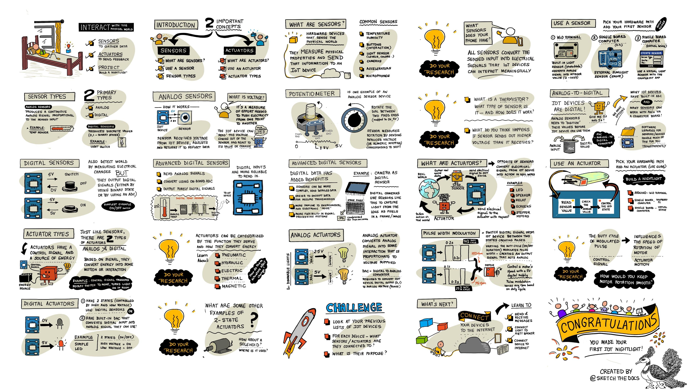

<!--
CO_OP_TRANSLATOR_METADATA:
{
  "original_hash": "e9ee00eb5fc55922a73762acc542166b",
  "translation_date": "2025-08-26T23:24:59+00:00",
  "source_file": "1-getting-started/lessons/3-sensors-and-actuators/README.md",
  "language_code": "mo"
}
-->
# 使用感測器和致動器與物理世界互動



> 手繪筆記由 [Nitya Narasimhan](https://github.com/nitya) 提供。點擊圖片查看更大版本。

本課程是 [Microsoft Reactor](https://developer.microsoft.com/reactor/?WT.mc_id=academic-17441-jabenn) 的 [Hello IoT 系列](https://youtube.com/playlist?list=PLmsFUfdnGr3xRts0TIwyaHyQuHaNQcb6-) 的一部分。課程分為兩段影片進行教學——一段 1 小時的課程，以及一段 1 小時的辦公時間，深入探討課程內容並回答問題。

[](https://youtu.be/Lqalu1v6aF4)

[](https://youtu.be/qR3ekcMlLWA)

> 🎥 點擊上方圖片觀看影片

## 課前測驗

[課前測驗](https://black-meadow-040d15503.1.azurestaticapps.net/quiz/5)

## 簡介

本課程介紹了 IoT 裝置的兩個重要概念——感測器和致動器。您將親自操作這些元件，為您的 IoT 專案添加光感測器，並根據光線強度控制 LED，實際上構建了一個夜燈。

在本課程中，我們將涵蓋：

* [什麼是感測器？](../../../../../1-getting-started/lessons/3-sensors-and-actuators)
* [使用感測器](../../../../../1-getting-started/lessons/3-sensors-and-actuators)
* [感測器類型](../../../../../1-getting-started/lessons/3-sensors-and-actuators)
* [什麼是致動器？](../../../../../1-getting-started/lessons/3-sensors-and-actuators)
* [使用致動器](../../../../../1-getting-started/lessons/3-sensors-and-actuators)
* [致動器類型](../../../../../1-getting-started/lessons/3-sensors-and-actuators)

## 什麼是感測器？

感測器是感知物理世界的硬體裝置——它們測量周圍的一個或多個屬性，並將信息傳送到 IoT 裝置。感測器涵蓋了廣泛的設備，因為可以測量的事物種類繁多，從自然屬性（如空氣溫度）到物理交互（如運動）。

一些常見的感測器包括：

* 溫度感測器——這些感測器感知空氣溫度或它們所浸入物體的溫度。對於愛好者和開發者來說，這些感測器通常與氣壓和濕度感測器結合在一起。
* 按鈕——這些感測器感知何時被按下。
* 光感測器——這些感測器檢測光線強度，可以是特定顏色、紫外線、紅外線或一般可見光。
* 攝像頭——這些感測器通過拍攝照片或流式視頻來感知世界的視覺表示。
* 加速度計——這些感測器感知多方向的運動。
* 麥克風——這些感測器感知聲音，可以是一般的聲音強度或方向性聲音。

✅ 做一些研究。您的手機有哪些感測器？

所有感測器都有一個共同點——它們將所感知的事物轉換為 IoT 裝置可以解讀的電信號。如何解讀這些電信號取決於感測器以及用於與 IoT 裝置通信的協議。

## 使用感測器

按照以下相關指南，將感測器添加到您的 IoT 裝置：

* [Arduino - Wio Terminal](wio-terminal-sensor.md)
* [單板電腦 - Raspberry Pi](pi-sensor.md)
* [單板電腦 - 虛擬裝置](virtual-device-sensor.md)

## 感測器類型

感測器分為類比和數位兩種。

### 類比感測器

一些最基本的感測器是類比感測器。這些感測器接收來自 IoT 裝置的電壓，感測器元件調整該電壓，然後測量感測器返回的電壓以獲得感測器值。

> 🎓 電壓是衡量電流從一個地方移動到另一個地方的推動力。例如，標準 AA 電池的電壓為 1.5V（V 是伏特的符號），可以以 1.5V 的推動力將電流從正極移動到負極。不同的電子硬體需要不同的電壓才能工作，例如 LED 可以在 2-3V 下發光，但 100W 的燈絲燈泡需要 240V。您可以在 [維基百科的電壓頁面](https://wikipedia.org/wiki/Voltage) 上了解更多。

一個例子是電位器。這是一個可以在兩個位置之間旋轉的旋鈕，感測器測量旋轉角度。


IoT 裝置會向電位器發送一個電信號，電壓例如 5 伏特（5V）。當調整電位器時，它會改變從另一端輸出的電壓。假設您有一個標有 0 到 [11](https://wikipedia.org/wiki/Up_to_eleven) 的電位器，例如放大器上的音量旋鈕。當電位器處於完全關閉位置（0）時，輸出為 0V（0 伏特）。當它處於完全開啟位置（11）時，輸出為 5V（5 伏特）。

> 🎓 這是一個簡化的說明，您可以在 [維基百科的電位器頁面](https://wikipedia.org/wiki/Potentiometer) 上了解更多有關電位器和可變電阻的信息。

感測器輸出的電壓由 IoT 裝置讀取，裝置可以根據該電壓做出反應。根據感測器的不同，該電壓可以是任意值，也可以映射到標準單位。例如，基於 [熱敏電阻](https://wikipedia.org/wiki/Thermistor) 的類比溫度感測器會根據溫度改變其電阻。輸出電壓可以通過代碼中的計算轉換為開氏溫標（Kelvin），並相應地轉換為攝氏（°C）或華氏（°F）。

✅ 您認為如果感測器返回的電壓高於發送的電壓（例如來自外部電源）會發生什麼？⛔️ 請勿測試此情況。

#### 類比到數位轉換

IoT 裝置是數位的——它們無法處理類比值，只能處理 0 和 1。這意味著類比感測器的值需要轉換為數位信號才能被處理。許多 IoT 裝置具有類比到數位轉換器（ADCs），用於將類比輸入轉換為其值的數位表示。感測器也可以通過連接板與 ADC 一起工作。例如，在使用 Raspberry Pi 的 Seeed Grove 生態系統中，類比感測器連接到 Pi 上的特定端口，這些端口位於連接到 Pi 的 GPIO 引腳的 '帽子' 上，該帽子具有 ADC，可以將電壓轉換為數位信號，然後通過 Pi 的 GPIO 引腳發送。

假設您有一個連接到 IoT 裝置的類比光感測器，該裝置使用 3.3V 並返回 1V 的值。這 1V 在數位世界中沒有意義，因此需要進行轉換。電壓將根據裝置和感測器的比例轉換為類比值。一個例子是 Seeed Grove 光感測器，它輸出 0 到 1,023 的值。對於該感測器在 3.3V 下運行，1V 的輸出將是一個值 300。IoT 裝置無法處理 300 作為類比值，因此該值將由 Grove '帽子' 轉換為 `0000000100101100`，即 300 的二進制表示。然後由 IoT 裝置處理。

✅ 如果您不懂二進制，請進行一些研究以了解數字如何由 0 和 1 表示。[BBC Bitesize 的二進制入門課程](https://www.bbc.co.uk/bitesize/guides/zwsbwmn/revision/1) 是一個很好的起點。

從編程的角度來看，所有這些通常由感測器附帶的庫處理，因此您不需要自己擔心這些轉換。對於 Grove 光感測器，您可以使用 Python 庫並調用 `light` 屬性，或者使用 Arduino 庫並調用 `analogRead` 來獲得值 300。

### 數位感測器

數位感測器與類比感測器一樣，使用電壓變化來檢測周圍的世界。不同之處在於它們輸出數位信號，通過僅測量兩種狀態或使用內置 ADC 來完成。數位感測器越來越普遍，以避免需要在連接板或 IoT 裝置上使用 ADC。

最簡單的數位感測器是按鈕或開關。這是一個具有兩種狀態的感測器，開或關。


IoT 裝置上的引腳（例如 GPIO 引腳）可以直接測量此信號作為 0 或 1。如果發送的電壓與返回的電壓相同，則讀取值為 1，否則讀取值為 0。無需轉換信號，它只能是 1 或 0。

> 💁 電壓永遠不會完全精確，尤其是感測器中的元件會有一些電阻，因此通常會有容差。例如，Raspberry Pi 的 GPIO 引腳工作在 3.3V，並將返回信號高於 1.8V 的讀取為 1，低於 1.8V 的讀取為 0。

* 3.3V 進入按鈕。按鈕未按下，因此輸出 0V，值為 0
* 3.3V 進入按鈕。按鈕按下，因此輸出 3.3V，值為 1

更高級的數位感測器讀取類比值，然後使用內置 ADC 將其轉換為數位信號。例如，數位溫度感測器仍然會以類比感測器相同的方式使用熱電偶，並仍然測量由熱電偶在當前溫度下的電阻引起的電壓變化。它不會返回類比值，而是依賴於裝置或連接板進行轉換，而是由內置的 ADC 將值轉換為一系列 0 和 1，並將其發送到 IoT 裝置。這些 0 和 1 的發送方式與按鈕的數位信號相同，其中 1 表示全電壓，0 表示 0V。


發送數位數據使感測器能夠變得更加複雜，並發送更詳細的數據，甚至是加密數據以用於安全感測器。一個例子是攝像頭。這是一個捕捉圖像並以包含該圖像的數位數據形式發送的感測器，通常以壓縮格式（如 JPEG）發送到 IoT 裝置。它甚至可以通過捕捉圖像並逐幀發送完整圖像或壓縮視頻流來進行視頻流。

## 什麼是致動器？

致動器與感測器相反——它們將 IoT 裝置的電信號轉換為與物理世界的交互，例如發出光或聲音，或移動馬達。

一些常見的致動器包括：

* LED——當開啟時發出光
* 喇叭——根據發送的信號發出聲音，從基本的蜂鳴器到可以播放音樂的音頻喇叭
* 步進馬達——將信號轉換為一定量的旋轉，例如旋轉旋鈕 90°
* 繼電器——這些是可以通過電信號開啟或關閉的開關。它們允許 IoT 裝置的小電壓開啟更大的電壓。
* 屏幕——這些是更複雜的致動器，顯示多段顯示器上的信息。屏幕的範圍從簡單的 LED 顯示器到高解析度視頻顯示器。

✅ 做一些研究。您的手機有哪些致動器？

## 使用致動器

按照以下相關指南，將致動器添加到您的 IoT 裝置，並由感測器控制，以構建 IoT 夜燈。它將從光感測器收集光線強度，並使用 LED 作為致動器，在檢測到光線強度過低時發出光。


* [Arduino - Wio Terminal](wio-terminal-actuator.md)
* [單板電腦 - Raspberry Pi](pi-actuator.md)
* [單板電腦 - 虛擬裝置](virtual-device-actuator.md)

## 致動器類型

與感測器類似，致動器分為類比和數位兩種。

### 類比致動器

類比致動器接收類比信號並將其轉換為某種交互，交互根據提供的電壓而改變。

一個例子是可調光燈，例如您家中的燈。提供給燈的電壓量決定了燈的亮度。


就像感測器一樣，實際的物聯網設備使用的是數位信號，而非類比信號。這意味著要傳送類比信號，物聯網設備需要一個數位到類比轉換器（DAC），可以直接內建在物聯網設備中，也可以在連接板上。這個轉換器會將物聯網設備的0和1轉換成致動器可以使用的類比電壓。

✅ 如果物聯網設備傳送的電壓超過致動器能承受的範圍，你認為會發生什麼事？
⛔️ 請勿嘗試測試。

#### 脈衝寬度調變

另一種將物聯網設備的數位信號轉換為類比信號的方法是脈衝寬度調變（PWM）。這種方法涉及傳送許多短暫的數位脈衝，模擬出類比信號的效果。

例如，你可以使用PWM來控制馬達的速度。

假設你正在用5V電源控制一個馬達。你向馬達傳送一個短脈衝，將電壓切換到高電壓（5V）持續0.02秒。在這段時間內，馬達可以旋轉十分之一圈，或36°。信號接著暫停0.02秒，傳送低電壓信號（0V）。每次開啟和關閉的循環持續0.04秒，然後重複。


這意味著在一秒內，你有25次0.02秒的5V脈衝使馬達旋轉，每次脈衝後有0.02秒的0V暫停，馬達不旋轉。每次脈衝使馬達旋轉十分之一圈，這意味著馬達每秒完成2.5圈旋轉。你使用數位信號使馬達以每秒2.5圈或150 [每分鐘轉速](https://wikipedia.org/wiki/Revolutions_per_minute)（一種非標準的旋轉速度測量方式）旋轉。

```output
25 pulses per second x 0.1 rotations per pulse = 2.5 rotations per second
2.5 rotations per second x 60 seconds in a minute = 150rpm
```

> 🎓 當PWM信號開啟一半時間，關閉另一半時間時，稱為[50%占空比](https://wikipedia.org/wiki/Duty_cycle)。占空比是信號處於開啟狀態相對於關閉狀態的百分比。


你可以透過改變脈衝的大小來改變馬達的速度。例如，使用相同的馬達，你可以保持相同的循環時間0.04秒，將開啟脈衝縮短一半至0.01秒，關閉脈衝延長至0.03秒。每秒的脈衝數量（25次）保持不變，但每次開啟脈衝的時間縮短了一半。縮短一半的脈衝只使馬達旋轉二十分之一圈，而每秒25次脈衝將完成1.25圈旋轉或75rpm。透過改變數位信號的脈衝速度，你將類比馬達的速度減半。

```output
25 pulses per second x 0.05 rotations per pulse = 1.25 rotations per second
1.25 rotations per second x 60 seconds in a minute = 75rpm
```

✅ 如何保持馬達在低速時的旋轉平穩？你會選擇少量長脈衝和長暫停，還是大量非常短的脈衝和非常短的暫停？

> 💁 一些感測器也使用PWM來將類比信號轉換為數位信號。

> 🎓 你可以在[Wikipedia的脈衝寬度調變頁面](https://wikipedia.org/wiki/Pulse-width_modulation)上閱讀更多關於脈衝寬度調變的內容。

### 數位致動器

數位致動器，就像數位感測器一樣，要麼有兩個狀態由高或低電壓控制，要麼內建DAC，可以將數位信號轉換為類比信號。

一個簡單的數位致動器是LED。當設備傳送數位信號1時，會傳送高電壓使LED亮起。當傳送數位信號0時，電壓降至0V，LED熄滅。


✅ 你能想到其他簡單的兩狀態致動器嗎？一個例子是電磁閥，它是一種電磁鐵，可以被激活來執行例如移動門栓鎖定/解鎖門的操作。

更高級的數位致動器，例如螢幕，需要以特定格式傳送數位數據。它們通常附帶庫，讓傳送正確數據來控制它們變得更容易。

---

## 🚀 挑戰

上一課的挑戰是列出你家中、學校或工作場所中的所有物聯網設備，並判斷它們是基於微控制器還是單板電腦，或者是兩者的混合。

對於你列出的每個設備，它們連接了哪些感測器和致動器？這些設備連接的每個感測器和致動器的用途是什麼？

## 課後測驗

[課後測驗](https://black-meadow-040d15503.1.azurestaticapps.net/quiz/6)

## 回顧與自學

* 在 [ThingLearn](http://thinglearn.jenlooper.com/curriculum/) 上閱讀有關電力和電路的內容。
* 在 [Seeed Studios溫度感測器指南](https://www.seeedstudio.com/blog/2019/10/14/temperature-sensors-for-arduino-projects/) 上閱讀不同類型的溫度感測器。
* 在 [Wikipedia LED頁面](https://wikipedia.org/wiki/Light-emitting_diode) 上閱讀有關LED的內容。

## 作業

[研究感測器和致動器](assignment.md)

---

**免責聲明**：  
本文件使用 AI 翻譯服務 [Co-op Translator](https://github.com/Azure/co-op-translator) 進行翻譯。我們致力於提供準確的翻譯，但請注意，自動翻譯可能包含錯誤或不準確之處。應以原文文件作為權威來源。對於關鍵資訊，建議尋求專業人工翻譯。我們對因使用此翻譯而引起的任何誤解或誤讀概不負責。