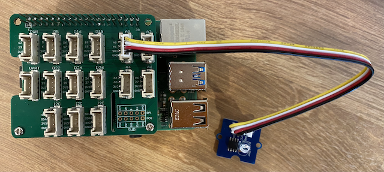

<!--
CO_OP_TRANSLATOR_METADATA:
{
  "original_hash": "ea733bd0cdf2479e082373f765a08678",
  "translation_date": "2025-08-26T23:22:10+00:00",
  "source_file": "1-getting-started/lessons/3-sensors-and-actuators/pi-sensor.md",
  "language_code": "mo"
}
-->
# 建造夜燈 - Raspberry Pi

在本課程中，您將為 Raspberry Pi 添加一個光線感測器。

## 硬體

本課程使用的感測器是**光線感測器**，它利用[光電二極管](https://wikipedia.org/wiki/Photodiode)將光轉換為電信號。這是一種類比感測器，會傳送一個介於 0 到 1,000 的整數值，表示相對的光量，但不對應於任何標準測量單位，例如 [lux](https://wikipedia.org/wiki/Lux)。

光線感測器是一個外部的 Grove 感測器，需要連接到 Raspberry Pi 上的 Grove Base hat。

### 連接光線感測器

用於檢測光線水平的 Grove 光線感測器需要連接到 Raspberry Pi。

#### 任務 - 連接光線感測器

連接光線感測器


1. 將 Grove 電纜的一端插入光線感測器模組上的插座。電纜只能以一種方向插入。

1. 在 Raspberry Pi 關閉電源的情況下，將 Grove 電纜的另一端連接到 Grove Base hat 上標記為 **A0** 的類比插座。此插座位於 GPIO 引腳旁邊的一排插座中，從右數第二個。



## 程式設計光線感測器

現在可以使用 Grove 光線感測器進行程式設計。

### 任務 - 程式設計光線感測器

程式設計裝置。

1. 啟動 Raspberry Pi，等待其完成啟動。

1. 在 VS Code 中打開您在本課程前一部分中建立的夜燈專案，可以直接在 Pi 上運行或使用 Remote SSH 擴展連接。

1. 打開 `app.py` 文件，並移除其中的所有程式碼。

1. 在 `app.py` 文件中添加以下程式碼以匯入所需的庫：

    ```python
    import time
    from grove.grove_light_sensor_v1_2 import GroveLightSensor
    ```

    `import time` 語句匯入了 `time` 模組，稍後在本課程中會使用。

    `from grove.grove_light_sensor_v1_2 import GroveLightSensor` 語句匯入了 Grove Python 庫中的 `GroveLightSensor`。此庫包含與 Grove 光線感測器互動的程式碼，並已在 Pi 設置期間全域安裝。

1. 在上述程式碼之後添加以下程式碼，以建立管理光線感測器的類別實例：

    ```python
    light_sensor = GroveLightSensor(0)
    ```

    `light_sensor = GroveLightSensor(0)` 這一行建立了一個 `GroveLightSensor` 類別的實例，並連接到 **A0** 引腳——光線感測器所連接的 Grove 類比引腳。

1. 在上述程式碼之後添加一個無限迴圈，用於輪詢光線感測器的值並將其輸出到控制台：

    ```python
    while True:
        light = light_sensor.light
        print('Light level:', light)
    ```

    這將使用 `GroveLightSensor` 類別的 `light` 屬性以 0-1,023 的範圍讀取當前光線水平。此屬性從引腳讀取類比值，然後將該值輸出到控制台。

1. 在迴圈的末尾添加一秒的短暫休眠，因為不需要持續檢查光線水平。休眠可以降低裝置的功耗。

    ```python
    time.sleep(1)
    ```

1. 從 VS Code 的終端執行以下命令以運行您的 Python 應用程式：

    ```sh
    python3 app.py
    ```

    光線值將輸出到控制台。遮住或移開光線感測器，值將發生變化：

    ```output
    pi@raspberrypi:~/nightlight $ python3 app.py 
    Light level: 634
    Light level: 634
    Light level: 634
    Light level: 230
    Light level: 104
    Light level: 290
    ```

> 💁 您可以在 [code-sensor/pi](../../../../../1-getting-started/lessons/3-sensors-and-actuators/code-sensor/pi) 資料夾中找到此程式碼。

😀 為您的夜燈程式添加感測器成功了！

---

**免責聲明**：  
本文件已使用 AI 翻譯服務 [Co-op Translator](https://github.com/Azure/co-op-translator) 進行翻譯。儘管我們努力確保翻譯的準確性，但請注意，自動翻譯可能包含錯誤或不準確之處。原始文件的母語版本應被視為權威來源。對於關鍵資訊，建議使用專業人工翻譯。我們對因使用此翻譯而引起的任何誤解或誤釋不承擔責任。