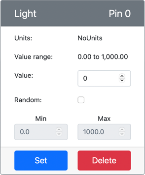

<!--
CO_OP_TRANSLATOR_METADATA:
{
  "original_hash": "11f10c6760fb8202cf368422702fdf70",
  "translation_date": "2025-08-26T23:30:34+00:00",
  "source_file": "1-getting-started/lessons/3-sensors-and-actuators/virtual-device-sensor.md",
  "language_code": "mo"
}
-->
# 建立夜燈 - 虛擬物聯網硬體

在本課程的這部分，你將為虛擬物聯網設備添加一個光線感測器。

## 虛擬硬體

夜燈需要一個感測器，這個感測器是在 CounterFit 應用程式中創建的。

這個感測器是一個**光線感測器**。在實體的物聯網設備中，它會是一個[光電二極體](https://wikipedia.org/wiki/Photodiode)，將光轉換為電信號。光線感測器是一種類比感測器，會傳送一個整數值，表示相對的光量，但這個值不會對應到任何標準的測量單位，例如 [lux](https://wikipedia.org/wiki/Lux)。

### 將感測器添加到 CounterFit

要使用虛擬光線感測器，你需要將它添加到 CounterFit 應用程式中。

#### 任務 - 將感測器添加到 CounterFit

將光線感測器添加到 CounterFit 應用程式中。

1. 確保 CounterFit 網頁應用程式正在運行（從本作業的上一部分開始）。如果沒有，請啟動它。

1. 創建一個光線感測器：

    1. 在 *Sensors* 面板的 *Create sensor* 框中，展開 *Sensor type* 下拉框，選擇 *Light*。

    1. 將 *Units* 保持為 *NoUnits*。

    1. 確保 *Pin* 設置為 *0*。

    1. 點擊 **Add** 按鈕，在 Pin 0 上創建光線感測器。

    

    光線感測器將被創建並顯示在感測器列表中。

    

## 編寫光線感測器程式

現在可以編寫程式來使用內建的光線感測器。

### 任務 - 編寫光線感測器程式

編寫設備程式。

1. 在 VS Code 中打開你在本作業上一部分中創建的夜燈專案。如果需要，關閉並重新創建終端機以確保它正在使用虛擬環境運行。

1. 打開 `app.py` 文件。

1. 在 `app.py` 文件的頂部，與其他 `import` 語句一起添加以下程式碼，以匯入一些必要的庫：

    ```python
    import time
    from counterfit_shims_grove.grove_light_sensor_v1_2 import GroveLightSensor
    ```

    `import time` 語句匯入了 Python 的 `time` 模組，稍後會在本作業中使用。

    `from counterfit_shims_grove.grove_light_sensor_v1_2 import GroveLightSensor` 語句匯入了 CounterFit Grove shim Python 庫中的 `GroveLightSensor`。這個庫包含與 CounterFit 應用程式中創建的光線感測器互動的程式碼。

1. 在文件底部添加以下程式碼，創建管理光線感測器的類別實例：

    ```python
    light_sensor = GroveLightSensor(0)
    ```

    `light_sensor = GroveLightSensor(0)` 這一行創建了一個 `GroveLightSensor` 類別的實例，連接到 **0** 號 Pin——這是 CounterFit Grove 中光線感測器連接的 Pin。

1. 在上述程式碼後添加一個無限迴圈，輪詢光線感測器的值並將其輸出到控制台：

    ```python
    while True:
        light = light_sensor.light
        print('Light level:', light)
    ```

    這段程式碼使用 `GroveLightSensor` 類別的 `light` 屬性讀取當前的光線水平。該屬性從 Pin 讀取類比值，然後將該值輸出到控制台。

1. 在 `while` 迴圈的末尾添加一個一秒的延遲，因為光線水平不需要被連續檢查。延遲可以減少設備的功耗。

    ```python
    time.sleep(1)
    ```

1. 在 VS Code 的終端機中運行以下命令來執行你的 Python 應用程式：

    ```sh
    python3 app.py
    ```

    光線值將輸出到控制台。最初這個值會是 0。

1. 在 CounterFit 應用程式中更改光線感測器的值，該值將被應用程式讀取。你可以通過以下兩種方式進行更改：

    * 在光線感測器的 *Value* 框中輸入一個數字，然後點擊 **Set** 按鈕。你輸入的數字將是感測器返回的值。

    * 勾選 *Random* 選項，並輸入 *Min* 和 *Max* 值，然後點擊 **Set** 按鈕。每次感測器讀取值時，它將讀取一個介於 *Min* 和 *Max* 之間的隨機數。

    你設置的值將輸出到控制台。更改 *Value* 或 *Random* 設置以使值發生變化。

    ```output
    (.venv) ➜  GroveTest python3 app.py 
    Light level: 143
    Light level: 244
    Light level: 246
    Light level: 253
    ```

> 💁 你可以在 [code-sensor/virtual-device](../../../../../1-getting-started/lessons/3-sensors-and-actuators/code-sensor/virtual-device) 資料夾中找到這段程式碼。

😀 你的夜燈程式成功運行了！

---

**免責聲明**：  
本文件已使用 AI 翻譯服務 [Co-op Translator](https://github.com/Azure/co-op-translator) 進行翻譯。儘管我們努力確保翻譯的準確性，但請注意，自動翻譯可能包含錯誤或不準確之處。原始文件的母語版本應被視為權威來源。對於關鍵信息，建議使用專業人工翻譯。我們對因使用此翻譯而引起的任何誤解或誤釋不承擔責任。