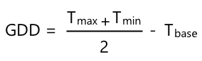

<!--
CO_OP_TRANSLATOR_METADATA:
{
  "original_hash": "d105b44deae539165855c976dcdeca99",
  "translation_date": "2025-08-26T22:15:05+00:00",
  "source_file": "2-farm/lessons/1-predict-plant-growth/README.md",
  "language_code": "mo"
}
-->
## 使用物聯網預測植物生長


> 手繪筆記由 [Nitya Narasimhan](https://github.com/nitya) 提供。點擊圖片查看更大版本。

## 課前測驗

[課前測驗](https://black-meadow-040d15503.1.azurestaticapps.net/quiz/9)

## 簡介

植物需要某些條件才能生長——水、二氧化碳、養分、光和熱。在本課程中，您將學習如何通過測量空氣溫度來計算植物的生長和成熟速度。

本課程將涵蓋以下內容：

* [數字農業](../../../../../2-farm/lessons/1-predict-plant-growth)
* [溫度在農業中的重要性](../../../../../2-farm/lessons/1-predict-plant-growth)
* [測量環境溫度](../../../../../2-farm/lessons/1-predict-plant-growth)
* [生長度日 (GDD)](../../../../../2-farm/lessons/1-predict-plant-growth)
* [使用溫度傳感器數據計算 GDD](../../../../../2-farm/lessons/1-predict-plant-growth)

## 數字農業

數字農業正在改變我們的耕作方式，通過工具收集、存儲和分析農業數據。我們目前正處於世界經濟論壇所描述的“第四次工業革命”時期，而數字農業的興起被稱為“第四次農業革命”或“農業 4.0”。

> 🎓 “數字農業”這個術語還包括整個“農業價值鏈”，即從農場到餐桌的整個過程。它包括在食品運輸和加工過程中追蹤產品質量、倉庫和電子商務系統，甚至拖拉機租賃應用程序！

這些變化使農民能夠提高產量，減少化肥和農藥的使用，並更有效地利用水資源。雖然主要在富裕國家使用，但傳感器和其他設備的價格正在逐漸下降，使其在發展中國家也越來越容易獲得。

數字農業支持的一些技術包括：

* 溫度測量——測量溫度使農民能夠預測植物的生長和成熟。
* 自動灌溉——測量土壤濕度並在土壤過於乾燥時啟動灌溉系統，而不是定時灌溉。定時灌溉可能導致作物在炎熱乾燥的時期缺水，或在下雨時過度灌溉。通過僅在土壤需要時灌溉，農民可以優化水的使用。
* 害蟲控制——農民可以使用自動機器人或無人機上的攝像頭檢查害蟲，然後僅在需要的地方施用農藥，減少農藥的使用量並減少農藥流入當地水源。

✅ 做一些研究。還有哪些技術可以用來提高農業產量？

> 🎓 “精準農業”這個術語用來描述基於每塊田地甚至田地的一部分進行觀察、測量和響應。這包括測量水分、養分和害蟲水平並準確響應，例如僅灌溉田地的一小部分。

## 溫度在農業中的重要性

在學習植物時，大多數學生都會學到水、光、二氧化碳和養分的重要性。植物還需要溫暖才能生長——這就是為什麼植物在春天隨著溫度升高而開花，為什麼雪花蓮或水仙花會因短暫的暖和天氣而提前萌芽，以及為什麼溫室和暖房能促進植物生長。

> 🎓 暖房和溫室的功能相似，但有一個重要的區別。暖房是人工加熱的，能讓農民更精確地控制溫度；溫室則依賴陽光提供溫暖，通常只能通過窗戶或其他開口來排熱。

植物有基礎溫度、最佳溫度和最高溫度，這些溫度值基於每日平均溫度。

* 基礎溫度——這是植物生長所需的最低每日平均溫度。
* 最佳溫度——這是植物生長最快的最佳每日平均溫度。
* 最高溫度——這是植物能承受的最高溫度。超過此溫度，植物會停止生長以保存水分並維持生命。

> 💁 這些是平均溫度，基於白天和夜晚的溫度平均值。植物還需要白天和夜晚的不同溫度，以便更有效地進行光合作用並在夜晚節省能量。

每種植物的基礎溫度、最佳溫度和最高溫度值都不同。這就是為什麼有些植物在熱帶國家生長良好，而有些植物則適合寒冷的國家。

✅ 做一些研究。看看您花園、學校或當地公園中的植物，是否能找到它們的基礎溫度。


上圖顯示了一個生長率與溫度的關係示例圖表。在基礎溫度以下，植物不會生長。生長率在最佳溫度時達到峰值，然後在超過此溫度後下降。在最高溫度時，生長停止。

此圖表的形狀因植物種類而異。有些植物在最佳溫度以上的下降更陡峭，有些植物從基礎溫度到最佳溫度的上升更緩慢。

> 💁 農民要想獲得最佳生長效果，需要了解植物的三個溫度值以及它們的圖表形狀。

如果農民能控制溫度，例如在商業暖房中，他們就可以為植物進行最佳化。例如，商業暖房中種植的番茄白天溫度設置為約 25°C，夜間設置為約 20°C，以獲得最快的生長速度。

> 🍅 結合這些溫度值、人工光源、肥料和受控的二氧化碳水平，商業種植者可以全年種植和收穫。

## 測量環境溫度

溫度傳感器可以與物聯網設備一起使用來測量環境溫度。

### 任務 - 測量溫度

按照相關指南使用您的物聯網設備監測溫度：

* [Arduino - Wio Terminal](wio-terminal-temp.md)
* [單板電腦 - Raspberry Pi](pi-temp.md)
* [單板電腦 - 虛擬設備](virtual-device-temp.md)

## 生長度日 (GDD)

生長度日（也稱為生長度單位）是一種基於溫度測量植物生長的方法。假設植物有足夠的水分、養分和二氧化碳，溫度決定了生長速度。

生長度日（GDD）每天計算，作為一天的平均溫度（以攝氏度計算）超過植物基礎溫度的部分。每種植物需要一定數量的 GDD 才能生長、開花或成熟並產出作物。每天的 GDD 越多，植物生長越快。

> 🇺🇸 對於美國人來說，生長度日也可以用華氏度計算。5 GDD（以攝氏度計算）相當於 9 GDD（以華氏度計算）。

完整的 GDD 計算公式稍微複雜，但通常使用簡化公式作為良好的近似值：



* **GDD** - 生長度日的數量
* **T max** - 每日最高溫度（攝氏度）
* **T min** - 每日最低溫度（攝氏度）
* **T base** - 植物的基礎溫度（攝氏度）

> 💁 有些變體處理 T max 超過 30°C 或 T min 低於 T base 的情況，但我們暫時忽略這些。

### 示例 - 玉米 🌽

根據品種不同，玉米（或稱為玉蜀黍）需要 800 到 2,700 GDD 才能成熟，基礎溫度為 10°C。

在基礎溫度以上的第一天，測得以下溫度：

| 測量值 | 溫度 °C |
| :----- | :-----: |
| 最高溫度 | 16      |
| 最低溫度 | 12      |

將這些數值代入公式：

* T max = 16
* T min = 12
* T base = 10

計算結果為：


玉米在那一天獲得了 4 GDD。假設一種需要 800 GDD 才能成熟的玉米品種，它還需要 796 GDD 才能達到成熟。

✅ 做一些研究。看看您花園、學校或當地公園中的植物，是否能找到它們成熟或產出作物所需的 GDD 數量。

## 使用溫度傳感器數據計算 GDD

植物的生長並不是固定日期的——例如，您不能種下一顆種子並確定植物會在 100 天後準確結果。相反，農民可以大致了解植物的生長時間，然後每天檢查作物是否準備好。

在大型農場中，這會對勞動力產生巨大影響，並且農民可能會錯過意外提前成熟的作物。通過測量溫度，農民可以計算植物獲得的 GDD，從而只需在接近預期成熟時進行檢查。

通過使用物聯網設備收集溫度數據，農民可以在植物接近成熟時自動收到通知。典型的架構是物聯網設備測量溫度，然後使用類似 MQTT 的技術通過互聯網發布這些遙測數據。服務器代碼會監聽這些數據並將其保存到某個地方，例如數據庫。這樣，數據可以稍後進行分析，例如每天晚上計算當天的 GDD，累計每種作物的 GDD，並在植物接近成熟時發出警報。


服務器代碼還可以增強數據，添加額外的信息。例如，物聯網設備可以發布一個標識符來指示是哪個設備，服務器代碼可以使用此標識符查找設備的位置以及它正在監測的作物。它還可以添加基本數據，例如當前時間，因為某些物聯網設備沒有必要的硬件來準確跟蹤時間，或者需要額外的代碼通過互聯網讀取當前時間。

✅ 您認為為什麼不同的田地可能會有不同的溫度？

### 任務 - 發布溫度信息

按照相關指南使用您的物聯網設備通過 MQTT 發布溫度數據，以便稍後進行分析：

* [Arduino - Wio Terminal](wio-terminal-temp-publish.md)
* [單板電腦 - Raspberry Pi/虛擬物聯網設備](single-board-computer-temp-publish.md)

### 任務 - 捕獲並存儲溫度信息

一旦物聯網設備開始發布遙測數據，服務器代碼可以編寫來訂閱這些數據並存儲它們。服務器代碼將數據保存到逗號分隔值 (CSV) 文件，而不是保存到數據庫。CSV 文件以文本形式存儲數據，每行是一條記錄，每個值由逗號分隔。它是一種方便、可讀性高且支持良好的文件存儲方式。

CSV 文件將有兩列——*日期* 和 *溫度*。*日期* 列設置為服務器接收到消息的當前日期和時間，*溫度* 來自遙測消息。

1. 重複第 4 課中的步驟，創建服務器代碼以訂閱遙測數據。您不需要添加發布命令的代碼。

    這些步驟包括：

    * 配置並激活 Python 虛擬環境

    * 安裝 paho-mqtt pip 套件

    * 編寫代碼以監聽發布到遙測主題的 MQTT 消息

      > ⚠️ 如果需要，您可以參考 [第 4 課中創建 Python 應用程序以接收遙測數據的說明](../../../1-getting-started/lessons/4-connect-internet/README.md#receive-telemetry-from-the-mqtt-broker)。

    將此項目的文件夾命名為 `temperature-sensor-server`。

1. 確保 `client_name` 反映此項目：

    ```cpp
    client_name = id + 'temperature_sensor_server'
    ```

1. 在文件頂部的現有導入語句下添加以下導入：

    ```python
    from os import path
    import csv
    from datetime import datetime
    ```

    這導入了一個用於讀取文件的庫、一個與 CSV 文件交互的庫，以及一個幫助處理日期和時間的庫。

1. 在 `handle_telemetry` 函數之前添加以下代碼：

    ```python
    temperature_file_name = 'temperature.csv'
    fieldnames = ['date', 'temperature']
    
    if not path.exists(temperature_file_name):
        with open(temperature_file_name, mode='w') as csv_file:
            writer = csv.DictWriter(csv_file, fieldnames=fieldnames)
            writer.writeheader()
    ```

    此代碼聲明了一些常量，用於指定要寫入的文件名以及 CSV 文件的列標題名稱。CSV 文件的第一行通常包含用逗號分隔的列標題。

    然後代碼檢查 CSV 文件是否已存在。如果不存在，則創建該文件並在第一行添加列標題。

1. 在 `handle_telemetry` 函數末尾添加以下代碼：

    ```python
    with open(temperature_file_name, mode='a') as temperature_file:        
        temperature_writer = csv.DictWriter(temperature_file, fieldnames=fieldnames)
        temperature_writer.writerow({'date' : datetime.now().astimezone().replace(microsecond=0).isoformat(), 'temperature' : payload['temperature']})
    ```
此程式碼會開啟 CSV 檔案，然後在最後新增一列資料。這一列包含以人類可讀格式顯示的當前日期和時間，接著是從 IoT 裝置接收到的溫度數據。資料會以 [ISO 8601 格式](https://wikipedia.org/wiki/ISO_8601) 儲存，包含時區資訊，但不包含微秒。

1. 像之前一樣執行此程式，確保你的 IoT 裝置正在傳送數據。一個名為 `temperature.csv` 的 CSV 檔案會在相同的資料夾中建立。打開檔案後，你會看到日期/時間和溫度測量值：

    ```output
    date,temperature
    2021-04-19T17:21:36-07:00,25
    2021-04-19T17:31:36-07:00,24
    2021-04-19T17:41:36-07:00,25
    ```

1. 執行此程式一段時間以收集數據。理想情況下，你應該執行一整天以收集足夠的數據來進行 GDD 計算。

    
> 💁 如果你使用的是虛擬 IoT 裝置，請勾選隨機選項並設定一個範圍，以避免每次返回的溫度值都相同。
     

    > 💁 如果你想執行一整天，請確保執行伺服器程式的電腦不會進入睡眠模式，可以透過更改電源設定，或者執行類似 [這個保持系統活躍的 Python 腳本](https://github.com/jaqsparow/keep-system-active) 來實現。
    
> 💁 你可以在 [code-server/temperature-sensor-server](../../../../../2-farm/lessons/1-predict-plant-growth/code-server/temperature-sensor-server) 資料夾中找到這段程式碼。

### 任務 - 使用儲存的數據計算 GDD

當伺服器捕捉到溫度數據後，可以計算植物的 GDD。

手動執行的步驟如下：

1. 找到植物的基準溫度。例如，草莓的基準溫度是 10°C。

1. 從 `temperature.csv` 中找到當天的最高和最低溫度。

1. 使用之前提到的 GDD 計算公式來計算 GDD。

例如，如果當天的最高溫度是 25°C，最低溫度是 12°C：


* 25 + 12 = 37
* 37 / 2 = 18.5
* 18.5 - 10 = 8.5

因此，草莓獲得了 **8.5** GDD。草莓需要大約 250 GDD 才能結果，所以還需要一段時間。

---

## 🚀 挑戰

植物的生長不僅需要熱量，還需要其他條件。還需要哪些條件？

針對這些條件，找找是否有感測器可以測量它們。有沒有執行器可以控制這些條件的水平？你會如何組合一個或多個 IoT 裝置來優化植物的生長？

## 課後測驗

[課後測驗](https://black-meadow-040d15503.1.azurestaticapps.net/quiz/10)

## 複習與自學

* 在 [數位農業維基百科頁面](https://wikipedia.org/wiki/Digital_agriculture) 閱讀更多關於數位農業的資訊。同時也可以在 [精準農業維基百科頁面](https://wikipedia.org/wiki/Precision_agriculture) 閱讀更多關於精準農業的內容。
* 完整的生長度日計算比這裡提供的簡化公式更為複雜。閱讀更多關於更複雜的公式以及如何處理低於基準溫度的情況，請參考 [生長度日維基百科頁面](https://wikipedia.org/wiki/Growing_degree-day)。
* 如果我們仍然使用相同的農業方法，未來可能會面臨糧食短缺的問題。了解更多關於高科技農業技術，請觀看這段 [未來高科技農場的 YouTube 影片](https://www.youtube.com/watch?v=KIEOuKD9KX8)。

## 作業

[使用 Jupyter Notebook 視覺化 GDD 數據](assignment.md)

---

**免責聲明**：  
本文件已使用 AI 翻譯服務 [Co-op Translator](https://github.com/Azure/co-op-translator) 進行翻譯。雖然我們致力於提供準確的翻譯，但請注意，自動翻譯可能包含錯誤或不準確之處。原始文件的母語版本應被視為權威來源。對於關鍵資訊，建議尋求專業人工翻譯。我們對因使用此翻譯而引起的任何誤解或誤釋不承擔責任。