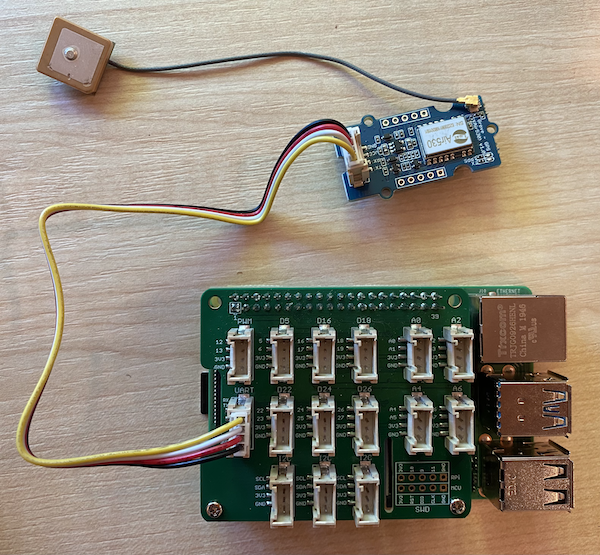

<!--
CO_OP_TRANSLATOR_METADATA:
{
  "original_hash": "3b2448c7ab4e9673e77e35a50c5e350d",
  "translation_date": "2025-08-27T00:51:22+00:00",
  "source_file": "3-transport/lessons/1-location-tracking/pi-gps-sensor.md",
  "language_code": "mo"
}
-->
# 讀取 GPS 數據 - Raspberry Pi

在本課程中，您將為 Raspberry Pi 添加一個 GPS 感測器，並從中讀取數據。

## 硬體

Raspberry Pi 需要一個 GPS 感測器。

您將使用的感測器是 [Grove GPS Air530 感測器](https://www.seeedstudio.com/Grove-GPS-Air530-p-4584.html)。這款感測器可以連接到多個 GPS 系統，以快速且準確地定位。感測器由兩部分組成——感測器的核心電子元件，以及通過細線連接的外部天線，用於接收來自衛星的無線電波。

這是一個 UART 感測器，因此會通過 UART 傳輸 GPS 數據。

## 連接 GPS 感測器

Grove GPS 感測器可以連接到 Raspberry Pi。

### 任務 - 連接 GPS 感測器

連接 GPS 感測器。


1. 將 Grove 電纜的一端插入 GPS 感測器上的插槽。它只能以一種方式插入。

1. 在 Raspberry Pi 關機的情況下，將 Grove 電纜的另一端連接到安裝在 Pi 上的 Grove Base Hat 上標有 **UART** 的 UART 插槽。該插槽位於中間排，靠近 SD 卡插槽的一側，與 USB 埠和乙太網插槽相對的一端。

    

1. 將 GPS 感測器放置在附加天線可以看到天空的位置——理想情況下靠近窗戶或在戶外。天線周圍沒有障礙物時，信號會更清晰。

## 編程 GPS 感測器

現在可以為 Raspberry Pi 編寫程式，以使用連接的 GPS 感測器。

### 任務 - 編程 GPS 感測器

編寫設備程式。

1. 啟動 Raspberry Pi，並等待其啟動完成。

1. GPS 感測器有兩個 LED 指示燈——藍色 LED 在傳輸數據時閃爍，綠色 LED 在接收到來自衛星的數據時每秒閃爍一次。啟動 Raspberry Pi 時，確保藍色 LED 閃爍。幾分鐘後，綠色 LED 會開始閃爍——如果沒有，您可能需要重新調整天線的位置。

1. 啟動 VS Code，可以直接在 Raspberry Pi 上啟動，也可以通過 Remote SSH 擴展連接。

    > ⚠️ 如果需要，您可以參考[第 1 課中有關設置和啟動 VS Code 的說明](../../../1-getting-started/lessons/1-introduction-to-iot/pi.md)。

1. 對於支持藍牙的新版本 Raspberry Pi，藍牙使用的串口與 Grove UART 埠使用的串口會發生衝突。為了解決這個問題，請執行以下操作：

    1. 在 VS Code 的終端中，使用以下命令通過 `nano` 編輯 `/boot/config.txt` 文件，`nano` 是內建的終端文字編輯器：

        ```sh
        sudo nano /boot/config.txt
        ```

        > 由於需要使用 `sudo` 權限（提升的權限）來編輯此文件，因此無法直接通過 VS Code 編輯。

    1. 使用方向鍵移動到文件末尾，然後複製以下代碼並粘貼到文件末尾：

        ```ini
        dtoverlay=pi3-miniuart-bt
        dtoverlay=pi3-disable-bt
        enable_uart=1
        ```

        您可以使用設備的常規鍵盤快捷鍵粘貼（Windows、Linux 或 Raspberry Pi OS 上為 `Ctrl+v`，macOS 上為 `Cmd+v`）。

    1. 按 `Ctrl+x` 保存文件並退出 nano。當系統詢問是否保存修改的緩衝區時，按 `y`，然後按 `Enter` 確認覆蓋 `/boot/config.txt`。

        > 如果出現錯誤，您可以選擇不保存退出，然後重複這些步驟。

    1. 使用以下命令在 nano 中編輯 `/boot/cmdline.txt` 文件：

        ```sh
        sudo nano /boot/cmdline.txt
        ```

    1. 該文件包含多個用空格分隔的鍵/值對。刪除鍵為 `console` 的所有鍵/值對。它們可能看起來像這樣：

        ```output
        console=serial0,115200 console=tty1 
        ```

        您可以使用方向鍵導航到這些條目，然後使用常規的 `del` 或 `backspace` 鍵刪除。

        例如，如果原始文件如下所示：

        ```output
        console=serial0,115200 console=tty1 root=PARTUUID=058e2867-02 rootfstype=ext4 elevator=deadline fsck.repair=yes rootwait
        ```

        新版本將如下所示：

        ```output
        root=PARTUUID=058e2867-02 rootfstype=ext4 elevator=deadline fsck.repair=yes rootwait
        ```

    1. 按照上述步驟保存文件並退出 nano。

    1. 重新啟動 Raspberry Pi，然後在 Pi 重啟後重新連接到 VS Code。

1. 在終端中，為 `pi` 用戶的主目錄創建一個名為 `gps-sensor` 的新文件夾。在該文件夾中創建一個名為 `app.py` 的文件。

1. 在 VS Code 中打開該文件夾。

1. GPS 模組通過串口發送 UART 數據。安裝 `pyserial` Pip 套件，以便從 Python 程式碼與串口通信：

    ```sh
    pip3 install pyserial
    ```

1. 將以下代碼添加到您的 `app.py` 文件中：

    ```python
    import time
    import serial
    
    serial = serial.Serial('/dev/ttyAMA0', 9600, timeout=1)
    serial.reset_input_buffer()
    serial.flush()
    
    def print_gps_data(line):
        print(line.rstrip())
    
    while True:
        line = serial.readline().decode('utf-8')
    
        while len(line) > 0:
            print_gps_data(line)
            line = serial.readline().decode('utf-8')
    
        time.sleep(1)
    ```

    此代碼從 `pyserial` Pip 套件中導入 `serial` 模組。然後，它連接到 `/dev/ttyAMA0` 串口——這是 Grove Pi Base Hat 用於其 UART 埠的串口地址。接著，它清除該串口的任何現有數據。

    接下來，定義了一個名為 `print_gps_data` 的函數，用於將傳遞給它的行打印到控制台。

    然後，代碼進行無限循環，在每次循環中從串口讀取盡可能多的文本行。對於每一行，它都會調用 `print_gps_data` 函數。

    在讀取所有數據後，循環會休眠 1 秒，然後再次嘗試。

1. 運行此代碼。您將看到來自 GPS 感測器的原始輸出，類似於以下內容：

    ```output
    $GNGGA,020604.001,4738.538654,N,12208.341758,W,1,3,,164.7,M,-17.1,M,,*67
    $GPGSA,A,1,,,,,,,,,,,,,,,*1E
    $BDGSA,A,1,,,,,,,,,,,,,,,*0F
    $GPGSV,1,1,00*79
    $BDGSV,1,1,00*68
    ```

    > 如果在停止並重新啟動代碼時遇到以下錯誤之一，請在您的 while 循環中添加一個 `try - except` 塊。

      ```output
      UnicodeDecodeError: 'utf-8' codec can't decode byte 0x93 in position 0: invalid start byte
      UnicodeDecodeError: 'utf-8' codec can't decode byte 0xf1 in position 0: invalid continuation byte
      ```

    ```python
    while True:
        try:
            line = serial.readline().decode('utf-8')
              
            while len(line) > 0:
                print_gps_data()
                line = serial.readline().decode('utf-8')
      
        # There's a random chance the first byte being read is part way through a character.
        # Read another full line and continue.

        except UnicodeDecodeError:
            line = serial.readline().decode('utf-8')

    time.sleep(1)
    ```

> 💁 您可以在 [code-gps/pi](../../../../../3-transport/lessons/1-location-tracking/code-gps/pi) 文件夾中找到此代碼。

😀 恭喜！您的 GPS 感測器程式運行成功！

---

**免責聲明**：  
本文件已使用 AI 翻譯服務 [Co-op Translator](https://github.com/Azure/co-op-translator) 進行翻譯。儘管我們努力確保翻譯的準確性，但請注意，自動翻譯可能包含錯誤或不準確之處。原始文件的母語版本應被視為權威來源。對於關鍵信息，建議使用專業人工翻譯。我們對因使用此翻譯而引起的任何誤解或誤釋不承擔責任。